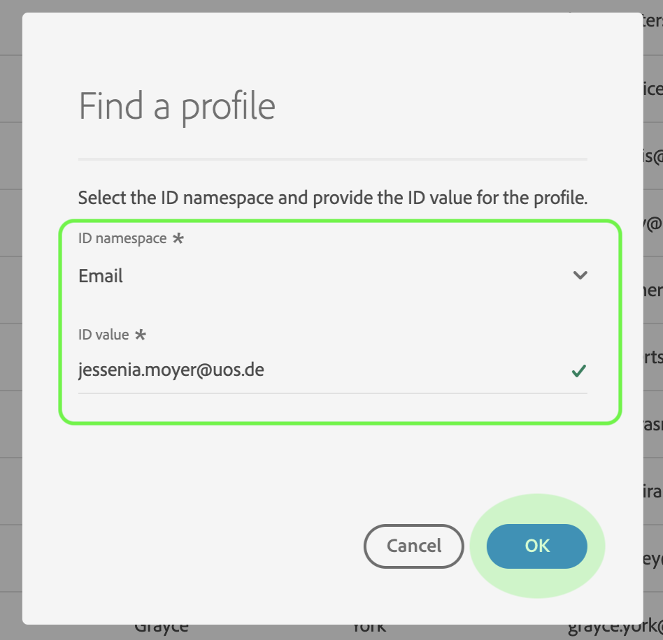

# リアルタイム顧客プロファイルユーザガイド

リアルタイム顧客プロファイルは、オンライン、オフライン、CRM、サードパーティデータなど複数のチャネルからのデータを組み合わせて、個々の顧客の全体像を作成します。

このドキュメントは、Adobe Experience Platformユーザーインターフェイスでリアルタイム顧客プロファイルと対話するためのガイドとして機能します。

## はじめに

このユーザガイドでは、リアルタイム顧客管理の管理に関連する様々なExperience Platformサービスについて理解している必要があります。プロファイルガイド このユーザガイドを読む前に、次のサービスのドキュメントを確認してください。

* [リアルタイム顧客プロファイル](../home.md):複数のソースからの集計データに基づいて、統合されたリアルタイムのプロファイルを顧客に提供します。
* [IDサービス](../../identity-service/home.md):異なるデータソースのIDをPlatformに取り込むことで、リアルタイムの顧客プロファイルを有効にします。
* [エクスペリエンスデータモデル(XDM)](../../xdm/home.md):プラットフォームが顧客エクスペリエンスデータを整理する際に使用する標準化されたフレームワーク。

## プロファイルの概要

Experience Platform UIで、左側のナビゲー [ションの](http://platform.adobe.com)「プロファイル」をクリックし、 ****____ プロファイルワークスペースの「概要」タブを開きます。 このタブには、プロファイルストアに関する高レベルな情報を提供するオーディエンスがいくつか表示されます。この情報には、アドレス可能なプロファイルの合計数、先週取り込まれたウィジェットの数、同じ期間の成功および失敗したレコードに関する統計が含まれます。

## 表示プロファイルサンプル

[参照]をク **リックし** 、表示で使用可能なリストのサンプルプロファイルを選択します。 このサンプルには、合計プロファイル数から50個までの [プロファイルが含まれます](#profile-count)。 サンプルは、取り込まれると新しいジョブデータを取得する自動プロファイルによって更新されます。 リストされた各プロファイルには、ID、姓、名および個人の電子メールが表示されます。 リストに表示されたプロファイルのIDをクリックすると、その詳細が [プロファイルビューアに表示されま](#profile-viewer)す。

列セレクターアイコンをクリックして、リストに表示される属性をカスタマイズできます。 これにより、追加または削除できる共通のプロファイル属性を含むドロップダウンリストが表示されます。

### プロファイル数 {#profile-count}

プロファイル数には、組織のデフォルトの結合ポリシーがプロファイルフラグメントと結合され、各顧客の単一のプロファイルが形成された後に、組織がExperience Platform内で持つプロファイルの合計数が表示されます。 つまり、様々なチャネルでブランドとやり取りする1人の顧客に関連する複数のプロファイルフラグメントが組織に存在する場合でも、これらのフラグメントは（デフォルトの結合ポリシーに従って）結合され、「1」プロファイルの数が返されます。

プロファイル数には、属性（レコードデータ）を持つプロファイルと、時系列(イベント)データのみを含むプロファイル(Adobe Analyticsプロファイルなど)の両方も含まれます。 カウントは定期的に更新され、プラットフォーム内のプロファイルの合計数が最新の状態になります。 プロファイルの取り込みがカウントを5%以上増減すると、常にジョブが自動的にトリガーされ、カウントが更新されます。 組織でストリーミング取り込みを使用している場合、新しく取り込んだデータを取得するために、ジョブが毎時実行されるようにスケジュールされます。

### プロファイル検索

特定のプロファイル（電子メールアドレスなど）のリンクされたIDがわかっている場合は、「プロファイルを検索」をクリックして **プロファイルを検索できます**。 これは、サンプルのリストに表示されるかどうかに関係なく、特定のプロファイルにアクセスする最も信頼性の高い方法です。

表示されるダイアログで、ドロップダウンリストから適切なID名前空間（この例では「Email」）を選択し、下にID値を入力してから、「 **OK」をクリックします**。 見つかった場合は、次の節で説明するように、対象のプロファイルの詳細がプロファイルビューアに表示されます。

### プロファイルビューア {#profile-viewer}

特定のプロファイルを選択または検索すると、 _プロファイル_ ・ビューアの詳細画面が開きます。 このページには、選択したプロファイルに関する情報(プロファイルの基本属性、リンクされたID、使用可能な連絡先チャネルなど)が表示されます。 表示されるプロファイル情報は、複数のプロファイルフラグメントから結合され、個々の顧客の単一の表示を形成しています。

プロファイルビューアには、このプロファイルに関連付けられているメンバーシップ（存在する場合）を表示およびセグメントイベントできるタブも用意されています。

## 結合ポリシー

「ポリシ **ーの結合** 」をクリックして、組織に属する結合ポリシーのリストを表示します。 表示される各ポリシーの名前、デフォルトのマージポリシーかどうか、および適用先のスキーマが表示されます。

UIでの結合ポリシーの操作について詳しくは、mMerge Policiesユーザーガイド [を参照してください](merge-policies.md)。

## 和集合スキーマ

[ **和集合スキーマ** ]をクリックして、表示の和集合スキーマをプロファイルします。 和集合スキーマとは、同じクラスに属するすべてのExperience Data Model(XDM)フィールドを統合したもので、そのスキーマがリアルタイム顧客プロファイルで使用できるようになっています。 左側のクラスをクリックして、リスト内の和集合スキーマの構造を表示します。

和集合のスキーマとリアルタイム顧客の [プロファイルでのその役割について詳しくは](../../xdm/schema/composition.md) 、スキーマ構成ガイドの「和集合のスキーマ」の節を参照してください。

## 次の手順

このガイドを読むことで、Experience Platform UIを使用してプロファイルデータの表示方法と管理方法を理解できます。 リアルタイム顧客プロファイルデータを利用して顧客セグメントを生成する方法について詳しくは、セグメント化のドキュメントを参 [照してくださ](../../segmentation/home.md)い。