# [!DNL Real-Time Customer Profile] UI ガイド

[!DNL Real-Time Customer Profile] は、オンライン、オフライン、CRM、サードパーティデータなど複数のチャネルからのデータを組み合わせて、個々の顧客の全体像を作成します。 このドキュメントは、Adobe Experience Platform ユーザーインターフェイス（UI）で [!DNL Real-Time Customer Profile] データを操作するためのガイドとして機能します。

## はじめに

この UI ガイドを使用するには、[!DNL Experience Platform] の管理に関連する様々な [!DNL Real-Time Customer Profiles] サービスについて理解している必要があります。 このガイドを読む前、または UI を使用する前に、次のサービスのドキュメントを確認してください。

* [[!DNL Real-Time Customer Profile]  概要 &#x200B;](../home.md)：複数のソースから集計したデータに基づいて、統合されたリアルタイム顧客プロファイルを提供します。
* [[!DNL Identity Service]](../../identity-service/home.md):[!DNL Real-Time Customer Profile] に取り込まれる際に、異なるデータソースの ID を結合することで、[!DNL Experience Platform] を有効にします。
* [[!DNL Experience Data Model (XDM)]](../../xdm/home.md)：[!DNL Experience Platform] が、カスタマーエクスペリエンスデータを整理する際に使用する、標準化されたフレームワーク。

## [!UICONTROL Overview]

Experience Platform UI で、左側のナビゲーションで「**[!UICONTROL Profiles]**」を選択して、「**[!UICONTROL Overview]**」タブを開き、プロファイルダッシュボードを表示します。

>[!NOTE]
>
>Experience Platformを初めて使用する組織で、アクティブなプロファイルデータセットや結合ポリシーが作成されていない場合は、[!UICONTROL Profiles] ダッシュボードは表示されません。 代わりに、「[!UICONTROL Overview]」タブに、リアルタイム顧客プロファイルを初めて使用する際に役立つリンクやドキュメントが表示されます。

### プロファイルダッシュボード {#profile-dashboard}

プロファイルダッシュボードは、組織のプロファイルデータに関連する主要指標の概要を示します。

詳しくは、[&#x200B; プロファイルダッシュボードガイド &#x200B;](../../dashboards/guides/profiles.md) を参照してください。

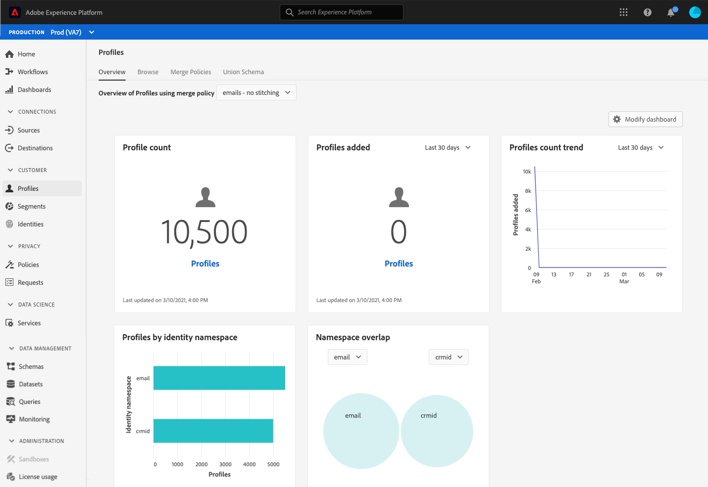

## 「[!UICONTROL Browse]」タブ

「**[!UICONTROL Browse]**」タブでは、切り替えを選択して、プロファイルを **カード** ビューまたは **テーブル** ビューで表示できます。

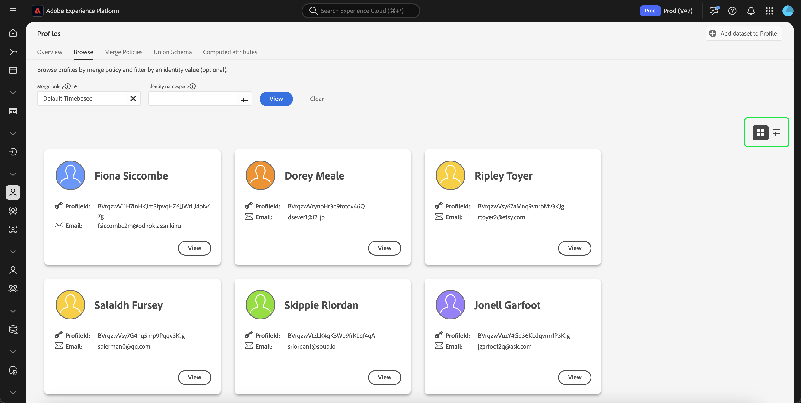

さらに、結合ポリシーを使用してプロファイルを参照したり、ID 名前空間と値を使用して特定のプロファイルを検索したりできます。

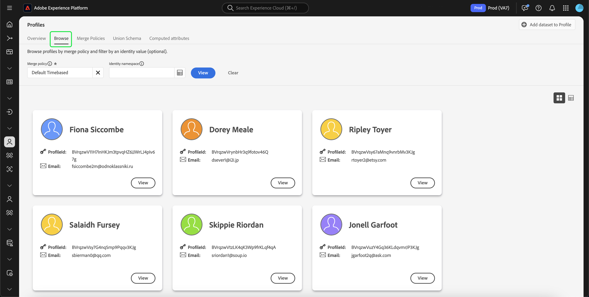

### [!UICONTROL Merge policy] で参照

「**[!UICONTROL Browse]**」タブは、デフォルトで組織のデフォルトの結合ポリシーに設定されています。 別の結合ポリシーを選択するには、結合ポリシー名の横にある `X` を選択し、セレクターを使用して結合ダイアログを開 **[!UICONTROL Select merge policy]** ます。

>[!NOTE]
>
>結合ポリシーが選択されていない場合は、**[!UICONTROL Merge policy]** フィールドの横にあるセレクターボタンを使用して、選択ダイアログを開きます。

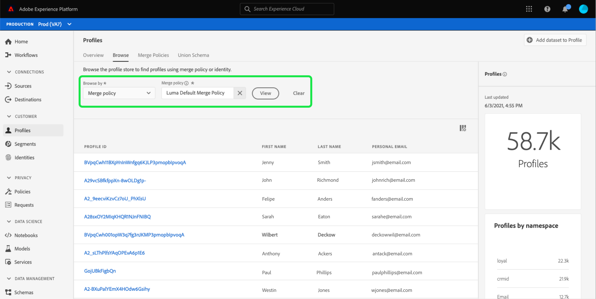

**[!UICONTROL Select merge policy]** ダイアログで結合ポリシーを選択するには、ポリシー名の横のラジオボタンを選択し、**[!UICONTROL Select]** を使用して「[!UICONTROL Browse]」タブに戻ります。 その後、**[!UICONTROL View]** を選択してサンプルプロファイルを更新し、新しい結合ポリシーが適用されたプロファイルのサンプリングを確認できます。

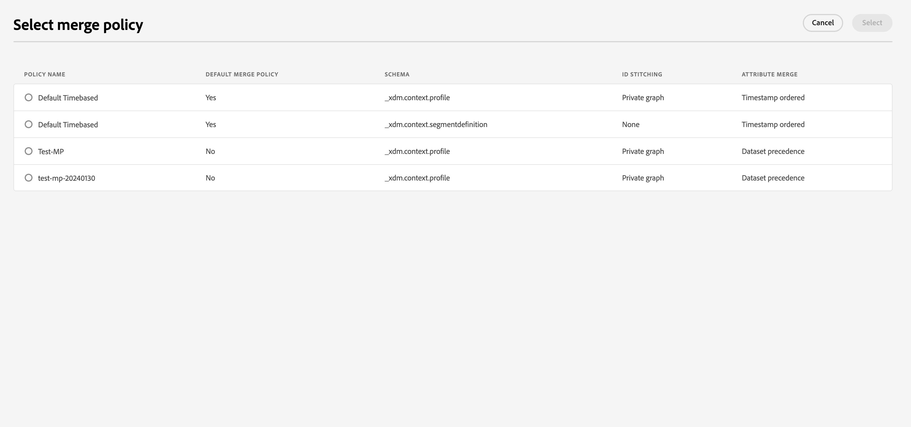

表示されるプロファイルは、選択した結合ポリシーが適用された後、組織のプロファイルストアからの最大 20 個のプロファイルのサンプルを表します。 組織のプロファイルストアに新しいデータが追加されると、選択した結合ポリシーのサンプルプロファイルが更新されます。

サンプルプロファイルの 1 つの詳細を表示するには、**[!UICONTROL Profile ID]** を選択します。 詳しくは、このガイドの後半の [&#x200B; プロファイルの詳細の表示 &#x200B;](#profile-detail) 節を参照してください。

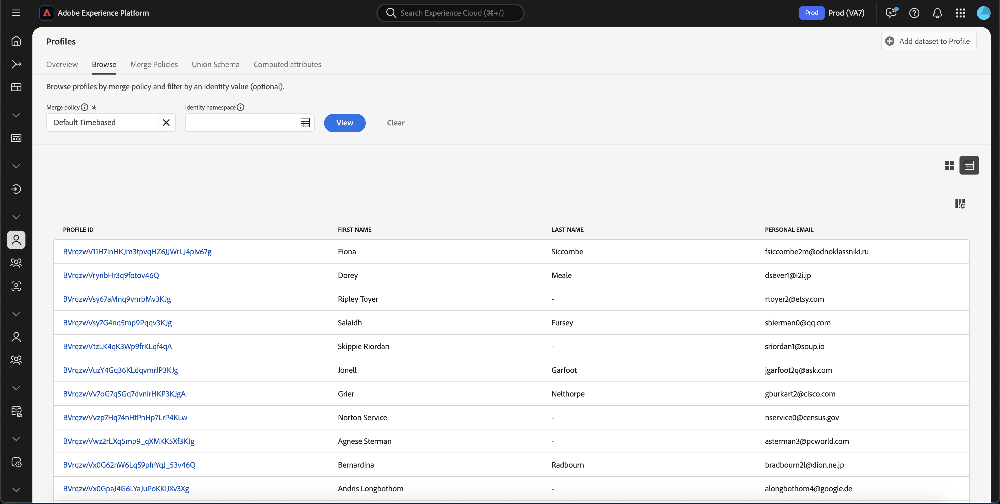

結合ポリシーとそのExperience Platform内での役割について詳しくは、[&#x200B; 結合ポリシーの概要 &#x200B;](../merge-policies/overview.md) を参照してください。

### [!UICONTROL Identity] で参照 {#browse-identity}

「**[!UICONTROL Browse]**」タブでは、ID 名前空間を使用して、ID 値で特定のプロファイルを検索できます。 ID による参照では、結合ポリシー、ID 名前空間および ID 値を指定する必要があります。

必要に応じて、**[!UICONTROL Merge policy]** セレクターを使用して **[!UICONTROL Select merge policy]** ダイアログを開き、使用する結合ポリシーを選択します。

次に、**[!UICONTROL Identity namespace]** セレクターを使用して **[!UICONTROL Select identity namespace]** ダイアログを開き、検索する名前空間を選択します。 組織に多くの名前空間がある場合、ダイアログの検索バーを使用して名前空間の名前の入力を開始できます。

名前空間を選択して追加の詳細を表示するか、ラジオボタンを選択して名前空間を選択できます。 その後、**[!UICONTROL Select]** を使用して続行できます。

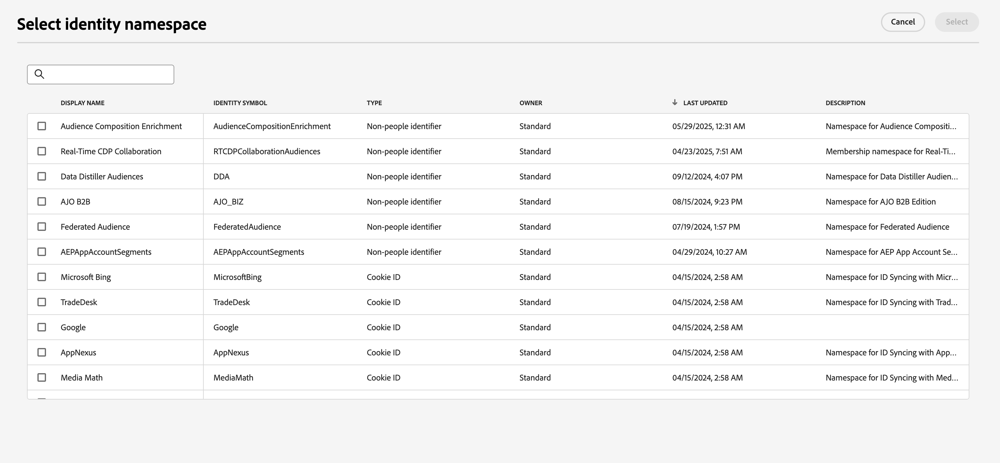

[!UICONTROL Identity namespace] を選択して「[!UICONTROL Browse]」タブに戻ると、選択した名前空間に関連する **[!UICONTROL Identity value]** を入力できます。

>[!NOTE]
>
>この値は、個々の顧客プロファイルに固有で、指定された名前空間の有効なエントリである必要があります。 例えば、ID 名前空間「メール」を選択するには、有効なメールアドレスの形式で ID 値が必要です。

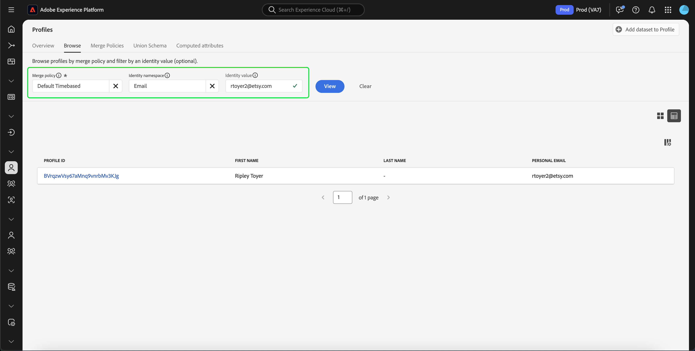

値を入力したら、「**[!UICONTROL View]**」を選択すると、値に一致する単一のプロファイルが返されます。 プロファイルを表示する **[!UICONTROL Profile ID]** を選択します。

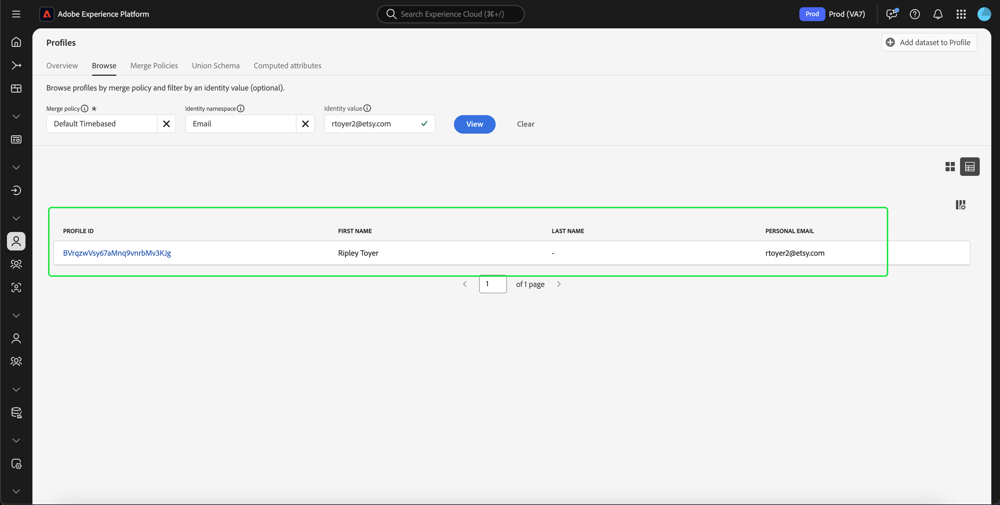

## プロファイルを表示 {#view-profile}

>[!CONTEXTUALHELP]
>id="platform_errors_uplib_201001_404"
>title="エンティティが見つかりません"
>abstract="つまり、Experience Platform でリクエストされたエンティティを見つけることができませんでした。このエラーを解決するには、次のいずれかの解決策を試してください。<ul><li>アクセスしようとしているエンティティの URL に正しいプロファイル ID がリストされていることを確認する。</li><li>アクセスしようとしているエンティティの組織とサンドボックスの組み合わせが正しいことを確認する。</li></ul>"

**[!UICONTROL Profile ID]** を選択すると、「**[!UICONTROL Detail]**」タブが開きます。 「**[!UICONTROL Detail]**」タブに表示されるプロファイル情報は、複数のプロファイルフラグメントを結合し、個々の顧客の単一のビューを形成したものです。 これには、基本属性、リンクされた ID、チャネル環境設定などの顧客の詳細が含まれます。

さらに、プロファイルに関するその他の詳細（[&#x200B; 属性 &#x200B;](#attributes)、[&#x200B; イベント &#x200B;](#events)、[&#x200B; オーディエンスメンバーシップ &#x200B;](#audience-membership) など）を表示できます。

### 「詳細」タブ {#profile-detail}

「**[!UICONTROL Details]**」タブには、選択したプロファイルに関する詳細情報が表示されます。 「詳細」タブは、カード表示かグラフ表示かに応じて、様々なセクションに分かれています。 カード表示の場合は、顧客プロファイルインサイト、AI insight ウィジェット、カスタマイズ可能なウィジェットおよび自動分類されたウィジェットが表示され、グラフ表示の場合は、「プロファイル属性」セクションと「エクスペリエンスイベント」セクションが表示されます。

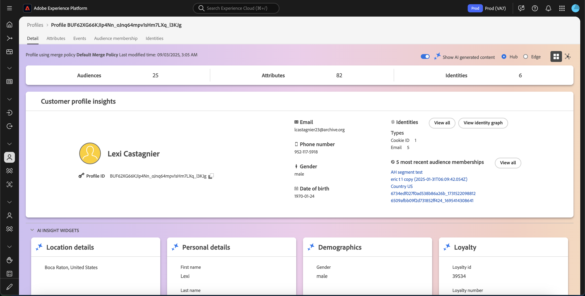

さらに、AI が生成したインサイトの表示、エッジと比較したハブの詳細の表示、カードビューとグラフビューの選択を切り替えることができます。

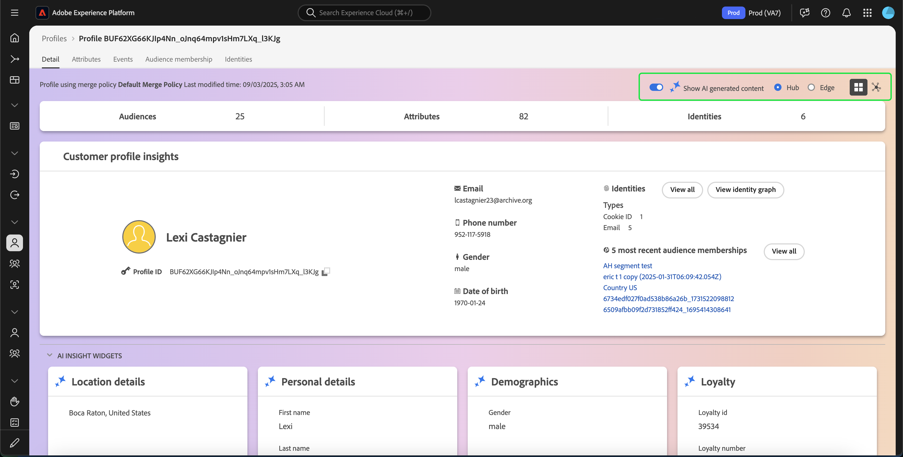

#### 顧客のプロファイルインサイト {#customer-profile-insights}

**[!UICONTROL Customer profile insights]** セクションには、プロファイルの属性に関する簡単な概要が表示されます。 これには、プロファイル ID、メール、電話番号、性別、生年月日、およびプロファイルの ID とオーディエンスメンバーシップが含まれます。

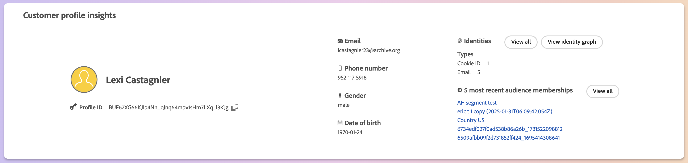

#### AI インサイトのウィジェット {#ai-insight-widgets}

>[!IMPORTANT]
>
>Healthcare Shield のお客様は、AI insight ウィジェットを **使用できません**。

**[!UICONTROL AI insight widgets]** のセクションには、AI によって生成されたウィジェットが表示されます。 これらのウィジェットは、人口統計（年齢、性別、場所など）、ユーザー行動（購入履歴、web サイトのアクティビティ、ソーシャルメディアのエンゲージメントなど）、心理画像（興味、好み、ライフスタイルの選択など）などのプロファイルデータに基づいて、プロファイルに対する迅速なインサイトを提供します。 すべての AI ウィジェットは、プロファイルに存在する **既に** データを使用します。

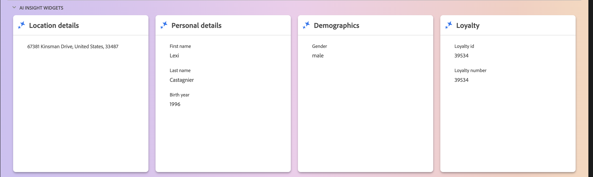

#### カスタマイズ可能なウィジェット {#customizable-widgets}

**[!UICONTROL Customizable widgets]** のセクションには、ビジネスニーズに合わせてカスタマイズできるウィジェットが表示されます。 属性を別々のウィジェットにグループ化したり、不要なウィジェットを削除したり、ウィジェットのレイアウトを調整したりできます。

表示されるデフォルトのフィールドは、組織レベルで変更して、優先プロファイル属性を表示することもできます。 属性の追加と削除、ダッシュボードパネルのサイズ変更の手順など、これらのフィールドのカスタマイズについて詳しくは、[&#x200B; プロファイルの詳細カスタマイズガイド &#x200B;](profile-customization.md) を参照してください。

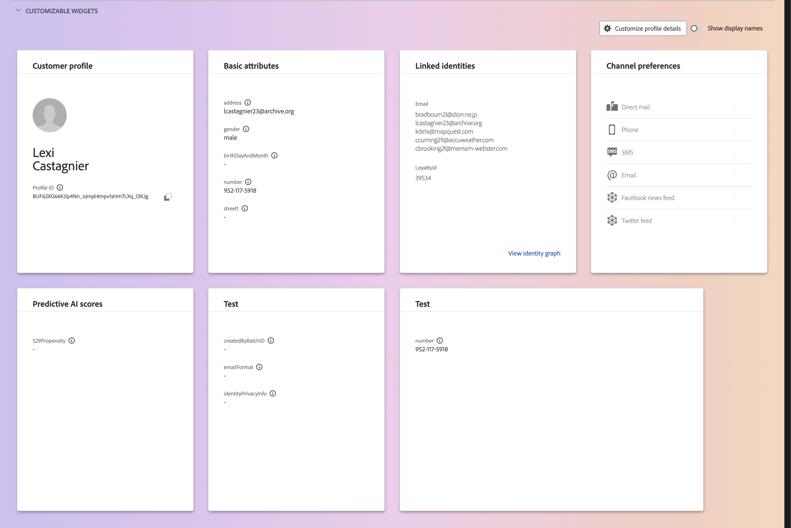

また、属性名を表示名として表示するか、フィールドパス名として表示するかを切り替えることもできます。 これら 2 つの表示を切り替えるには、「**[!UICONTROL Show display names]**」切り替えスイッチを選択します。

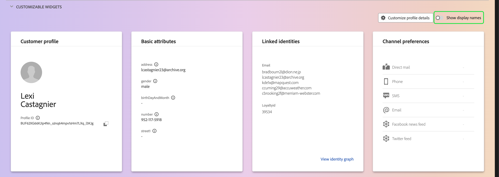

#### 自動分類ウィジェット {#auto-classified-widgets}

**[!UICONTROL Auto-classified widgets]** のセクションには、結合スキーマを利用して属性が属するソースフィールドグループを決定するためのウィジェットが表示され、データの元の場所に関するより明確なコンテキストが提供されます。 検索バーを使用すると、ウィジェット内でキーワードをより簡単に検索できます。

これらのウィジェットでは、イベントデータ（エクスペリエンスイベントウィジェットを含む）と属性データの両方を組み合わせることで、プロファイルのビューを統一できます。 これらのウィジェットを使用してプロファイルのデータの構造を調べ、[&#x200B; カスタマイズ可能なウィジェット &#x200B;](#customizable-widgets) をより適切に構成できます。

>[!NOTE]
>
>複数のソースフィールドグループがある場合、ウィジェットは使用可能なオプションの **1** のみを使用します。

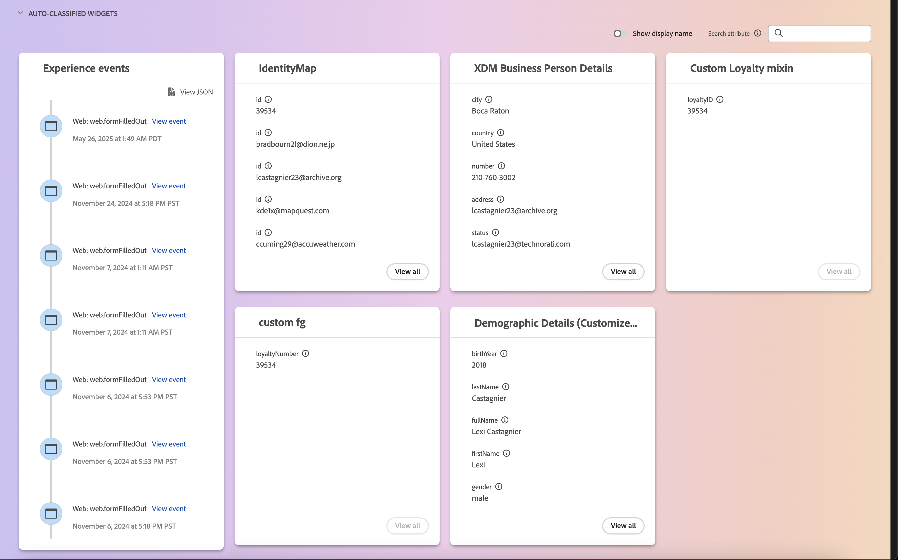

#### プロファイル属性 {#profile-attributes}

**[!UICONTROL Profile attributes]** のセクションには、プロファイルデータの階層グラフ表現が表示されます。 このビューでは、中央のノードはプロファイル自体を表し、セカンダリノードはフィールドグループを表し、残りのノードは各フィールドグループ内のプロパティを表します。

グラフ表示内では、ノードをドラッグ&amp;ドロップしてノードの順序を並べ替えたり、ノードを折りたたんだり展開したりしてアトリビュートの詳細を表示したり、アトリビュートで検索およびフィルタリングしたり、ズームインおよびズームアウトしてアトリビュートの詳細をわかりやすく表示することができます。

#### エクスペリエンスイベント {#experience-events}

**[!UICONTROL Experience events]** セクションには、プロファイルを含んだエクスペリエンスイベントのタイムラインが表示されます。

**[!UICONTROL View event]** を選択すると、選択したイベントにリンクされたイベント属性を表示できます。 これらの詳細には、パス、属性、表示名、値が含まれます。

### 「属性」タブ {#attributes}

「**[!UICONTROL Attributes]**」タブには、指定した結合ポリシーが適用された後に、単一のプロファイルに関連するすべての属性を要約したリストが表示されます。

これらの属性は、「」を選択することで、JSON オブジェクトとして表示することも **[!UICONTROL View JSON]** きます。 これは、プロファイル属性がExperience Platformにどのように取り込まれるかを理解を深めたい場合に役立ちます。

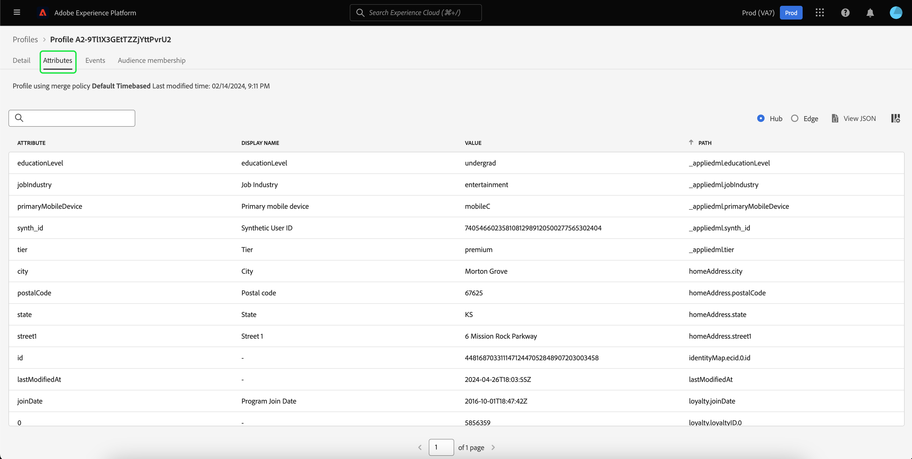

Edgeで使用できる属性を表示するには、データロケーションセレクターで **[!UICONTROL Edge]** を選択します。

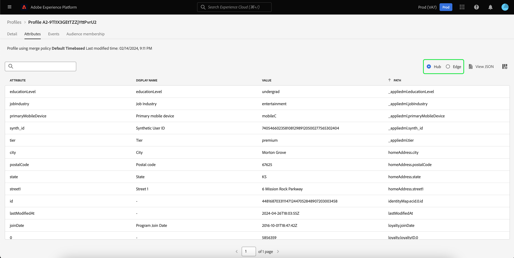

エッジプロファイルについて詳しくは、[&#x200B; エッジプロファイルのドキュメント &#x200B;](../edge-profiles.md) を参照してください。

### 「イベント」タブ {#events}

「**[!UICONTROL Events]**」タブには、顧客に関連付けられた最新 100 件の ExperienceEvents からのデータが含まれています。 このデータには、メールの開封数、買い物かごアクティビティおよびページ表示が含まれます。 個々のイベントで **[!UICONTROL View all]** を選択すると、イベントの一部として追加のフィールドと値のキャプチャが提供されます。

「」を選択して、イベントを JSON オブジェクトとして表示することもでき **[!UICONTROL View JSON]** す。 これは、Experience Platformでのイベントの取得方法を理解するのに役立ちます。

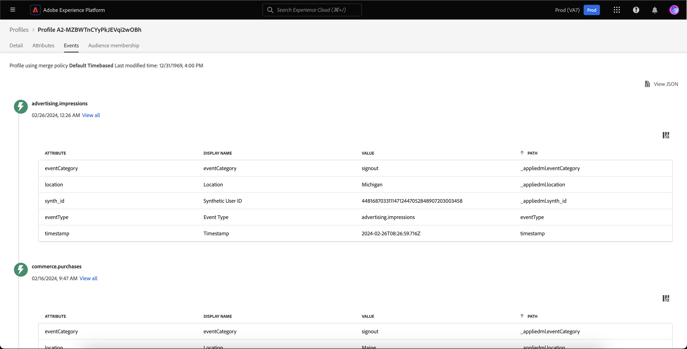

### 「オーディエンスメンバーシップ」タブ {#audience-membership}

「**[!UICONTROL Audience membership]**」タブには、個々の顧客プロファイルが現在属しているオーディエンスの名前と説明のリストが表示されます。 このリストは、プロファイルがオーディエンスに適合するか、オーディエンスから期限切れになると、自動的に更新されます。 プロファイルが現在選定されているオーディエンスの合計数は、タブの右側に表示されます。

Experience Platformのセグメント化について詳しくは、[Experience Platform セグメント化サービスの Adobes ドキュメント &#x200B;](../../segmentation/home.md) を参照してください。

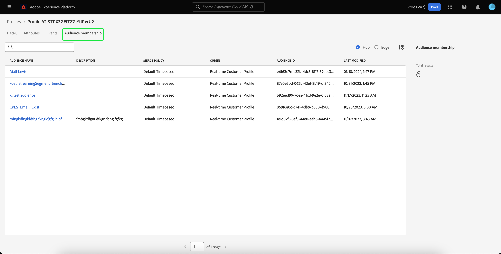

Edgeで使用可能なプロファイルのオーディエンスメンバーシップを表示するには、データロケーションセレクターで **[!UICONTROL Edge]** を選択します。 エッジセグメント化について詳しくは、[&#x200B; エッジセグメント化ガイド &#x200B;](../../segmentation/methods/edge-segmentation.md) を参照してください。

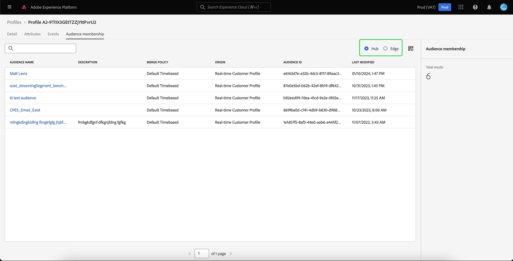

## 結合ポリシー

メインの **[!UICONTROL Profiles]** メニューから、「**[!UICONTROL Merge Policies]**」タブを選択して、組織に属する結合ポリシーのリストを表示します。 リストされた各ポリシーには、名前、デフォルトの結合ポリシーであるかどうか、適用されるスキーマクラスが表示されます。

結合ポリシーについて詳しくは、「[結合ポリシーの概要](../merge-policies/overview.md)」を参照してください。

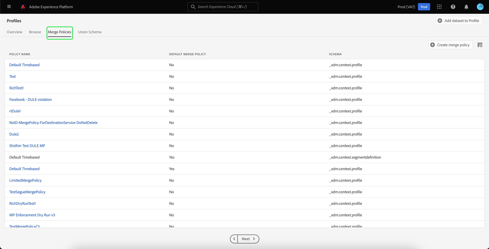

## 和集合スキーマ {#union-schema}

メインの **[!UICONTROL Profiles]** メニューから、「**[!UICONTROL Union Schema]**」タブを選択して、取り込んだデータで使用可能な結合スキーマを表示します。 結合スキーマは、スキーマが [!DNL Experience Data Model] での使用に対して有効になっている、同じクラスのすべての [!DNL Real-Time Customer Profile] （XDM）フィールドを統合したものです。

和集合スキーマについて詳しくは、[&#x200B; 和集合スキーマ UI ガイド &#x200B;](union-schema.md) を参照してください。

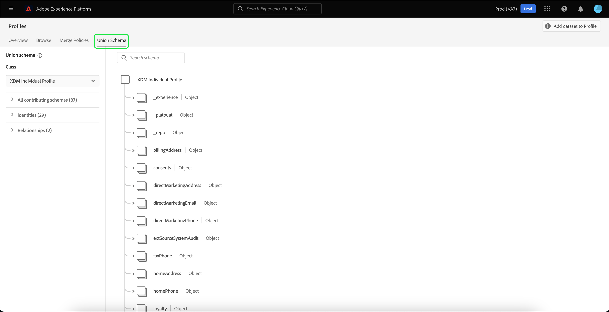

## 計算属性 {#computed-attributes}

メイン **[!UICONTROL Profiles]** メニューから、[**[!UICONTROL Computed attributes]**] タブを選択して、組織に属する計算済み属性のリストを表示します。

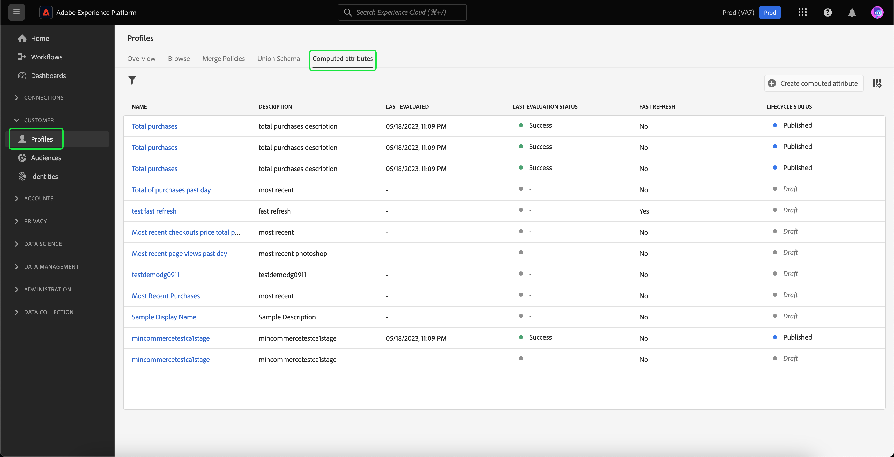

計算属性について詳しくは、[&#x200B; 計算属性の概要 &#x200B;](../computed-attributes/overview.md) を参照してください。 Experience Platform UI 内で計算済み属性を使用する方法について詳しくは、[&#x200B; 計算属性 UI ガイド &#x200B;](../computed-attributes/ui.md) を参照してください。

## 次の手順

このガイドを読むことで、Experience Platform UI を使用した組織のプロファイルデータの表示および管理方法を知ることができました。 Experience Platform API を使用してプロファイルデータを操作する方法について詳しくは、[&#x200B; リアルタイム顧客プロファイル API ガイド &#x200B;](../api/overview.md) を参照してください。
