# [!DNL Real-Time Customer Profile] UI ガイド

[!DNL Real-Time Customer Profile]は、オンライン、オフライン、CRM、サードパーティのデータなど、複数のチャネルからのデータを組み合わせて、個々の顧客の全体像を作成します。 このドキュメントは、Adobe Experience Platform ユーザーインターフェイス（UI）で[!DNL Real-Time Customer Profile] データを操作するためのガイドとして機能します。

## はじめに

このUI ガイドでは、[!DNL Experience Platform]の管理に関する様々な[!DNL Real-Time Customer Profiles] サービスについて理解する必要があります。 このガイドを読む前に、またはUIで作業する前に、次のサービスのドキュメントを確認してください。

* [[!DNL Real-Time Customer Profile] 概要](../home.md)：複数のソースから集約されたデータに基づいて、統合されたリアルタイムの消費者プロファイルを提供します。
* [[!DNL Identity Service]](../../identity-service/home.md): [!DNL Real-Time Customer Profile]に取り込まれる様々なデータソースからIDをブリッジすることで、[!DNL Experience Platform]を有効にします。
* [[!DNL Experience Data Model (XDM)]](../../xdm/home.md)：[!DNL Experience Platform] が、カスタマーエクスペリエンスデータを整理する際に使用する、標準化されたフレームワーク。

## [!UICONTROL Overview]

Experience Platform UIで、左側のナビゲーションで「**[!UICONTROL Profiles]**」を選択し、プロファイルダッシュボードが表示されている「**[!UICONTROL Overview]**」タブを開きます。

>[!NOTE]
>
>組織がExperience Platformを初めて使用しており、アクティブなプロファイルデータセットまたは結合ポリシーがまだ作成されていない場合、[!UICONTROL Profiles] ダッシュボードは表示されません。 代わりに、[!UICONTROL Overview] タブには、リアルタイム顧客プロファイルを開始するのに役立つリンクとドキュメントが表示されます。

### プロファイルダッシュボード {#profile-dashboard}

プロファイルダッシュボードには、組織のプロファイルデータに関連する主要指標の概要が表示されます。

詳しくは、[&#x200B; プロファイルダッシュボードガイド &#x200B;](../../dashboards/guides/profiles.md)を参照してください。

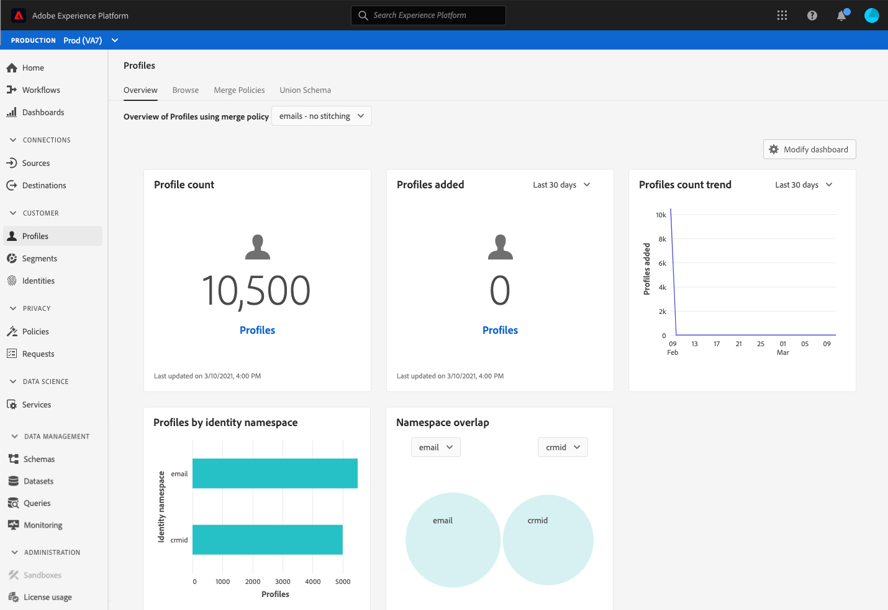

## [!UICONTROL Browse] タブ

「**[!UICONTROL Browse]**」タブでは、切り替えスイッチを選択して、**カード**&#x200B;表示または&#x200B;**テーブル**&#x200B;表示でプロファイルを表示できます。

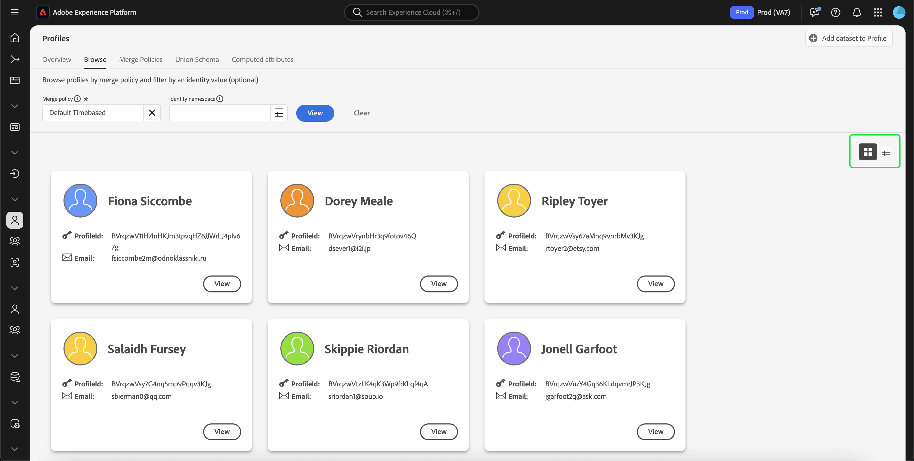

さらに、結合ポリシーを使用してプロファイルを参照したり、ID名前空間と値を使用して特定のプロファイルを検索したりすることもできます。

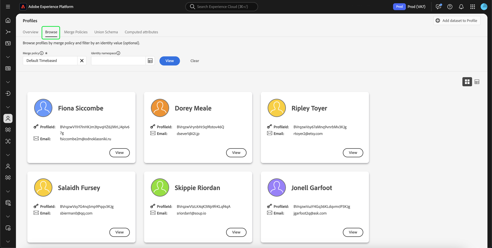

### [!UICONTROL Merge policy]で参照

「**[!UICONTROL Browse]**」タブは、組織のデフォルトの結合ポリシーにデフォルトで設定されています。 別の結合ポリシーを選択するには、結合ポリシー名の横にある`X`を選択し、セレクターを使用して&#x200B;**[!UICONTROL Select merge policy]** ダイアログを開きます。

>[!NOTE]
>
>結合ポリシーが選択されていない場合は、**[!UICONTROL Merge policy]** フィールドの横にあるセレクターボタンを使用して、選択ダイアログを開きます。

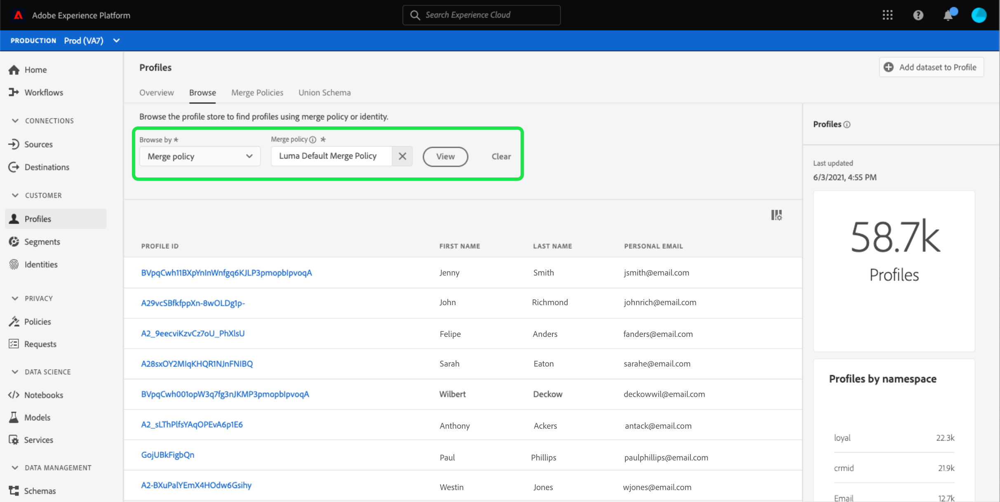

**[!UICONTROL Select merge policy]** ダイアログから結合ポリシーを選択するには、ポリシー名の横にあるラジオボタンを選択し、**[!UICONTROL Select]**&#x200B;を使用して[!UICONTROL Browse] タブに戻ります。 次に、**[!UICONTROL View]**&#x200B;を選択してサンプルプロファイルを更新し、新しい結合ポリシーが適用されたプロファイルのサンプルを表示できます。

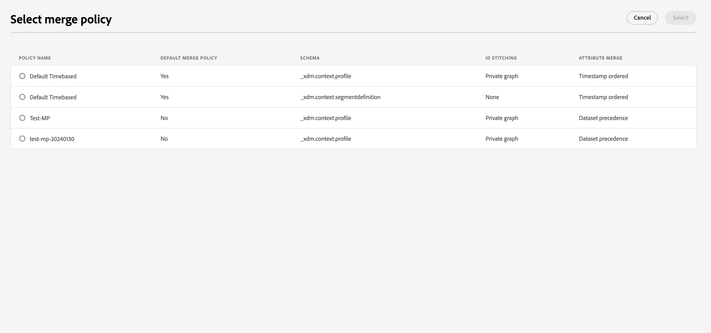

表示されるプロファイルは、選択した結合ポリシーが適用された後、組織のプロファイルストアから最大20個のプロファイルのサンプルを表します。 選択した結合ポリシーのサンプルプロファイルは、新しいデータが組織のプロファイルストアに追加されたときに更新されます。

サンプルプロファイルの1つの詳細を表示するには、**[!UICONTROL Profile ID]**&#x200B;を選択します。 詳しくは、[&#x200B; プロファイルの詳細の表示](#profile-detail)に関するこのガイドの後半の節を参照してください。

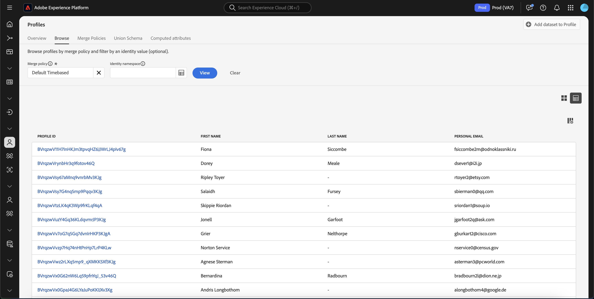

Experience Platform内での結合ポリシーとその役割について詳しくは、[結合ポリシーの概要](../merge-policies/overview.md)を参照してください。

### [!UICONTROL Identity]で参照 {#browse-identity}

「**[!UICONTROL Browse]**」タブでは、ID名前空間を使用して、ID値で特定のプロファイルを検索できます。 IDで参照するには、結合ポリシー、ID名前空間、ID値を指定する必要があります。

必要に応じて、**[!UICONTROL Merge policy]** セレクターを使用して&#x200B;**[!UICONTROL Select merge policy]** ダイアログを開き、使用する結合ポリシーを選択します。

次に、**[!UICONTROL Identity namespace]** セレクターを使用して&#x200B;**[!UICONTROL Select identity namespace]** ダイアログを開き、検索する名前空間を選択します。 組織に多数の名前空間がある場合は、ダイアログの検索バーを使用して、名前空間の名前を入力できます。

名前空間を選択して追加の詳細を表示したり、ラジオボタンを選択して名前空間を選択したりできます。 その後、**[!UICONTROL Select]**&#x200B;を使用して続行できます。

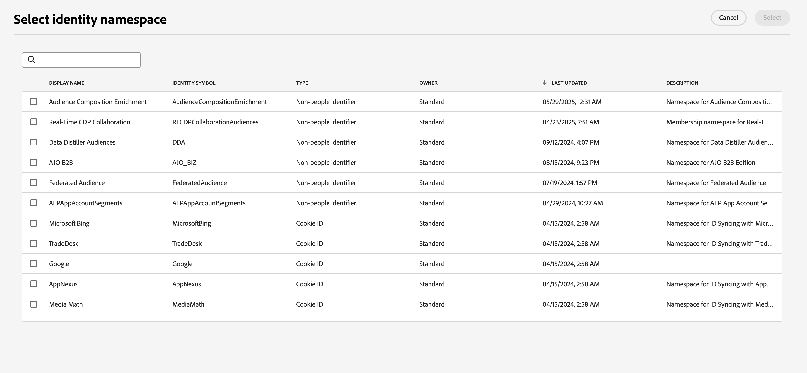

[!UICONTROL Identity namespace]を選択して[!UICONTROL Browse] タブに戻ったら、選択した名前空間に関連する&#x200B;**[!UICONTROL Identity value]**&#x200B;を入力できます。

>[!NOTE]
>
>この値は個々の顧客プロファイルに固有であり、指定された名前空間の有効なエントリである必要があります。 例えば、ID名前空間「電子メール」を選択するには、有効な電子メールアドレスの形式のID値が必要になります。

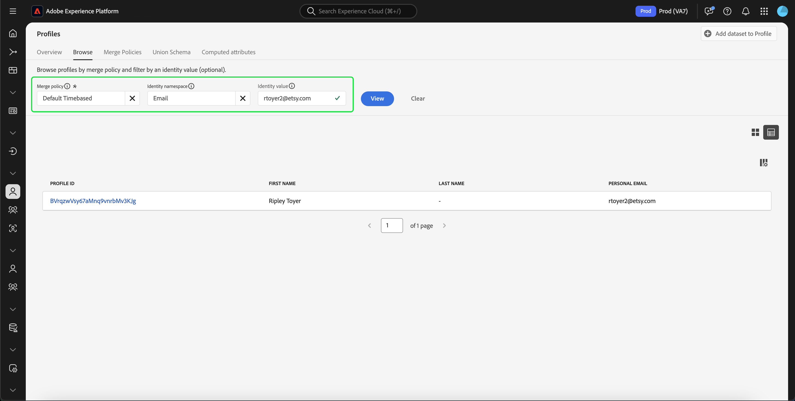

値を入力したら、**[!UICONTROL View]**&#x200B;を選択すると、値に一致する単一のプロファイルが返されます。 プロファイルを表示するには、**[!UICONTROL Profile ID]**&#x200B;を選択します。

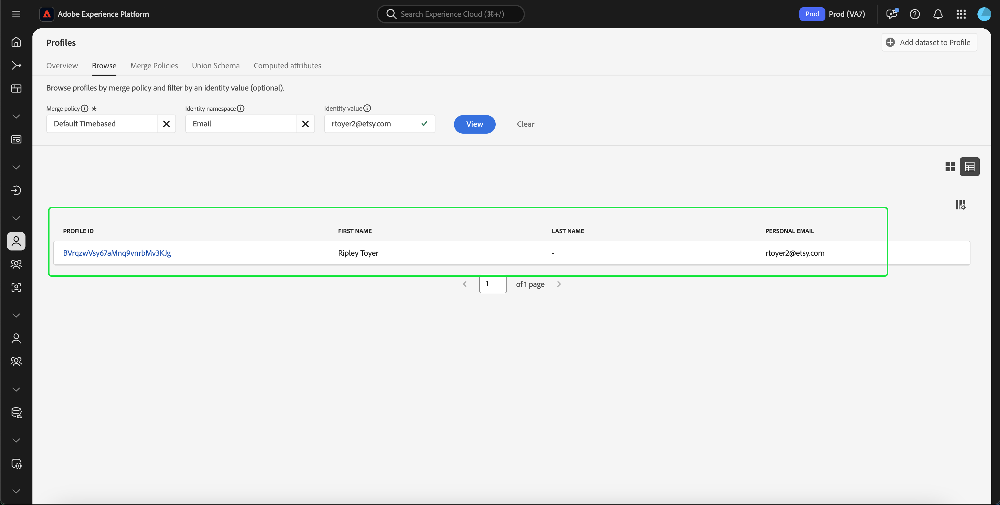

## プロファイルの表示 {#view-profile}

>[!CONTEXTUALHELP]
>id="platform_errors_uplib_201001_404"
>title="エンティティが見つかりません"
>abstract="つまり、Experience Platform でリクエストされたエンティティを見つけることができませんでした。このエラーを解決するには、次のいずれかの解決策を試してください。<ul><li>アクセスしようとしているエンティティの URL に正しいプロファイル ID がリストされていることを確認する。</li><li>アクセスしようとしているエンティティの組織とサンドボックスの組み合わせが正しいことを確認する。</li></ul>"

**[!UICONTROL Profile ID]**&#x200B;を選択すると、「**[!UICONTROL Detail]**」タブが開きます。 **[!UICONTROL Detail]** タブに表示されるプロファイル情報は、複数のプロファイルフラグメントから結合され、個々の顧客の単一のビューを形成しています。 これには、基本属性、リンクされたID、チャネルの環境設定など、顧客の詳細が含まれます。

さらに、[属性](#attributes)、[&#x200B; イベント &#x200B;](#events)、[&#x200B; オーディエンスメンバーシップ &#x200B;](#audience-membership)など、プロファイルに関するその他の詳細を表示できます。

### 「詳細」タブ {#profile-detail}

「**[!UICONTROL Details]**」タブには、選択したプロファイルに関する詳細情報が表示されます。 「詳細」タブは、カード表示とグラフビューのどちらに表示されているかに応じて、様々なセクションに分かれています。 カード表示では、顧客プロファイルインサイト、AI insight ウィジェット、カスタマイズ可能なウィジェット、自動分類ウィジェットが表示され、グラフ表示では、プロファイル属性とエクスペリエンスイベントのセクションが表示されます。

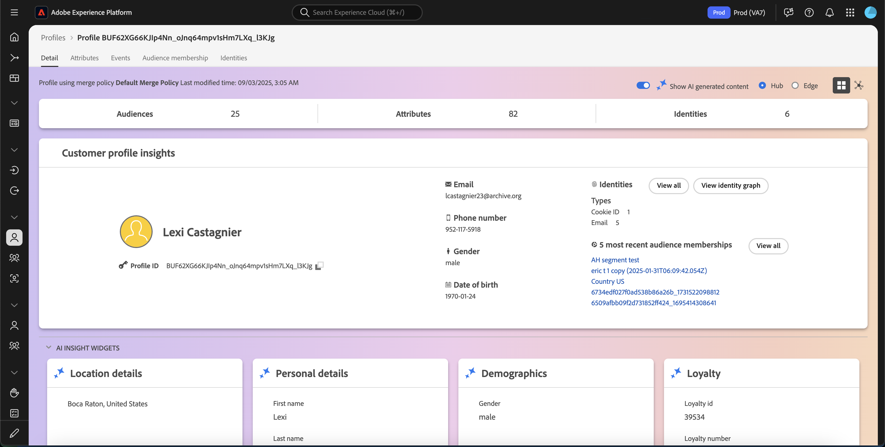

さらに、AIが生成したインサイトの表示、edgeと比較したhubの詳細の表示、カードビューとグラフビューの選択を切り替えることもできます。

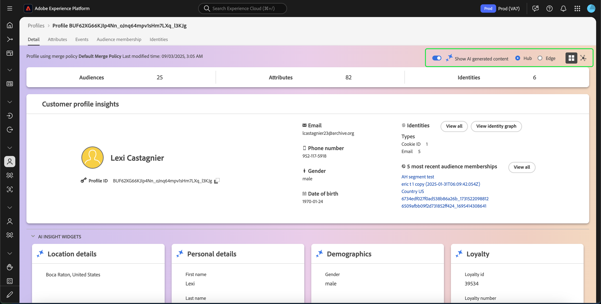

#### 顧客のプロファイルインサイト {#customer-profile-insights}

**[!UICONTROL Customer profile insights]** セクションには、プロファイルの属性に関する簡単な概要が表示されます。 これには、プロファイル ID、電子メール、電話番号、性別、生年月日、プロファイルのIDとオーディエンスメンバーシップが含まれます。

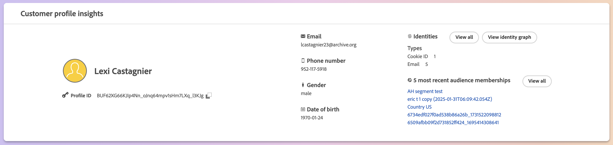

#### AI インサイトのウィジェット {#ai-insight-widgets}

>[!IMPORTANT]
>
>Healthcare Shieldをご利用のお客様は、AI insight ウィジェットを&#x200B;**ではなく**&#x200B;ご利用いただけます。

**[!UICONTROL AI insight widgets]** セクションには、AIによって生成されたウィジェットが表示されます。 これらのウィジェットは、デモグラフィック（年齢、性別、場所など）、ユーザーの行動（購入履歴、web サイトのアクティビティ、ソーシャルメディアのエンゲージメントなど）、心理的特性（興味、好み、ライフスタイルの選択など）などのプロファイルデータをもとに、プロファイルに迅速なインサイトを提供します。 すべてのAI ウィジェットは、**既に**&#x200B;がプロファイルに存在するデータを使用します。

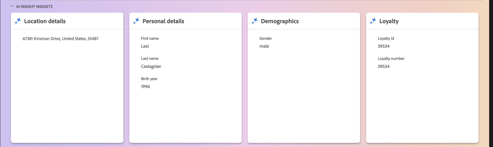

#### カスタマイズ可能なウィジェット {#customizable-widgets}

「**[!UICONTROL Customizable widgets]**」セクションには、ビジネスニーズに合わせてカスタマイズできるウィジェットが表示されます。 属性を個別のウィジェットにグループ化したり、不要なウィジェットを削除したり、ウィジェットのレイアウトを調整したりできます。

表示されるデフォルトのフィールドは、組織レベルで変更して、好みのプロファイル属性を表示することもできます。 属性の追加と削除、ダッシュボードパネルのサイズ変更など、これらのフィールドのカスタマイズについて詳しくは、[&#x200B; プロファイル詳細カスタマイズガイド &#x200B;](profile-customization.md)を参照してください。

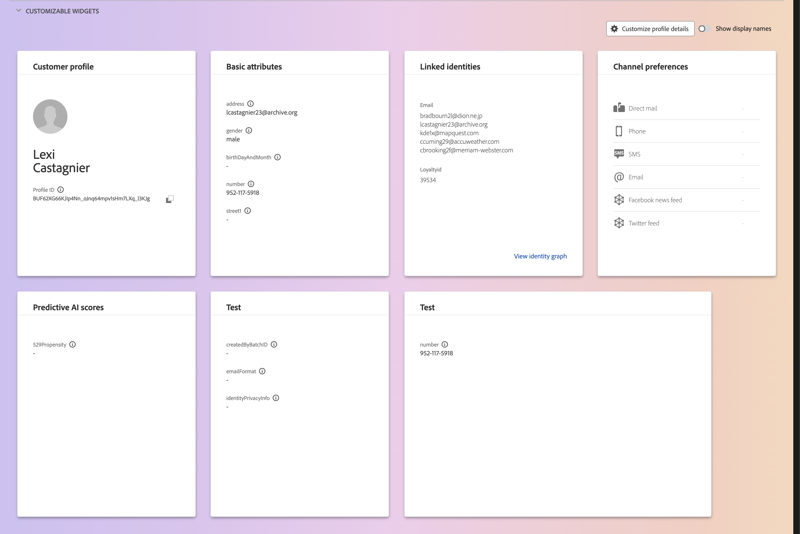

また、属性名を表示名として表示するか、フィールドのパス名として表示するかを切り替えることもできます。 これら2つのディスプレイを切り替えるには、**[!UICONTROL Show display names]** トグルを選択します。

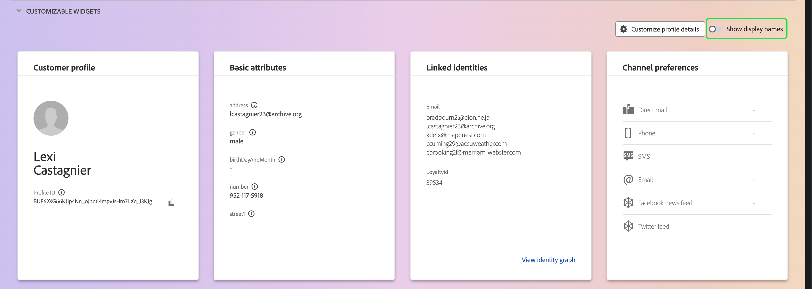

#### 自動分類ウィジェット {#auto-classified-widgets}

**[!UICONTROL Auto-classified widgets]** セクションには、結合スキーマを活用して、属性が属するソースフィールドグループを決定するウィジェットが表示され、データの送信元に関する明確なコンテキストが提供されます。 検索バーを使用すると、ウィジェット内のキーワードをより簡単に検索できます。

これらのウィジェットは、イベントデータ（エクスペリエンスイベントウィジェットと）と属性データの両方を組み合わせて、プロファイルの統一されたビューを実現します。 これらのウィジェットを使用すると、プロファイルのデータ構造を確認して、[&#x200B; カスタマイズ可能なウィジェット &#x200B;](#customizable-widgets)をより適切に構成できます。

>[!NOTE]
>
>複数のソースフィールドグループがある場合、ウィジェットは使用可能なオプションのうち&#x200B;**one**&#x200B;のみを使用します。

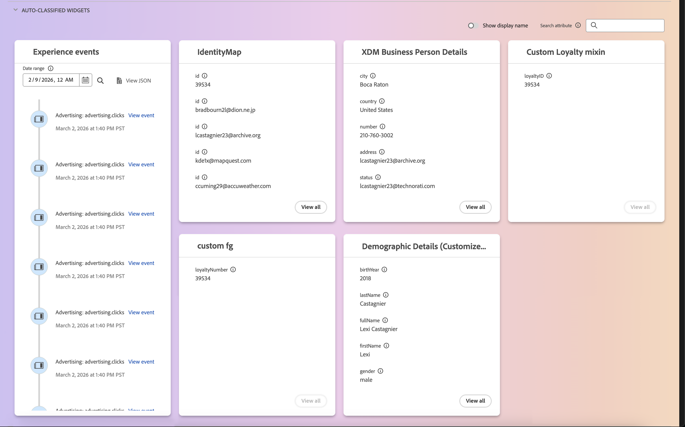

#### プロファイル属性 {#profile-attributes}

**[!UICONTROL Profile attributes]** セクションには、プロファイルデータの階層グラフ表現が表示されます。 このビューでは、中央ノードはプロファイル自体を表し、セカンダリノードはフィールドグループを表し、残りのノードは各フィールドグループ内のプロパティを表します。

グラフビュー内では、ノードをドラッグ&amp;ドロップしてノードの順序を並べ替えたり、ノードを折りたたんで展開したりして、属性の詳細を確認したり、属性を検索してフィルタリングしたり、ズームインしたりズームアウトしたりして、属性の詳細をより詳細に表示したりできます。

#### エクスペリエンスイベント {#experience-events}

**[!UICONTROL Experience events]** セクションには、プロファイルを含むエクスペリエンスイベントのタイムラインが表示されます。 デフォルトでは、このセクションには過去48時間以内のエクスペリエンスイベントが表示されます。 ただし、最大30日間の日付範囲を設定できます。

**[!UICONTROL View event]**&#x200B;を選択すると、選択したイベントにリンクされているイベント属性を確認できます。 これらの詳細には、パス、属性、表示名、値が含まれます。

### 「属性」タブ {#attributes}

**[!UICONTROL Attributes]** タブには、指定された結合ポリシーが適用された後、単一のプロファイルに関連するすべての属性を要約したリストビューが表示されます。

これらの属性は、**[!UICONTROL View JSON]**&#x200B;を選択してJSON オブジェクトとして表示することもできます。 これは、プロファイル属性がExperience Platformに取り込まれる方法をよりよく理解したいユーザーに役立ちます。

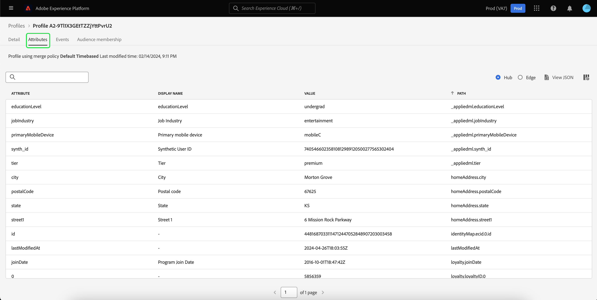

Edgeで使用可能な属性を表示するには、データの場所セレクターで「**[!UICONTROL Edge]**」を選択します。

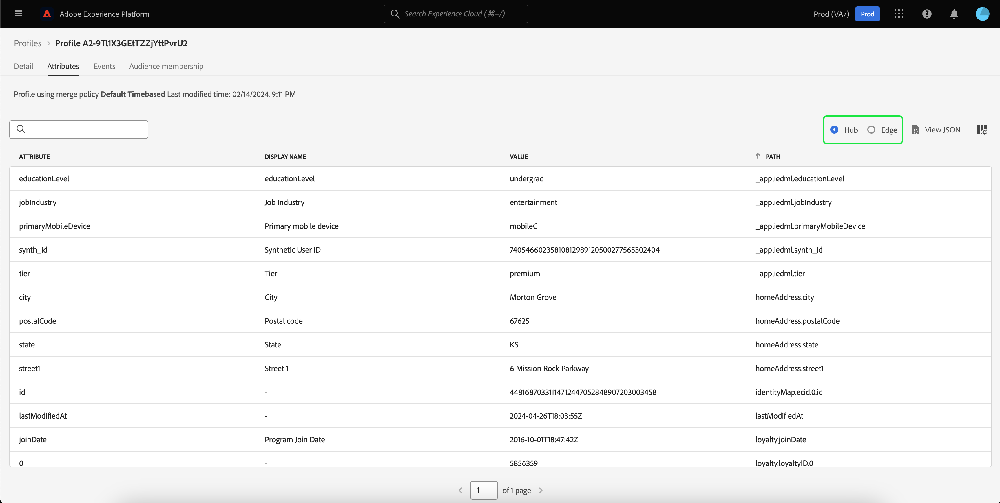

エッジプロファイルについて詳しくは、[&#x200B; エッジプロファイルのドキュメント &#x200B;](../edge-profiles.md)を参照してください。

### 「イベント」タブ {#events}

>[!NOTE]
>
>イベントの表示は、最大15分遅らせることができます。

デフォルトでは、**[!UICONTROL Events]** タブには、過去48時間のデータと、顧客に関連付けられた最新のExperienceEvents 100件のデータが含まれています。 このデータには、電子メールの開封数、カートのアクティビティ、ページビューなどが含まれます。 また、最大30日間の日付範囲を設定することもできます。 個々のイベントの&#x200B;**[!UICONTROL View all]**&#x200B;を選択すると、イベントの一部として追加のフィールドと値キャプチャが提供されます。

イベントは、**[!UICONTROL View JSON]**&#x200B;を選択すると、JSON オブジェクトとして表示することもできます。 これは、Experience Platformでイベントがどのようにキャプチャされるかを理解するのに役立ちます。

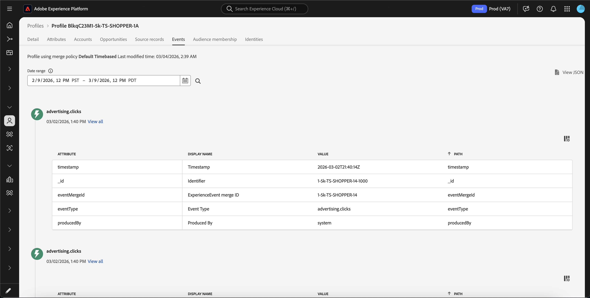

### 「Audience membership」タブ {#audience-membership}

「**[!UICONTROL Audience membership]**」タブには、個々の顧客プロファイルが現在属するオーディエンスの名前と説明が表示されます。 プロファイルがオーディエンスに適格または期限切れになると、このリストは自動的に更新されます。 プロファイルが現在選定されているオーディエンスの合計数は、タブの右側に表示されます。

Experience Platformでのセグメント化について詳しくは、[Adobe Experience Platform Segmentation Service ドキュメント &#x200B;](../../segmentation/home.md)を参照してください。

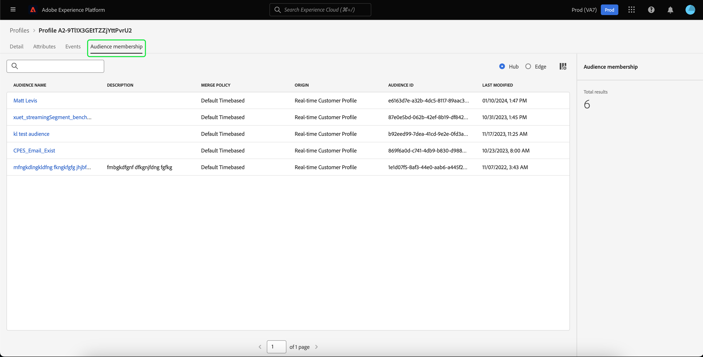

Edgeで使用可能なプロファイルのオーディエンスメンバーシップを表示するには、データの場所セレクターで「**[!UICONTROL Edge]**」を選択します。 エッジセグメント化の詳細については、[&#x200B; エッジセグメント化ガイド &#x200B;](../../segmentation/methods/edge-segmentation.md)を参照してください。

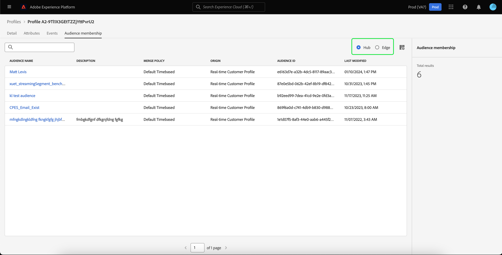

## 結合ポリシー

メインの&#x200B;**[!UICONTROL Profiles]** メニューから「**[!UICONTROL Merge Policies]**」タブを選択して、組織に属する結合ポリシーのリストを表示します。 リストされた各ポリシーには、デフォルトの結合ポリシーであるかどうかに関わらず、名前と、それが適用されるスキーマクラスが表示されます。

結合ポリシーについて詳しくは、「[結合ポリシーの概要](../merge-policies/overview.md)」を参照してください。

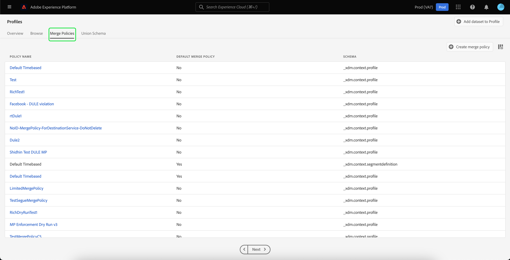

## 和集合スキーマ {#union-schema}

メインの&#x200B;**[!UICONTROL Profiles]** メニューから「**[!UICONTROL Union Schema]**」タブを選択して、取り込んだデータの使用可能な結合スキーマを表示します。 結合スキーマは、同じクラスのすべての[!DNL Experience Data Model] （XDM） フィールドを統合したもので、そのスキーマは[!DNL Real-Time Customer Profile]で使用できるように有効になっています。

結合スキーマについて詳しくは、[結合スキーマ UI ガイド &#x200B;](union-schema.md)を参照してください。

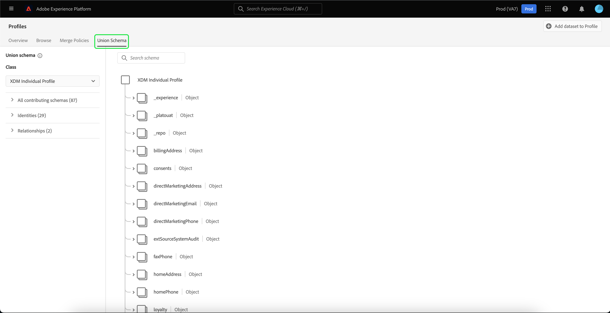

## 計算属性 {#computed-attributes}

メインの&#x200B;**[!UICONTROL Profiles]** メニューから「**[!UICONTROL Computed attributes]**」タブを選択して、組織に属する計算属性のリストを表示します。

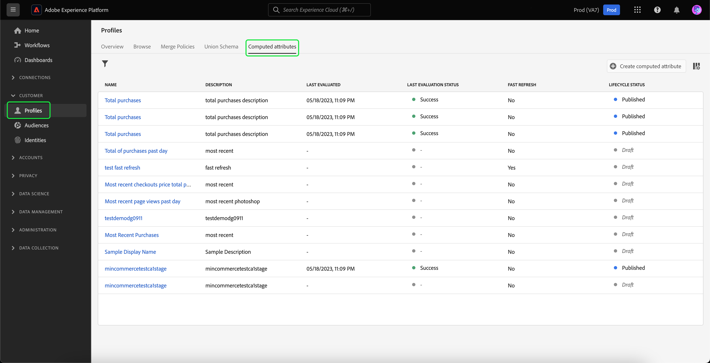

計算属性について詳しくは、[計算属性の概要](../computed-attributes/overview.md)を参照してください。 Experience Platform UI内で計算属性を使用する方法について詳しくは、[計算属性UI ガイド &#x200B;](../computed-attributes/ui.md)を参照してください。

## 次の手順

このガイドでは、Experience Platform UIを使用して組織のプロファイルデータを表示および管理する方法について説明します。 Experience Platform APIを使用してプロファイルデータを操作する方法について詳しくは、[Real-Time Customer Profile API ガイド &#x200B;](../api/overview.md)を参照してください。
