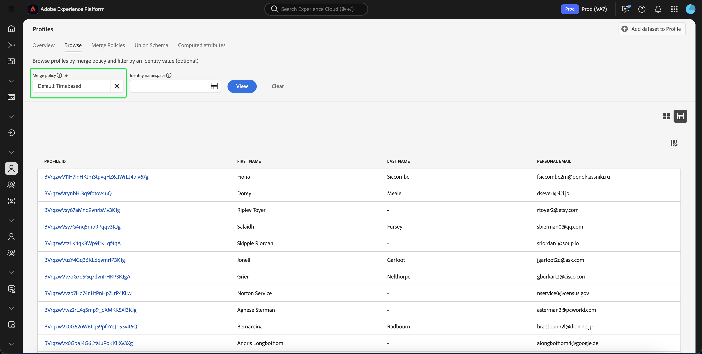

# [!DNL Real-Time Customer Profile] UI ガイド

[!DNL Real-Time Customer Profile] は、オンライン、オフライン、CRM、サードパーティデータなど複数のチャネルからのデータを組み合わせて、個々の顧客の全体像を作成します。 このドキュメントは、を操作する際のガイドとして機能します [!DNL Real-Time Customer Profile] Adobe Experience Platform ユーザーインターフェイス（UI）のデータ。

## はじめに

この UI ガイドは、様々な [!DNL Experience Platform] の管理に関連するサービス [!DNL Real-Time Customer Profiles]. このガイドを読む前、または UI を使用する前に、次のサービスのドキュメントを確認してください。

* [[!DNL Real-Time Customer Profile] の概要](../home.md)：複数のソースから集計したデータに基づいて、統合されたリアルタイム顧客プロファイルを提供します。
* [[!DNL Identity Service]](../../identity-service/home.md)：有効 [!DNL Real-Time Customer Profile] に取り込む際に、異なるデータソースの ID を結合する [!DNL Platform].
* [[!DNL Experience Data Model (XDM)]](../../xdm/home.md)：[!DNL Platform] が、カスタマーエクスペリエンスデータを整理する際に使用する、標準化されたフレームワーク。

## [!UICONTROL 概要]

Experience PlatformUI で、次を選択します。 **[!UICONTROL プロファイル]** 左側のナビゲーションで、を開きます **[!UICONTROL 概要]** プロファイルダッシュボードを表示するタブ。

>[!NOTE]
>
>Platform を初めて使用する組織で、アクティブなプロファイルデータセットや結合ポリシーが作成されていない場合は、 [!UICONTROL プロファイル] ダッシュボードが表示されません。 代わりに、 [!UICONTROL 概要] tab キーを押すと、リアルタイム顧客プロファイルを初めて使用する際に役立つリンクやドキュメントが表示されます。

### プロファイルダッシュボード {#profile-dashboard}

プロファイルダッシュボードは、組織のプロファイルデータに関連する主要指標の概要を示します。

詳しくは、 [プロファイルダッシュボードガイド](../../dashboards/guides/profiles.md).

## [!UICONTROL 参照] タブ指標

「」を選択します **[!UICONTROL 参照]** tab キーを押すと、組織のプロファイルデータに関連する複数の指標が表示されます。 また、このガイドの次の節で説明するように、このタブを使用して、結合ポリシーまたは ID を使用してプロファイルストアを参照することもできます。

の右側 **[!UICONTROL 参照]** タブは [プロファイル数](#profile-count) のリストと同様に [名前空間別プロファイル](#profiles-by-namespace).

>[!NOTE]
>
>これらのプロファイル指標は、に表示される指標とは異なる場合があります [プロファイルダッシュボード](#profile-dashboard) これは、組織のデフォルトの結合ポリシーを使用して評価されるからです。 デフォルトの結合ポリシーの定義方法など、結合ポリシーの操作について詳しくは、 [結合ポリシーの概要](../merge-policies/overview.md).

これらの指標に加えて、このセクションには指標が最後に評価された日時が表示されます。

### プロファイル数 {#profile-count}

プロファイル数には、組織のデフォルトの結合ポリシーでプロファイルフラグメントを結合して、個々の顧客ごとに 1 つのプロファイルを形成した後に、組織が Experience Platform 内に保持しているプロファイルの総数が表示されます。つまり、様々なチャネルでブランドとやり取りする 1 人の顧客に関連する複数のプロファイルフラグメントが組織に存在する場合でも、これらのフラグメントは、1 個人に関連しているため（デフォルトの結合ポリシーに従って）結合され、プロファイルの数が「1」として返されます。

プロファイル数には、属性（レコードデータ）を持つプロファイルと、Adobe Analytics プロファイルなどの時系列（イベント）データのみを含むプロファイルの両方も含まれます。 プロファイル数は定期的に更新され、Platform 内のプロファイルの最新の合計数が提供されます。

#### プロファイル数指標の更新

にレコードを取り込んだ場合 [!DNL Profile] ストアでカウントを 5% 以上増加または減少させると、ジョブがトリガーされてカウントが更新されます。 ストリーミングデータワークフローの場合は、5% の増加または減少のしきい値に達したかどうかを判断するために、1 時間ごとにチェックが行われます。 存在する場合、プロファイル数を更新するジョブが自動的にトリガーされます。 バッチ取り込みの場合、プロファイルストアにバッチを正常に取り込んでから 15 分以内に、5% の増加または減少のしきい値に達した場合は、プロファイル数を更新するジョブが実行されます。

### [!UICONTROL 名前空間別のプロファイル] {#profiles-by-namespace}

この **[!UICONTROL 名前空間別のプロファイル]** 指標は、プロファイルストアにあるすべての結合済みプロファイルにわたって、名前空間の合計数と分類を表示します。 1 つのプロファイルに複数の名前空間が関連付けられている可能性があるので、名前空間別のプロファイルの合計数（各名前空間に表示される値をまとめたもの）は、常にプロファイル数指標よりも多くなります。 例えば、顧客が複数のチャネルでブランドとやり取りする場合、複数の名前空間がその個々の顧客に関連付けられます。

#### を更新中 [!UICONTROL 名前空間別のプロファイル] 指標

類似 [プロファイル数](#profile-count) 指標（にレコードを取り込んだ場合） [!DNL Profile] ストアでカウントを 5% 以上増加または減少させると、ジョブがトリガーされて名前空間指標が更新されます。 ストリーミングデータワークフローの場合は、5% の増加または減少のしきい値に達したかどうかを判断するために、1 時間ごとにチェックが行われます。 存在する場合、プロファイル数を更新するジョブが自動的にトリガーされます。 バッチ取得の場合、バッチがに正常に取り込まれてから 15 分以内 [!DNL Profile] ストアでは、5% の増加または減少しきい値に達した場合、指標を更新するジョブが実行されます。

## 使用方法 [!UICONTROL 参照] tab キーでプロファイルを表示

日 **[!UICONTROL 参照]** タブ結合ポリシーを使用してサンプルプロファイルを表示したり、ID 名前空間と値を使用して特定のプロファイルを検索したりできます。

### 参照基準 [!UICONTROL 結合ポリシー]

この **[!UICONTROL 参照]** tab キーは、デフォルトで組織のデフォルトの結合ポリシーに設定されています。 別の結合ポリシーを選択するには、 `X` 結合ポリシー名の横にあるセレクターを使用して、を開きます **[!UICONTROL 結合ポリシーを選択]** ダイアログ。

>[!NOTE]
>
>結合ポリシーが選択されていない場合は、 **[!UICONTROL 結合ポリシー]** フィールドで選択ダイアログを開きます。

から結合ポリシーを選択するには **[!UICONTROL 結合ポリシーを選択]** ダイアログで、ポリシー名の横にあるラジオボタンを選択してから、を使用します **[!UICONTROL を選択]** に戻る [!UICONTROL 参照] タブ。 次に、以下を選択できます **[!UICONTROL 表示]** サンプルプロファイルを更新し、新しい結合ポリシーが適用されたプロファイルのサンプリングを確認します。

表示されるプロファイルは、選択した結合ポリシーが適用された後、組織のプロファイルストアからの最大 20 個のプロファイルのサンプルを表します。 組織のプロファイルストアに新しいデータが追加されると、選択した結合ポリシーのサンプルプロファイルが更新されます。

サンプルプロファイルの 1 つの詳細を表示するには、 **[!UICONTROL プロファイル ID]**. 詳しくは、このガイドの後半のの節を参照してください [プロファイルの詳細の表示](#profile-detail).

結合ポリシーとその Platform 内での役割について詳しくは、 [結合ポリシーの概要](../merge-policies/overview.md).

### 参照基準 [!UICONTROL ID] {#browse-identity}

日 **[!UICONTROL 参照]** 「」タブを使用すると、id 名前空間を使用して、id 値で特定のプロファイルを検索できます。 ID による参照では、結合ポリシー、ID 名前空間および ID 値を指定する必要があります。

必要に応じて、を使用します **[!UICONTROL 結合ポリシー]** セレクターをクリックして、 **[!UICONTROL 結合ポリシーを選択]** をクリックし、使用する結合ポリシーを選択します。

次に、を使用します **[!UICONTROL ID 名前空間]** セレクターをクリックして、 **[!UICONTROL ID 名前空間を選択]** ダイアログを開き、検索する名前空間を選択します。 組織に多くの名前空間がある場合、ダイアログの検索バーを使用して名前空間の名前の入力を開始できます。

名前空間を選択して追加の詳細を表示するか、ラジオボタンを選択して名前空間を選択できます。 その後、を使用できます **[!UICONTROL を選択]** 続行します。

を選択した後 [!UICONTROL ID 名前空間] をクリックし、に戻ります。 [!UICONTROL 参照] 「」タブで、 **[!UICONTROL ID 値]** 選択した名前空間に関連する。

>[!NOTE]
>
>この値は、個々の顧客プロファイルに固有で、指定された名前空間の有効なエントリである必要があります。 例えば、ID 名前空間「メール」を選択するには、有効なメールアドレスの形式で ID 値が必要です。

値を入力したら、 **[!UICONTROL 表示]** そして、値に一致する単一のプロファイルが返されます。 「」を選択します **[!UICONTROL プロファイル ID]** プロファイルの詳細を表示します。

## プロファイルの詳細を表示 {#profile-detail}

を選択した後 **[!UICONTROL プロファイル ID]**, **[!UICONTROL 詳細]** タブが開きます。 に表示されるプロファイル情報 **[!UICONTROL 詳細]** タブは、複数のプロファイルフラグメントを結合し、個々の顧客の単一のビューを形成したものです。 これには、基本属性、リンクされた ID、チャネル環境設定などの顧客の詳細が含まれます。

表示されるデフォルトのフィールドは、組織レベルで変更して、優先プロファイル属性を表示することもできます。 属性の追加と削除、ダッシュボードパネルのサイズ変更の手順など、これらのフィールドのカスタマイズについて詳しくは、を参照してください。 [プロファイルの詳細カスタマイズガイド](profile-customization.md).

使用可能な別のタブを選択すると、個々の顧客プロファイルに関連する追加情報を表示できます。 これらのタブには、属性、イベント、プロファイルが現在選定されているオーディエンスを表示するオーディエンスメンバーシップタブが含まれています。

### 「属性」タブ

この **[!UICONTROL 属性]** タブには、指定した結合ポリシーが適用された後に、単一のプロファイルに関連するすべての属性を要約したリストが表示されます。

これらの属性は、を選択することで、JSON オブジェクトとして表示することもできます。 **[!UICONTROL JSON を表示]**. これは、プロファイル属性が Platform にどのように取り込まれるかを理解を深めたい場合に役立ちます。

エッジで使用可能な属性を表示するには、次のオプションを選択します **[!UICONTROL Edge]** （データの場所セレクター）

エッジプロファイルについて詳しくは、を参照してください。 [エッジプロファイルドキュメント](../edge-profiles.md).

### 「イベント」タブ

この **[!UICONTROL イベント]** タブには、顧客に関連付けられた最新の 100 件の ExperienceEvents からのデータが含まれています。 このデータには、メールの開封数、買い物かごアクティビティおよびページ表示が含まれます。 選択 **[!UICONTROL すべて表示]** 個々のイベントには、イベントの一部として取得した追加のフィールドと値を指定します。

イベントは、を選択することで、JSON オブジェクトとして表示することもできます。 **[!UICONTROL JSON を表示]**. これは、Platform でのイベントの取得方法を理解するのに役立ちます。

### 「オーディエンスメンバーシップ」タブ

この **[!UICONTROL オーディエンスメンバーシップ]** タブには、個々の顧客プロファイルが現在属しているオーディエンスの名前と説明のリストが表示されます。 このリストは、プロファイルがオーディエンスに適合するか、オーディエンスから期限切れになると、自動的に更新されます。 プロファイルが現在選定されているオーディエンスの合計数は、タブの右側に表示されます。

Experience Platformでのセグメント化について詳しくは、を参照してください。 [AdobeExperience Platformセグメント化サービスのドキュメント](../../segmentation/home.md).

Edge で利用可能なプロファイルのオーディエンスメンバーシップを表示するには、次を選択します。 **[!UICONTROL Edge]** データロケーションセレクターで上書きできます。 エッジのセグメント化について詳しくは、以下を参照してください。 [エッジセグメントガイド](../../segmentation/ui/edge-segmentation.md).

## 結合ポリシー

メインから **[!UICONTROL プロファイル]** メニューで、 **[!UICONTROL 結合ポリシー]** タブをクリックして、組織に属する結合ポリシーのリストを表示します。 リストされた各ポリシーには、名前、デフォルトの結合ポリシーであるかどうか、適用されるスキーマクラスが表示されます。

結合ポリシーについて詳しくは、「[結合ポリシーの概要](../merge-policies/overview.md)」を参照してください。

## 和集合スキーマ {#union-schema}

メインから **[!UICONTROL プロファイル]** メニューで、 **[!UICONTROL 結合スキーマ]** タブをクリックして、取り込んだデータで使用可能な結合スキーマを表示します。 結合スキーマは、すべての [!DNL Experience Data Model] （XDM）同じクラスのフィールド。そのスキーマはで使用できるようになりました [!DNL Real-Time Customer Profile].

和集合スキーマについて詳しくは、を参照してください。 [結合スキーマ UI ガイド](union-schema.md).

## 計算属性 {#computed-attributes}

メインから **[!UICONTROL プロファイル]** メニューで、 **[!UICONTROL 計算属性]** タブをクリックして、組織に属する計算済み属性のリストを表示します。

計算属性の詳細については、を参照してください。 [計算属性の概要](../computed-attributes/overview.md). Platform UI 内での計算済み属性の使用方法について詳しくは、を参照してください。 [計算属性 UI ガイド](../computed-attributes/ui.md).

## 次の手順

このガイドを読むことで、Experience Platform UI を使用した組織のプロファイルデータの表示および管理方法を知ることができました。 Experience PlatformAPI を使用してプロファイルデータを操作する方法について詳しくは、を参照してください。 [リアルタイム顧客プロファイル API ガイド](../api/overview.md).
