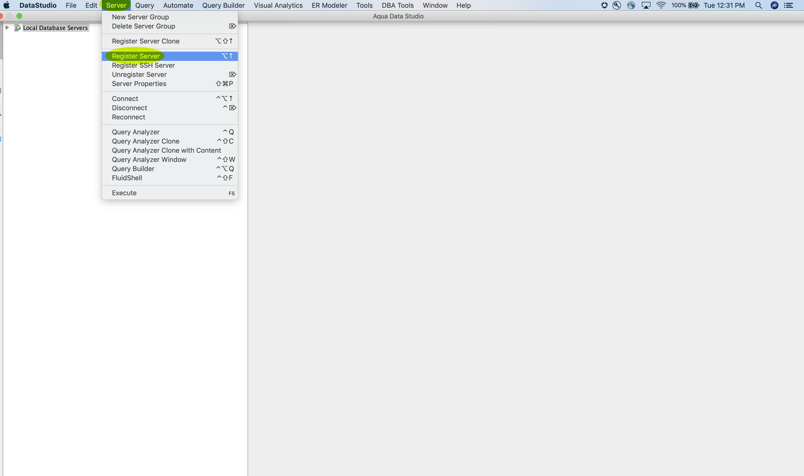

# [!DNL Aqua Data Studio] をクエリサービスに接続

このドキュメントでは、[!DNL Aqua Data Studio] をAdobe Experience Platform [!DNL Query Service] に接続する手順を説明します。

>[!NOTE]
>
> このガイドは、既に [!DNL Aqua Data Studio] にアクセスでき、インターフェイスの操作方法に精通していることを前提としています。 [!DNL Aqua Data Studio] の詳細については、[ 公式の  [!DNL Aqua Data Studio]  ドキュメント ](https://www.aquaclusters.com/app/home/project/public/aquadatastudio/wikibook/Documentation21.1/page/0/Aqua-Data-Studio-21-1) を参照してください。

[!DNL Aqua Data Studio] をインストールした後、まずサーバを登録する必要があります。 メインメニューから **[!DNL Server]** を選択し、次に **[!DNL Register Server]** を選択します。

**[!DNL Register Server]** ダイアログが表示されます。 「**[!DNL General]**」タブで、左側のリストから「**[!DNL PostgreSQL]**」を選択します。 表示されるダイアログで、サーバー設定の次の詳細を指定します。

- **[!DNL Name]**：接続の名前。
- **[!DNL Login Name and Password]**:使用するログイン資格情報。ユーザー名は、`ORG_ID@AdobeOrg` の形式をとります。
- **[!DNL Host and Port]**:ホストエンドポイントと、そののポ [!DNL Query Service]ート。[!DNL Query Service] に接続するには、ポート 80 を使用する必要があります。
- **[!DNL Database]**：使用するデータベース。

>[!NOTE]
>
>ログイン資格情報、ホスト、ポート、およびデータベース名の検索の詳細については、[ 資格情報ガイド ](../ui/credentials.md) を参照してください。 資格情報を探すには、[!DNL Platform] にログインし、**[!UICONTROL クエリ]** を選択してから、**[!UICONTROL 資格情報]** を選択します。

「**[!DNL Driver]**」タブを選択します。**[!DNL Parameters]** の下で、値を `?sslmode=require` に設定します。

接続の詳細を入力したら、**[!DNL Test Connection]** を選択して、資格情報が正しく機能することを確認します。 接続に成功した場合は、**[!DNL Save]** を選択してサーバーを登録します。 登録が成功すると接続がダッシュボードに表示され、サーバーに接続してそのスキーマオブジェクトを表示できることを確認できます。

## 次の手順

[!DNL Query Service] に接続したら、[!DNL Aqua Data Studio] 内で **[!DNL Query Analyzer]** を使用して SQL 文を実行および編集できます。 クエリの書き込みおよび実行方法について詳しくは、『[クエリ実行ガイド](../best-practices/writing-queries.md)』を参照してください。
