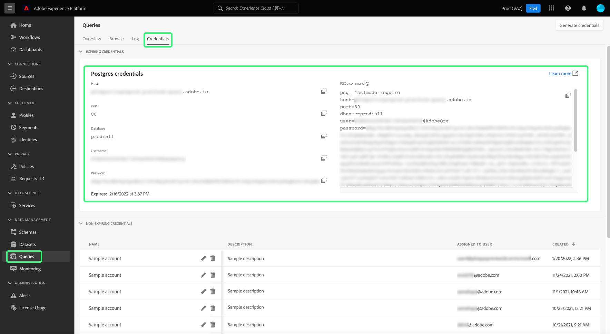

# [!DNL DbVisualizer]を[!DNL Query Service]に接続 {#connect-dbvisualizer}

このドキュメントでは、[!DNL DbVisualizer] データベースツールをAdobe Experience Platform [!DNL Query Service]に接続する手順について説明します。

## はじめに

このガイドでは、[!DNL DbVisualizer] Desktop アプリに既にアクセスしており、そのインターフェイスの操作方法に精通している必要があります。[!DNL DbVisualizer] デスクトップアプリをダウンロードするか、詳細については、[公式 [!DNL DbVisualizer]  ドキュメント &#x200B;](https://www.dbvis.com/download/)を参照してください。

[!DNL &#x200B; DbVisualizer]をExperience Platformに接続するために必要な資格情報を取得するには、Experience Platform UIのQueries ワークスペースにアクセスする必要があります。 現在クエリワークスペースにアクセスできない場合は、組織管理者にお問い合わせください。

## データベース接続の作成 {#connect-database}

デスクトップアプリケーションをローカルマシンにインストールしたら、BDVisualizerの公式な手順に従って[新しいデータベース接続を作成します](https://confluence.dbvis.com/display/UG130/Create+a+New+Database+Connection)。

**[!DNL PostgreSQL]** リストから[!DNL Connections]を選択すると、新しい[!DNL Object View]接続の[!DNL PostgreSQL] タブが表示されます。

### 接続のドライバープロパティの設定 {#properties}

「[!DNL PostgreSQL] オブジェクト表示」タブから、「**[!DNL Properties]**」タブを選択し、ナビゲーションサイドバーから「**[!DNL Driver Properties]**」を選択します。 [&#x200B; ドライバーのプロパティ &#x200B;](https://confluence.dbvis.com/display/UG130/Configuring+Connection+Properties#ConfiguringConnectionProperties-DriverProperties)の詳細については、公式ドキュメントを参照してください。

次に、以下の表に記載されているドライバプロパティを入力します。

>[!IMPORTANT]
>
>DBVisualizerとAdobe Experience Platformを接続するには、SSLの使用を有効にする必要があります。 Adobe Experience Platform Query Serviceへのサードパーティ接続に対するSSL サポートと、[&#x200B; SSL モードを使用して接続する方法については、](./ssl-modes.md)SSL モードのドキュメント `verify-full`を参照してください。

| プロパティ | 説明 |
| ------ | ------ |
| `PGHOST` | [!DNL PostgreSQL] サーバーのホスト名。 この値は、Experience Platform **[!UICONTROL Host]資格情報**&#x200B;です。 |
| `ssl` | SSLの使用を有効にするには、SSL値`1`を定義します。 |
| `sslmode` | これにより、SSL保護のレベルが制御されます。 サードパーティのクライアントをAdobe Experience Platformに接続する場合は、`require` SSL モードを使用することをお勧めします。 `require` モードでは、すべての通信で暗号化が必要であり、ネットワークが正しいサーバーに接続するように信頼されていることを確認します。 サーバーSSL証明書の検証は必要ありません。 |
| `user` | データベースに接続されているユーザー名は、組織IDです。 `@Adobe.Org`で終わる英数字の文字列です。 この値は、Experience Platform **[!UICONTROL Username]資格情報**&#x200B;です。 |

検索バーを使用して各プロパティを検索し、パラメーターの値に対応するセルを選択します。 セルが青色でハイライトされます。 値フィールドにExperience Platform資格情報を入力し、**[!DNL Apply]**&#x200B;を選択してドライバープロパティを追加します。

>[!NOTE]
>
>2番目の`user` プロファイルを追加するには、パラメーター列から`user`を選択し、青い+（プラス）アイコンを選択して各ユーザーの資格情報を追加します。 ドライバーのプロパティを追加するには、**[!DNL Apply]**&#x200B;を選択します。

[!DNL Edited]列には、パラメーター値が更新されたことを示すチェックマークが表示されます。

### 入力クエリサービス資格情報 {#query-service-credentials}

BBVisualizerとQuery Serviceの接続に必要な資格情報を見つけるには、Experience Platform UIにログインし、左側のナビゲーションから「**[!UICONTROL Queries]**」を選択し、その後「**[!UICONTROL Credentials]**」を選択します。 **ホスト**、**ポート**、**データベース**、**ユーザー名**&#x200B;および&#x200B;**パスワード**&#x200B;の資格情報の検索について詳しくは、[資格情報ガイド &#x200B;](../ui/credentials.md)を参照してください。

>[!IMPORTANT]
>
>[!DNL Query Service]は、サードパーティのクライアントとの1回限りのセットアップを可能にするために、有効期限のない資格情報も提供しています。 有効期限のない資格情報を生成して使用する方法については、[完全な手順](../ui/credentials.md#non-expiring-credentials)のドキュメントを参照してください。 BDVisualizerを1回限りのセットアップとして接続する場合は、このプロセスを完了する必要があります。 取得した`credential`および`technicalAccountId`値は、DBVisualizer `password` パラメーターの値を含みます。

## 認証 {#authentication}

接続が確立されるたびにユーザーIDとパスワードベースの認証を要求するには、[!DNL Properties] タブに移動し、**[!DNL Authentication]**&#x200B;の下にあるナビゲーションサイドバーから[!DNL PostgreSQL]を選択します。

接続認証パネルで、**[!DNL Require Userid]**&#x200B;と&#x200B;**[!DNL Require Password]**&#x200B;の両方のチェックボックスをオンにし、**[!DNL Apply]**&#x200B;を選択します。 [認証オプションの設定](https://confluence.dbvis.com/display/UG140/Setting+Common+Authentication+Options)の詳細については、公式ドキュメントを参照してください。

## Experience Platformに接続

期限切れまたは期限切れでない資格情報を使用して接続を行うことができます。 接続を行うには、「**[!DNL Connection]** オブジェクト表示」タブから「[!DNL PostgreSQL]」タブを選択し、次の設定にExperience Platformの資格情報を入力します。 手動での接続の設定[に関する補足説明](https://confluence.dbvis.com/display/UG100/Setting+Up+a+Connection+Manually)は、DBVisualizerの公式web サイトで入手できます。

>[!NOTE]
>
>次の表のBDVisualizerで必要なすべての資格情報は、パラメーターの説明に記載されていない限り、期限切れと期限切れでない資格情報に対しては同じです。

| 接続パラメーター | 説明 |
|---|---|
| **[!UICONTROL Name]** | 接続の名前を作成します。 接続を認識するために、わかりやすい名前を付けることをお勧めします。 |
| **[!UICONTROL Database Server]** | これはExperience Platform **[!UICONTROL Host]**&#x200B;の資格情報です。 |
| **[!UICONTROL Database Port]** | [!DNL Query Service]のポート。 **に接続するには、ポート** 80 **または** 5432[!DNL Query Service]を使用する必要があります。 |
| **[!UICONTROL Database]** | Experience Platform **[!UICONTROL Database]**&#x200B;資格情報の値を使用してください：`prod:all`。 |
| **[!UICONTROL Database Userid]** | これがExperience Platformの組織IDです。 Experience Platform **[!UICONTROL Username]**&#x200B;資格情報の値を使用します。 IDは`ORG_ID@AdobeOrg`の形式になります。 |
| **[!UICONTROL Database Password]** | この英数字の文字列は、Experience Platform **[!UICONTROL Password]**&#x200B;の資格情報です。 期限切れでない資格情報を使用する場合、この値は、構成JSON ファイルにダウンロードされた`technicalAccountID`と`credential`の連鎖引数です。 パスワード値は次の形式になります：{technicalAccountId}:{credential}。 有効期限のない資格情報の設定JSON ファイルは、Adobeがコピーを保持しない初期化中に1回限りのダウンロードです。 |

関連するすべての資格情報を入力したら、**[!DNL Connect]**&#x200B;を選択します。

[!DNL Connect] ダイアログは、セッションの最初の機会に表示されます。 ユーザーIDとパスワードを入力し、**[!DNL Connect]**&#x200B;を選択します。 正常な接続を確認するためのメッセージがログに表示されます。

## 次の手順

[!DNL DbVisualizer]を[!DNL Query Service]に接続したので、[!DNL DbVisualizer]を使用してクエリを作成できます。 クエリの作成方法と実行方法について詳しくは、[&#x200B; クエリ実行に関するガイド &#x200B;](../best-practices/writing-queries.md)を参照してください。
