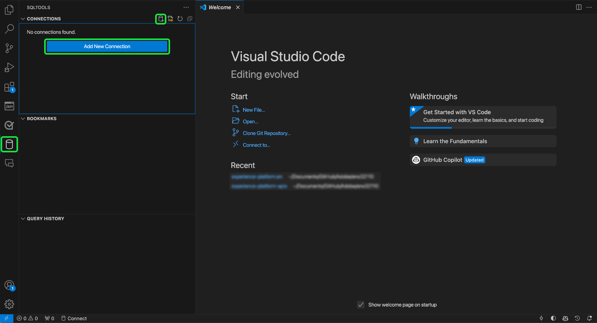
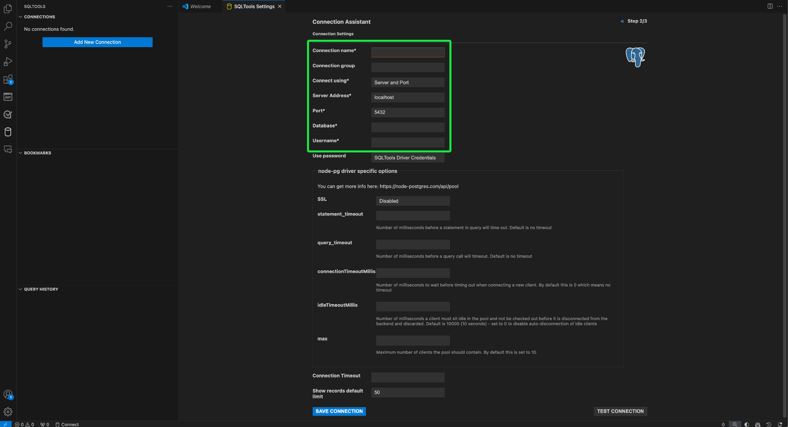
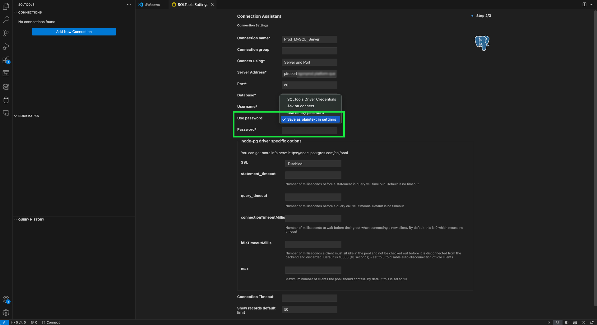
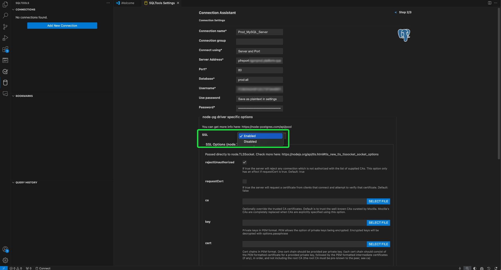
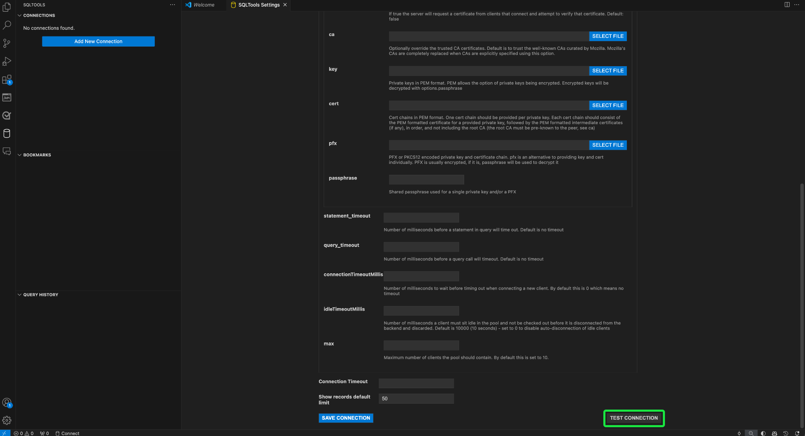
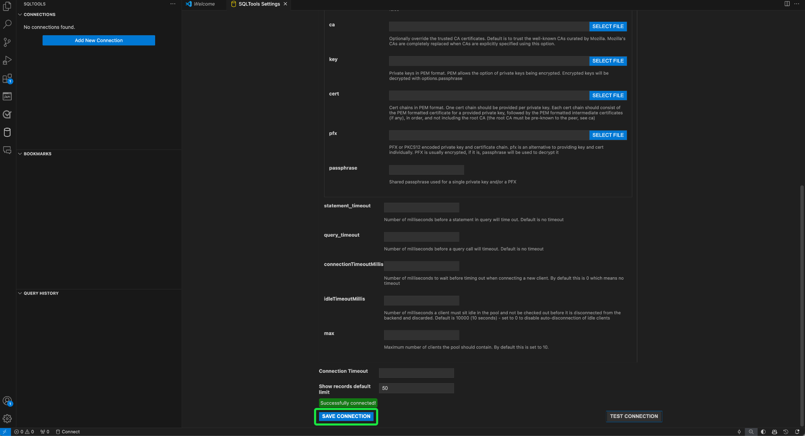
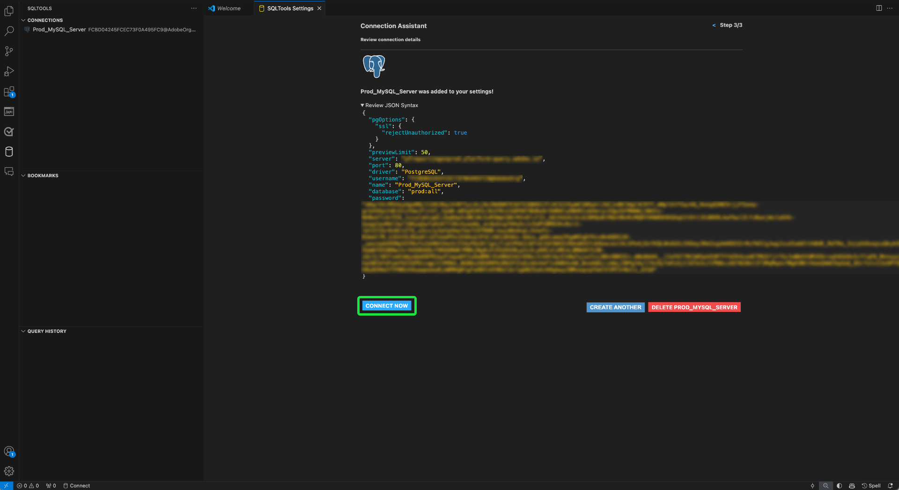
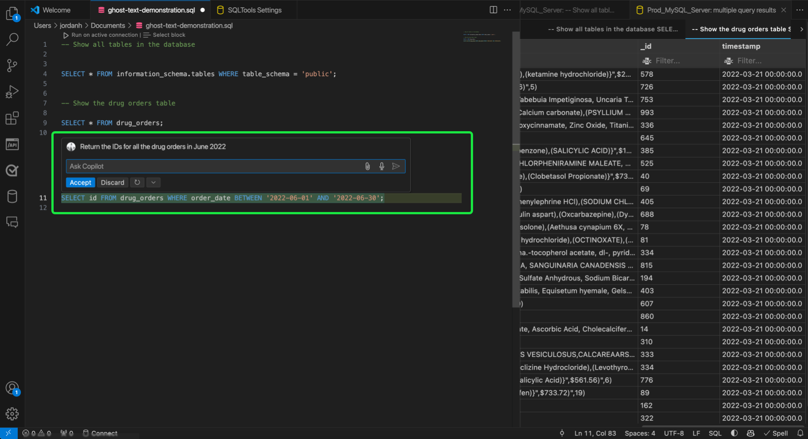
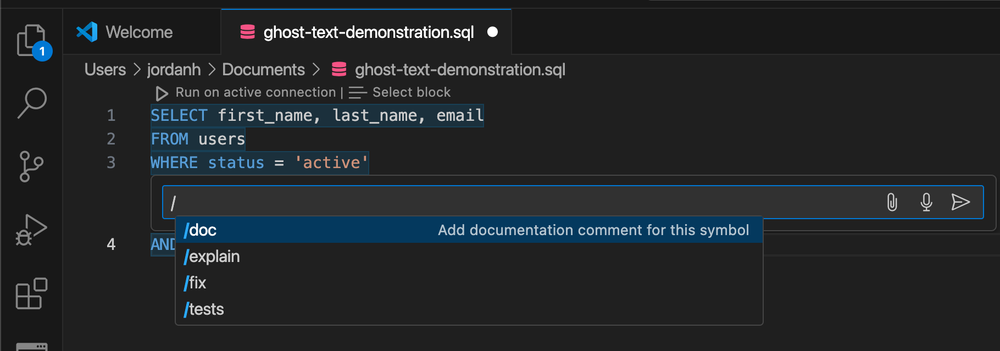

# [!DNL GitHub Copilot]と[!DNL Visual Studio Code]をクエリサービスに接続

>[!IMPORTANT]
>
>この統合ツールを使用する前に、GitHubと共有されるデータを理解する必要があります。 共有データには、編集中のコードとファイルに関するコンテキスト情報（「プロンプト」）とユーザーアクションに関する詳細（「ユーザーエンゲージメントデータ」）が含まれます。  [[!DNL GitHub Copilot]のプライバシーに関する声明](https://docs.github.com/en/site-policy/privacy-policies/github-general-privacy-statement#github-privacy-statement)を確認して、収集するデータについて確認してください。 また、組織のデータガバナンスポリシーを確実に遵守する責任があるため、サードパーティサービスの導入によるセキュリティへの影響も考慮する必要があります。 Adobeは、本ツールの使用から生じる可能性のあるデータ関連の懸念または問題について責任を負いません。 詳しくは、GitHubのドキュメントを参照してください。

OpenAI Codexを活用した[!DNL GitHub Copilot]は、AIを活用したツールで、コードスニペットや機能全体をエディター内で直接提案することで、コーディング体験を向上させます。 [!DNL Visual Studio Code] （[!DNL VS Code]）と統合された[!DNL Copilot]は、特に複雑なクエリを操作する場合、ワークフローを大幅に高速化できます。 このガイドに従って、[!DNL GitHub Copilot]と[!DNL VS Code]をクエリサービスに接続し、より効率的にクエリを作成および管理する方法を説明します。 [!DNL Copilot]について詳しくは、[GitHubのCopilot製品ページ &#x200B;](https://github.com/pricing)および[公式 [!DNL Copilot]  ドキュメント &#x200B;](https://docs.github.com/en/copilot/about-github-copilot/what-is-github-copilot)を参照してください。

このドキュメントでは、[!DNL GitHub Copilot]と[!DNL VS Code]をAdobe Experience Platform Query Serviceに接続するために必要な手順について説明します。

## 基本を学ぶ {#get-started}

このガイドでは、既にGitHub アカウントへのアクセス権があり、[!DNL GitHub Copilot]にサインアップしている必要があります。 [GitHub web サイト &#x200B;](https://github.com/github-copilot/signup)からサインアップできます。 [!DNL VS Code]も必要です。 公式web サイト [から [!DNL VS Code]  ダウンロード &#x200B;](https://code.visualstudio.com/download)できます。

[!DNL VS Code]をインストールして[!DNL Copilot] サブスクリプションをアクティベートしたら、Experience Platformの接続資格情報を取得します。 これらの資格情報は、Experience Platform UIの[!UICONTROL Credentials] ワークスペースの[!UICONTROL Queries] タブにあります。 Experience Platform UI[でこれらの値を見つける方法については、](../ui/credentials.md)資格情報ガイドを参照してください。 現在[!UICONTROL Queries] ワークスペースにアクセスできない場合は、組織管理者にお問い合わせください。

### 必須の拡張機能：[!DNL Visual Studio Code] {#required-extensions}

コードエディター内でExperience Platform SQL データベースを効果的に管理およびクエリするには、次の[!DNL Visual Studio Code]拡張機能が必要です。 これらの拡張機能をダウンロードしてインストールします。

- [SQLTools](https://marketplace.visualstudio.com/items?itemName=mtxr.sqltools):SQLTools拡張機能を使用して、複数のSQL データベースを管理およびクエリします。 クエリランナー、SQL フォーマッター、接続エクスプローラーなどの機能が含まれ、開発者の生産性を高めるための追加のドライバーもサポートされています。 詳しくは、Visual Studio Marketplaceの概要を参照してください。
- [SQLTools PostgreSQL/Cockroach ドライバー](https://marketplace.visualstudio.com/items?itemName=mtxr.sqltools-driver-pg)：この拡張機能を使用すると、コードエディター内で直接PostgreSQLおよびCockroachDB データベースを接続、クエリ、管理できます。

次の拡張機能は[!DNL GitHub Copilot]とそのチャット機能を有効にします。

- [[!DNL GitHub Copilot]](https://marketplace.visualstudio.com/items?itemName=GitHub.copilot)：入力時にインラインコーディングの候補が表示されます。
- [[!DNL GitHub Copilot]  チャット &#x200B;](https://marketplace.visualstudio.com/items?itemName=GitHub.copilot-chat)：会話型AI支援を提供するコンパニオン拡張機能。

## 接続を作成 {#create-connection}

円柱アイコン（）が左側のナビゲーションの[!DNL VS Code]に続き、**[!DNL Add New Connection]**&#x200B;または円柱プラスアイコン（）が続きます。

**[!DNL Connection Assistant]** が表示されます。**[!DNL PostgreSQL]** データベースドライバーを選択します。

![PostgreSQlがハイライト表示された[!DNL VS Code]のSQLTools設定ページ。](../images/clients/github-copilot/postgres-database-driver.png)

### 入力接続設定 {#input-connection-settings}

[!DNL Connection Settings] ビューが表示されます。 Experience Platform接続資格情報をSQLTools [!DNL Connection Assistant]の適切なフィールドに入力します。 必要な値については、次の表で説明します。

| プロパティ | 説明 |
| --- |--- |
| [!DNL Connection name] | [!DNL Connection name]のような、その目的を明確に示す「`Prod_MySQL_Server`」を指定します（MySQL サーバーの実稼動環境など）。 ベストプラクティスは次のとおりです： <ul><li>組織の命名規則に従って、それがシステム内で一意であることを確認します。</li><li>明確性を維持し、他のつながりとの混乱を避けるために、簡潔に保ちます。</li><li>接続の機能または環境に関する関連する詳細を名前に含めます。</li></ul> |
| [!DNL Connect using] | **[!DNL Server and Port]** オプションを使用して、サーバーのアドレス（ホスト名）とポート番号を指定し、Experience Platformへの直接接続を確立します |
| [!DNL Server address] | Experience Platform Postgres資格情報（**[!UICONTROL Host]**&#x200B;など）に指定された`acmeprod.platform-query.adobe.io`値を入力します。 |
| [!DNL Port] | この値は、通常、Experience Platform サービスの`80`です。 |
| [!DNL Database] | Experience Platform Postgres資格情報（**[!UICONTROL Database]**&#x200B;など）に指定された`prod:all`値を入力します。 |
| [!DNL Username] | このプロパティは、組織IDを参照します。 Experience Platform Postgres資格情報で指定された&#x200B;**[!UICONTROL Username]**&#x200B;値を入力します。 |
| [!DNL Password] | このプロパティはアクセストークンです。 Experience Platform Postgres資格情報で指定された&#x200B;**[!UICONTROL Password]**&#x200B;値を入力します。 |

次に、表示されるドロップダウンメニューから「**[!DNL Use Password]**」、「**[!DNL Save as plaintext in settings]**」の順に選択します。 [!DNL Password] フィールドが表示されます。 このテキスト入力フィールドを使用して、アクセストークンを入力します。

最後に、SSLを有効にするには、[!DNL SSL]入力フィールドを選択し、表示されるドロップダウンメニューから[!DNL Enabled]を選択します。

>[!TIP]
>
>すべての資格情報を入力したら、接続を保存する前に接続をテストできます。 ワークスペースの一番下までスクロールして、**[!DNL Test Connection]**&#x200B;を選択します。
>
>{width="100" zoomable="yes"}

接続の詳細を正しく入力したら、**[!DNL Save Connection]**&#x200B;を選択して設定を確認します。

[!DNL Review connection details] ビューが表示され、接続資格情報が表示されます。 接続の詳細が正確であることを確認したら、**[!DNL Connect Now]**&#x200B;を選択します。

[!DNL VS Code] ワークスペースが表示され、[!DNL GitHub Copilot]からの提案が表示されます。

![Aは[!DNL VS Code]でSQL セッションに接続しました。](../images/clients/github-copilot/connected.png)

## [!DNL GitHub Copilot] クイックガイド

Experience Platform インスタンスに接続すると、[!DNL Copilot]をAI コーディングアシスタントとして使用して、より速く、より自信を持ってコードを記述できるようになります。 このセクションでは、主な機能とその使用方法について説明します。

## [!DNL GitHub Copilot] 入門 {#get-started-with-copilot}

まず、最新バージョンの[!DNL VS Code]がインストールされていることを確認してください。 古い[!DNL VS Code] バージョンでは、主要な[!DNL Copilot]機能が意図したとおりに動作しない可能性があります。 次に、[!DNL Enable Auto Completions]設定が有効になっていることを確認します。 [!DNL Copilot]が正しく実行されている場合、**[!DNL Copilot]アイコン** （）がステータスバーに表示されます（問題がある場合は、代わりに[!DNL Copilot] エラーアイコンが表示されます）。 **[!DNL Copilot]アイコン**&#x200B;を選択して、[!DNL [!DNL GitHub Copilot] メニュー]を開きます。 **[!DNL [!DNL GitHub Copilot] メニュー]**&#x200B;から、**[!DNL Edit Settings]**&#x200B;を選択します

![[!DNL VS Code]が表示されている[!DNL GitHub Copilot Menu] エディターと、[!DNL Copilot] アイコンと設定の編集がハイライト表示されています。](../images/clients/github-copilot/github-copilot-menu.png)

オプションを下にスクロールし、[!DNL Enable Auto Completions]設定でチェックボックスが有効になっていることを確認します。

![自動完了を有効にするチェックボックスが選択され、ハイライト表示された[!DNL GitHub Copilot]の設定パネル。](../images/clients/github-copilot/enable-auto-completions.png)

## コード補完 {#code-completions}

[!DNL GitHub Copilot]拡張機能をインストールしてログインすると、**ゴーストテキスト**&#x200B;という機能が自動的にアクティブ化され、入力時にコードの完了が提案されます。 これらの提案は、より効率的に、より少ない中断でコードを記述するのに役立ちます。 コメントを使用して、AI コードの提案を導くこともできます。 つまり、技術的な知識がなくても、平易な言葉をコードに変換してデータを分析することができます。

![&#x200B; コード候補と[!DNL GitHub Copilot] アイコンが強調表示されたVSCode UI。](../images/clients/github-copilot/ghost-text.png)

>[!TIP]
>
>特定のファイルまたは言語の[!DNL Copilot]を無効にする場合は、ステータスバーのアイコンを選択して無効にします。

### ゴーストテキストの完全または部分的な提案を承認 {#accept-suggestions}

[!DNL GitHub Copilot]さんがコードの完了を提案した場合、部分的または完全な提案を受け入れることができます。 **Tab**&#x200B;を選択して全体の候補を承認するか、**Control （またはMacのコマンド）**&#x200B;を押しながら&#x200B;**右向き矢印**&#x200B;を押して部分的なテキストを承認します。 提案を却下するには、**Escape**&#x200B;を押します。

>[!TIP]
>  
>候補が表示されない場合は、ファイルの言語[[!DNL Copilot] で](#get-started-with-copilot)が有効になっていることを確認してください。

![部分的に入力されたコードの横にゴーストテキストとして[!DNL VS Code]からかすかなグレーのテキスト候補を表示する[!DNL GitHub Copilot] エディター。](../images/clients/github-copilot/accept-partial-suggestions.png)

### 代替案 {#alternative-suggestions}

別のコード候補を切り替えるには、[!DNL Copilot] ダイアログで矢印を選択します。

![&#x200B; コパイロットの代替提案パネルを表示する[!DNL VS Code] エディター。](../images/clients/github-copilot/code-suggestions.png)

## インラインチャットの利用 {#inline-chat}

コードについて[!DNL Copilot]と直接チャットすることもできます。 インラインチャットダイアログをトリガーするには、**Control （またはCommand） + I**&#x200B;を使用します。 この機能は、コードを繰り返し実行し、コンテキストで提案を絞り込むために使用されます。 受け入れる前に、コードブロックを強調表示し、インラインチャットを使用して、AIが提案したさまざまなソリューションを確認できます。

<!-- 
THis section is poss unnecessary:
There are inline features for chat including doc, expalin, fix and test

-->

## 専用チャットビュー {#dedicated-chat}

専用のチャットサイドバーを備えた従来のチャットインターフェイスを使用して、アイデアや戦略の策定、コーディングの問題の解決、実装の詳細に関する議論を促進できます。 チャットアイコン（）を[!DNL VS Code] サイドバーに配置して、専用のチャットウィンドウを開きます。

![&#x200B; チャットアイコンがハイライト表示された[!DNL GitHub Copilot]のチャットサイドバー。](../images/clients/github-copilot/chat-sidebar.png)

履歴アイコン（）をチャットパネルの上部に表示します。

## 次の手順

これで、コードエディターから直接Experience Platform データベースを効率的にクエリする準備が整い、[!DNL GitHub Copilot]のAIによるコード提案を使用して、SQL クエリの記述と最適化を効率化できます。 クエリの作成および実行方法について詳しくは、 [クエリ実行のガイダンス](../best-practices/writing-queries.md)を参照してください。
