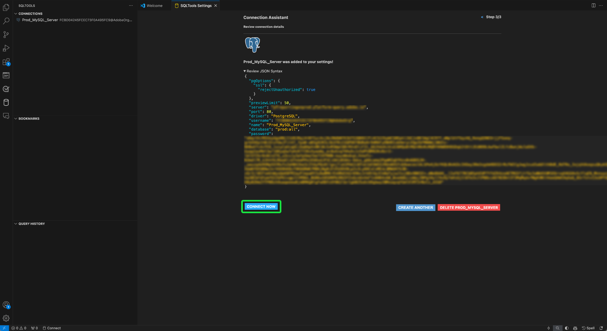

# [!DNL GitHub Copilot] と [!DNL Visual Studio Code] のクエリサービスへの接続

>[!IMPORTANT]
>
>この統合ツールを使用する前に、GitHub と共有されるデータを理解する必要があります。 共有データには、編集中のコードとファイルに関するコンテキスト情報（「プロンプト」）と、ユーザーアクションに関する詳細（「ユーザーエンゲージメントデータ」）が含まれます。  収集したデータについて詳しくは [&#128279;](https://docs.github.com/en/site-policy/privacy-policies/github-general-privacy-statement#github-privacy-statement) [!DNL GitHub Copilot] のプライバシーに関する声明を参照してください。 また、組織のデータガバナンスポリシーへの準拠を確保する責任を負うので、サードパーティのサービスを含める場合のセキュリティへの影響を考慮する必要があります。 Adobeは、このツールの使用から生じる可能性のあるデータ関連の問題に対して責任を負いません。 詳しくは、GitHub のドキュメントを参照してください。

OpenAI Codex を活用した [!DNL GitHub Copilot] は、コードスニペットや機能全体をエディター内で直接提案することで、コーディングエクスペリエンスを強化する AI 駆動のツールです。 [!DNL Visual Studio Code] （[!DNL VS Code]）と統合す [!DNL Copilot] と、特に複雑なクエリを扱う場合に、ワークフローを大幅に高速化できます。 このガイドに従って、[!DNL GitHub Copilot] と [!DNL VS Code] をクエリサービスに接続し、クエリを記述して管理をより効率的に行う方法を学習します。 [!DNL Copilot] について詳しくは、[GitHub のコパイロット製品ページ ](https://github.com/pricing) および [ 公式  [!DNL Copilot]  ドキュメント ](https://docs.github.com/en/copilot/about-github-copilot/what-is-github-copilot) を参照してください。

このドキュメントでは、[!DNL GitHub Copilot] と [!DNL VS Code] をAdobe Experience Platform クエリサービスに接続するために必要な手順について説明します。

## 基本を学ぶ {#get-started}

このガイドでは、GitHub アカウントに既にアクセスし、[!DNL GitHub Copilot] に新規登録している必要があります。 [GitHub web サイトから新規登録 ](https://github.com/github-copilot/signup) できます。 また、[!DNL VS Code] も必要です。 [ 公式サイトからダウンロード  [!DNL VS Code]  できます ](https://code.visualstudio.com/download)。

[!DNL VS Code] をインストールして [!DNL Copilot] サブスクリプションをアクティベートしたら、Experience Platformの接続資格情報を取得します。 これらの資格情報は、Experience Platform UI の [!UICONTROL &#x200B; クエリ &#x200B;] ワークスペースの [!UICONTROL &#x200B; 資格情報 &#x200B;] タブにあります。 詳しくは、資格情報ガイド [Experience Platform UI でこれらの値を見つける方法を参照 ](../ui/credentials.md) を参照してください。 現在、[!UICONTROL &#x200B; クエリ &#x200B;] ワークスペースにアクセスできない場合は、組織の管理者にお問い合わせください。

### 必要な [!DNL Visual Studio Code] 拡張機能 {#required-extensions}

コードエディター内でExperience Platform SQL データベースを効果的に管理およびクエリするには、次の [!DNL Visual Studio Code] 拡張機能が必要です。 これらの拡張機能をダウンロードしてインストールします。

- [SQLTools](https://marketplace.visualstudio.com/items?itemName=mtxr.sqltools)：複数の SQL データベースを管理およびクエリするには、SQLTools 拡張機能を使用します。 クエリランナー、SQL フォーマッター、接続エクスプローラーなどの機能が含まれ、追加のドライバーをサポートして開発者の生産性を高めます。 詳しくは、Visual Studio Marketplace の概要を参照してください。
- [SQLTools PostgreSQL/Cockroach Driver](https://marketplace.visualstudio.com/items?itemName=mtxr.sqltools-driver-pg)：この拡張機能を使用すると、コードエディター内で PostgreSQL データベースと CockroachDB データベースを直接接続、クエリ、管理できます。

次の拡張機能では、[!DNL GitHub Copilot] とそのチャット機能が有効になります。

- [[!DNL GitHub Copilot]](https://marketplace.visualstudio.com/items?itemName=GitHub.copilot)：入力時にインラインコーディングの候補を表示します。
- [[!DNL GitHub Copilot]  チャット ](https://marketplace.visualstudio.com/items?itemName=GitHub.copilot-chat)：会話 AI サポートを提供するコンパニオン拡張機能。

## 接続を作成 {#create-connection}

円柱アイコンを選択します（）（[!DNL VS Code] の左側のナビゲーションで、続いて **[!DNL Add New Connection]** または円柱のプラスアイコン（）を選択します。

**[!DNL Connection Assistant]** が表示されます。**[!DNL PostgreSQL]** データベース ドライバを選択します。

![PostgreSQl がハイライト表示された [!DNL VS Code] の SQLTools 設定ページ ](../images/clients/github-copilot/postgres-database-driver.png)

### 入力接続設定 {#input-connection-settings}

[!DNL Connection Settings] ビューが表示されます。 Experience Platform接続の資格情報を SQLTools フ [!DNL Connection Assistant] ールドの適切なフィールドに入力します。 必要な値について、次の表で説明します。

| プロパティ | 説明 |
| --- |--- |
| [!DNL Connection name] | `Prod_MySQL_Server` のような説明的で、目的を明確に示す「[!DNL Connection name]」を指定します（例えば、MySQL サーバーの実稼動環境）。 ベストプラクティスは次のとおりです。 <ul><li>組織の命名規則に従って、システム内で一意になるようにします。</li><li>明確さを維持し、他の接続との混乱を避けるために、簡潔に保ちます。</li><li>接続の機能や環境に関する関連する詳細を、名前に含めます。</li></ul> |
| [!DNL Connect using] | **[!DNL Server and Port]** オプションを使用して、サーバーのアドレス（ホスト名）とポート番号を指定し、Experience Platformへの直接接続を確立します |
| [!DNL Server address] | Experience Platform Postgres 資格情報で指定された **[!UICONTROL ホスト]** 値（`acmeprod.platform-query.adobe.io` など）を入力します。 |
| [!DNL Port] | この値は、通常、Experience Platform サービスの場合は `80` です。 |
| [!DNL Database] | Experience Platform Postgres 資格情報で指定された **[!UICONTROL Database]** 値（`prod:all` など）を入力します。 |
| [!DNL Username] | このプロパティは組織 ID を参照します。 Experience Platform Postgres の資格情報に指定した **[!UICONTROL ユーザー名]** の値を入力します。 |
| [!DNL Password] | このプロパティはアクセス トークンです。 Experience Platform Postgres の資格情報に指定された **[!UICONTROL パスワード]** 値を入力します。 |

次に、「**[!DNL Use Password]**」を選択し、表示されるドロップダウンメニューから「**[!DNL Save as plaintext in settings]**」を選択します。 [!DNL Password] フィールドが表示されます。 このテキスト入力フィールドを使用して、アクセストークンを入力します。

最後に、SSL を有効にするには、[!DNL SSL] 入力フィールドを選択し、表示されるドロップダウンメニューから「[!DNL Enabled]」を選択します。

>[!TIP]
>
>すべての資格情報を入力したら、接続を保存する前に接続をテストできます。 ワークスペースの下部までスクロール ダウンし、[**[!DNL Test Connection]**] を選択します。
>
>{width="100" zoomable="yes"}

接続の詳細を正しく入力したら、「**[!DNL Save Connection]**」を選択して設定を確認します。

[!DNL Review connection details] ビューが表示され、接続資格情報が表示されます。 接続の詳細が正確であることを確認したら、「**[!DNL Connect Now]**」を選択します。

[!DNL VS Code] ワークスペースが表示され、[!DNL GitHub Copilot] からの提案が表示されます。

![[!DNL VS Code] の接続された SQL セッション。](../images/clients/github-copilot/connected.png)

## [!DNL GitHub Copilot] クイックガイド

Experience Platform インスタンスに接続すると、[!DNL Copilot] を AI コーディングアシスタントとして使用して、より速く、より自信を持ってコードを記述できます。 この節では、主な機能とその使用方法について説明します。

## [!DNL GitHub Copilot] 入門 {#get-started-with-copilot}

まず、最新バージョンの [!DNL VS Code] がインストールされていることを確認します。 古い [!DNL VS Code] バージョンを使用すると、主要な [!DNL Copilot] 機能が意図したとおりに動作しなくなる可能性があります。 次に、[!DNL Enable Auto Completions] 設定が有効になっていることを確認します。 [!DNL Copilot] が正常に動作している場合、ステータス バーに **[!DNL Copilot]アイコン** （）が表示されます（問題がある場合は、代わりに [!DNL Copilot] エラーアイコンが表示されます）。 **[!DNL Copilot]アイコンを選択して**&#x200B;[!DNL [!DNL GitHub Copilot] Menu] を開きます。 &lbrack;**[!DNL [!DNL GitHub Copilot] Menu]** から [**[!DNL Edit Settings]**] を選択します。

![[!DNL GitHub Copilot Menu] が表示され、「[!DNL Copilot]」アイコンと「設定を編集」がハイライト表示された [!DNL VS Code] エディター ](../images/clients/github-copilot/github-copilot-menu.png)

オプションを下にスクロールし、[!DNL Enable Auto Completions] 設定のチェックボックスがオンになっていることを確認します。

![ 「自動補完を有効にする」チェックボックスが選択およびハイライト表示された [!DNL GitHub Copilot] の設定パネル ](../images/clients/github-copilot/enable-auto-completions.png)

## コード完了 {#code-completions}

[!DNL GitHub Copilot] 拡張機能をインストールしてログインすると、自動的に **Ghost Text** という機能がアクティブになり、入力中にコード補完が提案されます。 これらの提案は、より効率的に、より少ない中断でコードを記述するのに役立ちます。 また、コメントを参考にして AI コードの候補を示すこともできます。 つまり、技術に詳しくないユーザーでも、プレーンスピーチをコードに変換して、データを調べることができます。

![ コード提案と [!DNL GitHub Copilot] アイコンがハイライト表示された VSCode UI。](../images/clients/github-copilot/ghost-text.png)

>[!TIP]
>
>特定のファイルまたは言語の [!DNL Copilot] を無効にする場合は、ステータスバーのアイコンを選択して無効にします。

### Ghost Text の全文または一部の候補を受け入れる {#accept-suggestions}

[!DNL GitHub Copilot] がコード補完を提案する場合は、部分的または完全な提案を受け入れることができます。 **Tab** キーを押すと候補の全体が確定し、**Control キー（またはMacの Command キー）を押しながら** 右矢印 **キーを押すと** テキストの一部が確定します。 提案を却下するには、**Esc** キーを押します。

>[!TIP]
>  
>候補が表示されない場合は、ファイルの言語で [[!DNL Copilot]  が有効になっている ](#get-started-with-copilot) ことを確認します。

![[!DNL VS Code] エディターで、部分的に入力されたコードの横に「ゴーストテキスト」と表示され、[!DNL GitHub Copilot] からかすかなグレーのテキストの提案が表示される。](../images/clients/github-copilot/accept-partial-suggestions.png)

### 代替案 {#alternative-suggestions}

代替コードの候補を順番に表示するには、[!DNL Copilot] ダイアログの矢印を選択します。

![ コパイロット代替候補パネルを表示する [!DNL VS Code] エディター ](../images/clients/github-copilot/code-suggestions.png)

## インラインチャットを使用 {#inline-chat}

コードについて [!DNL Copilot] と直接チャットすることもできます。 **Control （または Command） + I** を使用して、インラインチャットダイアログをトリガーにします。 この機能は、コードの反復処理や、コンテキスト内の提案の絞り込みに使用されます。 コードのブロックをハイライト表示し、インラインチャットを使用して、受け入れる前に AI によって提案された別のソリューションを確認できます。

<!-- THis section is poss unnecessary:
There are inline features for chat including doc, expalin, fix and test

 -->

## 専用のチャットビュー {#dedicated-chat}

専用のチャットサイドバーを使用した従来のチャットインターフェイスを使用して、アイデアや戦略を作成、コーディングの問題を解決、実装の詳細を話し合うことができます。 チャット アイコン（）を選択し、専用のチャットウィンドウを開 [!DNL VS Code] ます。

![ チャットアイコンがハイライト表示された [!DNL GitHub Copilot] チャットサイドバー。](../images/clients/github-copilot/chat-sidebar.png)

また、履歴アイコン（）を選択します。

## 次の手順

これで、コードエディターから直接Experience Platform データベースに対して効率的にクエリを実行し、[!DNL GitHub Copilot] の AI を利用したコード提案を使用して、SQL クエリの記述と最適化を効率化できます。 クエリの作成および実行方法について詳しくは、 [クエリ実行のガイダンス](../best-practices/writing-queries.md)を参照してください。
