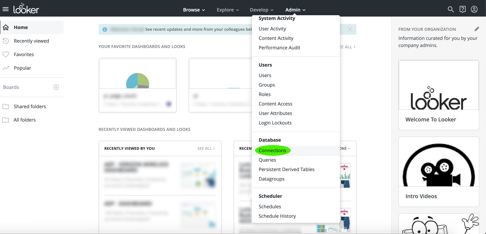

# [!DNL Looker]をクエリサービスに接続

このドキュメントでは、[!DNL Looker]をAdobe Experience Platform [!DNL Query Service]に接続する手順を説明します。

>[!NOTE]
>
> このガイドは、[!DNL Looker]へのアクセス権を既に持っており、インターフェイスの操作方法に精通していることを前提としています。 [!DNL Looker]に関する詳細は、[公式の [!DNL Looker] ドキュメント](https://docs.looker.com/)を参照してください。

[!DNL Looker]にログインした後、**[!DNL Admin]**&#x200B;を選択し、その後に&#x200B;**[!DNL Connections]**&#x200B;を選択します。

このページで、「**[!DNL New Connection]**」を選択します。

ここから、接続設定の詳細を入力できます。

- **[!DNL Name]:** 接続の名前。
- **[!DNL Dialect]:** SQLデータベースで使用される言語。[!DNL Query Service] はを使用しま **[!DNL PostgreSQL]**&#x200B;す。
- **[!DNL Host and Port]:** のホストエンドポイントとそのポー [!DNL Query Service]ト。
- **[!DNL Database]**：使用するデータベース。
- **[!DNL Username and Password]:** 使用するログイン資格情報。ユーザー名は、`ORG_ID@AdobeOrg` の形式で入力します。

>[!NOTE]
>
>ホストとポート、データベース名、ログイン資格情報の検索について詳しくは、[資格情報ガイド](../ui/credentials.md)を参照してください。 資格情報を探すには、[!DNL Platform]にログインし、**[!UICONTROL クエリ]**&#x200B;を選択し、**[!UICONTROL 資格情報]**&#x200B;を選択します。

接続の詳細を入力したら、**[!DNL Test These Settings]**&#x200B;を選択し、資格情報が正しく機能することを確認します。 接続できる場合は、接続できることを示すメッセージが下に表示されます。 接続が成功した場合は、**[!DNL Add Connection]**&#x200B;を選択して接続を作成します。

## 次の手順

[!DNL Query Service]と接続したので、[!DNL Looker]を使用してクエリを記述できます。 クエリの書き込みおよび実行方法について詳しくは、『[クエリ実行ガイド](../best-practices/writing-queries.md)』を参照してください。
