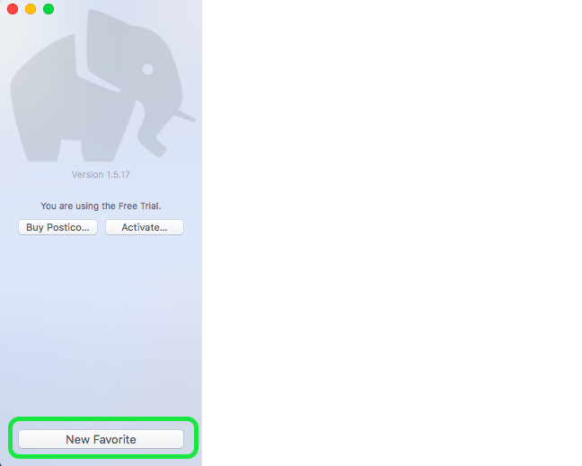
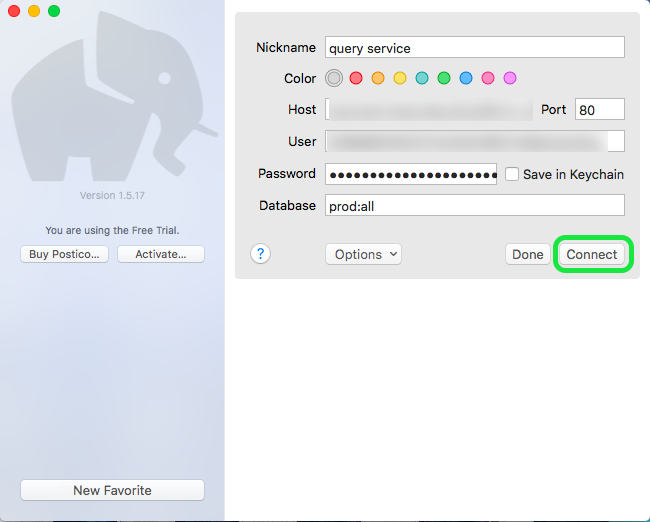

# [!DNL Postico] をクエリサービス (Mac) に接続

このドキュメントでは、[!DNL Postico] をAdobe Experience Platform [!DNL Query Service] に接続する手順を説明します。

>[!NOTE]
>
> このガイドは、既に [!DNL Postico] にアクセスでき、インターフェイスの操作方法に精通していることを前提としています。 [!DNL Postico] の詳細については、[ 公式の  [!DNL Postico]  ドキュメント ](https://eggerapps.at/postico/docs) を参照してください。
> 
> また、[!DNL Postico] は **のみ** で、macOSデバイスで使用できます。

[!DNL Postico] をクエリサービスに接続するには、[!DNL Postico] を開いて **[!DNL New Favorite]** を選択します。

Adobe Experience Platformに接続する値を入力できるようになりました。

データベース名、ホスト、ポート、ログイン資格情報の検索の詳細については、[ 資格情報ガイド ](../ui/credentials.md) を参照してください。 資格情報を探すには、[!DNL Platform] にログインし、**[!UICONTROL クエリ]** を選択してから、**[!UICONTROL 資格情報]** を選択します。

資格情報を挿入したら、**[!DNL Connect]** を選択してクエリサービスに接続します。

Platform に接続すると、以前にクエリサービスでおこなわれたすべての関係のリストを表示できます。

## SQL 文の作成

新しい SQL クエリを作成するには、「SQL クエリ」を選択して開きます。

ボックスが表示され、ここから実行するクエリを入力できます。 終了したら、**[!DNL Execute Statement]** を選択してクエリを実行します。

完了したクエリの実行結果を示す表が表示されます。

## 次の手順

[!DNL Query Service] に接続したら、[!DNL Postico] を使用してクエリを記述できます。 クエリの書き込みおよび実行方法について詳しくは、『[クエリ実行ガイド](../best-practices/writing-queries.md)』を参照してください。
