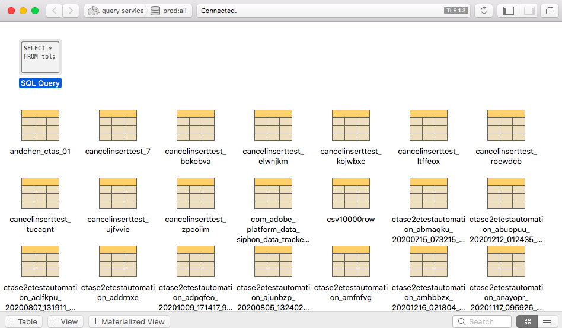

# [!DNL Postico]をクエリサービス(Mac)に接続

このドキュメントでは、[!DNL Postico]をAdobe Experience Platform [!DNL Query Service]に接続する手順を説明します。

>[!NOTE]
>
> このガイドは、[!DNL Postico]へのアクセス権を既に持っており、インターフェイスの操作方法に精通していることを前提としています。 [!DNL Postico]に関する詳細は、[公式の [!DNL Postico] ドキュメント](https://eggerapps.at/postico/docs)を参照してください。
> 
> また、[!DNL Postico]は&#x200B;**のみ**&#x200B;で、macOSデバイスで使用できます。

[!DNL Postico]をクエリサービスに接続するには、[!DNL Postico]を開き、**[!DNL New Favorite]**&#x200B;を選択します。

Adobe Experience Platformに接続する値を入力できるようになりました。

データベース名、ホスト、ポート、ログイン資格情報の検索について詳しくは、『[資格情報ガイド](../ui/credentials.md)』を参照してください。 資格情報を探すには、[!DNL Platform]にログインし、**[!UICONTROL クエリ]**&#x200B;を選択し、**[!UICONTROL 資格情報]**&#x200B;を選択します。

資格情報を挿入したら、**[!DNL Connect]**&#x200B;を選択してクエリサービスに接続します。

Platformに接続すると、以前にクエリサービスでおこなわれたすべての関係のリストを表示できます。

## SQL文の作成

新しいSQLクエリを作成するには、「SQLクエリ」を選択して開きます。

ボックスが表示され、ここから実行するクエリを入力できます。 終了したら、**[!DNL Execute Statement]**&#x200B;を選択してクエリを実行します。

完了したクエリの実行結果を示すテーブルが表示されます。

## 次の手順

[!DNL Query Service]と接続したので、[!DNL Postico]を使用してクエリを記述できます。 クエリの書き込みおよび実行方法について詳しくは、『[クエリ実行ガイド](../best-practices/writing-queries.md)』を参照してください。
