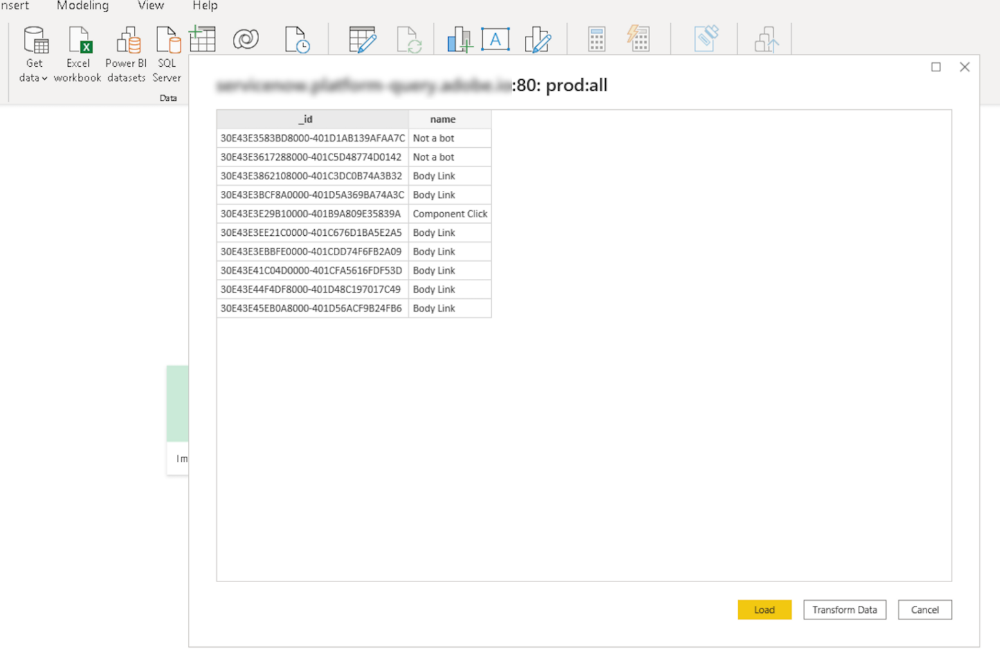

# Power BI をクエリサービスに接続します。

このドキュメントでは、Power BIデスクトップをAdobe Experience Platformクエリサービスに接続する手順を説明します。

## はじめに

このガイドでは、Power BIデスクトップアプリケーションに既にアクセスでき、インターフェイスのナビゲーション方法に詳しいユーザーが必要です。 Power BIデスクトップをダウンロードするには、 [公式Power BI文書](https://docs.microsoft.com/ja-JP/power-bi/).

>[!IMPORTANT]
>
> Power BIデスクトップアプリケーションは **のみ** は、Windows デバイスで使用できます。

Power BIをExperience Platformに接続するために必要な資格情報を取得するには、Platform UI のクエリワークスペースにアクセスできる必要があります。 現在クエリワークスペースへのアクセス権がない場合は、IMS 組織管理者に問い合わせてください。

Power BIをインストールした後、 `Npgsql`:PostgreSQL 用の.NET ドライバーパッケージです。 Npgsql の詳細については、 [Npgsql ドキュメント](https://www.npgsql.org/doc/index.html).

>[!IMPORTANT]
>
>新しいバージョンではエラーが発生するので、v4.0.10 以前をダウンロードする必要があります。

&quot;の下[!DNL Npgsql GAC Installation]」をクリックします。 **[!DNL Will be installed on local hard drive]**.

Npgsql が正しくインストールされていることを確認するには、次の手順に進む前にコンピューターを再起動してください。

## Power BI をクエリサービスに接続します。 {#connect-power-bi}

Power BIをクエリサービスに接続するには、Power BIを開いて、 **[!DNL Get Data]** をクリックします。

検索バーに「PostgreSQL」と入力して、データソースのリストを絞り込みます。 表示される結果の下で、「 」を選択します。 **[!DNL PostgreSQL database]**&#x200B;に続いて **[!DNL Connect]**.

PostgreSQl データベースダイアログが表示され、サーバとデータベースの値を要求します。 これらの値は、Adobe Experience Platformの資格情報から取得されます。 資格情報を見つけるには、Platform UI にログインし、「 」を選択します。 **[!UICONTROL クエリ]** 左のナビゲーションから、の後に **[!UICONTROL 資格情報]**. データベース名、ホスト、ポート、ログイン資格情報の検索の詳細については、 [資格情報ガイド](../ui/credentials.md).

の **[!DNL Server]** 「Power BI」フィールドに、「クエリサービス資格情報」セクションにあるホストの値を入力します。 本番用に、ポートを追加 `:80` をホスト文字列の末尾に追加します。 例：`made-up.platform-query.adobe.io:80`。

この **[!DNL Database]** フィールドには、「すべて」またはデータセットテーブル名を指定できます。 例：`prod:all`。

>[!IMPORTANT]
>
>サードパーティの BI ツールのネストされたデータ構造は、フラット化して、使いやすさを向上させ、データの取得、分析、変換、レポートに必要なワークロードを削減できます。 詳しくは、[`FLATTEN` 機能](../best-practices/flatten-nested-data.md) を参照してください。

### データ接続モード

次に、 **[!DNL Data Connectivity mode]**. 選択 **[!DNL Import]** 続いて **[!DNL OK]** すべての使用可能なテーブルのリストを表示するには、または **[!DNL DirectQuery]** を使用すると、データを直接Power BIにインポートまたはコピーせずに、データソースに対して直接クエリを実行できます。

詳しくは、以下を参照してください。 **[!DNL Import]** モード、次の項を参照してください： [テーブルのインポート](#import). 詳しくは、以下を参照してください。 **[!DNL DirectQuery]** モード、次の項を参照してください： [データをインポートせずにデータセットをクエリする](#direct-query).

選択 **[!DNL OK]** データベースの詳細を確認した後。

### 認証

ユーザー名、パスワード、およびアプリケーション設定を求めるプロンプトが表示されます。 この場合のユーザー名は組織 ID で、パスワードは認証トークンです。 両方とも、クエリサービス資格情報ページにあります。

これらの詳細を入力し、「 **[!DNL Connect]** をクリックして、次の手順に進みます。

## テーブルのインポート {#import}

次を選択すると、 **[!DNL Import]** [!DNL Data Connectivity mode]：フルPower BIセットがインポートされ、選択したテーブルと列をそのままデスクトップアプリケーション内で使用できます。

>[!IMPORTANT]
>
>最初のインポート以降に発生したPower BIの変更を確認するには、データセット全体を再度インポートして、データ内のデータを更新する必要があります。

テーブルをインポートするには、サーバーとデータベースの詳細を入力します [上記のように](#connect-power-bi) をクリックし、 **[!DNL Import]** [!DNL Data Connectivity mode]に続いて **[!DNL OK]**. ダイアログが開き、使用可能なすべてのテーブルのリストが表示されます。 プレビューするテーブルを選択し、その後に **[!DNL Load]** データセットをPower BIに取り込む

これで、テーブルがPower BIにインポートされます。

### カスタム SQL を使用したテーブルのインポート

Power BIや、Tableau などのその他のサードパーティツールでは、現在、ユーザーは、Platform で XDM オブジェクトなど、ネストされたオブジェクトを読み込むことはできません。 これを考慮するために、Power BIは、カスタム SQL を使用してネストされたフィールドにアクセスし、データの統合された表示を作成できます。 次に、Power BIは、以前にネストされたデータのこのフラット化されたビューを通常のテーブルとして読み込みます。

PostgreSQL データベースポップオーバーで、 **[!DNL Advanced options]** カスタム SQL クエリを **[!DNL SQL statement]** 」セクションに入力します。 このカスタムクエリは、JSON の名前と値のペアをテーブル形式に統合するために使用する必要があります。

カスタマイズしたクエリを入力したら、 **[!DNL OK]** をクリックして、データベースへの接続を続行します。 詳しくは、 [認証](#authentication) 上記の節を参照して、ワークフローのこの部分からデータベースに接続する方法を確認してください。

認証が完了すると、統合されたデータのプレビューが、Power BIデスクトップダッシュボードに表として表示されます。 サーバー名とデータベース名がダイアログの上部に表示されます。 選択 **[!DNL Load]** をクリックして、インポートプロセスを完了します。

ビジュアライゼーションをPower BIデスクトップアプリケーションで編集および書き出しできるようになりました。

## データをインポートせずにデータセットをクエリする {#direct-query}

この **[!DNL DirectQuery]** [!DNL Data Connectivity mode] は、データをデータデスクトップに読み込んだりコピーしたりせずに、Power BIソースを直接クエリします。 この接続モードを使用すると、UI を使用して、すべてのビジュアライゼーションを現在のデータで更新できます。 ただし、ビジュアライゼーションの作成または更新に要する時間は、基になるデータソースのパフォーマンスに応じて異なります。

これを使用するには [!DNL Data Connectivity mode]を選択し、 **[!DNL DirectQuery]** 切り替え **[!DNL Advanced options]** カスタム SQL クエリを **[!DNL SQL statement]** 」セクションに入力します。 以下を確認します。 **[!DNL Include relationship columns]** が選択されている。 クエリを完了したら、「 **[!DNL OK]** をクリックして続行します。

クエリのプレビューが表示されます。 選択 **[!DNL Load]** をクリックして、クエリの結果を確認します。

## 次の手順

このドキュメントでは、Power BIデスクトップアプリケーションへの接続方法と、使用可能な様々なデータ接続モードについて説明します。 クエリの書き込みと実行の方法について詳しくは、 [クエリ実行のガイダンス](../best-practices/writing-queries.md).
