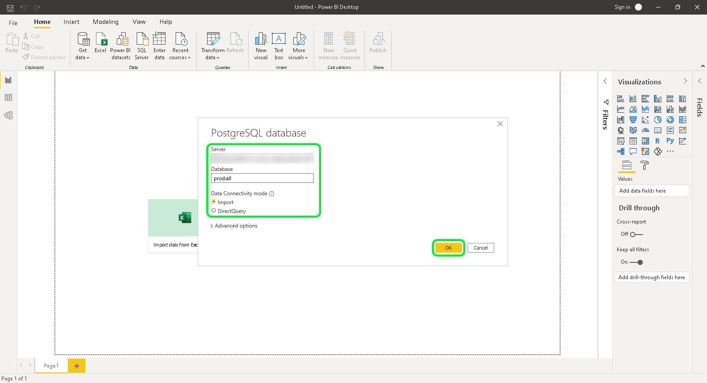

# [!DNL Power BI]をクエリサービス(PC)に接続します

このドキュメントでは、Adobe Experience Platformクエリサービスを使用してPower BIを接続する手順を説明します。

>[!NOTE]
>
> このガイドは、[!DNL Power BI]へのアクセス権を既に持っており、インターフェイスの操作方法に精通していることを前提としています。 [!DNL Power BI]に関する詳細は、[公式の [!DNL Power BI] ドキュメント](https://docs.microsoft.com/ja-JP/power-bi/)を参照してください。
>
> また、Power BIは&#x200B;**のみ**&#x200B;で、Windowsデバイスで使用できます。

Power BIをインストールした後、PostgreSQL用の.NETドライバパッケージ`Npgsql`をインストールする必要があります。 Npgsqlに関する詳細は、[Npgsqlのドキュメント](https://www.npgsql.org/doc/index.html)を参照してください。

>[!IMPORTANT]
>
>新しいバージョンではエラーが発生するので、v4.0.10以前をダウンロードする必要があります。

カスタムセットアップ画面の「[!DNL Npgsql GAC Installation]」で、「**[!DNL Will be installed on local hard drive]**」を選択します。

npgsqlが正しくインストールされていることを確認するには、次の手順に進む前にコンピューターを再起動してください。

## [!DNL Power BI]を[!DNL Query Service]に接続します

[!DNL Power BI]を[!DNL Query Service]に接続するには、[!DNL Power BI]を開き、上部のメニューリボンで&#x200B;**[!DNL Get Data]**&#x200B;を選択します。

**[!DNL PostgreSQL database]**&#x200B;を選択し、その後に&#x200B;**[!DNL Connect]**&#x200B;を選択します。

これで、サーバーとデータベースの値を入力できます。 データベース名、ホスト、ポート、ログイン資格情報の検索について詳しくは、『[資格情報ガイド](../ui/credentials.md)』を参照してください。 資格情報を探すには、[!DNL Platform]にログインし、**[!UICONTROL クエリ]**&#x200B;を選択し、**[!UICONTROL 資格情報]**&#x200B;を選択します。

**[!DNL Server]** は、接続の詳細で見つかったホストです。実稼動環境の場合は、ホスト文字列の末尾にポート`:80`を追加します。 **[!DNL Database]** は、「すべて」またはデータセットテーブル名です。

さらに、**[!DNL Data Connectivity mode]**&#x200B;を選択することもできます。 **[!DNL Import]**&#x200B;を選択して使用可能なすべてのテーブルのリストを表示するか、**[!DNL DirectQuery]**&#x200B;を選択してクエリを直接作成します。

**[!DNL Import]**&#x200B;モードの詳細については、[テーブルのプレビューと読み込み](#preview)の節を参照してください。 **[!DNL DirectQuery]**&#x200B;モードの詳細については、[SQL文の作成](#create)の節を参照してください。 データベースの詳細を確認した後、**[!DNL OK]**&#x200B;を選択します。

ユーザー名、パスワード、アプリケーション設定を求めるプロンプトが表示されます。 次の手順に進むには、これらの詳細を入力し、「**[!DNL Connect]**」を選択します。

## テーブルのプレビューとインポート {#preview}

**[!DNL Import]**&#x200B;モードを選択した場合、ダイアログが表示され、使用可能なすべてのテーブルのリストが表示されます。 プレビューするテーブルを選択し、**[!DNL Load]**&#x200B;を付けてデータセットを[!DNL Power BI]に取り込みます。

これで、テーブルがPower BIにインポートされます。

## SQL文の作成 {#create}

**[!DNL DirectQuery]**&#x200B;モードを選択した場合は、作成するSQLクエリを「詳細オプション」セクションに入力する必要があります。

**[!DNL SQL statement]**&#x200B;の下に、作成するSQLクエリを挿入します。 **[!DNL Include relationship columns]**&#x200B;というラベルの付いたチェックボックスが選択されていることを確認します。 クエリを記述したら、「**[!DNL OK]**」を選択して続行します。

クエリのプレビューが表示されます。 **[!DNL Load]**&#x200B;を選択して、クエリの結果を表示します。

## 次の手順

[!DNL Query Service]と接続したので、[!DNL Power BI]を使用してクエリを記述できます。 クエリの書き込みと実行の方法の詳細については、[クエリ](../best-practices/writing-queries.md)の実行に関するガイドを参照してください。
