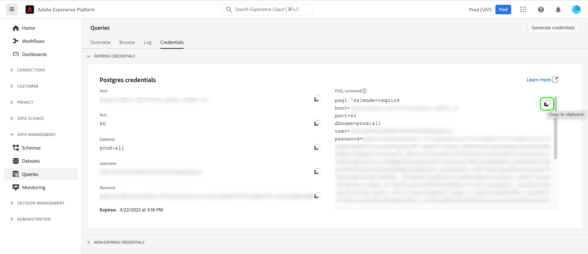

# PSQL をクエリサービスに接続

PSQL は、[!DNL PostgreSQL] をコンピュータにインストールする際にインストールされるコマンドラインインターフェイスです。 このドキュメントでは、PSQL をAdobe Experience Platform [!DNL Query Service] に接続する手順を説明します。

>[!NOTE]
>
> このガイドは、既に [!DNL PSQL] にアクセスでき、使い方に精通していることを前提としています。 [!DNL PSQL] の詳細については、[ 公式の [!DNL PSQL] ドキュメント ](https://www.postgresql.org/docs/current/app-psql.html) を参照してください。

PSQL をコンピューターにインストールした後、PSQL をクエリサービスに接続する準備が整いました。 [!DNL Platform] UI に戻り、「**[!UICONTROL クエリ]**」を選択し、「**[!UICONTROL 資格情報]**」を選択します。



**[!UICONTROL PSQL コマンド]** というラベルのセクションをコピーするアイコンを選択し、コマンド文字列をターミナルまたはコマンドラインウィンドウに貼り付けてから、Enter キーを押します。

>[!IMPORTANT]
>
>PC の場合は、テキストエディターを使用してコマンド文字列の改行を削除し、文字列をコピーします。 バージョン 12.0 以降を使用している場合は、接続文字列に `PGGSSENCMODE=disable` を追加する必要があります。 また、期限切れでない資格情報を使用している場合は、パスワードフィールドを期限切れでない資格情報パスワードに置き換えてください。 期限が切れていない資格情報の詳細については、[ 資格情報ガイド ](../ui/credentials.md) を参照してください。

次のような結果が表示されます。

```shell
psql (10.5, server 0.1.0)
SSL connection (protocol: TLSv1.2, cipher: ECDHE-RSA-AES256-GCM-SHA384, bits: 256, compression: off)
Type "help" for help.
all=>
```

バージョン 10.5 以降が表示されない場合は、バージョン 10.5 以降をダウンロードする必要があります。

## 次の手順

[!DNL Query Service] に接続したので、PSQL を使用してクエリを書き込むことができます。 クエリの書き込みと実行の詳細については、[ クエリの実行 ](../best-practices/writing-queries.md) に関するガイドを参照してください。
