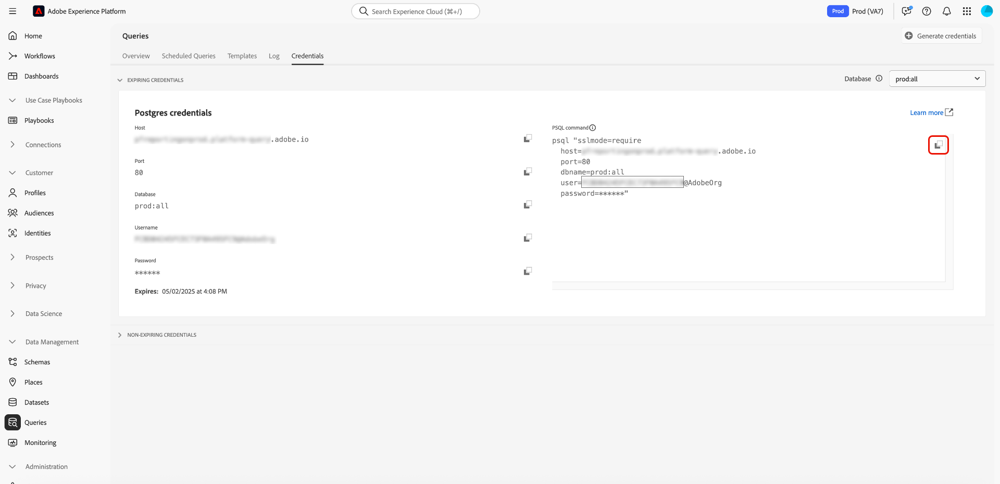

# PSQL のクエリサービスへの接続

PSQL は、お使いのマシンに PostgreSQL と共にインストールされるコマンドラインインターフェイスです。 このドキュメントでは、PSQL とAdobe Experience Platform クエリサービスを接続する手順を説明します。

>[!IMPORTANT]
>
>クエリサービスは、PSQL バージョン 14.x との接続のみをサポートしています。 14.x より前のバージョン（10.x から 13.x など）およびそれ以降のバージョン（15.x 以降）は正式にはサポートされていません。 互換性のあるクライアントバージョンがインストールされていることを確認します。 詳しくは、[PostgreSQL の提供終了日 ](https://endoflife.date/postgresql) を参照してください。

開始する前に、PSQL にアクセスでき、クライアントの使用に関する基本的な知識を持っていることを確認してください。 PSQL について詳しくは、[PSQL の公式ドキュメント ](https://www.postgresql.org/docs/current/app-psql.html) を参照してください。

>[!IMPORTANT]
>
>PostgreSQL をダウンロードする際には、必ずバージョン 14.x を選択してください。デフォルトでは、PostgreSQL の Web サイトに最新バージョンが表示されますが、このバージョンはクエリサービスと互換性がない場合があります。

PSQL がインストールされたら、クエリサービスに接続できます。 Experience Platform UI に戻り、「**[!UICONTROL クエリ]**」、「**[!UICONTROL 資格情報]** の順に選択します。

「**[!UICONTROL PSQL コマンド]**」セクションで、**[!UICONTROL クリップボードにコピー]** アイコン（）を選択して、コマンド文字列をコピーします。



ターミナルにコマンド文字列を貼り付け、キーボードの **Enter** を押します。

>[!IMPORTANT]
>
>PC を使用している場合は、テキストエディターを使用してコマンド文字列の改行を削除し、文字列をコピーします。 バージョン 12.0 以降を使用している場合は、接続文字列に `PGGSSENCMODE=disable` を追加する必要があります。 この設定により、GSSAPI 暗号化が無効になります。これはクエリサービスへの接続には不要であり、接続エラーの原因になる可能性があります。<br> さらに、有効期限のない資格情報を使用している場合は、「パスワード」フィールドを有効期限のない資格情報パスワードに置き換える必要があります。 有効期限のない資格情報について詳しくは、[ 資格情報ガイド ](../ui/credentials.md) を参照してください。

次のような結果が表示されます。

```shell
psql (14.4, server 0.1.0)
SSL connection (protocol: TLSv1.2, cipher: ECDHE-RSA-AES256-GCM-SHA384, bits: 256, compression: off)
Type "help" for help.
all=>
```

バージョン 14.x が表示されない場合は、[ 公式の PostgreSQL ダウンロードページ ](https://www.postgresql.org/download/) から、サポートされている 14.x バージョンの PSQL をダウンロードしてインストールします。

>[!NOTE]
>
>オペレーティングシステムのインストール手順に従い、ターミナルで `psql --version` を実行して、インストールされている PSQL のバージョンを確認します。

## 次の手順

クエリサービスに接続したので、PSQL を使用してクエリを記述できます。 詳しくは、[ クエリの実行 ](../best-practices/writing-queries.md) に関するガイドを参照してください。
