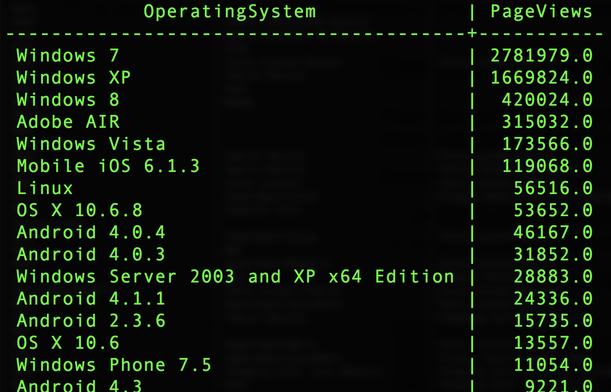

# データセットの結合

データセットを結合すると、他のデータセットのデータをクエリに含めることができます。この例では、カスタムのオペレーティングシステムデータセットを使用して、`operatingsystemID` を `operatingsystem` 値にマッピングしています。

データセット：
- your_analytics_table
- custom_operating_system_lookup

上位 50 のオペレーティングシステムに関する `SELECT` 文をページ表示数別に作成します。

```sql
SELECT 
  b.operatingsystem AS OperatingSystem,
  SUM(a.web.webPageDetails.pageviews.value) AS PageViews
FROM your_analytics_table a 
     JOIN custom_operating_system_lookup b 
      ON a._experience.analytics.environment.operatingsystemID = b.operatingsystemid 
WHERE TIMESTAMP >= ('2018-01-01') AND TIMESTAMP <= ('2018-12-31')
GROUP BY OperatingSystem 
ORDER BY PageViews DESC
LIMIT 50;
```

