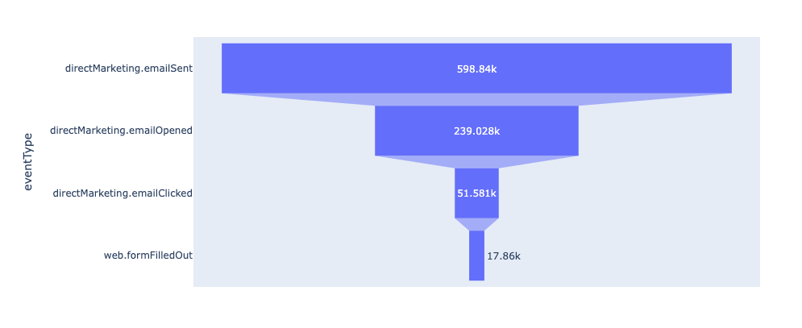
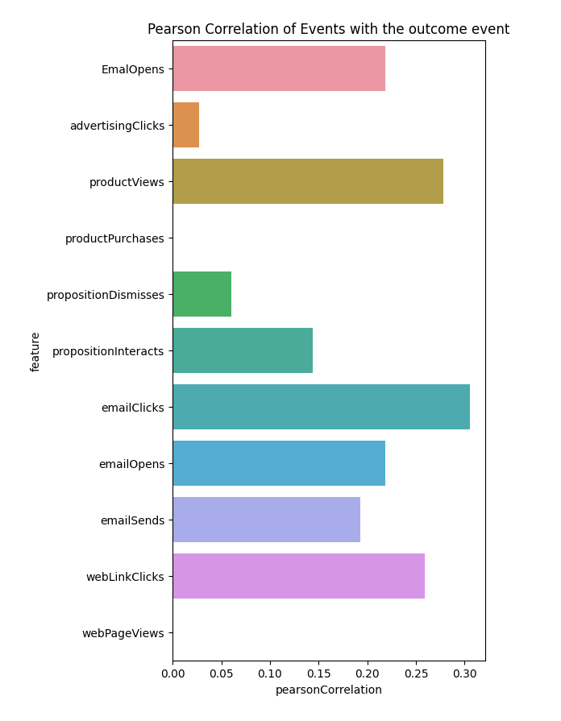

# 探索的データ分析

このドキュメントでは、Data Distillerを使用して[!DNL Python] ノートブックのデータを探索および分析するための基本的な例とベストプラクティスを紹介します。

## はじめに

このガイドを続ける前に、[!DNL Python] ノートブックにData Distillerへの接続を作成していることを確認してください。 Data Distiller[に [!DNL Python]  ノートブックを接続する方法については、ドキュメントを参照してください。](./establish-connection.md)

## 基本統計の取得 {#basic-statistics}

次のコードを使用して、データセット内の行数と個別のプロファイル数を取得します。

```python
table_name = 'ecommerce_events'

basic_statistics_query = f"""
SELECT
    COUNT(_id) as "totalRows",
    COUNT(DISTINCT _id) as "distinctUsers"
FROM {table_name}"""

df = qs_cursor.query(basic_statistics_query, output="dataframe")
df
```

**出力例**

|     | totalRows | distinctUsers |
| --- | ----------- | -------------- |
| 0 | 1276563 | 1276563 |

## 大規模データセットのサンプルバージョンの作成 {#create-dataset-sample}

クエリするデータセットが非常に大きい場合、または探索的クエリの正確な結果が必要ない場合は、Data Distiller クエリで使用できる[ サンプリング機能](../../key-concepts/dataset-samples.md)を使用します。 これは2段階のプロセスです。

- まず、**データセットを**&#x200B;分析して、指定したサンプリング比率のサンプルバージョンを作成します
- 次に、データセットのサンプルバージョンをクエリします。 サンプルされたデータセットに適用する関数によっては、出力を完全なデータセットに数値に拡大することができます

### 5%のサンプルを作成 {#create-sample}

次の例では、データセットを分析し、5%のサンプルを作成します。

```python
# A sampling rate of 10 is 100% in Query Service, so for 5% use a sampling rate 0.5
sampling_rate = 0.5

analyze_table_query=f"""
SET aqp=true;
ANALYZE TABLE {table_name} TABLESAMPLE SAMPLERATE {sampling_rate}"""

qs_cursor.query(analyze_table_query, output="raw")
```

### サンプルの表示 {#view-sample}

`sample_meta`関数を使用して、特定のデータセットから作成されたサンプルを表示できます。 以下のコードスニペットは、`sample_meta`関数の使用方法を示しています。

```python
sampled_version_of_table_query = f'''SELECT sample_meta('{table_name}')'''

df_samples = qs_cursor.query(sampled_version_of_table_query, output="dataframe")
df_samples
```

**サンプル出力**:

|   | sample_table_name | sample_dataset_id | parent_dataset_id | sample_type | sampling_rate | filter_condition_on_source_dataset | sample_num_rows | created |
|---|---|---|---|---|---|---|---|---|
| 0 | cmle_synthetic_data_experience_event_dataset_c... | 650f7a09ed6c3e28d34d7fc2 | 64fb4d7a7d748828d304a2f4 | 均一 | 0.5 | 6427 | 23/09/2023 | 11:51:37 |

{style="table-layout:auto"}

### サンプルのクエリ {#query-sample-data}

返されたメタデータからサンプルテーブル名を参照することで、サンプルを直接クエリできます。 その後、結果にサンプリング比率を掛けて、推定値を得ることができます。

```python
sample_table_name = df_samples[df_samples["sampling_rate"] == sampling_rate]["sample_table_name"].iloc[0]

count_query=f'''SELECT count(*) as cnt from {sample_table_name}'''

df = qs_cursor.query(count_query, output="dataframe")
# Divide by the sampling rate to extrapolate to the full dataset
approx_count = df["cnt"].iloc[0] / (sampling_rate / 100)

print(f"Approximate count: {approx_count} using {sampling_rate *10}% sample")
```

**出力例**

```console
Approximate count: 1284600.0 using 5.0% sample
```

## 電子メールfunnel分析 {#email-funnel-analysis}

Funnel分析とは、目標を達成するために必要なステップと、各ステップを完了したユーザー数を把握する手法です。 次の例は、ユーザーがニュースレターを購読する手順に関する簡単なfunnelの分析を示しています。 サブスクリプションの結果は、`web.formFilledOut`のイベントタイプで表されます。

まず、クエリを実行して、各ステップのユーザー数を取得します。

```python
simple_funnel_analysis_query = f'''SELECT eventType, COUNT(DISTINCT _id) as "distinctUsers",COUNT(_id) as "distinctEvents" FROM {table_name} GROUP BY eventType ORDER BY distinctUsers DESC'''

funnel_df = qs_cursor.query(simple_funnel_analysis_query, output="dataframe")
funnel_df
```

**出力例**

|   | eventType | distinctUsers | distinctEvents |
|---|---|---|---|
| 0 | directMarketing.emailSent | 598840 | 598840 |
| 1 | directMarketing.emailOpened | 239028 | 239028 |
| 2 | web.webpagedetails.pageViews | 120118 | 120118 |
| 3 | advertising.impressions | 119669 | 119669 |
| 4 | directMarketing.emailClicked | 51581 | 51581 |
| 5 | commerce.productViews | 37915 | 37915 |
| 6 | decisioning.propositionDisplay | 37650 | 37650 |
| 7 | web.webinteraction.linkClicks | 37581 | 37581 |
| 8 | web.formFilledOut | 17860 | 17860 |
| 9 | advertising.clicks | 7610 | 7610 |
| 10 | decisioning.propositionInteract | 2964 | 2964 |
| 11 | decisioning.propositionDismiss | 2889 | 2889 |
| 12 | commerce.purchases | 2858 | 2858 |

{style="table-layout:auto"}

### クエリ結果をプロット {#plot-results}

次に、[!DNL Python] `plotly` ライブラリを使用してクエリ結果をプロットします。

```python
import plotly.express as px

email_funnel_events = ["directMarketing.emailSent", "directMarketing.emailOpened", "directMarketing.emailClicked", "web.formFilledOut"]
email_funnel_df = funnel_df[funnel_df["eventType"].isin(email_funnel_events)]

fig = px.funnel(email_funnel_df, y='eventType', x='distinctUsers')
fig.show()
```

**出力例**



## イベントの相関関係 {#event-correlations}

もう1つの一般的な分析は、イベントタイプとターゲットコンバージョンイベントタイプの間の相関関係を計算することです。 この例では、サブスクリプションイベントは`web.formFilledOut`で表されます。 この例では、Data Distiller クエリで使用できる[!DNL Spark]関数を使用して、次の手順を実行します。

1. 各イベントタイプのイベント数をプロファイル別にカウントします。
2. プロファイル全体の各イベントタイプのカウントを集計し、各イベントタイプの相関関係を`web,formFilledOut`で計算します。
3. カウントと相関のデータフレームを、ターゲットイベントを使用して各フィーチャー（イベントタイプのカウント）のピアソン相関係数のテーブルに変換します。
4. 結果をプロットで視覚化します。

[!DNL Spark]関数はデータを集計して結果の小さなテーブルを返します。これにより、このタイプのクエリを完全なデータセットに対して実行できます。

```python
large_correlation_query=f'''
SELECT SUM(webFormsFilled) as webFormsFilled_totalUsers,
       SUM(advertisingClicks) as advertisingClicks_totalUsers,
       SUM(productViews) as productViews_totalUsers,
       SUM(productPurchases) as productPurchases_totalUsers,
       SUM(propositionDismisses) as propositionDismisses_totaUsers,
       SUM(propositionDisplays) as propositionDisplays_totaUsers,
       SUM(propositionInteracts) as propositionInteracts_totalUsers,
       SUM(emailClicks) as emailClicks_totalUsers,
       SUM(emailOpens) as emailOpens_totalUsers,
       SUM(webLinkClicks) as webLinksClicks_totalUsers,
       SUM(webPageViews) as webPageViews_totalusers,
       corr(webFormsFilled, emailOpens) as webForms_EmailOpens,
       corr(webFormsFilled, advertisingClicks) as webForms_advertisingClicks,
       corr(webFormsFilled, productViews) as webForms_productViews,
       corr(webFormsFilled, productPurchases) as webForms_productPurchases,
       corr(webFormsFilled, propositionDismisses) as webForms_propositionDismisses,
       corr(webFormsFilled, propositionInteracts) as webForms_propositionInteracts,
       corr(webFormsFilled, emailClicks) as webForms_emailClicks,
       corr(webFormsFilled, emailOpens) as webForms_emailOpens,
       corr(webFormsFilled, emailSends) as webForms_emailSends,
       corr(webFormsFilled, webLinkClicks) as webForms_webLinkClicks,
       corr(webFormsFilled, webPageViews) as webForms_webPageViews
FROM(
    SELECT _{tenant_id}.cmle_id as userID,
            SUM(CASE WHEN eventType='web.formFilledOut' THEN 1 ELSE 0 END) as webFormsFilled,
            SUM(CASE WHEN eventType='advertising.clicks' THEN 1 ELSE 0 END) as advertisingClicks,
            SUM(CASE WHEN eventType='commerce.productViews' THEN 1 ELSE 0 END) as productViews,
            SUM(CASE WHEN eventType='commerce.productPurchases' THEN 1 ELSE 0 END) as productPurchases,
            SUM(CASE WHEN eventType='decisioning.propositionDismiss' THEN 1 ELSE 0 END) as propositionDismisses,
            SUM(CASE WHEN eventType='decisioning.propositionDisplay' THEN 1 ELSE 0 END) as propositionDisplays,
            SUM(CASE WHEN eventType='decisioning.propositionInteract' THEN 1 ELSE 0 END) as propositionInteracts,
            SUM(CASE WHEN eventType='directMarketing.emailClicked' THEN 1 ELSE 0 END) as emailClicks,
            SUM(CASE WHEN eventType='directMarketing.emailOpened' THEN 1 ELSE 0 END) as emailOpens,
            SUM(CASE WHEN eventType='directMarketing.emailSent' THEN 1 ELSE 0 END) as emailSends,
            SUM(CASE WHEN eventType='web.webinteraction.linkClicks' THEN 1 ELSE 0 END) as webLinkClicks,
            SUM(CASE WHEN eventType='web.webinteraction.pageViews' THEN 1 ELSE 0 END) as webPageViews
    FROM {table_name}
    GROUP BY userId
)
'''
large_correlation_df = qs_cursor.query(large_correlation_query, output="dataframe")
large_correlation_df
```

**サンプル出力**:

|   | webFormsFilled_totalUsers | advertisingClicks_totalUsers | productViews_totalUsers | productPurchases_totalUsers | propositionDismisses_totaUsers | propositionDisplays_totaUsers | propositionInteracts_totalUsers | emailClicks_totalUsers | emailOpens_totalUsers | webLinksClicks_totalUsers | ... | webForms_advertisingClicks | webForms_productViews | webForms_productPurchases | webForms_propositionDismisses | webForms_propositionInteracts | webForms_emailClicks | webForms_emailOpens | webForms_emailSends | webForms_webLinkClicks | webForms_web ページビュー |
|---|---|---|---|---|---|---|---|---|---|---|---|---|---|---|---|---|---|---|---|---|---|
| 0 | 17860 | 7610 | 37915 | 0 | 2889 | 37650 | 2964 | 51581 | 239028 | 37581 | ... | 0.026805 | 0.2779 | なし | 0.06014 | 0.143656 | 0.305657 | 0.218874 | 0.192836 | 0.259353 | なし |

{style="table-layout:auto"}

### 行をイベントタイプの相関関係に変換 {#event-type-correlation}

次に、上記のクエリ出力の1行のデータを、各イベントタイプとターゲットのサブスクリプションイベントとの相関関係を示すテーブルに変換します。

```python
cols = large_correlation_df.columns
corrdf = large_correlation_df[[col for col in cols if ("webForms_"  in col)]].melt()
corrdf["feature"] = corrdf["variable"].apply(lambda x: x.replace("webForms_", ""))
corrdf["pearsonCorrelation"] = corrdf["value"]

corrdf.fillna(0)
```

**サンプル出力**:

|    | 変数 | value | 機能 | pearsonCorrelation |
| --- | ---  |  ---  |  ---  | --- |
| 0 | `webForms_EmailOpens` | 0.218874 | EmailOpen | 0.218874 |
| 1 | `webForms_advertisingClicks` | 0.026805 | advertisingClicks | 0.026805 |
| 2 | `webForms_productViews` | 0.277900 | productViews | 0.277900 |
| 3 | `webForms_productPurchases` | 0.000000 | productPurchases | 0.000000 |
| 4 | `webForms_propositionDismisses` | 0.060140 | propositionDismisses | 0.060140 |
| 5 | `webForms_propositionInteracts` | 0.143656 | propositionInteracts | 0.143656 |
| 6 | `webForms_emailClicks` | 0.305657 | emailClicks | 0.305657 |
| 7 | `webForms_emailOpens` | 0.218874 | emailOpens | 0.218874 |
| 8 | `webForms_emailSends` | 0.192836 | emailSends | 0.192836 |
| 9 | `webForms_webLinkClicks` | 0.259353 | webLinkClicks | 0.259353 |
| 10 | `webForms_webPageViews` | 0.000000 | webPageView | 0.000000 |


最後に、`matplotlib` [!DNL Python] ライブラリとの相関関係を視覚化できます。

```python
import matplotlib.pyplot as plt
fig, ax = plt.subplots(figsize=(5,10))
sns.barplot(data=corrdf.fillna(0), y="feature", x="pearsonCorrelation")
ax.set_title("Pearson Correlation of Events with the outcome event")
```



## 次の手順

このドキュメントでは、Data Distillerを使用して[!DNL Python] ノートブックのデータを探索および分析する方法について説明しました。 Experience Platformから機能パイプラインを作成してマシンラーニング環境でカスタムモデルをフィードする次のステップは、マシンラーニングの機能を[ エンジニア ](./feature-engineering.md)することです。
