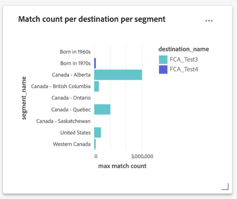

# クエリ高速化ストアレポートインサイトガイド

クエリ高速化ストアにより、データから重要なインサイトを得るために必要な時間と処理能力を削減できます。通常、データは標準の間隔（時間単位、日単位など）で処理され、集計ビューが作成、レポートされます。集計データから生成されたこれらのレポートの分析により、業績の向上を目的としたインサイトが得られます。クエリ高速化ストアには、キャッシュサービス、同時実行、インタラクティブなエクスペリエンス、ステートレス API が含まれています。ただし、生データのクエリではなく、集計クエリ用にデータが事前処理および最適化されていることを前提としています。

クエリ高速化ストアを使用すると、カスタムデータモデルを作成したり、既存のAdobe Real-time Customer Data Platformデータモデルを拡張したりできます。 その後、任意のレポート／ビジュアライゼーションフレームワークにレポートインサイトを組み込むことができます。[SQL クエリテンプレートをカスタマイズして、マーケティングおよび主要業績評価指標（KPI）のユースケースに関する Real-Time CDP レポートを作成する](../../../dashboards/cdp-insights-data-model.md)方法については、 Real-time Customer Data Platform インサイトデータモデルのドキュメントを参照してください。

Adobe Experience Platform の Real-Time CDP データモデルは、プロファイル、セグメントおよび宛先に関するインサイトを提供し、Real-Time CDP インサイトダッシュボードを有効にします。このドキュメントでは、レポートインサイトデータモデルの作成プロセスと、Real-Time CDP データモデルを必要に応じて拡張する方法について説明します。

## 前提条件

このチュートリアルでは、ユーザー定義のダッシュボードを使用して、Platform UI 内のカスタムデータモデルからのデータを視覚化します。この機能について詳しくは、[ユーザー定義ダッシュボードのドキュメント](../../../dashboards/user-defined-dashboards.md)を参照してください。

## はじめに

レポートインサイト用のカスタムデータモデルを作成したり、エンリッチメントされた Platform データを保持する Real-Time CDP データモデルを拡張したりするには、Data Distiller SKU が必要です。詳しくは、 [パッケージ](../../packages.md) および [guardrail](../../guardrails.md#query-accelerated-store) Data Distiller SKU に関するドキュメント。 Data Distiller SKU をお持ちでない場合は、アドビのカスタマーサービス担当者に詳細をお問い合わせください。

<!-- Document is hidden temporarily
Please see the [packaging](../../packages.md), [guardrails](../../guardrails.md#query-accelerated-store), and [licensing](../../data-distiller/license-usage.md) documentation that relates to the Data Distiller SKU. 
-->

## レポートインサイトデータモデルの作成

このチュートリアルでは、オーディエンスインサイトデータモデルの作成例を使用します。1 つ以上の広告主プラットフォームを使用してオーディエンスにリーチする場合は、広告主の API を使用して、オーディエンスのおおよその一致数を取得できます。

最初に、ソース（場合によっては広告主プラットフォーム API）から初期データモデルを取得します。生データの集計ビューを作成するには、次の画像に示すように、レポートインサイトモデルを作成します。 これにより、1 つのデータセットでオーディエンスの一致の上限と下限を取得できます。


この例では、`externalaudiencereach` テーブル／データセットは ID に基づいており、一致数の下限と上限をトラックします。`externalaudiencemapping` ディメンションテーブル／データセットは、外部 ID を Platform の宛先とセグメントにマップします。

## Data Distiller を使用したレポートインサイト用のモデルの作成

次に、レポートインサイトモデル（この例では `audienceinsight`）を作成し、SQL コマンド `ACCOUNT=acp_query_batch and TYPE=QSACCEL` を使用して、高速化ストアで作成されるようにします。次に、クエリサービスを使用して、`audienceinsight` データベース用の `audienceinsight.audiencemodel` スキーマを作成します。

>[!NOTE]
>
>`ACCOUNT=acp_query_batch` コマンドには、Data Distiller SKU が必要です。ない場合は、データレイク上に標準のデータモデルが作成されます。

```sql
CREATE database audienceinsight WITH (TYPE=QSACCEL, ACCOUNT=acp_query_batch);
 
CREATE schema audienceinsight.audiencemodel;
```

## テーブル、関係の作成、データの入力

`audienceinsight` レポートインサイトモデルを作成したので、`externalaudiencereach` テーブルと `externalaudiencemapping` テーブルを作成し、それらの間の関係を確立します。次に、`ALTER TABLE` コマンドを使用して、テーブル間に外部キー制約を追加し、関係を定義します。 次の SQL の例は、この方法を示しています。

```sql
CREATE TABLE IF NOT exists audienceinsight.audiencemodel.externalaudiencereach
WITH ( DISTRIBUTION = REPLICATE ) AS
  SELECT cast(null as int) approximate_count_upper_bound,
         cast(null as string) deliverystatusdescription,
         cast(null as timestamp)  timeupdated ,
         cast(null as int) operationstatuscode ,
         cast(null as string) operationstatusdescription,
         cast(null as int) approximate_count_lower_bound,
         cast(null as timestamp)timecreated ,
         cast(null as timestamp)timecontentupdated ,
         cast(null as int) deliverystatuscode ,
         cast(null as int)  ext_custom_audience_id
   WHERE false;
 
CREATE TABLE IF NOT exists audienceinsight.audiencemodel.externalaudiencemapping
WITH ( DISTRIBUTION = REPLICATE ) AS
SELECT cast(null as int) segment_id,
       cast(null as int) destination_id,
       cast(null as int) ext_custom_audience_id
 WHERE false;
 
ALTER TABLE externalaudiencereach ADD  CONSTRAINT FOREIGN KEY (ext_custom_audience_id) REFERENCES externalaudiencemapping (ext_custom_audience_id) NOT enforced;
```

両方の `ALTER TABLE` コマンドが正常に実行されると、ファクトテーブルとディメンションテーブルの間の関係が形成されます。

ステートメントが実行されたら、`SHOW datagroups;` コマンドを使用して、`audienceinsight.audiencemodel` から高速化ストアで使用可能なデータセットのリストを返します。表形式の結果は、次の例に類似したものになります。

>[!IMPORTANT]
>
>高速化ストア内のデータのみが、クエリサービスのステートレス API エンドポイント `POST /data/foundation/query/accelerated-queries` からアクセスできます。

```console
    Database     |    Schema     | GroupType |      ChildType       |        ChildName        | PhysicalParent |               ChildId               
-----------------+---------------+-----------+----------------------+-------------------------+----------------+--------------------------------------
 audienceinsight | audiencemodel | QSACCEL   | Data Warehouse Table | externalaudiencemapping | true           | 9155d3b4-889d-41da-9014-5b174f6fa572
 audienceinsight | audiencemodel | QSACCEL   | Data Warehouse Table | externalaudiencereach   | true           | 1b941a6d-6214-4810-815c-81c497a0b636
```

## レポートインサイトデータモデルのクエリ

クエリサービスを使用して、`audiencemodel.externalaudiencereach` ディメンション テーブルをクエリします。クエリの例を次に示します。

```sql
SELECT a.ext_custom_audience_id,
       a.approximate_count_upper_bound
FROM   audiencemodel.externalaudiencereach AS a
       LEFT OUTER JOIN audiencemodel.externalaudiencemapping AS b
                    ON ( ( a.ext_custom_audience_id ) =
                         ( b.ext_custom_audience_id ) )
GROUP  BY a.ext_custom_audience_id,
          a.approximate_count_upper_bound
LIMIT  5000 ;
```

表形式の結果には、カウントと ID が含まれます。

```console
ext_custom_audience_id | approximate_count_upper_bound
------------------------+-------------------------------
 23850912218170554      |                          1000
 23850808585120554      |                       1012000
 23850808585220554      |                        100000
 23850814978560554      |                          1000
 23850808585180554      |                        421000
 23850814978510554      |                       3001000
 23850814978530554      |                        300000
 23850912218160554      |                        105000
 23850808584990554      |                          1000
 23850809520110554      |                          1000
(10 rows)
```

## Real-Time CDP インサイトデータモデルを使用したデータモデルの拡張

詳細を追加してオーディエンスモデルを拡張し、より充実したディメンションテーブルを作成できます。例えば、セグメント名と宛先名を外部オーディエンス ID にマッピングできます。これを行うには、クエリサービスを使用して新しいデータセットを作成または更新し、セグメントと宛先を外部 ID と組み合わせるオーディエンスモデルに追加します。次の図は、このデータモデル拡張の概念を示しています。


## レポートインサイトモデルを拡張するディメンションテーブルの作成

クエリサービスを使用して、エンリッチメントされた Real-Time CDP ディメンションデータセットから `audienceinsight` データモデルに主要な記述属性を追加し、ファクトテーブルと新しいディメンションテーブルの間の関係を確立します。次の SQL は、既存のディメンションテーブルをレポートインサイトデータモデルに統合する方法を示しています。

```sql
CREATE TABLE audienceinsight.audiencemodel.external_seg_dest_map AS
  SELECT ext_custom_audience_id,
         destination_name,
         segment_name,
         destination_status,
         a.destination_id,
         a.segment_id
  FROM   externalaudiencemapping AS a
         LEFT OUTER JOIN adwh_dim_segments AS b
                      ON ( ( a.segment_id ) = ( b.segment_id ) )
         LEFT OUTER JOIN adwh_dim_destination AS c
                      ON ( ( a.destination_id ) = ( c.destination_id ) );
 
ALTER TABLE externalaudiencereach  ADD  CONSTRAINT FOREIGN KEY (ext_custom_audience_id) REFERENCES external_seg_dest_map (ext_custom_audience_id) NOT enforced;
```

`SHOW datagroups;` コマンドを使用して、追加の `external_seg_dest_map` ディメンションテーブルの作成を確認します。

```console
    Database     |     Schema     | GroupType |      ChildType       |                ChildName  | PhysicalParent |               ChildId               
-----------------+----------------+-----------+----------------------+----------------------------------------------------+----------------+--------------------------------------
 audienceinsight | audiencemodel | QSACCEL   | Data Warehouse Table | external_seg_dest_map      | true           | 4b4b86b7-2db7-48ee-a67e-4b28cb900810
 audienceinsight | audiencemodel | QSACCEL   | Data Warehouse Table | externalaudiencemapping    | true           | b0302c05-28c3-488b-a048-1c635d88dca9
 audienceinsight | audiencemodel | QSACCEL   | Data Warehouse Table | externalaudiencereach      | true           | 4485c610-7424-4ed6-8317-eed0991b9727
```

## 拡張した高速ストアレポートインサイトデータモデルのクエリ

これで `audienceinsight` データモデルが強化されたので、クエリを実行する準備が整いました。次の SQL は、マッピングされた宛先とセグメントのリストを示します。

```sql
SELECT a.ext_custom_audience_id,
       b.destination_name,
       b.segment_name,
       b.destination_status,
       b.destination_id,
       b.segment_id
FROM   audiencemodel.externalaudiencereach1 AS a
       LEFT OUTER JOIN audiencemodel.external_seg_dest_map AS b
                    ON ( ( a.ext_custom_audience_id ) = (
                         b.ext_custom_audience_id ) )
LIMIT  25; 
```

クエリは、クエリ高速ストア上のすべてのデータセットを返します。

```console
ext_custom_audience_id | destination_name |       segment_name        | destination_status | destination_id | segment_id 
------------------------+------------------+---------------------------+--------------------+----------------+-------------
 23850808595110554      | FCA_Test2        | United States             | enabled            |     -605911558 | -1357046572
 23850799115800554      | FCA_Test2        | Born in 1980s             | enabled            |     -605911558 | -1224554872
 23850799115790554      | FCA_Test2        | Born in 1970s             | enabled            |     -605911558 |  1899603869
 23850798177620554      | FCA_Test1        | Billionaires              | enabled            |      321720439 |  1401872665
 23850814978560554      | FCA_Test3        | Canada - Saskatchewan     | enabled            |     1182494936 | -1917996562
 23850808585180554      | FCA_Test3        | United States             | enabled            |     1182494936 | -1357046572
 23850814978530554      | FCA_Test3        | Canada - British Columbia | enabled            |     1182494936 |  -652840507
 23850808585120554      | FCA_Test3        | Canada - Quebec           | enabled            |     1182494936 |  -519557860
 23850809520110554      | FCA_Test3        | Born in 1960s             | enabled            |     1182494936 |   237824266
 23850808585220554      | FCA_Test3        | Western Canada            | enabled            |     1182494936 |  1075937528
 23850808584990554      | FCA_Test3        | Canada - Ontario          | enabled            |     1182494936 |  1593438041
 23850814978510554      | FCA_Test3        | Canada - Alberta          | enabled            |     1182494936 |  1862946783
 23850912218170554      | FCA_Test4        | Canada - Alberta          | enabled            |     1549248886 |  1862946783
 23850912218160554      | FCA_Test4        | Born in 1970s             | enabled            |     1549248886 |  1899603869
```

## ユーザー定義のダッシュボードでデータを視覚化

これで、カスタムデータモデルが作成されたので、カスタムクエリおよびユーザー定義ダッシュボードを使用してデータを視覚化する準備が整いました。

次の SQL は、宛先のオーディエンスごとの一致数の分類と、セグメント別のオーディエンスの各宛先の分類を示します。

```sql
SELECT b.destination_name,
       a.approximate_count_upper_bound,
       b.segment_name
FROM   audiencemodel.externalaudiencereach AS a
       LEFT OUTER JOIN audiencemodel.external_seg_dest_map AS b
                    ON ( ( a.ext_custom_audience_id ) = (
                         b.ext_custom_audience_id ) )
GROUP  BY b.destination_name,
          a.approximate_count_upper_bound,
          b.segment_name
ORDER BY b.destination_name
LIMIT  5000
```

次の画像は、レポートインサイトデータモデルを使用して可能なカスタムビジュアライゼーションの例を示しています。



カスタムデータモデルは、ユーザー定義のダッシュボードワークスペースで使用可能なデータモデルのリストに表示されます。カスタムデータモデルの活用方法について詳しくは、[ユーザー定義ダッシュボードガイド](../../../dashboards/user-defined-dashboards.md)を参照してください。
