# Adobe Experience Platform Data Distillerで価値を最大化するためのヒント - OS656

このページでは、Adobe Summit セッション「OS656 - Top Tips to Maximize Value with Adobe Experience Platform Data Distiller」で学んだことを適用するためのサンプルデータセットを示します。 リアルタイム顧客プロファイルデータを充実させることで、Adobe Real-Time Customer Data PlatformとJourney Optimizerの導入を加速させる方法をご紹介します。 この強化では、顧客行動パターンに関する詳細なインサイトを活用して、エクスペリエンスの配信と最適化のためのオーディエンスを構築します。

Lumaのケーススタディでは、ユーザー行動データを分析し、購入パターンにもとづく顧客セグメンテーションのためのマーケティング分析手法である&#x200B;*最新性、頻度、通貨（RFM）* モデルを作成します。

## 前提条件

このユースケースを実行するには、[Data Distiller](./overview.md)のAdobe Experience Platform インスタンスのライセンスが必要です。 詳しくは、アドビ担当者にお問い合わせください。

また、クエリの実行に必要な&#x200B;**組織のテナント ID**&#x200B;を知る必要もあります。 テナント IDは、Experience Platformにログインした際のURLの最初の部分で、@記号の直後に表示されます。

例として、次の URL を見てみましょう。

```http
https://experience.adobe.com/#/@pfreportingonprod/sname:prod/platform/home
```

テナント IDは`pfreportingonprod`です。

## RFM モデルの概要 {#rfm-overview}

RFMとは、Recency （R）、Frequency （F）、Monetary （M）の略で、顧客セグメンテーションと分析に対するデータ主導型のアプローチです。 この手法では、顧客の行動の3つの重要な側面である、購入した回数、エンゲージメントの頻度、購入額を評価します。 これらの要因を定量化することで、顧客セグメントに関する実用的なインサイトを得て、個々の顧客のニーズにより的確に対応するターゲットを絞ったマーケティング戦略を策定できます。

## RFM モデルを使用した顧客行動の理解 {#understand-customer-behavior}

RFM モデルでは、3つの主要パラメータを使用して、取引行動にもとづいて顧客をセグメンテーションします。

- **最新性**&#x200B;は、顧客が最後に購入してから経過した時間を測定し、エンゲージメントのレベルと今後の購入可能性を示します。
- **頻度**&#x200B;は、顧客とのやり取りの頻度を追跡し、ロイヤルティと持続的なエンゲージメントを示す明確な指標として機能します。
- **金銭的価値**&#x200B;は、顧客の総支出額を評価し、その企業に対する全体的な価値を強調します。

これらの要因を組み合わせることで、各顧客に数値スコア（通常は`1`から`4`までのスケール）を割り当てます。 スコアが低い場合は、より良好な結果が得られることを示します。 たとえば、あらゆるカテゴリーで`1`をスコア付けする顧客は、最近の活動、高いエンゲージメント、多額の支出を示す優れた企業のひとつであると考えられています。

## RFM モデルの利点と制限事項 {#benefits-and-limitations}

あらゆるマーケティングモデルにはトレードオフが含まれ、利点と欠点の両方が存在します。 RFM モデリングは、顧客の行動を把握し、マーケティング戦略を改善するための有益なツールです。 顧客セグメンテーションによるメッセージのパーソナライゼーション、売上の最適化、応答率、顧客維持率、顧客満足度、CLTV （顧客生涯価値）の向上などのメリットがあります。

しかし、RFM モデリングには限界があります。 鮮度、頻度、金銭的価値にもとづいてセグメント内の統一性を仮定するため、顧客行動が簡素化される可能性があります。 また、これらの要因に同量の重みが割り当てられるため、顧客価値が誤って表示される可能性があります。 さらに、製品固有の特性や顧客の嗜好などのコンテクストを考慮していないため、購買行動の誤解につながる可能性があります。

## 動的なRFM スコアベースのSQL オーディエンスの構築 {#build-a-dynamic-rfm-audience}

次のインフォグラフィックでは、このチュートリアルで説明するRFM SQL オーディエンス作成ワークフローの概要を説明します。

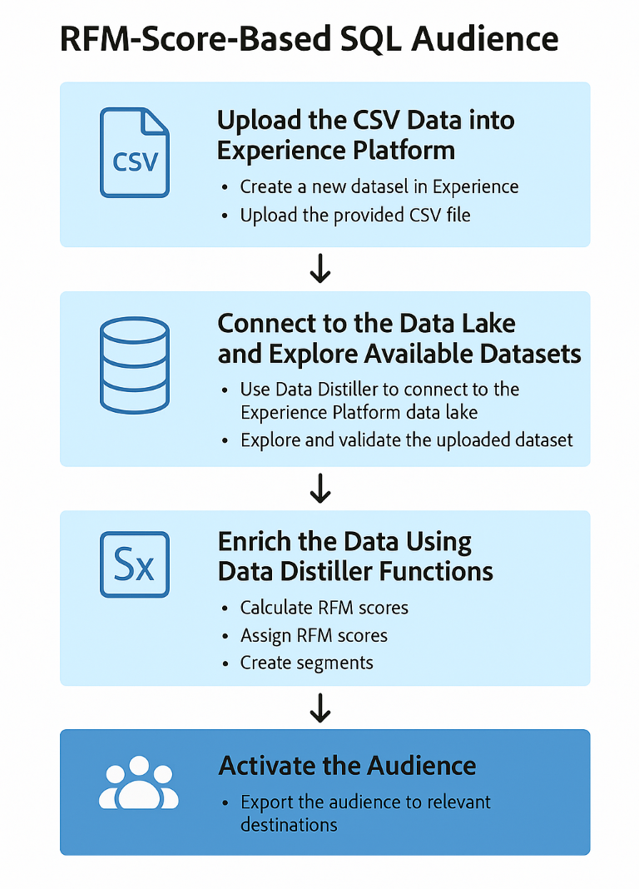

Luma ケーススタディを開始する前に、サンプルデータセットを取り込む必要があります。 まず、[ リンクを選択して`luma_web_data.zip` データセットをローカルにダウンロードします](../resources/luma_web_data.zip)。 サンプルデータセットは、ユースケースに合わせて圧縮.zip形式のcsv ファイルです。 Adobe Acrobatまたはオペレーティングシステムの組み込みユーティリティなどの信頼できるファイル抽出ツールを使用して、このZIP ファイルを解凍します。 実際には、通常、Adobe Analytics、Adobe Commerce、またはAdobe Web/Mobile SDKからデータを取得します。

このチュートリアルでは、Data Distillerを使用して、関連するイベントとフィールドを標準化されたCSV フォーマットに抽出します。 目標は、効率と使いやすさを高めるために、フラットなデータ構造を維持しながら、必須フィールドのみを含めることです。

### 手順1:CSV データをExperience Platformにアップロードする {#upload-csv-data}

CSV ファイルをAdobe Experience Platformにアップロードするには、次の手順に従います。

#### CSV ファイルからのデータセットの作成 {#create-a-dataset}

Experience Platform UIで、左側のナビゲーションパネルで「**[!UICONTROL Datasets]**」を選択し、その後に「**[!UICONTROL Create dataset]**」を選択します。 次に、使用可能なオプションから&#x200B;**[!UICONTROL Create dataset from CSV file]**&#x200B;を選択します。

[!UICONTROL Configure Dataset] パネルが表示されます。 **[!UICONTROL Name]** フィールドにデータセット名を「luma_web_data」と入力し、**[!UICONTROL Next]**&#x200B;を選択します。

[!UICONTROL Add data] パネルが表示されます。 CSV ファイルを&#x200B;**[!UICONTROL Add data]** ボックスにドラッグ&amp;ドロップするか、**[!UICONTROL Choose File]**&#x200B;を選択してファイルを参照し、アップロードします。

このプロセスについて詳しくは、データセット UI ガイドの[ バッチ取り込みチュートリアル ](../../ingestion/tutorials/ingest-batch-data.md)と[ データセット作成ワークフロー](../../catalog/datasets/user-guide.md#create)を参照してください。

#### アップロードの確認と完了 {#review-and-complete-upload}

ファイルがアップロードされると、UIの下部にデータプレビューが表示されます。 **[!UICONTROL Finish]**&#x200B;を選択してアップロードを完了します。

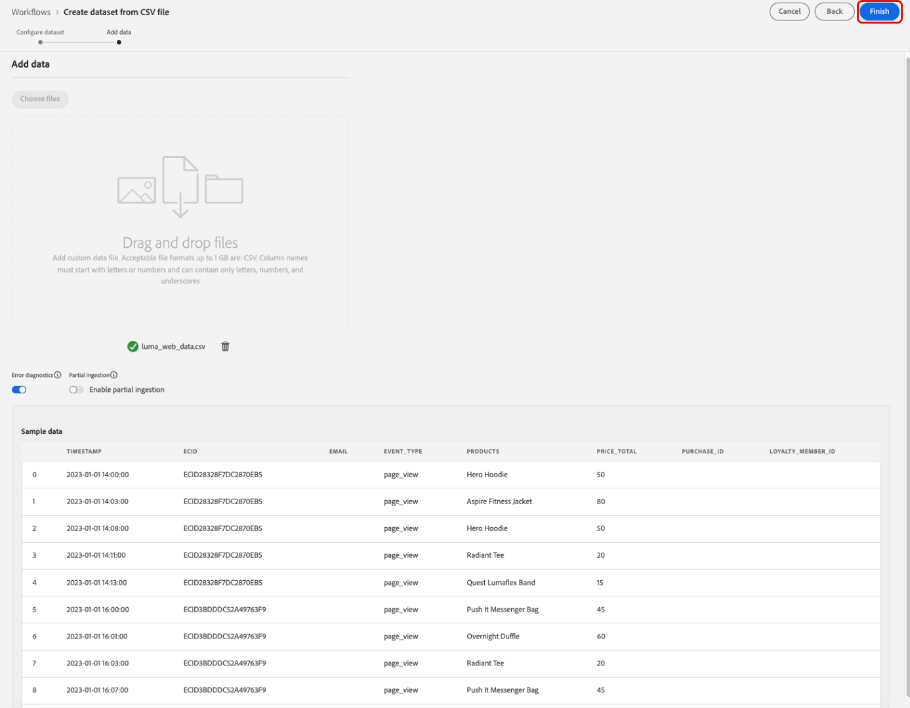

「luma_web_data」データセットのデータセットアクティビティビューが表示されます。 CSV ファイルの手動アップロード
はバッチとして取り込まれ、[!UICONTROL Batch ID]によって識別されます。 右側のパネルには、テーブル名が`luma_web_data`として表示されます。

>[!TIP]
>
>Data Distillerでクエリを書き込む場合は、データセット名の代わりにテーブル名を使用します。 データセット名は、UIでの参照にのみ使用されます。

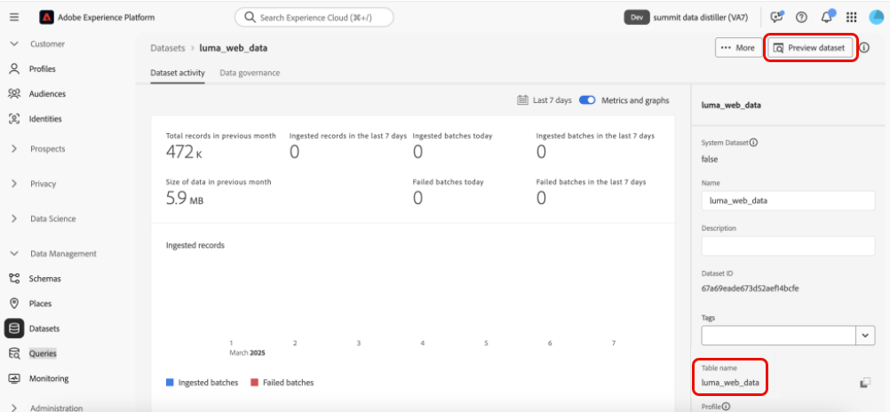

<!-- 
 
My table name is; luma_web_data_20250312_235611_817 Should we explain the suffix? 
-->

データの処理が完了したら、右上隅の[!UICONTROL Preview dataset]を選択して、データセットをプレビューします。 データセットのプレビューは次のように表示されます。

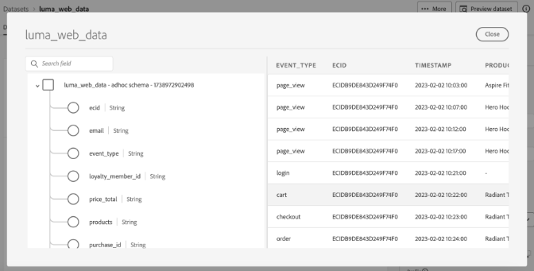

#### スキーマの考慮事項 {#schema-considerations}

構造化XDM スキーマ（レコード、イベント、B2B スキーマなど）は、データが生のCSV ファイルとして読み込まれるため、必要ありません。 代わりに、データセットはアドホックスキーマを使用します。

>[!TIP]
>
>アドホックスキーマは、単一のデータセットのみが使用できる名前空間のフィールドを持つXDM スキーマです。 アドホックスキーマは、Experience Platform の様々なデータ取り込みワークフローで使用され、特定の種類のソース接続を作成します。

Data Distillerはすべてのスキーマタイプをサポートしていますが、Real-Time Customer Profileに取り込む最終的なデータセットは、レコード XDM スキーマを使用します。

### ステップ 2：データレイクに接続して、利用可能なデータセットを探索する {#connect-to-the-data-lake-and-explore-datasets}

次のステップは、Adobe Experience Platformデータレイクのデータを調査して、正確性と統合性を確保することです。 データは、有意義なインサイトを生成するために、正確かつ完全である必要がありますが、データ転送中にエラー、不整合、欠落している値が発生する可能性があります。 そのため、データの検証と活用が不可欠となります。

>[!TIP]
>
>データレイクは、分析と処理のために、イベントログ、クリックストリームデータ、一括取り込みレコードなどの未処理データを保存します。 プロファイルストアには、リアルタイムのパーソナライゼーションとアクティベーションをサポートするために、IDをつなぎ合わせたイベントや属性情報を含む、顧客を特定できるデータが含まれています。

Data Distillerを使用して、様々なオペレーションを通じてデータセットの品質と完全性を検証します。 取り込み中にデータが正確に翻訳されたことを確認するには、`SELECT`個のクエリを実行して、データを検査、検証、分析します。 このプロセスは、情報の不整合、不整合、喪失を特定し、解決するのに役立ちます。

#### 基本的な探索クエリの実行 {#basic-exploration-queries}

Adobe Experience Platform UIで、左側のナビゲーションパネルで「**[!UICONTROL Queries]**」を選択し、「**[!UICONTROL Create Query]**」を選択します。 クエリエディターが表示されます。

次のクエリをエディターに貼り付けて実行します。

```sql
SELECT * FROM luma_web_data; 
```

クエリ結果は、**[!UICONTROL Results]** タブのクエリエディターの下に表示されます。 新しいダイアログで結果を展開するには、**[!UICONTROL View results]**&#x200B;を選択します。 結果は次の画像のようになります。

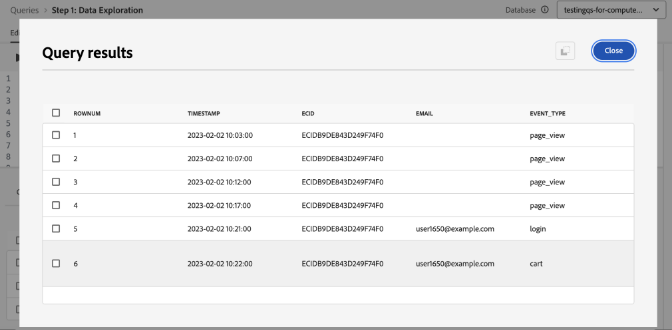

詳しくは、[ クエリ実行の一般的なガイダンス ](../best-practices/writing-queries.md)文書を参照してください。

#### 注文を重視し、キャンセルされた取引を除外 {#focus-orders-exclude-cancelled}

RFM モデルでは、購入完了にもとづいて、最終購入日、頻度、金銭的価値を評価します。 ページビューやチェックアウトインタラクションなどの非トランザクションイベントは、分析から除外されます。 さらに、キャンセルされた注文は、有効なRFM計算に貢献せず、別の処理アプローチを必要とするため、削除する必要があります。

正確性を確保する方法：

- キャンセルに関連付けられている購入IDを特定し、`GROUP BY`を使用してグループ化します。
- これらの購入IDをデータセットから除外します。
- データをフィルタリングして、完了した注文のみを保持します。

次のクエリは、キャンセルされた注文を特定してデータセットから除外する方法を示しています。

この最初のクエリでは、キャンセルに関連付けられたすべての非null購入IDを選択し、`GROUP BY`を使用して集計します。 生成された購入IDは、データセットから除外する必要があります。

```sql
CREATE VIEW orders_cancelled
AS
  SELECT purchase_id
  FROM   luma_web_data
  WHERE  event_type IN ( 'order', 'cancellation' )
         AND purchase_id IS NOT NULL
  GROUP  BY purchase_id
  HAVING Count(DISTINCT event_type) = 2; 
```

2番目のクエリは、この除外セットに含まれていない購入IDのみを取得します。

```sql
SELECT *
FROM   luma_web_data
WHERE  purchase_id NOT IN (SELECT purchase_id
                           FROM   orders_cancelled)
        OR purchase_id IS NULL; 
```

3つ目のクエリは、データセットからすべての順序なしイベントを削除します。

```sql
SELECT *
FROM   luma_web_data
WHERE  event_type = 'order'
       AND purchase_id NOT IN (SELECT purchase_id
                               FROM   orders_cancelled); 
```

### 手順3:Data Distiller関数を使用したデータの拡充 {#enrich-the-data}

次に、Data Distillerを使用して、顧客データを抽出および変換し、RFM スコアを生成し、取引を集約し、購買行動によって顧客をセグメント化します。 以下の手順に従って、RFM （Recency, Frequency, and Monetary）値を計算し、オーディエンスモデルを構築し、アクティベーションのためのインサイトを準備します。

#### 一意のユーザーIDごとにRFM スコアを計算する

RFM スコアを計算するには、フィールドフィルタリングを使用して、生データからキーフィールドを抽出します。

次のクエリは、前のセクションのロジックに基づいて構築されます。すべての注文には電子メールログインが必要なため、`userid`として電子メールを選択します。 Data Distillerは`TO_DATE`関数を使用して、タイムスタンプを日付形式に変換します。 `total_revenue` フィールドは各トランザクションの価格を表し、後で`userid`ごとに合計して集計されます。

```sql
SELECT email AS userid, 
       purchase_id AS purchaseid, 
       price_total AS total_revenue, -- reflects the price for each individual transaction
       TO_DATE(timestamp) AS purchase_date -- converts timestamp to date format
FROM luma_web_data 
WHERE event_type = 'order' 
      AND purchase_id NOT IN (SELECT purchase_id FROM orders_cancelled) 
      AND email IS NOT NULL;
```

結果は下の画像のようになります。

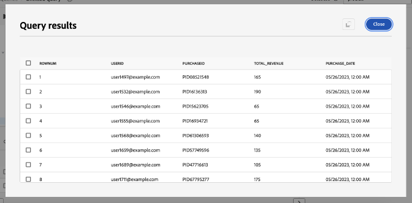

次に、`TABLE`を作成して、前のクエリの結果を派生データセットに保存します。 次のコマンドをコピーしてクエリ エディターに貼り付け、`TABLE`を作成します。

```sql
CREATE TABLE IF NOT EXISTS order_data AS
  SELECT email              AS userid,
         purchase_id        AS purchaseid,
         price_total        AS total_revenue,
         To_date(timestamp) AS purchase_date
  FROM   luma_web_data
  WHERE  event_type = 'order'
         AND purchase_id NOT IN (SELECT purchase_id FROM orders_cancelled)
         AND email IS NOT NULL; 
```

結果は次の画像に似ていますが、データセット IDが異なります。

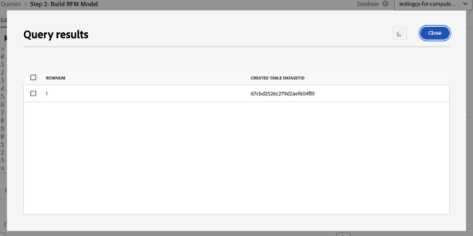

ベストプラクティスとして、単純な探索クエリを実行して、データセット内のデータを検査します。 データを表示するには、次のステートメントを使用します。

```sql
SELECT * FROM order_data;
```

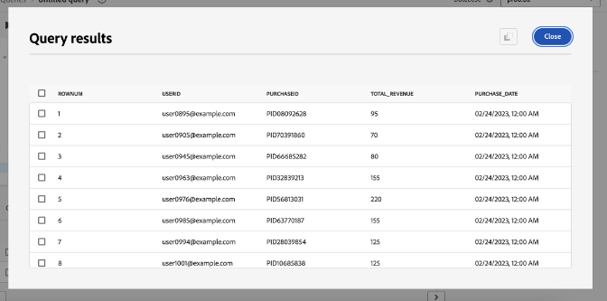

#### RFM値を生成するトランザクションを集計します {#aggregate-transactions}

RFM値を計算するには、このクエリは各ユーザーのトランザクションを集計します。

`DATEDIFF(CURRENT_DATE, MAX(purchase_date)) AS days_since_last_purchase`関数は、各ユーザーの最新の購入日からの日数を計算します。

次のSQL クエリを使用します。

```sql
SELECT 
    userid, 
    DATEDIFF(CURRENT_DATE, MAX(purchase_date)) AS days_since_last_purchase, 
    COUNT(purchaseid) AS orders, 
    SUM(total_revenue) AS total_revenue 
FROM order_data 
GROUP BY userid;
```

結果は下の画像のようになります。

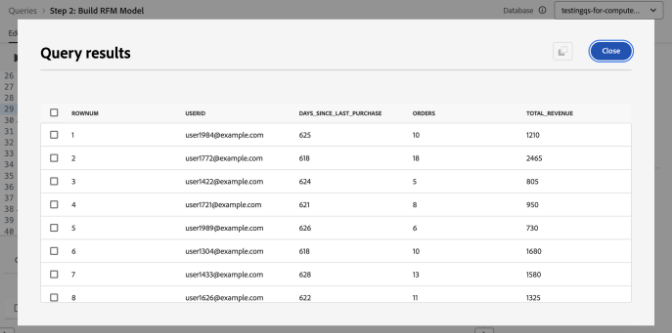

クエリの効率と再利用性を高めるには、集約されたRFM値を格納する`VIEW`を作成します。

```sql
CREATE VIEW rfm_values
AS
  SELECT userid,
         DATEDIFF(current_date, MAX(purchase_date)) AS days_since_last_purchase,
         COUNT(purchaseid)                          AS orders,
         SUM(total_revenue)                         AS total_revenue
  FROM   order_data
  GROUP BY userid; 
```

結果は次の画像に似ていますが、IDが異なります。

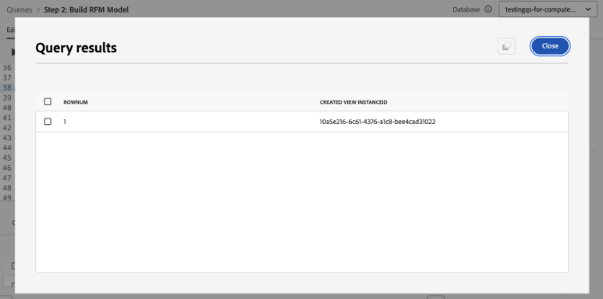

ここでもベストプラクティスとして、簡単な探索クエリを実行して、ビュー内のデータを検査します。 次のステートメントを使用します。

```sql
SELECT * FROM rfm_values;
```

次のスクリーンショットは、各ユーザーの計算されたRFM値を表示する、クエリのサンプル結果を示しています。 結果は、`CREATE VIEW` クエリのビューIDに対応しています。


#### RFM多次元キューブの生成 {#generate-multi-dimensional-cube}

RFM スコアにもとづいて顧客をセグメンテーションするには、RFM多次元キューブを使用します。 `NTILE` ウィンドウ関数は、値をランク付きバケットに並べ替え、各ディメンションを4つの等しいグループ （四分位数）に分割して、構造化されたセグメント化を可能にします。

- 最新性：顧客は、最近購入した回数（`days_since_last_purchase`）でランク付けされます。 直近に購入した人はグループ 1に、長期にわたって購入していない人はグループ 4に属しています。
- 頻度：顧客は購入頻度（`ORDER BY orders DESC`）でランク付けされます。 最も購入頻度の高い顧客はグループ 1に属し、最も低い顧客はグループ 4に属しています。
- 金銭的：顧客は総支出（`total_revenue`）でランク付けされます。 最も高い支出はグループ 1で、最も低い支出はグループ 4です。

次のSQL クエリを実行して、RFM多次元キューブを生成します。

```sql
SELECT userid,
       days_since_last_purchase,
       orders,
       total_revenue,
       5 - NTILE(4)
             OVER (
               ORDER BY days_since_last_purchase DESC) AS recency,
       NTILE(4)
         OVER (
           ORDER BY orders DESC)                       AS frequency,
       NTILE(4)
         OVER (
           ORDER BY total_revenue DESC)                AS monetization
FROM rfm_values; 
```

結果は下の画像のようになります。

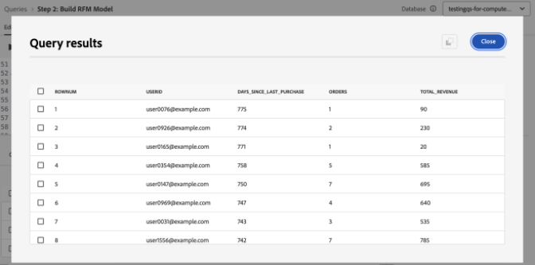

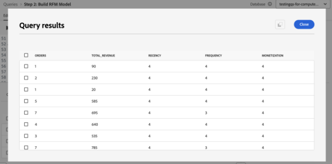

次に、次のステートメントを使用して、このデータの`VIEW`を作成します。

RFM多次元キューブの`VIEW`を作成すると、事前にセグメント化されたデータを保存して効率が向上し、今後のクエリでRFM スコアを再計算する必要がなくなります。 SQL ステートメントを簡素化し、データの一貫性を確保し、さらなる分析のために再利用性を高めます。

```sql
CREATE OR replace VIEW rfm_scores
AS
  SELECT userid,
         days_since_last_purchase,
         orders,
         total_revenue,
         5 - NTILE(4)
               over (
                 ORDER BY days_since_last_purchase DESC) AS recency,
         NTILE(4)
           over (
             ORDER BY orders DESC)                       AS frequency,
         NTILE(4)
           over (
             ORDER BY total_revenue DESC)                AS monetization
  FROM   rfm_values;
```

結果は次の画像に似ていますが、ビューIDが異なります。

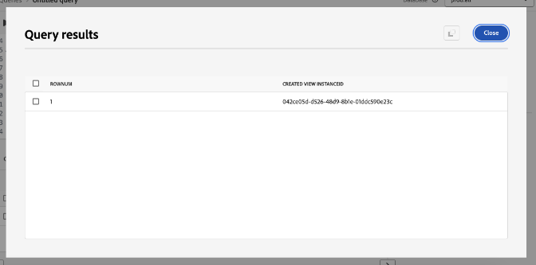

#### RFM セグメントのモデル化 {#model-rfm-segments}

RFM スコアを計算すると、顧客は次の6つの優先セグメントに分類できます。

1. `Core`：最新性、頻度、金銭的価値が高い最適なお客様（最新性= 1、頻度= 1、金銭的= 1）。
1. `Loyal`：一貫しているが上位の購入者ではない頻繁な顧客（頻度= 1）。
1. `Whales`：最新性と頻度に関係なく、最も支出額が多い（金額= 1）。
1. `Promising`：頻繁だが低い支出者（頻度= 1、2、3、金銭的= 2、3、4）。
1. `Rookies`：頻度が低い新規顧客（頻度= 1、頻度= 4）。
1. `Slipping`：アクティビティが減少した以前のロイヤルカスタマー（最新性= 2、3、4、頻度= 4）。

アクセスと再利用を効率化するには、RFM セグメント、スコア、値を格納する`VIEW`を作成します。

次のSQLの`CASE` ステートメントは、顧客をRFM スコアに基づいてセグメントに分類し、結果を`RFM_Model`変数に割り当てます。

+++選択してSQLを表示

```sql
CREATE OR replace VIEW rfm_model_segment
AS
  SELECT userid,
         days_since_last_purchase,
         orders,
         total_revenue,
         recency,
         frequency,
         monetization,
         CASE
           WHEN recency = 1
                AND frequency = 1
                AND monetization = 1 THEN '1. Core - Your Best Customers'
           WHEN recency IN( 1, 2, 3, 4 )
                AND frequency = 1
                AND monetization IN ( 1, 2, 3, 4 ) THEN
           '2. Loyal - Your Most Loyal Customers'
           WHEN recency IN( 1, 2, 3, 4 )
                AND frequency IN ( 1, 2, 3, 4 )
                AND monetization = 1 THEN
           '3. Whales - Your Highest Paying Customers'
           WHEN recency IN( 1, 2, 3, 4 )
                AND frequency IN ( 1, 2, 3 )
                AND monetization IN( 2, 3, 4 ) THEN
           '4. Promising - Faithful customers'
           WHEN recency = 1
                AND frequency = 4
                AND monetization IN ( 1, 2, 3, 4 ) THEN
           '5. Rookies - Your Newest Customers'
           WHEN recency IN ( 2, 3, 4 )
                AND frequency = 4
                AND monetization IN ( 1, 2, 3, 4 ) THEN
           '6. Slipping - Once Loyal, Now Gone'
         END RFM_Model
  FROM   rfm_scores; 
```

+++

生成された`VIEW`は、以前の作成と同じ構造に従いますが、別のIDを持っています。

ベストプラクティスとして、簡単な探索クエリを実行して、ビュー内のデータを検査します。 次のステートメントを使用します。

<!-- Double check this SQL. I wrote it.- it was absent fom the KT doc. -->

```sql
SELECT * FROM rfm_model_segment;
```

<!-- Perhaps these VIEW results could be chopped? -->

次のスクリーンショットは、セグメント化されたRFM モデルデータを示す`SELECT * FROM rfm_model_segment;` クエリのサンプル結果を表示しています。 出力には、RFM スコアに基づいて割り当てられた顧客セグメントを含め、生成された`VIEW`の構造が反映されます。

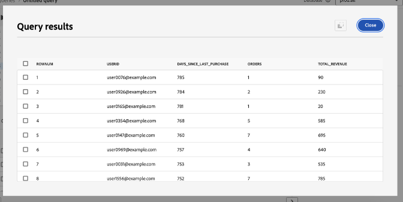

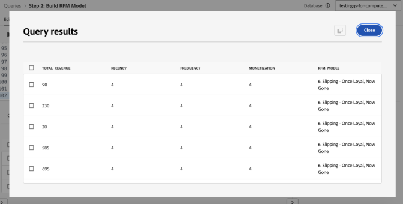

### 手順4:SQLを使用してRFM データをリアルタイム顧客プロファイルにバッチ取り込む {#sql-batch-ingest-rfm-data}

次に、RFMで強化された顧客データをバッチでリアルタイム顧客プロファイルに取り込みます。 まず、プロファイル対応データセットを作成し、SQLを使用して変換されたデータを挿入します。

#### RFM属性を格納する派生データセットの作成 {#create-a-derived-dataset}

このデータセットはプロファイルストアに取り込まれるため、パーティションキーが必要です。

>[!TIP]
>
>プライマリ ID フィールドはパーティションキーとして機能し、効率的なデータ配信、取得、クエリのパフォーマンスを確保します。 ID名前空間を使用してプライマリ IDを割り当てると、関連するプロファイルレコードがグループ化され、プロファイルストア内での参照と更新が最適化されます。

空のデータセットを作成してRFM属性を保存し、プライマリ IDを割り当てます。

このSQL文では、次の操作を行います。

- `userId TEXT PRIMARY IDENTITY NAMESPACE 'Email'`: &#39;Email&#39;名前空間を使用して、userId列をプライマリ IDとして定義します&#x200B;
- `days_since_last_purchase INTEGER`: ユーザーの最後の購入からの日数を保存します&#x200B;
- `orders INTEGER`: ユーザーによる注文の合計数を表します&#x200B;
- `total_revenue DECIMAL(18, 2)`: ユーザーが生成した総収益を、最大18桁の精度と2つの小数点以下桁でキャプチャします。&#x200B;
- `recency INTEGER, frequency INTEGER, monetization INTEGER`: ユーザーのそれぞれのRFM スコアを保存します。&#x200B;
- `rfm_model TEXT`: ユーザーに割り当てられたRFM セグメント分類を保持します。&#x200B;
- `WITH (LABEL = 'PROFILE')`: Experience Platformでテーブルをプロファイル対応としてマークし、取り込まれたデータがリアルタイム顧客プロファイルの構築に役立つようにします&#x200B;

>[!NOTE]
>
>「メール」名前空間は、Adobe Experience Platformの[標準ID名前空間](../../identity-service/features/namespaces.md#standard)です。 ID フィールドを定義する場合は、正確なID解決を容易にするために、適切な名前空間が指定されていることを確認&#x200B;ます。
>
>ID フィールドの定義とID名前空間の操作について詳しくは、[Identity Service ドキュメント ](../../identity-service/home.md)または[Adobe Experience Platform UI](../../xdm/ui/fields/identity.md)でのID フィールドの定義に関するガイドを参照してください。

クエリエディターは順次実行をサポートしているので、テーブル作成とデータ挿入クエリを1つのセッションに含めることができます。 次のSQLは、最初にRFM属性を格納するプロファイル対応テーブルを作成します。 次に、RFMが強化された顧客データを`rfm_model_segment`から`adls_rfm_profile` テーブルに挿入し、Real-Time Customer Profileの取り込みに必要なテナント固有の名前空間の下の各レコードを構造化します。

クエリエディターは順次実行をサポートしているので、テーブル作成とデータ挿入クエリを1つのセッションで実行できます。 次のSQLは、最初にRFM属性を格納するプロファイル対応テーブルを作成します。 次に、RFMが強化された顧客データを`rfm_model_segment`から`adls_rfm_profile` テーブルに挿入し、各レコードがテナント固有の名前空間（`_{TENANT_ID}`）で適切に構造化されるようにします。 この名前空間は、リアルタイムの顧客プロファイルの取り込みと正確なID解決に不可欠です。

>[!IMPORTANT]
>
>`_{TENANT_ID}`を組織のテナント名前空間に置き換えます。 この名前空間は組織に固有であり、取り込まれたすべてのデータがAdobe Experience Platformで正しく割り当てられます。

```sql
CREATE TABLE IF NOT EXISTS adls_rfm_profile (
    userId TEXT PRIMARY IDENTITY NAMESPACE 'Email',
    days_since_last_purchase INTEGER,
    orders INTEGER,
    total_revenue DECIMAL(18, 2),
    recency INTEGER,
    frequency INTEGER,
    monetization INTEGER,
    rfm_model TEXT
) WITH (LABEL = 'PROFILE');

INSERT INTO adls_rfm_profile
SELECT STRUCT(userId, days_since_last_purchase, orders, total_revenue, recency,
              frequency, monetization, rfm_model) _{TENANT_ID}
FROM rfm_model_segment;
```

このクエリの結果は、このプレイブックの以前のデータセット作成と似ていますが、異なるIDを持ちます。

データセットを作成した後、**[!UICONTROL Datasets]** > **[!UICONTROL Browse]** > `adls_rfm_profile`に移動して、データセットが空であることを確認します。

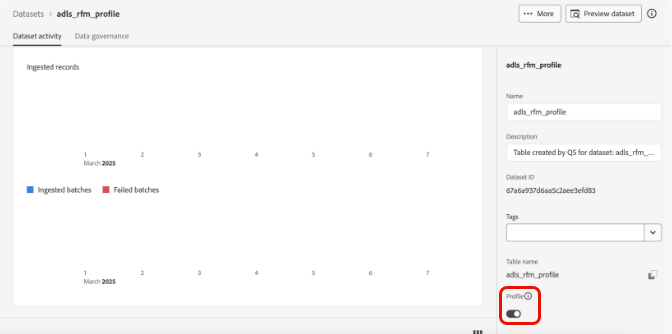

**[!UICONTROL Schemas]** > **[!UICONTROL Browse]** > `adls_rfm_profile`に移動して、新しく作成されたデータセットのXDM個人プロファイルスキーマダイアグラムと、そのカスタムフィールドグループを表示することもできます。

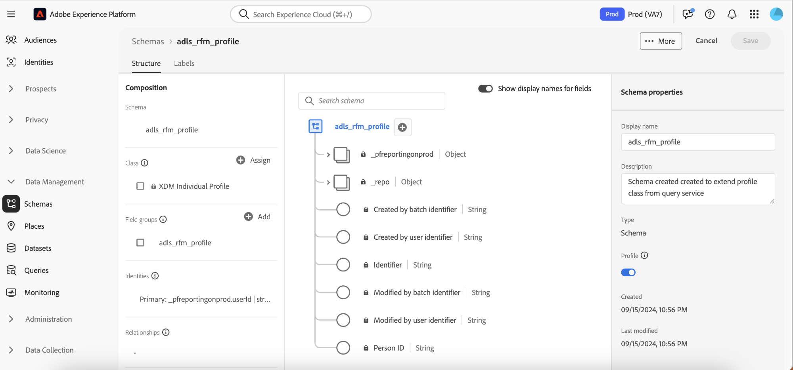

#### 新しく作成した派生データセットにデータを挿入する {#insert-data-into-derived-dataset}

次に、`rfm_model_segment VIEW`から`adls_rfm_profile`にデータを挿入します。これは、リアルタイム顧客プロファイルで有効になっています。

`SELECT`文の`INSERT` クエリのフィールド順序が`rfm_model_segment`の構造と正確に一致していることを確認してください。 この整列により、`rfm_model_segment`の値がターゲットテーブルの対応するフィールドに正しく挿入されます。 ソースフィールドとターゲットフィールドが一致していないと、データの不一致が発生する可能性があります。

>[!NOTE]
>
>このクエリはバッチモードで実行されるため、プロセスを実行するにはクラスターを起動する必要があります。 この操作は、データレイクからデータを読み取り、クラスター内で処理し、結果をデータレイクに書き戻します。

```sql
INSERT INTO adls_rfm_profile
SELECT Struct(userid, days_since_last_purchase, orders, total_revenue, recency,
              frequency, monetization, rfm_model) _{TENANT_ID}
FROM   rfm_model_segment; 
```

完了すると、クエリ出力に「クエリ完了」がコンソールに表示されます。

### 手順5：バッチ処理のクエリのスケジュール設定 {#schedule-the-query}

SQL コードで派生データセットが生成され、リアルタイム顧客プロファイル用に有効になったので、次のステップは、クエリを特定の間隔で実行するようにスケジュールして、更新を自動化することです。 データセットが自動的に更新されるため、手作業が不要になります。

#### クエリ実行のスケジュール

SQLを保存した後、**[!UICONTROL Templates]** タブに移動して、保存されたクエリを表示し、スケジュール設定プロセスを開始します。 クエリをスケジュールするには、次の2つの方法があります。

右側のサイドバーから&#x200B;**[!UICONTROL Add Schedule]**&#x200B;を選択します。

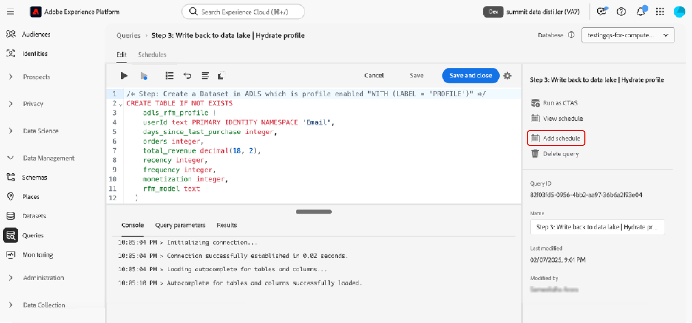

または、テンプレート名の下にある「**[!UICONTROL Schedules]**」タブを選択し、「**[!UICONTROL Add Schedule]**」を選択します。

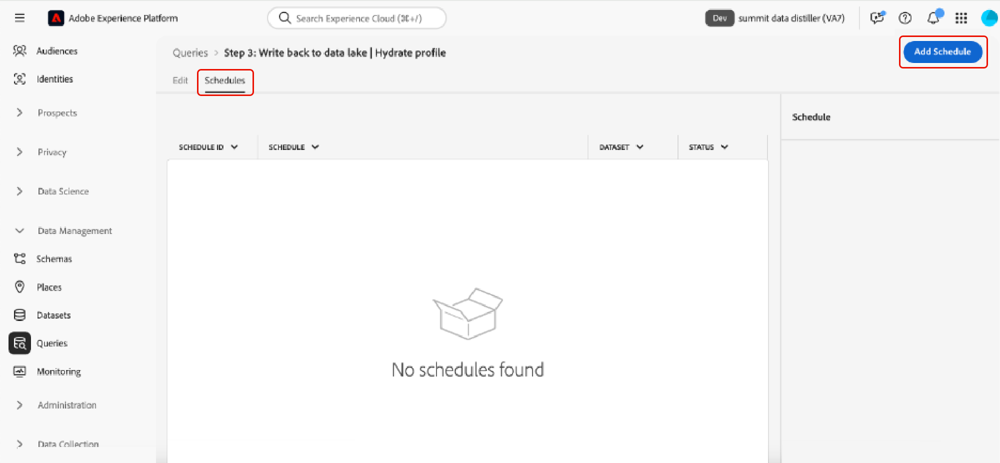

クエリのスケジュール設定について詳しくは、[ クエリスケジュールのドキュメント ](../ui/query-schedules.md)を参照してください。

[!UICONTROL Schedule details] ビューが表示されます。 ここから、次の詳細を入力してスケジュールを設定します。

- **[!UICONTROL Execution Frequency]**: **毎週**
- **[!UICONTROL Day of Execution]**: **月曜日と火曜日**
- **[!UICONTROL Schedule Execution Time]**: **10:10午前UTC**
- **[!UICONTROL Schedule Period]**: **3月17日 – 2025年4月30日**

スケジュールを確定するには、**[!UICONTROL Save]**&#x200B;を選択します。

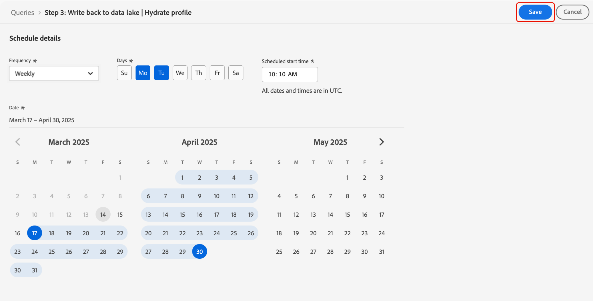

スケジュールを保存したら、任意の時点で「**[!UICONTROL Scheduled Queries]**」タブに移動して、スケジュールされたData Distiller ジョブを監視できます。 [ クエリ実行ステータス、エラーメッセージ、アラートの表示](../ui/monitor-queries.md)について詳しくは、スケジュールされたクエリの監視ドキュメントを参照してください。

設定が完了すると、SQL クエリは定義された間隔で自動的に実行され、手動の介入なしにデータが最新の状態に保たれます。

### 手順6:RFM ベースのオーディエンスの作成とアクティブ化

<!-- double check this intro paragraph ... -->

このチュートリアルでは、RFM ベースのオーディエンスを作成してアクティブ化する方法が2つあります。

- 解決策1:Data DistillerとSQL クエリを使用して、オーディエンスを直接作成し、アクティベートする
- 解決策2：事前に計算されたRFM属性を使用して、SQLなしでExperience Platform UIでオーディエンスを定義および管理する。

ワークフローに最も適したアプローチを選択します。

#### 解決策1:Data Distillerを介したSQL オーディエンス {#data-distiller-sql-audience}

新しいオーディエンスを定義するには、`CREATE AUDIENCE AS SELECT` コマンドを使用します。 作成されたオーディエンスはデータセットに保存され、**[!UICONTROL Audiences]**&#x200B;の下の&#x200B;**[!UICONTROL Data Distiller]** ワークスペースに登録されます。

SQL拡張機能を使用して作成されたオーディエンスは、[!UICONTROL Data Distiller] ワークスペースの[!UICONTROL Audiences] オリジンに自動的に登録されます。 [ オーディエンスポータル ](../../segmentation/ui/audience-portal.md)から、必要に応じてオーディエンスを表示、管理、アクティブ化できます。

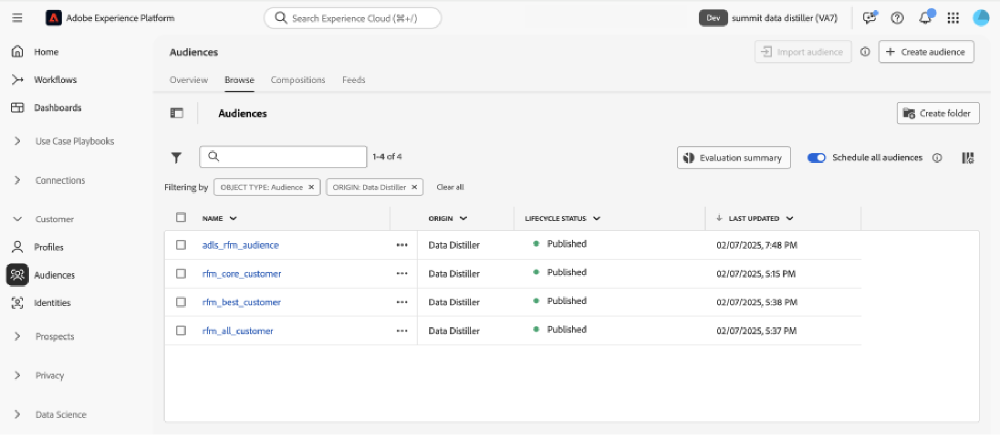

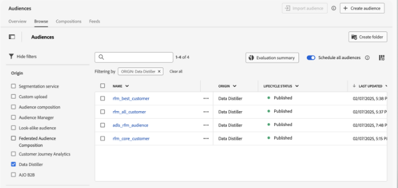

SQL オーディエンスについて詳しくは、[Data Distiller Audiences ドキュメント ](../data-distiller-audiences/overview.md)を参照してください。 UIでオーディエンスを管理する方法については、[ オーディエンスポータルの概要](../../segmentation/ui/audience-portal.md#audience-list)を参照してください。

#### オーディエンスの作成 {#create-an-audience}

オーディエンスを作成するには、次のSQL コマンドを使用します。

```sql
-- Define an audience for best customers based on RFM scores
CREATE AUDIENCE rfm_best_customer 
WITH (
    primary_identity = _{TENANT_ID}.userId, 
    identity_namespace = queryService
) AS ( 
    SELECT * FROM adls_rfm_profile 
    WHERE _{TENANT_ID}.recency = 1 
        AND _{TENANT_ID}.frequency = 1 
        AND _{TENANT_ID}.monetization = 1 
);

-- Define an audience that includes all customers
CREATE AUDIENCE rfm_all_customer 
WITH (
    primary_identity = _{TENANT_ID}.userId, 
    identity_namespace = queryService
) AS ( 
    SELECT * FROM adls_rfm_profile 
);

-- Define an audience for core customers based on email identity
CREATE AUDIENCE rfm_core_customer 
WITH (
    primary_identity = _{TENANT_ID}.userId, 
    identity_namespace = Email
) AS ( 
    SELECT * FROM adls_rfm_profile 
    WHERE _{TENANT_ID}.recency = 1 
        AND _{TENANT_ID}.frequency = 1 
        AND _{TENANT_ID}.monetization = 1 
);
```

#### 空のオーディエンスデータセットの作成 {#create-empty-audience-dataset}

プロファイルを追加する前に、オーディエンスレコードを保存する空のデータセットを作成します。

```sql
-- Create an empty audience dataset
CREATE AUDIENCE adls_rfm_audience 
WITH (
    primary_identity = userId, 
    identity_namespace = Email
) AS 
SELECT 
    CAST(NULL AS STRING) userId, 
    CAST(NULL AS INTEGER) days_since_last_purchase, 
    CAST(NULL AS INTEGER) orders, 
    CAST(NULL AS DECIMAL(18,2)) total_revenue, 
    CAST(NULL AS INTEGER) recency, 
    CAST(NULL AS INTEGER) frequency, 
    CAST(NULL AS INTEGER) monetization, 
    CAST(NULL AS STRING) rfm_model 
WHERE FALSE;
```

#### 既存オーディエンスへのプロファイルの挿入 {#insert-an-audience}

既存のオーディエンスにプロファイルを追加するには、INSERT INTO コマンドを使用します。 これにより、個々のプロファイルまたはオーディエンスセグメント全体を既存のオーディエンスデータセットに追加できます。

```sql
-- Insert profiles into the audience dataset
INSERT INTO AUDIENCE adls_rfm_audience 
SELECT 
    _{TENANT_ID}.userId, 
    _{TENANT_ID}.days_since_last_purchase, 
    _{TENANT_ID}.orders, 
    _{TENANT_ID}.total_revenue, 
    _{TENANT_ID}.recency, 
    _{TENANT_ID}.frequency, 
    _{TENANT_ID}.monetization 
FROM adls_rfm_profile 
WHERE _{TENANT_ID}.rfm_model = '6. Slipping - Once Loyal, Now Gone';
```

#### オーディエンスの削除 {#delete-an-audience}

既存のオーディエンスを削除するには、DROP AUDIENCE コマンドを使用します。 オーディエンスが存在しない場合は、「IF EXISTS」が指定されていない限り、例外が発生します。

```sql
DROP AUDIENCE IF EXISTS adls_rfm_audience;
```

#### 解決策2:RFM属性を使用したオーディエンスの作成 {#create-audience-with-rfm-attributes}

RFM属性を使用して、ユーザーの行動や特徴にもとづいてユーザーをセグメント化します。 この節では、Adobe Experience Platform UIを使用して、RFM スコアを使用してオーディエンスを定義する方法を説明します。

データがReal-Time Customer Profileに読み込まれていることを確認するには、**[!UICONTROL Customers]> [!UICONTROL Profiles] >[!UICONTROL Browse]**&#x200B;に移動します。 **[!UICONTROL Identity Namespace]**&#x200B;を`Email`として選択し、`user0076@example.com`と入力します。 プロファイルの詳細を確認して、想定されるRFM属性が含まれていることを確認します。

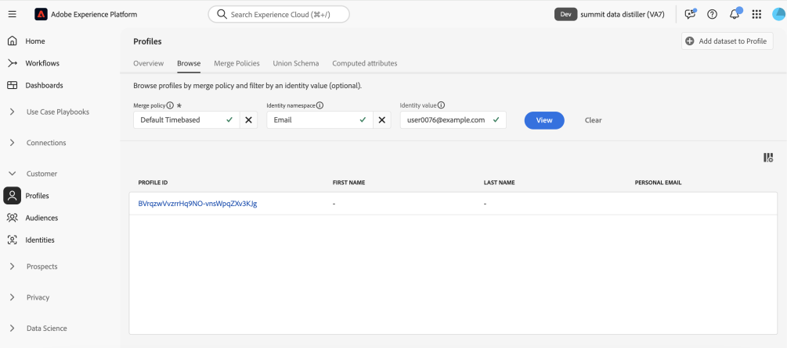

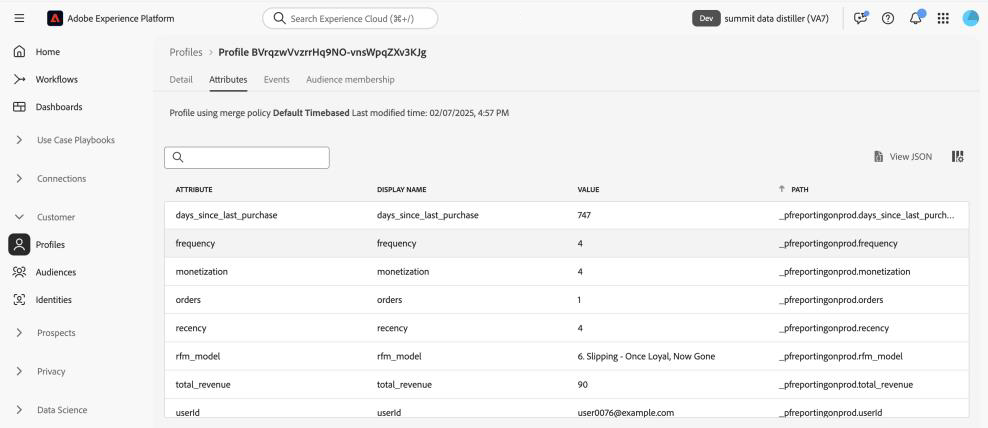

既存のオーディエンスを参照するには、左側のナビゲーションパネルから「**[!UICONTROL Audiences]**」を選択し、「**[!UICONTROL Browse]**」タブが選択されていることを確認します。 サンドボックス内で使用可能なオーディエンスのリストが表示されます。 オーディエンスを選択すると、その説明、選定ルール、含まれるプロファイルの数が表示されます。

新しいオーディエンスを作成するには、右上隅の「**[!UICONTROL Create Audience]**」を選択します。 2つのオプションを含むダイアログボックスが表示されます。 **[!UICONTROL Build Rule]**&#x200B;を選択し、その後に&#x200B;**[!UICONTROL Create]**&#x200B;を選択します。

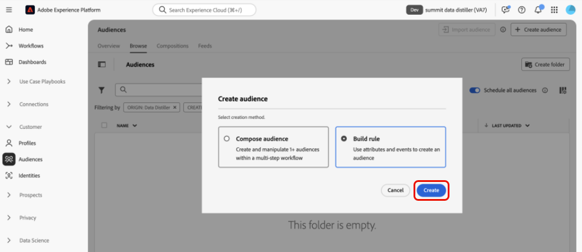

オーディエンス構成UIでは、プロファイル属性にアクセスできます。 **[!UICONTROL Attributes]>[!UICONTROL XDM Individual Profile]**&#x200B;に移動して、使用可能な属性を表示します。

オーディエンス構成の使用について詳しくは、[ オーディエンス構成UI ガイド ](../../segmentation/ui/audience-composition.md)を参照してください。 セグメントビルダーの使用について詳しくは、[ セグメントビルダーUI ガイド ](../../segmentation/ui/segment-builder.md)を参照してください。

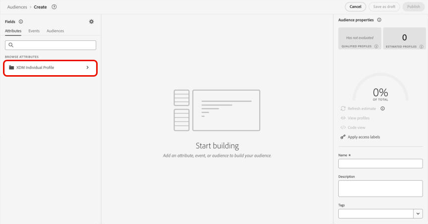

Data Distillerで作成されたカスタム属性は、サンドボックス名の横に表示されるテナント名前空間名に一致するフォルダーに保存されます。 これらの属性は、オーディエンスのセグメント化基準の定義に使用できます。

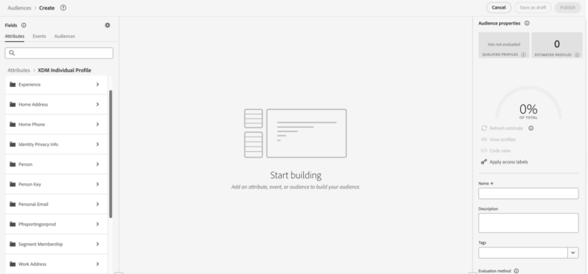

RFM属性を使用してオーディエンスを構築するには、`Rfm_Model`属性をAudience Composerにドラッグ&amp;ドロップします。 これらの属性は、Edge、ストリーミング、バッチオーディエンスに使用できます。

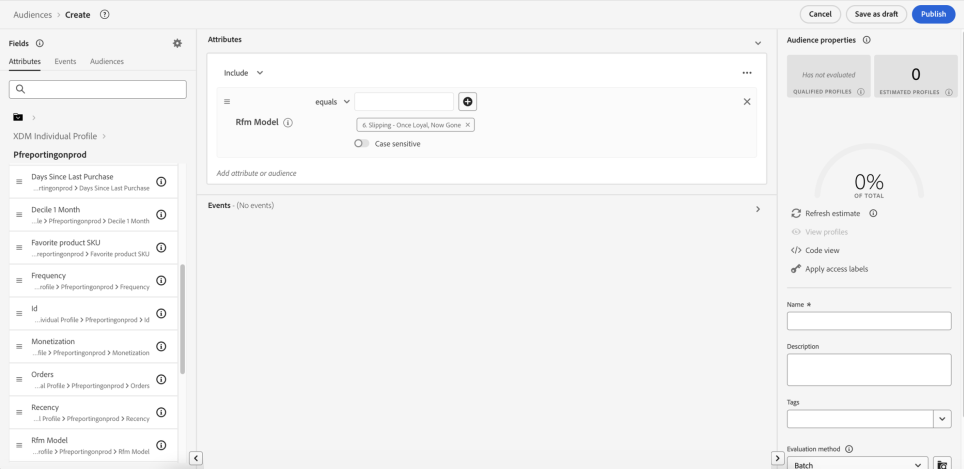

オーディエンスを確定するには、右上隅の「**[!UICONTROL Save and Publish]**」を選択します。 保存後、新しく作成されたオーディエンスが[!UICONTROL Audiences] ワークスペースに表示され、その概要と条件を確認できます。

セグメントビルダーを使用して、派生RFM属性にアクセスし、追加のオーディエンスをデザインします。 RFM スコアに基づいて新しく作成したSQL オーディエンスをアクティベートし、Adobe Journey Optimizerを含む任意の好みの宛先に送信します。
