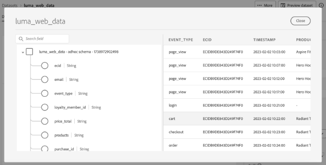

# Adobe Experience Platform Data Distillerで価値を最大限に高めるためのトップヒント - OS656

このページには、Adobe Summit セッション「OS656 - Adobe Experience Platform Data Distillerで価値を最大化するためのトップヒント」で学んだことを適用できるサンプルデータセットが含まれています。 リアルタイム顧客プロファイルデータを強化して、Adobe Real-Time Customer Data PlatformとJourney Optimizerの実装を高速化する方法を説明します。 このエンリッチメントでは、顧客の行動パターンに関する深いインサイトを活用して、エクスペリエンスの配信および最適化のためのオーディエンスを構築します。

Luma のケーススタディを通じて、ユーザーの行動データを分析し、*最新性、頻度、通貨（RFM）* モデルを作成します。これは、購入パターンに基づいて顧客をセグメント化するためのマーケティング分析手法です。

## 前提条件

このユースケースを実行するには、Adobe Experience Platform インスタンスが [Data Distiller](./overview.md) のライセンスを取得している必要があります。 詳しくは、Adobe担当者にお問い合わせください。

## RFM モデルの概要 {#rfm-overview}

RFM は、リーセンシー（R）、フリークエンシー（F）、通貨（M）の略で、顧客のセグメント化と分析に対するデータ駆動型アプローチです。 この方法では、顧客の行動の 3 つの重要な側面、つまり、顧客が購入を行った最近、関与の頻度、支出の額を評価します。 これらの要因を定量化することで、企業は顧客セグメントに関する実用的なインサイトを得て、個々の顧客のニーズをより適切に満たすターゲットマーケティング戦略を開発できます。

## RFM モデルを使用した顧客の行動について {#understand-customer-behavior}

RFM モデルでは、3 つの主要なパラメータを使用して、トランザクション動作に基づいて顧客をセグメント化します。

- **最新性** は、顧客の最後の購入からの時間を測定し、エンゲージメントレベルと将来の購入の可能性を示します。
- **頻度** は、顧客がやり取りする頻度を追跡し、ロイヤルティと持続的なエンゲージメントの明確な指標として機能します。
- **金銭的価値** は、顧客の総支出を評価し、ビジネスへの全体的な価値を強調します。

これらの要因を組み合わせることで、企業は数値スコア（通常は `1`～`4` のスケール）を各顧客に割り当てます。 スコアが低いほど、転帰が良好であることを示す。 例えば、すべてのカテゴリの顧客スコアリング `1` は、最近のアクティビティ、高いエンゲージメント、重要な支出を示す、最も優れた指標の 1 つと見なされます。

## RFM モデルの利点と制限事項 {#benefits-and-limitations}

すべてのマーケティングモデリング技術には、メリットと制限の両方を提供するトレードオフが含まれます。 RFM モデリングは、顧客の行動を理解し、マーケティング戦略を調整するための貴重なツールです。 その利点には、顧客をセグメント化してメッセージングをパーソナライズしたり、収益を最適化したり、応答率、保持率、満足度、顧客生涯価値（CLTV）を向上させたりすることが含まれます。

ただし、RFM モデリングには制限があります。 最新性、頻度、金銭的価値に基づいてセグメント内の均一性を前提としているので、顧客行動が単純化されすぎる可能性があります。 また、モデルはこれらの要因に同じ重みを割り当てるため、顧客の価値を誤解する可能性があります。 さらに、製品固有の特性や顧客の好みなどのコンテキストは考慮されておらず、購買行動の誤解を招く可能性があります。

## 動的 RFM スコアベースの SQL オーディエンスの作成 {#build-a-dynamic-rfm-audience}

Luma のケーススタディを開始する前に、サンプルデータセットを取り込む必要があります。 まず、[ リンクを選択して、`luma_web_data.zip` のデータセットをローカルにダウンロードします ](../resources/luma_web_data.zip)。 サンプルデータセットは、ユースケースに合わせるために、圧縮.zip 形式の CSV ファイルです。 Adobe Acrobatまたはオペレーティング システムに組み込まれているユーティリティなどの信頼できるファイル解凍ツールを使用して、この ZIP ファイルを解凍します。 実際には、通常、Adobe Analytics、Adobe CommerceまたはAdobe web/モバイル SDKからデータを取得します。

このチュートリアルでは、Data Distillerを使用して、関連するイベントやフィールドを標準化された CSV 形式に抽出します。 効率と使いやすさを確保するために、フラットなデータ構造を維持しながら、必須フィールドのみを含めることを目標としています。

### 手順 1:CSV データをExperience Platformにアップロードする {#upload-csv-data}

次の手順に従って、CSV ファイルをAdobe Experience Platformにアップロードします。

#### CSV ファイルからのデータセットの作成 {#create-a-dataset}

Experience Platform UI の左側のナビゲーションパネルで **[!UICONTROL データセット]**」を選択し、次に **[!UICONTROL データセットを作成]** を選択します。 次に、使用可能なオプションから **[!UICONTROL CSV ファイルからデータセットを作成]** を選択します。

[!UICONTROL  データセットを設定 ] パネルが表示されます。 「**[!UICONTROL 名前]**」フィールドにデータセット名「luma_web_data」と入力し、「**[!UICONTROL 次へ]**」を選択します。

[!UICONTROL  データを追加 ] パネルが表示されます。 CSV ファイルを **[!UICONTROL データを追加]** ボックスにドラッグ&amp;ドロップするか、「**[!UICONTROL ファイルを選択]** を選択して、ファイルを参照してアップロードします。

このプロセスについて詳しくは、データセット UI ガイドの [ バッチ取り込みのチュートリアル ](../../ingestion/tutorials/ingest-batch-data.md) および [ データセット作成ワークフロー ](../../catalog/datasets/user-guide.md#create) を参照してください。

#### アップロードのレビューと完了 {#review-and-complete-upload}

ファイルがアップロードされると、UI の下部にデータプレビューが表示されます。 「**[!UICONTROL 完了]**」を選択して、アップロードを完了します。


「luma_web_data」データセットのデータセットアクティビティビューが表示されます。 CSV ファイルの手動アップロード
はバッチとして取り込まれ、[!UICONTROL  バッチ ID] で識別されます。 右側のパネルには、テーブル名が `luma_web_data` のように表示されます。

>[!TIP]
>
>Data Distillerでクエリを記述する場合は、データセット名ではなくテーブル名を使用します。 データセット名は、UI での参照にのみ使用されます。


<!--  
My table name is; luma_web_data_20250312_235611_817 Should we explain the suffix? 
-->

データの処理が完了したら、右上隅の [!UICONTROL  データセットをプレビュー ] を選択して、データセットをプレビューします。 データセットプレビューは次のように表示されます。



#### スキーマに関する考慮事項 {#schema-considerations}

構造化された XDM スキーマ（レコード、イベント、B2B スキーマなど）は、データが生の CSV ファイルとしてインポートされるので、必要ありません。 代わりに、データセットではアドホックスキーマを使用します。

>[!TIP]
>
>アドホックスキーマは、単一のデータセットでのみ使用するために名前空間が設定されているフィールドを持つ XDM スキーマです。 アドホックスキーマは、Experience Platform の様々なデータ取り込みワークフローで使用され、特定の種類のソース接続を作成します。

Data Distillerではすべてのスキーマタイプをサポートしていますが、リアルタイム顧客プロファイルに取り込む最終的なデータセットでは、レコード XDM スキーマを使用します。

### 手順 2：データレイクに接続し、使用可能なデータセットを調べる {#connect-to-the-data-lake-and-explore-datasets}

次の手順では、Adobe Experience Platform Data Lake でデータを調べて、精度と整合性を確保します。 有意義なインサイトを生成するには、データが正確で完全である必要がありますが、データ転送中にエラー、不整合、または値の欠落が発生する場合があります。 これにより、データの検証と探索が不可欠になります。

>[!TIP]
>
>データレイクには、イベントログ、クリックストリームデータ、一括取り込みレコードなど、分析や処理に使用される生の未処理データが保存されます。 プロファイルストアには、リアルタイムのパーソナライゼーションとアクティベーションをサポートするために、ID ステッチイベントや属性情報など、顧客を特定できるデータが含まれています。

Data Distillerを使用して、様々な操作によるデータセットの品質と完全性を検証します。 取り込み中にデータが正確に翻訳されたことを確認するには、`SELECT` クエリを実行して、データの検査、検証、分析を行います。 このプロセスは、不一致、不整合、情報の欠落を特定して解決するのに役立ちます。

#### 基本的な検索クエリの実行 {#basic-exploration-queries}

Adobe Experience Platform UI の左側のナビゲーションパネルで「**[!UICONTROL クエリ]**」を選択し、「**[!UICONTROL クエリを作成]**」を選択します。 クエリエディターが表示されます。

次のクエリをエディターに貼り付けて実行します。

```sql
SELECT * FROM luma_web_data; 
```

クエリ結果は、「**[!UICONTROL 結果]** タブのクエリエディターの下に表示されます。 新しいダイアログで結果を展開するには、「**[!UICONTROL 結果を表示]**」を選択します。 結果は、次の画像のようになります。


詳しくは、[ クエリ実行の一般的なガイダンス ](../best-practices/writing-queries.md) ドキュメントを参照してください。

#### 注文にフォーカスし、キャンセルされたトランザクションを除外します {#focus-orders-exclude-cancelled}

RFM モデルは、完了した購入に基づいてリーセンシー、頻度、および金銭的価値を評価します。 ページビューやチェックアウトインタラクションなどの、トランザクション以外のイベントは、分析から除外されます。 さらに、キャンセルされた注文は、有効な RFM 計算に影響を与えず、別の処理アプローチを必要とするため、削除する必要があります。

精度を確保するには：

- キャンセルに関連付けられている購入 ID を特定し、`GROUP BY` を使用してグループ化します。
- これらの購入 ID をデータセットから除外します。
- 完了した注文のみを保持するには、データをフィルタリングします。

次のクエリは、キャンセルされた注文を特定してデータセットから除外する方法を示しています。

この最初のクエリでは、キャンセルに関連付けられたすべての null 以外の購入 ID を選択し、`GROUP BY` を使用してそれらを集計します。 結果の購入 ID は、データセットから除外する必要があります。

```sql
CREATE VIEW orders_cancelled
AS
  SELECT purchase_id
  FROM   luma_web_data
  WHERE  event_type IN ( 'order', 'cancellation' )
         AND purchase_id IS NOT NULL
  GROUP  BY purchase_id
  HAVING Count(DISTINCT event_type) = 2; 
```

2 番目のクエリでは、この除外セットにない購入 ID のみを取得します。

```sql
SELECT *
FROM   luma_web_data
WHERE  purchase_id NOT IN (SELECT purchase_id
                           FROM   orders_cancelled)
        OR purchase_id IS NULL; 
```

3 番目のクエリでは、順序以外のすべてのイベントをデータセットから削除します。

```sql
SELECT *
FROM   luma_web_data
WHERE  event_type = 'order'
       AND purchase_id NOT IN (SELECT purchase_id
                               FROM   orders_cancelled); 
```

### 手順 3:Data Distiller関数を使用したデータのエンリッチメント {#enrich-the-data}

次に、Data Distillerを使用して、顧客データの抽出と変換、RFM スコアの生成、トランザクションの集計、購買行動による顧客のセグメント化を行います。 次の手順に従って、最新性、頻度および通貨（RFM）値の計算、オーディエンスモデルの作成、アクティベーションに関するインサイトの準備を行います。

#### 一意のユーザー ID ごとに RFM スコアを計算します

RFM スコアを計算するには、フィールド フィルタリングを使用して生データからキーフィールドを抽出します。

すべての注文には電子メールでのログインが必要なので、次のクエリは、`userid` として電子メールを選択することで、前のセクションのロジックに基づいて構築されます。 Data Distillerは、`TO_DATE` 関数を適用してタイムスタンプを日付形式に変換します。 `total_revenue` フィールドは、各トランザクションの価格を表し、後で各トラン `userid` クションの合計によって集計されます。

```sql
SELECT email AS userid, 
       purchase_id AS purchaseid, 
       price_total AS total_revenue, -- reflects the price for each individual transaction
       TO_DATE(timestamp) AS purchase_date -- converts timestamp to date format
FROM luma_web_data 
WHERE event_type = 'order' 
      AND purchase_id NOT IN (SELECT purchase_id FROM orders_cancelled) 
      AND email IS NOT NULL;
```

結果は次の画像のようになります。


次に、前のクエリの結果を派生データセットに保存する `TABLE` を作成します。 次のコマンドをコピーしてクエリエディターに貼り付け、`TABLE` を作成します。

```sql
CREATE TABLE IF NOT EXISTS order_data AS
  SELECT email              AS userid,
         purchase_id        AS purchaseid,
         price_total        AS total_revenue,
         To_date(timestamp) AS purchase_date
  FROM   luma_web_data
  WHERE  event_type = 'order'
         AND purchase_id NOT IN (SELECT purchase_id FROM orders_cancelled)
         AND email IS NOT NULL; 
```

結果は次の画像に似ていますが、データセット ID が異なります。


ベストプラクティスとして、簡単な調査クエリを実行して、データセット内のデータを調べます。 次のステートメントを使用して、データを表示します。

```sql
SELECT * FROM order_data;
```


#### トランザクションを集計して RFM 値を生成します {#aggregate-transactions}

RFM 値を計算するために、このクエリは各ユーザーのトランザクションを集約します。

`DATEDIFF(CURRENT_DATE, MAX(purchase_date)) AS days_since_last_purchase` 関数は、各ユーザーの最新の購入からの経過日数を計算します。

次の SQL クエリを使用します。

```sql
SELECT 
    userid, 
    DATEDIFF(CURRENT_DATE, MAX(purchase_date)) AS days_since_last_purchase, 
    COUNT(purchaseid) AS orders, 
    SUM(total_revenue) AS total_revenue 
FROM order_data 
GROUP BY userid;
```

結果は次の画像のようになります。


クエリの効率と再利用性を向上させるには、集計された RFM 値を格納する `VIEW` を作成します。

```sql
CREATE VIEW rfm_values
AS
  SELECT userid,
         DATEDIFF(current_date, MAX(purchase_date)) AS days_since_last_purchase,
         COUNT(purchaseid)                          AS orders,
         SUM(total_revenue)                         AS total_revenue
  FROM   order_data
  GROUP BY userid; 
```

結果は、次の画像に似ていますが、ID が異なります。


ここでも、ベストプラクティスとして、簡単な探索クエリを実行して、ビューのデータを調べます。 次のステートメントを使用します。

```sql
SELECT * FROM rfm_values;
```

次のスクリーンショットは、各ユーザの計算された RFM 値を表示するクエリのサンプル結果を示しています。 結果は、`CREATE VIEW` クエリのビュー ID に対応します。

![ 集計された RFM 値の [ クエリ結果 ] ダイアログ ](../images/data-distiller/top-tips-to-maximize-value/view-of-aggregated-rfm-values.png)

#### RFM 多次元キューブの生成 {#generate-multi-dimensional-cube}

RFM スコアに基づいて顧客をセグメント化するには、RFM 複数ディメンション キューブを使用します。 `NTILE` ウィンドウ関数は、値をランク付けされたグループに並べ替え、各ディメンションを 4 つの等しいグループ（四分位数）に分割して、構造化されたセグメント化を可能にします。

- 最新性：顧客は購入を行った最近数（`days_since_last_purchase`）によってランク付けされます。 最も最近購入した顧客はグループ 1、最も長く購入していない顧客はグループ 4 に含まれます。
- 頻度：顧客は購入頻度（`ORDER BY orders DESC`）でランク付けされます。 最も頻繁に購入する人はグループ 1 にいますが、最も頻繁に購入しない人はグループ 4 にいます。
- 金銭的：顧客は総支出（`total_revenue`）でランク付けされます。 最も高い支出者はグループ 1 に、最も低い支出者はグループ 4 に属します。

次の SQL 問合せを実行して、RFM 多次元キューブを生成します。

```sql
SELECT userid,
       days_since_last_purchase,
       orders,
       total_revenue,
       5 - NTILE(4)
             OVER (
               ORDER BY days_since_last_purchase DESC) AS recency,
       NTILE(4)
         OVER (
           ORDER BY orders DESC)                       AS frequency,
       NTILE(4)
         OVER (
           ORDER BY total_revenue DESC)                AS monetization
FROM rfm_values; 
```

結果は次の画像のようになります。


次に、次の文を使用して、このデータの `VIEW` を作成します。

RFM 多次元キューブの `VIEW` を作成すると、事前にセグメント化されたデータが保存されるため、将来のクエリで RFM スコアを再計算する必要がなくなります。 これにより、SQL 文を簡素化し、データの一貫性を確保し、再利用性を高めて詳細な分析を行うことができます。

```sql
CREATE OR replace VIEW rfm_scores
AS
  SELECT userid,
         days_since_last_purchase,
         orders,
         total_revenue,
         5 - NTILE(4)
               over (
                 ORDER BY days_since_last_purchase DESC) AS recency,
         NTILE(4)
           over (
             ORDER BY orders DESC)                       AS frequency,
         NTILE(4)
           over (
             ORDER BY total_revenue DESC)                AS monetization
  FROM   rfm_values;
```

結果は次の画像に似ていますが、ビュー ID が異なります。


#### RFM セグメントのモデル化 {#model-rfm-segments}

RFM スコアを計算すると、顧客は次の 6 つの優先度セグメントに分類できます。

1. `Core`：最新性、頻度および金銭的値の高い最高の顧客（最新性= 1、頻度= 1、金銭的= 1）。
1. `Loyal`：一貫性があるが、トップスペンダーではない頻繁な顧客（頻度= 1）。
1. `Whales`：最新性と頻度に関係なく、支出が最も多い（通貨= 1）。
1. `Promising`：頻度は高いが、支出者が少ない（頻度= 1、2、3、通貨= 2、3、4）。
1. `Rookies`：頻度の低い新規顧客（最新性= 1、頻度= 4）。
1. `Slipping`：以前は常連客であった、アクティビティが減少した顧客（最新性= 2、3、4、頻度= 4）。

アクセスと再利用を効率化するには、RFM のセグメント、スコア、および値を保存する `VIEW` を作成します。

次の SQL の `CASE` ステートメントでは、RFM スコアに基づいて顧客をセグメントに分類し、その結果を `RFM_Model` 変数に割り当てます。

+++選択して SQL を表示

```sql
CREATE OR replace VIEW rfm_model_segment
AS
  SELECT userid,
         days_since_last_purchase,
         orders,
         total_revenue,
         recency,
         frequency,
         monetization,
         CASE
           WHEN recency = 1
                AND frequency = 1
                AND monetization = 1 THEN '1. Core - Your Best Customers'
           WHEN recency IN( 1, 2, 3, 4 )
                AND frequency = 1
                AND monetization IN ( 1, 2, 3, 4 ) THEN
           '2. Loyal - Your Most Loyal Customers'
           WHEN recency IN( 1, 2, 3, 4 )
                AND frequency IN ( 1, 2, 3, 4 )
                AND monetization = 1 THEN
           '3. Whales - Your Highest Paying Customers'
           WHEN recency IN( 1, 2, 3, 4 )
                AND frequency IN ( 1, 2, 3 )
                AND monetization IN( 2, 3, 4 ) THEN
           '4. Promising - Faithful customers'
           WHEN recency = 1
                AND frequency = 4
                AND monetization IN ( 1, 2, 3, 4 ) THEN
           '5. Rookies - Your Newest Customers'
           WHEN recency IN ( 2, 3, 4 )
                AND frequency = 4
                AND monetization IN ( 1, 2, 3, 4 ) THEN
           '6. Slipping - Once Loyal, Now Gone'
         END RFM_Model
  FROM   rfm_scores; 
```

+++

生成された `VIEW` は、以前の作成と同じ構造に従いますが、異なる ID を持ちます。

ベストプラクティスとして、簡単な探索クエリを実行して、ビューのデータを調べます。 次のステートメントを使用します。

<!-- Double check this SQL. I wrote it.- it was absent fom the KT doc. -->

```sql
SELECT * FROM rfm_model_segment;
```

<!-- Perhaps these VIEW results could be chopped? -->

次のスクリーンショットは、セグメント化された RFM モデル データを示す `SELECT * FROM rfm_model_segment;` クエリのサンプル結果を示しています。 出力には、RFM スコアに基づいて割り当てられた顧客セグメントなど、生成された `VIEW` ークフローの構造が反映されています。


### 手順 4:SQL を使用して RFM データをリアルタイム顧客プロファイルにバッチ取り込む {#sql-batch-ingest-rfm-data}

次に、RFM でエンリッチメントされた顧客データをリアルタイム顧客プロファイルにバッチで取り込みます。 まず、プロファイル対応データセットを作成し、SQL を使用して変換されたデータを挿入します。

#### RFM 属性を格納する派生データセットの作成 {#create-a-derived-dataset}

このデータセットはプロファイルストアに取り込まれるので、パーティションキーが必要です。

>[!TIP]
>
>プライマリ ID フィールドはパーティションキーとして機能し、効率的なデータ配信、取得およびクエリパフォーマンスを確保します。 ID 名前空間でプライマリ ID を割り当てると、関連するプロファイルレコードがグループ化され、プロファイルストア内の検索と更新が最適化されます。

RFM 属性を保存し、プライマリ ID を割り当てるための空のデータセットを作成します。

この SQL 文では、次のようになります。

- `userId TEXT PRIMARY IDENTITY NAMESPACE 'Email'`:「Email」名前空間を使用して、userId 列をプライマリ ID として定義&#x200B;
- `days_since_last_purchase INTEGER`：ユーザーの前回購入からの経過日数を保存します&#x200B;
- `orders INTEGER`：ユーザーによる注文の合計数を表します&#x200B;
- `total_revenue DECIMAL(18, 2)`：ユーザーが生成した合計売上高をキャプチャします。最大 18 桁、小数点以下 2 桁までの精度で&#x200B;
- `recency INTEGER, frequency INTEGER, monetization INTEGER`: ユーザーの各 RFM スコアを保存します&#x200B;
- `rfm_model TEXT`: ユーザーに割り当てられた RFM セグメント分類を保持します&#x200B;
- `WITH (LABEL = 'PROFILE')`：テーブルをExperience Platformでプロファイル対応としてマークし、取り込んだデータがリアルタイム顧客プロファイルの構築に貢献することを確認します&#x200B;

>[!NOTE]
>
>「メール」名前空間は、Adobe Experience Platformの [ 標準 ID 名前空間 ](../../identity-service/features/namespaces.md#standard) です。 ID フィールドを定義する場合は、正確な ID 解決を容易にする適切な名前空間が指定されていることを確認します。&#x200B;
>
>ID フィールドの定義、および ID 名前空間の操作について詳しくは、[ID サービスドキュメント ](../../identity-service/home.md) または [Adobe Experience Platform UI での ID フィールドの定義 ](../../xdm/ui/fields/identity.md) に関するガイドを参照してください。

クエリエディターは順次実行をサポートしているので、テーブル作成クエリとデータ挿入クエリを 1 つのセッションに含めることができます。 次の SQL では、まず、RFM 属性を格納するプロファイル対応テーブルを作成します。 次に、`rfm_model_segment` から RFM で強化された顧客データを `adls_rfm_profile` テーブルに挿入し、リアルタイム顧客プロファイルの取り込みに必要な、テナント固有の名前空間の下で各レコードを構造化します。

クエリエディターは順次実行をサポートしているので、テーブル作成クエリとデータ挿入クエリを 1 つのセッションで実行できます。 次の SQL では、まず、RFM 属性を格納するプロファイル対応テーブルを作成します。 次に、`rfm_model_segment` から RFM を拡張した顧客データを `adls_rfm_profile` テーブルに挿入し、各レコードがテナント固有の名前空間（`_{TENANT_ID}`）の下で適切に構造化されるようにします。 この名前空間は、リアルタイム顧客プロファイルの取り込みと正確な ID 解決に不可欠です。

>[!IMPORTANT]
>
>`_{TENANT_ID}` を組織のテナント名前空間に置き換えます。 この名前空間は組織に固有で、取り込まれたすべてのデータがAdobe Experience Platformで正しく割り当てられます。

```sql
CREATE TABLE IF NOT EXISTS adls_rfm_profile (
    userId TEXT PRIMARY IDENTITY NAMESPACE 'Email',
    days_since_last_purchase INTEGER,
    orders INTEGER,
    total_revenue DECIMAL(18, 2),
    recency INTEGER,
    frequency INTEGER,
    monetization INTEGER,
    rfm_model TEXT
) WITH (LABEL = 'PROFILE');

INSERT INTO adls_rfm_profile
SELECT STRUCT(userId, days_since_last_purchase, orders, total_revenue, recency,
              frequency, monetization, rfm_model) _{TENANT_ID}
FROM rfm_model_segment;
```

このクエリの結果は、このプレイブック内の以前のデータセットの作成に似ていますが、ID が異なります。

データセットを作成したら、**[!UICONTROL データセット]**/**[!UICONTROL 参照]**/`adls_rfm_profile` に移動して、データセットが空であることを確認します。


**[!UICONTROL スキーマ]**/**[!UICONTROL 参照]**/`adls_rfm_profile` に移動して、新しく作成したデータセットの XDM 個人プロファイルスキーマ図と、そのカスタムフィールドグループを表示することもできます。


#### 新しく作成された派生データセットへのデータの挿入 {#insert-data-into-derived-dataset}

次に、`rfm_model_segment VIEW` からのデータを `adls_rfm_profile` に挿入します。これは、リアルタイム顧客プロファイルに対して有効になります。

`INSERT` ステートメントの `SELECT` クエリのフィールド順序が、`rfm_model_segment` の構造に完全に一致することを確認してください。 この整列により、`rfm_model_segment` の値がターゲットテーブルの対応するフィールドに正しく挿入されます。 ソースフィールドとターゲットフィールドの位置ずれは、データの不一致を引き起こす可能性があります。

>[!NOTE]
>
>このクエリはバッチモードで実行され、プロセスを実行するためにクラスターを起動する必要があります。 この操作では、データレイクからデータを読み取り、クラスター内で処理し、結果をデータレイクに書き戻します。

```sql
INSERT INTO adls_rfm_profile
SELECT Struct(userid, days_since_last_purchase, orders, total_revenue, recency,
              frequency, monetization, rfm_model) _{TENANT_ID}
FROM   rfm_model_segment; 
```

完了すると、クエリ出力のコンソールに「クエリ完了」と表示されます。

### 手順 5: バッチ処理用の問合せのスケジュール設定 {#schedule-the-query}

SQL コードで、派生データセットが生成され、リアルタイム顧客プロファイルに対して有効になったので、次の手順は、特定の間隔で実行するようにクエリをスケジュールして更新を自動化することです。 データセットの自動更新により、手動で実行する必要がなくなります。

#### クエリの実行スケジュールの設定

SQL を保存した後、「**[!UICONTROL テンプレート]**」タブに移動し、保存した問合せを表示してスケジューリング・プロセスを開始します。 クエリをスケジュールする方法は 2 つあります。

右側のサイドバーから **[!UICONTROL スケジュールを追加]** を選択します。


または、テンプレート名の下にある「**[!UICONTROL スケジュール]**」タブを選択し、「**[!UICONTROL スケジュールを追加]**」を選択します。


クエリのスケジュール設定について詳しくは、[ クエリスケジュールのドキュメント ](../ui/query-schedules.md) を参照してください。

[!UICONTROL  スケジュールの詳細 ] ビューが表示されます。 ここから、次の詳細を入力してスケジュールを設定します。

- **[!UICONTROL 実行頻度]**: **毎週**
- **[!UICONTROL 実行の日]**:**月曜日と火曜日**
- **[!UICONTROL スケジュール実行時間]**:**午前 10:10 UTC**
- **[!UICONTROL 予定期間]**:**2025 年 3 月 17 日～4 月 30 日**

「**[!UICONTROL 保存]**」を選択して、スケジュールを確定します。


スケジュールを保存したら、いつでも「**[!UICONTROL スケジュール済みクエリ]**」タブに移動して、スケジュールされた Data Distiller ジョブを監視できます。 [ クエリ実行ステータス、エラーメッセージおよびアラートの表示 ](../ui/monitor-queries.md) について詳しくは、スケジュールされたクエリの監視のドキュメントを参照してください。

設定が完了すると、SQL クエリは定義された間隔で自動的に実行されるため、手動の介入を必要とせずにデータを最新の状態に保つことができます。

### 手順 6:RFM ベースのオーディエンスの作成と有効化

<!-- double check this intro paragraph ... -->

このチュートリアルでは、RFM ベースのオーディエンスを作成およびアクティブ化する 2 つの方法があります。

- 解決策 1:Data Distillerと SQL クエリを使用して、オーディエンスを直接作成してアクティブ化する。
- 解決策 2:SQL を使用しない場合、事前計算済みの RFM 属性を使用して、Experience Platform UI でオーディエンスを定義および管理します。

ワークフローに最適なアプローチを選択します。

#### 解決策 1:Data Distillerを使用した SQL オーディエンス {#data-distiller-sql-audience}

`CREATE AUDIENCE AS SELECT` コマンドを使用して、新しいオーディエンスを定義します。 作成したオーディエンスはデータセットに保存され、**[!UICONTROL Data Distiller]** の下の **[!UICONTROL オーディエンス]** ワークスペースに登録されます。

SQL 拡張機能を使用して作成されたオーディエンスは、[!UICONTROL  オーディエンス ] ワークスペースの [!UICONTROL Data Distiller] オリジンに自動的に登録されます。 [ オーディエンスポータル ](../../segmentation/ui/audience-portal.md) から、必要に応じてオーディエンスを表示、管理およびアクティブ化できます。


SQL オーディエンスについて詳しくは、[Data Distiller Audiences ドキュメント ](../data-distiller-audiences/overview.md) を参照してください。 UI でオーディエンスを管理する方法については、[Audiences ポータルの概要 ](../../segmentation/ui/audience-portal.md#audience-list) を参照してください。

#### オーディエンスの作成 {#create-an-audience}

オーディエンスを作成するには、次の SQL コマンドを使用します。

```sql
-- Define an audience for best customers based on RFM scores
CREATE AUDIENCE rfm_best_customer 
WITH (
    primary_identity = _{TENANT_ID}.userId, 
    identity_namespace = queryService
) AS ( 
    SELECT * FROM adls_rfm_profile 
    WHERE _{TENANT_ID}.recency = 1 
        AND _{TENANT_ID}.frequency = 1 
        AND _{TENANT_ID}.monetization = 1 
);

-- Define an audience that includes all customers
CREATE AUDIENCE rfm_all_customer 
WITH (
    primary_identity = _{TENANT_ID}.userId, 
    identity_namespace = queryService
) AS ( 
    SELECT * FROM adls_rfm_profile 
);

-- Define an audience for core customers based on email identity
CREATE AUDIENCE rfm_core_customer 
WITH (
    primary_identity = _{TENANT_ID}.userId, 
    identity_namespace = Email
) AS ( 
    SELECT * FROM adls_rfm_profile 
    WHERE _{TENANT_ID}.recency = 1 
        AND _{TENANT_ID}.frequency = 1 
        AND _{TENANT_ID}.monetization = 1 
);
```

#### 空のオーディエンスデータセットの作成 {#create-empty-audience-dataset}

プロファイルを追加する前に、空のデータセットを作成して、オーディエンスレコードを保存します。

```sql
-- Create an empty audience dataset
CREATE AUDIENCE adls_rfm_audience 
WITH (
    primary_identity = userId, 
    identity_namespace = Email
) AS 
SELECT 
    CAST(NULL AS STRING) userId, 
    CAST(NULL AS INTEGER) days_since_last_purchase, 
    CAST(NULL AS INTEGER) orders, 
    CAST(NULL AS DECIMAL(18,2)) total_revenue, 
    CAST(NULL AS INTEGER) recency, 
    CAST(NULL AS INTEGER) frequency, 
    CAST(NULL AS INTEGER) monetization, 
    CAST(NULL AS STRING) rfm_model 
WHERE FALSE;
```

#### 既存オーディエンスへのプロファイルの挿入 {#insert-an-audience}

既存のオーディエンスにプロファイルを追加するには、INSERT INTO コマンドを使用します。 これにより、既存のオーディエンスデータセットに、個々のプロファイルまたはオーディエンスセグメント全体を追加できます。

```sql
-- Insert profiles into the audience dataset
INSERT INTO AUDIENCE adls_rfm_audience 
SELECT 
    _{TENANT_ID}.userId, 
    _{TENANT_ID}.days_since_last_purchase, 
    _{TENANT_ID}.orders, 
    _{TENANT_ID}.total_revenue, 
    _{TENANT_ID}.recency, 
    _{TENANT_ID}.frequency, 
    _{TENANT_ID}.monetization 
FROM adls_rfm_profile 
WHERE _{TENANT_ID}.rfm_model = '6. Slipping - Once Loyal, Now Gone';
```

#### オーディエンスの削除 {#delete-an-audience}

既存のオーディエンスを削除するには、DROP AUDIENCE コマンドを使用します。 オーディエンスが存在しない場合、IF EXISTS が指定されていない限り例外が発生します。

```sql
DROP AUDIENCE IF EXISTS adls_rfm_audience;
```

#### 解決策 2: RFM 属性を使用してオーディエンスを作成する {#create-audience-with-rfm-attributes}

RFM 属性を使用して、ユーザの動作と特性に基づいてユーザをセグメント化します。 この節では、Adobe Experience Platform UI を使用して、RFM スコアを使用したオーディエンスを定義する方法について説明します。

データがリアルタイム顧客プロファイルに読み込まれていることを確認するには、**[!UICONTROL 顧客 ]/[!UICONTROL  プロファイル ]/[!UICONTROL  参照]** に移動します。 **[!UICONTROL ID 名前空間]** を `Email` として選択し、`user0076@example.com` と入力します。 プロファイルの詳細をチェックして、期待される RFM 属性が含まれていることを確認します。


既存のオーディエンスを参照するには、左側のナビゲーションパネルから **[!UICONTROL オーディエンス]** を選択し、「**[!UICONTROL 参照]** タブが選択されていることを確認します。 サンドボックス内で使用可能なオーディエンスのリストが表示されます。 オーディエンスを選択すると、説明、選定ルールおよび含まれるプロファイル数が表示されます。

新しいオーディエンスを作成するには、右上隅にある **[!UICONTROL オーディエンスを作成]** を選択します。 2 つのオプションを含むダイアログボックスが表示されます。 **[!UICONTROL ルールを作成]**/**[!UICONTROL 作成]** を選択します。


オーディエンス構成 UI から、プロファイル属性にアクセスできます。 **[!UICONTROL 属性 ] / [!UICONTROL XDM 個人プロファイル]** に移動して、使用可能な属性を表示します。

オーディエンス構成の使用について詳しくは、[ オーディエンス構成 UI ガイド ](../../segmentation/ui/audience-composition.md) を参照してください。 セグメントビルダーの使用について詳しくは、『 [ セグメントビルダー UI ガイド ](../../segmentation/ui/segment-builder.md) 』を参照してください。


Data Distillerで作成されたカスタム属性は、サンドボックス名の横に表示されるテナントの名前空間名に一致するフォルダーに保存されます。 これらの属性を使用して、オーディエンスのセグメント化条件を定義できます。


RFM 属性を使用してオーディエンスを作成するには、`Rfm_Model` 属性を Audience Composer にドラッグ&amp;ドロップします。 これらの属性は、Edge、ストリーミングおよびバッチオーディエンスに使用できます。


オーディエンスを最終決定するには、右上隅の **[!UICONTROL 保存して公開]** を選択します。 保存後、新しく作成したオーディエンスが [!UICONTROL  オーディエンス ] ワークスペースに表示され、その概要と選定条件を確認できます。

セグメントビルダーを使用して、派生 RFM 属性にアクセスし、追加のオーディエンスを設計します。 RFM スコアに基づいて新しく作成した SQL オーディエンスをアクティブ化し、Adobe Journey Optimizerを含む任意の宛先に送信します。
