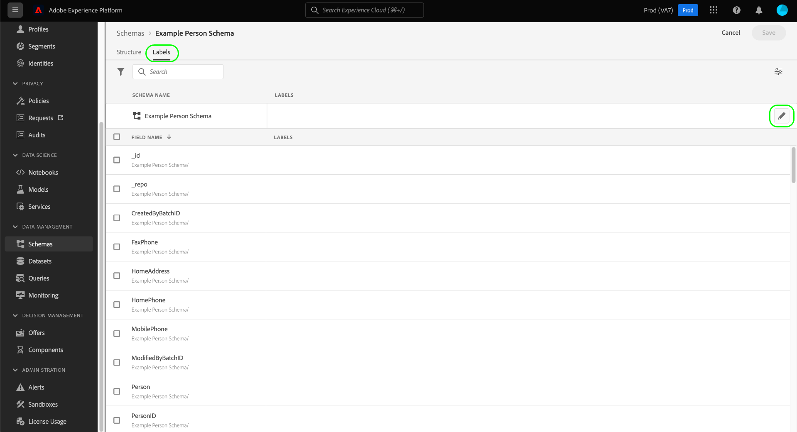

# アドホックスキーマの属性ベースのアクセス制御のサポート

Adobe Experience Platformに取り込まれるデータは、Experience Data Model(XDM) スキーマによってカプセル化され、組織や法規制によって定義される使用制限の対象となる場合があります。

スキーマが指定されていない場合に、クエリサービスで CTAS クエリを実行すると、アドホックスキーマが自動的に生成されます。 多くの場合、機密性の高い個人データと個人を特定できる情報の両方へのアクセスを制御するために、アドホックスキーマの特定のフィールド（データセット）の使用を制限する必要があります。 Adobe Experience Platformは、属性ベースのアクセス制御機能を使用して Platform UI を通じてスキーマフィールドにラベルを付けることで、このアクセス制御を容易にします。

ラベルはいつでも適用でき、データの管理方法を柔軟に選択できます。ただし、データを Platform に取り込んだらすぐに、またはデータを Platform で使用できるようになったらすぐに、データにラベルを付けることをお勧めします。

スキーマベースのラベル付けは、ユーザーまたはユーザーのグループに与えられるアクセスをより適切に管理するために、属性ベースのアクセス制御の重要な要素です。 Adobe Experience Platformでは、ラベルを作成して適用することで、アドホックスキーマの任意のフィールドへのアクセスを制限できます。

このドキュメントでは、クエリサービスで生成されたアドホックスキーマのデータフィールドにラベルを適用して、機密データへのアクセスを管理するためのチュートリアルを提供します。

## はじめに

このガイドでは、Adobe Experience Platform の次のコンポーネントに関する作業を理解している必要があります。

* [エクスペリエンスデータモデルl（XDM）システム](https://experienceleague.adobe.com/docs/experience-platform/xdm/home.html?lang=ja)：Experience Platform が顧客体験データを整理するための標準化されたフレームワークです。
   * [[!DNL Schema Editor]](https://experienceleague.adobe.com/docs/experience-platform/xdm/ui/overview.html?lang=ja):Platform UI でスキーマやその他のリソースを作成および管理する方法について説明します。
* [[!DNL Data Governance]](../../data-governance/home.md):方法 [!DNL Data Governance] では、顧客データを管理し、データの使用に適した規制、制限、ポリシーへのコンプライアンスを確保できます。
* [属性ベースのアクセス制御](../../access-control/abac/overview.md):属性ベースのアクセス制御は、Adobe Experience Platformの機能で、管理者が属性に基づいて特定のオブジェクトや機能へのアクセスを制御できるようにします。 属性は、アドホックや通常のスキーマフィールドに追加されるラベルなど、オブジェクトに追加されるメタデータにすることができます。 管理者は、ユーザーアクセス権限を管理する属性を含めた、アクセスポリシーを定義します。

## アドホックスキーマの作成

クエリが実行され、結果が生成されると、アドホックスキーマが自動的に生成され、スキーマインベントリに追加されます。

データラベルを追加するには、以下に移動します。 [!UICONTROL スキーマ] 「 」を選択して「ダッシュボード参照」タブを表示 [!UICONTROL スキーマ] （Platform UI の左側のレール）を使用して、 スキーマ在庫が表示されます。

>[!NOTE]
>
>アドホックスキーマは、デフォルトではスキーマインベントリに表示されません。

## Platform UI のスキーマインベントリでアドホックスキーマを検出する {#discover-ad-hoc-schemas}

Platform UI でアドホックスキーマを表示できるようにするには、フィルターアイコン () をクリックし、「**」を選択します[!UICONTROL アドホックスキーマを表示] が表示される左側のレール。

使用可能なリストから、最近作成したアドホックスキーマの名前を選択します。 アドホックスキーマ構造のビジュアライゼーションが表示されます。

## ガバナンスラベルの編集

アドホックスキーマのデータラベルを編集するには、 [!UICONTROL ラベル] タブをクリックします。 ラベルワークスペースでは、アドホックスキーマのフィールドにラベルを適用、作成および編集し、UI を使用してアクセス権限を制御できます。 アドホックスキーマ内のすべてのフィールドは、ここで表されます。

## スキーマまたはフィールドのラベルを編集

スキーマ全体のラベルを編集するには、鉛筆アイコン () をスキーマ名の横の ( [!UICONTROL ラベル] タブをクリックします。

既存のフィールドにラベルを適用するには、リストから 1 つ以上のフィールドを選択し、 [!UICONTROL ガバナンスラベルを編集] を右側のサイドバーに表示します。

## ラベルを編集ポップオーバー

この [!UICONTROL ラベルを編集] ポップオーバーが表示されます。 この表示から、UI を使用して既存のガバナンスラベルを作成または編集できます。

次の方法に関するガイダンスについては、ドキュメントを参照してください。 [選択したスキーマまたはフィールドのラベルを作成または編集します](https://experienceleague.adobe.com/docs/experience-platform/xdm/tutorials/labels.html#edit-the-labels-for-the-schema-or-field).

>[!NOTE]
>
>新しいラベルを作成したり、既存のラベルを編集したりするには、組織の管理者権限が必要です。 管理者権限がない場合は、システム管理者に問い合わせてアクセス権を設定してください。

ラベルは、権限ワークスペースを使用して作成することもできます。 詳しくは、 [権限ワークスペースでのラベルの作成に関するガイド](../../access-control/abac/ui/labels.md) 」を参照してください。

属性ベースの適切なレベルのアクセス制御が適用されたら、次のシステム動作が、アクセス不能なデータにユーザーがアクセスしようとした場合にクエリサービスで実行されるすべてのクエリに適用されます。

1. ユーザーがスキーマ内のフィールドの 1 つへのアクセスを拒否された場合、ユーザーは制限されたフィールドに対する読み取りや書き込みをおこなえなくなります。 これは、次の一般的なシナリオに当てはまります。

   * ユーザーが制限された列のみを使用してクエリを実行しようとすると、その列が存在しないというエラーがスローされます。
   * ユーザーが、制限された列を含む複数の列を持つクエリを実行しようとすると、制限されていないすべての列の出力のみが返されます。

1. ユーザーが計算フィールドへのアクセスを要求した場合、ユーザーは構成で使用されるすべてのフィールドへのアクセス権を持つ必要があります。そうしないと、システムは計算フィールドへのアクセスを拒否します。

ID またはプライマリ ID がアドホックスキーマに設定されている場合、関連するデータ衛生要求に従い、ID 列に関連付けられたデータセット内のデータがクリーンアップされます。

## 次の手順

このドキュメントを読むと、クエリサービス CTAS クエリを使用して作成したアドホックスキーマにデータ使用ラベルを追加する方法をより深く理解できます。 クエリサービスでのデータガバナンスに関する理解を深めるには、次のドキュメントをまだおこなっていないと便利です。

* [アドホックスキーマ ID](./ad-hoc-schema-identities.md)
* [データガバナンス](https://experienceleague.adobe.com/docs/experience-platform/data-governance/home.html?lang=ja)
