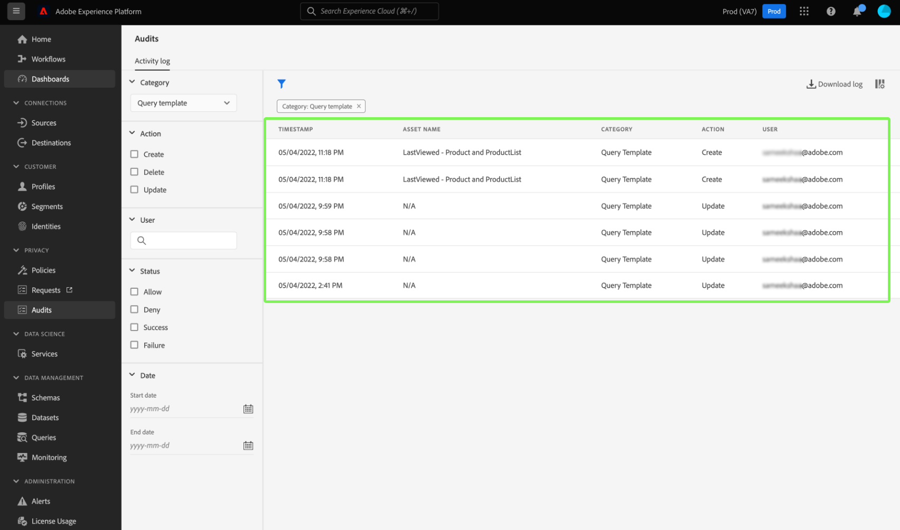

# [!DNL Query Service]監査ログの統合

Adobe Experience Platform [!DNL Query Service]監査ログ統合では、クエリ関連のユーザーアクションのレコードが提供されます。 監査ログは、企業のデータ管理ポリシーや規制要件のトラブルシューティングや遵守に役立つ重要なツールです。 この機能を使用すると、多くのイベントタイプのアクションログを返し、レコードをフィルタリングおよびエクスポートできます。 ログは、Experience Platform UIまたは[Audit Query API](https://www.adobe.io/experience-platform-apis/references/audit-query/)を通じてアクセスし、CSVまたはJSON ファイル形式でダウンロードできます。

監査ログのユーザーインターフェイスについて詳しくは、[監査ログの概要ドキュメント ](../../landing/governance-privacy-security/audit-logs/overview.md)を参照してください。 Experience Platform APIの呼び出しについて詳しくは、[監査ログ API ガイド ](../../landing/api-guide.md)を参照してください。

>[!NOTE]
>
>セッション削除アクションがログに記録されます。 UI ワークフローについては、[ クエリサービスセッションの管理](../ui/session-management.md)を参照してください。

## 前提条件

Experience Platform UI内で監査ログダッシュボードを表示するには、[!DNL Data Governance] [!UICONTROL View User Activity Log]権限を有効にする必要があります。 この権限は、Adobe [Admin Console](https://adminconsole.adobe.com/) を使用して有効にできます。この権限を有効にするための管理者権限がない場合は、組織の管理者に問い合わせてください。 [Admin Console を使用した権限の追加に関する完全な手順](../../access-control/home.md)については、アクセス制御に関するドキュメントを参照してください。

## [!DNL Query Service]個の監査ログ カテゴリ {#audit-log-categories}

[!DNL Query Service]が提供する監査ログのカテゴリは次のとおりです。

| カテゴリ | 説明 |
|---|---|
| [!UICONTROL Query] | このカテゴリでは、クエリ実行を監査できます。 |
| [!UICONTROL Query template] | このカテゴリでは、クエリテンプレートで実行されたさまざまなアクション（作成、更新、削除）を監査できます。 |
| [!UICONTROL Scheduled query] | このカテゴリでは、[!DNL Query Service]内に作成、更新、または削除されたスケジュールを監査できます。 |

## [!DNL Query Service]監査ログの実行 {#perform-an-audit-log}

[!DNL Query Service] アクティビティの監査を実行するには、左側のナビゲーションから「**[!UICONTROL Audits]**」を選択し、続いてfunnel アイコン（）を使用すると、検索結果の絞り込みに役立つフィルターコントロールのリストを表示できます。

[!UICONTROL Audits] ダッシュボード [!UICONTROL Activity log] タブから、記録されたすべてのExperience Platform アクションを[!DNL Query Service] カテゴリでフィルタリングできます。 ログ結果は、実行された期間、実行されたアクション/関数、またはクエリを実行したユーザーに基づいて、さらにフィルタリングできます。 カテゴリ、アクション、ユーザー、ステータス [に基づいてログをフィルタリングする方法については、](../../landing/governance-privacy-security/audit-logs/overview.md#managing-audit-logs-in-the-ui)監査ログのドキュメントを参照してください。

返される監査ログデータには、選択したフィルター条件を満たすすべてのクエリに関する次の情報が含まれます。

| 列の名前 | 説明 |
|---|---|
| [!UICONTROL Timestamp] | `month/day/year hour:minute AM/PM`形式で実行されたアクションの正確な日時。 |
| [!UICONTROL Asset Name] | [!UICONTROL Asset Name] フィールドの値は、フィルターとして選択したカテゴリによって異なります。 [!UICONTROL Scheduled query] カテゴリを使用する場合、これは&#x200B;**スケジュール名**&#x200B;です。 [!UICONTROL Query template] カテゴリを使用する場合、これは&#x200B;**テンプレート名**&#x200B;です。 [!UICONTROL Query] カテゴリを使用する場合、これは&#x200B;**セッション ID**&#x200B;です |
| [!UICONTROL Category] | このフィールドは、フィルタードロップダウンで選択したカテゴリと一致します。 |
| [!UICONTROL Action] | これは、作成、削除、更新、実行のいずれかです。 使用可能なアクションは、フィルターとして選択したカテゴリによって異なります。 |
| [!UICONTROL User] | このフィールドは、クエリを実行したユーザーIDを提供します。 |

>[!NOTE]
>
>ログ結果をCSVまたはJSON ファイル形式でダウンロードすると、監査ログダッシュボードにデフォルトで表示されるよりも多くのクエリの詳細が提供されます。

## 詳細パネル

監査ログの結果の任意の行を選択して、画面の右側にある詳細パネルを開きます。

詳細パネルを使用して、[!UICONTROL Asset ID]と[!UICONTROL Event status]を検索できます。

[!UICONTROL Asset ID]の値は、監査で使用されるカテゴリによって異なります。

* [!UICONTROL Query] カテゴリを使用する場合、[!UICONTROL Asset ID]は&#x200B;**セッション ID**&#x200B;です。
* [!UICONTROL Query template] カテゴリを使用する場合、[!UICONTROL Asset ID]は&#x200B;**テンプレート ID**&#x200B;で、先頭に`[!UICONTROL templateID:]`が付きます。
* [!UICONTROL Scheduled query] カテゴリを使用する場合、[!UICONTROL Asset ID]は&#x200B;**スケジュール ID**&#x200B;で、先頭に`[!UICONTROL scheduleID:]`が付きます。

[!UICONTROL Event status]の値は、監査で使用されるカテゴリによって異なります。

* [!UICONTROL Query] カテゴリを使用する場合、[!UICONTROL Event status] フィールドには、そのセッション内でユーザーが実行したすべての&#x200B;**クエリ ID**&#x200B;のリストが表示されます。
* [!UICONTROL Query template] カテゴリを使用する場合、[!UICONTROL Event status] フィールドには、イベントステータスの接頭辞として&#x200B;**テンプレート名**&#x200B;が表示されます。
* [!UICONTROL Query schedule] カテゴリを使用する場合、[!UICONTROL Event status] フィールドには、イベントのステータスのプレフィックスとして&#x200B;**スケジュール名**&#x200B;が表示されます。

## [!DNL Query Service]個の監査ログカテゴリで使用可能なフィルター {#available-filters}

使用可能なフィルターは、ドロップダウンで選択したカテゴリによって異なります。 次の表は、[[!DNL Query Service] 監査ログカテゴリ ](#audit-log-categories)で使用できるフィルターの詳細を示しています。

| フィルター | 説明 |
|---|---|
| カテゴリ | 使用可能なカテゴリの完全なリストについては、[[!DNL Query Service] 監査ログカテゴリ ](#audit-log-categories)の節を参照してください。 |
| アクション | [!DNL Query Service]個の監査カテゴリを参照する場合、更新は既存のフォーム **に**&#x200B;変更され、削除は&#x200B;**スケジュールまたはテンプレート**&#x200B;の削除、作成は&#x200B;**新しいスケジュールまたはテンプレートの作成**、実行は&#x200B;**クエリを実行しています**。 |
| ユーザー | 完全なユーザーID （johndoe@acme.comなど）を入力して、ユーザーでフィルタリングします。 |
| ステータス | [!UICONTROL Allow]、[!UICONTROL Success]および[!UICONTROL Failure] オプションは、「ステータス」または「イベントステータス」に基づいてログをフィルタリングしますが、[!UICONTROL Deny] オプションは&#x200B;**すべての** ログをフィルタリングします。 |
| 日付 | 結果をフィルターする日付範囲を定義する開始日および／または終了日を選択します。 |

## 次の手順

このドキュメントを読むことで、[!DNL Query Service]監査ログ機能と、それを使用して[!DNL Query Service] ユーザーアクションをフィルタリングする方法について理解を深めることができます。

トラブルシューティングの目的で[!DNL Query Service]監査ログ機能を使用している場合は、[ トラブルシューティングガイド ](../troubleshooting-guide.md)をお読みになることをお勧めします。
