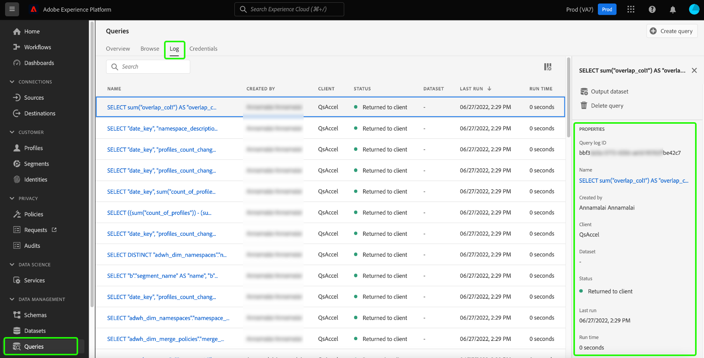

# Query Serviceのデータガバナンス

Adobe Experience Platformを利用すれば、複数のシステムからデータを集約し、ニーズに応じてQuery Serviceを通じてデータをクリーニング、整形、操作、補完できます。 これにより、マーケターはより優れた方法で顧客を特定、理解し、エンゲージメントできます。 特定のデータは、組織のポリシーや法的規制にもとづいて利用制限の対象となる場合があるため、適切なデータガバナンスを確立することは、個人情報の取り扱いに関する重要な側面です。 取り込んだデータと関連する操作が、定義されたデータ使用ポリシーに準拠していることを確認することが重要です。

Query Service内のデータガバナンスにより、顧客データを管理し、データ使用に適用される規制、制限、ポリシーへのコンプライアンスを確保できます。 これは、ビジネスで定義された規制に従って使用ポリシーが適用されていることを確認する際に重要な役割を果たします。

日常的にデータ処理を実施する組織では、すべてのユーザーに対してプライバシーを重視した環境を構築するために、これらのガイドラインの概要を作成し、実践し、実施することをお勧めします。

次のカテゴリは、クエリサービスを使用する際のデータコンプライアンス規制の遵守に役立ちます。

1. セキュリティ
1. 監査
1. データ利用
1. プライバシー
1. データハイジーン

このドキュメントでは、様々なガバナンスの各領域について説明し、クエリサービスを使用する際のデータコンプライアンスの促進の方法を示します。 Experience Platformを使用して顧客データを管理し、コンプライアンスを確保する方法について詳しくは、[ ガバナンス、プライバシー、セキュリティの概要](../../landing/governance-privacy-security/overview.md)を参照してください。

## セキュリティ {#security}

データセキュリティとは、不正アクセスからデータを保護し、ライフサイクル全体を通じて安全なアクセスを保証するプロセスです。 Experience Platformでは、ロールベースのアクセス制御や属性ベースのアクセス制御などの機能によって、役割や権限を適用することで、安全なアクセスを維持しています。 また、Experience Platform全体でデータを保護するために、認証情報、SSL、データ暗号化も使用されます。

クエリサービスに関するセキュリティは、次のカテゴリに分かれています。

* [ アクセス制御](#access-control): アクセスは、データセットおよび列レベルの権限を含む役割と権限によって制御されます。
* [接続性](#connectivity)を介したデータの保護：データは、期限切れの資格情報または期限切れでない資格情報との限られた接続を実現することで、Experience Platformおよび外部クライアントを通じて保護されます。
* [暗号化と顧客管理キー（CMK） ](#encryption-and-customer-managed-keys)によるデータの保護：データが保存中の場合は、暗号化によってアクセスを制御します。

### アクセス制御 {#access-control}

Adobe Experience Platformのアクセス制御は、クエリサービス機能を使用できるユーザーを決定するロールベースの権限によって管理されます。 同様に、スキーマとデータフィールドのラベル管理を通じて、特定のデータ属性へのアクセスを制御できます。

この節では、クエリサービス機能を完全に利用するためにユーザーが持つ必要なアクセス制御権限について説明します。 製品プロファイルへのアクセス権の割り当て方法について詳しくは、[権限の管理](../../access-control/ui/permissions.md)および[ ユーザーの管理](../../access-control/ui/users.md)に関するドキュメントを参照してください。

#### 関連する権限

関連するアクセス制御の権限は、スコープのレベルに応じて以下の表で定義されます。

**クエリ実行権限**

クエリサービス内でクエリを実行するには、ユーザーに次の権限を持つ役割を割り当てる必要があります。

| 権限 | 説明 |
|---|---|
| [!UICONTROL Manage Queries] | この権限を持つユーザーは、データ探索とバッチクエリを実行できます。このクエリでは、既存のデータセットを読み取るか、データセットにデータを書き込むことができます。 これには、`CREATE TABLE AS SELECT` （`CTAS`）と`INSERT INTO AS SELECT` （`ITAS`）の両方のクエリが含まれます。 |

**データセット権限**

このセクションは、クエリサービスを通じてデータをクエリする際にデータセットにアクセスするために必要なリソースベースのアクセスのガイドとして機能します。

権限インターフェイスを使用すると、次の権限を持つデータセットとスキーマに対するリソースベースのアクセス制御を定義できます。

| 権限 | 説明 |
|---|---|
| [!UICONTROL Manage Datasets] | この権限は、スキーマに対する読み取り専用アクセスを提供し、クエリサービスで使用するデータセットの読み取り、作成、編集、削除にアクセスできます。 |
| [!UICONTROL View Datasets] | この権限は、クエリサービスで使用するデータセットとスキーマに対する読み取り専用アクセスを許可します。 |

#### 列/フィールドのアクセス制御

属性ベースのアクセス制御機能により、Query Service ユーザーは重要なユーザーデータへのアクセスを制限できます。 アクセスは、役割に割り当てられた権限に基づいて付与または制限できます。 個々の列へのユーザーアクセスは、関連するデータ使用ラベルと、ユーザーに割り当てられた役割に適用される権限セットによって制御されます。

データ使用ラベル付きのスキーマフィールドグループとクラスにタグ付けすると、同じフィールドグループとクラスを持つすべてのスキーマにデータ使用の制限が適用されます。 この機能の包括的な情報については、[属性ベースのアクセス制御](../../access-control/abac/overview.md)の概要を参照してください。

この機能を使用すると、機密列に対するアクセス権を、選択したユーザーグループに付与できます。 列のアクセス制御は、特定のタイプのユーザーの読み取り機能と書き込み機能の両方を制限できます。

列のアクセス制御は、標準スキーマとアドホックスキーマの両方のスキーマレベルで適用できます。 データ使用ラベルをXDM スキーマに適用して、1つ以上の列へのアクセスを制限します。 データのラベル付けは、事前に定義されたスキーマまたはCTAS操作の一部として生成されたアドホックスキーマを使用してクエリサービスを介して作成されたデータセットに対しても、一貫して適用されます。

ラベルと役割を使用して適切なレベルのアクセスが適用されると、ユーザーがアクセスできないデータにアクセスしようとすると、次のシステム動作が発生します。

1. ユーザーがスキーマ内のいずれかの列へのアクセスを拒否された場合、そのユーザーは制限付き列の読み取りまたは書き込み権限も拒否されます。 これは、次の一般的なシナリオに当てはまります。

   * **ケース 1**: ユーザーが制限付き列のみに影響するクエリを実行しようとすると、その列が存在しないというエラーがスローされます。
   * **ケース 2**: ユーザーが制限付き列を含む複数の列を含むクエリを実行しようとすると、システムはすべての制限付き列に対してのみ出力を返します。

1. ユーザーが計算フィールドにアクセスしようとすると、コンポジションで使用されているすべてのフィールドにアクセスする必要があります。または、システムが計算フィールドへのアクセスも拒否します。

#### ビューのアクセス制御

クエリサービスでは、[`CREATE VIEW`](../sql/syntax.md#create-view)文に標準のANSI SQLを使用できます。 機密性の高いデータワークフローの場合、ビューを作成する際には適切な制御を適用する必要があります。

`CREATE VIEW` キーワードは、クエリのビューを定義しますが、ビューは物理的にマテリアライズされていません。 代わりに、ビューがクエリで参照されるたびにクエリが実行されます。 ユーザーがデータセットからビューを作成する場合、親データセットの役割ベースおよび属性ベースのアクセス制御ルールは&#x200B;**階層的に適用されません**。 そのため、ビューの作成時に、各列に対する権限を明示的に設定する必要があります。

#### 高速化されたデータセットに対してフィールドベースのアクセス制限を作成する {#create-field-based-access-restrictions-on-accelerated-datasets}

[属性ベースのアクセス制御機能](../../access-control/abac/overview.md)を使用すると、[高速化ストア ](../data-distiller/sql-insights/send-accelerated-queries.md)のファクトデータセットとディメンションデータセットに対して、組織またはデータ使用範囲を定義できます。 これにより、管理者は特定のセグメントへのアクセスを管理し、ユーザーまたはユーザーグループに与えられたアクセスをより適切に管理できます。

高速データセットに対してフィールドベースのアクセス制限を作成するには、Query ServiceのCTAS クエリを使用して高速データセットを作成し、既存のXDM スキーマまたはアドホックスキーマに基づいてこれらのデータセットを構造化します。 次に、管理者は[ スキーマ ](../../xdm/tutorials/labels.md#edit-the-labels-for-the-schema-or-field)または[ アドホックスキーマ ](./ad-hoc-schema-labels.md#edit-governance-labels)のデータ使用ラベルを追加および編集できます。 [!UICONTROL Schemas] UIの[!UICONTROL Labels] ワークスペースから、スキーマにラベルを適用、作成、編集できます。

データ使用ラベルは、[ データセット UIを使用してデータセット ](../../data-governance/labels/user-guide.md#add-labels)に直接適用または編集したり、アクセス制御[!UICONTROL Labels] ワークスペースから作成したりすることもできます。 詳しくは、[新しいラベルを作成する方法](../../access-control/abac/ui/labels.md)に関するガイドを参照してください。

個々の列へのユーザーアクセスは、添付されたデータ使用ラベルと、ユーザーに割り当てられた役割に適用される権限セットによって制御できます。

### 接続性 {#connectivity}

Query Serviceには、Experience Platform UIを介して、または外部互換性のあるクライアントとの接続を介してアクセスできます。 利用可能なすべてのフロントへのアクセスは、一連の資格情報によって制御されます。

#### 外部クライアントによる接続

サードパーティクライアントを使用してQuery Serviceにアクセスするには、認証に資格情報が必要です。 これらの資格情報は、互換性のある外部クライアントのいずれかでクエリサービスにアクセスするために必須です。 期限切れの資格情報](#expiring-credentials)または[期限切れでない資格情報](#non-expiring-credentials)を使用して、外部クライアントに接続できます。[

#### 期限切れの資格情報による接続時間が限られている {#expiring-credentials}

[資格情報の有効期限](../ui/credentials.md)により、ユーザーは外部クライアントとの一時的な接続を確立できます。 この一連の資格情報は、24時間のみ有効です。 これらの種類の資格情報の有効期限は、クエリサービスダッシュボードの「資格情報」タブと共に確認できます。

#### 資格情報の期限切れなし {#non-expiring-credentials}

[有効期限のない資格情報](../ui/credentials.md#non-expiring-credentials)を使用すると、外部クライアントとの永続的な接続を確立できるため、手動パスワードを使用することなくクエリサービスに簡単に接続できます。

有効期限のない資格情報を生成するオプションを有効にするには、概説された[前提条件ワークフロー](../ui/credentials.md#prerequisites)に従う必要があります。 このプロセスの一環として、組織の管理者は、製品プロファイルの権限を設定し、有効期限のない資格情報を使用するアクセス権を持つアカウントを管理者が制御できるようにします。

期限切れでない資格情報で許可されたテクニカルユーザーアカウントには、役割を割り当てて、その責任とニーズに基づいて読み取りおよび書き込みアクセスの範囲を定義することで、適切なデータガバナンスを確保することができます。 アクセス制御](#access-control)による役割ベースの権限を使用してクエリサービスへのアクセスを管理する[については、前述の節を参照してください。

前提条件のワークフローが完了すると、承認されたユーザーは[必要な接続資格情報を生成できるようになりました](../ui/credentials.md#generate-credentials)。

#### SSL データの暗号化

セキュリティを強化するために、Query Serviceでは、クライアント/サーバー通信を暗号化するSSL接続をネイティブサポートしています。 Experience Platformは、データセキュリティのニーズに合わせて、暗号化とキー交換の処理オーバーヘッドのバランスを取るために、さまざまなSSL オプションをサポートしています。

`verify-full` SSL パラメーター値を使用して接続する方法など、詳しくは、サードパーティクライアントからQuery Serviceへの接続に使用できる[SSL オプションに関するガイドを参照してください。](../clients/ssl-modes.md)

### 暗号化キーと顧客管理キー（CMK） {#encryption-and-customer-managed-keys}

暗号化とは、アルゴリズムによるプロセスを使用して、データをエンコードされた読み取り不可能なテキストに変換し、復号化キーなしでは情報が保護され、アクセスできないようにすることです。

Query Serviceのデータコンプライアンスにより、データが常に暗号化されます。 転送中のデータは常にHTTPSに準拠し、システムレベルのキーを使用して、保存データはAzure Data Lake ストアで暗号化されます。 詳しくは、[Adobe Experience Platformでのデータの暗号化方法](../../landing/governance-privacy-security/encryption.md)に関するドキュメントを参照してください。 Azure Data Lake Storageで保存中のデータがどのように暗号化されるかについて詳しくは、[Azureの公式ドキュメント ](https://docs.microsoft.com/ja-jp/azure/data-lake-store/data-lake-store-encryption)を参照してください。

転送中のデータは常にHTTPSに準拠しています。同様に、データレイクにデータが保存されている場合は、Data Lake Managementでサポートされている顧客管理キー（CMK）を使用して暗号化を実行します。 現在サポートされているバージョンはTLS1.2です。 Adobe Experience Platformに保存されているデータに独自の暗号化キーを設定する方法については、[顧客管理キー（CMK）ドキュメント ](../../landing/governance-privacy-security/customer-managed-keys/overview.md)を参照してください。

## 監査 {#audit}

Query Serviceはユーザーのアクティビティを記録し、そのアクティビティを様々なログタイプに分類します。 **who**&#x200B;が&#x200B;**what** アクションを実行し、**when**&#x200B;に関する情報をログから入手できます。 ログに記録される各アクションには、アクションのタイプ、日時、アクションを実行したユーザーの電子メール ID、アクションのタイプに関連する追加の属性を示すメタデータが含まれます。

任意のログカテゴリは、Experience Platform ユーザーが必要に応じて要求できます。 この節では、クエリサービス用にキャプチャされる情報のタイプと、この情報にアクセスできる場所について詳しく説明します。

### クエリログ {#query-logs}

クエリログ UIを使用すると、クエリエディターまたはクエリサービス APIを介して実行されたすべてのクエリの実行の詳細を監視および確認できます。 これにより、クエリサービスのアクティビティに透明性が生まれ、クエリサービス全体で実行されたクエリの&#x200B;**all**&#x200B;のメタデータを確認できます。 探索的、バッチ、スケジュール型など、あらゆるタイプのクエリが含まれます。

クエリログには、[!UICONTROL Queries] ワークスペースの「[!UICONTROL Logs]」タブにあるExperience Platform UIからアクセスできます。

### 監査ログ {#audit-logs}

監査ログには、クエリログよりも詳細な情報が含まれており、ユーザー、日付、クエリの種類などの属性に基づいてログをフィルタリングできます。 監査ログでは、クエリログ UIで使用可能な詳細の他に、個々のユーザーの詳細と、セッションデータまたはサードパーティクライアントへの接続性を保存します。

監査証跡は、ユーザーの行動に関する正確な記録を提供することで、問題のトラブルシューティングに役立ち、企業のデータ管理ポリシーや規制要件に効果的に準拠するのに役立ちます。 監査ログは、すべてのExperience Platform アクティビティの記録を提供します。 監査ログを使用すると、クエリ実行、テンプレート、スケジュールされたクエリに関連するユーザーアクションを監査して、クエリサービスでユーザーが実行するアクションの透明性と可視性を高めることができます。

次の表は、監査ログによってキャプチャされたクエリカテゴリと、記録されたアクションタイプを示しています。

| カテゴリ | アクションタイプ |
|---|---|
| クエリ | 実行 |
| クエリテンプレート | 作成、削除、更新 |
| スケジュールされたクエリ | 作成、削除、更新 |

以下は、クエリログ内で見つかる詳細よりも多くの詳細を保持する3つの拡張サーバーログのリストです。 拡張ログは、監査ログクエリカテゴリ内に次のように表示されます。

1. **Meta クエリログ**: クエリが実行されると、関連するさまざまなバックエンドサブクエリ（解析など）が実行されます。 このようなクエリは「メタデータ」クエリと呼ばれます。 関連する詳細は、監査ログに記載されています。
1. **セッションログ**：ユーザーがクエリを実行するかどうかに関係なく、ユーザーがクエリサービスにログインすると、システムによってセッションのエントリログが作成されます。
1. **サードパーティのクライアント接続ログ**：ユーザーがクエリサービスをサードパーティのクライアントに正常に接続すると、接続性監査ログが生成されます。

監査ログが組織のデータコンプライアンスへの取り組みに役立つ方法について詳しくは、[監査ログの概要](../../landing/governance-privacy-security/audit-logs/overview.md)を参照してください。

## データ利用 {#data-usage}

Experience Platformのデータガバナンスフレームワークは、あらゆるAdobeソリューション、サービス、プラットフォームをまたいで、データを責任を持って使用するための統一された方法を提供します。 Adobe Experience Cloud全体でメタデータをキャプチャ、コミュニケーション、使用する体系的なアプローチを調整します。 これにより、データ管理者は、必要なマーケティング活動と、意図されたマーケティング活動から得られるデータの制限に従って、データにラベルを付けることができます。 Data Governanceでデータセットとフィールドにデータ使用ラベルを適用する方法について詳しくは、[ データ使用ラベル ](../../data-governance/labels/overview.md)の概要を参照してください。

データジャーニーの各段階で、データコンプライアンスに向けて取り組むことがベストプラクティスです。 このため、アドホックスキーマを使用する派生データセットは、データガバナンスフレームワークの一部として適切にラベル付けする必要があります。 Query Serviceで作成される派生データセットには、標準スキーマを使用するデータセットと、アドホックスキーマを使用するデータセットの2種類があります。

>[!NOTE]
>
>クエリサービスを使用して作成されたデータセットは、「派生データセット」と呼ばれます。

アドホックスキーマは、特定の目的のために個々のユーザーによって作成されるので、XDM スキーマフィールドは、その特定のデータセット用の名前空間であり、異なるデータセット間で使用することを意図したものではありません。 その結果、Experience Platform UIでは、アドホックスキーマはデフォルトで表示されません。 標準スキーマとアドホックスキーマの両方でデータ使用ラベルの適用に違いはありませんが、ラベル付けを目的としてQuery Serviceで作成されたアドホックスキーマは、まずExperience Platform UIで表示する必要があります。 詳しくは、[Experience Platform UI](./ad-hoc-schema-labels.md#discover-ad-hoc-schemas)内でのアドホックスキーマの検出に関するガイドを参照してください。

スキーマにアクセスしたら、[個々のフィールドにラベルを適用できます](../../xdm/tutorials/labels.md)。 スキーマにラベルを付けると、そのスキーマから派生するすべてのデータセットがそのラベルを継承します。 ここから、特定のラベルを持つデータを特定の宛先にアクティベートできないように制限できるデータ使用ポリシーを設定できます。 詳しくは、[ データ使用ポリシー](../../data-governance/policies/overview.md)の概要を参照してください。

## プライバシー {#privacy}

[Privacy Service](../../privacy-service/home.md)は、お客様からのデータへのアクセスおよびデータの削除に関するお客様のリクエストを、法的なプライバシー規制に従って管理するのに役立ちます。 これは、既存のIDのデータを検索し、要求されたプライバシージョブに応じてそのデータにアクセスするか削除することによって実現します。 サービスがプライバシージョブ中にアクセスまたは削除するフィールドを決定するには、データに適切なラベルを付ける必要があります。 プライバシー要求の対象となるデータには、データの異なる部分とプライバシー要求の適用対象となる個人を結びつけるために、顧客ID情報を含める必要があります。 Query Serviceでは、プライバシージョブを満たすために、一意の識別子を使用してデータを拡充できます。

プライバシーリクエストは、データレイクまたはプロファイルデータストアに送信できます。 データレイクから削除されたレコードは、それらのレコードから作成されたプロファイルの削除につながりません。 また、データレイクから個人情報を削除するプライバシージョブは、そのプロファイルを削除しないため、プライバシージョブの完了後に取り込まれた情報（そのプロファイル IDを含む）は、通常どおりプロファイルを更新します。 これは、特定のスキーマで使用されるデータを適切に識別する必要性を再確認します。

プライバシーリクエストの[ID データ ](../../privacy-service/identity-data.md)について詳しくは、Privacy Serviceのドキュメントを参照してください。また、データ操作を設定し、Adobe テクノロジーを活用して、お客様のプライバシーリクエストに適したID情報を効果的に取得する方法について詳しく説明します。

データガバナンス向けのQuery Service機能データの分類とデータ使用規制の遵守プロセスを簡素化および合理化します。 データが識別されると、Query Serviceでは、すべての出力データセットにプライマリ IDを割り当てることができます。 データ プライバシー要求を促進し、データ コンプライアンスに取り組むために、データセットにIDを&#x200B;**追加する必要があります**。

スキーマデータフィールドは、Experience Platform UIとクエリサービスを使用してID フィールドとして設定できます。また、[SQL コマンド「ALTER TABLE」 ](../sql/syntax.md#alter-table)を使用してプライマリ IDをマークすることもできます。 `ALTER TABLE` コマンドを使用してIDを設定することは、Experience Platform UIを使用してスキーマから直接データセットを作成するのではなく、SQLを使用してデータセットを作成する場合に特に便利です。 標準スキーマを使用する場合にUI](../../xdm/ui/fields/identity.md)でID フィールドを[定義する方法については、ドキュメントを参照してください。

## データハイジーン {#data-hygiene}

「データの健全性」とは、古い、不正確な、誤ったフォーマット、重複、不完全なデータを修復または削除するプロセスのことです。 これらのプロセスは、あらゆるシステムをまたいでデータセットが正確で一貫性のあるものにします。 データジャーニーのあらゆる段階で、さらには最初のデータ保存場所から適切なデータの健全性を保つことが重要です。 Experience Platform Query Serviceでは、これはデータレイクまたはアクセラレーションストアです。

Experience Platformの一元化されたデータハイジーンサービスに従って、派生データセットにIDを割り当てて、データ管理を許可できます。

逆に、高速化されたストアで集約データセットを作成する場合、集約データを使用して元のデータを取得することはできません。 このデータ集計の結果、データの健全性要求を高める必要がなくなります。

このシナリオの例外は、削除の場合です。 データセットでデータハイジーン削除が要求され、削除が完了する前に別の派生データセットクエリが実行された場合、派生データセットは元のデータセットから情報を取得します。 この場合、データセットを削除するリクエストが送信された場合、同じデータセットソースを使用して新たに派生したデータセットクエリを実行してはならないことに注意する必要があります。

Adobe Experience Platformでのデータハイジーンについて詳しくは、[ データハイジーンの概要](../../hygiene/home.md)を参照してください。
