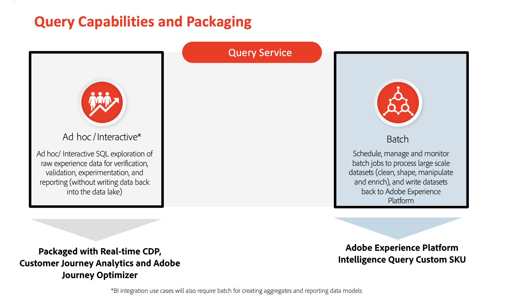

# クエリサービスのガードレール

Guardrail は、データとシステムの使用状況、パフォーマンスの最適化、Adobe Experience Platformでのエラーや予期しない結果の回避をガイドするしきい値です。

このドキュメントでは、ライセンス権限に関連するデータをクエリする際のシステムパフォーマンスを最適化するのに役立つ、クエリサービスデータのデフォルトの使用制限を提供します。

## 前提条件

このドキュメントを続行する前に、主なクエリサービスの定義と機能に関する十分な知識が必要です。 次に、それらについて説明します。

* **アドホッククエリ**:実行用 `SELECT` クエリの結果を含むデータを調査、実験、検証するクエリ **保存されていません** をデータレイクに追加します。

* **バッチクエリ**:実行用 `INSERT TABLE AS SELECT` および `CREATE TABLE AS SELECT` データの消去、形状化、操作、エンリッチメントをおこなうクエリ。 これらのクエリの結果 **が保存されている** をデータレイクに追加します。 この機能の消費量を測定する指標は、計算時間です。

* **クエリサービスユーザー**:現在のライセンス内で、Customer Journey Analytics、Adobe Real-time Customer Data Platform、Adobe Journey Optimizerに対して提供されているクエリサービスユーザーも、Data Distillerと共に使用できます。 クエリサービスのユーザーは、機能間で共有されます。

* **アドホックユーザー**:アドホックユーザーとは、アドホッククエリを実行するユーザーです。

* **バッチユーザー**:バッチユーザーは、バッチクエリを実行するユーザーです。

* **レポート API**:データ取得呼び出しを（内部または外部に）おこなうための API です。 拡張レポートのデータモデルは、Real-Time CDPダッシュボードのデータモデルなど、Adobe Experience Platformのネイティブレポートのデータモデルから派生します。

次の図は、クエリサービス機能が現在パッケージ化され、ライセンスを受け取っている方法をまとめたものです。

## 上限のタイプ

このドキュメントでは、次の 2 種類のデフォルトの上限について説明します。

* **ソフトリミット**:ソフトリミットを超えても構いませんが、ソフトリミットはシステムのパフォーマンスに対して推奨されるガイドラインです。

* **ハードリミット**:ハードリミットは絶対最大値を提供します。

>[!NOTE]
>
>このドキュメントで概要を説明するデフォルトの制限は、常に改善されています。 定期的にアップデートを確認してください。

## プライマリエンティティ効果ガードレール

次の表に、特定のクエリパターンを使用する場合に実行するクエリに推奨されるガードレールの制限と説明を示します。

**アドホッククエリ**

| ガードレール | 上限 | 制限タイプ | 説明 |
|---|---|---|---|
| 最大実行時間 | 10 分 | ハード | これは、アドホック SQL クエリの最大出力時間を定義します。 結果を返す時間制限を超えると、エラーコード53400がスローされます。 |
| 同時クエリサービスユーザー | <ul><li>アプリケーション製品の説明で指定されたとおり。</li><li>+5 （追加のアドホッククエリユーザーアドオンパックを購入するたびに）</li></ul> | ハード | 特定の組織に対して同時にセッションを作成できるユーザー数を定義します。 同時実行制限を超えた場合、ユーザーは `Session Limit Reached` エラー。 |
| クエリの同時実行 | <ul><li>アプリケーション製品の説明で指定されたとおり。</li><li>+1 （追加のアドホッククエリユーザーアドオン SKU パックを購入するたび）</li></ul> | ハード | 特定の組織に対して同時に実行できるクエリの数を定義します。 同時実行制限を超えると、クエリはキューに入れられます。 |
| クライアントコネクタと結果出力の制限 | クライアントコネクタ<ul><li>クエリ UI （100 行）</li><li>サードパーティクライアント (50,000)</li><li>[!DNL PostgresSQL] クライアント (50,000)</li></ul> | ハード | クエリの結果は、次の方法で受け取ることができます。<ul><li>クエリサービス UI</li><li>サードパーティクライアント</li><li>[!DNL PostgresSQL] client</li></ul>注意：出力数に制限を追加すると、結果がより速く返される場合があります。 例えば、`LIMIT 5`、`LIMIT 10` など。 |
| 次を介して返された結果： | クライアント UI | N/A | これは、結果をユーザーに提供する方法を定義します。 |

{style=&quot;table-layout:auto&quot;}

**バッチクエリ**

| **ガードレール** | **上限** | **制限タイプ** | **説明** |
|---|---|---|---|
| 最大実行時間 | 24 時間 | ハード | バッチ SQL クエリの最大実行時間を定義します。 クエリの処理時間は、処理するデータの量とクエリの複雑さに応じて異なります。 |
| スケジュール解除バッチの同時クエリサービスユーザー | <ul><li>アプリケーション製品の説明で指定されたとおり。</li><li>+5 （追加のアドホッククエリユーザーアドオンパックを購入するたびに）</li></ul> | ハード | スケジュール設定されていないバッチクエリ（インタラクティブモードの CTAS/ITAS クエリなど）の場合、特定の組織に対して同時にセッションを作成できるユーザーの数を定義します。 同時実行制限を超えた場合、ユーザーは `Session Limit Reached` エラー。 |
| スケジュール済バッチの同時クエリサービスユーザー | ユーザーの制限なし | 該当なし | スケジュールされたバッチクエリは非同期ジョブなので、ユーザーの制限はありません。 |
| バッチデータ処理の計算時間 | お客様のAdobe Experience Platform Intelligence Query Custom SKU 販売注文で指定 | ソフト | これにより、顧客がバッチクエリを実行してデータをスキャン、処理し、データレイクに書き戻す際に許可される、1 年あたりの計算時間の範囲を定義します。 |
| クエリの同時実行 | サポートあり | 該当なし | スケジュールされたバッチクエリは非同期ジョブなので、同時クエリがサポートされます。 |
| クライアントコネクタと結果出力の制限 | クライアントコネクタ<ul><li>クエリ UI （行の上限なし）</li><li>サードパーティクライアント（行の上限なし）</li><li>[!DNL PostgresSQL] クライアント（行の上限なし）</li><li>REST API（行の上限なし）</li></ul> | ハード | クエリの結果は、次の方法で使用できます。<ul><li>派生データセットとして保存可能</li><li>既存の派生データセットに挿入可能</li></ul>注意：クエリ結果のレコード数に上限はありません。 |
| 次を介して返された結果： | データセット | 該当なし | これは、結果をユーザーに提供する方法を定義します。 |

{style=&quot;table-layout:auto&quot;}

## Query accelerated store {#query-accelerated-store}

次の表に、クエリ高速化ストアで推奨されるガードレールの制限と説明を示します。

| ガードレール | 上限 | 制限タイプ | 説明 |
|---|---|---|---|
| クエリの同時実行 | 4 | ハード | レポート API は、レポート API を介して集計データに関するクエリ（リアルタイム CDP データモデルなどのデータモデルを強化するクエリを含む）を効率的に実行するリソースを確保するために、各クエリに同時実行スロットを割り当てて、リソースの使用率を追跡します。 システムは、クエリをキューに入れ、同時実行スロットが使用可能になるか、キャッシュからクエリを提供できるまで待機します。 同時に使用できるクエリスロットは最大 4 つです。 BI ツールを通じてレポート API にアクセスし、より多くの同時実行性が必要な場合は、BI サーバーが必要です。 |

{style=&quot;table-layout:auto&quot;}

## 次の手順

このドキュメントを読んだ後は、使用可能なクエリパターンに基づいて、クエリ実行のデフォルトの制限をより深く理解する必要があります。

クエリサービスについて詳しくは、次のドキュメントを参照してください。

* [クエリサービス API](./api/getting-started.md)
* [クエリサービス UI](./ui/overview.md)
