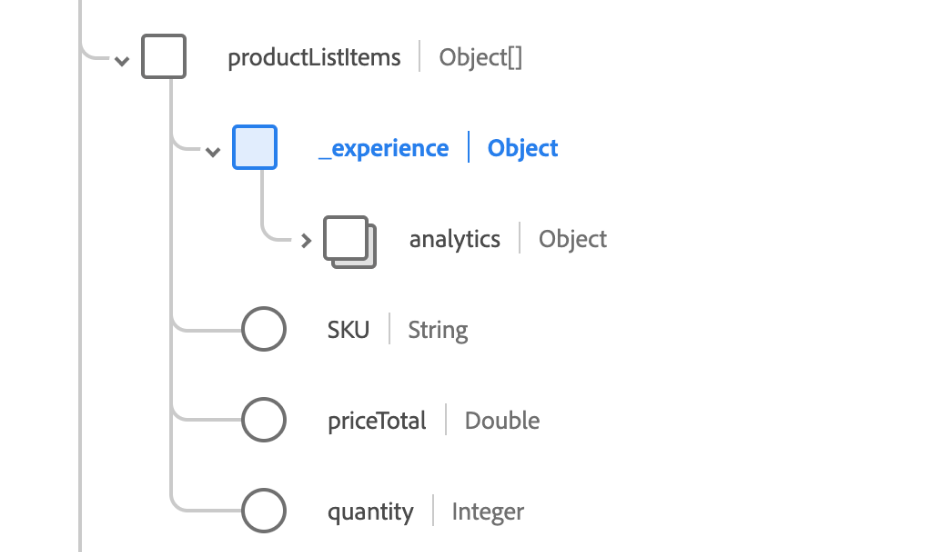

# クエリサービスのSQL構文

Adobe Experience Platform Query Serviceでは、`SELECT`文やその他の制限付きコマンドに標準のANSI SQLを使用できます。 このドキュメントでは、[!DNL Query Service]でサポートされているSQL構文について説明します。

## クエリを選択 {#select-queries}

次の構文は、`SELECT`がサポートする[!DNL Query Service] クエリを定義します。

```sql
[ WITH with_query [, ...] ]
SELECT [ ALL | DISTINCT [( expression [, ...] ) ] ]
    [ * | expression [ [ AS ] output_name ] [, ...] ]
    [ FROM from_item [, ...] ]
    [ SNAPSHOT { SINCE start_snapshot_id | AS OF end_snapshot_id | BETWEEN start_snapshot_id AND end_snapshot_id } ]
    [ WHERE condition ]
    [ GROUP BY grouping_element [, ...] ]
    [ HAVING condition [, ...] ]
    [ WINDOW window_name AS ( window_definition ) [, ...] ]
    [ { UNION | INTERSECT | EXCEPT | MINUS } [ ALL | DISTINCT ] select ]
    [ ORDER BY expression [ ASC | DESC | USING operator ] [ NULLS { FIRST | LAST } ] [, ...] ]
    [ LIMIT { count | ALL } ]
    [ OFFSET start ]
```

以下の「タブ」セクションには、FROM、GROUP、WITH キーワードで使用できるオプションが用意されています。

>[!BEGINTABS]

>[!TAB `from_item`]

```sql
table_name [ * ] [ [ AS ] alias [ ( column_alias [, ...] ) ] ]
```

```sql
[ LATERAL ] ( select ) [ AS ] alias [ ( column_alias [, ...] ) ]
```

```sql
with_query_name [ [ AS ] alias [ ( column_alias [, ...] ) ] ]
```

```sql
from_item [ NATURAL ] join_type from_item [ ON join_condition | USING ( join_column [, ...] ) ]
```

>[!TAB `grouping_element`]

```sql
( )
```

```sql
expression
```

```sql
( expression [, ...] )
```

```sql
ROLLUP ( { expression | ( expression [, ...] ) } [, ...] )
```

```sql
CUBE ( { expression | ( expression [, ...] ) } [, ...] )
```

```sql
GROUPING SETS ( grouping_element [, ...] )
```

>[!TAB `with_query`]

```sql
 with_query_name [ ( column_name [, ...] ) ] AS ( select | values )
```

>[!ENDTABS]

以下のサブセクションでは、上記の形式に従う場合にクエリで使用できる追加の句について詳しく説明します。

### SNAPSHOT句

この句を使用すると、スナップショット IDに基づいてテーブル上のデータを増分読み取ることができます。 スナップショット IDは、データが書き込まれるたびにデータレイクテーブルに適用されるロングタイプ番号で表されるチェックポイントマーカーです。 `SNAPSHOT`句は、次の場所で使用されるテーブルのリレーションに自分自身を添付します。

```sql
    [ SNAPSHOT { SINCE start_snapshot_id | AS OF end_snapshot_id | BETWEEN start_snapshot_id AND end_snapshot_id } ]
```

#### 例

```sql
SELECT * FROM table_to_be_queried SNAPSHOT SINCE start_snapshot_id;

SELECT * FROM table_to_be_queried SNAPSHOT AS OF end_snapshot_id;

SELECT * FROM table_to_be_queried SNAPSHOT BETWEEN start_snapshot_id AND end_snapshot_id;

SELECT * FROM table_to_be_queried SNAPSHOT BETWEEN 'HEAD' AND start_snapshot_id;

SELECT * FROM table_to_be_queried SNAPSHOT BETWEEN end_snapshot_id AND 'TAIL';

SELECT * FROM (SELECT id FROM table_to_be_queried SNAPSHOT BETWEEN start_snapshot_id AND end_snapshot_id) C;

(SELECT * FROM table_to_be_queried SNAPSHOT SINCE start_snapshot_id) a
  INNER JOIN 
(SELECT * from table_to_be_joined SNAPSHOT AS OF your_chosen_snapshot_id) b 
  ON a.id = b.id;
```

>[!NOTE]
>
>`HEAD`句で`TAIL`または`SNAPSHOT`を使用する場合は、引用符で囲む必要があります（「HEAD」、「TAIL」など）。 引用符なしで使用すると、構文エラーが発生します。

以下の表では、SNAPSHOT句の各構文オプションの意味を説明しています。

| 構文 | 意味 |
|-------------------------------------------------------------------|------------------------------------------------------------------------------------------|
| `SINCE start_snapshot_id` | 指定したスナップショット ID （排他的）から開始するデータを読み取ります。 |
| `AS OF end_snapshot_id` | 指定されたスナップショット ID （含む）にあるデータを読み取ります。 |
| `BETWEEN start_snapshot_id AND end_snapshot_id` | 指定した開始と終了のスナップショット IDの間でデータを読み取ります。 `start_snapshot_id`を除き、`end_snapshot_id`を含みます。 |
| `BETWEEN HEAD AND start_snapshot_id` | 最初（最初のスナップショットの前）から指定された開始スナップショット ID （含む）にデータを読み取ります。 注意：これは`start_snapshot_id`の行のみを返します。 |
| `BETWEEN end_snapshot_id AND TAIL` | 指定された`end_snapshot_id`の直後からデータセットの最後までデータを読み取ります（スナップショット IDを除く）。 つまり、`end_snapshot_id`がデータセットの最後のスナップショットである場合、その最後のスナップショットを超えるスナップショットはないため、クエリは0行を返します。 |
| `SINCE start_snapshot_id INNER JOIN table_to_be_joined AS OF your_chosen_snapshot_id ON table_to_be_queried.id = table_to_be_joined.id` | 指定されたスナップショット IDから始まるデータを`table_to_be_queried`から読み取り、`table_to_be_joined`のデータと`your_chosen_snapshot_id`のデータを結合します。 結合は、結合する2つのテーブルのID列の一致するIDに基づいています。 |

`SNAPSHOT`句は、テーブルまたはテーブルのエイリアスで機能しますが、サブクエリまたはビューの上には機能しません。 `SNAPSHOT`句は、テーブル上の`SELECT` クエリを適用できる場所で使用できます。

また、`HEAD`と`TAIL`をスナップショット句の特殊なオフセット値として使用することもできます。 `HEAD`を使用すると、最初のスナップショットの前のオフセットを参照し、`TAIL`は最後のスナップショットの後のオフセットを参照します。

>[!NOTE]
>
>2つのスナップショット ID間でクエリを実行する場合、開始スナップショットの有効期限が切れ、オプションのフォールバック動作フラグ （`resolve_fallback_snapshot_on_failure`）が設定されている場合、次の2つのシナリオが発生する可能性があります。
>
>- オプションのフォールバック動作フラグが設定されている場合、クエリサービスは利用可能な最も早いスナップショットを選択し、それを開始スナップショットとして設定し、利用可能な最も早いスナップショットと指定された終了スナップショットの間のデータを返します。 このデータは、使用可能な最も古いスナップショットの&#x200B;**包括的**&#x200B;です。

### WHERE句

デフォルトでは、`WHERE` クエリの`SELECT`句によって生成された一致は、大文字と小文字が区別されます。 一致を大文字と小文字を区別しない場合は、`ILIKE`の代わりにキーワード `LIKE`を使用できます。

```sql
    [ WHERE condition { LIKE | ILIKE | NOT LIKE | NOT ILIKE } pattern ]
```

LIKE句とILIKE句のロジックについては、次の表で説明します。

| 句 | 演算子 |
| ------ | -------- |
| `WHERE condition LIKE pattern` | `~~` |
| `WHERE condition NOT LIKE pattern` | `!~~` |
| `WHERE condition ILIKE pattern` | `~~*` |
| `WHERE condition NOT ILIKE pattern` | `!~~*` |

**例**

```sql
SELECT * FROM Customers
WHERE CustomerName ILIKE 'a%';
```

このクエリは、「A」または「a」で始まる名前を持つ顧客を返します。

### 結合

結合を使用する`SELECT` クエリの構文は次のとおりです。

```sql
SELECT statement
FROM statement
[JOIN | INNER JOIN | LEFT JOIN | LEFT OUTER JOIN | RIGHT JOIN | RIGHT OUTER JOIN | FULL JOIN | FULL OUTER JOIN]
ON join condition
```

### UNION、INTERSECT、EXCEPT

`UNION`、`INTERSECT`および`EXCEPT`句は、2つ以上のテーブルから同じ行を結合または除外するために使用されます。

```sql
SELECT statement 1
[UNION | UNION ALL | UNION DISTINCT | INTERSECT | EXCEPT | MINUS]
SELECT statement 2
```

### CREATE TABLE AS SELECT {#create-table-as-select}

`CREATE TABLE AS SELECT` （CTAS） コマンドを使用して、`SELECT` クエリの結果を新しいテーブルに具現化します。 これは、変換されたデータセットの作成、集計の実行、またはモデルで使用する前に機能設計データをプレビューする場合に便利です。

変換された機能を使用してモデルをトレーニングする準備ができた場合は、[句を使用して](../advanced-statistics/models.md)を使用する方法について、`CREATE MODEL` モデルのドキュメント `TRANSFORM`を参照してください。

オプションで`TRANSFORM`句を含めて、1つ以上の機能エンジニアリング関数をCTAS ステートメント内に直接適用できます。 モデルのトレーニングの前に、`TRANSFORM`を使用して変換ロジックの結果を調べます。

この構文は、永続テーブルと一時テーブルの両方に適用されます。

```sql
CREATE TABLE table_name 
  [WITH (schema='target_schema_title', rowvalidation='false', label='PROFILE')] 
  [TRANSFORM (transformFunctionExpression1, transformFunctionExpression2, ...)]
AS (select_query)
```

```sql
CREATE TEMP TABLE table_name 
  [WITH (schema='target_schema_title', rowvalidation='false', label='PROFILE')] 
  [TRANSFORM (transformFunctionExpression1, transformFunctionExpression2, ...)]
AS (select_query)
```

| パラメーター | 説明 |
| ----- | ----- |
| `schema` | XDM スキーマのタイトル。 この句は、新しいテーブルを既存のXDM スキーマに関連付ける場合にのみ使用してください。 |
| `rowvalidation` | （オプション）データセットに取り込まれた各バッチについて、行レベルの検証を有効にします。 デフォルトはtrueです。 |
| `label` | （オプション）値`PROFILE`を使用して、プロファイルの取り込みに対してデータセットを有効としてラベル付けします。 |
| `transform` | （オプション）データセットをマテリアライズする前に、機能エンジニアリングの変換（文字列インデックス、ワンホットエンコーディング、TF-IDFなど）を適用します。 この句は、変換されたフィーチャのプレビューに使用されます。 詳しくは、[`TRANSFORM`節のドキュメント ](#transform)を参照してください。 |
| `select_query` | データセットを定義する標準の`SELECT` ステートメント。 詳しくは、[`SELECT` クエリの節](#select-queries)を参照してください。 |

>[!NOTE]
>
>`SELECT` ステートメントには、`COUNT`、`SUM`、`MIN`などの集計関数のエイリアスを含める必要があります。 `SELECT` クエリには、括弧の有無を問わず指定できます。 これは、`TRANSFORM`句が使用されているかどうかに関係なく適用されます。

**例**

`TRANSFORM`句を使用して、いくつかのエンジニアリングされた機能をプレビューする基本的な例：

```sql
CREATE TABLE ctas_transform_table_vp14 
TRANSFORM(
  String_Indexer(additional_comments) si_add_comments,
  one_hot_encoder(si_add_comments) as ohe_add_comments,
  tokenizer(comments) as token_comments
)
AS SELECT * FROM movie_review_e2e_DND;
```

複数の変換ステップを持つより高度な例：

```sql
CREATE TABLE ctas_transform_table 
TRANSFORM(
  String_Indexer(additional_comments) si_add_comments,
  one_hot_encoder(si_add_comments) as ohe_add_comments,
  tokenizer(comments) as token_comments,
  stop_words_remover(token_comments, array('and','very','much')) stp_token,
  ngram(stp_token, 3) ngram_token,
  tf_idf(ngram_token, 20) ngram_idf,
  count_vectorizer(stp_token, 13) cnt_vec_comments,
  tf_idf(token_comments, 10, 1) as cmts_idf
)
AS SELECT * FROM movie_review;
```

一時テーブルの例：

```sql
CREATE TEMP TABLE ctas_transform_table 
TRANSFORM(
  String_Indexer(additional_comments) si_add_comments,
  one_hot_encoder(si_add_comments) as ohe_add_comments,
  tokenizer(comments) as token_comments,
  stop_words_remover(token_comments, array('and','very','much')) stp_token,
  ngram(stp_token, 3) ngram_token,
  tf_idf(ngram_token, 20) ngram_idf,
  count_vectorizer(stp_token, 13) cnt_vec_comments,
  tf_idf(token_comments, 10, 1) as cmts_idf
)
AS SELECT * FROM movie_review;
```

#### 制限と行動 {#limitations-and-behavior}

`TRANSFORM`または`CREATE TABLE`で`CREATE TEMP TABLE`句を使用する場合は、次の制限事項に注意してください。

- 変換関数がベクトル出力を生成すると、自動的に配列に変換されます。
- そのため、`TRANSFORM`を使用して作成されたテーブルは、`CREATE MODEL`文で直接使用できません。 適切なフィーチャ ベクトルを生成するには、モデル作成時に変換ロジックを再定義する必要があります。
- 変換は、テーブルの作成時にのみ適用されます。 `INSERT INTO`でテーブルに挿入された新しいデータは&#x200B;**自動的に変換されません**。 変換を新しいデータに適用するには、`CREATE TABLE AS SELECT`句を使用して`TRANSFORM`を使用してテーブルを再作成する必要があります。
- この方法は、再利用可能な変換パイプラインを構築するためではなく、ある時点での変換のプレビューと検証を目的としています。

>[!NOTE]
>
>使用可能な変換関数とその出力タイプについて詳しくは、[変換出力データ型の機能](../advanced-statistics/feature-transformation.md#available-transformations)を参照してください。


### TRANSFORM句 {#transform}

モデルのトレーニングまたはテーブルの作成前に、1つ以上の機能エンジニアリング関数をデータセットに適用するには、`TRANSFORM`句を使用します。 この句を使用すると、入力フィーチャの正確な形状をプレビュー、検証、または定義できます。

`TRANSFORM`句は、次のステートメントで使用できます。

- `CREATE MODEL`
- `CREATE TABLE`
- `CREATE TEMP TABLE`

変換の定義、モデルオプションの設定、トレーニングデータの設定など、CREATE MODELの使用方法について詳しくは、[ モデルのドキュメント ](../advanced-statistics/models.md)を参照してください。

`CREATE TABLE`での使用については、[CREATE TABLE AS SELECT セクション ](#create-table-as-select)を参照してください。

#### CREATE MODELの例

```sql
CREATE MODEL review_model
TRANSFORM(
  String_Indexer(additional_comments) si_add_comments,
  one_hot_encoder(si_add_comments) AS ohe_add_comments,
  tokenizer(comments) AS token_comments,
  stop_words_remover(token_comments, array('and','very','much')) AS stp_token,
  ngram(stp_token, 3) AS ngram_token,
  tf_idf(ngram_token, 20) AS ngram_idf,
  count_vectorizer(stp_token, 13) AS cnt_vec_comments,
  tf_idf(token_comments, 10, 1) AS cmts_idf,
  vector_assembler(array(cmts_idf, viewsgot, ohe_add_comments, ngram_idf, cnt_vec_comments)) AS features
)
OPTIONS(MODEL_TYPE='logistic_reg', LABEL='reviews')
AS SELECT * FROM movie_review_e2e_DND;
```

#### 制限事項 {#limitations}

`TRANSFORM`で`CREATE TABLE`を使用する場合は、次の制限が適用されます。 変換されたデータの保存方法、ベクター出力の処理方法、および結果をモデルのトレーニングワークフローで直接再利用できない理由について詳しくは、`CREATE TABLE AS SELECT`の制限と動作の節を参照してください。

- ベクトル出力は自動的に配列に変換され、`CREATE MODEL`では直接使用できません。
- 変換ロジックはメタデータとして保持されないので、バッチ間で再利用できません。

## INSERT INTO

`INSERT INTO` コマンドは次のように定義されます。

>[!IMPORTANT]
>
>クエリサービスは、ITAS エンジンを使用して&#x200B;**追加専用の操作**&#x200B;をサポートしています。 サポートされているデータ操作コマンドは`INSERT INTO`のみです。**update**&#x200B;および&#x200B;**delete**&#x200B;操作は使用できません。 データの変更を反映するには、目的の状態を表す新しいレコードを挿入します。

```sql
INSERT INTO table_name select_query
```

| パラメーター | 説明 |
| ----- | ----- |
| `table_name` | クエリを挿入するテーブルの名前。 |
| `select_query` | `SELECT` ステートメント。 `SELECT` クエリの構文は、[SELECT クエリ セクション ](#select-queries)にあります。 |

**例**

>[!NOTE]
>
>以下は工夫を凝らした例で、単に教育目的のためのものです。

```sql
INSERT INTO Customers SELECT SupplierName, City, Country FROM OnlineCustomers;

INSERT INTO Customers AS (SELECT * from OnlineCustomers SNAPSHOT AS OF 345)
```

>[!INFO]
> 
>**not**&#x200B;は、`SELECT` ステートメントを括弧（）で囲みます。 また、`SELECT` ステートメントの結果のスキーマは、`INSERT INTO` ステートメントで定義されたテーブルのスキーマに準拠している必要があります。 増分デルタをターゲット テーブルに読み込むには、`SNAPSHOT`句を指定できます。

実際のXDM スキーマのほとんどのフィールドはルートレベルで見つからず、SQLではドット表記法の使用が許可されていません。 ネストされたフィールドを使用して現実的な結果を得るには、`INSERT INTO` パス内の各フィールドをマッピングする必要があります。

ネストされたパスを`INSERT INTO`個まで作成するには、次の構文を使用します。

```sql
INSERT INTO [dataset]
SELECT struct([source field1] as [target field in schema],
[source field2] as [target field in schema],
[source field3] as [target field in schema]) [tenant name]
FROM [dataset]
```

**例**

```sql
INSERT INTO Customers SELECT struct(SupplierName as Supplier, City as SupplierCity, Country as SupplierCountry) _Adobe FROM OnlineCustomers;
```

## DROP TABLE

`DROP TABLE` コマンドは、既存のテーブルを削除し、そのテーブルが外部テーブルでない場合は、そのテーブルに関連付けられているディレクトリをファイルシステムから削除します。 テーブルが存在しない場合は、例外が発生します。

```sql
DROP TABLE [IF EXISTS] [db_name.]table_name
```

| パラメーター | 説明 |
| ------ | ------ |
| `IF EXISTS` | これが指定されている場合、テーブルに&#x200B;**not**&#x200B;が存在する場合、例外はスローされません。 |

## CREATE DATABASE

`CREATE DATABASE` コマンドは、Azure Data Lake Storage （ADLS） データベースを作成します。

```sql
CREATE DATABASE [IF NOT EXISTS] db_name
```

## データベースをドロップ

`DROP DATABASE` コマンドは、インスタンスからデータベースを削除します。

```sql
DROP DATABASE [IF EXISTS] db_name
```

| パラメーター | 説明 |
| ------ | ------ |
| `IF EXISTS` | これが指定されている場合、データベースに&#x200B;**not**&#x200B;が存在しない場合、例外はスローされません。 |

## ドロップスキーマ

`DROP SCHEMA` コマンドは、既存のスキーマを削除します。

```sql
DROP SCHEMA [IF EXISTS] db_name.schema_name [ RESTRICT | CASCADE]
```

| パラメーター | 説明 |
| ------ | ------ |
| `IF EXISTS` | このパラメーターが指定されていて、スキーマが&#x200B;**not**&#x200B;が存在する場合、例外はスローされません。 |
| `RESTRICT` | モードのデフォルト値。 指定した場合、スキーマは、**not**&#x200B;にテーブルが含まれていない場合にのみドロップされます。 |
| `CASCADE` | 指定した場合、スキーマは、スキーマに存在するすべてのテーブルとともにドロップされます。 |

## CREATE VIEW {#create-view}

SQL ビューは、SQL ステートメントの結果セットに基づく仮想テーブルです。 `CREATE VIEW` ステートメントを使用してビューを作成し、名前を付けます。 その後、その名前を使用して、クエリの結果を参照できます。 これにより、複雑なクエリを容易に再利用できます。

次の構文は、データセットの`CREATE VIEW` クエリを定義します。 このデータセットは、ADLSまたは高速化されたストアデータセットです。

```sql
CREATE VIEW view_name AS select_query
```

| パラメーター | 説明 |
| ------ | ------ |
| `view_name` | 作成するビューの名前。 |
| `select_query` | `SELECT` ステートメント。 `SELECT` クエリの構文は、[SELECT クエリ セクション ](#select-queries)にあります。 |

**例**

```sql
CREATE VIEW V1 AS SELECT color, type FROM Inventory

CREATE OR REPLACE VIEW V1 AS SELECT model, version FROM Inventory
```

次の構文は、データベースとスキーマのコンテキストでビューを作成する`CREATE VIEW` クエリを定義します。

**例**

```sql
CREATE VIEW db_name.schema_name.view_name AS select_query
CREATE OR REPLACE VIEW db_name.schema_name.view_name AS select_query
```

| パラメーター | 説明 |
| ------ | ------ |
| `db_name` | データベースの名前。 |
| `schema_name` | スキーマの名前。 |
| `view_name` | 作成するビューの名前。 |
| `select_query` | `SELECT` ステートメント。 `SELECT` クエリの構文は、[SELECT クエリ セクション ](#select-queries)にあります。 |

**例**

```sql
CREATE VIEW <dbV1 AS SELECT color, type FROM Inventory;

CREATE OR REPLACE VIEW V1 AS SELECT model, version FROM Inventory;
```

## ビューを表示

次のクエリは、ビューのリストを示しています。

```sql
SHOW VIEWS;
```

```console
 Db Name  | Schema Name | Name  | Id       |  Dataset Dependencies | Views Dependencies | TYPE
|----------------------------------------------------------------------------------------------
 qsaccel  | profile_agg | view1 | view_id1 | dwh_dataset1          |                    | DWH
          |             | view2 | view_id2 | adls_dataset          | adls_views         | ADLS
(2 rows)
```

## DROP VIEW

次の構文は、`DROP VIEW` クエリを定義します。

```sql
DROP VIEW [IF EXISTS] view_name
```

| パラメーター | 説明 |
| ------ | ------ |
| `IF EXISTS` | これが指定されている場合、ビューに&#x200B;**not**&#x200B;が存在する場合、例外はスローされません。 |
| `view_name` | 削除するビューの名前。 |

**例**

```sql
DROP VIEW v1
DROP VIEW IF EXISTS v1
```

## 匿名ブロック {#anonymous-block}

匿名ブロックは、実行可能セクションと例外処理セクションの2つのセクションで構成されます。 匿名ブロックでは、実行可能セクションは必須です。 ただし、例外処理セクションはオプションです。

次の例は、1つ以上のステートメントを一緒に実行するブロックを作成する方法を示しています。

```sql
$$BEGIN
  statementList
[EXCEPTION exceptionHandler]
$$END

exceptionHandler:
      WHEN OTHER
      THEN statementList

statementList:
    : (statement (';')) +
```

以下は、匿名ブロックを使用した例です。

```sql
$$BEGIN
   SET @v_snapshot_from = select parent_id  from (select history_meta('email_tracking_experience_event_dataset') ) tab where is_current;
   SET @v_snapshot_to = select snapshot_id from (select history_meta('email_tracking_experience_event_dataset') ) tab where is_current;
   SET @v_log_id = select now();
   CREATE TABLE tracking_email_id_incrementally
     AS SELECT _id AS id FROM email_tracking_experience_event_dataset SNAPSHOT BETWEEN @v_snapshot_from AND @v_snapshot_to;

EXCEPTION
  WHEN OTHER THEN
    DROP TABLE IF EXISTS tracking_email_id_incrementally;
    SELECT 'ERROR';
$$END;
```

### 匿名ブロック内の条件文 {#conditional-anonymous-block-statements}

IF-THEN-ELSE制御構造は、条件がTRUEとして評価されたときに、ステートメントのリストの条件付き実行を有効にします。 この制御構造は、匿名ブロック内でのみ適用できます。 この構造体をスタンドアロン コマンドとして使用すると、構文エラー（「匿名ブロック外の無効なコマンド」）が発生します。

以下のコードスニペットは、匿名ブロック内のIF-THEN-ELSE条件文の正しい形式を示しています。

```javascript
IF booleanExpression THEN
   List of statements;
ELSEIF booleanExpression THEN 
   List of statements;
ELSEIF booleanExpression THEN 
   List of statements;
ELSE
   List of statements;
END IF
```

**例**

次の例では、`SELECT 200;`を実行しています。

```sql
$$BEGIN
    SET @V = SELECT 2;
    SELECT @V;
    IF @V = 1 THEN
       SELECT 100;
    ELSEIF @V = 2 THEN
       SELECT 200;
    ELSEIF @V = 3 THEN
       SELECT 300;
    ELSE    
       SELECT 'DEFAULT';
    END IF;   

 END$$;
```

この構造は、`raise_error();`と組み合わせて使用すると、カスタムエラーメッセージを返すことができます。 以下に示すコードブロックは、「カスタムエラーメッセージ」で匿名ブロックを終了します。

**例**

```sql
$$BEGIN
    SET @V = SELECT 5;
    SELECT @V;
    IF @V = 1 THEN
       SELECT 100;
    ELSEIF @V = 2 THEN
       SELECT 200;
    ELSEIF @V = 3 THEN
       SELECT 300;
    ELSE    
       SELECT raise_error('custom error message');
    END IF;   

 END$$;
```

#### ネストされたIF ステートメント

ネストされたIF ステートメントは、匿名ブロック内でサポートされます。

**例**

```sql
$$BEGIN
    SET @V = SELECT 1;
    IF @V = 1 THEN
       SELECT 100;
       IF @V > 0 THEN
         SELECT 1000;
       END IF;   
    END IF;   

 END$$; 
```

#### 例外ブロック

例外ブロックは、匿名ブロック内でサポートされます。

**例**

```sql
$$BEGIN
    SET @V = SELECT 2;
    IF @V = 1 THEN
       SELECT 100;
    ELSEIF @V = 2 THEN
       SELECT raise_error(concat('custom-error for v= ', '@V' ));

    ELSEIF @V = 3 THEN
       SELECT 300;
    ELSE    
       SELECT 'DEFAULT';
    END IF;  
EXCEPTION WHEN OTHER THEN 
  SELECT 'THERE WAS AN ERROR';    
 END$$;
```

### JSONに自動的に変換 {#auto-to-json}

クエリサービスでは、オプションのセッションレベル設定をサポートしており、インタラクティブなSELECT クエリからトップレベルの複雑なフィールドをJSON文字列として返すことができます。 `auto_to_json`設定では、複雑なフィールドのデータをJSONとして返し、標準ライブラリを使用してJSON オブジェクトに解析できます。

複雑なフィールドを含むSELECT クエリを実行する前に、機能フラグ `auto_to_json`をtrueに設定します。

```sql
set auto_to_json=true; 
```

#### `auto_to_json` フラグの設定前

次の表は、`auto_to_json`設定が適用される前のクエリ結果の例を示しています。 複雑なフィールドを持つテーブルをターゲットとする同じSELECT クエリ（以下に示す）が、両方のシナリオで使用されました。

```sql
SELECT * FROM TABLE_WITH_COMPLEX_FIELDS LIMIT 2;
```

結果は次の通りです。

```console
                _id                |                                _experience                                 | application  |                   commerce                   | dataSource |                               device                               |                       endUserIDs                       |                                                                                                environment                                                                                                |                     identityMap                     |                              placeContext                               |   receivedTimestamp   |       timestamp       | userActivityRegion |                                         web                                          | _adcstageforpqs
|-----------------------------------+----------------------------------------------------------------------------+--------------+----------------------------------------------+------------+--------------------------------------------------------------------+--------------------------------------------------------+-----------------------------------------------------------------------------------------------------------------------------------------------------------------------------------------------------------+-----------------------------------------------------+-------------------------------------------------------------------------+-----------------------+-----------------------+--------------------+--------------------------------------------------------------------------------------+-----------------
 31892EE15DE00000-401D52664FF48A52 | ("("("(1,1)","(1,1)")","(-209479095,4085488201,-2105158467,2189808829)")") | (background) | (NULL,"(USD,NULL)",NULL,NULL,NULL,NULL,NULL) | (475341)   | (32,768,1024,205202,https://ns.adobe.com/xdm/external/deviceatlas) | ("("(31892EE080007B35-E6CE00000000000,"(AAID)",t)")")  | ("(en-US,f,f,t,1.6,"Mozilla/5.0 (iPhone; U; CPU iPhone OS 4_1 like Mac OS X; ja-jp) AppleWebKit/532.9 (KHTML, like Gecko) Version/4.0.5 Mobile/8B117 Safari/6531.22.7",490,1125)",xo.net,64.3.235.13)     | [AAID -> "{(31892EE080007B35-E6CE00000000000,t)}"]  | ("("(34.01,-84.0)",lawrenceville,US,524,30043,ga)",600)                 | 2022-09-02 19:47:14.0 | 2022-09-02 19:47:14.0 | (UT1)              | ("(f,Search Results,"(1.0)")","(http://www.google.com/search?ie=UTF-8&q=,internal)") |
 31892EE15DE00000-401B92664FF48AE8 | ("("("(1,1)","(1,1)")","(-209479095,4085488201,-2105158467,2189808829)")") | (background) | (NULL,"(USD,NULL)",NULL,NULL,NULL,NULL,NULL) | (475341)   | (32,768,1024,205202,https://ns.adobe.com/xdm/external/deviceatlas) | ("("(31892EE100007BF3-215FE00000000001,"(AAID)",t)")") | ("(en-US,f,f,t,1.5,"Mozilla/5.0 (iPhone; U; CPU iPhone OS 4_1 like Mac OS X; ja-jp) AppleWebKit/532.9 (KHTML, like Gecko) Version/4.0.5 Mobile/8B117 Safari/6531.22.7",768,556)",ntt.net,219.165.108.145) | [AAID -> "{(31892EE100007BF3-215FE00000000001,t)}"] | ("("(34.989999999999995,138.42)",shizuoka,JP,392005,420-0812,22)",-240) | 2022-09-02 19:47:14.0 | 2022-09-02 19:47:14.0 | (UT1)              | ("(f,Home - JJEsquire,"(1.0)")","(NULL,typed_bookmarked)")                           |
(2 rows)  
```

#### `auto_to_json` フラグの設定後

次の表は、`auto_to_json`設定が結果のデータセットに与える結果の違いを示しています。 両方のシナリオで同じSELECT クエリが使用されました。

```console
                _id                |   receivedTimestamp   |       timestamp       |                                                                                                                   _experience                                                                                                                   |           application            |             commerce             |    dataSource    |                                                                  device                                                                   |                                                   endUserIDs                                                   |                                                                                                                                                                                           environment                                                                                                                                                                                            |                             identityMap                              |                                                                                            placeContext                                                                                            |      userActivityRegion      |                                                                                     web                                                                                      | _adcstageforpqs
|-----------------------------------+-----------------------+-----------------------+-------------------------------------------------------------------------------------------------------------------------------------------------------------------------------------------------------------------------------------------------+----------------------------------+----------------------------------+------------------+-------------------------------------------------------------------------------------------------------------------------------------------+----------------------------------------------------------------------------------------------------------------+--------------------------------------------------------------------------------------------------------------------------------------------------------------------------------------------------------------------------------------------------------------------------------------------------------------------------------------------------------------------------------------------------+----------------------------------------------------------------------+----------------------------------------------------------------------------------------------------------------------------------------------------------------------------------------------------+------------------------------+------------------------------------------------------------------------------------------------------------------------------------------------------------------------------+-----------------
 31892EE15DE00000-401D52664FF48A52 | 2022-09-02 19:47:14.0 | 2022-09-02 19:47:14.0 | {"analytics":{"customDimensions":{"eVars":{"eVar1":"1","eVar2":"1"},"props":{"prop1":"1","prop2":"1"}},"environment":{"browserID":-209479095,"browserIDStr":"4085488201","operatingSystemID":-2105158467,"operatingSystemIDStr":"2189808829"}}} | {"userPerspective":"background"} | {"order":{"currencyCode":"USD"}} | {"_id":"475341"} | {"colorDepth":32,"screenHeight":768,"screenWidth":1024,"typeID":"205202","typeIDService":"https://ns.adobe.com/xdm/external/deviceatlas"} | {"_experience":{"aaid":{"id":"31892EE080007B35-E6CE00000000000","namespace":{"code":"AAID"},"primary":true}}}  | {"browserDetails":{"acceptLanguage":"en-US","cookiesEnabled":false,"javaEnabled":false,"javaScriptEnabled":true,"javaScriptVersion":"1.6","userAgent":"Mozilla/5.0 (iPhone; U; CPU iPhone OS 4_1 like Mac OS X; ja-jp) AppleWebKit/532.9 (KHTML, like Gecko) Version/4.0.5 Mobile/8B117 Safari/6531.22.7","viewportHeight":490,"viewportWidth":1125},"domain":"xo.net","ipV4":"64.3.235.13"}     | {"AAID":[{"id":"31892EE080007B35-E6CE00000000000","primary":true}]}  | {"geo":{"_schema":{"latitude":34.01,"longitude":-84.0},"city":"lawrenceville","countryCode":"US","dmaID":524,"postalCode":"30043","stateProvince":"ga"},"localTimezoneOffset":600}                 | {"dataCenterLocation":"UT1"} | {"webPageDetails":{"isHomePage":false,"name":"Search Results","pageViews":{"value":1.0}},"webReferrer":{"URL":"http://www.google.com/search?ie=UTF-8&q=","type":"internal"}} |
 31892EE15DE00000-401B92664FF48AE8 | 2022-09-02 19:47:14.0 | 2022-09-02 19:47:14.0 | {"analytics":{"customDimensions":{"eVars":{"eVar1":"1","eVar2":"1"},"props":{"prop1":"1","prop2":"1"}},"environment":{"browserID":-209479095,"browserIDStr":"4085488201","operatingSystemID":-2105158467,"operatingSystemIDStr":"2189808829"}}} | {"userPerspective":"background"} | {"order":{"currencyCode":"USD"}} | {"_id":"475341"} | {"colorDepth":32,"screenHeight":768,"screenWidth":1024,"typeID":"205202","typeIDService":"https://ns.adobe.com/xdm/external/deviceatlas"} | {"_experience":{"aaid":{"id":"31892EE100007BF3-215FE00000000001","namespace":{"code":"AAID"},"primary":true}}} | {"browserDetails":{"acceptLanguage":"en-US","cookiesEnabled":false,"javaEnabled":false,"javaScriptEnabled":true,"javaScriptVersion":"1.5","userAgent":"Mozilla/5.0 (iPhone; U; CPU iPhone OS 4_1 like Mac OS X; ja-jp) AppleWebKit/532.9 (KHTML, like Gecko) Version/4.0.5 Mobile/8B117 Safari/6531.22.7","viewportHeight":768,"viewportWidth":556},"domain":"ntt.net","ipV4":"219.165.108.145"} | {"AAID":[{"id":"31892EE100007BF3-215FE00000000001","primary":true}]} | {"geo":{"_schema":{"latitude":34.989999999999995,"longitude":138.42},"city":"shizuoka","countryCode":"JP","dmaID":392005,"postalCode":"420-0812","stateProvince":"22"},"localTimezoneOffset":-240} | {"dataCenterLocation":"UT1"} | {"webPageDetails":{"isHomePage":false,"name":"Home - JJEsquire","pageViews":{"value":1.0}},"webReferrer":{"type":"typed_bookmarked"}}                                        |
(2 rows)
```

### 失敗した場合のフォールバックスナップショットの解決 {#resolve-fallback-snapshot-on-failure}

`resolve_fallback_snapshot_on_failure` オプションは、期限切れのスナップショット IDの問題を解決するために使用されます。

以前のスナップショット IDでスナップショットを上書きするには、`resolve_fallback_snapshot_on_failure` オプションをtrueに設定します。

```sql
SET resolve_fallback_snapshot_on_failure=true;
```

次のコード行では、メタデータから入手できる最も古い `snapshot_id` で `@from_snapshot_id` をオーバーライドしています。

```sql
$$ BEGIN
    SET resolve_fallback_snapshot_on_failure=true;
    SET @from_snapshot_id = SELECT coalesce(last_snapshot_id, 'HEAD') FROM checkpoint_log a JOIN
                            (SELECT MAX(process_timestamp)process_timestamp FROM checkpoint_log
                                WHERE process_name = 'DIM_TABLE_ABC' AND process_status = 'SUCCESSFUL' )b
                                on a.process_timestamp=b.process_timestamp;
    SET @to_snapshot_id = SELECT snapshot_id FROM (SELECT history_meta('DIM_TABLE_ABC')) WHERE  is_current = true;
    SET @last_updated_timestamp= SELECT CURRENT_TIMESTAMP;
    INSERT INTO DIM_TABLE_ABC_Incremental
     SELECT  *  FROM DIM_TABLE_ABC SNAPSHOT BETWEEN @from_snapshot_id AND @to_snapshot_id WHERE NOT EXISTS (SELECT _id FROM DIM_TABLE_ABC_Incremental a WHERE _id=a._id);

Insert Into
   checkpoint_log
   SELECT
       'DIM_TABLE_ABC' process_name,
       'SUCCESSFUL' process_status,
      cast( @to_snapshot_id AS string) last_snapshot_id,
      cast( @last_updated_timestamp AS TIMESTAMP) process_timestamp;
EXCEPTION
  WHEN OTHER THEN
    SELECT 'ERROR';
END
$$;
```


## データアセット組織

データが増大した場合は、Adobe Experience Platformデータレイク内のデータアセットを論理的に整理することが重要です。 クエリサービスは、サンドボックス内のデータアセットを論理的にグループ化できるSQL構造を拡張します。 この組織化方法により、スキーマ間でデータアセットを共有できます。スキーマを物理的に移動する必要はありません。

標準的なSQL構文を使用した次のSQL構文は、データを論理的に整理するためにサポートされています。

```SQL
CREATE DATABASE dg1;
CREATE SCHEMA dg1.schema1;
CREATE table t1 ...;
CREATE view v1 ...;
ALTER TABLE t1 ADD PRIMARY KEY (c1) NOT ENFORCED;
ALTER TABLE t2 ADD FOREIGN KEY (c1) REFERENCES t1(c1) NOT ENFORCED;
```

クエリサービスのベストプラクティスについて詳しくは、[ データアセットの論理的な整理](../best-practices/organize-data-assets.md) ガイドを参照してください。

## テーブルが存在します

`table_exists` SQL コマンドは、テーブルが現在システムに存在するかどうかを確認するために使用されます。 このコマンドは、テーブル `true`が&#x200B;**存在する場合は**、テーブルが`false`が存在しない場合は&#x200B;**というブール値を返します。**

ステートメントを実行する前にテーブルが存在するかどうかを検証することで、`table_exists`機能は、`CREATE`と`INSERT INTO`の両方のユースケースをカバーする匿名ブロックの書き込みプロセスを簡素化します。

次の構文は、`table_exists` コマンドを定義します。

```SQL
$$
BEGIN

#Set mytableexist to true if the table already exists.
SET @mytableexist = SELECT table_exists('target_table_name');

#Create the table if it does not already exist (this is a one time operation).
CREATE TABLE IF NOT EXISTS target_table_name AS
  SELECT *
  FROM   profile_dim_date limit 10;

#Insert data only if the table already exists. Check if @mytableexist = 'true'
 INSERT INTO target_table_name           (
                     select *
                     from   profile_dim_date
                     WHERE  @mytableexist = 'true' limit 20
              ) ;
EXCEPTION
WHEN other THEN SELECT 'ERROR';

END $$; 
```

## インライン {#inline}

`inline`関数は、構造体の配列の要素を分離し、値をテーブルに生成します。 `SELECT` リストまたは`LATERAL VIEW`にのみ配置できます。

`inline`関数&#x200B;**は、他のジェネレーター関数がある選択リストに配置できません**。

デフォルトでは、生成される列には「col1」、「col2」などの名前が付けられます。 式が`NULL`の場合、行は生成されません。

>[!TIP]
>
>列名は、`RENAME` コマンドを使用して名前を変更できます。

**例**

```sql
> SELECT inline(array(struct(1, 'a'), struct(2, 'b'))), 'Spark SQL';
```

この例では、次の値が返されます。

```text
1  a Spark SQL
2  b Spark SQL
```

この2番目の例では、`inline`関数の概念とアプリケーションをさらに示しています。 この例のデータモデルは、次の画像に示されています。



**例**

```sql
select inline(productListItems) from source_dataset limit 10;
```

`source_dataset`から取得された値は、ターゲット テーブルの設定に使用されます。

| SKU | _experience | 量 | priceTotal |
|---------------------|-----------------------------------|----------|--------------|
| product-id-1 | （&quot;（&quot;（&quot;（A,pass,B,NULL）&quot;）&quot;）&quot;） | 5 | 10.5 |
| product-id-5 | （&quot;（&quot;（&quot;（A, pass, B,NULL）&quot;）&quot;）&quot;） |          |              |
| product-id-2 | （&quot;（&quot;（&quot;（AF, C, D, NULL）&quot;）&quot;）&quot;） | 6 | 40 |
| product-id-4 | （&quot;（&quot;（&quot;（BM, pass, NA,NULL）&quot;）&quot;）&quot;） | 3 | 12 |

## SET

`SET` コマンドはプロパティを設定し、既存のプロパティの値を返すか、既存のすべてのプロパティを一覧表示します。 既存プロパティのキーに値が指定された場合、古い値が上書きされます。

```sql
SET property_key = property_value
```

| パラメーター | 説明 |
| ------ | ------ |
| `property_key` | リストまたは変更するプロパティの名前。 |
| `property_value` | プロパティに設定する値。 |

任意の設定の値を返すには、`SET [property key]`なしで`property_value`を使用します。

## [!DNL PostgreSQL] コマンド

以下のサブセクションでは、クエリサービスでサポートされている[!DNL PostgreSQL] コマンドについて説明します。

### テーブルを分析 {#analyze-table}

`ANALYZE TABLE` コマンドは、指定されたテーブルまたはテーブルの分布分析と統計計算を実行します。 `ANALYZE TABLE`の使用は、データセットが[高速化ストア ](#compute-statistics-accelerated-store)に保存されているか、[ データレイク ](#compute-statistics-data-lake)に保存されているかによって異なります。 その使用について詳しくは、それぞれの節を参照してください。

#### 高速化されたストアのCOMPUTE統計 {#compute-statistics-accelerated-store}

`ANALYZE TABLE` コマンドは、高速化されたストア上のテーブルの統計を計算します。 統計は、高速化されたストア上の特定のテーブルに対して実行されたCTASまたはITAS クエリに基づいて計算されます。

**例**

```sql
ANALYZE TABLE <original_table_name>
```

次に、`ANALYZE TABLE` コマンド :-を使用した後に使用できる統計計算のリストを示します

| 計算値 | 説明 |
|---|---|
| `field` | テーブル内の列の名前。 |
| `data-type` | 各列に使用可能なデータのタイプ。 |
| `count` | このフィールドのnull以外の値を含む行の数。 |
| `distinct-count` | このフィールドの一意の値または一意の値の数。 |
| `missing` | このフィールドのnull値を持つ行の数。 |
| `max` | 分析したテーブルの最大値。 |
| `min` | 分析対象テーブルの最小値。 |
| `mean` | 分析したテーブルの平均値です。 |
| `stdev` | 分析対象テーブルの標準偏差。 |

#### データレイクのCOMPUTE統計 {#compute-statistics-data-lake}

[!DNL Azure Data Lake Storage] SQL コマンドを使用して、`COMPUTE STATISTICS` （ADLS） データセットの列レベルの統計を計算できるようになりました。 データセット全体、データセットのサブセット、すべての列、または列のサブセットのいずれかに関する列統計を計算します。

`COMPUTE STATISTICS`は`ANALYZE TABLE` コマンドを拡張します。 ただし、`COMPUTE STATISTICS`、`FILTERCONTEXT`および`FOR COLUMNS` コマンドは、高速化されたストアテーブルではサポートされていません。 `ANALYZE TABLE` コマンドのこれらの拡張機能は、現在、ADLS テーブルでのみサポートされています。

**例**

```sql
ANALYZE TABLE tableName FILTERCONTEXT (timestamp >= to_timestamp('2023-04-01 00:00:00') and timestamp <= to_timestamp('2023-04-05 00:00:00')) COMPUTE STATISTICS  FOR COLUMNS (commerce, id, timestamp);
```

`FILTER CONTEXT` コマンドは、指定されたフィルター条件に基づいて、データセットのサブセットに関する統計を計算します。 `FOR COLUMNS` コマンドは、分析のために特定の列をターゲットにします。

>[!NOTE]
>
>生成された`Statistics ID`と統計は各セッションにのみ有効で、異なるPSQL セッション間でアクセスすることはできません。<br><br>制限：<ul><li>統計の生成は、配列またはマップデータタイプではサポートされていません</li><li>計算された統計は、セッション間で&#x200B;**not**&#x200B;保持されます。</li></ul><br><br>オプション：<br><ul><li>`skip_stats_for_complex_datatypes`</li></ul><br> デフォルトでは、フラグはtrueに設定されています。 その結果、サポートされていないデータタイプで統計が要求された場合、エラーアウトは発生せず、サポートされていないデータタイプのフィールドはサイレントにスキップされます。<br> サポートされていないデータタイプで統計が要求された場合にエラーに関する通知を有効にするには、`SET skip_stats_for_complex_datatypes = false`を使用します。

コンソール出力は以下のように表示されます。

```console
|     Statistics ID      |
| ---------------------- |
| adc_geometric_stats_1  |
(1 row)
```

次に、`Statistics ID`を参照して、計算された統計を直接クエリできます。 次のステートメントの例に示すように、`Statistics ID`またはエイリアス名を使用して、出力を完全に表示します。 この機能について詳しくは、[ エイリアス名のドキュメント ](../key-concepts/dataset-statistics.md#alias-name)を参照してください。

```sql
-- This statement gets the statistics generated for `alias adc_geometric_stats_1`.
SELECT * FROM adc_geometric_stats_1;
```

`SHOW STATISTICS` コマンドを使用して、セッションで生成されたすべての一時的な統計のメタデータを表示します。 このコマンドを使用すると、統計分析の範囲を絞り込むことができます。

```sql
SHOW STATISTICS;
```

SHOW STATISTICSの出力例を以下に示します。

```console
      statsId         |   tableName   | columnSet |         filterContext       |      timestamp
|----------------------+---------------+-----------+-----------------------------+--------------------
adc_geometric_stats_1 | adc_geometric |   (age)   |                             | 25/06/2023 09:22:26
demo_table_stats_1    |  demo_table   |    (*)    |       ((age > 25))          | 25/06/2023 12:50:26
age_stats             | castedtitanic |   (age)   | ((age > 25) AND (age < 40)) | 25/06/2023 09:22:26
```

詳しくは、[ データセット統計ドキュメント ](../key-concepts/dataset-statistics.md)を参照してください。

#### 表サンプル {#tablesample}

Adobe Experience Platform Query Serviceでは、近似クエリ処理機能の一部として、サンプルデータセットを提供しています。

データセットのサンプルは、データセットに対する集計操作に対する正確な回答が必要ない場合に最適です。 近似クエリを発行して近似クエリを返し、大規模なデータセットに対してより効率的な探索的クエリを実行するには、`TABLESAMPLE`機能を使用します。

サンプルデータセットは、既存の[!DNL Azure Data Lake Storage] （ADLS）データセットの均一なランダムサンプルで作成され、元のデータセットのレコードの割合のみが使用されます。 データセットサンプル機能は、`ANALYZE TABLE` コマンドを`TABLESAMPLE`および`SAMPLERATE` SQL コマンドで拡張します。

次の例では、1行目は、表の5%のサンプルを計算する方法を示しています。 2行目は、テーブル内のデータのフィルタリングされたビューから5% サンプルを計算する方法を示しています。

**例**

```sql {line-numbers="true"}
ANALYZE TABLE tableName TABLESAMPLE SAMPLERATE 5;
ANALYZE TABLE tableName FILTERCONTEXT (timestamp >= to_timestamp('2023-01-01')) TABLESAMPLE SAMPLERATE 5:
```

詳しくは、[ データセットサンプルのドキュメント ](../key-concepts/dataset-samples.md)を参照してください。

### BEGIN

`BEGIN` コマンド、または`BEGIN WORK`または`BEGIN TRANSACTION` コマンドにより、トランザクション ブロックが開始されます。 begin コマンドの後に入力されたステートメントは、明示的なCOMMIT コマンドまたはROLLBACK コマンドが指定されるまで、1回のトランザクションで実行されます。 このコマンドは`START TRANSACTION`と同じです。

```sql
BEGIN
BEGIN WORK
BEGIN TRANSACTION
```

### CLOSE

`CLOSE` コマンドは、開いているカーソルに関連付けられているリソースを解放します。 カーソルを閉じた後の操作は許可されません。不要になったカーソルは閉じる必要があります。

```sql
CLOSE name
CLOSE ALL
```

`CLOSE name`を使用する場合、`name`は閉じる必要がある開いているカーソルの名前を表します。 `CLOSE ALL`を使用すると、開いているすべてのカーソルが閉じます。

### DEALLOCATE

事前に準備されたSQL ステートメントの割り当てを解除するには、`DEALLOCATE` コマンドを使用します。 準備済みステートメントの割り当てを明示的に解除しなかった場合は、セッションが終了したときに割り当てが解除されます。 準備済みステートメントの詳細については、[PREPARE コマンド ](#prepare) セクションを参照してください。

```sql
DEALLOCATE name
DEALLOCATE ALL
```

`DEALLOCATE name`を使用する場合、`name`は割り当て解除する必要がある準備済みステートメントの名前を表します。 `DEALLOCATE ALL`を使用すると、準備されたすべてのステートメントの割り当てが解除されます。

### DECLARE

`DECLARE` コマンドを使用すると、ユーザーはカーソルを作成できます。カーソルを使用すると、より大きなクエリから少数の行を取得できます。 カーソルが作成された後、`FETCH` を使用して行がカーソルから取得されます。

```sql
DECLARE name CURSOR FOR query
```

| パラメーター | 説明 |
| ------ | ------ |
| `name` | 作成するカーソルの名前。 |
| `query` | カーソルによって返される行を提供する`SELECT`または`VALUES` コマンド。 |

### EXECUTE

`EXECUTE` コマンドは、事前に準備されたステートメントを実行するために使用されます。 準備済みステートメントはセッション中にのみ存在するため、準備済みステートメントは、現在のセッションで以前に実行された`PREPARE` ステートメントによって作成されている必要があります。 準備済みステートメントの使用について詳しくは、[`PREPARE` コマンド ](#prepare) セクションを参照してください。

ステートメントを作成した`PREPARE` ステートメントが一部のパラメーターを指定した場合、互換性のある一連のパラメーターを`EXECUTE` ステートメントに渡す必要があります。 これらのパラメーターが渡されない場合、エラーが発生します。

```sql
EXECUTE name [ ( parameter ) ]
```

| パラメーター | 説明 |
| ------ | ------ |
| `name` | 実行する準備済みステートメントの名前。 |
| `parameter` | 準備されたステートメントに対するパラメーターの実際の値。 これは、準備済みステートメントの作成時に決定されたこのパラメーターのデータタイプと互換性のある値を示す式である必要があります。 準備済みステートメントに複数のパラメーターがある場合は、コンマで区切ります。 |

### EXPLAIN

`EXPLAIN` コマンドは、指定されたステートメントの実行計画を表示します。 実行プランは、ステートメントで参照されるテーブルのスキャン方法を示します。 複数のテーブルが参照されている場合、各入力テーブルから必要な行をまとめるために使用される結合アルゴリズムが表示されます。

```sql
EXPLAIN statement
```

応答の形式を定義するには、`FORMAT` コマンドで`EXPLAIN` キーワードを使用します。

```sql
EXPLAIN FORMAT { TEXT | JSON } statement
```

| パラメーター | 説明 |
| ------ | ------ |
| `FORMAT` | 出力形式を指定するには、`FORMAT` コマンドを使用します。 使用可能なオプションは`TEXT`または`JSON`です。 テキスト以外の出力には、テキスト出力形式と同じ情報が含まれますが、プログラムの解析が容易です。このパラメーターのデフォルトは `TEXT` です。 |
| `statement` | 実行プランを表示する`SELECT`、`INSERT`、`UPDATE`、`DELETE`、`VALUES`、`EXECUTE`、`DECLARE`、`CREATE TABLE AS`または`CREATE MATERIALIZED VIEW AS`のステートメント。 |

>[!IMPORTANT]
>
>`SELECT` ステートメントが返す可能性のある出力は、`EXPLAIN` キーワードで実行すると破棄されます。 その他の副作用は、通常どおり発生します。

**例**

次の例は、単一の`integer`列と10000行を持つテーブル上の単純なクエリの計画を示しています。

```sql
EXPLAIN SELECT * FROM foo;
```

```console
                       QUERY PLAN
|---------------------------------------------------------
 Seq Scan on foo (dataSetId = "6307eb92f90c501e072f8457", dataSetName = "foo") [0,1000000242,6973776840203d3d,6e616c58206c6153,6c6c6f430a3d4d20,74696d674c746365]
(1 row)
```

### FETCH

`FETCH` コマンドは、以前に作成したカーソルを使用して行を取得します。

```sql
FETCH num_of_rows [ IN | FROM ] cursor_name
```

| パラメーター | 説明 |
| ------ | ------ |
| `num_of_rows` | 取得する行数。 |
| `cursor_name` | 情報を取得するカーソルの名前。 |

### PREPARE {#prepare}

`PREPARE` コマンドを使用すると、準備済みステートメントを作成できます。 準備済みステートメントは、類似のSQL ステートメントをテンプレート化するために使用できるサーバーサイドオブジェクトです。

準備済みステートメントは、実行時にステートメントに代入される値であるパラメーターを取ることができます。 パラメーターは、準備済みステートメントを使用する場合、$1、$2などを使用して、位置で参照されます。

必要に応じて、パラメータデータタイプのリストを指定できます。 パラメーターのデータタイプがリストされていない場合、そのタイプはコンテキストから推測できます。

```sql
PREPARE name [ ( data_type [, ...] ) ] AS SELECT
```

| パラメーター | 説明 |
| ------ | ------ |
| `name` | 準備済みステートメントの名前。 |
| `data_type` | 準備済みステートメントのパラメーターのデータタイプ。 パラメーターのデータタイプがリストされていない場合、そのタイプはコンテキストから推測できます。 複数のデータタイプを追加する必要がある場合は、コンマ区切りのリストに追加できます。 |

### ロールバック

`ROLLBACK` コマンドは、現在のトランザクションを取り消し、トランザクションによって行われたすべての更新を破棄します。

```sql
ROLLBACK
ROLLBACK WORK
```

### SELECT INTO

`SELECT INTO` コマンドは新しいテーブルを作成し、クエリで計算されたデータを入力します。 通常の`SELECT` コマンドでは、データはクライアントに返されません。 新しいテーブルの列には、`SELECT` コマンドの出力列に関連付けられた名前とデータ型が含まれています。

```sql
[ WITH [ RECURSIVE ] with_query [, ...] ]
SELECT [ ALL | DISTINCT [ ON ( expression [, ...] ) ] ]
    * | expression [ [ AS ] output_name ] [, ...]
    INTO [ TEMPORARY | TEMP | UNLOGGED ] [ TABLE ] new_table
    [ FROM from_item [, ...] ]
    [ WHERE condition ]
    [ GROUP BY expression [, ...] ]
    [ HAVING condition [, ...] ]
    [ WINDOW window_name AS ( window_definition ) [, ...] ]
    [ { UNION | INTERSECT | EXCEPT } [ ALL | DISTINCT ] select ]
    [ ORDER BY expression [ ASC | DESC | USING operator ] [ NULLS { FIRST | LAST } ] [, ...] ]
    [ LIMIT { count | ALL } ]
    [ OFFSET start [ ROW | ROWS ] ]
    [ FETCH { FIRST | NEXT } [ count ] { ROW | ROWS } ONLY ]
    [ FOR { UPDATE | SHARE } [ OF table_name [, ...] ] [ NOWAIT ] [...] ]
```

標準のSELECT クエリパラメーターの詳細については、[SELECT クエリセクション ](#select-queries)を参照してください。 このセクションには、`SELECT INTO` コマンドに固有のパラメーターのみが一覧表示されます。

| パラメーター | 説明 |
| ------ | ------ |
| `TEMPORARY` または `TEMP` | オプションのパラメーター。 パラメーターを指定した場合、作成されたテーブルは一時テーブルになります。 |
| `UNLOGGED` | オプションのパラメーター。 パラメーターを指定した場合、作成されたテーブルはログなしテーブルになります。 ログなしテーブルの詳細については、[[!DNL PostgreSQL]  ドキュメント ](https://www.postgresql.org/docs/current/sql-createtable.html)を参照してください。 |
| `new_table` | 作成するテーブルの名前。 |

**例**

次のクエリは、テーブル `films_recent`の最近のエントリのみで構成される新しいテーブル `films`を作成します。

```sql
SELECT * INTO films_recent FROM films WHERE date_prod >= '2002-01-01';
```

### SHOW

`SHOW` コマンドは、実行時パラメーターの現在の設定を表示します。 これらの変数は、`SET` ステートメント、`postgresql.conf`設定ファイルの編集、`PGOPTIONS`環境変数（libpqまたはlibpq ベースのアプリケーションを使用する場合）、またはPostgres サーバーの起動時にコマンドラインフラグを使用して設定できます。

```sql
SHOW name
SHOW ALL
```

| パラメーター | 説明 |
| ------ | ------ |
| `name` | 情報を取得するランタイムパラメーターの名前。 ランタイムパラメーターの使用可能な値には、次の値が含まれます。<br>`SERVER_VERSION`：このパラメーターは、サーバーのバージョン番号を示します。<br>`SERVER_ENCODING`：このパラメーターは、サーバーサイドの文字セット エンコーディングを示します。<br>`LC_COLLATE`：このパラメーターは、照合用のデータベースのロケール設定（テキスト順序）を表示します。<br>`LC_CTYPE`：このパラメーターは、文字分類のデータベースのロケール設定を表示します。<br>`IS_SUPERUSER`：このパラメーターは、現在の役割にスーパーユーザー権限があるかどうかを示します。 |
| `ALL` | すべての設定パラメーターの値を説明付きで表示します。 |

**例**

次のクエリは、パラメーター`DateStyle`の現在の設定を示しています。

```sql
SHOW DateStyle;
```

```console
 DateStyle
|-----------
 ISO, MDY
(1 row)
```

### コピー

`COPY` コマンドは、任意の`SELECT` クエリの出力を指定した場所に複製します。 このコマンドを正常に実行するには、ユーザーがこの場所にアクセスできる必要があります。

```sql
COPY query
    TO '%scratch_space%/folder_location'
    [  WITH FORMAT 'format_name']
```

| パラメーター | 説明 |
| ------ | ------ |
| `query` | コピーするクエリ。 |
| `format_name` | クエリをコピーする形式。 `format_name`は、`parquet`、`csv`、または`json`のいずれかです。 デフォルトでは、値は`parquet`です。 |

>[!NOTE]
>
>完全な出力パスは`adl://<ADLS_URI>/users/<USER_ID>/acp_foundation_queryService/folder_location/<QUERY_ID>`です

### ALTER TABLE {#alter-table}

`ALTER TABLE` コマンドを使用すると、プライマリ キーまたは外部キーの制約を追加または削除したり、テーブルに列を追加したりできます。

#### 制約の追加または削除

次のSQL クエリは、テーブルに制約を追加または削除する例を示しています。 プライマリキーと外部キーの制約は、コンマ区切りの値を持つ複数の列に追加できます。 次の例に示すように、複数の列名の値を渡すことで、複合キーを作成できます。

**プライマリキーまたは複合キーを定義**

```sql
ALTER TABLE table_name ADD CONSTRAINT PRIMARY KEY ( column_name ) NAMESPACE namespace

ALTER TABLE table_name ADD CONSTRAINT PRIMARY KEY ( column_name1, column_name2 ) NAMESPACE namespace
```

**1つ以上のキーに基づいてテーブル間の関係を定義する**

```sql
ALTER TABLE table_name ADD CONSTRAINT FOREIGN KEY ( column_name ) REFERENCES referenced_table_name ( primary_column_name )

ALTER TABLE table_name ADD CONSTRAINT FOREIGN KEY ( column_name1, column_name2 ) REFERENCES referenced_table_name ( primary_column_name1, primary_column_name2 )
```

**ID列を定義**

```sql
ALTER TABLE table_name ADD CONSTRAINT PRIMARY IDENTITY ( column_name ) NAMESPACE namespace

ALTER TABLE table_name ADD CONSTRAINT IDENTITY ( column_name ) NAMESPACE namespace
```

**制約/関係/IDを削除**

```sql
ALTER TABLE table_name DROP CONSTRAINT PRIMARY KEY ( column_name )

ALTER TABLE table_name DROP CONSTRAINT PRIMARY KEY ( column_name1, column_name2 )

ALTER TABLE table_name DROP CONSTRAINT FOREIGN KEY ( column_name )

ALTER TABLE table_name DROP CONSTRAINT FOREIGN KEY ( column_name1, column_name2 )

ALTER TABLE table_name DROP CONSTRAINT PRIMARY IDENTITY ( column_name )

ALTER TABLE table_name DROP CONSTRAINT IDENTITY ( column_name )
```

| パラメーター | 説明 |
| ------ | ------ |
| `table_name` | 編集するテーブルの名前。 |
| `column_name` | 制約を追加する列の名前。 |
| `referenced_table_name` | 外部キーによって参照されるテーブルの名前。 |
| `primary_column_name` | 外部キーによって参照される列の名前。 |

>[!NOTE]
>
>テーブルスキーマは一意である必要があり、複数のテーブル間で共有しないでください。 また、プライマリキー、プライマリ ID、およびIDの制約には、名前空間が必須です。

#### プライマリ IDとセカンダリ IDの追加または削除

プライマリ ID テーブル列とセカンダリ ID テーブル列の両方に対する制約を追加または削除するには、`ALTER TABLE` コマンドを使用します。

次の例では、制約を追加して、プライマリ IDとセカンダリ IDを追加します。

```sql
ALTER TABLE t1 ADD CONSTRAINT PRIMARY IDENTITY (id) NAMESPACE 'IDFA';
ALTER TABLE t1 ADD CONSTRAINT IDENTITY(id) NAMESPACE 'IDFA';
```

IDは、次の例に示すように、制約をドロップすることで削除することもできます。

```sql
ALTER TABLE t1 DROP CONSTRAINT PRIMARY IDENTITY (c1) ;
ALTER TABLE t1 DROP CONSTRAINT IDENTITY (c1) ;
```

詳しくは、[ アドホックデータセットでのIDの設定](../data-governance/ad-hoc-schema-identities.md)に関するドキュメントを参照してください。

#### 列を追加

次のSQL クエリは、テーブルに列を追加する例を示しています。

```sql
ALTER TABLE table_name ADD COLUMN column_name data_type

ALTER TABLE table_name ADD COLUMN column_name_1 data_type1, column_name_2 data_type2 
```

##### サポートされているデータタイプ

次の表は、Azure SQLの[!DNL Postgres SQL]、XDMおよび[!DNL Accelerated Database Recovery] （ADR）を含むテーブルに列を追加するために使用できるデータタイプを示しています。

| --- | PSQL クライアント | XDM | ADR | 説明 |
|---|---|---|---|---|
| 1 | `bigint` | `int8` | `bigint` | -9,223,372,036,854,775,807 ～ 9,223,372,036,854,775,807の大きな整数を8 バイトで格納するために使用される数値データタイプ。 |
| 2 | `integer` | `int4` | `integer` | 4 バイトで–2,147,483,648から2,147,483,647までの整数を格納するために使用される数値データタイプ。 |
| 3 | `smallint` | `int2` | `smallint` | -32,768から215-1 32,767までの整数を2 バイトで格納するために使用される数値データタイプ。 |
| 4 | `tinyint` | `int1` | `tinyint` | 0から255までの整数を1 バイトで格納するために使用される数値データタイプ。 |
| 5 | `varchar(len)` | `string` | `varchar(len)` | 可変サイズの文字データタイプ。 `varchar`は、列データ エントリのサイズがかなり異なる場合に最適です。 |
| 6 | `double` | `float8` | `double precision` | `FLOAT8`と`FLOAT`は`DOUBLE PRECISION`の有効な類義語です。 `double precision`は浮動小数点データ型です。 浮動小数点値は8 バイト単位で格納されます。 |
| 7 | `double precision` | `float8` | `double precision` | `FLOAT8`は`double precision`の有効な同義語です。`double precision`は浮動小数点データ型です。 浮動小数点値は8 バイト単位で格納されます。 |
| 8 | `date` | `date` | `date` | `date` データ型は、タイムスタンプ情報のない4 バイトの保存されたカレンダー日付値です。 有効な日付の範囲は、01-01-0001 ～ 12-31-9999です。 |
| 9 | `datetime` | `datetime` | `datetime` | カレンダーの日付と時刻として表される時刻にインスタントを保存するために使用されるデータタイプ。 `datetime`には、年、月、日、時間、秒、分数の修飾子が含まれます。 `datetime`宣言には、そのシーケンスに結合されているこれらの時間単位のサブセットを含めることも、1つの時間単位のみを含めることもできます。 |
| 10 | `char(len)` | `string` | `char(len)` | `char(len)` キーワードは、アイテムが固定長文字であることを示すために使用されます。 |

#### スキーマを追加

次のSQL クエリは、データベース / スキーマにテーブルを追加する例を示しています。

```sql
ALTER TABLE table_name ADD SCHEMA database_name.schema_name
```

>[!NOTE]
>
> ADLS テーブルとビューをDWH データベース / スキーマに追加することはできません。


#### スキーマの削除

次のSQL クエリは、データベース / スキーマからテーブルを削除する例を示しています。

```sql
ALTER TABLE table_name REMOVE SCHEMA database_name.schema_name
```

>[!NOTE]
>
> DWH テーブルとビューは、物理的にリンクされたDWH データベース/スキーマから削除できません。


**パラメーター**

| パラメーター | 説明 |
| ------ | ------ |
| `table_name` | 編集するテーブルの名前。 |
| `column_name` | 追加する列の名前。 |
| `data_type` | 追加する列のデータタイプ。 サポートされているデータタイプには、bigint、char、string、date、datetime、double、double precision、integer、smallint、tinyint、varcharなどがあります。 |

### プライマリキーを表示

`SHOW PRIMARY KEYS` コマンドには、特定のデータベースに対するすべてのプライマリキーの制約が一覧表示されます。

```sql
SHOW PRIMARY KEYS
```

```console
    tableName | columnName    | datatype | namespace
|------------------+----------------------+----------+-----------
 table_name_1 | column_name1  | text     | "ECID"
 table_name_2 | column_name2  | text     | "AAID"
```

### 外部キーを表示

`SHOW FOREIGN KEYS` コマンドには、特定のデータベースに対するすべての外部キー制約が一覧表示されます。

```sql
SHOW FOREIGN KEYS
```

```console
    tableName   |     columnName      | datatype | referencedTableName | referencedColumnName | namespace 
|------------------+---------------------+----------+---------------------+----------------------+-----------
 table_name_1   | column_name1        | text     | table_name_3        | column_name3         |  "ECID"
 table_name_2   | column_name2        | text     | table_name_4        | column_name4         |  "AAID"
```


### データグループを表示

`SHOW DATAGROUPS` コマンドは、関連するすべてのデータベースのテーブルを返します。 データベースごとに、テーブルにはスキーマ、グループタイプ、子タイプ、子名、子IDが含まれます。

```sql
SHOW DATAGROUPS
```

```console
   Database   |      Schema       | GroupType |      ChildType       |                     ChildName                       |               ChildId
  -------------+-------------------+-----------+----------------------+----------------------------------------------------+--------------------------------------
   adls_db     | adls_scheema      | ADLS      | Data Lake Table      | adls_table1                                        | 6149ff6e45cfa318a76ba6d3
   adls_db     | adls_scheema      | ADLS      | Accelerated Store | _table_demo1                                       | 22df56cf-0790-4034-bd54-d26d55ca6b21
   adls_db     | adls_scheema      | ADLS      | View                 | adls_view1                                         | c2e7ddac-d41c-40c5-a7dd-acd41c80c5e9
   adls_db     | adls_scheema      | ADLS      | View                 | adls_view4                                         | b280c564-df7e-405f-80c5-64df7ea05fc3
```


### テーブルのデータグループを表示

`SHOW DATAGROUPS FOR 'table_name'` コマンドは、パラメーターを子として含むすべての関連データベースのテーブルを返します。 データベースごとに、テーブルにはスキーマ、グループタイプ、子タイプ、子名、子IDが含まれます。

```sql
SHOW DATAGROUPS FOR 'table_name'
```

**パラメーター**

- `table_name`：関連するデータベースを検索するテーブルの名前。

```console
   Database   |      Schema       | GroupType |      ChildType       |                     ChildName                      |               ChildId
  -------------+-------------------+-----------+----------------------+----------------------------------------------------+--------------------------------------
   dwh_db_demo | schema2           | QSACCEL   | Accelerated Store | _table_demo2                                       | d270f704-0a65-4f0f-b3e6-cb535eb0c8ce
   dwh_db_demo | schema1           | QSACCEL   | Accelerated Store | _table_demo2                                       | d270f704-0a65-4f0f-b3e6-cb535eb0c8ce
   qsaccel     | profile_aggs      | QSACCEL   | Accelerated Store | _table_demo2                                       | d270f704-0a65-4f0f-b3e6-cb535eb0c8ce
```
