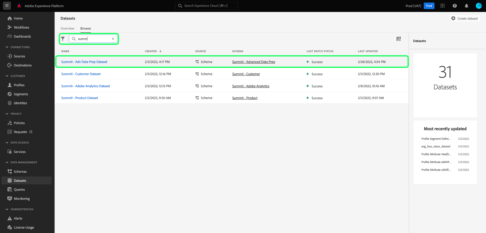
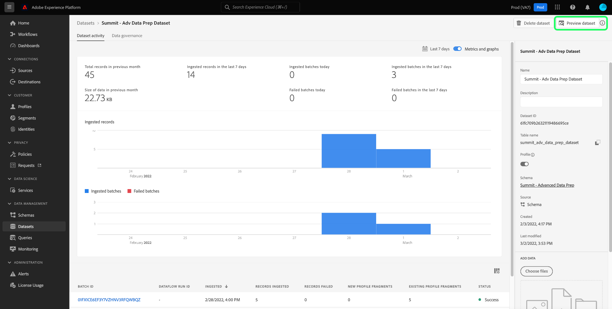
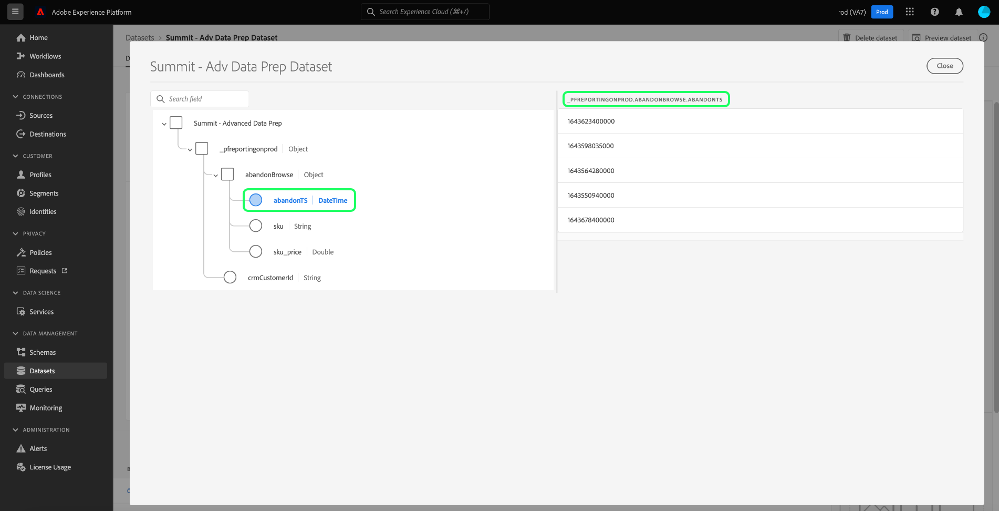
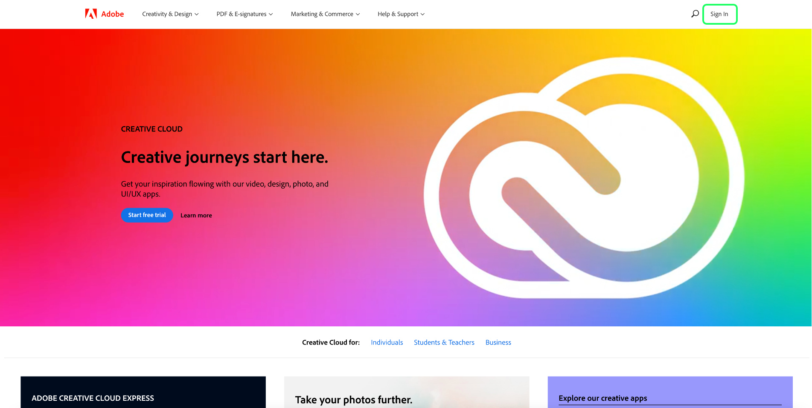
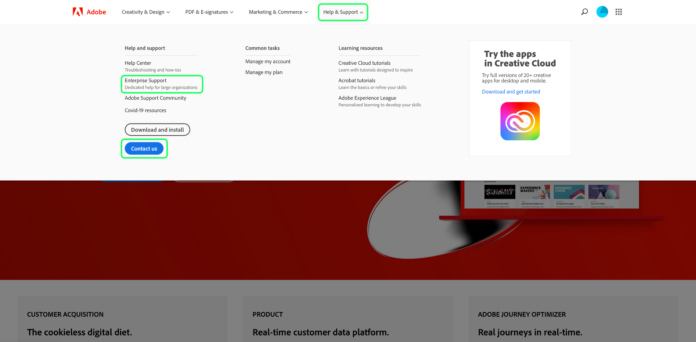

# Query ServiceとData Distillerに関するよくある質問

このドキュメントでは、Query ServiceとData Distillerに関するよくある質問に回答します。 また、「クエリ」製品を使用してデータ検証を行ったり、変換されたデータをデータレイクに書き込んだりする際によく見られるエラーコードも含まれます。 その他のAdobe Experience Platform サービスに関する質問とトラブルシューティングについては、[Experience Platform トラブルシューティングガイド ](../landing/troubleshooting.md)を参照してください。

ここでは、Adobe Experience PlatformにおけるQuery ServiceとData Distillerの連携を明らかにするために、次の基本的な質問を解説します。

## Query ServiceとData Distillerの関係は何ですか？

Query ServiceとData Distillerは、特定のデータクエリ機能を提供する、独自の補完的なコンポーネントです。 Query Serviceは、データレイクを変更することなく、取り込まれたデータを検索、検証、テストするための高度なクエリ向けに設計されています。 一方、Data Distillerは、データを変換して補完するバッチクエリに重点を置き、結果をデータレイクに保存して後で使用できるようにします。 Data Distillerのバッチクエリは、スケジュール、監視、管理が可能で、Query Serviceだけでは実現できない、より詳細なデータ処理と操作に対応します。

Query Serviceを組み合わせることで迅速なインサイトを獲得し、Data Distillerを利用して、詳細かつ永続的なデータ変換を実現できます。

## Query ServiceとData Distillerの違いは何ですか？

**クエリサービス**: データの探索、検証、実験に焦点を当てたSQL クエリに使用されます。 出力はデータレイクに保存されず、実行時間は10分に制限されています。 アドホッククエリは、軽量でインタラクティブなデータチェックと分析に適しています。

**データ Distiller**: データの処理、クリーニング、およびエンリッチを行うバッチクエリを有効にし、結果をデータレイクに保存します。 これらのクエリは、より長い実行（最大24時間）と、スケジューリング、モニタリング、高速化されたレポートなどの追加機能をサポートします。 Data Distillerは、詳細なデータ処理とスケジュール型のデータ処理タスクに対応します。

詳しくは、[ クエリサービスのパッケージングドキュメント ](./packaging.md)を参照してください。

## 質問カテゴリ {#categories}

よくある質問に対する次の回答のリストは、次のカテゴリに分類されています。

- [全般](#general)
- [Data Distiller](#data-distiller)
- [クエリ UI](#queries-ui)
- [データセットのサンプル](#dataset-samples)
- [データの書き出し](#exporting-data)
- [SQL構文](#sql-syntax) 
- [ITAS クエリ ](#itas-queries)
- [サードパーティツール](#third-party-tools)
- [PostgreSQL API エラー](#postgresql-api-errors)
- [REST API エラー](#rest-api-errors)

## クエリサービスに関する一般的な質問 {#general}

この節には、パフォーマンス、制限、プロセスに関する情報が含まれます。

### クエリサービスエディターでオートコンプリート機能をオフにできますか？

+++回答
いいえ。オートコンプリート機能のオフは、現在、エディターでサポートされていません。
+++

### クエリを入力すると、クエリエディターの速度が遅くなることがあるのはなぜですか？

+++回答
考えられる原因のひとつは、オートコンプリート機能です。 この機能は、特定のメタデータコマンドを処理するので、クエリの編集中にエディターの速度が遅くなることがあります。
+++

### Query Service API に [!DNL Postman] を使用できますか？

+++回答
はい、[!DNL Postman] （無料のサードパーティ製アプリケーション）を使用して、すべてのAdobe API サービスを視覚化し、操作できます。 Adobe Developer Console でプロジェクトを設定し、[!DNL Postman] で使用するために必要な資格情報をすべて取得する手順については、[[!DNL Postman] 設定ガイド](https://video.tv.adobe.com/v/28832)をご覧ください。[ [!DNL Postman]  コレクションの開始、実行、共有に関するガイダンス](https://learning.postman.com/docs/running-collections/intro-to-collection-runs/)の公式ドキュメントを参照してください。
+++

### UI を使用してクエリから返される行の最大数に制限はありますか？

+++回答
はい。明示的な制限が外部で指定されていない限り、クエリサービスは内部的に50,000行の制限を適用します。 詳しくは、[インタラクティブクエリの実行](./best-practices/writing-queries.md#interactive-query-execution)に関するガイダンスを参照してください。
+++

### クエリを使用して行を更新できますか？

+++回答
バッチクエリでは、データセット内の行の更新はサポートされていません。
+++

### クエリの結果の出力にデータサイズの制限はありますか？

+++回答
いいえ。データサイズに制限はありませんが、インタラクティブセッションからのクエリタイムアウトは 10 分間に制限されています。クエリがバッチ CTAS として実行される場合、10 分間のタイムアウトは適用されません。詳しくは、[インタラクティブクエリの実行](./best-practices/writing-queries.md#interactive-query-execution)に関するガイダンスを参照してください。
+++

### クエリが 10 分でタイムアウトしないようにするにはどうすればよいですか？

+++回答
クエリがタイムアウトする場合は、次の解決策のうち1つ以上をお勧めします。

- [クエリを CTAS クエリに変換](./sql/syntax.md#create-table-as-select)し、実行をスケジュールします。実行のスケジュールは、[UI](./ui/user-guide.md#scheduled-queries) または [API](./api/scheduled-queries.md#create) を使用して設定できます。
- 追加の[フィルター条件](https://spark.apache.org/docs/latest/api/sql/index.html#filter)を適用して、より小さいデータチャンクに対してクエリを実行します。
- [EXPLAIN コマンドを実行](./sql/syntax.md#explain)して、詳細を収集します。
- データセット内のデータの統計を確認します。
- クエリを簡略化された形式に変換し、[準備済み文](./sql/prepared-statements.md)を使用して再実行します。
+++

### 複数のクエリを同時に実行した場合、クエリサービスのパフォーマンスに問題や影響はありますか？

+++回答
いいえ。クエリサービスには、自動スケーリング機能があり、同時クエリがサービスのパフォーマンスに大きな影響を与えないようにします。
+++

### 予約済みのキーワードを列名として使用できますか？

+++回答
列名として使用できない特定の予約済みキーワード（`ORDER`、`GROUP BY`、`WHERE`、`DISTINCT`など）があります。 これらのキーワードを使用する場合は、これらの列をエスケープする必要があります。
+++

### 階層データセットから列名を見つけるにはどうすればよいですか？

+++回答
次の手順では、統合フォームのすべてのネストされたフィールドと列を含む、UIを通じてデータセットの表形式ビューを表示する方法について説明します。

- Experience Platformにログインした後、UIの左側のナビゲーションで「**[!UICONTROL Datasets]**」を選択して、[!UICONTROL Datasets] ダッシュボードに移動します。
- データセット [!UICONTROL Browse] タブが開きます。 検索バーを使用して、使用可能なオプションを絞り込むことができます。表示されたリストからデータセットを選択します。



- [!UICONTROL Datasets activity]画面が表示されます。 **[!UICONTROL Preview dataset]**&#x200B;を選択すると、XDM スキーマのダイアログと、選択したデータセットの統合データの表形式表示が開きます。 詳しくは、[データセットのプレビューに関するドキュメント](../catalog/datasets/user-guide.md#preview-a-dataset)を参照してください



- スキーマから任意のフィールドを選択して、フラット化された列にその内容を表示します。列の名前は、ページの右側の内容の上に表示されます。この名前をコピーして、このデータセットのクエリに使用する必要があります。



クエリエディターまたはサードパーティのクライアントを使用して、[ネストされたデータ構造を操作する方法](./key-concepts/nested-data-structures.md)の完全なガイダンスについては、ドキュメントを参照してください。
+++

### 配列を含むデータセットに対するクエリを高速化するにはどうすればよいですか？

+++回答
配列を含むデータセットに対するクエリのパフォーマンスを向上させるには、実行時に[配列](https://spark.apache.org/docs/latest/api/sql/index.html#explode)を[CTAS クエリ ](./sql/syntax.md#create-table-as-select)として展開し、その処理時間を改善する機会をさらに探る必要があります。
+++

### CTAS クエリが、少数の行に対して何時間も処理されたままになっているのはなぜですか？

+++回答
非常に小さなデータセットでクエリに時間がかかった場合は、カスタマーサポートにお問い合わせください。

処理中にクエリが停止する理由はいくつか考えられます。正確な原因を特定するには、ケースバイケースで詳細な分析が必要です。この処理を行うには、[アドビのカスタマーサポートにお問い合わせください](#customer-support)。
+++

### アドビのカスタマーサポートに問い合わせるにはどうすればよいですか？ {#customer-support}

+++回答
[Adobe カスタマーサポートの電話番号](https://helpx.adobe.com/jp/contact/phone.html)の一覧は、Adobe ヘルプページでご覧いただけます。 または、次の手順を実行してオンラインでヘルプを見つけることもできます。

- Web ブラウザーで [https://www.adobe.com/](https://www.adobe.com/) に移動します。
- 上部のナビゲーションバーの右側で、**[!UICONTROL Sign In]**&#x200B;を選択します。



- Adobe ライセンスに登録されている Adobe ID とパスワードを使用します。
- 上部のナビゲーションバーから&#x200B;**[!UICONTROL Help & Support]**&#x200B;を選択します。



[!UICONTROL Help and support] セクションを含むドロップダウンバナーが表示されます。 **[!UICONTROL Contact us]**&#x200B;を選択してAdobe カスタマーケア バーチャル アシスタントを開くか、大規模組織向けの専用ヘルプの場合は&#x200B;**[!UICONTROL Enterprise support]**&#x200B;を選択します。
+++

### 前のジョブが正常に完了しない場合に後続のジョブを実行せずに、一連のジョブを順次実装するにはどうすればよいですか？

+++回答
匿名ブロック機能を使用すると、順に実行される 1 つ以上の SQL 文を連結できます。また、例外処理のオプションも使用できます。

詳しくは、[匿名ブロックのドキュメント](./key-concepts/anonymous-block.md)を参照してください。
+++

### クエリサービスでカスタム属性を実装するにはどうすればよいですか？

+++回答
カスタムアトリビューションを導入するには、次のふたつの方法があります。

1. 既存の [Adobe 定義関数](./sql/adobe-defined-functions.md)の組み合わせを使用して、使用例のニーズが満たされているかどうかを特定します。
1. 前の提案が使用例を満たさない場合は、[ウィンドウ関数](./sql/adobe-defined-functions.md#window-functions)を組み合わせて使用する必要があります。ウィンドウ関数は、シーケンス内のすべてのイベントを調べます。また、履歴データを確認でき、任意の組み合わせで使用することもできます。
+++

### 簡単に再利用できるようにクエリをテンプレート化できますか？

+++回答
はい、準備されたステートメントを使用してクエリをテンプレート化できます。 準備済みステートメントは、パフォーマンスを最適化でき、クエリの再解析の繰り返しを回避できます。詳しくは、[準備済みステートメントのドキュメント](./sql/prepared-statements.md)を参照してください。
+++

### クエリのエラーログを取得するにはどうすればよいですか？ {#error-logs}

+++回答
特定のクエリのエラーログを取得するには、まずQuery Service APIを使用してクエリログの詳細を取得する必要があります。 HTTP 応答には、クエリエラーの調査に必要なクエリ ID が含まれています。

複数のクエリを取得するには、GET コマンドを使用します。API を呼び出す方法については、[サンプル API 呼び出しのドキュメント](./api/queries.md#sample-api-calls)を参照してください。

応答から、調査するクエリを特定し、その `id` 値を使用して別の GET リクエストを行います。詳細な手順については、[ID によるクエリの取得に関するドキュメント](./api/queries.md#retrieve-a-query-by-id)を参照してください。

リクエストが成功した場合は、HTTP ステータス 200 が返され、応答に `errors` 配列が含まれています。ここでは、簡潔にするために、応答は短縮されています。

```json
{
    "isInsertInto": false,
    "request": {
                "dbName": "prod:all",
                "sql": "SELECT *\nFROM\n  accounts\nLIMIT 10\n"
            },
    "clientId": "8c2455819a624534bb665c43c3759877",
    "state": "SUCCESS",
    "rowCount": 0,
    "errors": [{
      'code': '58000', 
      'message': 'Batch query execution gets : [failed reason ErrorCode: 58000 Batch query execution gets : [Analysis error encountered. Reason: [sessionId: f055dc73-1fbd-4c9c-8645-efa609da0a7b Function [varchar] not defined.]]]', 
      'errorType': 'USER_ERROR'
      }],
    "isCTAS": false,
    "version": 1,
    "id": "343388b0-e0dd-4227-a75b-7fc945ef408a",
}
```

[クエリサービス API リファレンスドキュメント](https://www.adobe.io/experience-platform-apis/references/query-service/)では、使用可能なすべてのエンドポイントについて詳しく説明しています。
+++

### 「スキーマの検証エラー」とはどういう意味ですか？

+++回答
「スキーマの検証エラー」メッセージは、システムがスキーマ内のフィールドを見つけることができないことを意味します。 [クエリサービスでのデータアセットの整理](./best-practices/organize-data-assets.md)のベストプラクティスドキュメントを参照した後、[Create Table As Select クエリのドキュメント](./sql/syntax.md#create-table-as-select)を参照してください。

次の例は、CTAS 構文と struct データ型の使用方法を示しています。

```sql
CREATE TABLE table_name WITH (SCHEMA='schema_name')

AS SELECT '1' as _id,

 STRUCT

  ('2021-02-17T15:39:29.0Z' AS taskActualCompletionDate,

    '2020-09-09T21:21:16.0Z' AS taskActualStartDate,

    'Consulting' AS taskdescription,

    '5f6527c10011e09b89666c52d9a8c564' AS taskguide,

    'Stakeholder Consulting Engagement' AS taskname, 

    '2020-09-09T15:00:00.0Z' AS taskPlannedStartDate,

    '2021-02-15T11:00:00.0Z' AS taskPlannedCompletionDate

  ) AS _workfront ;
```

+++

### システムに毎日入力される新しいデータを迅速に処理するにはどうすればよいですか？

+++回答
[`SNAPSHOT`](./sql/syntax.md#snapshot-clause)句を使用すると、スナップショット IDに基づいてテーブル上のデータを増分読み取ることができます。 これは、最後の読み込み実行以降に作成または変更されたデータセット内の情報のみを処理する[増分読み込み](./key-concepts/incremental-load.md)デザインパターンで使用するのに最適です。その結果、処理効率が向上し、ストリーミングデータ処理とバッチデータ処理の両方で使用できます。
+++

### プロファイル UI に表示される数値とプロファイル書き出しデータセットから計算される数値に違いがあるのはなぜですか？

+++回答
プロファイルダッシュボードに表示される数値は、前回のスナップショットの時点で正確です。 プロファイル書き出しテーブルで生成される数値は、書き出しクエリに完全に依存します。その結果、特定のオーディエンスに適格なプロファイルの数をクエリしていることが、この不一致の一般的な原因となっています。

>[!NOTE]
>
>クエリには履歴データが含まれるのに対して、UI には現在のプロファイルデータのみが表示されます。

+++

### クエリで空のサブセットが返されたのはなぜですか？ どうすればよいですか？

+++回答
最も可能性が高い原因は、クエリの範囲が狭すぎることです。 データが表示されるようになるまで、`WHERE` 句のセクションを系統的に削除してください。

次のような小さなクエリを使用して、データセットにデータが含まれていることを確認することもできます。

```sql
SELECT count(1) FROM myTableName
```

+++

### データをサンプリングできますか？

+++回答
この機能は現在編集中です。 詳細は、[ リリースノート ](../release-notes/latest/latest.md)および機能のリリース準備が整ったら、Experience Platform UI ダイアログで確認できます。
+++

### クエリサービスでサポートされているヘルパー関数は何ですか？

+++回答
クエリサービスには、SQL機能を拡張するためのSQL ヘルパー関数がいくつか組み込まれています。 [クエリサービスでサポートされている SQL 関数](./sql/spark-sql-functions.md)の完全なリストについては、ドキュメントを参照してください。
+++

### ネイティブの [!DNL Spark SQL] 関数はすべてサポートされていますか？ それとも、アドビが提供するラッパー [!DNL Spark SQL] 関数のみに制限されていますか？

+++回答
まだ、すべてのオープンソース [!DNL Spark SQL]関数がデータレイクデータでテストされているわけではありません。 テストして確認すると、サポート対象のリストに追加されます。特定の関数を確認するには、[サポート対象の [!DNL Spark SQL] 関数のリスト](./sql/spark-sql-functions.md)を参照してください。
+++

### ユーザーは、他のクエリで使用できる独自のユーザー定義関数（UDF）を定義できますか？

+++回答
データセキュリティの考慮事項により、UDFのカスタム定義は許可されていません。
+++

### スケジュール済みクエリが失敗した場合はどうすればよいですか？

+++回答
まず、ログを確認して、エラーの詳細を確認します。 [ログ内のエラーの検索](#error-logs)に関する FAQ の節では、これを行う方法について詳しく説明しています。

また、[UI でのスケジュール済みクエリの実行](./ui/user-guide.md#scheduled-queries)と [API](./api/scheduled-queries.md) を使用したスケジュール済みクエリの実行の方法については、ドキュメントを参照してください。

[!DNL Query Editor]を使用する場合、既に作成および保存されているクエリにのみスケジュールを追加できます。 これは、[!DNL Query Service] API には適用されません。
+++

### 「セッション制限に達しました」エラーはどういう意味ですか？

+++回答
「セッションの制限に達しました」とは、組織に許可されているクエリサービスセッションの最大数に達したことを意味します。 組織の Adobe Experience Platform 管理者に連絡してください。
+++

### クエリログでは、削除されたデータセットに関連するクエリをどのように処理しますか？

+++回答
クエリサービスは、クエリ履歴を削除しません。 つまり、削除されたデータセットを参照するクエリが結果として、「有効なデータセットがありません」を返します。
+++

### クエリのメタデータのみを取得するにはどうすればよいですか？

+++回答
0行を返すクエリを実行して、応答のメタデータのみを取得できます。 この例のクエリは、指定したテーブルのメタデータのみを返します。

```sql
SELECT * FROM <table> WHERE 1=0
```

+++

### CTAS（Create Table As Select）クエリをマテリアライズせずに、すばやく繰り返し実行する方法を教えてください。

+++回答
一時的なテーブルを作成して、クエリを迅速に繰り返し検証してから、クエリをマテリアライズして使用することができます。 また、一時テーブルを使用して、クエリが機能しているかどうかを検証することもできます。

例えば、新しいテーブルを作成できます。

```sql
CREATE temp TABLE temp_dataset AS
SELECT *
FROM actual_dataset
WHERE 1 = 0;
```

次に、一時テーブルを次のように使用できます。

```sql
INSERT INTO temp_dataset
SELECT a._company AS _company,
a._id AS _id,
a.timestamp AS timestamp
FROM actual_dataset a
WHERE timestamp >= TO_TIMESTAMP('2021-01-21 12:00:00')
AND timestamp < TO_TIMESTAMP('2021-01-21 13:00:00')
LIMIT 100;
```

+++

### タイムゾーンを UTC タイムスタンプに変更したり、UTC タイムスタンプから変更したりする方法を教えてください。

+++ 回答
Adobe Experience Platformは、UTC （協定世界時）タイムスタンプ形式でデータを保持します。 UTC 形式の例は `2021-12-22T19:52:05Z` です

クエリサービスは、指定されたタイムスタンプを UTC 形式に変換したり、UTC 形式から変換したりするためのビルトインの SQL 関数に対応しています。 `to_utc_timestamp()` メソッドと `from_utc_timestamp()` メソッドのどちらとも 2 つのパラメーター（タイムスタンプとタイムゾーン）を指定します。

| パラメーター | 説明 |
|-----------|---------------|
| タイムスタンプ | タイムスタンプは、UTC 形式または単純な `{year-month-day}` 形式で記述できます。時間を指定しない場合、指定した日の午前 0 時がデフォルト値になります。 |
| タイムゾーン | タイムゾーンは `{continent/city})` 形式で記述されます。[パブリックドメイン TZ データベース](https://data.iana.org/time-zones/tz-link.html#tzdb)にある、認識されているタイムゾーンコードのいずれかである必要があります。 |

+++

#### UTC タイムスタンプに変換

この `to_utc_timestamp()` メソッドは指定されたパラメーターを解釈し、UTC 形式の&#x200B;**ローカルタイムゾーンのタイムスタンプに**&#x200B;変換します。 例えば、韓国のソウルのタイムゾーンは、UTC／GMT +9 時間です。 日付のみのタイムスタンプを指定すると、メソッドではデフォルト値の午前 0 時が使用されます。 タイムスタンプとタイムゾーンは、UTC 形式（その地域の時刻からローカル地域の UTC タイムスタンプ）に変換されます。

```SQL
SELECT to_utc_timestamp('2021-08-31', 'Asia/Seoul');
```

クエリは、ユーザーのローカル時間のタイムスタンプを返します。 この場合、ソウルは 9 時間先なので、前日の午後 3 時になります。

```
2021-08-30 15:00:00
```

別の例として、指定されたタイムスタンプが `Asia/Seoul` タイムゾーンの `2021-07-14 12:40:00.0` である場合、返される UTC タイムスタンプは `2021-07-14 03:40:00.0` になります

クエリサービス UI で提供されるコンソール出力は、人間が読みやすい形式になっています。

```
8/30/2021, 3:00 PM
```

#### UTC タイムスタンプからの変換

この `from_utc_timestamp()` メソッドは、指定されたパラメーターを&#x200B;**ローカルタイムゾーンのタイムスタンプから**&#x200B;解釈し、目的の地域の同等のタイムスタンプを UTC 形式で提供します。 次の例では、ユーザーのローカルタイムゾーンの時間は2:40PMです。 変数として渡されるソウルのタイムゾーンは、ローカルタイムゾーンの 9 時間前です。

```SQL
SELECT from_utc_timestamp('2021-08-31 14:40:00.0', 'Asia/Seoul');
```

クエリは、パラメーターとして渡されたタイムゾーンのタイムスタンプを UTC 形式で返します。 結果は、クエリを実行したタイムゾーンより 9 時間早くなります。

```
8/31/2021, 11:40 PM
```

### 時系列データをフィルタリングするにはどうすればよいですか？

+++ 回答
時系列データを使用してクエリを実行する場合は、可能な限りタイムスタンプフィルターを使用して、より正確な分析を行う必要があります。

>[!NOTE]
>
> 日付文字列は `yyyy-mm-ddTHH24:MM:SS` の形式である&#x200B;**必要**&#x200B;があります。

タイムスタンプフィルターの使用例を以下に示します。

```sql
SELECT a._company  AS _company,
       a._id       AS _id,
       a.timestamp AS timestamp
FROM   dataset a
WHERE  timestamp >= To_timestamp('2021-01-21 12:00:00')
       AND timestamp < To_timestamp('2021-01-21 13:00:00')
```

+++

### `CAST` 演算子を正しく使用して SQL クエリのタイムスタンプを変換する方法を教えてください。

+++回答
`CAST`演算子を使用してタイムスタンプを変換する場合は、日付&#x200B;**と**&#x200B;の両方を含める必要があります。

例えば、以下に示すように、時間コンポーネントが見つからない場合、次のエラーが発生します。

```sql
SELECT * FROM ABC
WHERE timestamp = CAST('07-29-2021' AS timestamp)
```

`CAST` 演算子の正しい使用法を以下に示します。

```sql
SELECT * FROM ABC
WHERE timestamp = CAST('07-29-2021 00:00:00' AS timestamp)
```

+++

### ワイルドカード（* など）を使用してデータセットからすべての行を取得する必要がありますか？

+++回答
ワイルドカードを使用して行からすべてのデータを取得することはできません。クエリサービスは、従来の行ベースのストアシステムではなく&#x200B;**カラム型ストア**&#x200B;として扱う必要があります。
+++

### SQL クエリで `NOT IN` を使用する必要がありますか？

+++回答
`NOT IN`演算子は、多くの場合、別のテーブルまたはSQL ステートメントに見つからない行を取得するために使用されます。 この演算子を使用するとパフォーマンスが低下する可能性があるほか、比較対象の列に `NOT NULL` が指定されていたり、大量のレコードが存在したりする場合、予期せぬ結果が返されることがあります。

`NOT IN` を使用する代わりに、`NOT EXISTS` または `LEFT OUTER JOIN` の使用を推奨します。

例えば、次のテーブルを作成したとします。

```sql
CREATE TABLE T1 (ID INT)
CREATE TABLE T2 (ID INT)
INSERT INTO T1 VALUES (1)
INSERT INTO T1 VALUES (2)
INSERT INTO T1 VALUES (3)
INSERT INTO T2 VALUES (1)
INSERT INTO T2 VALUES (2)
```

`NOT EXISTS` 演算子を使用して次のクエリを実行すれば、`NOT IN` 演算子を使用せずに同じ機能を実行できます。

```sql
SELECT ID FROM T1
WHERE NOT EXISTS
(SELECT ID FROM T2 WHERE T1.ID = T2.ID)
```

あるいは、`LEFT OUTER JOIN` 演算子を使用して次のクエリを実行しても、`NOT IN` 演算子を使用せずに同じ機能を実行できます。

```sql
SELECT T1.ID FROM T1
LEFT OUTER JOIN T2 ON T1.ID = T2.ID
WHERE T2.ID IS NULL
```

+++

### UI に表示されているような、アンダースコアが名前に 2 つ入ったデータセットを CTAS クエリを使用して作成できますか？例：`test_table_001`。

+++回答
いいえ。これは、Query Serviceを含むすべてのAdobe サービスに適用される、Experience Platform全体の意図的な制限です。 スキーマ名とデータセット名にはアンダースコアを 2 つ入れることができますが、データセットのテーブル名には 1 つしか入れられません。
+++

### クエリは同時にいくつまで実行できますか？

+++回答
バッチクエリはバックエンドジョブとして実行されるため、クエリの同時実行数に制限はありません。 ただし、クエリのタイムアウト制限は 24 時間に設定されています。
+++

### クエリのアクティビティとステータスを確認できるアクティビティダッシュボードはありますか？

+++回答
クエリのアクティビティとステータスを確認するためのモニタリング機能とアラート機能があります。 詳しくは、[クエリサービス監査ログの統合](./data-governance/audit-log-guide.md)および[クエリログ](./ui/overview.md#log)に関するドキュメントを参照してください。
+++

### 更新をロールバックする方法はありますか？例えば、Experience Platformにデータを書き戻す際にエラーが発生した場合、または一部の計算で再設定が必要な場合、そのシナリオはどのように処理すればよいですか？

+++回答
現在、この方法でのロールバックや更新はサポートしていません。
+++

### Adobe Experience Platform でクエリを最適化するにはどうすればよいですか？

+++回答
データベースではないので、システムにはインデックスはありませんが、データストアに関連付けられた他の最適化があります。 次のオプションを使用して、クエリを調整できます。

- timeseries データの時系列でのフィルタリング。
- 構造体データタイプのプッシュダウンの最適化。
- 配列とマップのデータタイプのコスト面およびメモリ面におけるプッシュダウンの最適化。
- スナップショットを使用した増分処理。
- 一貫性のあるデータ形式。
+++

### ログイン権限をクエリサービスの特定の機能に制限できますか。それとも、このソリューションの権限は、「すべて許可かすべて禁止」の二択ですか。

+++回答
Query Serviceは「all or nothing」ソリューションです。 部分的なアクセス権限は提供できません。
+++

### クエリサービスで使用するデータを制限できますか。それとも、Adobe Experience Platform データレイク全体に単純にアクセスするだけですか。

+++回答
はい。読み取り専用アクセス権を持つデータセットにクエリを制限できます。
+++

### クエリサービスがアクセスできるデータを制限するための他のオプションはありますか？

+++回答
アクセス制限には3つのアプローチがあります。 次の 3 つです。

- SELECT ステートメントのみを使用し、データセットに読み取り専用アクセス権限を付与します。また、クエリ管理権限も割り当てます。
- SELECT／INSERT／CREATE ステートメントを使用して、データセットに書き込みアクセス権限を付与します。また、クエリ管理権限を割り当てます。
- 上に提示した方法で統合アカウントを使用するとともに、クエリ統合権限を割り当てます。

+++

### クエリサービスからデータが返された後、保護されたデータを返していないことを確認するために、Experience Platformで実行できるチェックはありますか？

- クエリサービスは、属性ベースのアクセス制御をサポートしています。データへのアクセスは、列／リーフレベルや構造体レベルで制限できます。属性ベースのアクセス制御について詳しくは、該当するドキュメントを参照してください。

### サードパーティのクライアントへの接続に SSL モードを指定できますか？例えば、Power BI で「verify-full」を指定して使用できますか？

+++回答
はい、SSL モードはサポートされています。 使用可能な SSL モードの分類とその保護レベルについて詳しくは、[SSL モードのドキュメント](./clients/ssl-modes.md)を参照してください。
+++

### 特定の接続での特定のデータセットや列へのアクセスを制御することはできますか？ この設定方法を教えてください。

+++回答
はい。設定されている場合、属性ベースのアクセス制御が適用されます。 詳しくは、[属性ベースのアクセス制御の概要](../access-control/abac/overview.md)を参照してください。
+++

### クエリサービスは「INSERT OVERWRITE INTO」コマンドをサポートしていますか？

+++回答
いいえ、クエリサービスは「INSERT OVERWRITE INTO」コマンドをサポートしていません。
+++

### Data Distiller Compute Hoursのライセンス使用状況ダッシュボードの使用状況データはどのくらいの頻度で更新されますか？

+++回答
Data Distiller コンピューター時間用のライセンス使用状況ダッシュボードは、1日4回、6時間ごとに更新されます。
+++

### Data DistillerにアクセスせずにCREATE VIEW コマンドを使用できますか？

+++回答
はい。Data Distillerにアクセスせずに`CREATE VIEW` コマンドを使用できます。 このコマンドは、データの論理ビューを提供しますが、データレイクには書き戻しません。
+++

### DbVisualizerで匿名ブロックを使用できますか？

+++回答
はい。ただし、DbVisualizerなどの特定のサードパーティクライアントでは、スクリプトの一部を単一のステートメントとして処理する必要があることを示すために、SQL ブロックの前後に個別の識別子が必要になる場合があります。 詳細については、[匿名ブロックのドキュメント ](./key-concepts/anonymous-block.md)または[DbVisualizerの公式ドキュメント ](https://confluence.dbvis.com/display/UG120/Executing+Complex+Statements#ExecutingComplexStatements-UsinganSQLDialect)を参照してください。
+++

## TLS、ポートアクセス、および暗号化 {#tls-port-questions}

### ポート 80で行われた接続は、引き続きHTTPSとTLS暗号化を使用しますか？

+++回答
はい。ポート 80の接続はTLS暗号化を使用して保護され、TLSの適用はサービスで必要です。 プレーン HTTP接続は受け付けられません。 特定の顧客ネットワークポリシーに対応するために、ポート 80のサポートが存在します。 組織がポート 80をブロックする場合は、代わりにポート 5432を使用してください。 どちらのポートもTLSを必要とし、同じセキュリティ対策を提供します。
+++

### Adobeのクエリサービスは、暗号化されていないHTTP （ポート 80）経由でデータを公開しますか？

+++回答
いいえ。ポート 80での接続にはTLSが必要であり、プレーンテキスト HTTP リクエストはサーバーサイドで拒否されます。 ポート 5432もサポートされており、TLSで暗号化されています。
+++

### Query ServiceとData Distillerにポート 80を使用することは、従来の構成ですか？

+++回答
いいえ。TLSが必須のポート 80は、特定のネットワーク要件を持つお客様向けに設計されたサポート対象の設定です。 レガシーモードでも安全でないモードでもありません。 環境でポート 80のアウトバウンド接続が制限されている場合は、代わりにポート 5432を使用します。両方のポートでTLSが適用されます。
+++

### Power BI クライアントからQuery Serviceへのすべての接続にTLS 1.2を使用しますか？

+++回答
はい。転送中のデータは常にHTTPSを使用して保護され、現在サポートされているバージョンはTLS 1.2です。Query ServiceへのすべてのPower BI接続には、暗号化された転送が必要です。
+++

### Data Distillerで使用する場合、ポート 80は暗号化されていませんか？

+++回答
いいえ。Data Distillerは、ポート 80でTLSを適用し、プレーンテキスト HTTP リクエストを拒否します。 ポート 5432もサポートされており、TLSで暗号化されています。
+++

### Query ServiceまたはData Distillerでポート 80を使用する場合、リスクまたは制限はありますか？

+++回答
はい。TLSはポート 80で適用され、暗号化されていない接続はサポートされていません。 ポリシーの制限により、ポート 80のアウトバウンドトラフィックをブロックする組織もあります。 これがネットワークに当てはまる場合は、代わりにポート 5432を使用してください。 どちらのポートも、すべての場合にTLSが必要なため、同じレベルのセキュリティを提供します。
+++

## Data Distiller {#data-distiller}

### Data Distillerのライセンス使用状況はどのように追跡され、この情報はどこで確認できますか？

+++回答  
バッチクエリの使用状況を追跡するために使用される主な指標は、計算時間です。 [ ライセンス使用状況ダッシュボード ](../dashboards/guides/license-usage.md)を通じて、この情報と現在の使用状況にアクセスできます。
+++

### 計算時間とは

+++回答  
計算時間とは、バッチクエリが実行されたときに、クエリサービスエンジンがデータを読み取り、処理し、データレイクに書き込むのに要する時間の指標です。
+++

### 計算時間はどのように測定されますか？

+++回答  
計算時間は、許可されたすべてのサンドボックスで累積的に測定されます。
+++

### 同じクエリを連続して実行する場合でも、計算時間の消費量にバリエーションが発生することがあるのはなぜですか？

+++回答  
クエリの計算時間は、複数の要因によって変動する可能性があります。 これには、処理されるデータボリューム、SQL クエリ内の変換操作の複雑さなどが含まれます。 クエリサービスは、クエリごとに上記のパラメーターに基づいてクラスターをスケーリングします。これにより、計算時間が異なる場合があります。
+++

### 同じデータを使用して同じクエリを長時間にわたって実行すると、計算時間が減少することに気づくことは通常ですか？ なぜこれが起こるのでしょうか？

+++回答  
バックエンドインフラストラクチャは、計算時間の使用率と処理時間を最適化するために常に改善されます。 その結果、パフォーマンスの強化が実装されると、時間の経過とともに変化が見られる場合があります。
+++

### Data Distillerのパフォーマンスは、開発用サンドボックスと実稼動用サンドボックスで異なりますか？

+++回答
開発用サンドボックスと実稼動用サンドボックスの両方でクエリを実行すると、同様のパフォーマンスが期待できます。 どちらの環境も、同じレベルの処理能力を提供するように設計されています。 ただし、処理するデータの量と、クエリの実行時のシステムアクティビティ全体に応じて、計算時間に違いが生じる可能性があります。

Experience Platform UIの[ ライセンス使用状況ダッシュボード ](../dashboards/guides/license-usage.md)で、コンピューティング時間の使用状況を追跡します。
+++

## クエリ UI

### クエリサービスに接続しようとすると、「クエリを作成」が「接続の初期化中…」のままになる。 どうすれば問題を解決できますか？

+++回答
「Create query」が「Initializing connection...」で停止している場合、これは接続またはセッションの問題である可能性があります。 Experience Platform UIを使用している場合は、ブラウザーを更新して、もう一度試してください。
+++

## データセットのサンプル

### システムデータセットでサンプルを作成できますか？

+++回答
いいえ。書き込み権限はシステムデータセットに対して制限されているため、サンプルを作成できません。
+++

## データの書き出し {#exporting-data}

この節では、データの書き出しと制限について説明します。

### クエリの処理後にクエリサービスからデータを抽出し、結果を CSV ファイルに保存する方法はありますか？ {#export-csv}

+++回答
はい。クエリサービスからデータを抽出でき、SQL コマンドを使用して結果を CSV 形式で保存するオプションもあります。

PSQL クライアントを使用する場合、クエリの結果を保存する方法は 2 つあります。 `COPY TO` コマンドを使用するか、次の形式を使用してステートメントを作成できます。

```sql
SELECT column1, column2 
FROM <table_name>  
\g <table_name>.out
```

[`COPY TO` コマンドの使用に関するガイダンス](./sql/syntax.md#copy)は、SQL 構文リファレンスドキュメントに記載されています。
+++

### CTAS クエリ（テラバイトなどの大量のデータが含まれると仮定して）で取り込まれた最終的なデータセットの内容を抽出することはできますか？

+++回答
いいえ。現在、取り込んだデータを抽出する機能はありません。
+++

### Analytics データコネクタがデータを返さない理由

+++回答
この問題の一般的な原因は、時間フィルターを使用せずに時系列データをクエリすることです。 例：

```sql
SELECT * FROM prod_table LIMIT 1;
```

次のように記述する必要があります。

```sql
SELECT * FROM prod_table
WHERE
timestamp >= to_timestamp('2022-07-22')
and timestamp < to_timestamp('2022-07-23');
```

+++

## SQL構文

### Merge INTOは、Data DistillerまたはQuery Serviceでサポートされていますか？

+++回答
MERGE INTO SQL構文は、Data DistillerまたはQuery Serviceではサポートされていません。
+++

## ITAS クエリ {#itas-queries}

### ITAS クエリとは何ですか？

+++回答
INSERT INTO クエリはITAS クエリと呼ばれます。 CREATE TABLE クエリはCTAS クエリと呼ばれることに注意してください。
+++

### クエリサービスは、操作の更新と削除をサポートしていますか？

+++回答
いいえ、Query Serviceでは更新操作や削除操作はサポートしていません。 ITASを使用した追加専用の操作のみがサポートされます。
+++

## サードパーティツール {#third-party-tools}

この節では、サードパーティのツール（PSQL や Power BI など）の使用に関する情報を示します。

### クエリサービスをサードパーティのツールに接続できますか？

+++回答
はい。複数のサードパーティ製デスクトップクライアントをQuery Serviceに接続できます。 [使用可能なクライアントと、それらをクエリサービスに接続する方法の詳細](./clients/overview.md)については、ドキュメントを参照してください。
+++

### クエリサービスを 1 回接続して、サードパーティのツールで継続的に使用する方法はありますか？

+++回答
はい。サードパーティのデスクトップクライアントは、有効期限のない資格情報を1回限りセットアップすることで、クエリサービスに接続できます。 許可されたユーザーが有効期限のない資格情報を生成し、ローカルマシンに自動的にダウンロードされる JSON ファイルで受信できます。 [有効期限のない資格情報の作成とダウンロード方法に関する完全なガイダンス](./ui/credentials.md#non-expiring-credentials)はドキュメントに記載されています。
+++

### 有効期限のない資格情報が機能しない理由

+++回答
有効期限のない資格情報の値は、構成JSON ファイルから取得された`technicalAccountID`と`credential`の連鎖引数です。 パスワードの値は `{{technicalAccountId}:{credential}}` 形式で指定します。
 [資格情報を使用して外部クライアントに接続](./ui/credentials.md#using-credentials-to-connect-to-external-clients)する方法について詳しくは、ドキュメントを参照してください。
+++

### 有効期限のない資格情報パスワードの特殊文字に制限はありますか？

+++回答
はい。有効期限のない資格情報にパスワードを設定する場合は、少なくとも1つの数字、1つの小文字、1つの大文字、1つの特殊文字を含める必要があります。 ドル記号（$）はサポートされていません。 代わりに、!、@、#、^、&amp;などの特殊文字を使用します。
+++

### クエリサービスエディターに接続できるサードパーティの SQL エディターの種類を教えてください。

+++回答
PSQLまたは[!DNL Postgres] クライアントに準拠しているサードパーティのSQL エディターは、クエリサービスエディターに接続できます。 使用可能な手順のリストについては、[クエリサービスへのクライアントの接続](./clients/overview.md)のドキュメントを参照してください。
+++

### Power BI ツールをクエリサービスに接続できますか？

+++回答
はい、Power BIをQuery Serviceに接続できます。 [Power BI デスクトップアプリをクエリサービスに接続する手順](./clients/power-bi.md)については、ドキュメントを参照してください。
+++

### クエリサービスに接続すると、ダッシュボードの読み込みに時間がかかるのはなぜですか？

+++回答
システムがクエリサービスに接続されている場合、インタラクティブまたはバッチ処理エンジンに接続されます。 その結果、処理されたデータを反映するための読み込み時間が長くなる可能性があります。

ダッシュボードの応答時間を改善する場合は、Business Intelligence（BI）サーバーを、クエリサービスと BI ツールの間のキャッシュレイヤーとして実装する必要があります。 通常、ほとんどの BI ツールには、サーバー用の追加のオファリングがあります。

キャッシュサーバーレイヤーを追加する目的は、クエリサービスからのデータをキャッシュし、それをダッシュボードで利用して応答を高速化することです。 実行されるクエリの結果が毎日 BI サーバーにキャッシュされるので、この処理が可能です。 次に、キャッシュサーバーは、同じクエリを使用するすべてのユーザーにこれらの結果を提供し、待ち時間を短縮します。 この設定の説明については、使用しているユーティリティまたはサードパーティツールのドキュメントを参照してください。
+++

### pgAdmin 接続ツールを使用してクエリサービスにアクセスできますか？

+++回答
いいえ、pgAdmin接続はサポートされていません。 [使用可能なサードパーティクライアントの一覧と、それらをクエリサービスに接続する方法](./clients/overview.md)については、ドキュメントを参照してください。 
+++

## PostgreSQL API エラー {#postgresql-api-errors}

次の表に、PSQL エラーコードと考えられる原因を示します。

| エラーコード | 接続状態 | 説明 | 考えられる原因 |
|------------|---------------------------|-------------|----------------|
| **08P01** | なし | メッセージの種類がサポートされていません。 | メッセージの種類がサポートされていません。 |
| **28P01** | 起動 - 認証 | パスワードが無効です。 | 認証トークンが無効です。 |
| **28000** | 起動 - 認証 | 認証タイプが無効です。 | 認証タイプが無効です。`AuthenticationCleartextPassword` である必要があります。 |
| **42P12** | 起動 - 認証 | テーブルが見つかりません。 | 使用するテーブルが見つかりません。 |
| **42601** | クエリ | 構文エラー。 | コマンドが無効であるか、構文にエラーがあります。 |
| **42P01** | クエリ | テーブルが見つかりません。 | クエリで指定されたテーブルが見つかりませんでした。 |
| **42P07** | クエリ | テーブルが存在します | 同じ名前のテーブルが既に存在します（CREATE TABLE） |
| **53400** | クエリ | LIMIT が最大値を超えています。 | ユーザーが LIMIT 句で 100,000 を超える行数を指定しました。 |
| **53400** | クエリ | ステートメントがタイムアウトになりました。 | 送信されたステートメントの処理時間が最大値の 10 分を超えました。 |
| **58000** | クエリ | システムエラー。 | 内部システム障害が発生しています。 |
| **0A000** | クエリ／コマンド | サポートなし | クエリ／コマンドの機能はサポートされていません |
| **42501** | DROP TABLE クエリ | クエリサービスで作成されていないテーブルの削除中 | 削除中のテーブルは、`CREATE TABLE` 文を使用してクエリサービスで作成されたものではありません |
| **42501** | DROP TABLE クエリ | 認証済みユーザーが作成していないテーブル | 削除中のテーブルは、現在ログインしているユーザーによって作成されたものではありません |
| **42P01** | DROP TABLE クエリ | テーブルが見つかりません。 | クエリで指定されたテーブルが見つかりませんでした |
| **42P12** | DROP TABLE クエリ | `dbName` のテーブルが見つかりません。`dbName` を確認してください | 現在のデータベースにテーブルが見つかりませんでした |

### テーブルで history_meta() メソッドを使用すると、58000 エラーコードが表示されたのはなぜですか？

+++回答
`history_meta()` メソッドは、データセットからスナップショットにアクセスするために使用されます。 以前は、Azure Data Lake Storage（ADLS）の空のデータセットに対してクエリを実行すると、データセットが存在しないことを示す 58000 エラーコードが表示されていました。 古いシステムエラーの例を以下に示します。

```shell
ErrorCode: 58000 Internal System Error [Invalid table your_table_name. historyMeta can be used on datalake tables only.]
```

クエリに戻り値がないために、このエラーが発生しました。 この動作が修正され、次のメッセージが返されるようになりました。

```text
Query complete in {timeframe}. 0 rows returned. 
```

+++

## REST API エラー {#rest-api-errors}

次の表に、HTTP エラーコードと考えられる原因を示します。

| HTTP ステータスコード | 説明 | 考えられる原因 |
|------------------|-----------------------|----------------------------|
| 400 | Bad request | クエリの形式が不正であるか、不正なクエリです。 |
| 401 | Authentication failed | 認証トークンが無効です。 |
| 500 | Internal server error | 内部システム障害が発生しています。 |
