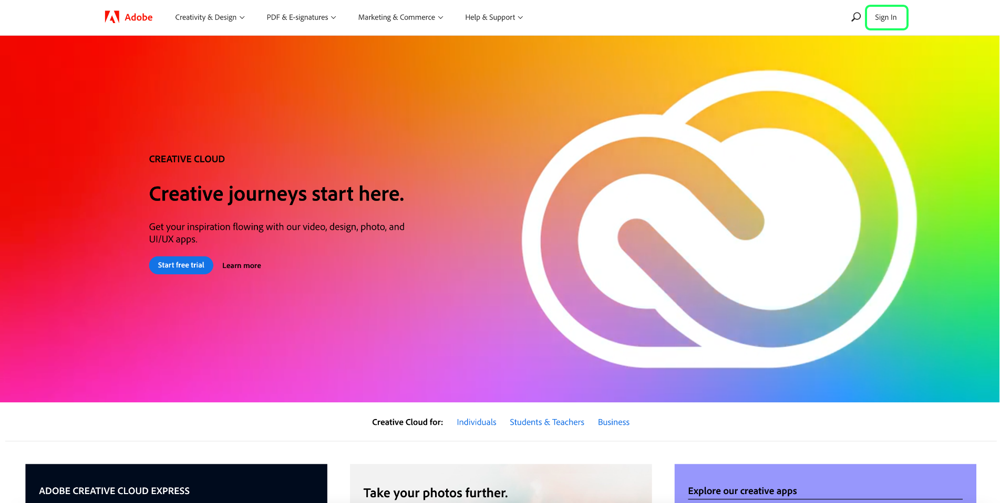

# [!DNL Query Service] トラブルシューティングガイド

このドキュメントでは、クエリサービスに関するよくある質問に対する回答を提供し、クエリサービスを使用する際によく見られるエラーコードのリストを示します。 Adobe Experience Platform の他のサービスに関する質問やトラブルシューティングについては、[Experience Platform のトラブルシューティングガイド](../landing/troubleshooting.md)を参照してください。

次のよくある質問に対する回答のリストは、次のカテゴリに分かれています。

- [全般](#general)
- [データのエクスポート](#exporting-data)
- [サードパーティツール](#third-party-tools)
- [PostgreSQL API エラー](#postgresql-api-errors)
- [REST API エラー](#rest-api-errors)

## クエリサービスに関する一般的な質問 {#general}

このセクションでは、パフォーマンス、制限、プロセスに関する情報を説明します。

### クエリサービスエディターでオートコンプリート機能をオフにできますか。

+++回答番号 オートコンプリート機能のオフは、現在、エディターでサポートされていません。
+++

### クエリを入力すると、クエリエディターの表示が遅くなることがあるのはなぜですか。

+++回答 1 つの潜在的な原因はオートコンプリート機能です。 この機能は、特定のメタデータコマンドを処理し、クエリの編集中にエディターの速度が低下する場合があります。
+++

### Postmanをクエリサービス API に使用できますか？

+++回答はい。Postman( 無料のサードパーティ製Adobe) を使用すれば、すべてのアプリケーション API サービスを視覚化し、操作できます。 次を監視： [Postmanセットアップガイド](https://video.tv.adobe.com/v/28832) Adobe Developer Console でプロジェクトを設定し、Postmanで使用するために必要な資格情報をすべて取得する手順を説明します。 以下の公式ドキュメントを参照してください。 [Postmanコレクションの開始、実行、共有に関するガイダンス](https://learning.postman.com/docs/running-collections/intro-to-collection-runs/).
+++

### UI を使用してクエリから返される最大行数に制限はありますか？

+++回答はい。クエリサービスは、明示的な制限が外部で指定されていない限り、内部的に 50,000 行の制限を適用します。 次のガイダンスを参照してください： [インタラクティブクエリの実行](./best-practices/writing-queries.md#interactive-query-execution) を参照してください。
+++

### クエリからの結果の出力にデータサイズの制限はありますか？

+++回答番号 データサイズに制限はありませんが、インタラクティブセッションから 10 分のクエリタイムアウトの制限があります。 クエリがバッチ CTAS として実行される場合、10 分のタイムアウトは適用されません。 次のガイダンスを参照してください： [インタラクティブクエリの実行](./best-practices/writing-queries.md#interactive-query-execution) を参照してください。
+++

### SELECT クエリの出力行数制限を回避する方法を教えてください。

+++回答出力行の制限を回避するには、クエリに「LIMIT 0」を適用します。 例：

```sql
SELECT * FROM customers LIMIT 0;
```

+++

### 10 分後にタイムアウトからクエリを停止する方法を教えてください。

+++回答クエリがタイムアウトした場合は、次の 1 つ以上のソリューションを使用することをお勧めします。

- [クエリを CTAS クエリに変換](./sql/syntax.md#create-table-as-select) 実行をスケジュールします。 実行のスケジュールは、次のいずれかを実行できます [UI を使用](./ui/user-guide.md#scheduled-queries) または [API](./api/scheduled-queries.md#create).
- 追加の [フィルター条件](https://spark.apache.org/docs/latest/api/sql/index.html#filter).
- [EXPLAIN コマンドを実行します。](./sql/syntax.md#explain) 詳細を収集するには
- データセット内のデータの統計を確認します。
- クエリを簡略化されたフォームに変換し、 [準備済み文書](./sql/prepared-statements.md).
+++

### 複数のクエリを同時に実行した場合、クエリサービスのパフォーマンスに問題や影響はありますか？

+++回答番号 クエリサービスには、同時クエリがサービスのパフォーマンスに目立った影響を与えないようにする自動スケーリング機能があります。
+++

### 階層データセットから列名を見つけるにはどうすればよいですか。

+++回答次の手順では、統合されたフォーム内のネストされたフィールドと列を含む、UI を使用したデータセットの表形式表示の表示方法について説明します。

- Experience Platform **[!UICONTROL データセット]** （ UI の左側のナビゲーションでに移動） [!UICONTROL データセット] ダッシュボード。
- データセット [!UICONTROL 参照] タブが開きます。 検索バーを使用して、使用可能なオプションを絞り込むことができます。 表示されたリストからデータセットを選択します。


- この [!UICONTROL データセットアクティビティ] 画面が表示されます。 選択 **[!UICONTROL データセットをプレビュー]** をクリックして、選択したデータセットから、XDM スキーマのダイアログと、フラット化されたデータの表形式表示を開きます。 詳しくは、 [データセットドキュメントのプレビュー](../catalog/datasets/user-guide.md#preview-a-dataset)


- スキーマから任意のフィールドを選択し、統合された列にその内容を表示します。 列の名前は、ページの右側のコンテンツの上に表示されます。 このデータセットのクエリに使用するには、この名前をコピーする必要があります。


以下に関する詳細なガイダンスについては、ドキュメントを参照してください。 [ネストされたデータ構造の操作方法](./best-practices/nested-data-structures.md) クエリエディターまたはサードパーティのクライアントを使用して、
+++

### 配列を含むデータセットに対するクエリを高速化するには、どうすればよいですか？

+++回答：配列を含むデータセットに対するクエリのパフォーマンスを向上させるには、次の操作を行う必要があります。 [配列を分解する](https://spark.apache.org/docs/latest/api/sql/index.html#explode) as a [CTAS クエリ](./sql/syntax.md#create-table-as-select) 実行時に表示され、処理時間を短縮するために、さらに詳しく調べます。
+++

### CTAS クエリが少数の行に対して何時間も経ってもまだ処理されるのはなぜですか？

+++回答クエリが非常に小さなデータセットで長い時間を要した場合は、カスタマーサポートにお問い合わせください。

処理中にクエリが停止する理由はいくつか考えられます。 正確な原因を突き止めるには、ケースバイケースで詳細な分析が必要です。 [連絡先Adobeカスタマーサポート](#customer-support) をこのプロセスに置き換えます。
+++

### カスタマーサポートに問い合わせる方法を教えてください。Adobeのカスタマーサポートへの問い合わせ方法 {#customer-support}

+++回答
[Adobeカスタマーサポートの電話番号の完全なリスト](https://helpx.adobe.com/ca/contact/phone.html) は、「Adobe」ヘルプページで利用できます。 または、次の手順でオンラインヘルプを参照することもできます。

- に移動します。 [https://www.adobe.com/](https://www.adobe.com/) を設定します。
- 上部ナビゲーションバーの右側で、「 **[!UICONTROL ログイン]**.



- ご使用のAdobeライセンスに登録されているAdobe IDとパスワードを使用してください。
- 選択 **[!UICONTROL ヘルプとサポート]** 上部ナビゲーションバーから。


ドロップダウンバナーが表示され、 [!UICONTROL ヘルプとサポート] 」セクションに入力します。 選択 **[!UICONTROL お問い合わせ]** をクリックして、Adobeの Customer Care Virtual Assistant を開くか、 **[!UICONTROL エンタープライズサポート]** 大規模組織向けの専用ヘルプ
+++

### 前のジョブが正常に完了しない場合、後続のジョブを実行せずに、連続した一連のジョブを実装する方法を教えてください。

+++回答匿名ブロック機能を使用すると、順に実行される 1 つ以上の SQL 文を連結できます。 また、例外処理のオプションも使用できます。

詳しくは、 [匿名ブロックドキュメント](./best-practices/anonymous-block.md) を参照してください。
+++

### クエリサービスにカスタムアトリビューションを実装する方法を教えてください。

+++回答カスタムアトリビューションを実装する方法は 2 つあります。

1. 既存の [Adobe定義関数](./sql/adobe-defined-functions.md) を使用して、使用例のニーズが満たされているかどうかを特定します。
1. 前の提案が使用例を満たさない場合は、 [窓関数](./sql/adobe-defined-functions.md#window-functions). 窓関数は、シーケンス内のすべてのイベントを調べます。 また、履歴データを確認し、任意の組み合わせで使用することもできます。
+++

### クエリを簡単に再利用できるようにテンプレート化できますか？

+++回答はい。準備済み文を使用して、クエリをテンプレート化できます。 準備済み文は、パフォーマンスを最適化し、クエリの再解析を繰り返しおこなうのを避けることができます。 詳しくは、 [準備済み文のドキュメント](./sql/prepared-statements.md) を参照してください。
+++

### クエリのエラーログを取得する方法を教えてください。 {#error-logs}

+++回答特定のクエリのエラーログを取得するには、まずクエリサービス API を使用してクエリログの詳細を取得する必要があります。 HTTP 応答には、クエリエラーの調査に必要なクエリ ID が含まれます。

複数のクエリを取得するには、GETコマンドを使用します。 API の呼び出し方法に関する情報については、 [API 呼び出しのサンプルドキュメント](./api/queries.md#sample-api-calls).

応答から、調査するクエリを識別し、そのクエリを使用して別のGETリクエストを作成します `id` の値です。 すべての手順については、 [ID ドキュメントによるクエリの取得](./api/queries.md#retrieve-a-query-by-id).

正常な応答は、HTTP ステータス 200 を返し、 `errors` 配列。 応答は短くなり、簡潔になりました。

```json
{
    "isInsertInto": false,
    "request": {
                "dbName": "prod:all",
                "sql": "SELECT *\nFROM\n  accounts\nLIMIT 10\n"
            },
    "clientId": "8c2455819a624534bb665c43c3759877",
    "state": "SUCCESS",
    "rowCount": 0,
    "errors": [{
      'code': '58000', 
      'message': 'Batch query execution gets : [failed reason ErrorCode: 58000 Batch query execution gets : [Analysis error encountered. Reason: [sessionId: f055dc73-1fbd-4c9c-8645-efa609da0a7b Function [varchar] not defined.]]]', 
      'errorType': 'USER_ERROR'
      }],
    "isCTAS": false,
    "version": 1,
    "id": "343388b0-e0dd-4227-a75b-7fc945ef408a",
}
```

この [クエリサービス API リファレンスドキュメント](https://www.adobe.io/experience-platform-apis/references/query-service/) では、使用可能なすべてのエンドポイントに関する詳細情報を提供します。
+++

### 「スキーマの検証エラー」とは何を意味しますか？

+++回答「スキーマの検証エラー」メッセージは、システムがスキーマ内のフィールドを見つけられないことを意味します。 のベストプラクティスドキュメントをお読みください。 [クエリサービスでのデータアセットの整理](./best-practices/organize-data-assets.md) 続いて [Create Table As Select ドキュメント](./sql/syntax.md#create-table-as-select).

次の例は、CTAS 構文と struct データ型の使用方法を示しています。

```sql
CREATE TABLE table_name WITH (SCHEMA='schema_name')

AS SELECT '1' as _id,

 STRUCT

  ('2021-02-17T15:39:29.0Z' AS taskActualCompletionDate,

    '2020-09-09T21:21:16.0Z' AS taskActualStartDate,

    'Consulting' AS taskdescription,

    '5f6527c10011e09b89666c52d9a8c564' AS taskguide,

    'Stakeholder Consulting Engagement' AS taskname, 

    '2020-09-09T15:00:00.0Z' AS taskPlannedStartDate,

    '2021-02-15T11:00:00.0Z' AS taskPlannedCompletionDate

  ) AS _workfront ;
```

+++

### 毎日システムに読み込まれる新しいデータをすばやく処理する方法を教えてください。

+++ [`SNAPSHOT`](./sql/syntax.md#snapshot-clause) 句は、スナップショット ID に基づいてテーブル上のデータを増分的に読み取るために使用できます。 これは、 [増分負荷](./best-practices/incremental-load.md) 前回の読み込みの実行以降に作成または変更されたデータセット内の情報のみを処理するデザインパターン。 その結果、処理効率が向上し、ストリーミングデータ処理とバッチデータ処理の両方で使用できます。
+++

### プロファイル UI に表示される数とプロファイル書き出しデータセットから計算される数に違いがあるのはなぜですか？

+++回答プロファイルダッシュボードに表示される数値は、最後のスナップショット時点での正確な数値です。 プロファイルエクスポートテーブルで生成される数値は、エクスポートクエリに完全に依存します。 その結果、特定のセグメントに適合するプロファイル数をクエリすることは、この不一致の一般的な原因になります。

>[!NOTE]
>
>クエリには履歴データが含まれますが、UI には現在のプロファイルデータのみが表示されます。

+++

### クエリが空のサブセットを返したのはなぜですか？また、どうすればよいですか？

+++回答最も可能性の高い原因は、クエリの範囲が狭すぎることです。 次のセクションを体系的に削除する必要があります。 `WHERE` 句を使用して、データの表示を開始します。

また、次のような小さなクエリを使用して、データセットにデータが含まれていることを確認できます。

```sql
SELECT count(1) FROM myTableName
```

+++

### データのサンプルを取得できますか？

+++回答この機能は現在作業中です。 詳細は、 [リリースノート](../release-notes/latest/latest.md) 機能のリリース準備が整ったら、Platform UI ダイアログを使用します。
+++

### クエリサービスでは、どのヘルパー関数がサポートされていますか？

+++回答クエリサービスには、SQL 機能を拡張する SQL ヘルパー関数がいくつか用意されています。 ドキュメントで [クエリサービスでサポートされる SQL 関数](./sql/spark-sql-functions.md).
+++

### すべてネイティブ [!DNL Spark SQL] サポートされる関数、またはユーザーがラッパーのみに制限される関数 [!DNL Spark SQL] Adobeが提供する機能

+++まだ返信（すべてのオープンソースではない） [!DNL Spark SQL] 関数は、データレイクのデータでテストされました。 テストが完了し、確認が完了すると、サポート対象のリストに追加されます。 詳しくは、 [サポート対象のリスト [!DNL Spark SQL] 関数](./sql/spark-sql-functions.md) 特定の関数を確認する場合。
+++

### ユーザは、他のクエリーで使用できる独自のユーザ定義関数 (UDF) を定義できますか？

+++回答データのセキュリティに関する考慮事項により、UDF のカスタム定義は使用できません。
+++

### スケジュール済みクエリが失敗した場合はどうすればよいですか？

+++回答まず、ログを調べてエラーの詳細を確認します。 に関する FAQ の節 [ログ内のエラーの検索](#error-logs) この方法の詳細については、を参照してください。

また、の実行方法に関するガイダンスについては、ドキュメントを参照してください [UI でのスケジュール済みクエリ](./ui/user-guide.md#scheduled-queries) そして [API](./api/scheduled-queries.md).

次に、 [!DNL Query Editor]. これらは、 [!DNL Query Service] API:<br/>既に作成、保存、実行されたクエリにのみスケジュールを追加できます。<br/>あなた **できません** パラメータ化クエリにスケジュールを追加します。<br/>スケジュールクエリ **できません** には、匿名ブロックが含まれています。<br/>スケジュールできるのは **1 つ** UI を使用したクエリテンプレート。 クエリテンプレートにスケジュールを追加する場合は、API を使用する必要があります。 API を使用してスケジュールが既に追加されている場合、UI を使用してスケジュールを追加することはできません。
+++

### 「セッション制限に達しました」エラーとは何ですか？

+++「セッション制限に達しました」とは、組織で許可されているクエリサービスセッションの最大数に達したことを意味します。 組織のAdobe Experience Platform管理者に接続してください。
+++

### クエリログでは、削除されたデータセットに関連するクエリをどのように処理しますか？

+++回答クエリサービスは、クエリ履歴を削除しません。 つまり、削除されたデータセットを参照するクエリの結果、「有効なデータセットがありません」が返されます。
+++

### クエリのメタデータのみを取得するにはどうすればよいですか？

+++回答ゼロ行を返すクエリを実行して、応答のメタデータのみを取得できます。 この例のクエリは、指定したテーブルのメタデータのみを返します。

```sql
SELECT * FROM <table> WHERE 1=0
```

+++

### CTAS(Create Table As Select) クエリをマテリアライズせずに、すばやく繰り返し実行する方法を教えてください。

+++回答一時テーブルを作成して、クエリを素早く繰り返し実験してから、使用するクエリを具体化できます。 また、一時テーブルを使用して、クエリが機能しているかどうかを検証することもできます。

例えば、一時テーブルを作成できます。

```sql
CREATE temp TABLE temp_dataset AS
SELECT *
FROM actual_dataset
WHERE 1 = 0;
```

次に、一時テーブルを次のように使用できます。

```sql
INSERT INTO temp_dataset
SELECT a._company AS _company,
a._id AS _id,
a.timestamp AS timestamp
FROM actual_dataset a
WHERE timestamp >= TO_TIMESTAMP('2021-01-21 12:00:00')
AND timestamp < TO_TIMESTAMP('2021-01-21 13:00:00')
LIMIT 100;
```

+++

### タイムゾーンを UTC タイムスタンプに変更したり、UTC タイムスタンプから変更したりするには、どうすればよいですか？

+++回答Adobe Experience Platformはデータを UTC（協定世界時）タイムスタンプ形式で保持します。 UTC 形式の例は次のとおりです。 `2021-12-22T19:52:05Z`

クエリサービスは、指定されたタイムスタンプを UTC 形式に変換したり、UTC 形式から変換したりするための組み込みの SQL 関数をサポートしています。 両方の `to_utc_timestamp()` そして `from_utc_timestamp()` メソッドには 2 つのパラメーターを指定します。タイムスタンプとタイムゾーン。

| パラメーター | 説明 |
|-----------|---------------|
| タイムスタンプ | タイムスタンプは、UTC 形式または単純形式で書き込むことができます `{year-month-day}` 形式 時間を指定しない場合、デフォルト値は指定した日の午前 0 時です。 |
| タイムゾーン | タイムゾーンは `{continent/city})` 形式 は、 [パブリックドメイン TZ データベース](https://data.iana.org/time-zones/tz-link.html#tzdb). |

#### UTC タイムスタンプに変換

この `to_utc_timestamp()` メソッドは指定されたパラメーターを解釈し、変換します **ローカルタイムゾーンのタイムスタンプに** （UTC 形式） 例えば、韓国のソウルのタイムゾーンは、UTC/GMT +9 時間です。 日付のみのタイムスタンプを指定すると、メソッドではデフォルト値の午前 0 時が使用されます。 タイムスタンプとタイムゾーンは、その地域の時刻から地域の UTC タイムスタンプに変換されます。

```SQL
SELECT to_utc_timestamp('2021-08-31', 'Asia/Seoul');
```

クエリは、ユーザーのローカル時間のタイムスタンプを返します。 この場合、ソウルは 9 時間先なので、前日の午後 3 時です。

```
2021-08-30 15:00:00
```

別の例として、指定されたタイムスタンプが `2021-07-14 12:40:00.0` の `Asia/Seoul` timezone。返される UTC タイムスタンプは次のようになります。 `2021-07-14 03:40:00.0`

クエリサービス UI で提供されるコンソール出力は、より人間が読み取り可能な形式です。

```
8/30/2021, 3:00 PM
```

#### UTC タイムスタンプからの変換

この `from_utc_timestamp()` メソッドは、指定されたパラメーターを解釈します **ローカルタイムゾーンのタイムスタンプから** およびは、目的の地域の同等のタイムスタンプを UTC 形式で提供します。 次の例では、時間はユーザーのローカルタイムゾーンの午後 2 時 40 分です。 変数として渡されるソウルタイムゾーンは、ローカルタイムゾーンの 9 時間前です。

```SQL
SELECT from_utc_timestamp('2021-08-31 14:40:00.0', 'Asia/Seoul');
```

クエリは、パラメーターとして渡されたタイムゾーンのタイムスタンプを UTC 形式で返します。 結果は、クエリを実行したタイムゾーンより 9 時間早くなります。

```
8/31/2021, 11:40 PM
```

### 時系列データはどのようにフィルタリングする必要がありますか。

+++回答時系列データに対するクエリを実行する場合は、可能な限りタイムスタンプフィルターを使用して、より正確な分析をおこなう必要があります。

>[!NOTE]
>
> 日付文字列 **必須** 形式である `yyyy-mm-ddTHH24:MM:SS`.

タイムスタンプフィルターの使用例を以下に示します。

```sql
SELECT a._company  AS _company,
       a._id       AS _id,
       a.timestamp AS timestamp
FROM   dataset a
WHERE  timestamp >= To_timestamp('2021-01-21 12:00:00')
       AND timestamp < To_timestamp('2021-01-21 13:00:00')
```

+++

### 正しく `CAST` 演算子を使用して、SQL クエリでタイムスタンプを変換しますか？

+++ `CAST` 演算子を使用してタイムスタンプを変換する場合は、日付 **および** 時間。

例えば、以下に示すように、時間コンポーネントが見つからない場合、次のエラーが発生します。

```sql
SELECT * FROM ABC
WHERE timestamp = CAST('07-29-2021' AS timestamp)
```

の正しい使用方法 `CAST` 演算子を次に示します。

```sql
SELECT * FROM ABC
WHERE timestamp = CAST('07-29-2021 00:00:00' AS timestamp)
```

+++

### ワイルドカード（*など）を使用してデータセットからすべての行を取得する必要がありますか？

+++回答ワイルドカードを使用して行からすべてのデータを取得することはできません。クエリサービスは **カラム式店舗** 従来の行ベースのストアシステムではなく、
+++

### 使用する場合 `NOT IN` を SQL クエリに含めますか？

+++ `NOT IN` 演算子は、他のテーブルや SQL 文に見つからない行を取得する場合によく使用されます。 この演算子は、パフォーマンスを低下させる可能性があり、比較している列が受け入れられる場合は、予期しない結果が返される可能性があります `NOT NULL`または大量のレコードが存在する場合。

を使用する代わりに、 `NOT IN`を使用する場合、 `NOT EXISTS` または `LEFT OUTER JOIN`.

例えば、次のテーブルが作成されているとします。

```sql
CREATE TABLE T1 (ID INT)
CREATE TABLE T2 (ID INT)
INSERT INTO T1 VALUES (1)
INSERT INTO T1 VALUES (2)
INSERT INTO T1 VALUES (3)
INSERT INTO T2 VALUES (1)
INSERT INTO T2 VALUES (2)
```

を使用している場合、 `NOT EXISTS` 演算子を使用する場合は、 `NOT IN` 演算子を使用するには、次のクエリを使用します。

```sql
SELECT ID FROM T1
WHERE NOT EXISTS
(SELECT ID FROM T2 WHERE T1.ID = T2.ID)
```

または、 `LEFT OUTER JOIN` 演算子を使用する場合は、 `NOT IN` 演算子を使用するには、次のクエリを使用します。

```sql
SELECT T1.ID FROM T1
LEFT OUTER JOIN T2 ON T1.ID = T2.ID
WHERE T2.ID IS NULL
```

+++

### UI に表示されるように、二重のアンダースコア名を持つ CTAS クエリを使用してデータセットを作成できますか？ 例：`test_table_001`。

+++回答いいえ。これは、クエリサービスを含むすべてのAdobe サービスに適用される、Experience Platform全体にわたる意図的な制限です。 スキーマ名とデータセット名にはアンダースコアを 2 つ付けることができますが、データセットのテーブル名には 1 つのアンダースコアのみを含めることができます。
+++

## データのエクスポート {#exporting-data}

この節では、データのエクスポートと制限について説明します。

### クエリの処理後にクエリサービスからデータを抽出し、結果を CSV ファイルに保存する方法はありますか。 {#export-csv}

+++答えはい。 データはクエリサービスから抽出でき、SQL コマンドを使用して結果を CSV 形式で保存するオプションもあります。

PSQL クライアントを使用する場合、クエリの結果を保存する方法は 2 つあります。 以下を使用して、 `COPY TO` コマンドを使用するか、次の形式を使用してステートメントを作成します。

```sql
SELECT column1, column2 
FROM <table_name>  
\g <table_name>.out
```

[使用に関するガイダンス `COPY TO` command](./sql/syntax.md#copy) は、 SQL 構文リファレンスドキュメントに記載されています。
+++

### CTAS クエリ（TB などの大量のデータが含まれると仮定して）で取り込まれた最終的なデータセットの内容を抽出することはできますか？

+++回答番号 現在、取り込んだデータを抽出する機能はありません。
+++

### Analytics Data Connector がデータを返さないのはなぜですか？

+++回答この問題の一般的な原因は、時間フィルターを使用せずに時系列データを問い合わせることです。 例：

```sql
SELECT * FROM prod_table LIMIT 1;
```

次のように記述します。

```sql
SELECT * FROM prod_table
WHERE
timestamp >= to_timestamp('2022-07-22')
and timestamp < to_timestamp('2022-07-23');
```

+++

## サードパーティツール {#third-party-tools}

この節では、PSQL やPower BIなどのサードパーティツールの使用に関する情報を示します。

### クエリサービスをサードパーティのツールに接続できますか？

+++回答はい。複数のサードパーティ製デスクトップクライアントをクエリサービスに接続できます。 詳しくは、 [使用可能なクライアントと、それらをクエリサービスに接続する方法の詳細](./clients/overview.md).
+++

### サードパーティのツールで継続的に使用するために、1 回だけクエリサービスに接続する方法はありますか？

+++回答はい。期限切れでない資格情報の 1 回限りのセットアップを通じて、サードパーティのデスクトップクライアントをクエリサービスに接続できます。 有効期限のない資格情報は、許可されたユーザーが生成し、ローカルマシンに自動的にダウンロードされる JSON ファイルで受け取ることができます。 完全 [有効期限のない資格情報の作成とダウンロード方法に関するガイダンス](./ui/credentials.md#non-expiring-credentials) はドキュメントに含まれています。
+++

### 期限切れでない資格情報が機能しないのはなぜですか？

+++回答期限のない資格情報の値は、 `technicalAccountID` そして `credential` 設定 JSON ファイルから取得します。 パスワードの値は次の形式で指定します。 `{{technicalAccountId}:{credential}}`.
方法の詳細については、ドキュメントを参照してください。 [資格情報を使用して外部クライアントに接続](./ui/credentials.md#using-credentials-to-connect-to-external-clients).
+++

### クエリサービスエディターに接続できるサードパーティの SQL エディターの種類を教えてください。

+++PSQL または [!DNL Postgres] クライアントに準拠している場合は、クエリサービスエディターに接続できます。 詳しくは、 [クエリサービスへのクライアントの接続](./clients/overview.md) を参照してください。
+++

### Power BIツールをクエリサービスに接続できますか？

+++回答はい、Power BIをクエリサービスに接続できます。 詳しくは、 [データデスクトップアプリケーションをPower BIサービスに接続する手順](./clients/power-bi.md).
+++

### ダッシュボードがクエリサービスに接続される際に読み込みに長い時間がかかるのはなぜですか？

+++回答クエリサービスに接続すると、システムはインタラクティブまたはバッチ処理エンジンに接続されます。 その結果、処理時間が長くなり、処理されたデータが反映される可能性があります。

ダッシュボードの応答時間を改善する場合は、Business Intelligence(BI) サーバーを、クエリサービスと BI ツールの間のキャッシュレイヤーとして実装する必要があります。 通常、ほとんどの BI ツールには、サーバーに対する追加のオファーがあります。

キャッシュサーバーレイヤーを追加する目的は、クエリサービスからのデータをキャッシュし、ダッシュボードで応答を高速化するためにそれを利用することです。 実行されるクエリの結果は、毎日 BI サーバーにキャッシュされるので、この処理が可能です。 次に、キャッシュサーバーは、同じクエリを持つすべてのユーザーに対してこれらの結果を提供し、待ち時間を短縮します。 この設定の明確化には、使用しているユーティリティまたはサードパーティツールのドキュメントを参照してください。
+++

### pgAdmin 接続ツールを使用してクエリサービスにアクセスできますか？

+++回答いいえ、pgAdmin 接続はサポートされていません。 A [使用可能なサードパーティクライアントの一覧と、それらをクエリサービスに接続する方法に関する手順](./clients/overview.md) はドキュメントに含まれています。
+++

## PostgreSQL API エラー {#postgresql-api-errors}

次の表に、PSQL エラーコードと考えられる原因を示します。

| エラーコード | 接続状態 | 説明 | 考えられる原因 |
|------------|---------------------------|-------------|----------------|
| **08P01** | N/A | メッセージの種類がサポートされていません。 | メッセージの種類がサポートされていません。 |
| **28P01** | 起動 — 認証 | パスワードが無効です。 | 認証トークンが無効です。 |
| **28000** | 起動 — 認証 | 認証タイプが無効です。 | 認証タイプが無効です。`AuthenticationCleartextPassword` である必要があります。 |
| **42P12** | 起動 — 認証 | テーブルが見つかりません。 | 使用するテーブルが見つかりません。 |
| **42601** | クエリ | 構文エラー。 | コマンドが無効であるか、構文にエラーがあります。 |
| **42P01** | クエリ | テーブルが見つかりません。 | クエリで指定されたテーブルが見つかりませんでした。 |
| **42P07** | クエリ | テーブルが存在します。 | 同じ名前のテーブルが既に存在します (CREATE TABLE) |
| **53400** | クエリ | LIMIT が最大値を超えています。 | ユーザーが LIMIT 句で 100,000 を超える行数を指定しました。 |
| **53400** | クエリ | ステートメントがタイムアウトになりました。 | 送信されたステートメントの処理時間が最大値の 10 分を超えました。 |
| **58000** | クエリ | システムエラー。 | 内部システム障害が発生しています。 |
| **0A000** | クエリ/コマンド | サポートなし | クエリ/コマンドの機能はサポートされていません |
| **42501** | DROP TABLE クエリ | クエリサービスで作成されていないテーブルを削除しています | 削除中のテーブルは、 `CREATE TABLE` 文 |
| **42501** | DROP TABLE クエリ | 認証済みユーザーがテーブルを作成していません | 削除中のテーブルは、現在ログインしているユーザーによって作成されませんでした |
| **42P01** | DROP TABLE クエリ | テーブルが見つかりません。 | クエリで指定されたテーブルが見つかりませんでした |
| **42P12** | DROP TABLE クエリ | 次のテーブルが見つかりません： `dbName`:確認してください `dbName` | 現在のデータベースにテーブルが見つかりませんでした |

### テーブルで history_meta() メソッドを使用する58000、エラーコードが表示されたのはなぜですか。

+++ `history_meta()` メソッドは、データセットからスナップショットにアクセスするために使用します。 以前は、Azure Data Lake Storage(ADLS) の空のデータセットに対してクエリを実行すると、データセットが存在しないことを示す58000エラーコードが表示されていました。 以下に、古いシステムエラーの例を示します。

```shell
ErrorCode: 58000 Internal System Error [Invalid table your_table_name. historyMeta can be used on datalake tables only.]
```

このエラーは、クエリに戻り値がないために発生しました。 この動作が修正され、次のメッセージが返されるようになりました。

```text
Query complete in {timeframe}. 0 rows returned. 
```

+++

## REST API エラー {#rest-api-errors}

次の表に、HTTP エラーコードと考えられる原因を示します。

| HTTP ステータスコード | 説明 | 考えられる原因 |
|------------------|-----------------------|----------------------------|
| 400 | 不正なリクエストです。 | クエリの形式が不正であるか、不正なクエリです。 |
| 401 | 認証に失敗しました。 | 認証トークンが無効です。 |
| 500 | 内部サーバーエラー。 | 内部システム障害が発生しています。 |
