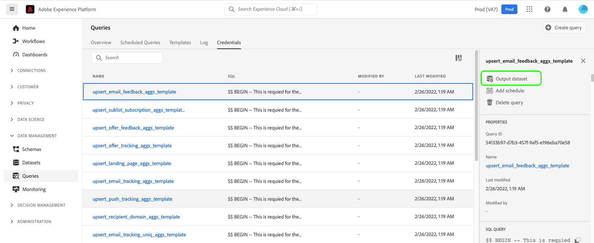

# クエリサービスの結果からデータセットを生成

真の力 [!DNL Query Service] は、クエリを使用して [!DNL Data Lake] より多くのクエリへの入力として、または次のような他のサービスで使用される [!DNL Data Science Workspace], [!DNL Real-time Customer Profile]または [!DNL Analysis Workspace].

[!DNL Query Service] では、UI からデータセットを作成できます。 次の手順に従います。

1. 接続されたクライアントを使用してクエリを記述し、出力を検証します。
2. にログインします。 [!DNL Platform] UI を開き、クエリに移動します。
3. リストでクエリを探し、その行にカーソルを合わせます。
4. 選択 **[!UICONTROL データセットを作成]**. 
5. LDAP ID の後にデータセット名を入力します（一意である必要も、SQL セーフである必要もありません。システムは、ここで指定した名前に基づいて「テーブル名」を生成します）。
6. データセットの説明を入力し、「 」を選択します。 **[!UICONTROL クエリを実行]**.
7. クエリの完了を確認し、データセットのリストページに移動して、作成したデータセットを確認します。

データセットを作成した後は、 [!DNL Data Lake] 様々な使用例に使用されます。

>[!NOTE]
>
>実際に実装する場合は、データセットの作成後にデータガバナンスラベルを適用する必要があります。

## 事前定義済みのデータセットを生成する [!DNL Experience Data Model] スキーマ

事前に定義された [!DNL Experience Data Model] (XDM) スキーマの場合は、SQL 構文を使用する必要があります。 使用する構文について詳しくは、[SQL 構文のガイド](../sql/syntax.md#create-table-as-select)を参照してください。

## データセットを出力する

この機能を使用して作成されるデータセットは、SQL 文で定義されているように、出力データの構造と一致するアドホックスキーマを使用して生成されます。一部のダウンストリームサービスには、特定の [!DNL Experience Data Model] (XDM) スキーマ。 ダウンストリームサービスのデータ形式設定要件を確認してから、クエリを記述してください。
