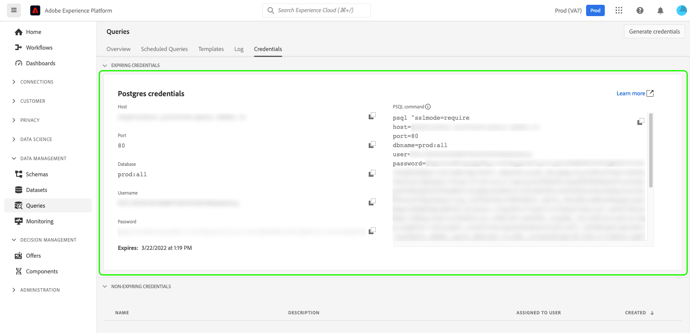

# 資格情報ガイド

Adobe Experience Platformクエリサービスを使用すると、外部クライアントと接続できます。 これらの外部クライアントに接続するには、資格情報の期限が切れるか、期限が切れない資格情報を使用します。

## 資格情報の期限が切れています

期限切れの資格情報を使用して、外部クライアントへの接続をすばやく設定できます。

**[!UICONTROL 資格情報の期限が切れる]**&#x200B;セクションには、次の情報が表示されます。

- **[!UICONTROL ホスト]**:接続先のホストの名前。クエリサービスに接続する場合、これには現在使用しているIMS組織の名前が含まれます。
- **[!UICONTROL ポート]**:接続先のホストのポート番号。
- **[!UICONTROL データベース]**:接続先のデータベースの名前。
- **[!UICONTROL ユーザー名]**:クエリサービスへの接続に使用するユーザー名。
- **[!UICONTROL パスワード]**:クエリサービスへの接続に使用するパスワード。
- **[!UICONTROL PSQLコマンド]**:コマンドラインでPSQLを使用してクエリサービスに接続するための関連情報をすべて自動的に挿入するコマンド。
- **[!UICONTROL 有効期限]**:期限が切れる資格情報の有効期限。資格情報は、生成されてから24時間で期限切れになります。

## 期限が切れない資格情報

期限切れでない資格情報を使用して、外部クライアントへのより永続的な接続を設定できます。

期限が切れない一連の資格情報を作成するには、「**[!UICONTROL 資格情報を生成]**」を選択します。

>[!NOTE]
>
>期限が切れない資格情報を作成する前に、**サンドボックス**&#x200B;と&#x200B;**クエリサービス統合の管理**&#x200B;の両方の権限が必要です。 これらの権限の割り当て方法については、[アクセス制御](../../access-control/home.md)のドキュメントを参照してください。

資格情報の生成モーダルが表示されます。 期限が切れない資格情報を作成するには、次の詳細を指定する必要があります。

- **[!UICONTROL 名前]**:生成する資格情報の名前。
- **[!UICONTROL 説明]**:（オプション）生成する資格情報の説明。
- **[!UICONTROL 割り当て先]**:資格情報を割り当てるユーザー。この値は、資格情報を作成するユーザーの電子メールアドレスにする必要があります。
- **[!UICONTROL パスワード]** （オプション）資格情報のオプションのパスワード。パスワードが設定されていない場合、Adobeは自動的にパスワードを生成します。

必要な詳細をすべて入力したら、「**[!UICONTROL 資格情報を生成]**」を選択して資格情報を生成します。

>[!IMPORTANT]
>
>「 **[!UICONTROL 資格情報を生成]** 」ボタンを選択すると、テクニカルアカウント名、テクニカルアカウントID、資格情報などの情報を含む設定ファイルが作成されます。 Adobeは生成された秘密鍵証明書を&#x200B;**記録しない**&#x200B;ので、**はダウンロードしたファイルを安全に保存し、秘密鍵証明書の記録を保存する必要があります。**
>
>さらに、資格情報が90日間使用されない場合は、資格情報は削除されます。

生成した資格情報を保存したら、「**[!UICONTROL 閉じる]**」を選択します。 期限が切れていないすべての資格情報のリストが表示されます。

期限が切れていない資格情報は、編集または削除できます。 期限が切れていない秘密鍵証明書を編集するには、鉛筆アイコン()を選択します。 期限が切れていない秘密鍵証明書を削除するには、削除アイコン()を選択します。

期限が切れていない秘密鍵証明書を編集する際に、モーダルが表示されます。 更新する次の詳細を指定できます。

- **[!UICONTROL 名前]**:生成する資格情報の名前。
- **[!UICONTROL 説明]**:（オプション）生成する資格情報の説明。
- **[!UICONTROL 割り当て先]**:資格情報を割り当てるユーザー。この値は、資格情報を作成するユーザーの電子メールアドレスにする必要があります。

必要な詳細をすべて入力したら、「**[!UICONTROL アカウントを更新]**」を選択して、資格情報の更新を完了します。

## 資格情報を使用した外部クライアントへの接続

期限が切れる資格情報または期限が切れない資格情報を使用して、Aqua Data Studio、Looker、Power BIなどの外部クライアントと接続できます。

これらの外部クライアントに接続する場合、通常は次の情報を含める必要があります。

- **サーバー/ホスト**:接続先のサーバ/ホストの名前。この値は`server.adobe.io`の形式をとり、期限が切れる資格情報セクション内の&#x200B;**[!UICONTROL Host]**&#x200B;の下に表示されます。
- **ポート**:接続先のサーバ/ホストのポート。この値は、資格情報の期限が切れるセクションの&#x200B;**[!UICONTROL Port]**&#x200B;の下にあります。 ポートの値の例は`80`です。
- **ユーザー名**:外部クライアントに接続するユーザーのユーザー名。これは`ID@AdobeOrg`の形式をとり、期限が切れる資格情報セクションの&#x200B;**[!UICONTROL Username]**&#x200B;の下にあります。
- **パスワード**:外部クライアントに接続するユーザーのパスワード。資格情報の期限が切れる前に使用している場合は、期限が切れる資格情報セクションの&#x200B;**[!UICONTROL Password]**&#x200B;の下に表示されます。 期限が切れない資格情報を使用している場合、この値は、次の形式のテクニカルアカウントIDと資格情報の両方で構成されます。`technicalAccountId:credential`.
- **データベース**:接続先のデータベース。この値は、資格情報の期限が切れるセクションの&#x200B;**[!UICONTROL Database]**&#x200B;にあります。 データベースの値の例は`prod:all`です。

## 次の手順

これで、期限切れの資格情報と期限切れでない資格情報の両方の動作を理解できたので、これらの資格情報を使用して外部クライアントに接続できます。 外部クライアントの詳細については、『[クライアントのクエリサービスへの接続ガイド](../clients/overview.md)』を参照してください。