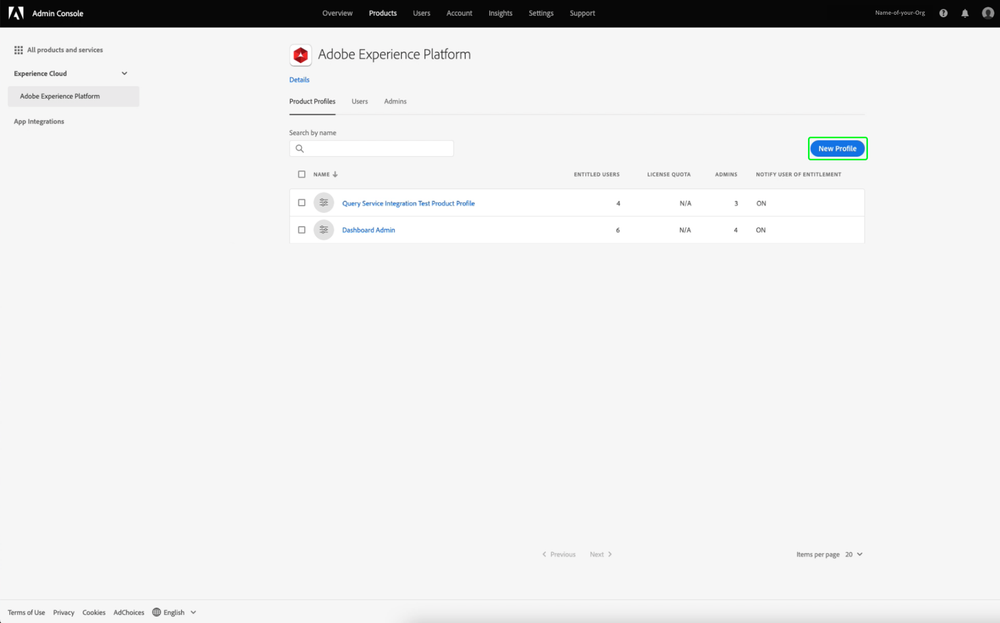

# 資格情報ガイド

Adobe Experience Platformクエリサービスを使用すると、外部クライアントと接続できます。 これらの外部クライアントに接続するには、資格情報の期限が切れるか、期限が切れない資格情報を使用します。

## 資格情報の期限が切れています

期限切れの資格情報を使用して、外部クライアントへの接続をすばやく設定できます。


**[!UICONTROL 資格情報の期限が切れる]**&#x200B;セクションには、次の情報が表示されます。

- **[!UICONTROL ホスト]**:接続先のホストの名前。クエリサービスに接続する場合、これには現在使用しているIMS組織の名前が含まれます。
- **[!UICONTROL ポート]**:接続先のホストのポート番号。
- **[!UICONTROL データベース]**:接続先のデータベースの名前。
- **[!UICONTROL ユーザー名]**:クエリサービスへの接続に使用するユーザー名。
- **[!UICONTROL パスワード]**:クエリサービスへの接続に使用するパスワード。
- **[!UICONTROL PSQLコマンド]**:コマンドラインでPSQLを使用してクエリサービスに接続するための関連情報をすべて自動的に挿入するコマンド。
- **[!UICONTROL 有効期限]**:期限が切れる資格情報の有効期限。資格情報は、生成されてから24時間で期限切れになります。

## 期限が切れない資格情報

期限切れでない資格情報を使用して、外部クライアントへのより永続的な接続を設定できます。

期限が切れない資格情報を作成する前に、Adobe Admin Consoleの組織の&#x200B;**サンドボックス**&#x200B;と&#x200B;**クエリサービス統合の管理**&#x200B;の権限の両方を設定する必要があります。

[Adobe Admin Console](https://adminconsole.adobe.com/)にログインし、上部のナビゲーションバーから関連する組織を選択します。

[!UICONTROL 概要]の「[!UICONTROL 製品とサービス]」セクションで、「**Adobe Experience Platform**」を選択します。


Adobe Experience Platformの詳細ページが表示されます。 次に、新しいプロファイルを作成します。 「[!UICONTROL **新規プロファイル**]」を選択します。



プロファイル作成ダイアログが表示されます。 新しいプロファイルのわかりやすい名前を入力し、「[!UICONTROL **保存**]」を選択します。 新しいプロファイルの[!UICONTROL 設定]ページが表示されます。 使用可能なオプションから「[!UICONTROL **権限**]」タブを選択します。

### クエリサービスの権限の有効化

お使いの組織に対して正しいクエリサービスの権限が有効になっていることを確認するには、リストから「[!UICONTROL **クエリサービス**]」カテゴリを探して選択します。


クエリサービスの[!UICONTROL 編集権限]ワークスペースが表示されます。 [!UICONTROL **クエリの管理**]&#x200B;にプラス(**+**)アイコンを選択し、[!UICONTROL **クエリサービス統合の管理**]&#x200B;を選択して、「[!UICONTROL 含まれる権限項目]」列に追加します。 次に、「[!UICONTROL **保存**]」を選択して変更を確定します。


設定/「権限」タブに戻ります。

### サンドボックス権限の有効化

組織に適したサンドボックスが選択されていることを確認するには、リストから「[!UICONTROL **サンドボックス**]」カテゴリを探して選択します。


サンドボックスワークスペースが表示されます。 [!UICONTROL 使用可能な権限項目]から、関連するサンドボックスを見つけます。この画像では、これは実稼動用サンドボックスです。 プラス(**+**)アイコンを選択し、「含まれる権限項目]」に追加します。 [!UICONTROL 次に、「[!UICONTROL **保存**]」を選択して変更を確定します。


設定/「権限」タブに戻ります。

期限が切れないアカウント機能へのユーザーアクセスを許可するには、さらに3つの手順が必要です。

- 新しく作成した権限を付与する新しいユーザーを追加します。 「[!UICONTROL **ユーザー**]」タブを選択し、「[!UICONTROL **ユーザーを追加**]」を選択します。

![[ユーザ]タブ[ユーザを追加]ボタンがハイライト表示されている](../images/ui/credentials/users-tab-new-user.png)

ユーザーの作成ダイアログが表示されます。 新しいユーザーの名前と電子メールを入力し、「[!UICONTROL **保存**]」を選択します。

- その後、ユーザーは管理者として追加され、任意のアクティブな製品プロファイルのアカウント作成を許可される必要があります。 新しく作成したユーザーを管理者として追加する場合。 「[!UICONTROL **管理者**]」タブを選択し、「[!UICONTROL **管理者を追加**]」を選択します。

![[管理]タブ[管理者を追加]ボタンが強調表示されている](../images/ui/credentials/admins-tab-add-admin.png)

管理者の追加ダイアログが表示されます。 新しい管理者の詳細をテキストフィールドに入力し、「[!UICONTROL **保存**]」を選択します。

- その後、統合を作成するには、そのユーザーを開発者として追加する必要があります。 「**開発者**」タブを選択し、「**開発者を追加**」を選択します。


開発者を追加ダイアログが表示されます。 テキストフィールドに新しい開発者の詳細を入力し、「**保存**」を選択します。

権限の割り当て方法の詳細については、[アクセス制御](../../access-control/home.md)のドキュメントを参照してください。

ユーザーが期限切れの資格情報機能を使用できるよう、必要なすべての権限がAdobe開発者コンソールで設定されました。

期限が切れない一連の資格情報を作成するには、「クエリ資格情報」ワークスペースで「**[!UICONTROL 資格情報を生成]**」を選択します。


資格情報の生成モーダルが表示されます。 期限が切れない資格情報を作成するには、次の詳細を指定する必要があります。

- **[!UICONTROL 名前]**:生成する資格情報の名前。
- **[!UICONTROL 説明]**:（オプション）生成する資格情報の説明。
- **[!UICONTROL 割り当て先]**:資格情報を割り当てるユーザー。この値は、資格情報を作成するユーザーの電子メールアドレスにする必要があります。
- **[!UICONTROL パスワード]** （オプション）資格情報のオプションのパスワード。パスワードが設定されていない場合、Adobeは自動的にパスワードを生成します。

必要な詳細をすべて入力したら、「**[!UICONTROL 資格情報を生成]**」を選択して資格情報を生成します。


>[!IMPORTANT]
>
>「 **[!UICONTROL 資格情報を生成]** 」ボタンを選択すると、設定JSONファイルがローカルマシンにダウンロードされます。 Adobeは生成された秘密鍵証明書を&#x200B;**記録しない**&#x200B;ので、**はダウンロードしたファイルを安全に保存し、秘密鍵証明書の記録を保存する必要があります。**
>
>さらに、資格情報が90日間使用されない場合は、資格情報は削除されます。

設定JSONファイルには、テクニカルアカウント名、テクニカルアカウントID、資格情報などの情報が含まれます。 次の形式で指定します。

```json
{"technicalAccountName":"9F0A21EE-B8F3-4165-9871-846D3C8BC49E@TECHACCT.ADOBE.COM","credential":"3d184fa9e0b94f33a7781905c05203ee","technicalAccountId":"4F2611B8613AA3670A495E55"}
```

生成した資格情報を保存したら、「**[!UICONTROL 閉じる]**」を選択します。 期限が切れていないすべての資格情報のリストが表示されます。


期限が切れていない資格情報は、編集または削除できます。 期限が切れていない秘密鍵証明書を編集するには、鉛筆アイコン()を選択します。 期限が切れていない秘密鍵証明書を削除するには、削除アイコン()を選択します。

期限が切れていない秘密鍵証明書を編集する際に、モーダルが表示されます。 更新する次の詳細を指定できます。

- **[!UICONTROL 名前]**:生成する資格情報の名前。
- **[!UICONTROL 説明]**:（オプション）生成する資格情報の説明。
- **[!UICONTROL 割り当て先]**:資格情報を割り当てるユーザー。この値は、資格情報を作成するユーザーの電子メールアドレスにする必要があります。


必要な詳細をすべて入力したら、「**[!UICONTROL アカウントを更新]**」を選択して、資格情報の更新を完了します。

## 資格情報を使用した外部クライアントへの接続

期限が切れる資格情報または期限が切れない資格情報を使用して、Aqua Data Studio、Looker、Power BIなどの外部クライアントと接続できます。

次の表に、パラメーターとその説明（通常、外部クライアントへの接続に必要）を示します。

>[!NOTE]
>
>期限が切れていない資格情報を使用してホストに接続する場合、[!UICONTROL EXPIRING CREDENTIALS]セクションにリストされているパラメータのうち、パスワードを除くすべてのパラメータを使用する必要があります。

| パラメーター | 説明 |
|---|---|
| **サーバ/ホスト** | 接続先のサーバ/ホストの名前。 この値は`server.adobe.io`の形式をとり、**[!UICONTROL Host]**&#x200B;の下にあります。 |
| **ポート** | 接続先のサーバ/ホストのポート。 この値は&#x200B;**[!UICONTROL Port]**&#x200B;の下にあります。 ポートの値の例は`80`です。 |
| **データベース** | 接続先のデータベース。 この値は、**[!UICONTROL Database]**&#x200B;の下にあります。 データベースの値の例は`prod:all`です。 |
| **ユーザー名** | 外部クライアントに接続するユーザーのユーザー名。 これは、`@AdobeOrg`の前にある英数字の文字列の形式をとります。 この値は&#x200B;**[!UICONTROL Username]**&#x200B;の下にあります。 |
| **パスワード** | 外部クライアントに接続するユーザーのパスワード。 <ul><li>資格情報の期限が切れる前に使用している場合は、期限が切れる資格情報セクションの&#x200B;**[!UICONTROL Password]**&#x200B;の下に表示されます。</li><li>期限が切れない資格情報を使用している場合、この値は、 technicalAccountIDの引数と設定JSONファイルから取得した資格情報で構成されます。 パスワードの値は次の形式で指定します。`{technicalAccountId}:{credential}`.</li></ul> |

## 次の手順

これで、期限切れの資格情報と期限切れでない資格情報の両方の動作を理解できたので、これらの資格情報を使用して外部クライアントに接続できます。 外部クライアントの詳細については、『[クライアントのクエリサービスへの接続ガイド](../clients/overview.md)』を参照してください。
