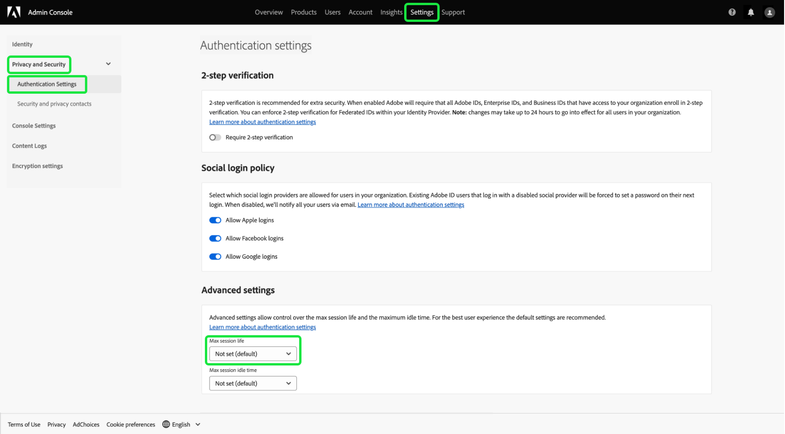
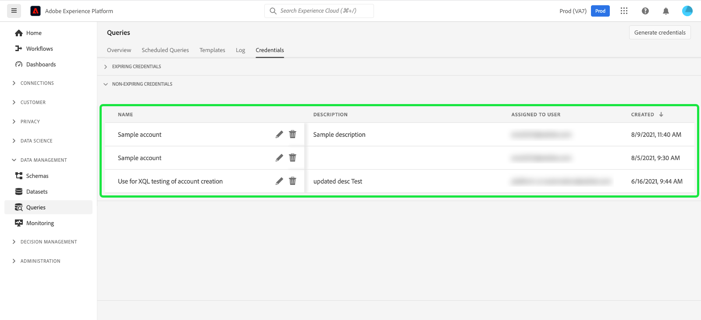

# 資格情報ガイド

Adobe Experience Platform クエリサービスを使用すると、外部クライアントと接続できます。 これらの外部クライアントに接続するには、有効期限のある資格情報または有効期限のない資格情報を使用します。

>[!NOTE]
>
>すべてのユーザーに対して、資格情報パネルは、自動的には使用できません。必要に応じて、Adobe アカウントチームに連絡して、「[!UICONTROL Credentials]」タブをクエリサービス ワークスペースに含めてください。 ご要望があれば、この変更は組織全体にわたり、Adobeのエンジニアリングチームが実施します。 ユーザーが制御する設定ではありません。

## 資格情報の期限切れ {#expiring-credentials}

>[!CONTEXTUALHELP]
>id="platform_queryservice_credentials_expiringcredentials"
>title="クライアントの SSL モード"
>abstract="クエリサービスに接続されたクライアントで SSL を有効にする必要があります。SSL モードが「必須」に設定されていることを確認してください。"

有効期限が切れる資格情報を使用して、外部クライアントへの接続をすばやく設定できます。


**[!UICONTROL Expiring credentials]** の節では、次の情報を提供します。

- **[!UICONTROL Host]**: クライアントの接続先ホストの名前。 これには、Experience Platform UI の上部リボンに表示される組織の名前が含まれています。
- **[!UICONTROL Port]**：接続先ホストのポート番号。
- **[!UICONTROL Database]**: クライアントの接続先データベースの名前。
- **[!UICONTROL Username]**：クエリサービスへの接続に使用するユーザー名。
- **[!UICONTROL Password]**: クエリサービスへの接続に使用するパスワード。 UI のパスワードは、セキュリティのためにハッシュ化されています。 コピーアイコン（）を選択して、ハッシュ化されていない完全な資格情報をクリップボードにコピーします。
- **[!UICONTROL PSQL command]**：コマンドラインで PSQL を使用してクエリサービスに接続するためのすべての関連情報を自動的に挿入したコマンド。
- **[!UICONTROL Expires]**：有効期限が切れる資格情報の有効期限の日時。 トークンのデフォルトの有効期間は 24 時間ですが、Admin Consoleの詳細設定で変更できます。

>[!TIP]
>
>期限が切れる資格情報をクエリサービスに接続するためのセッションの有効期間を変更するには、[Admin Console](https://adminconsole.adobe.com/) に移動し、画面で **設定**/**プライバシーとセキュリティ**/**認証設定**/**詳細設定**/**最大セッションの有効期間** を選択します。
>
>
>
>Admin Console が提供する [&#x200B; 詳細設定 &#x200B;](https://helpx.adobe.com/enterprise/using/authentication-settings.html#advanced-settings) について詳しくは、Adobe ヘルプドキュメントを参照してください。

### クエリセッション内でCustomer Journey Analytics データに接続する {#connect-to-customer-journey-analytics}

Power BIまたは Tableau でCustomer Journey Analytics BI 拡張機能を使用して、SQL でCustomer Journey Analytics[&#x200B; データビュー &#x200B;](https://experienceleague.adobe.com/ja/docs/analytics-platform/using/cja-dataviews/data-views) にアクセスします。 クエリサービスを BI 拡張機能と統合すると、クエリサービスのセッション内でデータビューに直接アクセスできます。 この統合により、クエリサービスを PostgreSQL インターフェイスとして使用する BI ツールの機能が合理化されます。 この機能により、BI ツールでデータビューを複製する必要がなくなり、プラットフォーム間で一貫したレポートが確保され、BI プラットフォームでのCustomer Journey Analytics データと他のソースとの統合が簡素化されます。

[&#x200B; クエリサービスを &#x200B;](../clients/overview.md)Power BI[&#x200B; や &#x200B;](../clients/power-bi.md)Tableau などの様々なデスクトップクライアントアプリケーションに接続する [&#x200B; 方法については、ドキュメントを参照してください &#x200B;](../clients/tableau.md)

>[!IMPORTANT]
>
>この機能を使用するには、Customer Journey Analytics Workspace プロジェクトとデータビューが必要です。

Power BIまたは Tableau でCustomer Journey Analytics データにアクセスするには、[!UICONTROL Database] ドロップダウンメニューを選択し、使用可能なオプションから「`prod:cja`」を選択します。 次に、Power BIまたは Tableau 設定で使用するために、[!DNL Postgres] 資格情報パラメーター（ホスト、ポート、データベース、ユーザー名など）をコピーします。


>[!NOTE]
>
>Power BIまたは Tableau をCustomer Journey Analyticsに接続すると、クエリサービスの「同時セッション」使用権が消費されます。 追加のセッションとクエリが必要な場合は、追加のアドホッククエリユーザーパック アドオンを購入して、5 つの追加の同時セッションと 1 つの追加の同時クエリを取得できます。

また、クエリエディターまたは Postgres CLI からCustomer Journey Analytics データに直接アクセスすることもできます。 これを行うには、クエリを記述する際に `cja` データベースを参照します。 クエリの記述、実行、保存の方法について詳しくは、クエリエディター [&#x200B; クエリオーサリングガイド &#x200B;](./user-guide.md#query-authoring) を参照してください。

SQL を使用してCustomer Journey Analyticsのデータビューにアクセスする手順について詳しくは、[BI 拡張機能ガイド &#x200B;](https://experienceleague.adobe.com/en/docs/analytics-platform/using/cja-dataviews/bi-extension) を参照してください。

## 資格情報の期限切れなし {#non-expiring-credentials}

>[!CONTEXTUALHELP]
>id="platform_queryservice_credentials_migratenonexpiringcredentials"
>title="OAuth サーバー間の資格情報への移行"
>abstract="JWT 資格情報は 2025年6月30日（PT）以降に機能しなくなるので、この移行は必須です。約 30～40 秒かかり、開始するとキャンセルできません。すべての既存のジョブと統合は、移行後も引き続き OAuth で機能します。この画面を離れて、いつでも戻ってステータスを確認できます。"

有効期限のない資格情報を使用して、外部クライアントへのより永続的な接続を設定できます。

>[!IMPORTANT]
>
>有効期限のない認証情報を初めて OAuth サーバー間で作成または移行する際は、システム管理者アカウントを使用する必要があります。 組織に対してこのアクションを実行できるのはシステム管理者のみです。 システム管理者以外がこの手順を試みると、プロセスは失敗し、認証エラーが表示されます。 初期セットアップ後、必要な権限を持つユーザーは、有効期限のない後続の資格情報を作成または移行できます。

>[!NOTE]
>
>有効期限のない認証情報には、次の制限があります。
>
>- ユーザーは、ユーザー名とパスワードを `{technicalAccountId}:{credential}` の形式でログインする必要があります。 詳しくは、[&#x200B; 資格情報の生成 &#x200B;](#generate-credentials) の節を参照してください。
>- デフォルトでは、有効期限のない資格情報には、`SELECT` クエリのみを実行する権限が付与されます。 `CTAS` または `ITAS` クエリを実行するには、有効期限のない資格情報に関連付けられた役割に、「データセットの管理」および「スキーマの管理」権限を手動で追加します。 「スキーマの管理」権限は「データモデリング」セクションにあり、「データセットの管理」権限は [Adobe Developer Console](https://developer.adobe.com/console/) の「データ管理」セクションにあります。
>- サードパーティクライアントは、クエリオブジェクトをリストアウトする際に、期待とは異なるパフォーマンスを発揮する可能性があります。 例えば、[!DNL DB Visualizer] などの一部のサードパーティクライアントでは、左側のパネルにビュー名が表示されません。 ただし、`SELECT` のクエリ内で呼び出した場合は、ビュー名にアクセスできます。 同様に、SQL[!DNL PowerUI] 作成した一時ビューをダッシュボードの作成で選択するためにリストしない場合もあります。

### 前提条件

有効期限のない認証情報を生成する前に、Adobe Admin Consoleで次の手順を実行する必要があります。

1. [Adobe Admin Console](https://adminconsole.adobe.com/) にログインし、上部のナビゲーションバーから関連組織を選択します。
2. [製品プロファイルを選択します。](../../access-control/ui/browse.md)
3. [&#x200B; 製品プロファイル用に **サンドボックス** 権限と **クエリサービス統合の管理** 権限の両方を設定 &#x200B;](../../access-control/ui/permissions.md) します。
4. [&#x200B; 製品プロファイルに新しいユーザーを追加 &#x200B;](../../access-control/ui/users.md) して、設定された権限を付与します。
5. [&#x200B; 製品プロファイル管理者としてユーザーを追加 &#x200B;](https://helpx.adobe.com/jp/enterprise/using/manage-product-profiles.html) し、アクティブな製品プロファイルのアカウントの作成を許可します。
6. 統合を作成するには、[&#x200B; ユーザーを製品プロファイル開発者として追加 &#x200B;](https://helpx.adobe.com/jp/enterprise/using/manage-developers.html) します。

これらの手順を実行すると、OAuth サーバー間資格情報を生成し、有効期限のある資格情報機能または有効期限のない資格情報機能を使用するために必要な権限が [0&rbrace;Adobe Developer Console&rbrace; で設定されます。](https://developer.adobe.com/console/)

権限の割り当てについて詳しくは、[&#x200B; アクセス制御に関するドキュメント &#x200B;](../../access-control/home.md) を参照してください。

### 資格情報を生成 {#generate-credentials}

有効期限のない一連の資格情報を作成するには、Experience Platform UI に戻り、左側のナビゲーションから「**[!UICONTROL Queries]**」を選択して、[!UICONTROL Queries] Workspace にアクセスします。 次に、「**[!UICONTROL Credentials]**」タブを選択し、続いて「**[!UICONTROL Generate credentials]**」を選択します。


資格情報を生成するためのダイアログが表示されます。 有効期限のない認証情報を作成するには、次の詳細を指定する必要があります。

- **[!UICONTROL Name]**：生成する資格情報の名前。
- **[!UICONTROL Description]**:（任意）生成する資格情報の説明。
- **[!UICONTROL Assigned to]**：資格情報の割り当て先となるユーザー。 この値は、資格情報を作成するユーザーのメールアドレスである必要があります。
- **[!UICONTROL Password]** （オプション）資格情報のオプションのパスワード。 パスワードが設定されていない場合、Adobeによってパスワードが自動生成されます。

必要な詳細をすべて入力したら、「**[!UICONTROL Generate credentials]**」を選択して資格情報を生成します。


>[!IMPORTANT]
>
>**[!UICONTROL Generate credentials]** を選択すると、設定の JSON ファイルがローカルマシンにダウンロードされます。 Adobeは生成された資格情報を記録 **しないので** ダウンロードしたファイルを安全に保存し、資格情報の記録を保持する必要があります。
>
>さらに、資格情報が 90 日間使用されない場合、資格情報は削除されます。

設定の JSON ファイルには、テクニカルアカウント名、テクニカルアカウント ID、資格情報などの情報が含まれています。 これは次の形式で提供されます。

```json
{"technicalAccountName":"9F0A21EE-B8F3-4165-9871-846D3C8BC49E@TECHACCT.ADOBE.COM","credential":"3d184fa9e0b94f33a7781905c05203ee","technicalAccountId":"4F2611B8613AA3670A495E55"}
```

生成された認証情報を保存したら、「**[!UICONTROL Close]**」を選択します。 有効期限のない資格情報のリストがすべて表示されます。



有効期限のない認証情報は、編集または削除できます。 有効期限のない認証情報を編集するには、鉛筆アイコン（）に設定します。 有効期限のない認証情報を削除するには、削除アイコン（）を選択します。

有効期限のない秘密鍵証明書を編集すると、モーダルが表示されます。 更新する次の詳細を指定できます。

- **[!UICONTROL Name]**：生成する資格情報の名前。
- **[!UICONTROL Description]**:（任意）生成する資格情報の説明。
- **[!UICONTROL Assigned to]**：資格情報の割り当て先となるユーザー。 この値は、資格情報を作成するユーザーのメールアドレスである必要があります。


必要な詳細をすべて入力したら、「**[!UICONTROL Update account]**」を選択して、資格情報の更新を完了します。

### OAuth への認証情報の移行 {#migrate-credentials}

有効期限のない JWT 資格情報を使用している場合は、サービスが中断されないように、2025 年 6 月 30 日（PT）までに各サーバーを OAuth サーバー間に移行する必要があります。

>[!IMPORTANT]
>
>JWT 資格情報は、2025 年 6 月 30 日（PT）以降は機能しなくなります。 承認を維持するには、この移行を手動で完了する必要があります。

影響を受ける資格情報を特定し、移行を完了する方法については、[JWT から OAuth サーバー間資格情報への移行ガイド &#x200B;](./migrate-jwt-to-oauth.md) を参照してください。

よくある質問については、[&#x200B; 移行に関する FAQ](./migrate-jwt-to-oauth.md#faq) を参照してください。

## 資格情報を使用して外部クライアントに接続 {#use-credential-to-connect}

有効期限のある資格情報または有効期限のない資格情報のいずれかを使用して、Aqua Data Studio、Looker、Power BIなどの外部クライアントと接続できます。 これらの資格情報の入力方法は、外部クライアントによって異なります。 これらの資格情報の使用手順については、外部クライアントのドキュメントを参照してください。

この画像は、有効期限のない資格情報のパスワードを除く、UI で見つかった各パラメーターの場所を示しています。 有効期限のない資格情報は JSON 設定ファイルによって提供されますが、有効期限のある資格情報は UI の「**資格情報**」タブで表示できます。


次の表に、外部クライアントに接続するために通常必要なパラメーターの概要を示します。

>[!NOTE]
>
>有効期限のない認証情報を使用してホストに接続する場合、パスワードとユーザー名を除き、[!UICONTROL EXPIRING CREDENTIALS] の節に記載されているすべてのパラメーターを使用する必要があります。
>&#x200B;>ユーザー名とパスワードを入力する形式では、この例の `username:{your_username}` と `password:{password_string}` のようにコロンで区切られた値を使用します。

| パラメーター | 説明 | 例 |
|---|---|---|
| **サーバー/ホスト** | 接続先のサーバー/ホストの名前。 <ul><li>この値は、有効期限のある資格情報と有効期限のない資格情報の両方に使用され、`server.adobe.io` の形式を取ります。 この値は、**[!UICONTROL Host]** のセクションの [!UICONTROL EXPIRING CREDENTIALS] にあります。</ul></li> | `acme.platform.adobe.io` |
| **ポート** | 接続先のサーバー/ホストのポート。 <ul><li>この値は、有効期限のある資格情報と有効期限のない資格情報の両方に使用され、**[!UICONTROL Port]** のセクションの [!UICONTROL EXPIRING CREDENTIALS] にあります。</ul></li> | `80` |
| **データベース** | 接続先のデータベース。 <ul><li>この値は、有効期限のある資格情報と有効期限のない資格情報の両方に使用され、**[!UICONTROL Database]** のセクションの [!UICONTROL EXPIRING CREDENTIALS] にあります。 </ul></li> | `prod:all` |
| **ユーザー名** | 外部クライアントに接続するユーザーのユーザー名。 <ul><li>この値は、有効期限のある資格情報と有効期限のない資格情報の両方に使用されます。 `@AdobeOrg` 前は英数字の形式です。 この値は **[!UICONTROL Username]** の下にあります。</li></ul> | `ECBB80245ECFC73E8A095EC9@AdobeOrg` |
| **パスワード** | 外部クライアントに接続するユーザーのパスワード。 <ul><li>有効期限が切れる認証情報を使用している場合は、**[!UICONTROL Password]** のセクション内の [!UICONTROL EXPIRING CREDENTIALS] で確認できます。</li><li>有効期限のない資格情報を使用している場合、この値は、technicalAccountID からの連結引数と、設定 JSON ファイルから取得された資格情報です。 パスワードの値は `{technicalAccountId}:{credential}` 形式で指定します。</li></ul> | <ul><li>有効期限が切れる資格情報のパスワードは、1,000 文字を超える英数字の文字列です。 例は示されません。</li><li>有効期限のない資格情報のパスワードは次のとおりです。<br>`4F2611B8613DK3670V495N55:3d182fa9e0b54f33a7881305c06203ee`</li></ul> |

{style="table-layout:auto"}

## 次の手順

これで、有効期限のある資格情報と有効期限のない資格情報の両方の仕組みがわかったので、これらの資格情報を使用して外部クライアントに接続できます。 外部クライアントの詳細については、[&#x200B; クエリサービスへのクライアント接続ガイド &#x200B;](../clients/overview.md) を参照してください。
