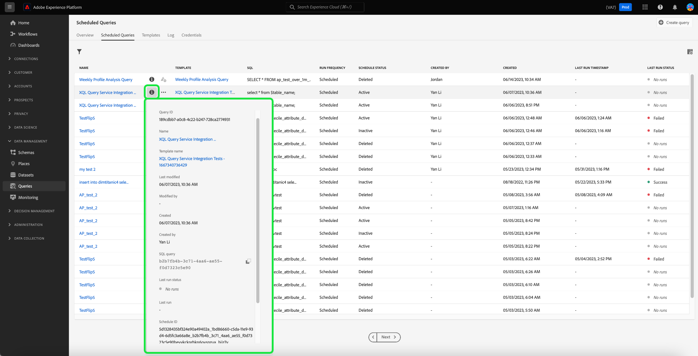

# スケジュール済みクエリの監視

Adobe Experience Platform では、UI を使用して、すべてのクエリジョブのステータスをより的確に把握できるようになりました。「[!UICONTROL  スケジュール済みクエリ ]」タブで、ステータス、スケジュールの詳細、失敗した場合のエラーメッセージ/コードなど、クエリの実行に関する重要な情報を確認できるようになりました。 「[!UICONTROL スケジュール済みクエリ]」タブから、これらの任意のクエリについて、UI を使用して、ステータスに基づくクエリのアラートの配信を登録することもできます。

## [!UICONTROL スケジュール済みクエリ]

「[!UICONTROL  スケジュール済みクエリ ]」タブには、スケジュール済みのすべての CTAS および ITAS クエリの概要が表示されます。 すべてのスケジュール済みクエリの実行詳細のほか、失敗したクエリのエラーコードとメッセージを確認できます。

「[!UICONTROL スケジュール済みクエリ]」タブに移動するには、左側のナビゲーションバーから「**[!UICONTROL クエリ]**」、「**[!UICONTROL スケジュール済みクエリ]**」の順に選択します。

使用可能な各列を以下のテーブルに示します。

>[!NOTE]
>
>アラート購読アイコン（）が、名称未設定列の各行に含まれている。 詳しくは、[アラート配信登録](#alert-subscription)の節を参照してください。

| 列 | 説明 |
|---|---|
| **[!UICONTROL 名前]** | 名前フィールドは、テンプレート名か SQL クエリの最初の数文字のどちらかです。 クエリエディターを使用して UI から作成したクエリは、開始時に名前が付けられます。API を使用してクエリが作成された場合、その名前はクエリの作成に使用された最初の SQL のスニペットになります。 クエリに関連付けられているすべての実行のリストを表示するには、「[!UICONTROL  名前 ]」列から項目を選択します。 詳しくは、[ クエリ実行スケジュールの詳細 ](#query-runs) の節を参照してください。 |
| **[!UICONTROL テンプレート]** | クエリのテンプレート名。 テンプレート名を選択してクエリエディターに移動します。 便宜上、クエリエディターにクエリテンプレートが表示されます。 テンプレート名がない場合、行はハイフンでマークされ、クエリエディターにリダイレクトしてクエリを表示することはできません。 |
| **[!UICONTROL SQL]** | SQL クエリのスニペット。 |
| **[!UICONTROL 実行頻度]** | クエリを実行するように設定されるケイデンス。 指定可能な値は `Run once` と `Scheduled` です。 |
| **[!UICONTROL 作成者]** | クエリを作成したユーザーの名前。 |
| **[!UICONTROL 作成日]** | クエリが作成されたときのタイムスタンプ（UTC 形式）。 |
| **[!UICONTROL 前回実行されたタイムスタンプ]** | クエリ実行時の最新のタイムスタンプ。 この列では、現在のスケジュールに従ってクエリが実行されたかどうかがハイライト表示されます。 |
| **[!UICONTROL 前回の実行ステータス]** | 最新のクエリ実行ステータス。 ステータス値は、`Success`、`Failed`、`In progress`、`No runs` です。 |
| **[!UICONTROL スケジュールのステータス]** | スケジュールされたクエリの現在のステータス。 使用可能な値は 6 つあります。[!UICONTROL  登録中 ]、[!UICONTROL  アクティブ ]、[!UICONTROL  非アクティブ ]、[!UICONTROL  削除済み ]、ハイフン、[!UICONTROL  強制隔離 ] です。<ul><li>**[!UICONTROL 登録中]** ステータスは、システムがクエリの新しいスケジュールの作成を処理中であることを示します。 登録中は、スケジュール済みクエリを無効にしたり削除したりすることはできません。</li><li>**[!UICONTROL アクティブ]** ステータスは、スケジュールされたクエリが完了日時を **まだ経過していない** ことを示します。</li><li>**[!UICONTROL 非アクティブ]** ステータスは、スケジュールされたクエリが **経過** 完了日時、またはユーザーによって非アクティブ状態としてマークされていることを示します。</li><li>**[!UICONTROL 削除済み]** ステータスは、クエリスケジュールが削除されたことを示します。</li><li>ハイフンは、スケジュールされたクエリが 1 回限りの繰り返さないクエリであることを示します。</li><li>**[!UICONTROL 強制隔離]** ステータスは、クエリが 10 回連続して実行に失敗し、それ以上実行する前に介入が必要であることを示します。</li></ul> |

>[!TIP]
>
>クエリエディターに移動する場合は、「**[!UICONTROL クエリ]**」を選択して「[!UICONTROL テンプレート]」タブに戻ることができます。

## スケジュール済みクエリのテーブル設定のカスタマイズ {#customize-table}

「[!UICONTROL スケジュール済みクエリ]」タブの列は、必要に応じて調整できます。[!UICONTROL  テーブルをカスタマイズ ] 設定ダイアログを開いて使用可能な列を編集するには、設定アイコン（）を選択します。

>[!NOTE]
>
>スケジュールが作成された日付を参照する [!UICONTROL  作成済み ] 列は、デフォルトでは非表示です。

該当するチェックボックスを切り替えて、テーブル列を削除または追加します。 次に、「**[!UICONTROL 適用]**」をクリックして選択を確定します。

>[!NOTE]
>
>UI を使用して作成されたクエリは、作成プロセスの一環として名前付きテンプレートになります。 テンプレート列にテンプレート名が表示されます。 API を使用してクエリが作成された場合、テンプレート列は空白になります。

## インラインアクションを使用したスケジュール済みクエリの管理 {#inline-actions}

[!UICONTROL  スケジュール済みクエリ ] ビューには、スケジュール済みクエリをすべて 1 か所で管理するための様々なインラインアクションが用意されています。 インラインアクションは、各行に省略記号で示されます。 管理するスケジュールされたクエリの省略記号を選択して、ポップアップメニューに使用可能なオプションを表示します。 使用可能なオプションには、[[!UICONTROL  スケジュールを無効 ]](#disable) または [!UICONTROL  スケジュールを有効にする ]、[[!UICONTROL  スケジュールを削除 ]](#delete)、[[!UICONTROL  購読 ]](#alert-subscription) クエリアラートへの、[ 強制隔離を有効または [!UICONTROL  無効にする ]](#quarantined-queries) などがあります。

### スケジュール済みクエリを無効または有効にする {#disable}

スケジュールされたクエリを無効にするには、管理するスケジュールされたクエリの省略記号を選択し、ポップアップメニューのオプションから **[!UICONTROL スケジュールを無効にする]** を選択します。 アクションを確認するダイアログが表示されます。 「**[!UICONTROL 無効]**」を選択して、設定を確定します。

スケジュールされたクエリが無効になると、同じプロセスでスケジュールを有効にできます。 省略記号を選択して、使用可能なオプションから **[!UICONTROL スケジュールを有効にする]** を選択します。

>[!NOTE]
>
>クエリが強制隔離された場合は、スケジュールを有効にする前に、テンプレートの SQL を確認する必要があります。 これにより、テンプレートクエリで問題が解決しない場合に計算時間が無駄になるのを防ぎます。

### スケジュール済みクエリの削除 {#delete}

スケジュールされたクエリを削除するには、管理するスケジュールされたクエリの省略記号を選択し、ポップアップメニューのオプションから **[!UICONTROL スケジュールを削除]** を選択します。 アクションを確認するダイアログが表示されます。 「**[!UICONTROL 削除]**」を選択して、設定を確定します。

スケジュールされたクエリが削除されると、スケジュールされたクエリのリストから **削除されません**。 省略記号によって提供されるインラインアクションは削除され、グレー表示されているアラート購読を追加アイコンに置き換えられます。 削除されたスケジュールに関するアラートを購読することはできません。 行は UI に残り、スケジュールされたクエリの一部として実行された実行に関する情報を提供します。

そのクエリテンプレートの実行をスケジュールする場合は、適切な行からテンプレート名を選択してクエリエディターに移動し、ドキュメントの説明に従って [ クエリにスケジュールを追加する手順 ](./query-schedules.md#create-schedule) に従います。

### アラートの配信を登録 {#alert-subscription}

スケジュールされたクエリ実行のアラートを購読するには、`...` （省略記号）またはアラート購読アイコン（）を選択します。 インラインアクション ドロップダウンメニューが表示されます。 次に、使用可能なオプションから **[!UICONTROL 購読]** を選択します。

[!UICONTROL  アラート ] ダイアログが開きます。 [!UICONTROL  アラート ] ダイアログでは、UI 通知とメールアラートの両方の配信が登録されます。 使用できるアラート購読オプションには、`start`、`success`、`failure`、`quarantine` および `delay` があります。 該当する 1 つ以上のチェックボックスをオンにし、「**[!UICONTROL 保存]**」を選択して配信を登録します。

次の表に、サポートされるクエリのアラートタイプを示します。

| アラートタイプ | 説明 |
|---|---|
| `start` | このアラートは、スケジュールされたクエリの実行が開始されたとき、または処理を開始したときに通知します。 |
| `success` | このアラートは、スケジュールされたクエリの実行が正常に完了したときに、クエリがエラーなく実行されたことを示します。 |
| `failed` | このアラートは、スケジュールされたクエリの実行でエラーが発生した場合、または正常に実行できなかった場合にトリガーします。 これにより、問題を迅速に特定して対処できます。 |
| `quarantine` | このアラートは、スケジュールされたクエリの実行が強制隔離状態になった場合にアクティブになります。 クエリが [ 強制隔離機能 ](#quarantined-queries) に登録されると、10 回連続して実行されなかったスケジュール済みクエリは、自動的に [!UICONTROL  強制隔離 ] 状態になります。 その後、それ以上の実行を行うには、ユーザーの介入が必要です。 |
| `delay` | このアラートは、指定したしきい値を超える [ クエリの実行結果の遅延 ](#query-run-delay) がある場合に通知します。 クエリが完了または失敗せずに該当する期間に実行された場合にアラートをトリガーにするカスタム時間を設定できます。 |

>[!NOTE]
>
>クエリ実行が強制隔離されたことを通知するには、まずスケジュールされたクエリ実行を [ 強制隔離機能 ](#quarantined-queries) に登録する必要があります。

詳しくは、[ アラート購読 API ドキュメント ](../api/alert-subscriptions.md) を参照してください。

### クエリの詳細の表示 {#query-details}

情報アイコン（）を選択して、クエリの詳細パネルを表示します。 詳細パネルには、スケジュールされたクエリテーブルに含まれるファクト以外の、クエリに関するすべての関連情報が含まれます。 追加情報には、クエリ ID、最終変更日、クエリの SQL、スケジュール ID、現在の設定スケジュールが含まれます。

## 強制隔離されたクエリ {#quarantined-queries}

>[!NOTE]
>
>強制隔離アラートは、「run-once」アドホッククエリでは使用できません。 強制隔離アラートは、スケジュールされたバッチ（CTAS および ITAS）クエリにのみ適用されます。

強制隔離機能に登録すると、10 回連続して実行されなかったスケジュール済みクエリは、自動的に [!UICONTROL  強制隔離 ] ステータスになります。 このステータスのクエリは非アクティブになり、スケジュールされた頻度で実行されません。 その後、それ以上の実行を行うには、ユーザーの介入が必要です。 これにより、システムリソースが保護され、実行を再開する前に SQL の問題を確認して修正する必要があります。

強制隔離機能のスケジュールされたクエリを有効にするには、省略記号（`...`）に続いて、表示されるドロップダウンメニューから [!UICONTROL  強制隔離を有効にする ] を選択します。

クエリは、スケジュール作成プロセス中に強制隔離機能に登録することもできます。 詳しくは、[ クエリスケジュールのドキュメント ](./query-schedules.md#quarantine) を参照してください。

## クエリ実行遅延 {#query-run-delay}

クエリの遅延に関するアラートを設定して、コンピューティング時間を制御します。 クエリのパフォーマンスを監視し、特定の期間が経過してもクエリのステータスが変更されない場合に通知を受け取ることができます。 「[!UICONTROL  クエリ実行遅延 ]」アラートを使用すると、クエリが完了せずに特定の期間が経過した後も処理を続行する場合に通知されます。

スケジュールされたクエリ実行で [ アラートの購読 ](#alert-subscription) を行う場合、使用可能なアラートの 1 つは [!UICONTROL  クエリ実行遅延 ] です。 このアラートでは、実行に費やした時間のしきい値を設定する必要があります。その時点で、処理の遅延が通知されます。

通知をトリガーにするしきい値の期間を選択するには、テキスト入力フィールドに数値を入力するか、上下の矢印を使用して 1 分単位で増加します。 しきい値は分単位で設定されているので、クエリ実行の遅延を監視する最大時間は 1440 分（24 時間）です。 実行遅延のデフォルト期間は 150 分です。

>[!NOTE]
>
>クエリ実行には、実行遅延時間を 1 つのみ指定できます。 遅延しきい値を変更すると、アラートを購読しているユーザーと組織全体に対して遅延しきい値が変更されます。

[ クエリ実行遅延 [!UICONTROL  アラートを購読 ](#alert-subscription) する方法については、アラートの購読の節を参照し ] ください。

## クエリのフィルタリング {#filter}

実行頻度に基づいてクエリをフィルタリングできます。「[!UICONTROL スケジュールされたクエリ]」タブで、フィルターアイコン（）を選択して、フィルターサイドバーを開きます。

実行頻度に基づいてクエリのリストをフィルタリングするには、「**[!UICONTROL スケジュール済み]** または **[!UICONTROL 1 回実行]** フィルターチェックボックスを選択します。

>[!NOTE]
>
>実行されたけれどスケジュールされていないクエリは、[!UICONTROL 1 回実行]と認定されます。

フィルター条件を有効にしたら、「**[!UICONTROL フィルターを非表示]**」を選択して、フィルターパネルを閉じます。

## クエリ実行スケジュールの詳細 {#query-runs}

スケジュールの詳細ページを開くには、「[!UICONTROL  スケジュール済みクエリ ]」タブからクエリ名を選択します。 このビューには、スケジュールされたクエリの一部として実行されたすべての実行内容のリストが表示されます。表示される情報に含まれているのは、開始時間と終了時間、ステータス、使用されたデータセットです。

この情報は 5 列の表として表示されます。各行はクエリを 1 回実行したことを示しています。

| 列の名前 | 説明 |
|---|---|
| **[!UICONTROL クエリ実行 ID]** | 毎日の実行に対するクエリ実行 ID。 **[!UICONTROL クエリ実行 ID]** を選択して、[!UICONTROL  クエリ実行の概要 ] に移動します。 |
| **[!UICONTROL クエリ実行開始]** | クエリが実行されたときのタイムスタンプ。タイムスタンプは UTC 形式です。 |
| **[!UICONTROL クエリの実行完了]** | クエリが完了したときのタイムスタンプ。タイムスタンプは UTC 形式です。 |
| **[!UICONTROL ステータス]** | 最新のクエリ実行ステータス。 ステータス値は、`Success`、`Failed`、`In progress`、`Quarantined` です。 |
| **[!UICONTROL データセット]** | 実行に使われたデータセット。 |

スケジュールされたクエリの詳細は、[!UICONTROL プロパティ]パネルに表示されています。このパネルには、初回クエリ ID、クライアントタイプ、テンプレート名、クエリ SQL、スケジュールのケイデンスが含まれています。

クエリ実行 ID を選択して実行の詳細ページに移動し、クエリ情報を表示します。

## クエリ実行の概要 {#query-run-overview}

[!UICONTROL  クエリ実行の概要 ] には、このスケジュールされたクエリの個々の実行に関する情報と、実行ステータスのより詳細な分類が表示されます。 また、このページには、クライアント情報のほか、クエリが失敗する原因となった可能性のあるエラーの詳細も含まれます。

クエリステータスセクションには、クエリが失敗した場合のエラーコードとエラーメッセージが表示されます。

このビューからクエリ SQL をクリップボードにコピーできます。 クエリをコピーするには、SQL スニペットの右上にあるコピーアイコンを選択します。 コードがコピーされたことを確認するポップアップメッセージが表示されます。

### 匿名ブロックを含むクエリの実行詳細 {#anonymous-block-queries}

匿名ブロックを使用して SQL 文を構成するクエリは、個々のサブクエリに分けられます。 サブクエリに分割すると、各クエリブロックの実行詳細を個別に調べることができます。

>[!NOTE]
>
>DROP コマンドを使用する匿名ブロックの実行の詳細は、別のサブクエリとしてレポートされます **は** されません）。 CTAS クエリ、ITAS クエリ、匿名ブロックサブクエリとして使用される COPY ステートメントでは、別個の実行詳細を使用できます。 DROP コマンドの実行詳細は現在サポートされていません。

匿名ブロックは、クエリの前に `$$` プレフィックスを使用して示されます。 クエリサービスの匿名ブロックについて詳しくは、[ 匿名ブロックドキュメント ](../key-concepts/anonymous-block.md) を参照してください。

匿名ブロックサブクエリには、実行ステータスの左側にタブがあります。 タブを選択して実行の詳細を表示します。

匿名ブロッククエリが失敗した場合は、この UI を使用して、その特定のブロックのエラーコードを確認できます。

「**[!UICONTROL クエリ]**」を選択してスケジュール詳細画面に戻るか、「**[!UICONTROL スケジュール済みクエリ]**」を選択して「[!UICONTROL スケジュール済みクエリ]」タブに戻ります。

