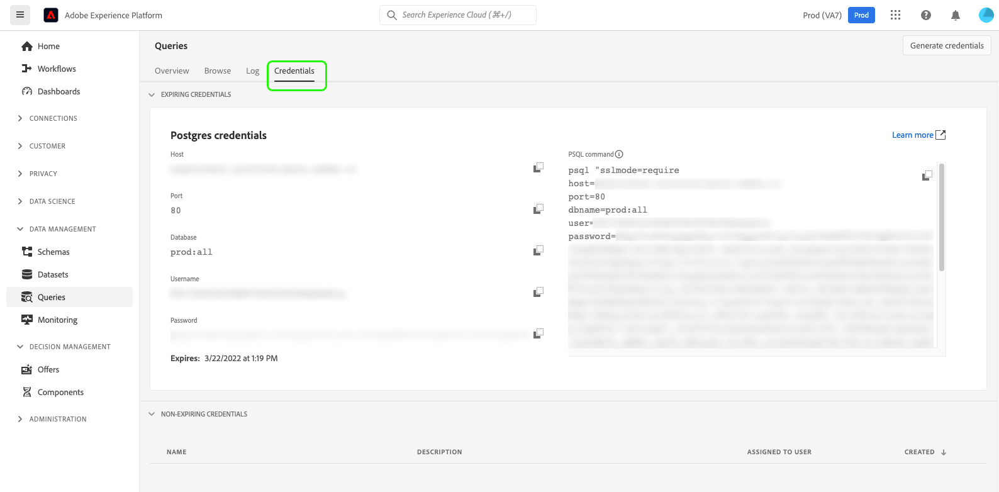

# [!DNL Query Service] UI ガイド

Adobe Experience Platform [!DNL Query Service] は、クエリの書き込みと実行、以前に実行したクエリの表示、IMS 組織内のユーザーが保存したクエリへのアクセスに使用できるユーザーインターフェイスを提供します。[Adobe Experience Platform](https://platform.adobe.com) 内の UI にアクセスするには、左側のナビゲーションで「**[!UICONTROL クエリ]**」を選択します。

## [!DNL Query Editor]

[!DNL Query Editor] を使用すると、外部クライアントを使用せずにクエリを書き込んだり、実行したりできます。「**[!UICONTROL クエリを作成]**」を選択して [!DNL Query Editor] を開き、新しいクエリを作成します。「**[!UICONTROL ログ]**」タブまたは「**[!UICONTROL テンプレート]**」タブからクエリを選択して、[!DNL Query Editor] にアクセスすることもできます。以前に実行または保存したクエリを選択すると、[!DNL Query Editor] が開き、選択したクエリの SQL が表示されます。

[!DNL Query Editor] には、クエリの入力を開始できる編集スペースが用意されています。ユーザーが入力すると、エディターによって、テーブル内の SQL 予約語、テーブル、およびフィールド名が自動入力されます。クエリの作成が完了したら、「**再生**」ボタンを選択し、クエリを実行します。エディターの下にある「**[!UICONTROL コンソール]**」タブには、[!DNL Query Service] が現在何を実行しているか、クエリがいつ返されたかが表示されます。コンソールの横にある「**[!UICONTROL 結果]**」タブには、クエリ結果が表示されます。[!DNL Query Editor] の使用について詳しくは、[クエリエディターガイド](./user-guide.md)を参照してください。

![[!DNL Query Editor]のズームインビュー。](../images/ui/overview/query-editor.png)

## スケジュール済みクエリ {#scheduled-queries}

既にテンプレートとして保存されているクエリは、定期的なサイクルで実行するようにスケジュールできます。 クエリをスケジュールする場合、実行頻度、開始日と終了日、スケジュール済みクエリが実行される曜日、およびクエリのエクスポート先のデータセットを選択できます。 クエリスケジュールは、クエリエディターを使用して設定します。

UI を使用してクエリをスケジュールする方法については、 [スケジュール済みクエリガイド](./user-guide.md#scheduled-queries). API を使用してスケジュールを追加する方法について詳しくは、[スケジュールされたクエリのエンドポイントガイド](../api/scheduled-queries.md)を参照してください。

クエリがスケジュールされると、そのクエリは [!UICONTROL 予定クエリ] タブをクリックします。 クエリ、実行、作成者、タイミングに関する詳細は、リストからスケジュール済みクエリを選択すると確認できます。

| 列 | 説明 |
| --- | --- |
| **[!UICONTROL 名前]** | 名前フィールドは、テンプレート名か SQL クエリの最初の数文字のどちらかです。 クエリエディターを使用して UI から作成したクエリは、開始時に名前が付けられます。API を使用してクエリが作成された場合、クエリの名前は、クエリの作成に使用された最初の SQL のスニペットになります。 |
| **[!UICONTROL テンプレート]** | クエリのテンプレート名。 テンプレート名を選択してクエリエディターに移動します。 便宜上、クエリエディターにクエリテンプレートが表示されます。 テンプレート名がない場合、行はハイフンでマークされ、クエリエディターにリダイレクトしてクエリを表示することはできません。 |
| **[!UICONTROL SQL]** | SQL クエリのスニペット。 |
| **[!UICONTROL 実行頻度]** | これは、クエリを実行するように設定されるケイデンスです。 指定可能な値は `Run once` と `Scheduled` です。クエリは、実行頻度に従ってフィルタリングできます。 |
| **[!UICONTROL 作成者]** | クエリを作成したユーザーの名前。 |
| **[!UICONTROL 作成日]** | クエリが作成されたときのタイムスタンプ（UTC 形式）。 |
| **[!UICONTROL 前回実行時のタイムスタンプ]** | クエリ実行時の最新のタイムスタンプ。 この列では、現在のスケジュールに従ってクエリが実行されたかどうかがハイライト表示されます。 |
| **[!UICONTROL 前回の実行ステータス]** | 最新のクエリ実行ステータス。 ステータス値は `successful`、`failed`、`in progress` のいずれかです。 |

方法の詳細については、ドキュメントを参照してください。 [クエリサービス UI を使用したクエリの監視](./monitor-queries.md).

## テンプレート {#browse}

「**[!UICONTROL テンプレート]**」タブには、組織のユーザーによって保存されたクエリが表示されます。これらをクエリプロジェクトと考えると便利です。ここで保存したクエリは、まだ作成中の可能性があります。「**[!UICONTROL テンプレート]**」タブに表示されるクエリは、「**[!UICONTROL ログ]**」タブに実行クエリとしても表示されます（以前に [!DNL Query Service] によって実行されている場合）。

| 列 | 説明 |
| --- | --- |
| **[!UICONTROL 名前]** | 名前フィールドは、ユーザーが作成したクエリ名か、SQL クエリの最初の数文字のどちらかです。クエリエディターを使用して UI から作成したクエリは、開始時に名前が付けられます。API を使用してクエリが作成された場合、クエリの名前は、クエリの作成に使用された最初の SQL のスニペットになります。クエリ名を選択して、[!DNL Query Editor] でクエリを開くことができます。検索バーを使用して、クエリの[!UICONTROL 名前]で検索することもできます。検索では大文字と小文字が区別されます。 |
| **[!UICONTROL SQL]** | SQL クエリの最初の数文字。コードの上にカーソルを置くと、完全なクエリが表示されます。 |
| **[!UICONTROL 変更者]** | 最後にクエリを変更したユーザー。[!DNL Query Service] へのアクセス権を持つ、組織内のすべてのユーザーがクエリを変更できます。 |
| **[!UICONTROL 最終変更日]** | ブラウザーのタイムゾーンでの、クエリが最後に編集された日付と時間。 |

## ログ

「**[!UICONTROL ログ]**」タブには、以前に実行されたクエリのリストが表示されます。デフォルトでは、ログはクエリを逆年代順にリストします。

| 列 | 説明 |
| --- | --- |
| **[!UICONTROL 名前]** | クエリ名。SQL クエリの最初の数文字で構成されます。名前を選択すると [!DNL Query Editor] が開き、クエリを編集できます。検索バーを使用して、クエリの名前で検索できます。検索では大文字と小文字が区別されます。 |
| **[!UICONTROL 作成者]** | クエリを作成した人物の名前。 |
| **[!UICONTROL クライアント]** | クエリに使用されるクライアント。 |
| **[!UICONTROL データセット]** | クエリが使用する入力データセット。データセットを選択して、入力データセットの詳細画面に移動します。 |
| **[!UICONTROL ステータス]** | クエリの現在の状態。 |
| **[!UICONTROL 前回の実行]** | 最後にクエリが実行された日時。この列の上にある矢印を選択して、リストを昇順または降順で並べ替えることができます。 |
| **[!UICONTROL 実行時]** | クエリの実行に要した時間。 |

## 資格情報

「**[!UICONTROL 資格情報]**」タブには、有効期限のある資格情報と有効期限のない資格情報の両方が表示されます。これらの資格情報を使用して外部クライアントと接続する方法について詳しくは、[資格情報ガイド](../clients/overview.md)を参照してください。

## 次の手順

これで [!DNL Platform] の [!DNL Query Service] ユーザーインターフェイスをよく理解したので、次に、[!DNL Query Editor] にアクセスして、独自のクエリプロジェクトの作成を開始し、組織内の他のユーザーと共有することができます。[!DNL Query Editor] でのクエリの作成と実行について詳しくは、[[!DNL Query Editor] ユーザガイド](./user-guide.md)を参照してください。