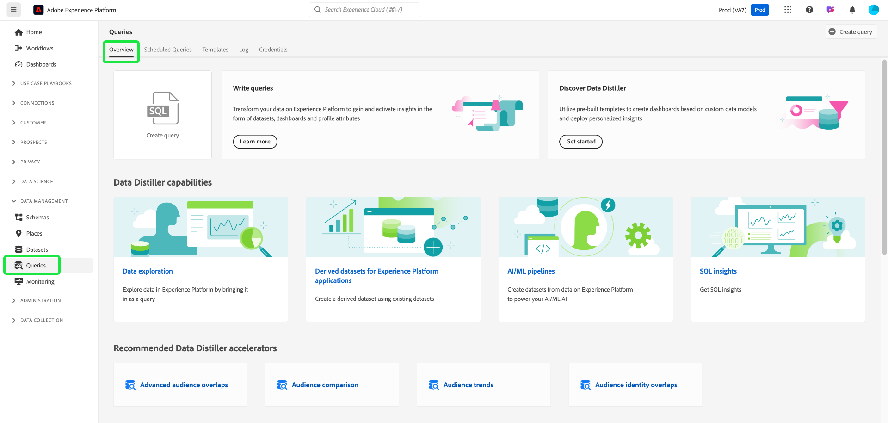
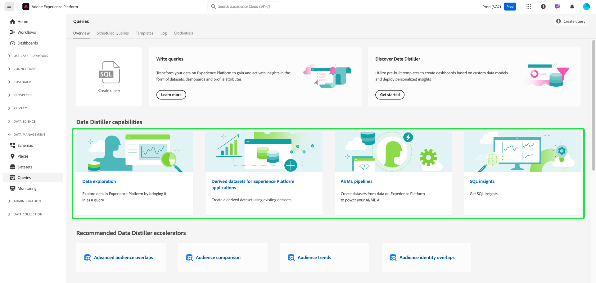
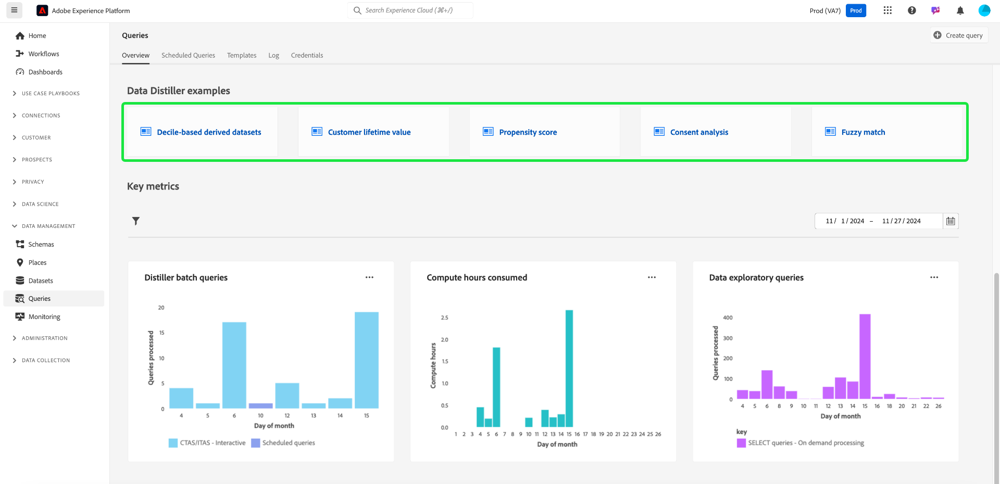
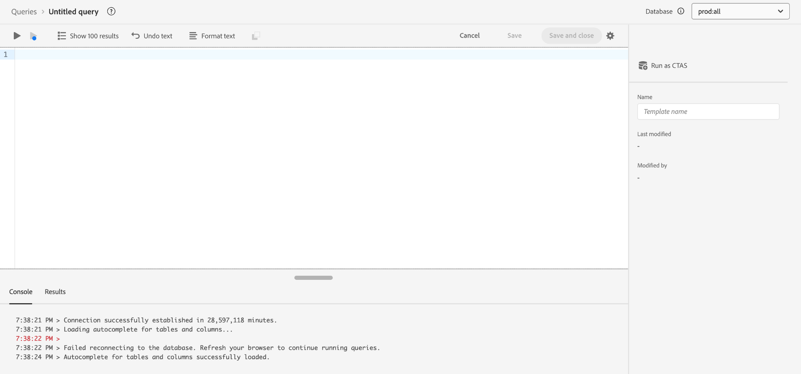
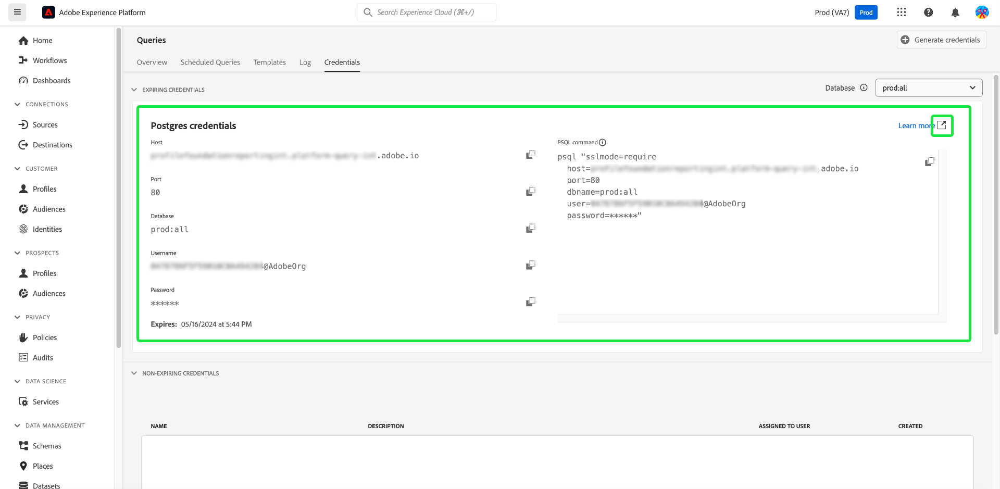

# クエリサービス UI ガイド

Adobe Experience Platform クエリサービスは、クエリの書き込みと実行、以前に実行したクエリの表示、組織内のユーザーが保存したクエリへのアクセスに使用できるユーザーインターフェイスを提供します。 [Adobe Experience Platform](https://platform.adobe.com) 内の UI にアクセスするには、左側のナビゲーションで **[!UICONTROL Queries]** を選択します。 [!UICONTROL Queries] [!UICONTROL Overview] が表示されます。

## 概要 {#overview}

「[!UICONTROL Overview]」タブを使用すると、クエリやデータDistillerテンプレートを使用する際の効率的なエントリポイントが得られます。 ここでは、クエリの記述、データセットの調査、オーディエンスデータの分析に必要なすべての機能にアクセスして、データ分析とオーディエンスインサイトのスムーズなワークフローを確保できます。 この概要では、Data Distillerで実現できることを確認し、クエリサービスの使用状況に関する主要指標を見つけます。

### メインパネル {#main-panels}

[!UICONTROL Overview] のページには、開始に役立ついくつかの主要セクションが含まれています。

1. 「**[!UICONTROL Create query]**」を選択すると、クエリエディターにすばやく移動し、新しいクエリを書き込んで実行できます。
2. 「**[!UICONTROL Learn more]**」を選択すると、**[!UICONTROL Write queries]** 成方法に関する詳細なドキュメントが表示されます。
3. **[!UICONTROL Get started]** のセクションの **[!UICONTROL Discover Data Distiller]** を選択して、Data Distillerの概要を開き、使用可能な機能を確認します。

### Data Distiller の機能 {#data-distiller-capabilities}

[!UICONTROL Data Distiller capabilities] の節では、より高度な Data Distiller機能へのドキュメントリンクを示します。

- **[[!UICONTROL Data exploration]](../use-cases/data-exploration.md)**:SQL を使用してバッチ取り込みデータを調査、トラブルシューティング、検証する方法について説明します。
- **[[!UICONTROL Derived datasets for Experience Platform applications]](../data-distiller/derived-datasets/overview.md)**：派生データセットを作成して、データユーティリティを最大化する複雑で多様なユースケースをサポートする方法を説明します。
- **[[!UICONTROL AI/ML pipelines]](../data-distiller/ml-feature-pipelines/overview.md)**：優先する機械学習ツールの背後にある重要な概念と、マーケティングのユースケースをサポートするカスタムモデルの構築方法について説明します。 このシリーズのガイドでは、機械学習環境でカスタムモデルにフィードするExperience Platformのデータを準備する機能パイプラインを構築するために必要な手順を説明します。
- **[[!UICONTROL SQL insights]](../data-distiller/sql-insights/overview.md)**:Data Distillerを使用して SQL からインサイトダッシュボードを作成するために必要な、主な機能と手順について説明します。

### 推奨される Data Distiller アクセラレーター {#recommended-accelerators}

クイックリンクを選択して、関連する Data Distiller ダッシュボードの [!UICONTROL Templates] ージに移動します。 各アクセラレーターは、オーディエンスデータの分析、セグメント化の最適化、ターゲティング戦略の強化に役立つ強力なツールとビジュアライゼーションを提供します。

- **[[!UICONTROL Advanced audience overlaps]](../../dashboards/sql-insights-query-pro-mode/templates/overlaps.md)**：このダッシュボードから、複数のオーディエンスセグメント間のオーディエンスの交差を分析し、有益なインサイトを明らかにし、セグメント化戦略を最適化できます。 また、オフラインでの分析やレポート作成を目的としてインサイトをエクスポートすることもできます。
- **[[!UICONTROL Audience comparison]](../../dashboards/sql-insights-query-pro-mode/templates/comparison.md)**：このダッシュボードから、主要なオーディエンス指標を並べて比較およびコントラスト化し、2 つのオーディエンスグループを詳細に分析できます。 これらのインサイトは、オーディエンスサイズ、成長およびその他の主要なパフォーマンス指標を理解するのに役立ち、セグメント化を調整し、データ駆動型の決定でターゲティング戦略を最適化できます。
- **[[!UICONTROL Audience trends]](../../dashboards/sql-insights-query-pro-mode/templates/trends.md)**:[!UICONTROL Audience trends] ダッシュボードを使用すると、オーディエンスの増加、ID 数、単一 ID プロファイルなどの主要指標を通じて、オーディエンスが時間の経過と共にどのように進化するかを視覚化できます。 トレンドを追跡して、オーディエンスの行動に関する貴重なインサイトを引き出し、セグメント化の調整、エンゲージメントの強化、より効果的なキャンペーンのためのターゲティング戦略の最適化を行えるようにします。
オーディエンス指標を経時的に追跡して、オーディエンスサイズ、ID の増加および全体的なエンゲージメントの変化を監視します。
- **[[!UICONTROL Audience identity overlaps]](../../dashboards/sql-insights-query-pro-mode/templates/identity-overlaps.md)**：オーディエンス ID の重複ダッシュボードを使用すると、選択したオーディエンス内での ID の重複を分析できます。 ビジュアライゼーションと表形式のデータは、ID のステッチを最適化し、冗長性を軽減し、セグメント化を改善するためのインサイトを提供します。 これらのインサイトにより、より効果的なターゲティング、パーソナライゼーションの強化、顧客インタラクションの合理化が可能になります。

### Data Distiller の例 {#data-distiller-examples}

カードを選択すると、データDistillerを最大限に活用するのに役立つドキュメントガイドと例が開きます。

- **[[!UICONTROL Decile-based derived datasets]](../use-cases/deciles-use-case.md)**:Adobe Experience Platformでセグメント化とオーディエンス作成用のデシルベースの派生データセットを作成する方法を説明します。 航空会社のロイヤルティシナリオを使用して、スキーマのデザイン、十分位数の計算、データのランキングおよび集計のクエリ例について説明します。
- **[[!UICONTROL Customer lifetime value]](../use-cases/customer-lifetime-value.md)**:Real-Time CDPとカスタムダッシュボードを使用して、顧客の生涯価値をトラッキングおよび視覚化する方法について説明します。 これらのインサイトを使用して、新規顧客を獲得するための戦略を開発し、既存の顧客を保持し、利益率を最大化します。
- **[[!UICONTROL Propensity score]](../use-cases/propensity-score.md)**：機械学習予測モデルを使用して傾向スコアを決定する方法を説明します。 このガイドでは、トレーニング用のデータ送信、SQL を使用したトレーニング済みモデルの適用、および顧客購入の可能性の予測について説明します。
- **[[!UICONTROL Consent analysis]](../../dashboards/insights-use-cases/consent-analysis.md)**:Real-Time CDP、クエリサービス、Data Distillerを使用して、お客様の同意を分析およびトラッキングする方法について説明します。 このガイドでは、同意ダッシュボードの構築、セグメント化の絞り込み、傾向の追跡およびコンプライアンスの確保について説明し、パーソナライズされたエクスペリエンスの構築と提供を支援します。
- **[[!UICONTROL Fuzzy match]](../use-cases/fuzzy-match.md)**:Experience Platform データに対して「あいまい」一致を実行して近似一致を見つけ、データセット間の文字列の類似性を分析する方法を説明します。 このガイドに従うと、時間を節約し、データにアクセスしやすくなります。 この例では、2 つの旅行代理店データセット間でホテルの部屋の属性を照合する方法を示しており、大規模で複雑なデータセットについて、一貫性と精度を確保するための効率的な照合、比較および調整を行う方法を示しています。

### 主要指標 {#key-metrics}

「主要指標」セクションには、クエリサービスの使用状況を監視するのに役立つ重要なデータのビジュアライゼーションが表示されます。 各グラフでは、右上の省略記号（`...`）に続いて [!UICONTROL View more] を選択して、結果の表形式を表示するか、データを CSV ファイルとしてダウンロードしてスプレッドシートに表示できます。 詳しくは、[&#x200B; 詳細を表示ガイド &#x200B;](../../dashboards/sql-insights-query-pro-mode/view-more.md) を参照してください。

#### 日付フィルターの設定 {#set-date-filter}

これらのビジュアライゼーションにグローバル日付フィルターを適用するには、フィルターアイコン（）を選択し、**[!UICONTROL Filters]** ダイアログで日付範囲を調整します。 このフィルターを適用すると、表示される指標を特定の時間枠に合わせて調整し、分析の関連性を高めることができます。

#### [!UICONTROL Distiller batch queries] {#distiller-batch-queries}

この [!UICONTROL Distiller batch queries] グラフは、クエリアクティビティの日別分類を提供し、処理された CTAS および ITAS （インタラクティブおよびスケジュール済み）クエリの数を強調表示します。 このグラフには、特定の日にインタラクティブクエリの急激な増加や、スケジュールされたクエリの使用頻度が低いなどのパターンが示されています。 これらのインサイトを使用して、ピークアクティビティ期間を特定し、スケジュール戦略を調整し、クエリ実行のバランスを取ってワークフロー効率とリソース使用率を向上させることによってパフォーマンスを最適化します。

#### [!UICONTROL Compute hours consumed] {#compute-hours-consumed}

[!UICONTROL Compute hours consumed] グラフでは、クエリサービス操作の処理に使用する計算時間が日別に視覚化されます。 これらの計算時間のトレンドを使用して、リソース消費を監視し、需要の高い期間を特定し、クエリの実行を最適化して、効率的なリソース割り当てとパフォーマンスを確保します。

#### [!UICONTROL Data exploratory queries]

[!UICONTROL Data exploratory queries] グラフには、毎日オンデマンドで処理される SELECT クエリの数が表示されます。 このビジュアライゼーションでは、特定の日の使用のスパイクなど、クエリアクティビティのトレンドを強調表示し、データ調査の取り組みが最もアクティブなタイミングを理解するのに役立ちます。 これらのインサイトを使用して、クエリの使用パターンを監視し、ワークロードを分散し、探索的データ分析のためのリソース割り当てを最適化します。 この分析により、クエリサービスをより効率的に使用し、需要の多い期間の計画を改善できます。

## クエリエディター

外部クライアントを使用せずにクエリを書き込んだり、実行したりするには、クエリエディターを使用します。 「**[!UICONTROL Create Query]**」を選択してクエリエディターを開き、新しいクエリを作成します。 **[!UICONTROL Log]** または **[!UICONTROL Templates]** のタブからクエリを選択して、クエリエディターにアクセスすることもできます。 以前に実行または保存したクエリを選択すると、クエリエディターが開き、選択したクエリの SQL が表示されます。

クエリエディターに入力すると、テーブル内の SQL 予約語、テーブル、およびフィールド名が自動的に入力されます。 クエリの作成が完了したら、再生アイコン（）を選択してクエリを実行します。 エディターの下にある **[!UICONTROL Console]** のタブには、クエリサービスが現在何を実行しているか、およびクエリがいつ返されたかが表示されます。 **[!UICONTROL Result]** の横にある「[!UICONTROL Console]」タブには、クエリ結果が表示されます。 クエリエディターの使用について詳しくは、[&#x200B; クエリエディターガイド &#x200B;](./user-guide.md) を参照してください。

### 「結果」タブについて {#results-tab}

「[!UICONTROL Result]」タブには、実行後のクエリの表形式出力が表示されます。 このタブを使用して、結果を確認し、出力を検証し、インターフェイスで直接フォローアップアクションを実行します。 このビューでは、次の操作を実行できます。

- オフライン分析用に結果を CSV、XLSX または JSON 形式でダウンロードします。 [&#x200B; クエリ結果のダウンロード &#x200B;](./user-guide.md#download-query-results) を参照してください。
- 結果を全画面表示で表示し、サイズ変更可能なグリッドレイアウトで大きなテーブルや幅の広いデータセットを調べます。 [&#x200B; 結果を全画面で表示 &#x200B;](./user-guide.md#view-results) を参照してください。
- 結果を CSV 形式でクリップボードにコピーすると、スプレッドシートアプリケーションに素早く貼り付けることができます。 [&#x200B; 結果をコピー &#x200B;](./user-guide.md#copy-results) を参照してください。

これらの機能は、クエリエディターを離れることなく、シームレスなデータ検証、レポート作成、共有のワークフローをサポートするように設計されています。

### パラメーター化クエリ {#parameterized-queries}

クエリエディターでは、パラメーター化されたクエリをサポートしています。これにより、SQL 文に変数を挿入し、実行時に値を動的に割り当てることができます。 この機能により、再利用可能なクエリが簡素化され、ワークフローの柔軟性が向上します。

クエリを記述する際にパラメーターを定義し、クエリを実行する前に「[!UICONTROL Query parameters]」タブで値を割り当てることができます。 パラメーター化クエリは、組織全体で共有されるスケジュール済みクエリやクエリテンプレートで特に役立ちます。

パラメーターの定義および使用方法については、[&#x200B; クエリエディターのパラメーター化クエリ &#x200B;](./parameterized-queries.md) を参照してください。

## スケジュール済みクエリ {#scheduled-queries}

テンプレートとして既に保存されているクエリは、定期的に実行するようにスケジュールできます。 クエリをスケジュールする際に、実行頻度、開始日と終了日、スケジュールされたクエリが実行される曜日およびクエリのエクスポート先のデータセットを選択できます。 クエリスケジュールは、クエリエディターを使用して設定します。

UI を使用してクエリをスケジュールする方法については、[&#x200B; スケジュールされたクエリガイド &#x200B;](./user-guide.md#scheduled-queries) を参照してください。 API を使用してスケジュールを追加する方法について詳しくは、[スケジュールされたクエリのエンドポイントガイド](../api/scheduled-queries.md)を参照してください。

クエリがスケジュールされると、「[!UICONTROL Scheduled Queries]」タブのスケジュールされたクエリのリストに表示されます。 リストからスケジュール済みクエリを選択すると、クエリ、実行、作成者およびタイミングに関する詳細を確認できます。

| 列 | 説明 |
| --- | --- |
| **[!UICONTROL Name]** | 名前フィールドは、テンプレート名か SQL クエリの最初の数文字のどちらかです。 クエリエディターを使用して UI から作成したクエリは、開始時に名前が付けられます。API を使用してクエリが作成された場合、クエリの名前は、クエリの作成に使用された最初の SQL のスニペットになります。 |
| **[!UICONTROL Template]** | クエリのテンプレート名。 テンプレート名を選択してクエリエディターに移動します。 便宜上、クエリエディターにクエリテンプレートが表示されます。 テンプレート名がない場合、行はハイフンでマークされ、クエリエディターにリダイレクトしてクエリを表示することはできません。 |
| **[!UICONTROL SQL]** | SQL クエリのスニペット。 |
| **[!UICONTROL Run frequency]** | この列は、クエリの実行が設定されるケイデンスを示します。 指定可能な値は `Run once` と `Scheduled` です。クエリは、実行頻度に従ってフィルタリングできます。 |
| **[!UICONTROL Created by]** | クエリを作成したユーザーの名前。 |
| **[!UICONTROL Created]** | クエリが作成されたときのタイムスタンプ（UTC 形式）。 |
| **[!UICONTROL Last run timestamp]** | クエリ実行時の最新のタイムスタンプ。 この列では、現在のスケジュールに従ってクエリが実行されたかどうかがハイライト表示されます。 |
| **[!UICONTROL Last run status]** | 最新のクエリ実行ステータス。 ステータス値は `successful`、`failed`、`in progress` のいずれかです。 |

[&#x200B; クエリサービス UI を使用してクエリを監視する &#x200B;](./monitor-queries.md) 方法について詳しくは、ドキュメントを参照してください。

## テンプレート {#browse}

「**[!UICONTROL Templates]**」タブには、組織のユーザーによって保存されたクエリが表示されます。 これらをクエリプロジェクトと考えると便利です。ここで保存したクエリは、まだ作成中の可能性があります。「**[!UICONTROL Templates]**」タブに表示されるクエリは、「**[!UICONTROL Log]**」タブに実行クエリとしても表示されます（以前にクエリサービスによって実行されている場合）。

| 列 | 説明 |
| --- | --- |
| **[!UICONTROL Name]** | 名前フィールドは、ユーザーが作成したクエリ名か、SQL クエリの最初の数文字のどちらかです。クエリエディターを使用して UI から作成したクエリは、開始時に名前が付けられます。API を使用してクエリが作成された場合、クエリの名前は、クエリの作成に使用された最初の SQL のスニペットになります。クエリ名を選択して、クエリエディターでクエリを開くことができます。 検索バーを使用して、クエリの [!UICONTROL Name] を検索することもできます。 検索では大文字と小文字が区別されます。 |
| **[!UICONTROL SQL]** | SQL クエリの最初の数文字。コードの上にカーソルを置くと、完全なクエリが表示されます。 |
| **[!UICONTROL Modified by]** | 最後にクエリを変更したユーザー。クエリサービスへのアクセス権を持つ、組織内のすべてのユーザーがクエリを変更できます。 |
| **[!UICONTROL Last modified]** | ブラウザーのタイムゾーンでの、クエリが最後に編集された日付と時間。 |

Experience Platform UI のテンプレートについて詳しくは、[&#x200B; クエリテンプレート &#x200B;](./query-templates.md) のドキュメントを参照してください。

## ログ {#log}

「**[!UICONTROL Log]**」タブには、以前に実行されたクエリのリストが表示されます。 デフォルトでは、ログはクエリを逆年代順にリストします。

| 列 | 説明 |
| --- | --- |
| **[!UICONTROL Name]** | クエリ名。SQL クエリの最初の数文字で構成されます。テンプレート名を選択して、その実行の [!UICONTROL Query log details] ビューを開きます。 検索バーを使用して、クエリ名で検索できます。 検索では大文字と小文字が区別されます。 |
| **[!UICONTROL Start time]** | クエリが実行された時刻。 |
| **[!UICONTROL Complete time]** | クエリの実行完了時間。 |
| **[!UICONTROL Status]** | クエリの現在の状態。 |
| **[!UICONTROL Dataset]** | クエリが使用する入力データセット。データセットを選択して、入力データセットの詳細画面に移動します。 |
| **[!UICONTROL Client]** | クエリに使用されるクライアント。 |
| **[!UICONTROL Created by]** | クエリを作成した人物の名前。 |

>[!NOTE]
>
>鉛筆アイコン（）を選択し、クエリログの任意の行からクエリエディターに移動します。 クエリは、編集に便利なように事前設定されています。

クエリイベントによって自動生成されるログファイルについて詳しくは、[&#x200B; クエリログのドキュメント &#x200B;](./query-logs.md) を参照してください。

## 資格情報

「**[!UICONTROL Credentials]**」タブには、有効期限のある資格情報と有効期限のない資格情報の両方が表示されます。 これらの資格情報を使用して外部クライアントと接続する方法について詳しくは、[資格情報ガイド](../clients/overview.md)を参照してください。

## 管理 {#admin}

「**[!UICONTROL Admin]**」タブを使用すると、組織全体の同時クエリエディターセッションを監視および管理できます。 この機能は、管理者向けであり、クエリの記述や実行には必要ありません。

管理者は、「**[!UICONTROL Admin]**」タブから、複数のサンドボックスをまたぐアクティブなセッションを表示し、アイドル状態のセッションを終了して、共有容量を解放できます。 このアクションによって、アクティブに実行されているクエリが中断されることはありません。 手順と権限要件について詳しくは、[&#x200B; クエリサービスセッションガイドの管理 &#x200B;](session-management.md) を参照してください。

## 次の手順

これで [!DNL Experience Platform] のクエリサービスのユーザーインターフェイスをよく理解したので、次に、クエリエディターにアクセスして、独自のクエリプロジェクトの作成を開始し、組織内の他のユーザーと共有することができます。 クエリエディターでのクエリの作成と実行について詳しくは、[クエリエディターのユーザーガイド](./user-guide.md)を参照してください。
