# クエリサービス UI ガイド

Adobe Experience Platform クエリサービスは、クエリの作成と実行、以前に実行されたクエリの表示、組織内のユーザーが保存したクエリへのアクセスに使用できるユーザーインターフェイスを提供します。 [Adobe Experience Platform](https://platform.adobe.com)内のUIにアクセスするには、左側のナビゲーションで「**[!UICONTROL Queries]**」を選択します。 [!UICONTROL Queries] [!UICONTROL Overview]が表示されます。

## 概要 {#overview}

「[!UICONTROL Overview]」タブには、クエリとData Distiller テンプレートを操作するための効率的なエントリポイントが用意されています。 クエリの作成、データセットの探索、オーディエンスデータの分析に必要なあらゆる機能を利用して、データ分析とオーディエンスインサイトのワークフローをスムーズに進めることができます。 この概要では、Data Distillerで実現できることと、クエリサービスの使用状況に関する主要指標について説明します。

### メインパネル {#main-panels}

[!UICONTROL Overview] ページには、開始するのに役立ついくつかの主なセクションが含まれています。

1. **[!UICONTROL Create query]**&#x200B;を選択すると、クエリ エディターにすばやく移動して、新しいクエリを作成して実行できます。
2. **[!UICONTROL Learn more]**&#x200B;を選択すると、**[!UICONTROL Write queries]**&#x200B;の操作方法に関する詳細ドキュメントが表示されます。
3. 「**[!UICONTROL Discover Data Distiller]**」セクションの「**[!UICONTROL Get started]**」を選択して、Data Distillerの概要を開き、使用可能な機能について説明します。

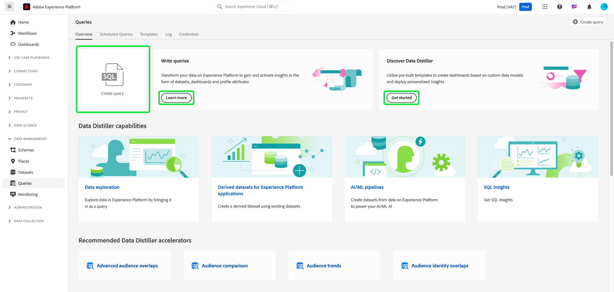

### Data Distiller の機能 {#data-distiller-capabilities}

[!UICONTROL Data Distiller capabilities] セクションには、より高度なData Distiller機能へのドキュメントリンクが用意されています。

- **[[!UICONTROL Data exploration]](../use-cases/data-exploration.md)**: SQLを使用してバッチで取り込まれたデータを検索、トラブルシューティング、検証する方法について説明します。
- **[[!UICONTROL Derived datasets for Experience Platform applications]](../data-distiller/derived-datasets/overview.md)**：派生データセットを作成して、データユーティリティを最大化する複雑で多様なユースケースをサポートする方法を説明します。
- **[[!UICONTROL AI/ML pipelines]](../data-distiller/ml-feature-pipelines/overview.md)**：好みのマシンラーニングツールの背後にある重要な概念と、マーケティングのユースケースをサポートするカスタムモデルを構築する方法について説明します。 この一連のガイドでは、Experience Platformからのデータを準備し、マシンラーニング環境でカスタムモデルをフィードする機能パイプラインを構築するために必要な手順について説明します。
- **[[!UICONTROL SQL insights]](../data-distiller/sql-insights/overview.md)**: SQLからData Distillerを使用してインサイト ダッシュボードを開発するための主な機能と必要な手順について説明します。

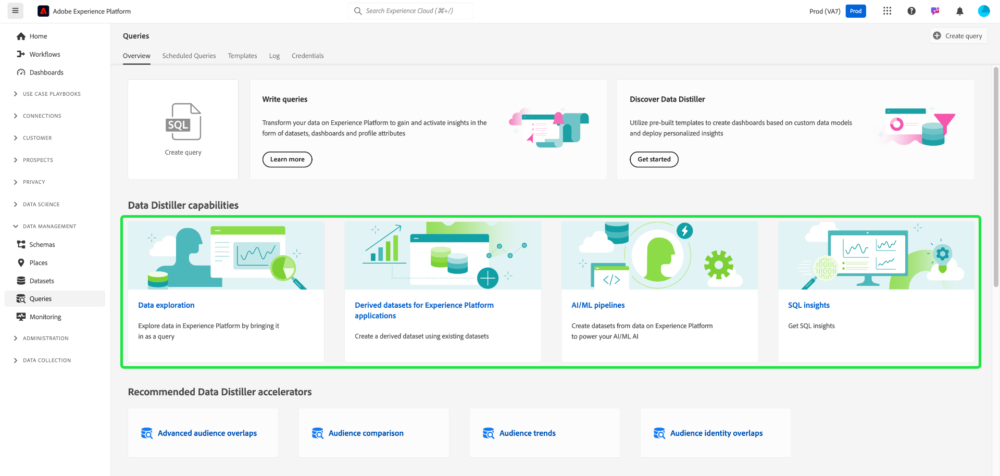

### アクセラレーター {#accelerators}

クエリワークスペースの「**[!UICONTROL Accelerators]**」タブには、一般的な分析ユースケース用にAdobeで作成され、パラメーター化されたSQL テンプレートのカタログが用意されています。 各アクセラレーターは、名前、SQL プレビュー、メタデータを含むテーブルの行として表示されます。

アクセラレーターを選択して、クエリエディターで開きます。 パラメーター値を指定し、クエリを実行して結果を生成します。 アクセラレータは読み取り専用で、Adobeによってメンテナンスされ、一貫性を確保します。 ロジックを変更するには、**[!UICONTROL Create custom template]**&#x200B;を使用して編集可能なコピーを作成します。 アクセラレータを検索、実行、スケジュール、カスタマイズする方法については、[Data Distiller アクセラレータ ](./accelerators.md) ガイドを参照してください。

### 推奨される Data Distiller アクセラレーター {#recommended-accelerators}

「概要」タブの「**[!UICONTROL Recommended Data Distiller accelerators]**」セクションでは、よく使用されるアクセラレータに素早くアクセスできます。 これらはカードとして表示され、次の2つのワークフローをサポートします。

- **ダッシュボードにリンクされたアクセラレータ**&#x200B;が、事前定義済みのビジュアライゼーションを使用してダッシュボードワークスペースで開きます。 これらは、パラメーター入力や手動でのクエリ実行を必要としません。
- **クエリベースのアクセラレータ**&#x200B;がクエリエディターで開き、パラメーター値を指定したり、クエリを実行したり、スケジュールしたりできます。

カードを選択してアクセラレーターを開きます。 このセクションを使用して、一般的なワークフローにすばやくアクセスするか、**[!UICONTROL Accelerators]** タブに移動してカタログ全体を参照します。 アクセラレータの一覧と詳細な手順については、[ アクセラレータ タブ ](./accelerators.md#discovery-paths)または[Data Distiller アクセラレータ ガイド ](./accelerators.md)を参照してください。

次のダッシュボードにリンクされたアクセラレータを使用できます。

- **[[!UICONTROL Advanced audience overlaps]](../../dashboards/sql-insights-query-pro-mode/templates/overlaps.md)**: オーディエンスセグメント間の交差を分析して、重複パターンを特定し、セグメントを絞り込みます。
- **[[!UICONTROL Audience comparison]](../../dashboards/sql-insights-query-pro-mode/templates/comparison.md)**: サイズ、構成、経時的な変化など、2つのオーディエンス間の主要な指標を比較します。
- **[[!UICONTROL Audience trends]](../../dashboards/sql-insights-query-pro-mode/templates/trends.md)**: オーディエンスのサイズとID数など、オーディエンス指標が時間の経過とともにどのように変化するかを追跡します。
- **[[!UICONTROL Audience identity overlaps]](../../dashboards/sql-insights-query-pro-mode/templates/identity-overlaps.md)**: IDの結合とセグメント化の精度をサポートするために、ID タイプがオーディエンス内でどのように重複するかを調べます。

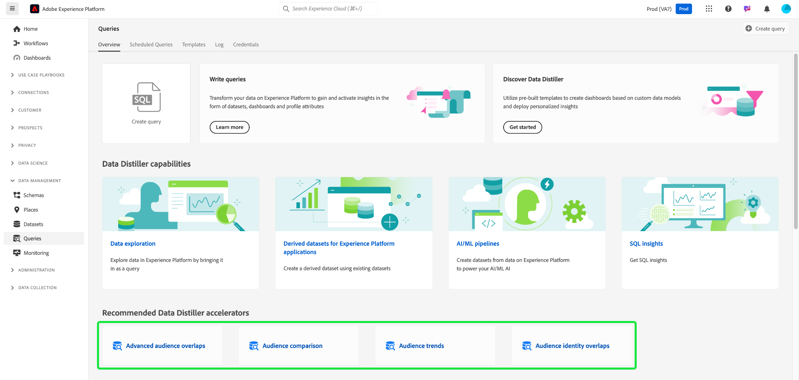

### Data Distiller の例 {#data-distiller-examples}

Select a card to open documentation guides and examples to help you make the most of data Distiller:

- **[[!UICONTROL Decile-based derived datasets]](../use-cases/deciles-use-case.md)**: Adobe Experience Platformでセグメンテーションとオーディエンス作成用の意思決定ベースの派生データセットを作成する方法について説明します。 航空会社のロイヤルティシナリオを活用して、スキーマの設計、意思決定の計算、データのランキングと集約に関するクエリ例を紹介しています。
- **[[!UICONTROL Customer lifetime value]](../use-cases/customer-lifetime-value.md)**: Real-Time CDPとカスタムダッシュボードを使用して、顧客生涯価値を追跡および可視化する方法を説明します。 これらのインサイトを活用して、新規顧客の獲得戦略を策定し、既存顧客を維持し、利益率を最大化します。
- **[[!UICONTROL Propensity score]](../use-cases/propensity-score.md)**: マシンラーニングの予測モデルを使用して傾向スコアを決定する方法を説明します。 このガイドでは、トレーニング用にデータを送信する、SQLを使用してトレーニングされたモデルを適用する、顧客の購買可能性を予測する、といったことを説明します。
- **[[!UICONTROL Consent analysis]](../../dashboards/insights-use-cases/consent-analysis.md)**: Real-Time CDP、Query Service、Data Distillerを使用して、顧客の同意を分析および追跡する方法について説明します。 このガイドでは、同意ダッシュボードの構築、セグメンテーションの改善、トレンドの追跡、コンプライアンスの確保をカバーし、信頼を構築し、パーソナライズされた体験を提供するのに役立ちます。
- **[[!UICONTROL Fuzzy match]](../use-cases/fuzzy-match.md)**: Experience Platform データで「ファジー」一致を実行して、近似一致を見つけ、データセット全体で文字列の類似性を分析する方法を説明します。 このガイドに従って、時間を節約し、データをよりアクセスしやすくしましょう。 この例では、2つの旅行代理店データセット間でホテルの部屋の属性を一致させる方法を示しており、大規模で複雑なデータセットを効率的に一致、比較、調整して、一貫性と正確性を確保する方法を示しています。

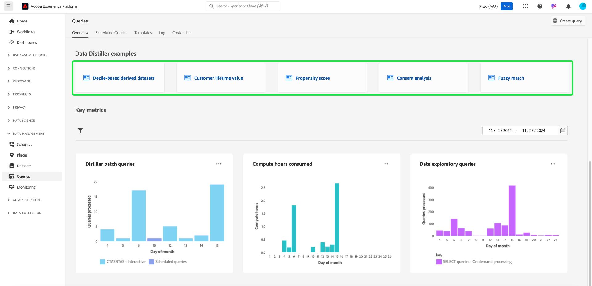

### 主要指標 {#key-metrics}

「主要指標」セクションには、クエリサービスの使用状況を監視するのに役立つ重要なデータのビジュアライゼーションが表示されます。 各グラフについて、右上の省略記号（`...`）を選択し、[!UICONTROL View more]を選択して結果の表形式で表示するか、データをCSV ファイルとしてダウンロードしてスプレッドシートで表示できます。 詳しくは、[詳細を表示ガイド ](../../dashboards/sql-insights-query-pro-mode/view-more.md)を参照してください。

#### 日付フィルターの設定 {#set-date-filter}

これらのビジュアライゼーションにグローバル日付フィルターを適用するには、フィルターアイコン（）を選択します **[!UICONTROL Filters]** ダイアログで日付範囲を調整します。 このフィルターを適用すると、表示される指標を特定の時間枠に合わせてカスタマイズし、分析の関連性を高めることができます。

#### [!UICONTROL Distiller batch queries] {#distiller-batch-queries}

[!UICONTROL Distiller batch queries] グラフには、処理済みのCTAとITAS （インタラクティブおよびスケジュール済み）のクエリの数を強調表示する、日別のクエリアクティビティの内訳が表示されます。 このグラフは、特定の日にインタラクティブなクエリが急増したり、スケジュールされたクエリの使用頻度が低かったりするなど、パターンを強調表示しています。 これらのインサイトを活用して、ピーク時のアクティビティ期間の特定、スケジュール戦略の改善、クエリ実行のバランスをとることで、パフォーマンスを最適化し、ワークフローの効率とリソースの利用率を向上させます。

#### [!UICONTROL Compute hours consumed] {#compute-hours-consumed}

[!UICONTROL Compute hours consumed] グラフは、クエリサービス操作の処理に使用される計算時間を日々の視覚化で表示します。 これらの計算時間のトレンドを使用して、リソース消費の監視、需要の高い期間の特定、クエリの実行の最適化を行い、リソースの効率的な割り当てとパフォーマンスを確保します。

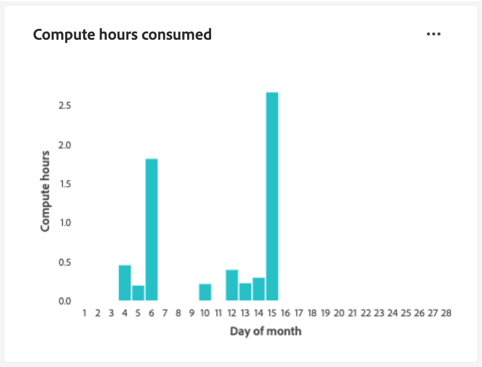

#### [!UICONTROL Data exploratory queries]

[!UICONTROL Data exploratory queries] グラフには、毎日オンデマンドで処理されたSELECT クエリの数が表示されます。 このビジュアライゼーションでは、特定の日の利用率の急増などのクエリ活動の傾向を強調表示して、データ探索の取り組みが最も活発なタイミングを把握するのに役立ちます。 これらのインサイトを活用して、クエリの使用パターンを監視し、ワークロードのバランスを取り、探索的なデータ分析のためにリソース割り当てを最適化します。 この分析により、クエリサービスの効率的な利用と、需要の多い期間の計画の改善が可能になります。

## クエリエディター

クエリエディターを使用すると、外部クライアントを使用せずにクエリを作成および実行できます。 **[!UICONTROL Create Query]**&#x200B;を選択してクエリエディターを開き、新しいクエリを作成します。 **[!UICONTROL Log]**&#x200B;または&#x200B;**[!UICONTROL Templates]** タブからクエリを選択して、クエリエディターにアクセスすることもできます。 以前に実行または保存したクエリを選択すると、クエリエディターが開き、選択したクエリのSQLが表示されます。

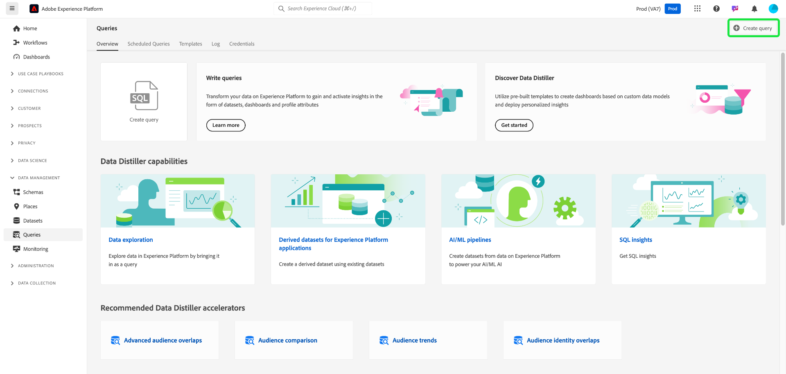

クエリエディターで入力すると、エディターはテーブル内のSQL予約語、テーブル、フィールド名を自動的に補完します。 クエリの記述が完了したら、再生アイコン（）を選択します。 クエリを実行します。 エディターの下の&#x200B;**[!UICONTROL Console]** タブには、クエリサービスが現在実行している処理が表示され、クエリが返されたタイミングが示されます。 [!UICONTROL Console]の横にある&#x200B;**[!UICONTROL Result]** タブに、クエリの結果が表示されます。 クエリエディターの使用について詳しくは、[ クエリエディターガイド ](./user-guide.md)を参照してください。

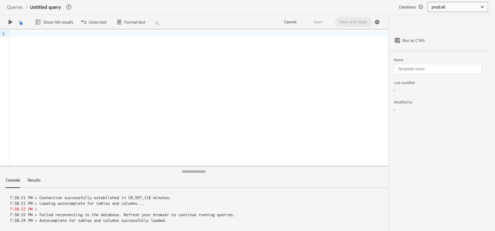

### 「結果」タブについて {#results-tab}

「[!UICONTROL Result]」タブには、実行後のクエリの表形式の出力が表示されます。 このタブを使用すると、結果を確認したり、出力を検証したり、フォローアップアクションをインターフェイスで直接実行したりできます。 このビューでは、次の操作を実行できます。

- オフライン分析用にCSV、XLSX、JSON形式で結果をダウンロードします。 [ クエリ結果のダウンロード ](./user-guide.md#download-query-results)を参照してください。
- サイズ変更可能なグリッドレイアウトで大きなテーブルや幅広のデータセットを調べるために、結果をフルスクリーンで表示します。 [ フルスクリーンで結果を表示](./user-guide.md#view-results)を参照してください。
- 結果をCSV形式でクリップボードにコピーして、スプレッドシートのアプリケーションにすばやくペーストできます。 [結果をコピー](./user-guide.md#copy-results)を参照してください。

これらの機能は、クエリエディターを離れることなく、シームレスなデータ検証、レポート、共有ワークフローをサポートするように設計されています。

### パラメーター化クエリ {#parameterized-queries}

クエリエディターでは、パラメーター化されたクエリをサポートしています。これにより、SQL ステートメントに変数を挿入し、実行時に値を動的に割り当てることができます。 この機能は、再利用可能なクエリを簡素化し、ワークフローの柔軟性を向上させるのに役立ちます。

クエリを書く際にパラメーターを定義し、クエリを実行する前に[!UICONTROL Query parameters] タブで値を割り当てることができます。 パラメータ化されたクエリは、スケジュールされたクエリや、組織全体で共有されるクエリテンプレートに特に役立ちます。

パラメーターの定義と使用方法については、[ クエリエディターのパラメーター化されたクエリ ](./parameterized-queries.md)を参照してください。

## スケジュール済みクエリ {#scheduled-queries}

既にテンプレートとして保存されているクエリは、定期的に実行するようにスケジュールできます。 クエリのスケジュールを設定する際に、実行の頻度、開始日と終了日、スケジュールされたクエリの実行日、クエリをエクスポートするデータセットを選択できます。 クエリスケジュールは、クエリエディターを使用して設定します。

UIを使用してクエリをスケジュールする方法については、[ スケジュール済みクエリ ガイド ](./user-guide.md#scheduled-queries)を参照してください。 API を使用してスケジュールを追加する方法について詳しくは、[スケジュールされたクエリのエンドポイントガイド](../api/scheduled-queries.md)を参照してください。

クエリがスケジュールされると、[!UICONTROL Scheduled Queries] タブのスケジュール済みクエリのリストに表示されます。 クエリ、実行、作成者、タイミングに関する詳細は、リストからスケジュールされたクエリを選択して確認できます。

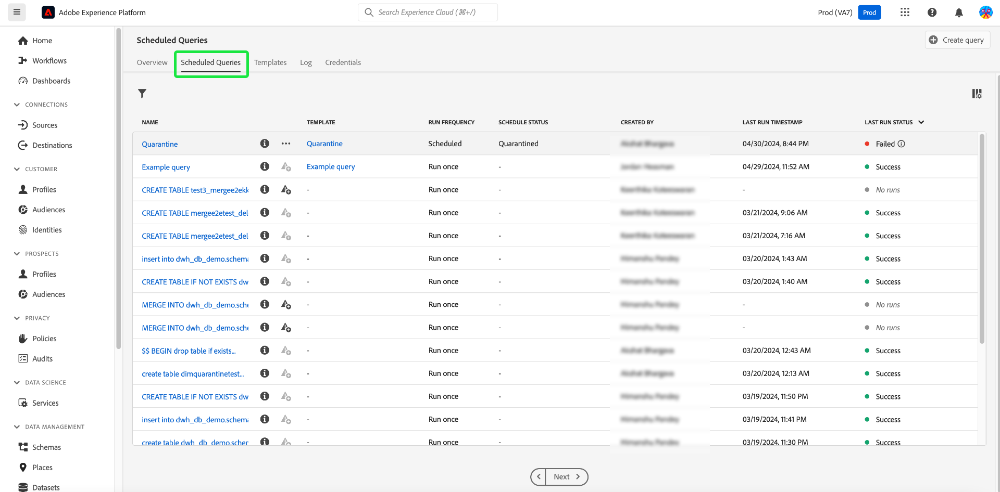

| 列 | 説明 |
| --- | --- |
| **[!UICONTROL Name]** | 名前フィールドは、テンプレート名か SQL クエリの最初の数文字のどちらかです。 クエリエディターを使用して UI から作成したクエリは、開始時に名前が付けられます。 クエリがAPIを介して作成された場合、クエリの名前は、クエリの作成に使用された最初のSQLのスニペットになります。 |
| **[!UICONTROL Template]** | クエリのテンプレート名。 テンプレート名を選択してクエリエディターに移動します。 便宜上、クエリエディターにクエリテンプレートが表示されます。 テンプレート名がない場合、行はハイフンでマークされ、クエリエディターにリダイレクトしてクエリを表示することはできません。 |
| **[!UICONTROL SQL]** | SQL クエリのスニペット。 |
| **[!UICONTROL Run frequency]** | この列は、クエリの実行頻度を示します。 指定可能な値は `Run once` と `Scheduled` です。 クエリは、実行頻度に従ってフィルタリングできます。 |
| **[!UICONTROL Created by]** | クエリを作成したユーザーの名前。 |
| **[!UICONTROL Created]** | クエリが作成されたときのタイムスタンプ（UTC 形式）。 |
| **[!UICONTROL Last run timestamp]** | クエリ実行時の最新のタイムスタンプ。 この列では、現在のスケジュールに従ってクエリが実行されたかどうかがハイライト表示されます。 |
| **[!UICONTROL Last run status]** | 最新のクエリ実行ステータス。 ステータス値は `successful`、`failed`、`in progress` のいずれかです。 |

クエリサービス UI](./monitor-queries.md)を使用してクエリを[監視する方法について詳しくは、ドキュメントを参照してください。

## テンプレート {#browse}

「**[!UICONTROL Templates]**」タブには、組織内のユーザーが保存したクエリが表示されます。 これらをクエリプロジェクトと考えると便利です。ここで保存したクエリは、まだ作成中の可能性があります。 **[!UICONTROL Templates]** タブに表示されるクエリは、以前にクエリサービスによって実行されたクエリの場合、**[!UICONTROL Log]** タブにも実行クエリとして表示されます。

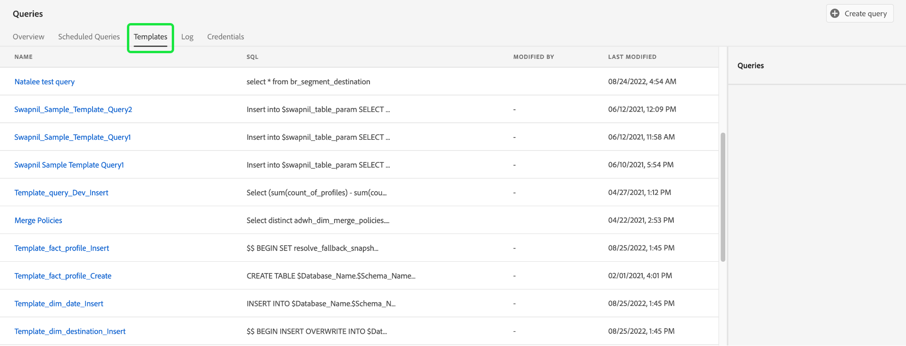

| 列 | 説明 |
| --- | --- |
| **[!UICONTROL Name]** | 名前フィールドは、ユーザーが作成したクエリ名か、SQL クエリの最初の数文字のどちらかです。 クエリエディターを使用して UI から作成したクエリは、開始時に名前が付けられます。 API を使用してクエリが作成された場合、クエリの名前は、クエリの作成に使用された最初の SQL のスニペットになります。 クエリ名を選択して、クエリエディターでクエリを開くことができます。 検索バーを使用して、クエリの[!UICONTROL Name]を検索することもできます。 検索では大文字と小文字が区別されます。 |
| **[!UICONTROL SQL]** | SQL クエリの最初の数文字。 コードの上にカーソルを置くと、完全なクエリが表示されます。 |
| **[!UICONTROL Modified by]** | 最後にクエリを変更したユーザー。 クエリサービスへのアクセス権を持つ、組織内のすべてのユーザーがクエリを変更できます。 |
| **[!UICONTROL Last modified]** | ブラウザーのタイムゾーンでの、クエリが最後に編集された日付と時間。 |

Experience Platform UIのテンプレートについて詳しくは、[ クエリテンプレート ](./query-templates.md)のドキュメントを参照してください。

## ログ {#log}

「**[!UICONTROL Log]**」タブには、以前に実行されたクエリのリストが表示されます。 デフォルトでは、ログはクエリを逆年代順にリストします。

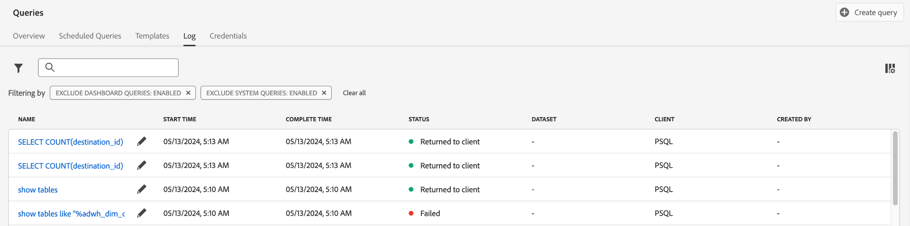

| 列 | 説明 |
| --- | --- |
| **[!UICONTROL Name]** | クエリ名。SQL クエリの最初の数文字で構成されます。 テンプレート名を選択して、その実行の[!UICONTROL Query log details] ビューを開きます。 検索バーを使用して、クエリの名前を検索できます。 検索では大文字と小文字が区別されます。 |
| **[!UICONTROL Start time]** | クエリが実行された時間。 |
| **[!UICONTROL Complete time]** | クエリの実行が完了した時間。 |
| **[!UICONTROL Status]** | クエリの現在の状態。 |
| **[!UICONTROL Dataset]** | クエリが使用する入力データセット。 データセットを選択して、入力データセットの詳細画面に移動します。 |
| **[!UICONTROL Client]** | クエリに使用されるクライアント。 |
| **[!UICONTROL Created by]** | クエリを作成した人物の名前。 |

>[!NOTE]
>
>鉛筆アイコン（）を選択します。 クエリ・ログの任意の行からクエリ・エディタに移動します。 クエリは、便利な編集のために事前入力されています。

クエリイベントによって自動的に生成されるログファイルについて詳しくは、[ クエリログのドキュメント ](./query-logs.md)を参照してください。

## 資格情報

「**[!UICONTROL Credentials]**」タブには、期限切れの資格情報と期限切れでない資格情報の両方が表示されます。 これらの資格情報を使用して外部クライアントと接続する方法について詳しくは、[資格情報ガイド](../clients/overview.md)を参照してください。

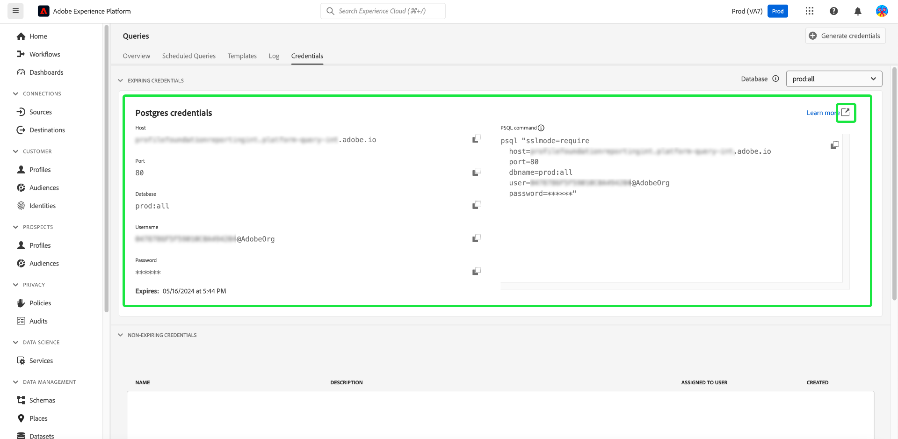

## 管理 {#admin}

「**[!UICONTROL Admin]**」タブを使用して、組織全体の同時クエリエディターセッションを監視および管理します。 この機能は管理者向けであり、クエリの作成や実行には必要ありません。

**[!UICONTROL Admin]** タブから、管理者はサンドボックス間でアクティブなセッションを表示し、アイドルセッションを終了して共有容量を解放できます。 このアクションは、アクティブに実行されているクエリを中断しません。 詳細な手順と権限の要件については、[ クエリサービスのセッション管理ガイド ](session-management.md)を参照してください。

## 次の手順

これで、[!DNL Experience Platform]のクエリサービス ユーザーインターフェイスを理解できました。クエリエディターにアクセスして、独自のクエリプロジェクトの作成を開始し、組織内の他のユーザーと共有できます。 クエリエディターでのクエリの作成と実行について詳しくは、[クエリエディターのユーザーガイド](./user-guide.md)を参照してください。
