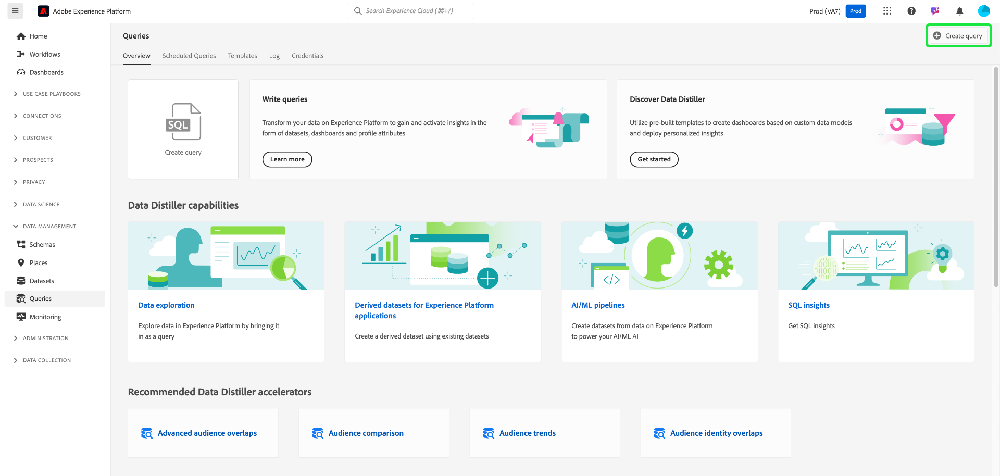
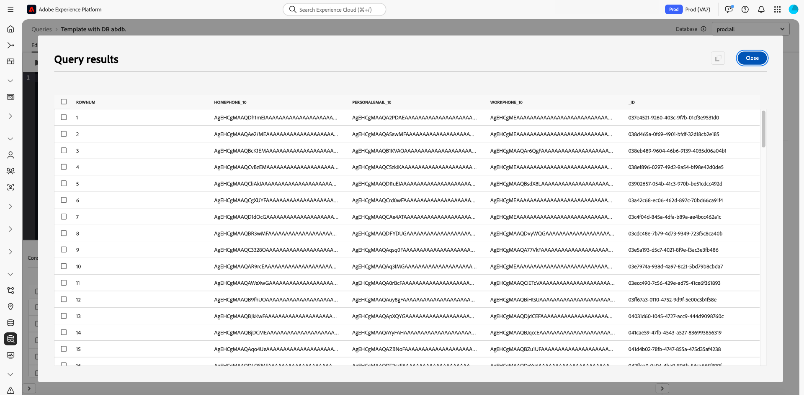

# クエリサービス UI ガイド

Adobe Experience Platform クエリサービスは、クエリの書き込みと実行、以前に実行したクエリの表示、組織内のユーザーが保存したクエリへのアクセスに使用できるユーザーインターフェイスを提供します。 [Adobe Experience Platform](https://platform.adobe.com) 内の UI にアクセスするには、左側のナビゲーションで「**[!UICONTROL クエリ]**」を選択します。 [!UICONTROL &#x200B; クエリ &#x200B;] 概要 [!UICONTROL &#x200B; が表示さ &#x200B;] ます。

## 概要 {#overview}

[!UICONTROL &#x200B; 概要 &#x200B;] タブを使用すると、クエリやデータDistillerテンプレートを使用する際の効率的なエントリポイントが得られます。 ここでは、クエリの記述、データセットの調査、オーディエンスデータの分析に必要なすべての機能にアクセスして、データ分析とオーディエンスインサイトのスムーズなワークフローを確保できます。 この概要では、Data Distillerで実現できることを確認し、クエリサービスの使用状況に関する主要指標を見つけます。

### メインパネル {#main-panels}

[!UICONTROL &#x200B; 概要 &#x200B;] ページには、開始に役立つ以下の主な節が含まれています。

1. **[!UICONTROL クエリを作成]** を選択すると、クエリエディターにすばやく移動し、新しいクエリを書き込んで実行できます。
2. **[!UICONTROL クエリの書き込み]** 方法に関する詳細なドキュメントを表示するには、「**[!UICONTROL 詳細情報]**」を選択します。
3. **[!UICONTROL Data Distillerの確認]** セクションで **[!UICONTROL 基本を学ぶ]** を選択して、Data Distillerの概要を開き、使用可能な機能について確認してください。

### Data Distiller の機能 {#data-distiller-capabilities}

[!UICONTROL Data Distillerの機能 &#x200B;] の節では、より高度な Data Distiller機能へのドキュメントリンクを提供しています。

- **[[!UICONTROL データの調査]](../use-cases/data-exploration.md)**:SQL を使用して取り込んだバッチデータを調査、トラブルシューティングおよび検証する方法について説明します。
- **[[!UICONTROL Experience Platform アプリケーション用の派生データセット]](../data-distiller/derived-datasets/overview.md)**：派生データセットを作成して、データユーティリティを最大化する複雑で多様なユースケースをサポートする方法について説明します。
- **[[!UICONTROL AI/ML パイプライン]](../data-distiller/ml-feature-pipelines/overview.md)**：優先する機械学習ツールの背後にある重要な概念と、マーケティングのユースケースをサポートするカスタムモデルの構築方法について説明します。 このシリーズのガイドでは、機械学習環境でカスタムモデルにフィードするExperience Platformのデータを準備する機能パイプラインを構築するために必要な手順を説明します。
- **[[!UICONTROL SQL インサイト]](../data-distiller/sql-insights/overview.md)**:Data Distillerを使用して SQL からインサイトダッシュボードを作成するために必要な、主な機能と手順について説明します。

### 推奨される Data Distiller アクセラレーター {#recommended-accelerators}

クイックリンクを選択して、関連する Data Distiller ダッシュボード [!UICONTROL &#x200B; テンプレート &#x200B;] に移動します。 各アクセラレーターは、オーディエンスデータの分析、セグメント化の最適化、ターゲティング戦略の強化に役立つ強力なツールとビジュアライゼーションを提供します。

- **[[!UICONTROL 高度なオーディエンスの重複]](../../dashboards/sql-insights-query-pro-mode/templates/overlaps.md)**：このダッシュボードでは、複数のオーディエンスセグメント間のオーディエンスの交差を分析し、有益なインサイトを明らかにし、セグメント化戦略を最適化できます。 また、オフラインでの分析やレポート作成を目的としてインサイトをエクスポートすることもできます。
- **[[!UICONTROL オーディエンス比較]](../../dashboards/sql-insights-query-pro-mode/templates/comparison.md)**：このダッシュボードでは、主要なオーディエンス指標を並べて比較およびコントラスト化し、2 つのオーディエンスグループを詳細に分析できます。 これらのインサイトは、オーディエンスサイズ、成長およびその他の主要なパフォーマンス指標を理解するのに役立ち、セグメント化を調整し、データ駆動型の決定でターゲティング戦略を最適化できます。
- **[[!UICONTROL オーディエンスの傾向]](../../dashboards/sql-insights-query-pro-mode/templates/trends.md)**: [!UICONTROL &#x200B; オーディエンスの傾向 &#x200B;] ダッシュボードを使用すると、オーディエンスの増加、ID 数、単一 ID プロファイルなどの主要指標を通じて、オーディエンスが時間の経過と共にどのように進化するかを視覚化できます。 トレンドを追跡して、オーディエンスの行動に関する貴重なインサイトを引き出し、セグメント化の調整、エンゲージメントの強化、より効果的なキャンペーンのためのターゲティング戦略の最適化を行えるようにします。
オーディエンス指標を経時的に追跡して、オーディエンスサイズ、ID の増加および全体的なエンゲージメントの変化を監視します。
- **[[!UICONTROL オーディエンス ID の重複]](../../dashboards/sql-insights-query-pro-mode/templates/identity-overlaps.md)**：オーディエンス ID の重複ダッシュボードを使用すると、選択したオーディエンス内での ID の重複を分析できます。 ビジュアライゼーションと表形式のデータは、ID のステッチを最適化し、冗長性を軽減し、セグメント化を改善するためのインサイトを提供します。 これらのインサイトにより、より効果的なターゲティング、パーソナライゼーションの強化、顧客インタラクションの合理化が可能になります。

### Data Distiller の例 {#data-distiller-examples}

カードを選択すると、データDistillerを最大限に活用するのに役立つドキュメントガイドと例が開きます。

- **[[!UICONTROL デシルベースの派生データセット]](../use-cases/deciles-use-case.md)**:Adobe Experience Platformでセグメント化とオーディエンス作成用にデシルベースの派生データセットを作成する方法を説明します。 航空会社のロイヤルティシナリオを使用して、スキーマのデザイン、十分位数の計算、データのランキングおよび集計のクエリ例について説明します。
- **[[!UICONTROL 顧客の生涯価値]](../use-cases/customer-lifetime-value.md)**:Real-Time CDPとカスタムダッシュボードを使用して、顧客の生涯価値を追跡および視覚化する方法について説明します。 これらのインサイトを使用して、新規顧客を獲得するための戦略を開発し、既存の顧客を保持し、利益率を最大化します。
- **[[!UICONTROL 傾向スコア]](../use-cases/propensity-score.md)**：機械学習予測モデルを使用して傾向スコアを決定する方法を説明します。 このガイドでは、トレーニング用のデータ送信、SQL を使用したトレーニング済みモデルの適用、および顧客購入の可能性の予測について説明します。
- **[[!UICONTROL 同意分析]](../../dashboards/insights-use-cases/consent-analysis.md)**:Real-Time CDP、クエリサービス、Data Distillerを使用して、顧客の同意を分析およびトラッキングする方法について説明します。 このガイドでは、同意ダッシュボードの構築、セグメント化の絞り込み、傾向の追跡およびコンプライアンスの確保について説明し、パーソナライズされたエクスペリエンスの構築と提供を支援します。
- **[[!UICONTROL あいまい一致]](../use-cases/fuzzy-match.md)**:Experience Platform データに対して「あいまい」一致を実行して、近似の一致を見つけ、データセット間の文字列の類似性を分析する方法を説明します。 このガイドに従うと、時間を節約し、データにアクセスしやすくなります。 この例では、2 つの旅行代理店データセット間でホテルの部屋の属性を照合する方法を示しており、大規模で複雑なデータセットについて、一貫性と精度を確保するための効率的な照合、比較および調整を行う方法を示しています。

### 主要指標 {#key-metrics}

「主要指標」セクションには、クエリサービスの使用状況を監視するのに役立つ重要なデータのビジュアライゼーションが表示されます。 各グラフでは、右上の省略記号（`...`）に続いて [!UICONTROL &#x200B; さらに表示 &#x200B;] を選択して、結果の表形式を表示するか、データを CSV ファイルとしてダウンロードしてスプレッドシートに表示できます。 詳しくは、[ 詳細を表示ガイド ](../../dashboards/sql-insights-query-pro-mode/view-more.md) を参照してください。

#### 日付フィルターの設定 {#set-date-filter}

これらのビジュアライゼーションにグローバル日付フィルターを適用するには、フィルターアイコン（）を選択し、**[!UICONTROL フィルター]** ダイアログで日付範囲を調整します。 このフィルターを適用すると、表示される指標を特定の時間枠に合わせて調整し、分析の関連性を高めることができます。

#### [!UICONTROL Distiller バッチクエリ &#x200B;] {#distiller-batch-queries}

[!UICONTROL Distiller バッチクエリ &#x200B;] グラフでは、クエリアクティビティの日別分類が提供され、処理された CTAS および ITAS （インタラクティブおよびスケジュール済み）クエリの数が強調表示されます。 このグラフには、特定の日にインタラクティブクエリの急激な増加や、スケジュールされたクエリの使用頻度が低いなどのパターンが示されています。 これらのインサイトを使用して、ピークアクティビティ期間を特定し、スケジュール戦略を調整し、クエリ実行のバランスを取ってワークフロー効率とリソース使用率を向上させることによってパフォーマンスを最適化します。

#### [!UICONTROL &#x200B; 消費時間を計算 &#x200B;] {#compute-hours-consumed}

[!UICONTROL &#x200B; 消費時間を計算 &#x200B;] グラフでは、クエリサービス操作の処理に使用される計算時間の日別ビジュアライゼーションが提供されます。 これらの計算時間のトレンドを使用して、リソース消費を監視し、需要の高い期間を特定し、クエリの実行を最適化して、効率的なリソース割り当てとパフォーマンスを確保します。

#### [!UICONTROL &#x200B; データ調査クエリ &#x200B;]

[!UICONTROL &#x200B; データ探索的クエリ &#x200B;] グラフには、1 日あたりにオンデマンドで処理される SELECT クエリの数が表示されます。 このビジュアライゼーションでは、特定の日の使用のスパイクなど、クエリアクティビティのトレンドを強調表示し、データ調査の取り組みが最もアクティブなタイミングを理解するのに役立ちます。 これらのインサイトを使用して、クエリの使用パターンを監視し、ワークロードを分散し、探索的データ分析のためのリソース割り当てを最適化します。 この分析により、クエリサービスをより効率的に使用し、需要の多い期間の計画を改善できます。

## クエリエディター

外部クライアントを使用せずにクエリを書き込んだり、実行したりするには、クエリエディターを使用します。 「**[!UICONTROL クエリを作成]**」を選択してクエリエディターを開き、新しいクエリを作成します。 また、「**[!UICONTROL ログ]**」タブまたは **[!UICONTROL テンプレート]** タブからクエリを選択して、クエリエディターにアクセスすることもできます。 以前に実行または保存したクエリを選択すると、クエリエディターが開き、選択したクエリの SQL が表示されます。

クエリエディターに入力すると、テーブル内の SQL 予約語、テーブル、およびフィールド名が自動的に入力されます。 クエリの作成が完了したら、再生アイコン（）を選択してクエリを実行します。 エディターの下にある「**[!UICONTROL コンソール]**」タブには、クエリサービスが現在何を実行しているか、およびクエリがいつ返されたかが表示されます。 [!UICONTROL &#x200B; コンソール &#x200B;]&#x200B;**の横にある「**&#x200B;[!UICONTROL &#x200B; 結果 &#x200B;] タブには、クエリ結果が表示されます。 クエリエディターの使用について詳しくは、[ クエリエディターガイド ](./user-guide.md) を参照してください。

### クエリ結果のダウンロード {#download-query-results}

>[!AVAILABILITY]
>
>ダウンロード機能は、Data Distiller アドオンを使用しているお客様のみが利用できます。 Data Distillerについて詳しくは、Adobe担当者にお問い合わせください。

クエリエディターのユーザーインターフェイスからクエリ結果を直接ダウンロードできるようになりました。 クエリが正常に実行されたら、出力を CSV、XLSX または JSON ファイル形式でダウンロードできます。 この機能により、オフラインでの分析、レポートおよび Excel ベースのプロセスのクエリ結果にすぐにアクセスできるようになるので、マーケティングチームや分析チームのワークフローが合理化されます。

クエリ結果をダウンロードするには、クエリエディター **[!UICONTROL 結果]** タブの右上隅にある「**[!UICONTROL ダウンロード]**」を選択します。 次に、ドロップダウンメニューから **[!UICONTROL CSV]**、**[!UICONTROL XLSX]** または **[!UICONTROL JSON]** を選択します。 ファイルがローカルマシンに自動的にダウンロードされます。

>[!NOTE]
>
>「**[!UICONTROL ダウンロード]**」ボタンは、クエリが結果を返す場合にのみ表示されます。 レコードが返されない場合、「結果 **タブに** 結果がありません」というメッセージが表示され、ダウンロードオプションが無効になります。

>[!NOTE]
>
>Excel で CSV ファイルを開くと、次の警告が表示される場合があります。  「データが失われる可能性があります。 このブックをコンマ区切り（.csv）形式で保存すると、一部の機能が失われることがあります。 これらの機能を保持するには、Excel ファイル形式で保存します。」  また、日付と時刻の形式は、ファイルタイプによって異なる場合があることに注意してください。 CSV ファイルはクエリ結果に表示される形式を保持しますが、XLSX ファイルは Excel で自動的にローカライズされた形式を適用できます。

### 結果を全画面で表示 {#view-results}

クエリが正常に実行されたら、「**[!UICONTROL 結果]**」タブの **[!UICONTROL 結果を表示]** を選択して、結果を表形式でフルスクリーン表示で開きます。

フルスクリーン表示では、出力がサイズ変更可能なグリッドで表示されるので、大きなデータセットの確認や、列をまたいだスキャンが容易になります。 このプレビューモードは、幅の広いテーブルを分析する場合や、行レベルの詳細を確認する場合に特に役立ちます。

>[!NOTE]
>
>プレビューは読み取り専用で、クエリやデータセットは変更されません。

### 結果をコピー {#copy-results}

クエリエディターの拡張コピー機能を使用すると、クエリ結果をコンマ区切り値（CSV）ですばやくコピーできます。 コピーしたデータを Excel などのスプレッドシートアプリケーションに簡単に貼り付けて、さらに分析できます。 この機能により、読みやすさが向上し、形式が保持され、サードパーティのツールを使用せずに検証およびレポートワークフローが効率化されます。

「[!UICONTROL &#x200B; 結果 &#x200B;]」タブまたは結果のフルスクリーンのプレビューから、クエリ結果をコピーできます。 「**[!UICONTROL 結果]**」タブで、コピーアイコン（）を選択して、すべてのクエリ結果をクリップボードにコピーします。 「クエリエディターの結果」タブで、個々の行を選択するか、チェックボックスの列見出しを使用してすべての行を選択します。 1 つの行を選択してコピーアイコンを有効にします。

または、「**[!UICONTROL 結果を表示]**」を選択して、フルスクリーンプレビューを開きます。 このダイアログから、個々の行を選択するか、左上隅のチェックボックスを使用してすべての行を選択してから、コピーアイコン（）を選択して、選択したデータをコピーします。

## スケジュール済みクエリ {#scheduled-queries}

テンプレートとして既に保存されているクエリは、定期的に実行するようにスケジュールできます。 クエリをスケジュールする際に、実行頻度、開始日と終了日、スケジュールされたクエリが実行される曜日およびクエリのエクスポート先のデータセットを選択できます。 クエリスケジュールは、クエリエディターを使用して設定します。

UI を使用してクエリをスケジュールする方法については、[ スケジュールされたクエリガイド ](./user-guide.md#scheduled-queries) を参照してください。 API を使用してスケジュールを追加する方法について詳しくは、[スケジュールされたクエリのエンドポイントガイド](../api/scheduled-queries.md)を参照してください。

クエリがスケジュールされると、「[!UICONTROL &#x200B; スケジュール済みクエリ &#x200B;] タブのスケジュール済みクエリのリストに表示されます。 リストからスケジュール済みクエリを選択すると、クエリ、実行、作成者およびタイミングに関する詳細を確認できます。

| 列 | 説明 |
| --- | --- |
| **[!UICONTROL 名前]** | 名前フィールドは、テンプレート名か SQL クエリの最初の数文字のどちらかです。 クエリエディターを使用して UI から作成したクエリは、開始時に名前が付けられます。API を使用してクエリが作成された場合、クエリの名前は、クエリの作成に使用された最初の SQL のスニペットになります。 |
| **[!UICONTROL テンプレート]** | クエリのテンプレート名。 テンプレート名を選択してクエリエディターに移動します。 便宜上、クエリエディターにクエリテンプレートが表示されます。 テンプレート名がない場合、行はハイフンでマークされ、クエリエディターにリダイレクトしてクエリを表示することはできません。 |
| **[!UICONTROL SQL]** | SQL クエリのスニペット。 |
| **[!UICONTROL 実行頻度]** | この列は、クエリの実行が設定されるケイデンスを示します。 指定可能な値は `Run once` と `Scheduled` です。クエリは、実行頻度に従ってフィルタリングできます。 |
| **[!UICONTROL 作成者]** | クエリを作成したユーザーの名前。 |
| **[!UICONTROL 作成日]** | クエリが作成されたときのタイムスタンプ（UTC 形式）。 |
| **[!UICONTROL 前回実行されたタイムスタンプ]** | クエリ実行時の最新のタイムスタンプ。 この列では、現在のスケジュールに従ってクエリが実行されたかどうかがハイライト表示されます。 |
| **[!UICONTROL 前回の実行ステータス]** | 最新のクエリ実行ステータス。 ステータス値は `successful`、`failed`、`in progress` のいずれかです。 |

[ クエリサービス UI を使用してクエリを監視する ](./monitor-queries.md) 方法について詳しくは、ドキュメントを参照してください。

## テンプレート {#browse}

「**[!UICONTROL テンプレート]**」タブには、組織のユーザーによって保存されたクエリが表示されます。これらをクエリプロジェクトと考えると便利です。ここで保存したクエリは、まだ作成中の可能性があります。「**[!UICONTROL テンプレート]**」タブに表示されるクエリは、「**[!UICONTROL ログ]**」タブに実行クエリとしても表示されます（以前にクエリサービスによって実行されている場合）。

| 列 | 説明 |
| --- | --- |
| **[!UICONTROL 名前]** | 名前フィールドは、ユーザーが作成したクエリ名か、SQL クエリの最初の数文字のどちらかです。クエリエディターを使用して UI から作成したクエリは、開始時に名前が付けられます。API を使用してクエリが作成された場合、クエリの名前は、クエリの作成に使用された最初の SQL のスニペットになります。クエリ名を選択して、クエリエディターでクエリを開くことができます。 検索バーを使用して、クエリの[!UICONTROL 名前]で検索することもできます。検索では大文字と小文字が区別されます。 |
| **[!UICONTROL SQL]** | SQL クエリの最初の数文字。コードの上にカーソルを置くと、完全なクエリが表示されます。 |
| **[!UICONTROL 変更者]** | 最後にクエリを変更したユーザー。クエリサービスへのアクセス権を持つ、組織内のすべてのユーザーがクエリを変更できます。 |
| **[!UICONTROL 最終変更日]** | ブラウザーのタイムゾーンでの、クエリが最後に編集された日付と時間。 |

Experience Platform UI のテンプレートについて詳しくは、[ クエリテンプレート ](./query-templates.md) のドキュメントを参照してください。

## ログ {#log}

「**[!UICONTROL ログ]**」タブには、以前に実行されたクエリのリストが表示されます。デフォルトでは、ログはクエリを逆年代順にリストします。

| 列 | 説明 |
| --- | --- |
| **[!UICONTROL 名前]** | クエリ名。SQL クエリの最初の数文字で構成されます。テンプレート名を選択して、その実行の [!UICONTROL &#x200B; クエリログの詳細 &#x200B;] ビューを開きます。 検索バーを使用して、クエリ名で検索できます。 検索では大文字と小文字が区別されます。 |
| **[!UICONTROL 開始時刻]** | クエリが実行された時刻。 |
| **[!UICONTROL 完了時間]** | クエリの実行完了時間。 |
| **[!UICONTROL ステータス]** | クエリの現在の状態。 |
| **[!UICONTROL データセット]** | クエリが使用する入力データセット。データセットを選択して、入力データセットの詳細画面に移動します。 |
| **[!UICONTROL クライアント]** | クエリに使用されるクライアント。 |
| **[!UICONTROL 作成者]** | クエリを作成した人物の名前。 |

>
>
>鉛筆アイコン（）を選択し、クエリログの任意の行からクエリエディターに移動します。 クエリは、編集に便利なように事前設定されています。

クエリイベントによって自動生成されるログファイルについて詳しくは、[ クエリログのドキュメント ](./query-logs.md) を参照してください。

## 資格情報

「**[!UICONTROL 資格情報]**」タブには、有効期限のある資格情報と有効期限のない資格情報の両方が表示されます。これらの資格情報を使用して外部クライアントと接続する方法について詳しくは、[資格情報ガイド](../clients/overview.md)を参照してください。

## 次の手順

これで [!DNL Experience Platform] のクエリサービスのユーザーインターフェイスをよく理解したので、次に、クエリエディターにアクセスして、独自のクエリプロジェクトの作成を開始し、組織内の他のユーザーと共有することができます。 クエリエディターでのクエリの作成と実行について詳しくは、[クエリエディターのユーザーガイド](./user-guide.md)を参照してください。
