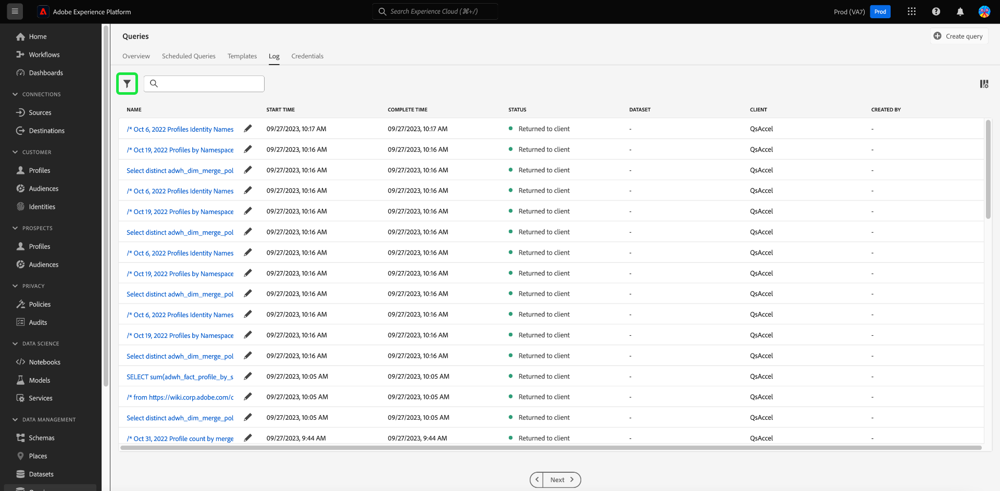

# クエリログ

>[!IMPORTANT]
>
>一部のクエリログ機能は、現在、限定的なリリースになっており、すべてのお客様が利用できるわけではありません。 UI の表示が少し異なる場合がありますが、編集アイコンは表示されません。 また、クエリ名を選択するプロセスによって、 [!UICONTROL クエリログの詳細] 表示。

Adobe Experience Platformは、API と UI の両方を通じて発生するすべてのクエリイベントのログを保持しています。 この情報は、クエリサービスの UI の [!UICONTROL ログ] タブをクリックします。

ログファイルは任意のクエリイベントによって自動的に生成され、使用された SQL、クエリのステータス、所要時間、前回の実行時間などの情報が含まれます。 クエリログデータは、非効率なクエリや問題のクエリのトラブルシューティングに役立つ強力なツールとして使用できます。 より包括的なログ情報は、監査ログ機能の一部として保持され、 [監査ログドキュメント](../../landing/governance-privacy-security/audit-logs/overview.md).

## クエリログを確認する

クエリログを確認するには、 [!UICONTROL クエリ] クエリサービスワークスペースに移動して「 」を選択します。 [!UICONTROL ログ] を選択します。

## カスタマイズと検索 {#customize-and-search}

クエリサービスログは、カスタマイズ可能なテーブル形式で表示されます。 テーブルの列をカスタマイズするには、設定アイコン () をクリックします。 A [!UICONTROL テーブルをカスタマイズ] 各列を選択解除できるダイアログが表示されます。

また、検索フィールドにテンプレート名を入力することで、特定のクエリテンプレートに関連するログを検索することもできます。

A [各ログテーブル列の説明](./overview.md#log) は、「クエリサービスの概要」の「ログ」セクションにあります。

## ログデータを検出

各行は、クエリテンプレートに関連付けられたクエリ実行のログデータを表します。 テーブルから任意の行を選択し、その実行のログデータを右側のサイドバーに表示します。

ログの詳細パネルで、新しい出力データセットを選択し、実行で使用された SQL クエリ全体を表示またはコピーできます。

>[!IMPORTANT]
>
>一部のクエリログ機能は、現在、限定的なリリースになっており、すべてのお客様が利用できるわけではありません。

また、クエリテンプレート名を [!UICONTROL 名前] 列を使用して、 [!UICONTROL クエリログの詳細] 表示。

>[!NOTE]
>
>API を使用してクエリが作成され、初期化中にテンプレート名が指定されなかった場合は、代わりに SQL クエリの最初の 10 文字が表示されます。

## ログを編集 {#edit-logs}

各行のテンプレート名または SQL スニペットの横には鉛筆アイコン () を使用して、クエリエディターに移動できます。 次に、編集用にエディターにクエリが事前入力されます。

## ログのフィルタリング {#filter-logs}

様々な設定に基づいてクエリログのリストをフィルタリングできます。 フィルターアイコン () をクリックして、左側のパネルで一連のフィルターオプションを開きます。

使用可能なフィルターのリストが表示されます。

次の表は、各フィルターの説明を示しています。

| フィルター | 説明 |
| ------ | ----------- |
| [!UICONTROL ダッシュボードクエリの除外] | このチェックボックスはデフォルトで有効になっており、インサイトの生成に使用されるクエリによって生成されたログは除外されます。 これらのクエリはシステムで生成され、監視、管理、トラブルシューティングに必要なユーザー生成ログの記録が難読化されます。 システムで生成されたログを表示するには、このチェックボックスをオフにします。 |
| [!UICONTROL 開始日] | 特定の期間に作成されたクエリをログにフィルターするには、 [!UICONTROL 開始] および [!UICONTROL 終了] 日付： [!UICONTROL 開始日] 」セクションに入力します。 |
| [!UICONTROL 完了日] | 特定の期間に完了したクエリをログにフィルターするには、 [!UICONTROL 開始] および [!UICONTROL 終了] 日付： [!UICONTROL 完了日] 」セクションに入力します。 |
| [!UICONTROL ステータス] | に基づいてログをフィルタリングするには [!UICONTROL ステータス] クエリで、適切なラジオボタンを選択します。 使用可能なオプションは次のとおりです。 [!UICONTROL 送信済み], [!UICONTROL 処理中], [!UICONTROL 成功]、および [!UICONTROL 失敗]. 一度に 1 つのステータス条件に基づいてログをフィルタリングできます。 |
| [!UICONTROL クライアント] | 使用するクエリクライアントに基づいてログをフィルタリングするには、次のいずれかの受け入れ可能な値をフリーテキストフィールドに入力します。 `API`, `Adobe Query Service UI`または `QsAccel`. |
| [!UICONTROL マイクエリ] | 以下を使用します。 [!UICONTROL マイクエリ] を切り替えて、自分が実行したクエリのログをフィルタリングします。 |
| [!UICONTROL クエリログ ID] | クエリの一意のログ ID に基づいてフィルタリングするには、自由テキストフィールドにログ ID を入力します。 この情報は、 [!UICONTROL ログの詳細]. |

適用されたフィルターは、フィルターされたログ結果の上に表示されます。

## 次の手順

このドキュメントでは、クエリサービス UI でのクエリログのアクセス方法と使用方法について、より深く理解しています。

クエリサービスの機能について詳しくは、[UI の概要](./overview.md)または [Query Service API ガイド](../api/getting-started.md)を参照してください。

詳しくは、 [クエリドキュメントを監視](./monitor-queries.md) を参照して、クエリサービスが、スケジュールされたクエリの実行をよりよく表示する方法を確認してください。
