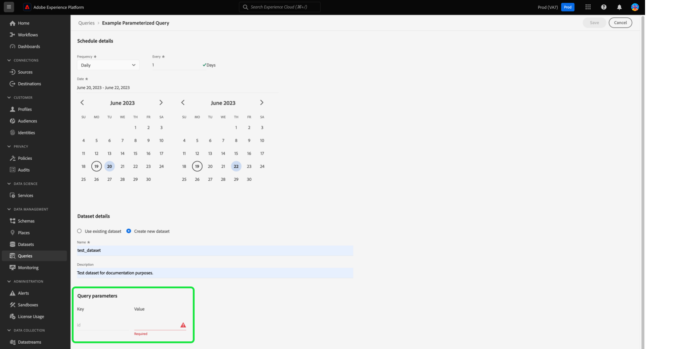

# クエリスケジュール

クエリスケジュールを作成して、クエリの実行を自動化できます。 スケジュールされたクエリは、カスタムサイクルで実行され、頻度、日付、時間に基づいてデータを管理します。 必要に応じて、結果に使用する出力データセットを選択することもできます。 テンプレートとして保存したクエリは、クエリエディターからスケジュールできます。

>[!IMPORTANT]
>
>既に作成および保存されているクエリにのみスケジュールを追加できます。

スケジュールされたクエリが「」のリストに追加されます [!UICONTROL スケジュール済みクエリ] タブ。 そのワークスペースから、UI を使用して、スケジュールされたすべてのクエリジョブのステータスを監視できます。 日 [!UICONTROL スケジュール済みクエリ] タブ クエリの実行に関する重要な情報を見つけたり、アラートを購読したりできます。 使用可能な情報には、ステータス、スケジュールの詳細、実行が失敗した場合のエラーメッセージ/コードが含まれます。 を参照してください。 [スケジュール済みクエリドキュメントの監視](./monitor-queries.md) を参照してください。

このワークフローでは、クエリサービス UI のスケジュールプロセスについて説明します。 API を使用してスケジュールを追加する方法について詳しくは、[スケジュールされたクエリのエンドポイントガイド](../api/scheduled-queries.md)を参照してください。

## クエリスケジュールの作成 {#create-schedule}

クエリをスケジュールするには、次のいずれかからクエリテンプレートを選択します [!UICONTROL テンプレート] tab キーまたは [!UICONTROL Template] の列 [!UICONTROL スケジュール済みクエリ] タブ。 テンプレート名を選択すると、クエリエディターに移動します。

クエリエディターから保存済みクエリにアクセスする場合は、クエリのスケジュールを作成するか、詳細パネルからクエリのスケジュールを表示できます。

>[!TIP]
>
>を選択 **[!UICONTROL スケジュールを表示]** スケジュールワークスペースに移動し、スケジュールされたクエリの実行を一目で確認できます。

![を使用したクエリエディター [!UICONTROL スケジュールを表示] および [!UICONTROL スケジュールを追加] ハイライト表示](../images/ui/query-schedules/view-add-schedule.png)

を選択 **[!UICONTROL スケジュールを追加]** に移動します。 [スケジュールの詳細ページ](#schedule-details).

または、を選択します **[!UICONTROL スケジュール]** tab キーを使用すると、クエリの名前を削除できます。

スケジュールワークスペースが表示されます。UI に、テンプレートが関連付けられているスケジュールされた実行のリストが表示されます。 「**[!UICONTROL スケジュールを追加]**」を選択して、スケジュールを作成します。

### スケジュールの詳細を追加 {#schedule-details}

スケジュールの詳細ページが表示されます。このページでは、スケジュールされたクエリの様々な詳細を編集できます。 詳細には、 [スケジュールされたクエリの頻度と平日](#scheduled-query-frequency) 実行、開始日と終了日、結果の書き出し先のデータセット、および [クエリステータスアラート](#alerts-for-query-status).

#### スケジュールされたクエリの頻度 {#scheduled-query-frequency}

**[!UICONTROL 頻度]**&#x200B;では、次のオプションが選択できます。

- **[!UICONTROL 毎時]**：スケジュールされたクエリは、1 時間ごとに、選択した期間で実行されます。
- **[!UICONTROL 毎日]**：スケジュールされたクエリは、 X 日ごとに、選択した時間、期間に実行されます。選択した時間は、ローカルタイムゾーンではなく、**UTC**&#x200B;であることに注意してください。
- **[!UICONTROL 毎週]**：選択したクエリは、選択した曜日、時間および期間に実行されます。選択した時間は、ローカルタイムゾーンではなく、**UTC**&#x200B;であることに注意してください。
- **[!UICONTROL 毎月]**：選択したクエリは、毎月、選択した日、時間および期間に実行されます。選択した時間は、ローカルタイムゾーンではなく、**UTC**&#x200B;であることに注意してください。
- **[!UICONTROL 毎年]**：選択したクエリは、毎年、選択した日、月、時間および期間に実行されます。選択した時間は、ローカルタイムゾーンではなく、**UTC**&#x200B;であることに注意してください。

### データセットの詳細を入力 {#dataset-details}

既存のデータセットにデータを追加するか、新しいデータセットを作成してデータを追加することで、クエリ結果を管理します。

を選択 **[!UICONTROL 作成して新しいデータセットに追加]** 初めてクエリを実行するときにデータセットを作成する場合は、をクリックします。 その後の実行では、引き続きそのデータセットにデータが挿入されます。 最後に、データセットの名前と説明を入力します。

>[!IMPORTANT]
>
> 既存のデータセットを使用または新しいデータセットを作成する際は、データセットは既に設定されているため、`INSERT INTO` または `CREATE TABLE AS SELECT` をクエリの一部として含める必要は&#x200B;**ありません**。`INSERT INTO` または `CREATE TABLE AS SELECT` をスケジュールされたクエリの一部として含めた場合、エラーが発生します。

![データセットの詳細とスケジュールの詳細パネル [!UICONTROL 作成して新しいデータセットに追加] ハイライト表示されたオプション。](../images/ui/query-schedules/dataset-details-create-and-append.png)

または、以下を選択します。 **[!UICONTROL 既存のデータセットに追加]** + データセットアイコン（）に設定します。

この **[!UICONTROL 出力データセットを選択]** ダイアログが表示されます。

次に、既存のデータセットを参照するか、検索フィールドを使用してオプションをフィルタリングします。 使用するデータセットの行を選択します。 データセットの詳細は、右側のパネルに表示されます。 を選択 **[!UICONTROL 完了]** をクリックして選択内容を確定します。

### クエリが継続的に失敗する場合に強制隔離 {#quarantine}

スケジュールを作成する際は、クエリを強制隔離機能に登録して、システムリソースを保護し、潜在的な中断を防ぐことができます。 強制隔離機能により、繰り返し失敗するクエリを自動的に識別して分離し、 [!UICONTROL 強制隔離] 都道府県。 10 回連続して失敗した後にクエリを強制隔離すると、問題を介入、確認および修正してから追加の実行を許可できます。 これにより、運用効率とデータの整合性を維持できます。

![クエリスケジュール ワークスペース [!UICONTROL クエリの強制隔離] 強調表示され、[ はい ] が選択されています。](../images/ui/query-schedules/quarantine-enroll.png)

クエリが強制隔離機能に登録されると、このクエリのステータス変更に関するアラートを登録できます。 スケジュールされたクエリが強制隔離で登録されていない場合、オプションとして表示されません。 [アラート ダイアログ](./monitor-queries.md#alert-subscription).

のインラインアクションから強制隔離機能にスケジュール済みクエリを登録することもできます。 [!UICONTROL スケジュール済みクエリ] タブ。 を参照してください。 [クエリ監視ドキュメント](./monitor-queries.md#alert-subscription) を参照してください。

### スケジュールされたクエリステータスに対するアラートの設定 {#alerts-for-query-status}

また、スケジュールされたクエリ設定の一部として、クエリアラートを購読することもできます。 様々な状況で通知を受け取るように設定できます。 アラートは、強制隔離状態、クエリ処理の遅延、クエリのステータスの変更に対して設定できます。 使用可能なクエリ状態アラートオプションには、開始、成功、失敗があります。 アラートは、ポップアップ通知またはメールとして受け取ることができます。 スケジュールされたクエリのそのステータスに関するアラートを登録するには、チェックボックスをオンにします。

次の表に、サポートされるクエリのアラートタイプを示します。

| アラートタイプ | 説明 |
|---|---|
| `start` | このアラートは、スケジュールされたクエリの実行が開始されたとき、または処理を開始したときに通知します。 |
| `success` | このアラートは、スケジュールされたクエリの実行が正常に完了したときに、クエリがエラーなく実行されたことを示します。 |
| `failed` | このアラートは、スケジュールされたクエリの実行でエラーが発生した場合、または正常に実行できなかった場合にトリガーします。 これにより、問題を迅速に特定して対処できます。 |
| `quarantine` | このアラートは、スケジュールされたクエリの実行が強制隔離状態になった場合にアクティブになります。 クエリの作成後 [強制隔離機能に登録されています](#quarantine)を選択すると、10 回連続して実行されなかったスケジュール済みクエリは、自動的にに [!UICONTROL 強制隔離] 都道府県。 次に、強制隔離されたクエリでは、それ以上実行する前に介入が必要です。 注意：強制隔離アラートを購読するには、クエリを強制隔離機能に登録する必要があります。 |
| `delay` | このアラートは、 [スケジュールされたクエリ実行の結果の遅延](./monitor-queries.md#query-run-delay) 指定したしきい値を超えています。 クエリが完了または失敗せずに該当する期間に実行された場合にアラートをトリガーにするカスタム時間を設定できます。 デフォルトの動作では、クエリの処理が開始してから 150 分間アラートが設定されます。 |

>[!NOTE]
>
>を設定 [!UICONTROL クエリ実行遅延] アラートとして、Platform UI で目的の遅延時間を分単位で設定する必要があります。 期間を分単位で入力します。 遅延の最大値は 24 時間（1440 分）です。

アラートルールの定義方法など、Adobe Experience Platformのアラートの概要については、を参照してください。 [アラートの概要](../../observability/alerts/overview.md). Adobe Experience Platform UI 内のアラートとアラートルールの管理に関するガイダンスについては、 [アラート UI ガイド](../../observability/alerts/ui.md).

### スケジュールされたパラメーター化クエリのパラメーターの設定 {#set-parameters}

>[!IMPORTANT]
>
>パラメーター化されたクエリ UI 機能は、現在、 **限定リリースのみ** すべてのお客様が利用できるわけではありません。 パラメーター化クエリにアクセスできない場合は、に進みます [スケジュールを削除または無効にする](#delete-schedule) セクション。

パラメーター化クエリ用のスケジュールされたクエリを作成している場合は、これらのクエリの実行にパラメーター値を設定する必要があります。

スケジュールの詳細を確認したら、次を選択します **[!UICONTROL 保存]** スケジュールを作成します。 テンプレートの「スケジュール」タブに戻ります。 このワークスペースには、スケジュール ID、スケジュール自体、スケジュールの出力データセットなど、新しく作成されたスケジュールの詳細が表示されます。

## スケジュールされたクエリの実行の表示 {#scheduled-query-runs}

テンプレートから [!UICONTROL スケジュール] タブで、スケジュール ID を選択して、新しくスケジュールされたクエリのクエリ実行のリストに移動します。

または、クエリテンプレートのスケジュールされた実行のリストを表示するには、に移動します **[!UICONTROL スケジュール済みクエリ]** タブをクリックし、使用可能なリストからテンプレート名を選択します。

スケジュールされたクエリのクエリ実行のリストが表示されます。

を参照してください。 [スケジュール済みクエリ済みガイドの監視](./monitor-queries.md#inline-actions) ui を使用してすべてのクエリジョブのステータスを監視する方法に関する詳細は、を参照してください。

を選択 **[!UICONTROL クエリ実行 ID]** リストから、クエリ実行の概要に移動します。 で利用できる情報の完全な分類については、以下を参照してください。 [クエリ実行の概要](./monitor-queries.md#query-run-overview)詳しくは、スケジュール済みクエリの監視ドキュメントを参照してください。

Query Service API を使用してスケジュールされたクエリを監視するには、以下を参照してください [スケジュールされたクエリ実行エンドポイントガイド](../api/runs-scheduled-queries.md).

## スケジュールの有効化、無効化または削除 {#delete-schedule}

特定のクエリのスケジュールワークスペースまたは次の場所からスケジュールを有効化、無効化、削除できます [!UICONTROL スケジュール済みクエリ] スケジュールされたすべてのクエリをリストするワークスペース。

にアクセスするには [!UICONTROL スケジュール] 選択したクエリのタブで、次のいずれかからクエリテンプレートの名前を選択する必要があります [!UICONTROL テンプレート] tab キーまたは [!UICONTROL スケジュール済みクエリ] タブ。 これにより、そのクエリのクエリエディターに移動します。 クエリエディターから、次を選択します。 **[!UICONTROL スケジュール]** スケジュールワークスペースにアクセスする

使用可能なスケジュールの行からスケジュールを選択して、詳細パネルに入力します。 切替スイッチを使用して、スケジュールされたクエリを無効（または有効）にします。

### 無効なクエリの削除

>[!IMPORTANT]
>
>スケジュールを無効にしてから、クエリのスケジュールを削除する必要があります。

確認ダイアログが表示されます。 を選択 **[!UICONTROL 無効]** をクリックしてアクションを確認します。

「**[!UICONTROL スケジュールを削除]**」を選択して、無効なスケジュールを削除します。

または、 [!UICONTROL スケジュール済みクエリ] タブには、スケジュールされた各クエリに対してインラインアクションのコレクションが表示されます。 使用可能なインラインアクションを次に示します [!UICONTROL スケジュールを無効にする] または [!UICONTROL スケジュールを有効にする], [!UICONTROL スケジュールを削除]、および [!UICONTROL 登録] スケジュールされたクエリに関するアラートを送信します。 「スケジュール済みクエリ」タブを使用してスケジュール済みクエリを削除または無効にする方法の完全な手順については、を参照してください。 [スケジュール済みクエリ済みガイドの監視](./monitor-queries.md#inline-actions).
