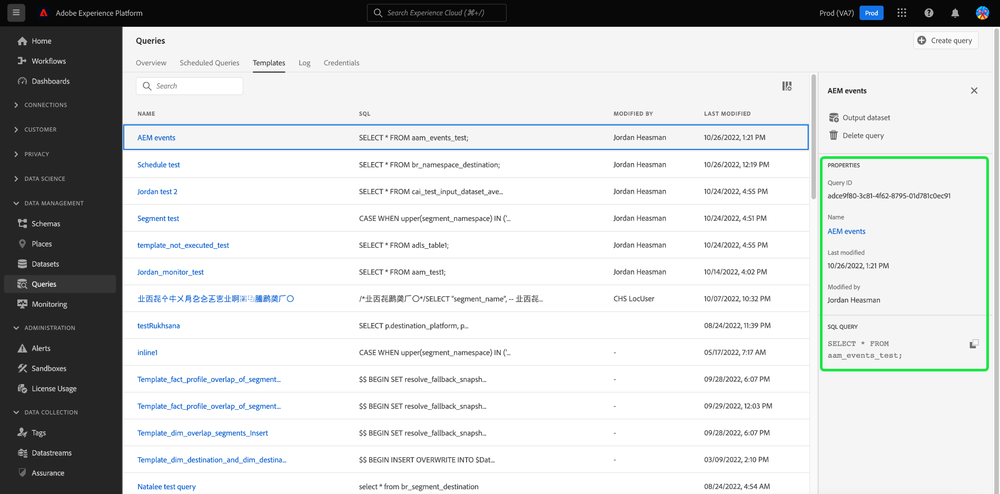

# クエリテンプレート

Adobe Experience Platformクエリサービスを使用すると、SQL コードを保存して、クエリテンプレートの形式で再利用できます。 テンプレートを使用すると、一般的に実行されるタスクの繰り返しを避けることで、手間を省くことができます。 組織内でテンプレートを共有し、基になる SQL にアクセスしたり、理解したりする必要なく、クエリ値を簡単に変更できます。

このドキュメントでは、クエリサービスでクエリテンプレートを作成するために必要な情報を提供します。

## 前提条件

次を持っている必要があります： [!UICONTROL クエリの管理] 権限を有効にして、クエリエディターにアクセスし、Platform UI 内でクエリダッシュボードを表示できるようになりました。 権限は、Adobe [Admin Console](https://adminconsole.adobe.com/). この権限を有効にするための管理者権限がない場合は、組織の管理者に問い合わせてください。 詳しくは、アクセス制御に関するドキュメントを参照してください。 [Admin Consoleを使用した権限の追加に関する完全な手順](../../access-control/home.md).

## クエリテンプレートの作成

クエリサービス API に対してPOSTリクエストを実行することで、2 つの方法でクエリテンプレートを作成できます `query-templates` エンドポイントを使用するか、クエリエディターでクエリを記述、命名、保存します。

### クエリエディターを使用して、クエリを作成し、テンプレートとして保存します。

クエリエディターを使用して [書き込み](./user-guide.md#query-authoring) および [クエリを保存](./user-guide.md#saving-queries). クエリに名前を付けて保存すると、 [!UICONTROL テンプレート] タブをクリックします。

Platform UI のクエリワークスペースから、「 **[!UICONTROL テンプレート]** をクリックして、使用可能な保存済みクエリのリストを表示します。

関連するテンプレート情報を見つけるには、使用可能なリストから任意のクエリテンプレートを選択して、詳細パネルを開きます。

### クエリサービス API を使用してテンプレートを作成する

手順については、ドキュメントを参照してください。 [クエリテンプレートの作成方法](../api/query-templates.md#create-a-query-template) クエリサービス API を使用して、 新しく作成したクエリテンプレートの詳細は、応答本文に含まれています。

>[!NOTE]
>
>API を使用して作成したテンプレートは、「 Platform UI クエリサービステンプレート」タブにも表示されます。

## 次の手順

このドキュメントでは、クエリサービスでクエリテンプレートを作成する方法をより深く理解しました。 詳しくは、 [UI の概要](./overview.md)、または [クエリサービス API ガイド](../api/getting-started.md) を参照してください。

詳しくは、 [スケジュール済みクエリエンドポイントガイド](../api/scheduled-queries.md) API を使用してクエリをスケジュールする方法、または [クエリエディターガイド](./user-guide.md#scheduled-queries) UI 用に保存されます。
