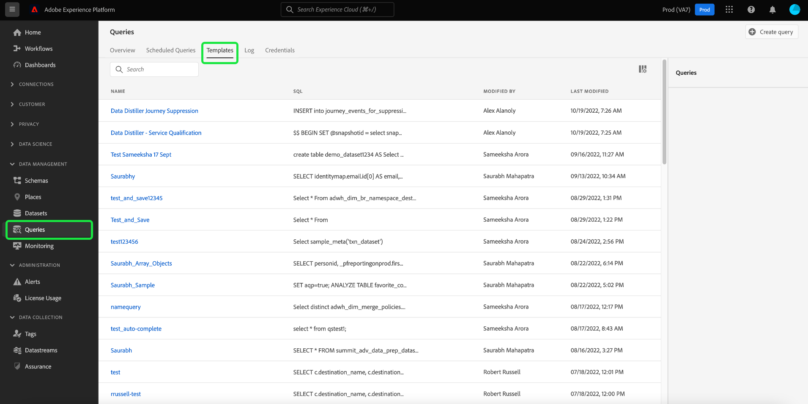
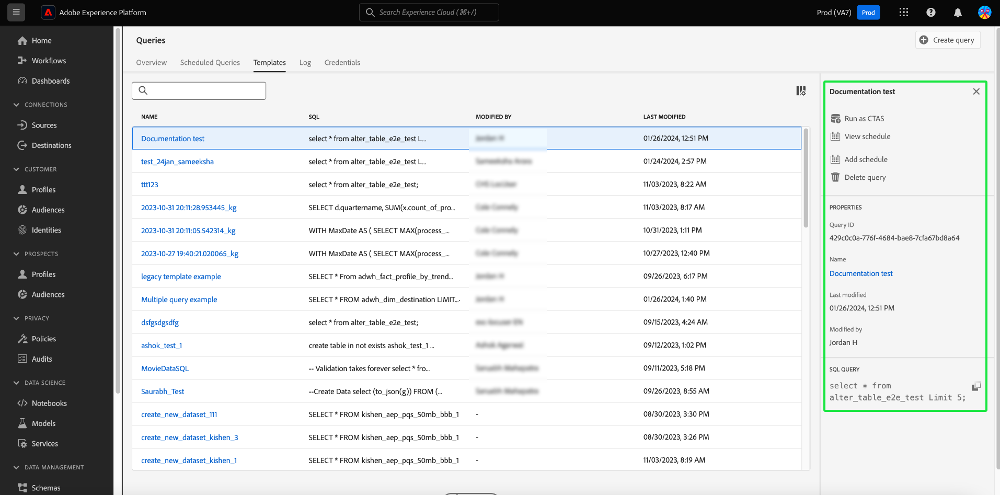

# クエリテンプレート

Adobe Experience Platform クエリサービスを使用すると、SQL コードを保存して、クエリテンプレートの形式で再利用できます。 テンプレートを使用すると、よく実行されるタスクの繰り返しを避けることで、手間を省くことができます。 組織内でテンプレートを共有すると、基になる SQL にアクセスしたり理解したりする必要なく、クエリ値を簡単に変更できます。

このドキュメントでは、クエリサービスでクエリテンプレートを作成するために必要な情報を提供します。

## 前提条件

クエリ エディターにアクセスし、Experience Platform UI内でクエリ ダッシュボードを表示するには、[!UICONTROL Manage queries]権限を有効にする必要があります。 この権限は、Adobe [Admin Console](https://adminconsole.adobe.com/) を使用して有効にできます。 この権限を有効にするための管理者権限がない場合は、組織の管理者に問い合わせてください。 [Admin Console を使用した権限の追加に関する完全な手順](../../access-control/home.md)については、アクセス制御に関するドキュメントを参照してください。

## クエリテンプレートの作成

クエリテンプレートを作成するには、Query Service API `query-templates` エンドポイントに対して POST リクエストを実行するか、クエリエディターでクエリを記述、命名、保存するという 2 つの方法があります。

### クエリエディターを使用して、クエリを作成し、テンプレートとして保存します。

クエリエディターを使用して[書き込み](./user-guide.md#query-authoring)および[クエリを保存](./user-guide.md#saving-queries)する方法については、ドキュメントを参照してください。 クエリに名前を付けて保存すると、[!UICONTROL Templates] タブからクエリ テンプレートとして再利用できるようになります。

### Data Distiller アクセラレーターからのテンプレートの作成 {#create-from-accelerator}

Data Distiller アクセラレータは読み取り専用です。 アクセラレーターを変更するには、クエリエディターでアクセラレーターから編集可能なテンプレートを作成します。

アクセラレーターを開き、**[!UICONTROL Create custom template]**&#x200B;を選択してSQLを複製します。 テンプレートを保存して、**[!UICONTROL Templates]** タブに追加します。 複製されたテンプレートは完全に編集可能で、必要に応じて実行、スケジュール、または変更できます。

詳しい手順については、[Data Distiller アクセラレータ ](./accelerators.md#create-custom-template) ガイドを参照してください。

>[!TIP]
>
>クエリエディターでクエリを保存すると、確認メッセージがポップアップ表示され、アクションが成功したことを通知します。 このポップアップメッセージには、クエリスケジューリングワークスペースに移動するための便利な方法を提供するリンクが含まれています。 カスタムケイデンスでクエリを実行する方法については、[ クエリのスケジュールに関するドキュメント ](./query-schedules.md)を参照してください。

## クエリテンプレートを参照 {#browse}

Experience Platform UIのクエリワークスペースから、**[!UICONTROL Templates]**&#x200B;を選択して、使用可能な保存済みクエリのリストを表示します。

関連するテンプレート情報を見つけるには、使用可能なリストから任意のクエリテンプレートを選択して、詳細パネルを開きます。

詳細パネルから、次のアクションを実行できます。

* 既存のテーブルまたはテーブルからデータを選択して、新しいテーブルを作成するには、**[!UICONTROL Run as CTAS]**&#x200B;を選択します。 このオプションは、SELECT クエリがある場合にのみ使用できます。
* クエリ テンプレートのスケジュールの編集を開始するには、**[!UICONTROL Add schedule]**&#x200B;を選択します。
* 「**[!UICONTROL View schedule]**」を選択して、クエリエディターの「[!UICONTROL Schedules]」タブに移動します。 このビューには、クエリに関連付けられているスケジュール情報が含まれます。
* テンプレートを削除するには、**[!UICONTROL Delete query]**&#x200B;を選択します。
* テンプレート名を選択して、SQLが編集用に事前入力されているクエリエディターに移動します。

### Query Service API を使用してテンプレートを作成する

Query Service API を使用した[クエリテンプレートの作成方法](../api/query-templates.md#create-a-query-template)の手順については、ドキュメントを参照してください。 新しく作成したクエリテンプレートの詳細は、応答本文に含まれています。

>[!NOTE]
>
>APIを使用して作成されたテンプレートは、「Experience Platform UI クエリサービステンプレート」タブにも表示されます。

## 次の手順

このドキュメントでは、クエリサービスでクエリテンプレートを作成する方法をより深く理解しました。 クエリサービスの機能について詳しくは、[UI の概要](./overview.md)または [Query Service API ガイド](../api/getting-started.md)を参照してください。

API または UI 用[クエリエディターガイド](./user-guide.md#scheduled-queries)を使用して、クエリをスケジュールする方法について詳しくは、[スケジュールされたクエリエンドポイントガイド](../api/scheduled-queries.md)を参照してください。
