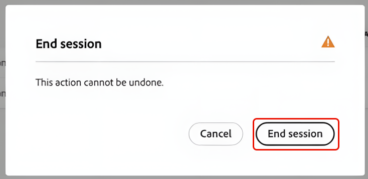

# クエリ サービス セッションの管理

>[!AVAILABILITY]
>
>クエリサービスのセッション管理は、**Data Distiller**&#x200B;の使用権限を持つ組織でのみ使用できます。 アクセスをリクエストするには、Adobe アカウントチームにお問い合わせください。

このガイドでは、Adobe Experience Platform ユーザーインターフェイスからアクティブなクエリサービスセッションを管理する方法を説明します。 セッション管理は、管理者がサンドボックス間の同時クエリエディターセッションを監視し、ユーザーがセッションを開いたままにするときに空き容量を監視するのに役立ちます。

## セッション管理に必要な権限 {#permissions}

>[!IMPORTANT]
>
>この機能は、管理者向けに設計されています。 クエリを実行しているエンドユーザーは、セッションを管理できません。

セッションを表示および終了するには、Data Distiller アクセス権を持つ組織に属し、**[!UICONTROL Manage Query Session]**&#x200B;権限が割り当てられている必要があります。 必要な権限を持たないユーザーはクエリサービスにアクセスできますが、アクティブなセッションを表示または管理することはできません。

## アクティブなセッションの表示 {#view-active-sessions}

管理者は、組織内のサンドボックス間のすべてのアクティブなクエリサービスセッションを表示できます。 Experience Platformで、左側のナビゲーションで「**[!UICONTROL Queries]**」を選択してQuery Service ワークスペースを開き、「**[!UICONTROL Admin]**」タブを選択してセッション管理にアクセスします。

セッション管理テーブルはリアルタイムで自動的に更新され、組織に割り当てられたクエリサービス同時セッション容量を現在使用しているすべてのセッションが一覧表示されます。 各行は、クエリエディターで開かれた1つのセッションを表します。

## セッションのステータスとアイドル時間 {#session-status}

セッションテーブルには、セッションを安全に終了できるかどうかを判断するのに役立つ情報が表示されます。

| 列 | 説明 |
| --- | --- |
| ユーザー ID | セッションを所有するユーザーのAdobe ID |
| ユーザー名 | Adobe IDに関連付けられている名前 |
| サンドボックス | セッションが実行されているサンドボックスを示します |
| セッションステータス | セッションが&#x200B;**[!UICONTROL Active]**&#x200B;か&#x200B;**[!UICONTROL Inactive]**&#x200B;かを表示します |
| アイドル時間 | セッションが操作なしで開かれた時間を表示します |
| 残りのセッション時間 | 自動有効期限が切れるまでセッションを開いたままにできる時間を示します |

### セッションステータス

**[!UICONTROL Inactive]**&#x200B;は、ユーザーがクエリをアクティブに実行していないことを示します。これらのセッションは終了できます。 **[!UICONTROL Active]**&#x200B;は、クエリが現在実行中であることを示します。**[!UICONTROL End session]** コントロールは、クエリの実行が完了するまで使用できません。

### アイドル時間と残りのセッション時間

アイドルタイムは、ユーザーの操作なしでセッションが開かれていた時間を示します。 セッションの残り時間は、セッションがシステムによって自動的に閉じられるまでの間、セッションを開いたままにできる時間を示します。 セッションは、許可された最大期間（非アクティブの2時間）後に自動的に期限切れになります。 この期間はシステム定義であり、設定できません。

## アイドルセッションの終了 {#end-idle-sessions}

アイドルセッションを終了して、他のユーザーの同時セッション容量を解放できます。 ユーザーがアクティブに作業しなくなった場合に、アイドル時間が長いセッションを終了することを検討してください。

セッション管理テーブルから、**[!UICONTROL End session]**&#x200B;を選択して、終了する非アクティブなセッションを選択します。

終了セッションがハイライト表示された非アクティブなセッションを示す

確認ダイアログが表示され、誤って終了するのを防ぐことができます。 ダイアログで「**[!UICONTROL End session]**」を選択して、アクションを確認します。

セッションが終了すると、セッションはテーブルから削除され、容量はすぐに使用できるようになり、アクションは監査用に記録されます。

>[!NOTE]
>
>ステータスが&#x200B;**[!UICONTROL Active]**&#x200B;のセッションは終了できません。 この保護機能は、進行中のワークロードが中断されるのを防ぎます。

## 終了後のセッション動作 {#session-behavior-after-termination}

管理者がセッションを終了すると、影響を受けるユーザーのコードは作業を失うことなくエディター内に残ります。 ユーザーが終了後にクエリを実行しようとすると、終了したセッションが検出され、接続が自動的に再確立され、クエリエディターのコンテンツが維持されます。

この動作により、ユーザーはエディターに書き込まれた作業を失うことなく、新しいセッションが確立されると続行できます。

## セッション管理の監査ログ {#audit-logs}

システムは、セッション管理アクションをログに記録し、可視性と説明責任を提供します。 監査ログには、セッション ID、セッションが終了したユーザー、アクションを実行した管理者、アクションの時間が記録されます。

監査ログを使用してセッションの終了履歴を確認し、予期しない切断を調査します。

監査ログの表示について詳しくは、[ クエリサービス監査ログガイド ](../data-governance/audit-log-guide.md)を参照してください。

## 次の手順 {#next-steps}

Query ServiceとData Distillerの活用を拡大するには、次の資料を参考にしてください。

* [ユーザーがクエリを作成および実行する方法については、クエリエディターユーザーガイドを参照してください](user-guide.md)
* [スケジュールされたクエリを使用して、スケジュールされたワークロードを監視する監視ドキュメント](monitor-queries.md)
