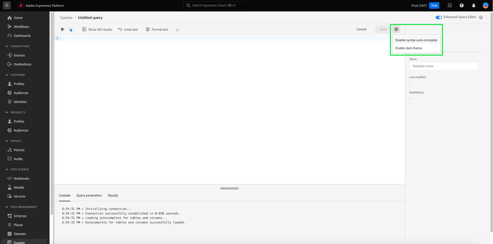

# [!DNL Query Editor] UI ガイド

[!DNL Query Editor] は、Adobe Experience Platform [!DNL Query Service] が提供するインタラクティブなツールで、[!DNL Experience Platform] ユーザーインターフェイス内でカスタマーエクスペリエンス（顧客体験）データのクエリを記述、検証および実行できます。[!DNL Query Editor] では、分析およびデータ調査のためのクエリを開発できます。また、開発目的でインタラクティブクエリを実行できるほか、非インタラクティブクエリを実行して [!DNL Experience Platform] のデータセットに入力することもできます。

[!DNL Query Service] の概念と機能について詳しくは、[クエリサービスの概要](../home.md)を参照してください。[!DNL Platform] 上でクエリサービスのユーザーインターフェイスを操作する方法について詳しくは、[クエリサービス UI の概要](./overview.md)を参照してください。

>[!NOTE]
>
>一部のクエリサービス機能は、従来のバージョンのクエリエディターでは提供されていません。 このドキュメントで使用するスクリーンショットは、特に記載がない限り、クエリエディターの拡張バージョンを使用して撮影します。 詳しくは、 [クエリエディターの強化](#enhanced-editor-toggle) を参照してください。

## はじめに {#getting-started}

[!DNL Query Editor] に接続することで、クエリを柔軟に実行できます。 [!DNL Query Service]、およびクエリは、この接続がアクティブな間にのみ実行されます。

## [!DNL Query Editor] へのアクセス {#accessing-query-editor}

[!DNL Experience Platform] UI で、左側のナビゲーションメニューの「**[!UICONTROL クエリ]**」を選択して、[!DNL Query Service] ワークスペースを開きます。次に、クエリの記述を開始するには、「 」を選択します。 **[!UICONTROL クエリを作成]** をクリックします。 このリンクは、[!DNL Query Service] ワークスペースのどのページからも利用できます。

### [!DNL Query Service] への接続  {#connecting-to-query-service}

クエリエディターを開くと、初期化とクエリサービスへの接続に数秒かかります。 クエリサービスに接続されると、コンソールに表示されます（以下を参照）。エディターがクエリサービスに接続される前にクエリを実行しようとすると、接続が完了するまで実行が待機されます。

### [!DNL Query Editor] からのクエリの実行方法 {#run-a-query}

実行元のクエリ [!DNL Query Editor] をインタラクティブに実行するので、ブラウザーを閉じたり、別の場所に移動したりした場合、クエリはキャンセルされます。 クエリ出力からデータセットを生成するために実行されるクエリについても、同じことが言えます。

クエリエディターの拡張版を使用すると、クエリエディターで複数のクエリを記述し、すべてのクエリを順番に実行できます。 詳しくは、 [複数の順次クエリの実行](#execute-multiple-sequential-queries) を参照してください。

## [!DNL Query Editor] を使用したクエリオーサリング {#query-authoring}

[!DNL Query Editor] を使用すると、顧客体験データのクエリを記述、実行および保存できます。[!DNL Query Editor] で実行または保存されたすべてのクエリは、[!DNL Query Service] にアクセスできる組織内のすべてのユーザーが利用できます。

## クエリエディターの切り替え機能の強化 {#enhanced-editor-toggle}

>[!CONTEXTUALHELP]
>id="platform_queryService_queryEditor_enhancedEditorToggle"
>title="エディターの切替スイッチの機能強化"
>abstract="クエリエディターのレガシーバージョンと拡張バージョンを切り替えます。レガシーバージョンはデフォルトで有効になっていますが、拡張バージョンはアクセシビリティと複数テーマのサポートを強化します。これらの変更点について詳しくは、ドキュメントを参照してください。"

「UI」切り替えを使用して、クエリエディターのレガシーバージョンと拡張バージョンを切り替えることができます。 レガシーバージョンはデフォルトで有効になっていますが、拡張バージョンはアクセシビリティと複数テーマのサポートを強化します。拡張バージョンを有効にして、クエリエディター設定にアクセスします。

切り替えを有効にすると、エディターが明るいテーマに切り替わり、構文の読みやすさが向上します。 また、オートコンプリート切り替えを組み込むクエリエディター入力フィールドの上に設定アイコンが表示されます。 設定アイコンから、ダークテーマを有効にしたり、オートコンプリートを無効/有効にしたりできます。

>[!TIP]
>
>拡張されたクエリエディターを使用すると、次の操作を実行できます。 [!UICONTROL 構文のオートコンプリートを無効にする] クエリの作成中に進行状況が失われることはありません。 通常、編集中にオートコンプリート機能を無効にすると、クエリに対するすべての変更が失われます。

暗いテーマまたは明るいテーマを有効にするには、設定アイコン () に続いて、表示されるドロップダウンメニューのオプションが表示されます。

### 複数の順次クエリを実行 {#execute-multiple-sequential-queries}

クエリエディターの拡張版を使用すると、クエリエディターで複数のクエリを記述し、すべてのクエリを順番に実行できます。

1 つのシーケンスで複数のクエリを実行すると、それぞれログエントリが生成されます。 ただし、最初のクエリの結果のみがクエリエディターコンソールに表示されます。 実行されたクエリのトラブルシューティングや確認が必要な場合は、クエリログを確認します。 詳しくは、 [クエリログドキュメント](./query-logs.md) を参照してください。

>[!NOTE]
> 
>クエリエディターで最初のクエリの後に CTAS クエリが実行された場合でも、テーブルは作成されますが、クエリエディターコンソールには出力はありません。

### 選択したクエリを実行 {#execute-selected-query}

複数のクエリを記述したが、1 つのクエリのみを実行する必要がある場合は、選択したクエリをハイライト表示し、
[!UICONTROL 選択したクエリを実行] アイコン。 このアイコンは、エディターでクエリを選択しない限り、デフォルトでは無効になっています。

![クエリエディターと [!UICONTROL 選択したクエリを実行] アイコンがハイライト表示されます。](../images/ui/query-editor/run-selected-query.png)

### 結果数 {#result-count}

クエリエディターには、最大 50,000 行の出力があります。 ただし、クエリエディターコンソールには、一度に 50 行のみが表示されます。 コンソールに表示される行数を変更するには、 **[!UICONTROL 結果数]** ドロップダウンを開き、50、100、150、300、500 の値から選択します。

## クエリの記述 {#writing-queries}

[!UICONTROL クエリエディター]は、クエリをできるだけ簡単に記述できるように構成されています。次のスクリーンショットは、UI でエディターがどのように表示されるかを示しています。ここでは、SQL 入力フィールドと「**再生**」がハイライト表示されています。

開発時間を最小限に抑えるために、返される行を制限してクエリを開発することをお勧めします。たとえば、`SELECT fields FROM table WHERE conditions LIMIT number_of_rows` のように設定します。クエリが目的どおりの出力を生成することを確認したら、制限を解除して、`CREATE TABLE tablename AS SELECT` と設定してクエリを実行し、データセットを生成します。

## [!DNL Query Editor] の記述ツール {#writing-tools}

- **構文の自動ハイライト表示：** SQL の読み取りと構成が容易になります。

- **SQL キーワードのオートコンプリート：**&#x200B;クエリの入力を開始し、矢印キーを使用して目的の用語に移動して、**Enter** キーを押します。

- **テーブルとフィールドのオートコンプリート**：`SELECT` 元のテーブル名の入力を開始し、矢印キーを使用して目的の表に移動して、**Enter** キーを押します。テーブルを選択すると、オートコンプリートはそのテーブルのフィールドを認識します。

### テキストの書式設定 {#format-text}

The [!UICONTROL テキストの書式設定] 機能により、標準化された構文スタイルを追加することで、クエリがより読みやすくなります。 選択 **[!UICONTROL テキストの書式設定]** を使用して、クエリエディター内のすべてのテキストを標準化します。

![クエリエディターと [!UICONTROL テキストの書式設定] ハイライト表示された SQL 文](../images/ui/query-editor/format-text.png)

### SQL をコピー {#copy-sql}

コピーアイコンを選択して、クエリエディターからクリップボードに SQL をコピーします。 このコピー機能は、クエリテンプレートと、クエリエディターで新しく作成されたクエリの両方で使用できます。

### オートコンプリート UI 設定の切り替え {#auto-complete}

[!DNL Query Editor] では、クエリの記述時に、可能性のある SQL キーワードとテーブル名または列名の候補を自動的に表示します。オートコンプリート機能はデフォルトで有効になっており、クエリエディターの右上にある[!UICONTROL 構文のオートコンプリート]を切り替えることで、いつでも無効または有効にすることができます。

オートコンプリートの設定はユーザーごとに行われ、そのユーザーが次にログインしたときも記憶されています。

この機能を無効にすると、いくつかのメタデータコマンドが処理されなくなり、クエリの編集時に作成者のスピードアップにつながるレコメンデーションが提案されます。

切り替えスイッチを使用してオートコンプリート機能を有効にすると、短い一時停止の後、テーブル名や列名の推奨候補や SQL キーワードを使用できるようになります。 クエリエディターの下のコンソールの成功メッセージは、この機能がアクティブであることを示します。

オートコンプリート機能を無効にした場合は、ページを更新して設定を反映させる必要があります。 [!UICONTROL 構文のオートコンプリート]切り替えを無効にすると、3 つのオプションを含んだ確認ダイアログが表示されます。

- [!UICONTROL キャンセル]
- [!UICONTROL 変更を保存して更新]
- [!UICONTROL 変更を保存せずに更新]

>[!IMPORTANT]
>
>この機能を無効にする際にクエリを作成または編集する場合は、ページを更新する前にクエリに対する変更を保存する必要があります。保存しないと、すべての進行状況が失われます。

オートコンプリート機能を無効にするには、適切な確認オプションを選択します。

### エラーの検出 {#error-detection}

[!DNL Query Editor] は、クエリを記述する際に自動的に検証を行い、汎用 SQL 検証と特定の実行検証を行ないます。以下の画像のように、クエリの下に赤い下線が表示される場合は、クエリ内にエラーがあります。

エラーが検出された場合、SQL コードの上にカーソルを置くと、特定のエラーメッセージが表示されます。

### クエリの詳細 {#query-details}

クエリエディターにクエリを表示するには、保存済みのテンプレートを [!UICONTROL テンプレート] タブをクリックします。 クエリの詳細パネルには、選択したクエリを管理する詳細情報とツールが表示されます。

このパネルを使用すると、UI から直接出力データセットを生成し、表示されたクエリを削除または名前付け、クエリにスケジュールを追加できます。

このパネルには、クエリが最後に変更された日時や最後に変更したユーザー（該当する場合）など、有用なメタデータも表示されます。 データセットを生成するには、「**[!UICONTROL データセットを出力]**」を選択します。**[!UICONTROL データセットを出力]**&#x200B;ダイアログが表示されます。名前と説明を入力し、「**[!UICONTROL クエリを実行]**」を選択します。[!DNL Platform] で [!DNL Query Service] ユーザーインターフェイスの「**[!UICONTROL データセット]**」タブに、新しいデータセットが表示されます。

### スケジュール済みクエリ {#scheduled-queries}

テンプレートとして保存されたクエリは、クエリエディターでスケジュールできます。 クエリのスケジュール設定を使用すると、カスタムケイデンスでクエリを自動実行できます。 頻度、日付、時刻に基づいてクエリをスケジュールし、必要に応じて結果の出力データセットを選択できます。 クエリスケジュールは、UI で無効にしたり削除したりすることもできます。

スケジュールは、クエリエディターで設定します。 クエリエディターを使用する場合は、既に作成、保存、実行されているクエリにのみスケジュールを追加できます。 同じ制限は、 [!DNL Query Service] API:

方法については、クエリスケジュールのドキュメントを参照してください。 [UI でのクエリスケジュールの作成](./query-schedules.md). また、API を使用してスケジュールを追加する方法については、 [スケジュール済みクエリエンドポイントガイド](../api/scheduled-queries.md).

スケジュール済みクエリは、 [!UICONTROL スケジュール済みクエリ] タブをクリックします。 そのワークスペースから、UI を使用して、スケジュールされたすべてのクエリジョブのステータスを監視できます。 次の日： [!UICONTROL スケジュール済みクエリ] 「 」タブでは、クエリ実行およびアラートの購読に関する重要な情報を確認できます。 使用可能な情報には、ステータス、スケジュールの詳細、実行が失敗した場合のエラーメッセージ/コードが含まれます。 詳しくは、 [スケジュール済みクエリドキュメントの監視](./monitor-queries.md) を参照してください。

### クエリの保存 {#saving-queries}

[!DNL Query Editor] にはクエリを保存して後で作業できる保存機能があります。クエリを保存するには、「 **[!UICONTROL 保存]** ～の右上隅に [!DNL Query Editor]. クエリを保存する前に、**[!UICONTROL クエリの詳細]**&#x200B;パネルを使用してクエリに名前を付ける必要があります。

>[!NOTE]
>
>クエリエディターを使用してで名前を付けて保存したクエリは、クエリダッシュボードの「[!UICONTROL テンプレート]」タブ内でテンプレートとして使用できます。 詳しくは、[テンプレートのドキュメント](./query-templates.md)を参照してください。

### 以前のクエリを検索する方法 {#previous-queries}

[!DNL Query Editor] で実行したクエリはすべて「ログ」テーブルに保存されます。「**[!UICONTROL ログ]**」タブの検索機能を使用して、クエリの実行を検索できます。保存したクエリは「**[!UICONTROL テンプレート]**」タブに表示されます。

クエリがスケジュールされている場合、「[!UICONTROL スケジュールされたクエリ]」タブでは、UI を使用してこれらのクエリジョブをより明確に表示できます。 詳しくは、[クエリ監視のドキュメント](./monitor-queries.md)を参照してください。

>[!NOTE]
>
>実行されなかったクエリは「ログ」に保存されません。クエリを [!DNL Query Service] で使用できるようにするには、[!DNL Query Editor] でクエリを実行するか保存する必要があります。

## クエリエディターを使用してクエリを実行する {#executing-queries}

[!DNL Query Editor] でクエリを実行するには、エディターに SQL を入力するか、「**[!UICONTROL ログ]**」タブまたは「**[!UICONTROL テンプレート]**」タブから以前のクエリを読み込み、「**再生**」を選択します。クエリ実行のステータスは下の「**[!UICONTROL コンソール]**」タブに表示され、出力データは「**[!UICONTROL 結果]**」タブに表示されます。

### コンソール {#console}

コンソールには、[!DNL Query Service] のステータスと処理に関する情報が表示されます。コンソールには、[!DNL Query Service] への接続状態、実行中のクエリ操作、およびこれらのクエリによるエラーメッセージが表示されます。

>[!NOTE]
>
>コンソールには、クエリの実行によって発生したエラーのみが表示されます。 クエリの実行前に発生したクエリ検証エラーは表示されません。

### クエリの結果 {#query-results}

クエリが完了すると、結果が「**[!UICONTROL コンソール]**」タブの横の「**[!UICONTROL 結果]**」タブに表示されます。このビューには、クエリの出力が表形式で出力され、最大 100 行まで表示されます。このビューを使用すると、クエリが目的どおりの出力を生成することを確認できます。クエリでデータセットを生成するには、返される行の制限を解除し、`CREATE TABLE tablename AS SELECT` と設定してクエリを実行します。[!DNL Query Editor] でクエリの結果からデータセットを生成する方法については、[データセットの生成についてのチュートリアル](./create-datasets.md)を参照してください。

## [!DNL Query Service] チュートリアルビデオを使用したクエリの実行 {#query-tutorial-video}

次のビデオでは、Adobe Experience Platform インターフェイスおよび PSQL クライアントでクエリを実行する方法を説明します。 また、このビデオでは、XDM オブジェクト内の個々のプロパティの使用、Adobe定義関数、CREATE TABLE AS SELECT(CTAS) クエリの使用方法についても説明します。

>[!VIDEO](https://video.tv.adobe.com/v/29796?quality=12&learn=on)

## 次の手順

[!DNL Query Editor] で使用できる機能とアプリケーションの操作方法について説明しました。これで、独自のクエリを [!DNL Platform] で直接記述できます。[!DNL Data Lake] のデータセットに対して SQL クエリを実行する方法については、[クエリの実行](../best-practices/writing-queries.md)に関するガイドを参照してください。
