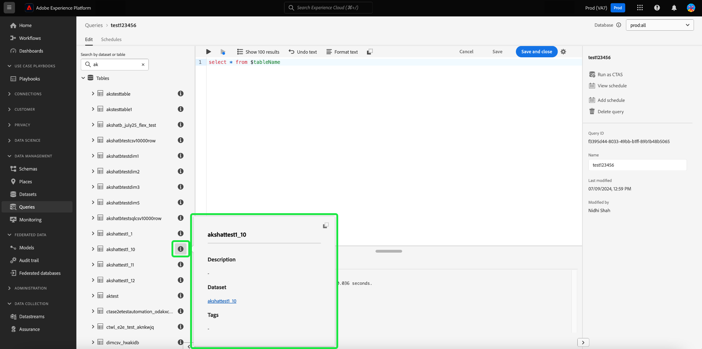

# クエリエディター UI ガイド

>[!NOTE]
>
>従来のエディターは、2024 年 5 月 24 日（PT）に非推奨（廃止予定）となりました。 使用するためにアクセスできなくなりました。 [ 拡張クエリエディター ](#enhanced-editor-toggle) を使用して、クエリの書き込み、検証および実行ができるようになりました

クエリエディターは、Adobe Experience Platform クエリサービスから提供されるインタラクティブなツールで、これを使用すれば、[!DNL Experience Platform] ユーザーインターフェイス内でカスタマーエクスペリエンス（顧客体験）データのクエリを記述、検証および実行できます。 クエリエディターでは、分析およびデータ調査のためのクエリを作成できます。また、開発目的でインタラクティブクエリを実行できるほか、非インタラクティブクエリを実行して [!DNL Experience Platform] のデータセットに入力することもできます。

クエリサービスの概念と機能について詳しくは、「[Query Service overview](../home.md)」を参照してください。[!DNL Platform] 上でクエリサービスのユーザーインターフェイスを操作する方法について詳しくは、[クエリサービス UI の概要](./overview.md)を参照してください。

## はじめに {#getting-started}

クエリエディターでは、クエリサービスに接続することでクエリを柔軟に実行できます。クエリは、この接続がアクティブなときにのみ実行されます。

## クエリエディターへのアクセス {#accessing-query-editor}

[!DNL Experience Platform] UI で、左側のナビゲーションメニューの **[!UICONTROL クエリ]** を選択して、クエリサービス ワークスペースを開きます。 次に、クエリの記述を開始するには、画面の右上にある「**[!UICONTROL クエリを作成]**」を選択します。 このリンクは、クエリサービスのワークスペースのどのページからも利用できます。

### クエリサービスへの接続 {#connecting-to-query-service}

クエリエディターを開くと、クエリサービスが初期化され接続されるまでに数秒かかります。 クエリサービスに接続されると、コンソールに表示されます（以下を参照）。エディターがクエリサービスに接続される前にクエリを実行しようとすると、接続が完了するまで実行が待機されます。

### クエリエディターからのクエリの実行 {#run-a-query}

クエリエディターから実行されるクエリはインタラクティブに実行されるので、ブラウザーを閉じたり、ブラウザーから移動したりすると、クエリがキャンセルされます。 クエリ出力からデータセットを生成するように作成されたクエリについても、同じことが言えます。

## 拡張クエリエディターを使用したクエリオーサリング {#query-authoring}

>[!NOTE]
>
>従来のエディターは、2024 年 5 月 24 日（PT）に非推奨（廃止予定）となりました。 使用するためにアクセスできなくなりました。 拡張クエリエディターを使用して、クエリの書き込み、検証、実行ができるようになりました。

クエリエディターを使用して、顧客体験データのクエリを記述、実行および保存できます。クエリエディターで実行または保存されたすべてのクエリは、クエリサービスにアクセスできる組織内のすべてのユーザーが利用できます。

### データベースセレクター {#database-selector}

クエリエディターの右上にあるドロップダウンメニューから、クエリするデータベースを選択します。 選択したデータベースがドロップダウンに表示されます。

### 設定 {#settings}

クエリエディター入力フィールドの上にある設定アイコンには、ダークテーマを有効/無効にするオプションや、オートコンプリートを無効/有効にするオプションが含まれています。

>[!TIP]
>
>クエリの作成中に進行状況を維持しながら [!UICONTROL  構文のオートコンプリートを無効にする ] ことができます。

暗いテーマまたは明るいテーマを有効にするには、設定アイコン（）に続いて、表示されるドロップダウンメニューのオプションを選択します。

#### オートコンプリート {#auto-complete}

クエリエディターでは、クエリの記述時に、可能性のある SQL キーワードとテーブル名または列名の候補を自動的に表示します。 オートコンプリート機能はデフォルトで有効になっており、クエリエディターの設定で、いつでも無効または有効にすることができます。

オートコンプリートの設定はユーザーごとに行われ、そのユーザーが次にログインしたときも記憶されています。 この機能を無効にすると、いくつかのメタデータコマンドが処理されなくなり、クエリの編集時に作成者のスピードアップにつながるレコメンデーションが提案されます。

### 複数の順次クエリの実行 {#execute-multiple-sequential-queries}

拡張クエリエディターを使用すると、複数のクエリを記述し、すべてのクエリを順番に実行できます。 複数のクエリを順番に実行すると、それぞれログエントリが生成されます。 ただし、クエリエディターコンソールには、最初のクエリの結果のみが表示されます。 実行されたクエリのトラブルシューティングや確認が必要な場合は、クエリログを確認します。 詳しくは、[ クエリログドキュメント ](./query-logs.md) を参照してください。

>[!NOTE]
> 
>クエリエディターで最初のクエリを実行した後に CTAS クエリを実行すると、テーブルは作成されますが、クエリエディターコンソールには出力されません。

### 選択したクエリの実行 {#execute-selected-query}

複数のクエリを記述したが、実行する必要があるクエリが 1 つだけの場合は、選択したクエリをハイライト表示し、
[!UICONTROL  選択したクエリを実行 ] アイコン このアイコンは、エディター内でクエリ構文を選択するまで、デフォルトで無効になっています。

![ 「選択したクエリを実行 [!UICONTROL  アイコンがハイライト表示されたクエリエディ ]。](../images/ui/query-editor/run-selected-query.png)

### クエリエディターセッションをキャンセル {#cancel-query}

長時間実行されるクエリをキャンセルすることで、クエリの実行を制御し、生産性を向上させます。 このアクションは、クエリの実行中にクエリエディターをクリアします。 クエリは引き続きバックグラウンドで実行されることに注意してください。 CTAS クエリの場合でも、出力データセットが生成されます。 エディターでの実行をキャンセルして SQL 文の作成を続行するには、クエリを実行した後で **[!UICONTROL クエリをキャンセル]** を選択します。

![ 「クエリをキャンセル [!UICONTROL  がハイライト表示され ] クエリエディター ](../images/ui/query-editor/cancel-query-run.png)

確認ダイアログが表示されます。 「**[!UICONTROL 確認]**」を選択して、クエリの実行をキャンセルします。

### 結果数 {#result-count}

クエリエディターの出力行は最大 50,000 行です。 クエリエディターコンソールに一度に表示する行数を選択できます。 コンソールに表示される行数を変更するには、「**[!UICONTROL 結果数]**」ドロップダウンを選択し、50、100、150、300、500 の各オプションから選択します。

>[!NOTE]
>
>Platform UI でサポートできる行は 500 行までなので、500 を超える LIMIT 値の渡しは無視されます。

## クエリの記述 {#writing-queries}

[!UICONTROL クエリエディター]は、クエリをできるだけ簡単に記述できるように構成されています。次のスクリーンショットは、UI でエディターがどのように表示されるかを示しています。ここでは、SQL 入力フィールドと「**再生**」がハイライト表示されています。

開発時間を最小限に抑えるために、返される行数に制限のあるクエリを開発することをお勧めします。 たとえば、`SELECT fields FROM table WHERE conditions LIMIT number_of_rows` のように設定します。クエリが目的どおりの出力を生成することを確認したら、制限を解除して、`CREATE TABLE tablename AS SELECT` と設定してクエリを実行し、データセットを生成します。

## クエリエディターの記述ツール {#writing-tools}

クエリエディターの記述ツールを使用して、クエリオーサリングプロセスを強化します。 機能には、テキストの書式設定、SQL のコピー、クエリの詳細の管理、進行状況に応じた作業内容の保存またはスケジュール設定を行うオプションが含まれています。

### テキストを書式設定 {#format-text}

[!UICONTROL  テキストを書式設定 ] 機能は、標準化された構文スタイルを追加することで、クエリをわかりやすくします。 「**[!UICONTROL テキストを書式設定]**」を選択して、クエリエディター内のすべてのテキストを標準化します。

>[!NOTE]
>
>[!UICONTROL  テキストの書式設定 ] 機能は、匿名ブロックでは機能しません。 1 つ以上の SQL 文を順番に連結する方法については、[ 匿名ブロックのドキュメント ](../key-concepts/anonymous-block.md) を参照してください。

![ 「テキストの形式 [!UICONTROL  とハイライト表示された SQL 文を含むクエリエディター ] 表示されます。](../images/ui/query-editor/format-text.png)

<!-- ### Undo text {#undo-text}

If you format your SQL in the Query Editor, you can undo the formatting applied by the [!UICONTROL Format text] feature. To return your SQL back to its original form, select **[!UICONTROL Undo text]**.

![The Query Editor with [!UICONTROL Undo text] and the SQL statements highlighted.](../images/ui/query-editor/undo-text.png) -->

### SQL をコピー {#copy-sql}

コピーアイコンを選択して、クエリエディターからクリップボードに SQL をコピーします。 このコピー機能は、クエリテンプレートと、クエリエディターで新しく作成されたクエリの両方で使用できます。

### クエリの詳細 {#query-details}

クエリエディターでクエリを表示するには、「[!UICONTROL  テンプレート ]」タブから保存済みのテンプレートを選択します。 クエリの詳細パネルには、選択したクエリを管理するための詳細情報とツールが表示されます。 また、クエリの最終変更日時や最終変更者（該当する場合）などの便利なメタデータも表示されます。

>[!NOTE]
>
>[!UICONTROL  スケジュールを表示 ]、[!UICONTROL  スケジュールを追加 ] および [!UICONTROL  クエリを削除 ] オプションは、クエリがテンプレートとして保存された後でのみ使用できます。 「[!UICONTROL  スケジュールを追加 ]」オプションを選択すると、クエリエディターからスケジュールビルダーに直接移動します。 「[!UICONTROL  スケジュールの表示 ]」オプションを選択すると、そのクエリのスケジュール在庫に直接移動します。 [UI でクエリスケジュールを作成 ](./query-schedules.md#create-schedule) する方法については、クエリスケジュールのドキュメントを参照してください。

詳細パネルでは、UI から直接出力データセットを生成したり、表示されたクエリを削除または名前付けしたり、クエリ実行スケジュールを表示したり、クエリをスケジュールに追加したりできます。

出力データセットを生成するには、「**[!UICONTROL CTAS として実行]** を選択します。 **[!UICONTROL 出力データセットの詳細を入力]** ダイアログが表示されます。 名前と説明を入力し、「**[!UICONTROL CTAS として実行]**」を選択します。 新しいデータセットが **[!UICONTROL データセット]** 「参照」タブに表示されます。 組織で使用可能なデータセットについて詳しくは、[ データセットの表示に関するドキュメント ](../../catalog/datasets/user-guide.md#view-datasets) を参照してください。

>[!NOTE]
>
>「[!UICONTROL CTAS として実行 ]」オプションは、クエリがスケジュールされている **されていない** 場合にのみ使用できます。

![[!UICONTROL  出力データセットの詳細を入力 ] ダイアログ ](../images/ui/query-editor/output-dataset-details.png)

**[!UICONTROL CTAS として実行]** アクションを実行すると、確認メッセージがポップアップ表示され、アクションが成功したことが通知されます。 このポップアップメッセージには、クエリログワークスペースに移動するのに便利な方法を提供するリンクが含まれています。 クエリログについて詳しくは、[ クエリログドキュメント ](./query-logs.md) を参照してください。

### クエリの保存 {#saving-queries}

クエリエディターには保存機能があり、クエリを保存して後で作業できます。 クエリを保存するには、クエリエディターの右上隅にある「**[!UICONTROL 保存]** を選択します。 クエリを保存する前に、**[!UICONTROL クエリの詳細]**&#x200B;パネルを使用してクエリに名前を付ける必要があります。

>[!NOTE]
>
>クエリエディターを使用してで名前を付けて保存したクエリは、クエリダッシュボードの「[!UICONTROL テンプレート]」タブ内でテンプレートとして使用できます。 詳しくは、[テンプレートのドキュメント](./query-templates.md)を参照してください。

クエリエディターでクエリを保存すると、確認メッセージがポップアップ表示され、アクションが成功したことが通知されます。 このポップアップメッセージには、クエリスケジュールワークスペースに移動する便利な方法を提供するリンクが含まれています。 カスタムケイデンスでクエリを実行する方法については、[ クエリのスケジュール設定ドキュメント ](./query-schedules.md) を参照してください。

### スケジュール済みクエリ {#scheduled-queries}

テンプレートとして保存したクエリは、クエリエディターからスケジュールできます。 クエリをスケジュール設定すると、カスタムケイデンスでクエリの実行を自動化できます。 頻度、日時に基づいてクエリのスケジュールを設定したり、必要に応じて結果の出力データセットを選択したりできます。 クエリスケジュールは、UI から無効または削除することもできます。

スケジュールは、クエリエディターで設定します。 クエリエディターを使用する場合、既に作成および保存されたクエリにのみスケジュールを追加できます。 Query Service API にも同じ制限は適用されません。

>[!NOTE]
>
>10 回連続して実行されなかったスケジュール済みクエリは、自動的に [!UICONTROL  強制隔離 ] ステータスになります。 このステータスのクエリを実行するには、それ以上の実行を行う前に介入が必要です。 詳しくは、[ 強制隔離されたクエリ ](./monitor-queries.md#quarantined-queries) のドキュメントを参照してください。

[UI でクエリスケジュールを作成 ](./query-schedules.md) する方法については、クエリスケジュールのドキュメントを参照してください。 また、API を使用してスケジュールを追加する方法について詳しくは、[ スケジュールされたクエリのエンドポイントガイド ](../api/scheduled-queries.md) を参照してください。

スケジュールされたクエリは、「[!UICONTROL  スケジュール済みクエリ ] タブのリストに追加されます。 そのワークスペースから、UI を使用して、スケジュールされたすべてのクエリジョブのステータスを監視できます。 「[!UICONTROL  スケジュール済みクエリ ]」タブでは、クエリの実行に関する重要な情報を見つけたり、アラートを購読したりできます。 使用可能な情報には、ステータス、スケジュールの詳細、実行が失敗した場合のエラーメッセージ/コードが含まれます。 詳しくは、[ スケジュール済みクエリドキュメントの監視 ](./monitor-queries.md) を参照してください。

### 以前のクエリを検索する方法 {#previous-queries}

クエリエディターで実行したクエリはすべて「ログ」テーブルに保存されます。「**[!UICONTROL ログ]**」タブの検索機能を使用して、クエリの実行を検索できます。保存したクエリは「**[!UICONTROL テンプレート]**」タブに表示されます。

クエリがスケジュールされている場合、「[!UICONTROL スケジュールされたクエリ]」タブでは、UI を使用してこれらのクエリジョブをより明確に表示できます。 詳しくは、[クエリ監視のドキュメント](./monitor-queries.md)を参照してください。

>[!NOTE]
>
>実行されなかったクエリは「ログ」に保存されません。クエリをクエリサービスで使用するには、クエリエディターでクエリを実行するか保存する必要があります。

### オブジェクト ブラウザ {#object-browser}

>[!AVAILABILITY]
>
>データセットナビゲーションパネルは、Data Distillerのお客様のみが使用できます。 Platform UI に左側のデータセットナビゲーションパネルが含まれていない可能性があります。  このドキュメント内の他の画像は、データセットナビゲーションパネルを反映していない場合があります。 詳しくは、Adobe担当者にお問い合わせください。

オブジェクトブラウザーを使用すると、データセットを簡単に検索およびフィルタリングできます。 オブジェクトブラウザーを使用すると、多数のデータセットがある大規模な環境で、テーブルやデータセットの検索に費やす時間を短縮できます。 関連するデータとメタデータへの効率的なアクセスにより、クエリのオーサリングに集中でき、ナビゲーションに集中できなくなります。

オブジェクトブラウザーを使用してデータベース内を移動するには、検索フィールドにテーブル名を入力するか、「**[!UICONTROL テーブル]**」を選択して使用可能なデータセットとテーブルのリストを展開します。 検索フィールドを使用すると、使用可能なテーブルのリストが、入力に基づいて動的にフィルタリングされます。

>[!NOTE]
>
>[ 選択したデータベース ](#database-dropdown) に含まれているすべてのデータセットが、クエリエディターの左側のナビゲーションパネルに表示されます。

オブジェクトブラウザーに表示されるスキーマは、観察可能なスキーマです。 つまり、変更が直ちに表示されるので、これを使用して変更と更新をリアルタイムで監視できます。 観測可能なスキーマは、データの同期を確保するのに役立ち、デバッグや分析のタスクに役立ちます。

#### 現在の制限事項 {#current-limitations}

現在の制限事項のリストを以下に示します。

- 順次クエリ実行：一度に実行できるクエリは 1 つだけです。 クエリの進行中は、クエリが順番に処理されるので、左側のナビゲーションで追加のテーブルを開くことはできません。
- クエリログの追加の行：ログに、「SHOW TABLES」というラベルの付いた不要なクエリが表示される場合があります。 これらは今後のリリースで削除される予定です。

#### テーブルメタデータへのアクセス {#table-metadata}

クイック検索に加えて、テーブル名の横にある「i」アイコンを選択することで、任意のテーブルのメタデータに簡単にアクセスできるようになりました。 これにより、選択したテーブルに関する詳細情報が提供され、クエリを記述する際に十分な情報に基づいた決定を行うのに役立ちます。

#### 子テーブルの調査

子テーブルまたはリンクされたテーブルを検索するには、リスト内のテーブル名の横にあるドロップダウン矢印を選択します。 これにより、テーブルが展開され、関連する子テーブルが表示されます。また、データ構造が明確に表示され、より複雑なクエリ構成が可能になります。 フィールド名の横にあるアイコンは、列のデータタイプを示し、複雑なクエリ中に列のデータタイプを識別するのに役立ちます。

## クエリエディターを使用してクエリを実行する {#executing-queries}

クエリエディターでクエリを実行するには、エディターに SQL を入力するか、「**[!UICONTROL ログ]**」タブまたは「**[!UICONTROL テンプレート]**」タブから以前のクエリを読み込み、「**再生**」を選択します。 クエリ実行のステータスは下の「**[!UICONTROL コンソール]**」タブに表示され、出力データは「**[!UICONTROL 結果]**」タブに表示されます。

### コンソール {#console}

コンソールには、クエリサービスのステータスと処理に関する情報が表示されます。コンソールには、クエリサービスへの接続ステータス、実行中のクエリ処理、およびこれらのクエリの実行時に発生したエラーメッセージが表示されます。

>[!NOTE]
>
>コンソールには、クエリの実行結果として発生したエラーのみが表示されます。 クエリの実行前に発生したクエリ検証エラーは表示されません。

### クエリの結果 {#query-results}

クエリが完了すると、結果が「**[!UICONTROL コンソール]**」タブの横の「**[!UICONTROL 結果]**」タブに表示されます。この表示には、クエリの表形式出力が表示され、選択した [ 結果数 ](#result-count) に応じて 50～500 行の結果が表示されます。 このビューを使用すると、クエリが目的どおりの出力を生成することを確認できます。クエリでデータセットを生成するには、返される行の制限を解除し、`CREATE TABLE tablename AS SELECT` と設定してクエリを実行します。クエリエディターでクエリの結果からデータセットを生成する方法については、[データセットの生成についてのチュートリアル](./create-datasets.md)を参照してください。

## 例 {#examples}

クエリサービスは、業界やビジネスシナリオをまたいだ様々なユースケースに対するソリューションを提供します。 これらの例は、サービスが多様なニーズに対応する上での柔軟性と影響を示しています。 [ クエリサービスが特定のビジネスニーズにどのように価値をもたらすことができるかを明らかにする ](../use-cases/overview.md) には、ユースケースに関するドキュメントの包括的なコレクションを参照してください。 クエリサービスを使用して、運用効率とビジネス成功を強化するためのインサイトとソリューションを提供する方法を説明します。

<!-- This video is from 2019. The logic is sounds but the workflow is too outdated. -->

## クエリサービスを使用したクエリの実行のチュートリアルビデオ {#query-tutorial-video}

次のビデオでは、Adobe Experience Platform インターフェイスおよび PSQL クライアントでクエリを実行する方法を説明します。 また、このビデオでは、XDM オブジェクト内での個々のプロパティの使用、Adobe定義関数、CREATE TABLE AS SELECT （CTAS）クエリの使用方法についても説明します。

>[!NOTE]
>
>ビデオに表示されている UI は古くなっていますが、ワークフローで使用されるロジックは変わりません。

>[!VIDEO](https://video.tv.adobe.com/v/29796?quality=12&learn=on)

## 次の手順

クエリエディターで使用できる機能とアプリケーションの操作方法について説明しました。これで、独自のクエリを [!DNL Platform] で直接記述できます。 [!DNL Data Lake] のデータセットに対して SQL クエリを実行する方法については、[クエリの実行](../best-practices/writing-queries.md)に関するガイドを参照してください。
