# クエリエディターUI ガイド

クエリエディターは、Adobe Experience Platform クエリサービスが提供するインタラクティブツールです。このツールを使用すると、[!DNL Experience Platform] ユーザーインターフェイス内で顧客体験データのクエリを作成、検証、実行できます。 クエリエディターでは、分析とデータ探索のためのクエリの開発がサポートされており、開発目的でインタラクティブなクエリを実行したり、[!DNL Experience Platform]にデータセットを入力するために非インタラクティブなクエリを実行したりできます。

クエリサービスの概念と機能について詳しくは、「[Query Service overview](../home.md)」を参照してください。[!DNL Experience Platform] 上でクエリサービスのユーザーインターフェイスを操作する方法について詳しくは、[クエリサービス UI の概要](./overview.md)を参照してください。

## はじめに {#getting-started}

クエリエディターは、クエリサービスに接続することでクエリを柔軟に実行し、この接続がアクティブな間のみクエリを実行します。

## クエリエディターへのアクセス {#accessing-query-editor}

[!DNL Experience Platform] UIで、左側のナビゲーションメニューの&#x200B;**[!UICONTROL Queries]**&#x200B;を選択して、クエリサービスワークスペースを開きます。 次に、クエリの作成を開始するには、画面の右上にある「**[!UICONTROL Create Query]**」を選択します。 このリンクは、クエリサービスのワークスペースのどのページからも利用できます。

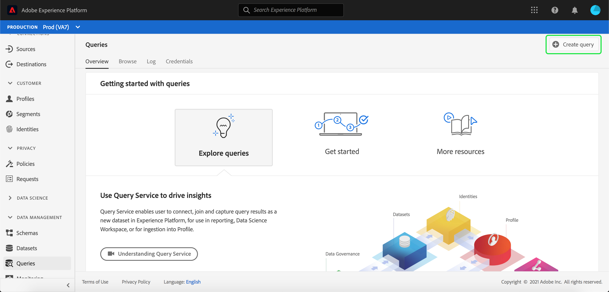

### クエリサービスへの接続 {#connecting-to-query-service}

クエリエディターを開くと、クエリサービスを初期化して接続するのに数秒かかります。 クエリサービスに接続されると、コンソールに表示されます（以下を参照）。エディターがクエリサービスに接続される前にクエリを実行しようとすると、接続が完了するまで実行が待機されます。

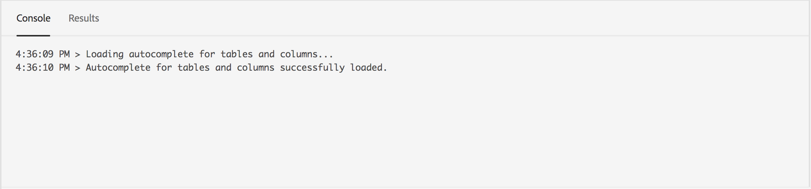

### クエリエディターからのクエリの実行 {#run-a-query}

クエリエディターから実行されるクエリは、インタラクティブに実行されます。つまり、ブラウザーを閉じたり、移動したりすると、クエリはキャンセルされます。 クエリ出力からデータセットを生成するために作成されたクエリについても同様です。

## 拡張クエリエディターを使用したクエリのオーサリング {#query-authoring}

クエリエディターを使用して、顧客体験データのクエリを記述、実行および保存できます。実行されたクエリ、またはクエリエディターに保存されたすべてのクエリは、組織内のすべてのユーザーがクエリサービスにアクセスできます。

### データベースセレクター {#database-selector}

クエリエディターの右上にあるドロップダウンメニューから、クエリするデータベースを選択します。 選択したデータベースがドロップダウンに表示されます。

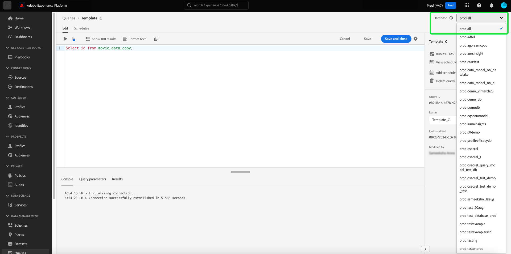

### 設定 {#settings}

クエリエディターの入力フィールドの上にある設定アイコンには、ダークテーマを有効/無効にしたり、オートコンプリートを無効/有効にしたりするオプションが含まれています。

>[!TIP]
>
>進行状況を失うことなく、クエリのオーサリング中に[!UICONTROL Disable syntax auto complete]を実行できます。

暗いテーマまたは明るいテーマを有効にするには、設定アイコン（）の後に、表示されるドロップダウンメニューのオプションが続きます。

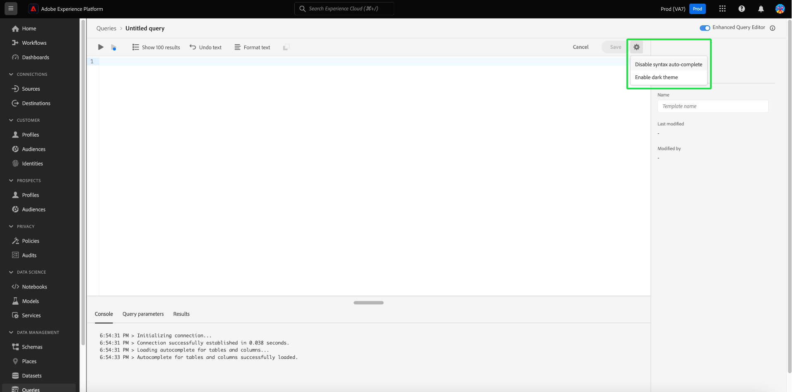

#### オートコンプリート {#auto-complete}

クエリエディターは、クエリを記述する際に、クエリのテーブルまたは列の詳細と共に、潜在的なSQL キーワードを自動的に提案します。 オートコンプリート機能はデフォルトで有効になっており、クエリエディターの設定からいつでも無効または有効にできます。

オートコンプリート設定はユーザーごとに設定され、そのユーザーの連続ログインで記憶されます。 この機能を無効にすると、いくつかのメタデータコマンドが処理されなくなり、クエリの編集時に作成者のスピードアップにつながるレコメンデーションが提案されます。

### 複数のシーケンシャルクエリの実行 {#execute-multiple-sequential-queries}

拡張クエリエディターを使用して複数のクエリを作成し、すべてのクエリを順番に実行します。 シーケンス内の複数のクエリの実行は、各ログエントリを生成します。 ただし、最初のクエリの結果のみがクエリエディターコンソールに表示されます。 実行されたクエリのトラブルシューティングまたは確認が必要な場合は、クエリログを確認します。 詳しくは、[&#x200B; クエリログのドキュメント &#x200B;](./query-logs.md)を参照してください。

>[!NOTE]
> 
>クエリエディターで最初のクエリの後にCTAS クエリを実行した場合でも、テーブルは作成されますが、クエリエディターコンソールには出力されません。

### 選択したクエリを実行 {#execute-selected-query}

複数のクエリを作成したが、1つのクエリのみを実行する必要がある場合は、選択したクエリを強調表示して
[!UICONTROL Run selected query] アイコン。 このアイコンは、エディター内でクエリの構文を選択するまで、デフォルトでは無効になっています。

![[!UICONTROL Run selected query] アイコンがハイライト表示されたクエリエディター。](../images/ui/query-editor/run-selected-query.png)

### クエリエディターセッションをキャンセル {#cancel-query}

クエリ実行を制御し、長時間実行しているクエリをキャンセルして、生産性を向上させます。 このアクションは、クエリの実行中にクエリエディターをクリアします。 クエリはバックグラウンドで実行され続けます。 CTAS クエリの場合でも、出力データセットが生成されます。 エディターでの実行をキャンセルし、SQL ステートメントの作成を続行するには、クエリの実行後に&#x200B;**[!UICONTROL Cancel query]**&#x200B;を選択します。

![[!UICONTROL Cancel query]がハイライト表示されたクエリエディター。](../images/ui/query-editor/cancel-query-run.png)

確認ダイアログが表示されます。 クエリ実行をキャンセルするには、**[!UICONTROL Confirm]**&#x200B;を選択します。

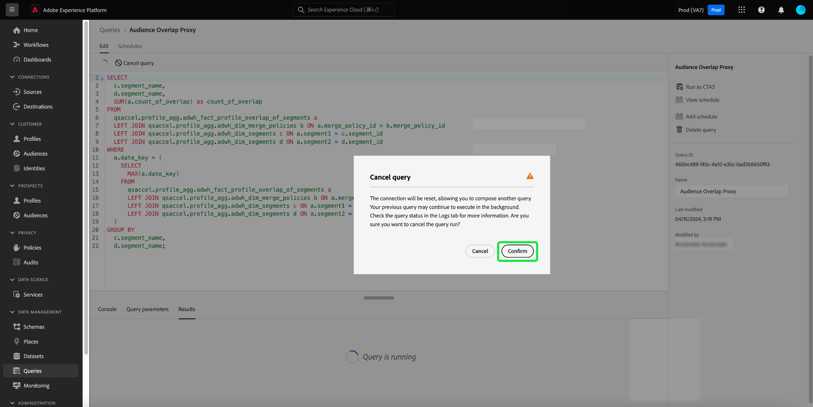

### 結果数 {#result-count}

クエリエディターの最大行出力は50,000です。 クエリエディターコンソールでは、一度に表示される行数を選択できます。 コンソールに表示される行数を変更するには、**[!UICONTROL Result count]** ドロップダウンを選択し、「50」、「100」、「150」、「300」、「500」、「1000」の各オプションから選択します。

>[!NOTE]
>
>Experience Platform UIでは最大1000行をサポートできるため、1000を超えるLIMIT値を渡すと無視されます。

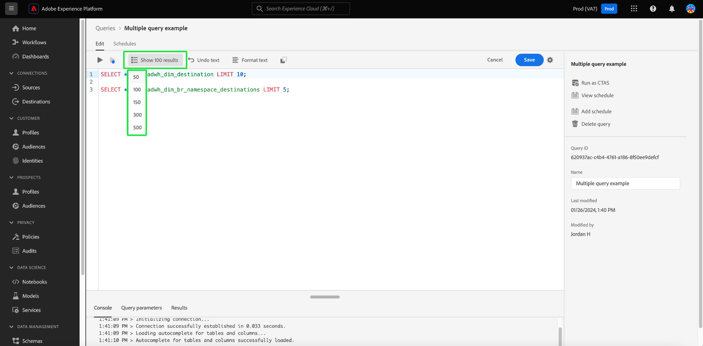

## クエリの記述 {#writing-queries}

[!UICONTROL Query Editor]は、クエリをできるだけ簡単に記述できるように構成されています。 次のスクリーンショットは、UI でエディターがどのように表示されるかを示しています。ここでは、SQL 入力フィールドと「**再生**」がハイライト表示されています。

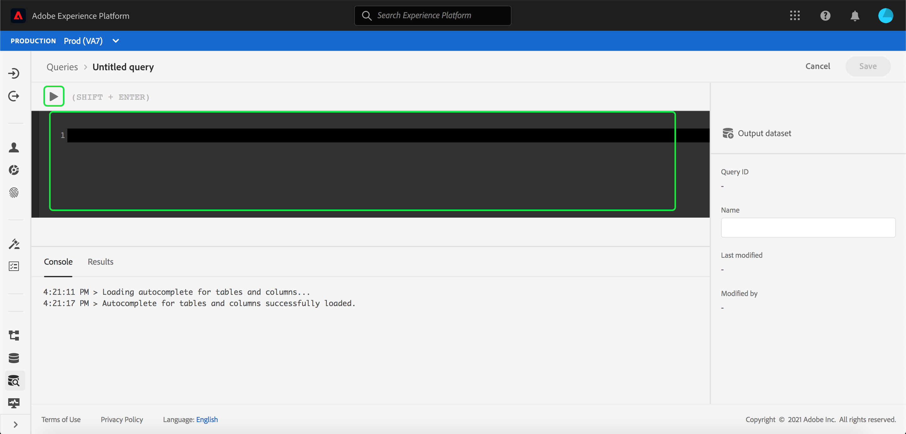

開発時間を最小限に抑えるために、返される行数に制限があるクエリを開発することをお勧めします。 たとえば、`SELECT fields FROM table WHERE conditions LIMIT number_of_rows` のように設定します。クエリが目的どおりの出力を生成することを確認したら、制限を解除して、`CREATE TABLE tablename AS SELECT` と設定してクエリを実行し、データセットを生成します。

## クエリエディターの記述ツール {#writing-tools}

クエリエディターのライティングツールを使用して、クエリのオーサリングプロセスを強化します。 機能には、テキストの書式設定、SQLのコピー、クエリの詳細の管理、作業の保存やスケジュール設定などのオプションが含まれています。

### テキストを書式設定 {#format-text}

[!UICONTROL Format text]機能は、標準化された構文スタイルを追加することで、クエリをより読みやすくします。 クエリ エディター内のすべてのテキストを標準化するには、**[!UICONTROL Format text]**&#x200B;を選択します。

>[!NOTE]
>
>[!UICONTROL Format text]機能は匿名ブロックでは機能しません。 1つ以上のSQL ステートメントを順次連結する方法については、[匿名ブロックのドキュメント &#x200B;](../key-concepts/anonymous-block.md)を参照してください。

![[!UICONTROL Format text]とSQL ステートメントが強調表示されたクエリ エディター。](../images/ui/query-editor/format-text.png)

<!-- 
### Undo text {#undo-text}

If you format your SQL in the Query Editor, you can undo the formatting applied by the [!UICONTROL Format text] feature. To return your SQL back to its original form, select **[!UICONTROL Undo text]**.

![The Query Editor with [!UICONTROL Undo text] and the SQL statements highlighted.](../images/ui/query-editor/undo-text.png) 
-->

### SQL をコピー {#copy-sql}

コピーアイコンを選択して、クエリエディターからクリップボードにSQLをコピーします。 このコピー機能は、クエリテンプレートとクエリエディターで新しく作成されたクエリの両方で使用できます。

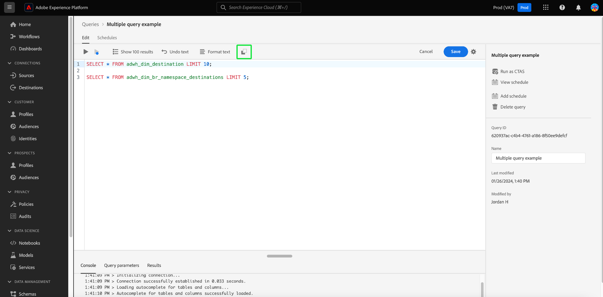

### クエリの詳細 {#query-details}

クエリ エディターでクエリを表示するには、[!UICONTROL Templates] タブから保存されているテンプレートを選択します。 クエリの詳細パネルには、選択したクエリを管理するための詳細情報とツールが表示されます。 また、クエリが最後に変更された日時や、変更されたユーザーなど、有用なメタデータも表示されます（該当する場合）。

>[!NOTE]
>
>[!UICONTROL View schedule]、[!UICONTROL Add schedule]および[!UICONTROL Delete query] オプションは、クエリがテンプレートとして保存された後にのみ使用できます。 [!UICONTROL Add schedule] オプションを使用すると、クエリ エディターからスケジュール ビルダーに直接移動します。 [!UICONTROL View schedule] オプションを使用すると、そのクエリのスケジュール インベントリに直接移動します。 UI[でクエリスケジュールを](./query-schedules.md#create-schedule)作成する方法については、クエリスケジュールのドキュメントを参照してください。

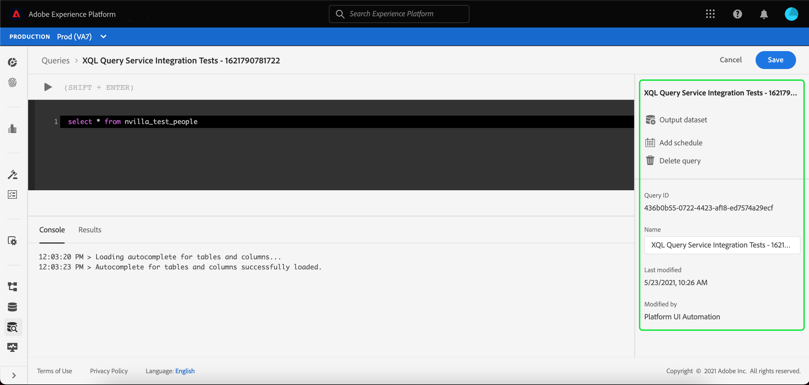

詳細パネルから、UIから出力データセットを直接生成したり、表示されるクエリを削除または名前を付けたり、クエリ実行スケジュールを表示したり、クエリをスケジュールに追加したりできます。

出力データセットを生成するには、**[!UICONTROL Run as CTAS]**&#x200B;を選択します。 **[!UICONTROL Enter output dataset details]** ダイアログが表示されます。 名前と説明を入力し、**[!UICONTROL Run as CTAS]**&#x200B;を選択します。 新しいデータセットが「**[!UICONTROL Datasets]** Browse」タブに表示されます。 組織で使用可能なデータセットについて詳しくは、[&#x200B; データセットの表示に関するドキュメント &#x200B;](../../catalog/datasets/user-guide.md#view-datasets)を参照してください。

>[!NOTE]
>
>[!UICONTROL Run as CTAS] オプションは、クエリに&#x200B;**not**&#x200B;がスケジュールされている場合にのみ使用できます。

![[!UICONTROL Enter output dataset details] ダイアログ。](../images/ui/query-editor/output-dataset-details.png)

**[!UICONTROL Run as CTAS]** アクションを実行すると、確認メッセージがポップアップ表示され、アクションが成功したことをお知らせします。 このポップアップメッセージには、クエリログワークスペースに移動するための便利な方法を提供するリンクが含まれています。 クエリログについて詳しくは、[&#x200B; クエリログのドキュメント &#x200B;](./query-logs.md)を参照してください。

### クエリの保存 {#saving-queries}

クエリエディターには、クエリを保存して後で操作できる保存機能が用意されています。 クエリを保存するには、クエリエディターの右上隅にある「**[!UICONTROL Save]**」を選択します。 クエリを保存する前に、**[!UICONTROL Query Details]** パネルを使用してクエリの名前を指定する必要があります。

>[!NOTE]
>
>クエリエディターを使用して名前が付けられ、保存されたクエリは、クエリダッシュボード [!UICONTROL Templates] タブ内のテンプレートとして利用できます。 詳しくは、[テンプレートのドキュメント](./query-templates.md)を参照してください。

クエリエディターでクエリを保存すると、確認メッセージがポップアップ表示され、アクションが成功したことを通知します。 このポップアップメッセージには、クエリスケジューリングワークスペースに移動するための便利な方法を提供するリンクが含まれています。 カスタムケイデンスでクエリを実行する方法については、[&#x200B; クエリのスケジュールに関するドキュメント &#x200B;](./query-schedules.md)を参照してください。

### スケジュール済みクエリ {#scheduled-queries}

テンプレートとして保存されたクエリは、クエリエディターからスケジュールできます。 クエリのスケジュール設定を使用すると、カスタムケイデンスでクエリの実行を自動化できます。 頻度、日付、時間に基づいてクエリをスケジュールし、必要に応じて結果の出力データセットを選択することもできます。 クエリスケジュールは、UIを通じて無効にしたり削除したりすることもできます。

スケジュールはクエリエディターで設定します。 クエリエディターを使用する場合、既に作成および保存されたクエリにのみスケジュールを追加できます。 同じ制限は、クエリサービス APIには適用されません。

>[!NOTE]
>
>10回の連続実行に失敗したスケジュール済みクエリは、自動的に[!UICONTROL Quarantined] ステータスになります。 このステータスのクエリは、それ以上の実行を行う前に、ユーザーの介入が必要です。 詳しくは、[強制隔離クエリ &#x200B;](./monitor-queries.md#quarantined-queries)のドキュメントを参照してください。

UI[でクエリスケジュールを](./query-schedules.md)作成する方法については、クエリスケジュールのドキュメントを参照してください。 または、APIを使用してスケジュールを追加する方法については、[&#x200B; スケジュールクエリエンドポイントガイド &#x200B;](../api/scheduled-queries.md)を参照してください。

スケジュールされたクエリは、[!UICONTROL Scheduled queries] タブのリストに追加されます。 そのワークスペースから、UIを使用して、スケジュールされたすべてのクエリジョブのステータスを監視できます。 「[!UICONTROL Scheduled queries]」タブで、クエリの実行に関する重要な情報を検索し、アラートを購読できます。 使用可能な情報には、実行に失敗した場合のステータス、スケジュールの詳細、エラーメッセージ/コードが含まれます。 詳しくは、[&#x200B; スケジュール済みクエリの監視ドキュメント &#x200B;](./monitor-queries.md)を参照してください。

### 以前のクエリを検索する方法 {#previous-queries}

クエリエディターで実行したクエリはすべて「ログ」テーブルに保存されます。「**[!UICONTROL Log]**」タブの検索機能を使用して、クエリ実行を検索できます。 保存されたクエリは、**[!UICONTROL Templates]** タブに一覧表示されます。

クエリがスケジュールされた場合、「[!UICONTROL Scheduled Queries]」タブでは、これらのクエリジョブのUIを通じて可視性が向上します。 詳しくは、[クエリモニタリングのドキュメント](./monitor-queries.md)を参照してください。

>[!NOTE]
>
>実行されなかったクエリは「ログ」に保存されません。クエリをクエリサービスで使用するには、クエリエディターでクエリを実行するか保存する必要があります。

### オブジェクトブラウザー {#object-browser}

オブジェクトブラウザーを使用すると、データセットを簡単に検索してフィルタリングできます。 オブジェクトブラウザーは、多数のデータセットを含む大規模環境でテーブルやデータセットを検索する時間を短縮します。 関連するデータやメタデータへの効率的なアクセスにより、ナビゲーションではなくクエリのオーサリングに集中できます。

オブジェクトブラウザーでデータベースを移動するには、検索フィールドにテーブル名を入力するか、**[!UICONTROL Tables]**&#x200B;を選択して、使用可能なデータセットとテーブルのリストを展開します。 検索フィールドを使用する場合、使用可能なテーブルのリストは、入力に基づいて動的にフィルタリングされます。

選択したデータベース [に含まれるすべてのデータセットは、クエリエディターの左側にあるナビゲーションパネルに一覧表示されます。](#database-dropdown)

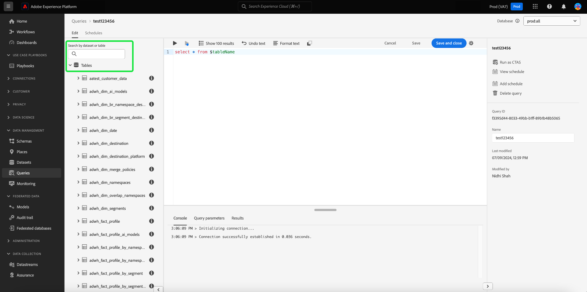

オブジェクトブラウザーに表示されるスキーマは、観測可能なスキーマです。 つまり、変更をすぐに確認できるため、変更と更新をリアルタイムで監視するために利用できます。 監視可能なスキーマは、データの同期を確保し、デバッグや分析タスクを支援します。

#### 現在の制限 {#current-limitation}

システムはクエリを順次処理します。つまり、一度に実行できるクエリは1つだけです。 クエリの処理中は、左側のナビゲーションで追加のテーブルにアクセスできません。

#### テーブルのメタデータへのアクセス {#table-metadata}

クイック検索に加えて、テーブル名の横にある「i」アイコンを選択して、任意のテーブルのメタデータに簡単にアクセスできるようになりました。 これにより、選択したテーブルに関する詳細な情報が提供され、クエリを作成する際に情報に基づいた意思決定を行うのに役立ちます。

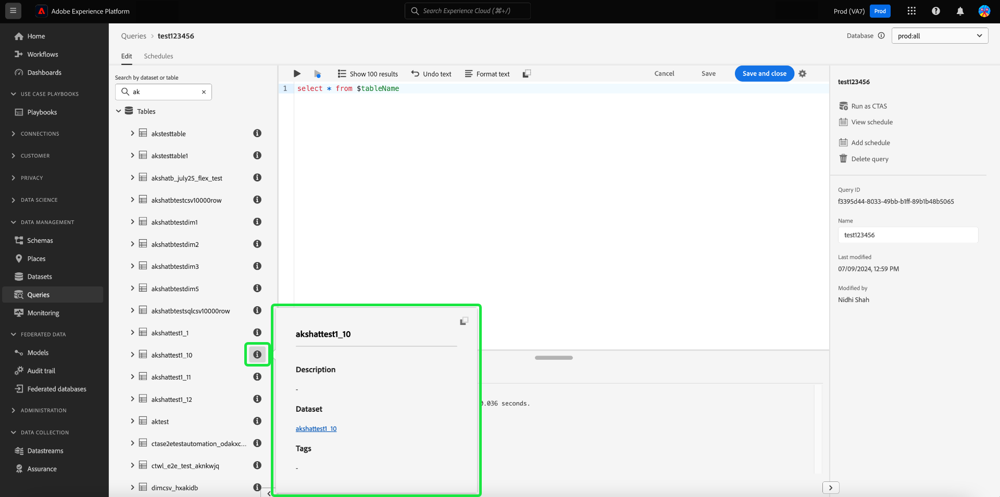

#### 子テーブルの探索

子テーブルまたはリンクされたテーブルを検索するには、リスト内のテーブル名の横にあるドロップダウン矢印を選択します。 これにより、テーブルが拡張され、関連する子テーブルが表示され、データ構造が明確に表示され、より複雑なクエリ構築が可能になります。 フィールド名の横にあるアイコンは、列のデータタイプを示しており、複雑なクエリ時に列を識別するのに役立ちます。

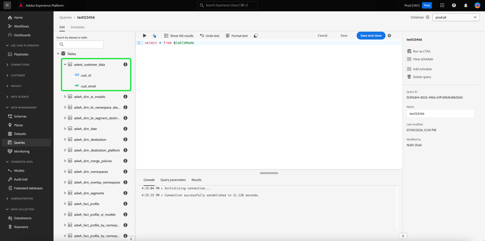

## クエリエディターを使用してクエリを実行する {#executing-queries}

クエリエディターでクエリを実行するには、エディターにSQLを入力するか、**[!UICONTROL Log]**&#x200B;または&#x200B;**[!UICONTROL Templates]** タブから以前のクエリを読み込み、**再生**&#x200B;を選択します。 クエリ実行のステータスは下の&#x200B;**[!UICONTROL Console]** タブに表示され、出力データは&#x200B;**[!UICONTROL Results]** タブに表示されます。

### コンソール {#console}

コンソールには、クエリサービスのステータスと処理に関する情報が表示されます。コンソールには、クエリサービスへの接続ステータス、実行中のクエリ処理、およびこれらのクエリの実行時に発生したエラーメッセージが表示されます。

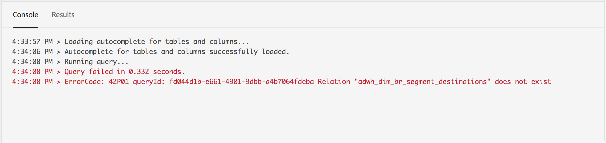

>[!NOTE]
>
>コンソールには、クエリの実行に起因するエラーのみが表示されます。 クエリが実行される前に発生するクエリ検証エラーは表示されません。

## クエリの結果 {#query-results}

クエリが完了すると、結果は&#x200B;**[!UICONTROL Results]** タブの横にある&#x200B;**[!UICONTROL Console]** タブに表示されます。 このビューには、選択した[結果数](#result-count)に応じて、50 ～ 1000行の結果が表示される、クエリの表形式の出力が表示されます。 このビューを使用すると、クエリが目的どおりの出力を生成することを確認できます。クエリでデータセットを生成するには、返される行の制限を解除し、`CREATE TABLE tablename AS SELECT` と設定してクエリを実行します。クエリエディターでクエリの結果からデータセットを生成する方法については、[データセットの生成についてのチュートリアル](./create-datasets.md)を参照してください。

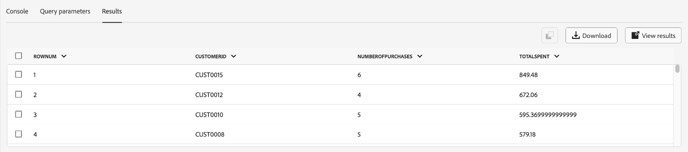

### クエリ結果のダウンロード {#download-query-results}

>[!AVAILABILITY]
>
>ダウンロード機能は、Data Distiller アドオンを使用しているお客様のみが利用できます。 Data Distillerについて詳しくは、Adobe担当者にお問い合わせください。

クエリを正常に実行した後、結果をCSV、XLSX、またはJSON形式でダウンロードして、オフライン分析、レポート、またはスプレッドシートのワークフローで使用します。 この機能により、オフライン分析、レポート、Excel ベースのプロセスで結果のクエリにすばやくアクセスできるようになり、マーケティング部門と分析部門のワークフローが合理化されます。

クエリ結果をダウンロードするには、「**[!UICONTROL Download]**」タブの右上隅にある「**[!UICONTROL Result]**」を選択します。 次に、ドロップダウンメニューから「**[!UICONTROL CSV]**」、「**[!UICONTROL XLSX]**」または「**[!UICONTROL JSON]**」を選択します。 ファイルはローカルマシンに自動的にダウンロードされます。 ユースケースに合った形式、軽量エクスポート用のCSV、フォーマットされたスプレッドシート用のXLSX、構造化データ処理用のJSONを選択できます。

>[!NOTE]
>
>**[!UICONTROL Download]** ボタンが見つからない場合は、クエリの結果を確認してください。 このボタンは、レコードが返された場合にのみ表示されます。 レコードが返されない場合、「**[!UICONTROL Result]**」タブに「結果なし」メッセージが表示され、ダウンロードオプションが無効になります。

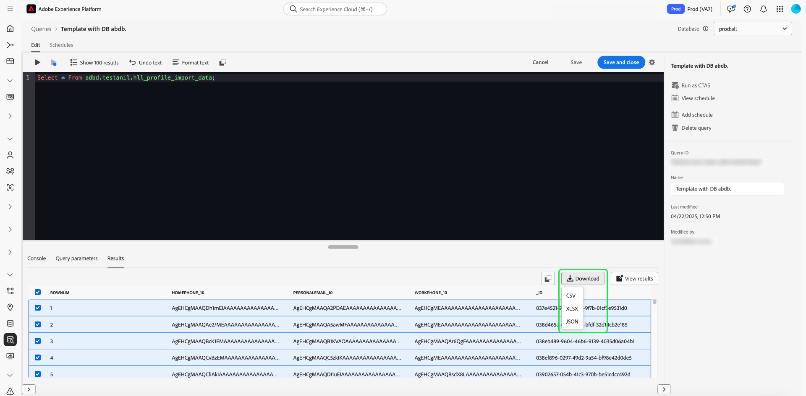

>[!NOTE]
>
>ExcelでCSV ファイルを開くと、次の警告が表示される場合があります。  「データが失われる可能性があります。 このブックをコンマ区切り（.csv）形式で保存すると、一部の機能が失われる可能性があります。 これらの機能を保持するには、Excel ファイル形式で保存します。」 また、日付と時刻の形式は、ファイルの種類によって異なる場合があることに注意してください。 CSV ファイルはクエリ結果に表示される形式を保持し、XLSX ファイルはExcelでローカライズされた形式を自動的に適用できます。 この警告が表示された場合は、安全に続行できます。 Excel固有の書式を保持するには、代わりにXLSXとしてファイルを保存します。

### 結果を全画面で表示 {#view-results}

正常なクエリを実行した後、「**[!UICONTROL View results]**」タブで「**[!UICONTROL Result]**」を選択して、結果の表形式の全画面表示を開きます。

フルスクリーンプレビューを使用すると、横方向のスクロールなしで幅広いテーブルを簡単にスキャンし、行レベルの詳細を検査できます。 フルスクリーンビューでは、出力がサイズ変更可能なグリッドで表示されるため、大きなデータセットを確認したり、列をスキャンしたりすることが簡単になります。

>[!NOTE]
>
>プレビューは読み取り専用で、クエリやデータセットは変更されません。

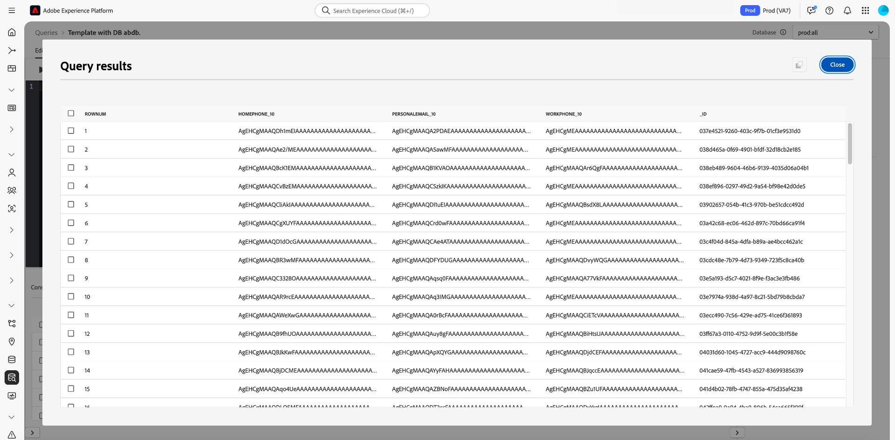

### 結果をコピー {#copy-results}

クエリエディターの拡張コピー機能を使用して、クエリの結果をコンマ区切り値（CSV）としてコピーし、Excelなどのスプレッドシートツールに貼り付けて、即座に検証またはレポート作成できます。 この機能により、サードパーティのツールに頼ることなく、読みやすくなり、フォーマットを保持し、ワークフローを合理化できます。

クエリの結果は、[!UICONTROL Result] タブまたはフルスクリーンの結果プレビューからコピーできます。 「**[!UICONTROL Result]**」タブから、コピーアイコン（）を使用して、すべてのクエリ結果をクリップボードにコピーします。 コピーアイコンを有効にするには、まず行を選択します。 個々の行を選択するか、上部のチェックボックスを使用してすべての行を一度に選択できます。

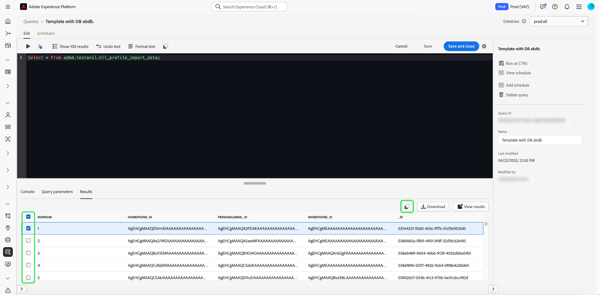

または、**[!UICONTROL View results]**&#x200B;を選択して、全画面プレビューを開きます。 このダイアログで、個々の行を選択するか、左上隅のチェックボックスを使用してすべての行を選択し、コピーアイコン（）を使用して、選択したデータをコピーします。

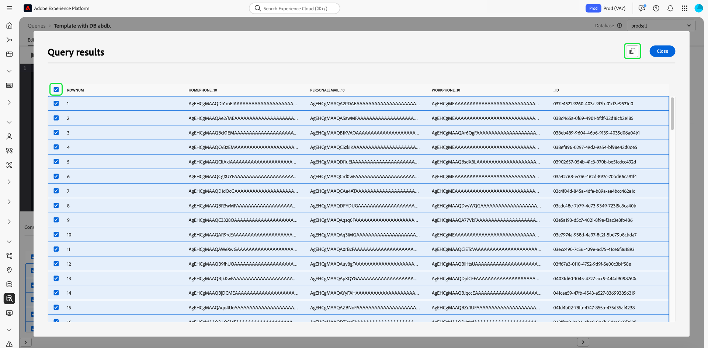

### レガシー結果テーブル（制限付き使用可能） {#legacy-results-table}

>[!AVAILABILITY]
>
>従来の結果テーブルは、機能フラグを使用してユーザーを選択するためにのみ使用でき、現在のクエリエディターエクスペリエンスには表示されない可能性があります。 ドラッグ&amp;ドロップ操作のワークフローを使用している場合は、Adobeの担当者に連絡してアクセスをリクエストしてください。

旧バージョンのクエリエディターは、QAやスプレッドシートベースのレビューなど、柔軟な手作業によるデータワークフローを利用するユーザーを対象としています。

ブラウザーベースのドラッグ選択がネイティブでサポートされているので、標準的な選択動作を使用して、個々のセルやブロックを含む出力の任意の部分をハイライト表示してコピーできます。 これは、構造化された行の選択と専用のコピーアクションを使用する拡張テーブルとは対照的です。

コピーされたデータはタブ区切りなので、Excelなどのツールに貼り付けると、列の整列と読み取りが維持されます。 列ヘッダーは、ヘッダー行をドラッグして選択する際にも含まれます。

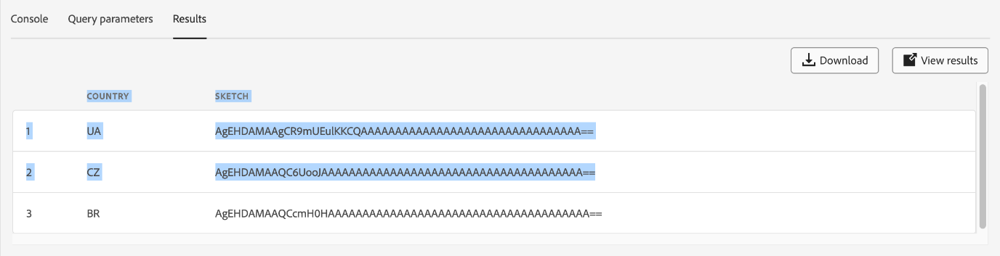

## 例 {#examples}

Query Serviceは、業界やビジネスシナリオに関する様々なユースケースに対するソリューションを提供します。 これらの例は、多様なニーズに対応する上で、サービスの柔軟性と影響を示しています。 [Query Serviceが特定のビジネスニーズにどのように価値をもたらすのかを明らかにするには、](../use-cases/overview.md)のユースケース文書の包括的なコレクションをご覧ください。 Query Serviceを使用して、業務効率とビジネスの成功を向上させるインサイトとソリューションを提供する方法を説明します。

<!-- This video is from 2019. The logic is sounds but the workflow is too outdated. -->

## クエリサービスでのクエリの実行のチュートリアルビデオ {#query-tutorial-video}

次のビデオでは、Adobe Experience Platform インターフェイスおよび PSQL クライアントでクエリを実行する方法を説明します。 このビデオでは、XDM オブジェクトでの個々のプロパティの使用、Adobe定義の関数、CREATE TABLE AS SELECT （CTAS）クエリの使用方法も説明します。

>[!NOTE]
>
>ビデオに示されているUIは古くなっていますが、ワークフローで使用されるロジックは同じままです。

>[!VIDEO](https://video.tv.adobe.com/v/29796?quality=12&learn=on)

## 同時セッションの監視と管理 {#monitor-manage-sessions}

セッション管理を使用して、サンドボックス間でアクティブなクエリエディターセッションを表示し、アイドルセッションを特定し、共有キャパシティを解放するために終了します。 クエリをアクティブに実行しているセッションを中断することはできません。 この機能は管理者向けであり、**[!UICONTROL Manage Query Session]**&#x200B;権限が必要です。

セッション管理にアクセスするには、クエリサービスワークスペースの「**[!UICONTROL Admin]**」タブを選択します。 セッションの詳細の表示、セッションの状態の解釈、アイドルセッションの終了に関する手順については、[&#x200B; クエリサービスセッションの管理](session-management.md)を参照してください。

## 次の手順

クエリエディターで使用できる機能とアプリケーションのナビゲーション方法を理解したところで、[!DNL Experience Platform]で独自のクエリのオーサリングを直接開始できます。 [!DNL Data Lake] のデータセットに対して SQL クエリを実行する方法については、[クエリの実行](../best-practices/writing-queries.md)に関するガイドを参照してください。
