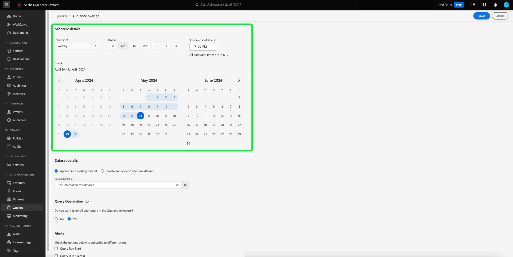

# [!DNL Query Editor] UI ガイド

[!DNL Query Editor] は、Adobe Experience Platformが提供するインタラクティブなツールです [!DNL Query Service]：内で顧客体験データのクエリを記述、検証および実行できます。 [!DNL Experience Platform] ユーザーインターフェイス。 [!DNL Query Editor] では、分析およびデータ調査用のクエリの開発をサポートし、開発用のインタラクティブクエリと、非インタラクティブクエリを実行してデータセットを [!DNL Experience Platform].

の概念と機能に関する詳細 [!DNL Query Service]を参照し、 [クエリサービスの概要](../home.md). クエリサービスのユーザーインターフェイスを [!DNL Platform]を参照し、 [クエリサービス UI の概要](./overview.md).

## はじめに {#getting-started}

[!DNL Query Editor] に接続することで、クエリを柔軟に実行できます。 [!DNL Query Service]、およびクエリは、この接続がアクティブな間にのみ実行されます。

### 接続先 [!DNL Query Service] {#connecting-to-query-service}

[!DNL Query Editor] 初期化と接続に数秒かかります [!DNL Query Service] をクリックします。 次に示すように、コンソールは、接続されたタイミングを示します。 エディターがクエリサービスに接続される前にクエリを実行しようとすると、接続が完了するまで実行が待機されます。

### クエリの実行元 [!DNL Query Editor] {#run-a-query}

実行元のクエリ [!DNL Query Editor] をインタラクティブに実行します。 つまり、ブラウザーを閉じたり、別の場所に移動したりすると、クエリはキャンセルされます。また、クエリ出力からデータセットを生成するために実行するクエリも同様です。

## を使用したクエリオーサリング [!DNL Query Editor] {#query-authoring}

使用 [!DNL Query Editor]を使用すると、顧客体験データのクエリを記述、実行および保存できます。 実行または保存されたすべてのクエリ [!DNL Query Editor] が、 [!DNL Query Service].

### [!DNL Query Editor] へのアクセス {#accessing-query-editor}

内 [!DNL Experience Platform] UI、「 」を選択します。 **[!UICONTROL クエリ]** 左側のナビゲーションメニューで、 [!DNL Query Service] ワークスペース。 次に、 **[!UICONTROL クエリを作成]** をクリックして、クエリの記述を開始します。 このリンクは、 [!DNL Query Service] ワークスペース。

### クエリの記述 {#writing-queries}

[!UICONTROL クエリエディターは、クエリをできるだけ簡単に記述できるように構成されています。]次のスクリーンショットは、UI でエディターがどのように表示されるかを示しています。ここでは、**プレイする**&#x200B;ボタンと SQL 入力フィールドがハイライトされています。

開発時間を最小限に抑えるために、返される行を制限してクエリを開発することをお勧めします。たとえば、`SELECT fields FROM table WHERE conditions LIMIT number_of_rows` のように設定します。クエリが目的どおりの出力を生成することを確認したら、制限を解除して、`CREATE TABLE tablename AS SELECT` と設定してクエリを実行し、データセットを生成します。

### の記述ツール [!DNL Query Editor] {#writing-tools}

- **構文の自動ハイライト：** SQL の読み取りと構成が容易になります。

- **SQL キーワードのオートコンプリート：** クエリの入力を開始し、矢印キーを使用して目的の語句に移動して、 **入力**.

- **テーブルとフィールドのオートコンプリート**：`SELECT` 元のテーブル名の入力を開始し、矢印キーを使用して目的の表に移動して、**Enter** キーを押します。テーブルを選択すると、オートコンプリートによってそのテーブルのフィールドが認識されます。

### エラーの検出 {#error-detection}

[!DNL Query Editor] 一般的な SQL 検証と特定の実行検証を提供し、クエリの記述時にが自動的に検証されます。 以下の画像のように、クエリの下に赤い下線が表示される場合は、クエリ内にエラーがあります。

エラーが検出された場合、SQL コードの上にカーソルを置くと、特定のエラーメッセージが表示されます。

### クエリの詳細 {#query-details}

でクエリを表示しているとき [!DNL Query Editor]、 **[!UICONTROL クエリの詳細]** パネルには、選択したクエリを管理するためのツールが表示されます。

このパネルを使用すると、UI から直接出力データセットを生成し、表示されたクエリを削除または名前を付け、クエリにスケジュールを追加できます。

このパネルには、クエリの最終変更日時や最終変更者（該当する場合）などの有効なメタデータも表示されます。データセットを生成するには、「 **[!UICONTROL データセットを出力]**. **[!UICONTROL データセットを出力]**&#x200B;ダイアログが表示されます。名前と説明を入力し、「 」を選択します。 **[!UICONTROL クエリを実行]**. 新しいデータセットが **[!UICONTROL データセット]** タブ [!DNL Query Service] のユーザーインターフェイス [!DNL Platform].

### スケジュール済みクエリ {#scheduled-queries}

>[!IMPORTANT]
>
>次に、クエリエディターを使用する際の、スケジュール済みクエリの制限事項を示します。 これらは、 [!DNL Query Service] API: 既に作成、保存、実行されたクエリにのみスケジュールを追加できます。 あなた **できません** パラメータ化クエリにスケジュールを追加します。 スケジュールクエリ **できません** には、匿名ブロックが含まれています。

クエリにスケジュールを追加するには、 **[!UICONTROL スケジュールを追加]**.

この **[!UICONTROL スケジュールの詳細]** ページが表示されます。 このページでは、スケジュール済みクエリの頻度、スケジュール済みクエリが実行される日付、およびクエリのエクスポート先のデータセットを選択できます。

次のオプションを選択できます。 **[!UICONTROL 頻度]**:

- **[!UICONTROL 毎時]**:スケジュール済みクエリは、選択した日付期間に対して 1 時間ごとに実行されます。
- **[!UICONTROL 毎日]**:スケジュール済みクエリは、選択した日時と期間に X 日ごとに実行されます。 選択した時間は **UTC**&#x200B;ローカルタイムゾーンではなく、
- **[!UICONTROL 毎週]**:選択したクエリは、選択した曜日、時間、および期間に実行されます。 選択した時間は **UTC**&#x200B;ローカルタイムゾーンではなく、
- **[!UICONTROL 毎月]**:選択したクエリは、毎月、選択した日、時刻、および期間に実行されます。 選択した時間は **UTC**&#x200B;ローカルタイムゾーンではなく、
- **[!UICONTROL 毎年]**:選択したクエリは、毎年、選択した日、月、時間および期間に実行されます。 選択した時間は **UTC**&#x200B;ローカルタイムゾーンではなく、

データセットの場合は、既存のデータセットを使用するか、新しいデータセットを作成するかのどちらかを選択できます。

>[!IMPORTANT]
>
> 既存のデータセットを使用するか、新しいデータセットを作成するので、次の操作をおこないます **not** 次のいずれかを含める必要があります。 `INSERT INTO` または `CREATE TABLE AS SELECT` データセットは既に設定されているので、をクエリの一部として追加します。 次のいずれかを含む `INSERT INTO` または `CREATE TABLE AS SELECT` を設定すると、エラーが発生します。

これらの詳細をすべて確認したら、「 」を選択します。 **[!UICONTROL 保存]** スケジュールを作成します。

クエリの詳細ページが再び表示され、新しく作成したスケジュールの詳細（スケジュール ID、スケジュール自体、スケジュールの出力データセットなど）が表示されます。 スケジュール ID を使用して、スケジュール済みクエリ自体の実行に関する詳細を検索できます。 詳しくは、 [スケジュールされたクエリ実行エンドポイントガイド](../api/runs-scheduled-queries.md).

>[!NOTE]
>
> スケジュールできるのは **1 つ** UI を使用したクエリテンプレート。 クエリテンプレートにスケジュールを追加する場合は、API を使用する必要があります。 API を使用してスケジュールが既に追加されている場合は、次の手順を実行します。 **not** UI を使用してスケジュールを追加できます。 複数のスケジュールが既にクエリテンプレートにアタッチされている場合は、最も古いスケジュールのみが表示されます。 API を使用してスケジュールを追加する方法については、 [スケジュール済みクエリエンドポイントガイド](../api/scheduled-queries.md).
>
> また、表示しているスケジュールの最新の状態を確認するには、ページを更新する必要があります。

#### スケジュールの削除 {#delete-schedule}

スケジュールを削除するには、 **[!UICONTROL スケジュールの削除]**.

>[!IMPORTANT]
>
> クエリのスケジュールを削除する場合は、まずスケジュールを無効にする必要があります。

### クエリの保存 {#saving-queries}

[!DNL Query Editor] には、クエリを保存し、後で操作できる保存関数が用意されています。 クエリを保存するには、「 **[!UICONTROL 保存]** ～の右上隅に [!DNL Query Editor]. クエリを保存する前に、**[!UICONTROL クエリの詳細]**&#x200B;パネルを使用してクエリに名前を付ける必要があります。

### 以前のクエリを検索する方法 {#previous-queries}

から実行されたすべてのクエリ [!DNL Query Editor] は「ログ」テーブルにキャプチャされます。 「**[!UICONTROL ログ]**」タブの検索機能を使用して、クエリの実行を検索できます。保存したクエリは「**[!UICONTROL 参照]**」タブに表 示されます。

詳しくは、[クエリサービス UI の概要](./overview.md)を参照してください。

>[!NOTE]
>
>実行されなかったクエリは「ログ」に保存されません。クエリをで使用できるようにするには [!DNL Query Service]、で実行または保存する必要があります [!DNL Query Editor].

## クエリエディターを使用してクエリを実行する {#executing-queries}

でクエリを実行するには [!DNL Query Editor]を使用すると、エディターに SQL を入力するか、 **[!UICONTROL ログ]** または **[!UICONTROL 参照]** 「 」タブで「 」を選択します。 **再生**. クエリ実行のステータスは下の「**[!UICONTROL コンソール]**」タブに表示され、出力データは「**[!UICONTROL 結果]**」タブに表示されます。

### コンソール {#console}

コンソールには、 [!DNL Query Service]. コンソールには、次への接続ステータスが表示されます。 [!DNL Query Service]、実行中のクエリ操作、およびこれらのクエリによって生じるエラーメッセージ。

>[!NOTE]
>
>コンソールには、クエリの実行時に発生したエラーのみが表示されます。クエリを実行する前に、クエリ検証エラーは表示されません。

### クエリの結果 {#query-results}

クエリが完了すると、結果が **[!UICONTROL 結果]** タブ（横） **[!UICONTROL コンソール]** タブをクリックします。 このビューには、クエリの出力が表形式で出力され、最大 100 行まで表示されます。このビューを使用すると、クエリが目的どおりの出力を生成することを確認できます。クエリでデータセットを生成するには、返される行の制限を解除し、`CREATE TABLE tablename AS SELECT` と設定してクエリを実行します。詳しくは、 [データセットの生成チュートリアル](./create-datasets.md) を参照してください。 [!DNL Query Editor].

## 次を使用してクエリを実行 [!DNL Query Service] チュートリアルビデオ {#query-tutorial-video}

次のビデオでは、Adobe Experience Platformインターフェイスおよび PSQL クライアントでクエリを実行する方法を示します。 また、XDM オブジェクト内で個々のプロパティを使用し、Adobe定義関数を使用し、CREATE TABLE AS SELECT(CTAS) を使用する方法も示されます。

>[!VIDEO](https://video.tv.adobe.com/v/29796?quality=12&learn=on)

## 次の手順

これで、で使用できる機能がわかりました。 [!DNL Query Editor] アプリケーションを操作する方法については、 [!DNL Platform]. でのデータセットに対して SQL クエリを実行する方法の詳細 [!DNL Data Lake]( [クエリの実行](../best-practices/writing-queries.md).
