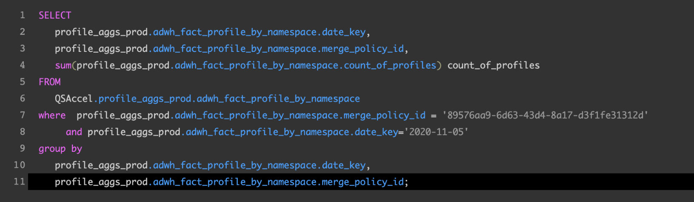

# [!DNL Query Editor] UI ガイド

[!DNL Query Editor] はAdobe Experience Platformが提供するインタラクティブなツ [!DNL Query Service]ールで、ユーザーインターフェイス内で顧客体験データのクエリを記述、検証、実行 [!DNL Experience Platform] できます。[!DNL Query Editor] は、分析およびデータ調査のためのクエリの開発をサポートし、開発用にインタラクティブクエリを実行したり、にデータセットを設定する非インタラクティブクエリを実行したりでき [!DNL Experience Platform]ます。

[!DNL Query Service]の概念と機能について詳しくは、「[クエリサービスの概要](../home.md)」を参照してください。 [!DNL Platform]上でクエリサービスのユーザーインターフェイスを操作する方法について詳しくは、[クエリサービスのUIの概要](./overview.md)を参照してください。

## はじめに

[!DNL Query Editor] には、に接続することでクエリを柔軟に実行で [!DNL Query Service]きます。クエリは、この接続がアクティブな間にのみ実行されます。

### [!DNL Query Service]に接続中

[!DNL Query Editor] は、開いたときに、初期化と接続に数秒 [!DNL Query Service] かかります。クエリサービスに接続されると、コンソールに示されます（以下を参照）。エディターがクエリサービスに接続される前にクエリを実行しようとすると、接続が完了するまで実行が待機されます。

### [!DNL Query Editor]からのクエリの実行方法

[!DNL Query Editor]から実行されたクエリは、インタラクティブに実行されます。 つまり、ブラウザーを閉じたり、別の場所に移動したりすると、クエリはキャンセルされます。また、クエリ出力からデータセットを生成するために実行するクエリも同様です。

## [!DNL Query Editor]を使用したクエリオーサリング

[!DNL Query Editor]を使用すると、顧客体験データのクエリを記述、実行、保存できます。 [!DNL Query Editor]で実行または保存されたすべてのクエリは、[!DNL Query Service]へのアクセス権を持つ組織のすべてのユーザーが使用できます。

### [!DNL Query Editor] へのアクセス

[!DNL Experience Platform] UIで、左側のナビゲーションメニューの「**[!UICONTROL クエリ]**」を選択して、[!DNL Query Service]ワークスペースを開きます。 次に、画面の右上にある「**[!UICONTROL クエリを作成]**」を選択して、クエリの記述を開始します。 このリンクは、[!DNL Query Service]ワークスペースの任意のページから利用できます。

### クエリの記述

[!UICONTROL クエリエディターは、クエリをできるだけ簡単に記述できるように構成されています。]次のスクリーンショットは、UI でエディターがどのように表示されるかを示しています。ここでは、**プレイする**&#x200B;ボタンと SQL 入力フィールドがハイライトされています。

開発時間を最小限に抑えるために、返される行を制限してクエリを開発することをお勧めします。たとえば、`SELECT fields FROM table WHERE conditions LIMIT number_of_rows` のように設定します。クエリが目的どおりの出力を生成することを確認したら、制限を解除して、`CREATE TABLE tablename AS SELECT` と設定してクエリを実行し、データセットを生成します。

### [!DNL Query Editor]の書き込みツール

- **構文の自動ハイライト：** SQL の読み取りと構成が容易になります。

- **SQL キーワードのオートコンプリート：**&#x200B;クエリの入力を開始し、矢印キーを使用して目的の用語に移動して、**Enter** キーを押します。

- **テーブルとフィールドのオートコンプリート**：`SELECT` 元のテーブル名の入力を開始し、矢印キーを使用して目的の表に移動して、**Enter** キーを押します。テーブルを選択すると、オートコンプリートによってそのテーブルのフィールドが認識されます。

### エラーの検出

[!DNL Query Editor] 一般的なSQL検証と特定の実行検証を提供し、書き込み時にクエリが自動的に検証されます。以下の画像のように、クエリの下に赤い下線が表示される場合は、クエリ内にエラーがあります。

エラーが検出された場合、SQL コードの上にカーソルを置くと、特定のエラーメッセージが表示されます。

### クエリの詳細

[!DNL Query Editor]でクエリを表示している間、**[!UICONTROL クエリの詳細]**&#x200B;パネルには、選択したクエリを管理するためのツールが表示されます。

このパネルを使用すると、UIから直接出力データセットを生成し、表示されたクエリを削除または名前付けし、クエリにスケジュールを追加できます。

このパネルには、クエリの最終変更日時や最終変更者（該当する場合）などの有効なメタデータも表示されます。データセットを生成するには、「**[!UICONTROL データセットを出力]**」を選択します。 **[!UICONTROL データセットを出力]**&#x200B;ダイアログが表示されます。名前と説明を入力し、「**[!UICONTROL クエリを実行]**」を選択します。 新しいデータセットは、[!DNL Platform]の[!DNL Query Service]ユーザーインターフェイスの「**[!UICONTROL データセット]**」タブに表示されます。

### スケジュール済みクエリ {#scheduled-queries}

>[!NOTE]
>
> スケジュールは、既に作成、保存、実行されているクエリにのみ追加できます。 さらに、****&#x200B;は、パラメータ化されたクエリにスケジュールを追加できません。

クエリにスケジュールを追加するには、「**[!UICONTROL スケジュールを追加]**」を選択します。

**[!UICONTROL スケジュールの詳細]**&#x200B;ページが表示されます。 このページでは、スケジュール済みクエリの頻度、スケジュール済みクエリの実行日、およびクエリのエクスポート先のデータセットを選択できます。

**[!UICONTROL 頻度]**&#x200B;に対して、次のオプションを選択できます。

- **[!UICONTROL 1時間ごと]**:スケジュール済みクエリは、選択した日付期間に対して1時間ごとに実行されます。
- **[!UICONTROL 毎日]**:スケジュール済みクエリは、選択した日時と期間にX日ごとに実行されます。選択した時刻は、ローカルタイムゾーンではなく、**UTC**&#x200B;です。
- **[!UICONTROL 毎週]**:選択したクエリは、選択した曜日、時間、および日付期間に対して実行されます。選択した時刻は、ローカルタイムゾーンではなく、**UTC**&#x200B;です。
- **[!UICONTROL 毎月]**:選択したクエリは、毎月、選択した日時と期間に実行されます。選択した時刻は、ローカルタイムゾーンではなく、**UTC**&#x200B;です。
- **[!UICONTROL 年別]**:選択したクエリは、毎年選択した日、月、時刻、および日付期間に実行されます。選択した時刻は、ローカルタイムゾーンではなく、**UTC**&#x200B;です。

データセットの場合は、既存のデータセットを使用するか、新しいデータセットを作成するかを選択できます。

>[!IMPORTANT]
>
> 既存のデータセットを使用するか、新しいデータセットを作成するので、データセットは既に設定されているので、クエリの一部に`INSERT INTO`または`CREATE TABLE AS SELECT`を含める必要はありません。****&#x200B;スケジュール済みクエリの一部に`INSERT INTO`または`CREATE TABLE AS SELECT`を含めると、エラーが発生します。

これらの詳細をすべて確認したら、「**[!UICONTROL 保存]**」を選択してスケジュールを作成します。

クエリの詳細ページが再び表示され、新しく作成したスケジュールの詳細（スケジュールID、スケジュール自体、スケジュールの出力データセットなど）が表示されます。 スケジュールIDを使用して、スケジュール済みクエリ自体の実行に関する詳細を検索できます。 詳しくは、『[スケジュール済みクエリ実行エンドポイントガイド](../api/runs-scheduled-queries.md)』を参照してください。

>[!NOTE]
>
> UIを使用して、**1つの**&#x200B;クエリテンプレートのみをスケジュールできます。 クエリテンプレートにスケジュールを追加する場合は、APIを使用する必要があります。 APIを使用してスケジュールが既に追加されている場合は、UIを使用してスケジュールを追加する必要はありません。**** 複数のスケジュールが既にクエリテンプレートに添付されている場合は、最も古いスケジュールのみが表示されます。 APIを使用してスケジュールを追加する方法については、『[スケジュール済みクエリエンドポイントガイド](../api/scheduled-queries.md)』を参照してください。
>
> また、表示するスケジュールの最新の状態を確認するには、ページを更新する必要があります。

#### スケジュールの削除

スケジュールを削除するには、「**[!UICONTROL スケジュールを削除]**」を選択します。

>[!IMPORTANT]
>
> クエリのスケジュールを削除する場合は、まずスケジュールを無効にする必要があります。

### クエリの保存

[!DNL Query Editor] には、クエリを保存し、後で操作するための保存関数が用意されています。クエリを保存するには、[!DNL Query Editor]の右上隅にある「**[!UICONTROL 保存]**」を選択します。 クエリを保存する前に、**[!UICONTROL クエリの詳細]**&#x200B;パネルを使用してクエリに名前を付ける必要があります。

### 以前のクエリを検索する方法

[!DNL Query Editor]から実行されたすべてのクエリは、ログテーブルにキャプチャされます。 「**[!UICONTROL ログ]**」タブの検索機能を使用して、クエリの実行を検索できます。保存したクエリは「**[!UICONTROL 参照]**」タブに表 示されます。

詳しくは、[クエリサービス UI の概要](./overview.md)を参照してください。

>[!NOTE]
>
>実行されなかったクエリは「ログ」に保存されません。[!DNL Query Service]でクエリを使用するには、[!DNL Query Editor]でクエリを実行または保存する必要があります。

## クエリエディターを使用してクエリを実行する

[!DNL Query Editor]でクエリを実行するには、エディターにSQLを入力するか、「**[!UICONTROL ログ]**」または「**[!UICONTROL 参照]**」タブから前のクエリを読み込み、「**再生**」を選択します。 クエリ実行のステータスは下の「**[!UICONTROL コンソール]**」タブに表示され、出力データは「**[!UICONTROL 結果]**」タブに表示されます。

### コンソール

コンソールは、[!DNL Query Service]の状態と操作に関する情報を提供します。 コンソールには、[!DNL Query Service]への接続状態、実行中のクエリ操作、およびこれらのクエリによって生じたエラーメッセージが表示されます。

>[!NOTE]
>
>コンソールには、クエリの実行時に発生したエラーのみが表示されます。クエリを実行する前に、クエリ検証エラーは表示されません。

### クエリの結果

クエリが完了すると、結果が「**[!UICONTROL コンソール]**」タブの横の「**[!UICONTROL 結果]**」タブに表示されます。このビューには、クエリの出力が表形式で出力され、最大 100 行まで表示されます。このビューを使用すると、クエリが目的どおりの出力を生成することを確認できます。クエリでデータセットを生成するには、返される行の制限を解除し、`CREATE TABLE tablename AS SELECT` と設定してクエリを実行します。[!DNL Query Editor]でのクエリ結果からデータセットを生成する方法については、[データセットの生成に関するチュートリアル](./create-datasets.md)を参照してください。

## [!DNL Query Service]チュートリアルビデオでクエリを実行

次のビデオでは、Adobe Experience PlatformインターフェイスおよびPSQLクライアントでクエリを実行する方法を示します。 さらに、XDMオブジェクトでの個々のプロパティの使用、Adobe定義関数の使用、CREATE TABLE AS SELECT(CTAS)の使用が示されます。

>[!VIDEO](https://video.tv.adobe.com/v/29796?quality=12&learn=on)

## 次の手順

これで、[!DNL Query Editor]で使用できる機能とアプリケーションの操作方法がわかったので、[!DNL Platform]で直接独自のクエリの作成を開始できます。 [!DNL Data Lake]内のデータセットに対してSQLクエリを実行する方法について詳しくは、[クエリの実行](../best-practices/writing-queries.md)に関するガイドを参照してください。
