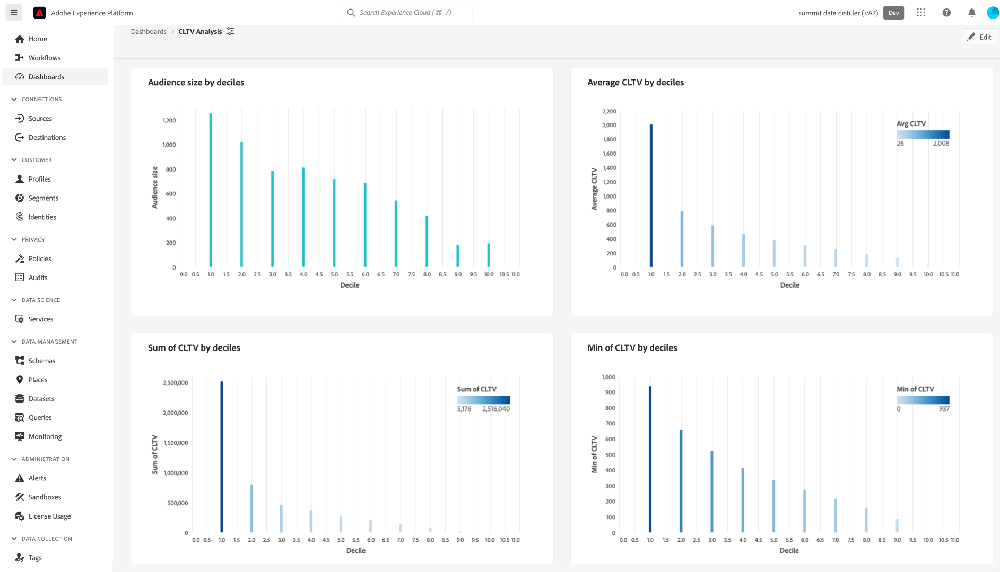

# データシグナルを追跡して顧客のライフタイム値を生成する

Real-time Customer Data Platformを使用して、顧客のライフタイム値 (CLV) を追跡し、その指標をユーザー定義のダッシュボードで視覚化できます。 Data Distillerとユーザー定義のダッシュボードを使用すると、関係全体にわたって、顧客が会社にとってどの程度価値があるかを測定できます。 CLV を知ることで、既存の顧客を維持し、利益率を維持しながら、新規顧客を獲得するためのビジネス戦略を展開するのに役立ちます。

以下の解説図は、マーケティングキャンペーンを改善するための高パフォーマンスのデータを生成する、データ収集、操作、分析および動作のサイクルを示しています。

このエンドツーエンドの使用例では、データシグナルを取得して変更し、顧客のライフタイム値の派生属性を計算する方法を示しています。 これらの派生属性は、その後、Real-Time CDPのプロファイルデータに適用でき、ユーザー定義のダッシュボードで使用してインサイト分析用のダッシュボードを作成できます。 Data Distillerを通じて、Real-Time CDPインサイトデータモデルを拡張し、CLV 派生属性とダッシュボードインサイトを使用して、新しいセグメントを作成し、目的の宛先にアクティブ化できます。 その後、これらのセグメントを使用して、パフォーマンスの高いオーディエンスを作成し、次のマーケティングキャンペーンを強化できます。

このガイドは、CLV を推進する主要なタッチポイントにわたってデータシグナルを測定し、お客様の環境に同様の使用例を実装することで、顧客体験をより深く理解できるようにすることを目的としています。 プロセス全体を次の図にまとめます。

## はじめに {#getting-started}

このガイドでは、Adobe Experience Platformの次のコンポーネントに関する十分な知識が必要です。

* [クエリサービス](../home.md):SQL クエリを使用してデータを分析およびエンリッチメントできるユーザーインターフェイスと RESTful API を提供します。
* [セグメント化サービス](../../segmentation/home.md):リアルタイム顧客プロファイルデータからセグメントを作成し、オーディエンスを生成できます。

## 前提条件

このガイドでは、 [データDistiller](../data-distiller/overview.md) SKU をパッケージの一部として提供。 これがあるかどうかがわからない場合は、Adobe サービス担当者にお問い合わせください。

## 派生属性の作成 {#create-derived-attribute}

CLV を設定する最初の手順は、ユーザーのアクションからキャプチャされたデータシグナルから派生属性を作成することです。 この特定の使用例は、航空会社のロイヤリティスキームに関する別のドキュメントでキャプチャされます。 方法については、ガイドを参照してください。 [クエリサービスを使用して、プロファイルデータと共に使用する、デシルベースの派生属性を作成します](./deciles-use-case.md). 次の手順を説明する完全な例と説明がドキュメントに記載されています。

* スキーマを作成して、デシルのグループ化を許可します。
* クエリサービスを使用してデシルを作成します。
* 十分なデータセットを生成します。
* リアルタイム顧客プロファイルでスキーマの使用を有効にします。
* ID 名前空間を作成し、プライマリ識別子としてマークします。
* クエリを作成して、ルックバック期間中のデシルを計算します。

## インサイトデータモデルの拡張と更新のスケジュール設定 {#extend-data-model-and-set-refresh-schedule}

次に、カスタムデータモデルを作成するか、既存のAdobe Real-Time CDPデータモデルを拡張して、CLV レポートインサイトと連携する必要があります。 方法については、ドキュメントを参照してください。 [クエリサービスを通じてレポートインサイトデータモデルを構築し、高速ストアデータとユーザー定義ダッシュボードで使用します。](../data-distiller/query-accelerated-store/reporting-insights-data-model.md#build-a-reporting-insights-data-model). このチュートリアルでは、次の手順について説明します。

* Data Distiller を使用したレポートインサイト用のモデルの作成.
* テーブル、関係の作成、データの入力.
* レポートインサイトデータモデルのクエリ.
* Real-Time CDP インサイトデータモデルを使用したデータモデルの拡張.
* レポートインサイトモデルを拡張するディメンションテーブルの作成.
* 拡張した高速ストアレポートインサイトデータモデルのクエリ

[SQL クエリテンプレートをカスタマイズして、マーケティングおよび主要業績評価指標（KPI）のユースケースに関する Real-Time CDP レポートを作成する](../../dashboards/cdp-insights-data-model.md)方法については、 Real-time Customer Data Platform インサイトデータモデルのドキュメントを参照してください。

カスタムデータモデルを定期的に更新するスケジュールを設定してください。 これにより、必要に応じてデータが取り込みパイプラインの一部として返され、ユーザー定義のダッシュボードに入力されます。 詳しくは、 [スケジュールクエリガイド](../ui/query-schedules.md#create-schedule) スケジュールの設定方法を参照してください。

## インサイトを把握するためのダッシュボードの作成 {#build-a-custom-dashboard}

これで、カスタムデータモデルが作成されたので、カスタムクエリおよびユーザー定義ダッシュボードを使用してデータを視覚化する準備が整いました。次の方法に関する完全なガイダンスについては、ユーザー定義のダッシュボードの概要を参照してください。 [カスタムダッシュボードの作成](../../dashboards/user-defined-dashboards.md). UI ガイドには、以下の詳細が含まれています。

* ウィジェットの作成方法。
* ウィジェットコンポーザーの使用方法です。

デシルバケットを使用するカスタム CLV ウィジェットの例を以下に示します。

## セグメントの作成とアクティブ化による高パフォーマンスのオーディエンスの構築 {#create-and-activate-segments}

次の手順では、セグメントを作成し、リアルタイム顧客プロファイルデータからオーディエンスを生成します。 方法については、セグメントビルダーの UI ガイドを参照してください [Platform でのセグメントの作成とアクティブ化](../../segmentation/ui/segment-builder.md). このガイドでは、以下の方法に関する節を提供します。

* 属性、イベントおよび既存のオーディエンスの組み合わせを構成要素として使用して、セグメント定義を作成する。
* ルールビルダーキャンバスとコンテナを使用して、セグメントルールの実行順を制御する。
* 見込みオーディエンスの予測値を表示する。必要に応じてセグメント定義を調整できます。
* スケジュールに沿ったセグメント化に対してすべてのセグメント定義を有効にする。
* ストリーミングによるセグメント化に対して、特定のセグメント定義を有効にする。

また、 [セグメントビルダーのビデオチュートリアル](https://experienceleague.adobe.com/docs/platform-learn/tutorials/segments/create-segments.html) 詳しくは、こちらを参照してください。

## 電子メールキャンペーンのセグメントをアクティブ化 {#activate-segment-for-campaign}

セグメントを構築したら、宛先に対してアクティブ化する準備が整います。 Platform は、プロモーション電子メールキャンペーンの送信など、電子メールマーケティング活動を管理できる、様々な電子メールサービスプロバイダー (ESP) をサポートしています。

次を確認します。 [電子メールマーケティングの宛先の概要](https://experienceleague.adobe.com/docs/experience-platform/destinations/catalog/email-marketing/overview.html?lang=en#connect-destination) データの書き出し先となる、サポートされている宛先のリスト ( 例： [OracleEloqua](https://experienceleague.adobe.com/docs/experience-platform/destinations/catalog/email-marketing/oracle-eloqua-api.html?lang=en) ページ ) を参照してください。

## キャンペーンから返された分析データを確認する {#post-campaign-data-analysis}

これで、ソースのデータを [段階的に処理される](../essential-concepts/incremental-load.md) を、高速化されたデータストアのデータモデルに対するスケジュールされた更新の一環として追加します。 顧客からの応答イベントは、発生時またはバッチでAdobe Experience Platformに取り込むことができます。 データモデルは、設定やソースコネクタに応じて、1 日に 1 回、または複数回更新される場合があります。 詳しくは、 [バッチ取得 API の概要](../../ingestion/batch-ingestion/api-overview.md) または [ストリーミング取得の概要](../../ingestion/streaming-ingestion/overview.md) を参照してください。

データモデルが更新されると、カスタムダッシュボードウィジェットは、顧客のライフタイム値を測定し視覚化できる、意味のあるシグナルを提供します。

カスタム分析には、様々なビジュアライゼーションオプションが用意されています。

これらのインサイトは、今後のキャンペーンに関するビジネス戦略の策定に役立ちます。

## 次の手順

このドキュメントでは、Real-time Customer Data Platformを使用して CLV(Customer Lifetime Value) 指標を追跡し視覚化する方法について、より深く理解する必要があります。 クエリサービスとExperience Platformを通じて提供される多くのビジネスユースケースの詳細については、次のドキュメントをお読みください。

* [クエリサービスの汎用性とメリットを示す、廃止された参照の使用例をエンドツーエンドで示します。](./abandoned-browse.md)
* [クエリサービスと機械学習を使用して、純粋なオンライン Web サイト訪問者トラフィックからボットアクティビティを特定し、フィルタリングする方法](./bot-filtering.md)
* [複数のデータセットの結果を組み合わせ、選択した文字列とほぼ一致させる Platform データの照合を実行する方法です。](./fuzzy-match.md)

<!-- "Data signals are actions taken by consumers while online that offer clues about intent that can be acted upon. This includes anything from visiting a website to filling out a change of address or clicking an ad."  -->

<!-- "Customer touchpoints are your brand's points of customer contact, from start to finish." -->
