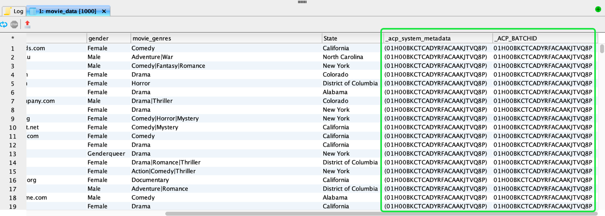
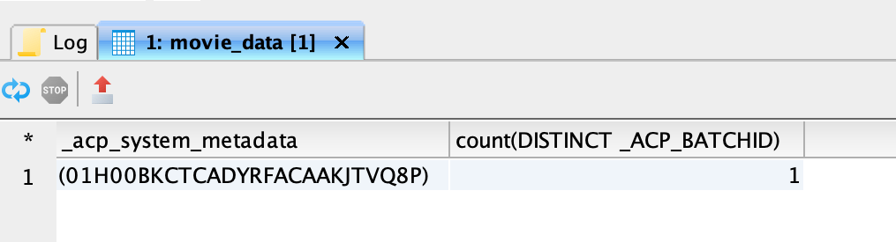
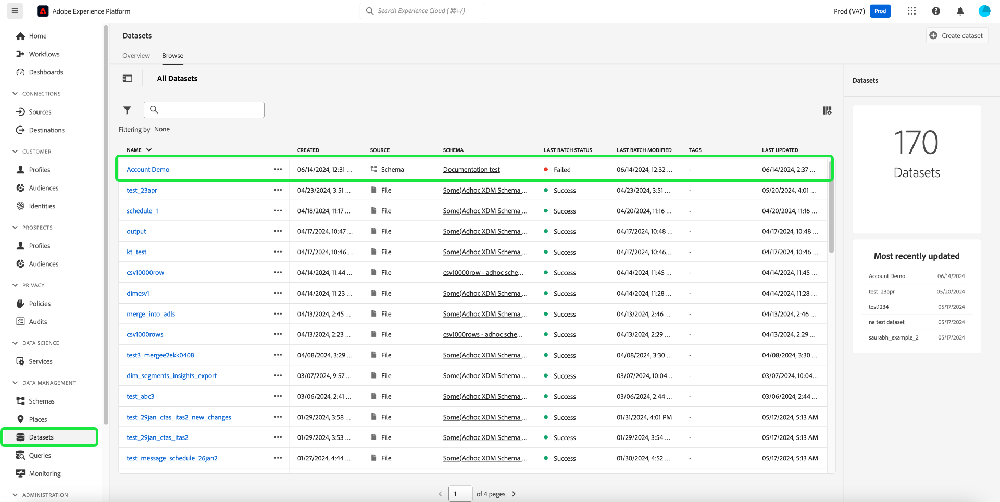

# SQLによるバッチ取り込みの調査、トラブルシューティング、検証

このドキュメントでは、取り込んだバッチ内のレコードをSQLで検証および検証する方法について説明します。 このドキュメントでは、次の方法について説明します。

- データセットのバッチメタデータへのアクセス
- バッチをクエリして、データの整合性を確保するトラブルシューティング

>[!NOTE]
>
>このガイドの一部のスクリーンショットは[!DNL DBVisualizer]から取得されています。 DBVisualizer](../clients/dbvisulaizer.md)またはその他[ サードパーティのBI ツール ](../clients/overview.md)とクエリサービスを[接続する方法については、リンクされたドキュメントを参照してください。

## 前提条件

このドキュメントで説明する概念を理解するために、次のトピックについて説明する必要があります。

- **データ取り込み**: [ データ取り込みの概要](../../ingestion/home.md)を参照して、Experience Platformにデータを取り込む方法の基本（様々な方法やプロセスを含む）を確認してください。
- **バッチ取り込み**: バッチ取り込みの基本的な概念については、[ バッチ取り込みAPIの概要](../../ingestion/batch-ingestion/overview.md)を参照してください。 具体的には、「バッチ」とは何か、Experience Platformのデータ取り込みプロセス内でどのように機能するのか。
- **データセット内のシステム メタデータ**: [ カタログサービスの概要](../../catalog/home.md)を参照して、システム メタデータ フィールドを使用して取り込んだデータを追跡およびクエリする方法を確認してください。
- **Experience Data Model （XDM）**: [ スキーマ UIの概要](../../xdm/ui/overview.md)と[のスキーマ構成の基本&#39;](../../xdm/schema/composition.md)を参照して、XDM スキーマについて学び、XDM スキーマがExperience Platformに取り込まれたデータの構造と形式をどのように表し、検証するかを確認します。

## データセットのバッチメタデータへのアクセス {#access-dataset-batch-metadata}

クエリ結果にシステム列（メタデータ列）が含まれていることを確認するには、クエリ エディターでSQL コマンド `set drop_system_columns=false`を使用します。 これにより、SQL クエリセッションの動作が設定されます。 新しいセッションを開始する場合は、この入力を繰り返す必要があります。

次に、データセットのシステムフィールドを表示するには、SELECT all ステートメントを実行して、データセットの結果（例：`select * from movie_data`）を表示します。 結果には、右側の`_acp_system_metadata`と`_ACP_BATCHID`の2つの新しい列が含まれます。 メタデータ列`_acp_system_metadata`と`_ACP_BATCHID`は、取り込んだデータの論理パーティションと物理パーティションを識別するのに役立ちます。



データがExperience Platformに取り込まれると、取り込まれたデータに基づいて論理パーティションが割り当てられます。 この論理パーティションは`_acp_system_metadata.acp_sourceBatchId`で表されます。 このIDは、データバッチを処理および保存する前に、データバッチを論理的にグループ化および識別するのに役立ちます。

データが処理され、データレイクに取り込まれた後、データに`_ACP_BATCHID`で表される物理パーティションが割り当てられます。 このIDは、取り込まれたデータが格納されているデータレイク内の実際のストレージパーティションを反映しています。

### SQLを使用して、論理パーティションと物理パーティションを理解する {#understand-partitions}

取り込み後のデータのグループ化と分散方法を理解するには、次のクエリを使用して、各論理パーティション （`_acp_system_metadata.acp_sourceBatchId`）の個別の物理パーティション （`_ACP_BATCHID`）の数をカウントします。

```SQL
SELECT  _acp_system_metadata, COUNT(DISTINCT _ACP_BATCHID) FROM movie_data
GROUP BY _acp_system_metadata
```

このクエリの結果を次の画像に示します。



これらの結果は、システムがデータレイクにデータをバッチ化して保存する最も効率的な方法を決定するため、入力バッチの数が出力バッチの数と必ずしも一致しないことを示しています。

この例では、CSV ファイルをExperience Platformに取り込み、`drug_checkout_data`というデータセットを作成したと仮定します。

`drug_checkout_data` ファイルは、35,000 レコードの詳細なネストされたセットです。 SQL ステートメント `SELECT * FROM drug_orders;`を使用して、JSON ベースの`drug_orders` データセットの最初のレコード セットのプレビューを表示します。

下の画像は、ファイルとそのレコードのプレビューを示しています。


### SQLを使用して、バッチ取得プロセスに関するインサイトを生成します {#sql-insights-on-batch-ingestion}

以下のSQL ステートメントを使用して、データ取り込みプロセスが入力レコードをバッチにグループ化および処理した方法についてのインサイトを提供します。

```sql
SELECT _acp_system_metadata,
       Count(DISTINCT _acp_batchid) AS numoutputbatches,
       Count(_acp_batchid)          AS recordcount
FROM   drug_orders
GROUP  BY _acp_system_metadata 
```

クエリの結果は次の画像に表示されます。


この結果は、データ取り込みプロセスの効率性と動作を示しています。 レコードを組み合わせて重複を除外した場合、2,000、24000、9,000のレコードを含む3つの入力バッチが作成されましたが、残る一意のバッチはひとつだけです。

>[!NOTE]
>
>データセット内で表示されるすべてのレコードは、正常に取り込まれたものです。 バッチ取り込みが成功しても、ソース入力から送信されたすべてのレコードが存在するわけではありません。 データ取り込みエラーをチェックして、データ取り込みに失敗したバッチまたはレコードを見つける必要があります。

## SQLを使用したバッチの検証 {#validate-a-batch-with-SQL}

次に、SQLを使用してデータセットに取り込まれたレコードを検証します。

>[!TIP]
>
>そのバッチ IDに関連付けられているバッチ IDとクエリレコードを取得するには、まずExperience Platform内でバッチを作成する必要があります。 このプロセスを自身でテストしたい場合は、CSV データをExperience Platformに取り込むことができます。 AIが生成したレコメンデーション ](../../ingestion/tutorials/map-csv/recommendations.md)を使用して、CSV ファイルを既存のXDM スキーマに[ マッピングする方法に関するガイドをご覧ください。

バッチを取り込んだら、データを取り込んだデータセットの[!UICONTROL Datasets activity tab]に移動する必要があります。

Experience Platform UIで、左側のナビゲーションで「**[!UICONTROL Datasets]**」を選択して、[!UICONTROL Datasets] ダッシュボードを開きます。 次に、[!UICONTROL Browse] タブからデータセットの名前を選択して、[!UICONTROL Dataset activity]画面にアクセスします。



[!UICONTROL Dataset activity] ビューが表示されます。 このビューには、選択したデータセットの詳細が含まれます。 取り込まれたバッチは、表形式で表示されます。

使用可能なバッチのリストからバッチを選択し、右側の詳細パネルから[!UICONTROL Batch ID]をコピーします。


次に、次のクエリを使用して、そのバッチの一部としてデータセットに含まれたすべてのレコードを取得します。

```sql
SELECT * FROM movie_data
WHERE  _acp_batchid='01H00BKCTCADYRFACAAKJTVQ8P' 
LIMIT 1;
```

`_ACP_BATCHID` キーワードは、[!UICONTROL Batch ID]をフィルタリングするために使用されます。

>[!TIP]
>
>`LIMIT`句は、表示される行の数を制限する場合に役立ちますが、フィルター条件の方が望ましいです。

クエリエディターでこのクエリを実行すると、結果は100行に切り捨てられます。 クエリエディターは、クイックプレビューと調査用に設計されています。 最大50,000行を取得するには、DBVisualizerやDBeaverなどのサードパーティ製ツールを使用できます。

## 次の手順 {#next-steps}

このドキュメントでは、データ取り込みプロセスの一環として、取り込んだバッチ内のレコードを検証および検証するための基本について説明しました。 また、データセットのバッチメタデータへのアクセス、論理パーティションと物理パーティションの把握、SQL コマンドを使用した特定のバッチのクエリに関するインサイトも得ました。 こうしたインサイトは、データの整合性を確保し、Experience Platform上のデータストレージを最適化するのに役立ちます。

次に、データ収集を実践して、学習した概念を適用する必要があります。 提供されたサンプルファイルまたは独自のデータを使用して、サンプルデータセットをExperience Platformに取り込みます。 まだ行っていない場合は、[Adobe Experience Platformにデータを取り込む方法](../../ingestion/tutorials/ingest-batch-data.md)に関するチュートリアルをお読みください。

また、データ分析機能を強化するために、様々なデスクトップクライアントアプリケーション ](../clients/overview.md)を使用してクエリサービスを[接続および検証する方法を説明します。
