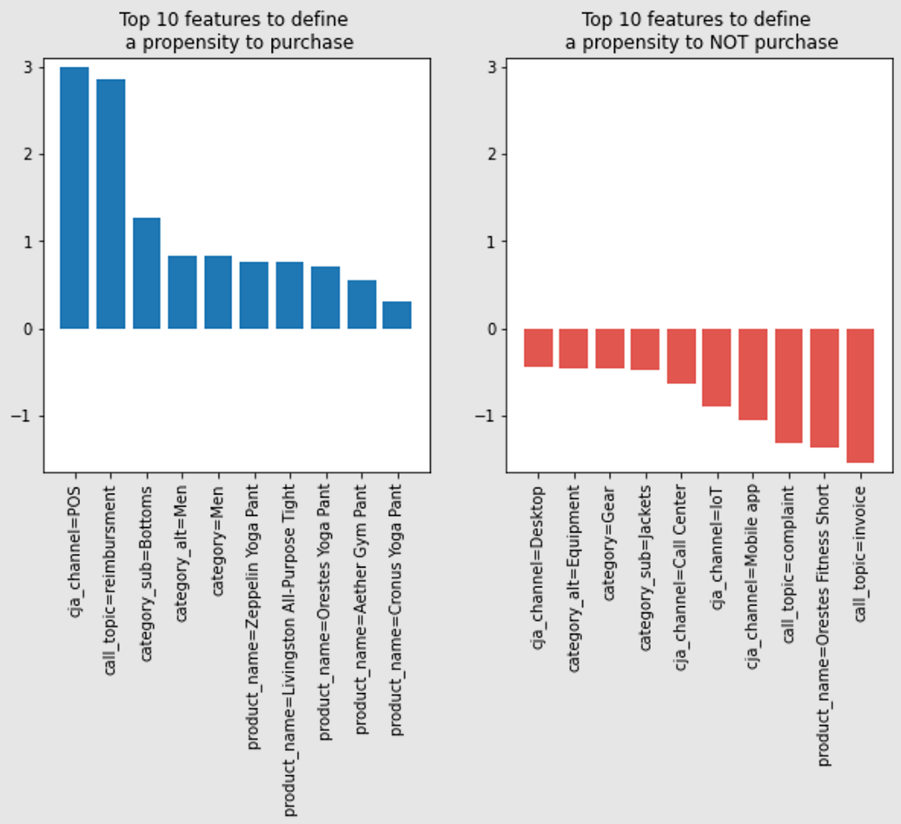
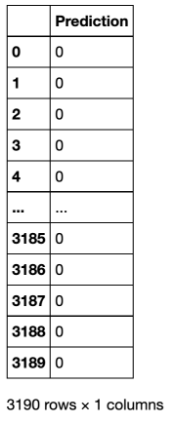

# 機械学習で生成された予測モデルを使用して傾向スコアを決定する

クエリサービスを使用すると、機械学習プラットフォーム上に構築された傾向スコアなどの予測モデルを活用して、Experience Platform データを分析できます。

このガイドでは、クエリサービスを使用して、計算ノートブックでモデルをトレーニングするために機械学習プラットフォームにデータを送信する方法について説明します。 トレーニング済みモデルを SQL を使用してデータに適用し、各訪問で顧客が購入する傾向を予測できます。

## はじめに

このプロセスの一部として機械学習モデルのトレーニングが必要なため、このドキュメントでは 1 つ以上の機械学習環境に関する実務知識を前提としています。

この例では、[!DNL Jupyter Notebook] を開発環境として使用します。 使用できるオプションは多数ありますが、[!DNL Jupyter Notebook] れはオープンソースの web アプリケーションであり、計算要件が低いので、推奨されます。 [&#x200B; 公式サイトからダウンロード &#x200B;](https://jupyter.org/) できます。

まだ行っていない場合は、このガイドに進む前に、Adobe Experience Platform クエリサービスに [&#x200B; 接続  [!DNL Jupyter Notebook]  する &#x200B;](../clients/jupyter-notebook.md) の手順に従ってください。

この例で使用されるライブラリは次のとおりです。

```console
python=3.6.7
psycopg2
sklearn
pandas
matplotlib
numpy
tqdm
```

## Experience Platformから [!DNL Jupyter Notebook] への分析テーブルの読み込み {#import-analytics-tables}

傾向スコアモデルを生成するには、Experience Platformに保存された Analytics データのプロジェクションを [!DNL Jupyter Notebook] に読み込む必要があります。 クエリサービスに接続された [!DNL Python] 3 [!DNL Jupyter Notebook] から、次のコマンドは架空の衣料品ストアである Luma から顧客行動データセットを読み込みます。 Experience Platform データはエクスペリエンスデータモデル（XDM）形式を使用して保存されるので、スキーマの構造に準拠するサンプル JSON オブジェクトを生成する必要があります。 [&#x200B; サンプル JSON オブジェクトの生成 &#x200B;](../../xdm/ui/sample.md) 方法については、ドキュメントを参照してください。

![&#x200B; 複数のコマンドがハイライト表示された [!DNL Jupyter Notebook] ダッシュボード &#x200B;](../images/use-cases/jupyter-commands.png)

出力には、[!DNL Jupyter Notebook] ダッシュボード内の Luma の行動データセットのすべての列を表形式で表示します。

![[!DNL Jupyter Notebook] 内の Luma が読み込んだ顧客行動データセットを表形式で出力したもの。](../images/use-cases/behavioural-dataset-results.png)

## 機械学習のためのデータの準備 {#prepare-data-for-machine-learning}

機械学習モデルをトレーニングするには、ターゲット列を特定する必要があります。 このユースケースでは購入傾向が目標なので、`analytic_action` 列が Luma の結果からターゲット列として選択されます。 値 `productPurchase` は、顧客の購入の指標です。 `purchase_value` 列と `purchase_num` 列も、製品購入アクションに直接関連するので削除されます。

これらのアクションを実行するコマンドを次に示します。

```python
#define the target label for prediction
df['target'] = (df['analytic_action'] == 'productPurchase').astype(int)
#remove columns that are dependent on the label
df.drop(['analytic_action','purchase_value'],axis=1,inplace=True)
```

次に、Luma データセットのデータを適切な表現に変換する必要があります。 次の 2 つの手順が必要です。

1. 数値を表す列を数値列に変換します。 これを行うには、`dataframe` でデータ型を明示的に変換します。
1. カテゴリ列を数値列にも変換します。

```python
#convert columns that represent numbers
num_cols = ['purchase_num', 'value_cart', 'value_lifetime']
df[num_cols] = df[num_cols].apply(pd.to_numeric, errors='coerce')
```

*ワンホットエンコーディング* と呼ばれる技術を使用して、機械およびディープラーニングアルゴリズムで使用するカテゴリデータ変数を変換します。 これにより、モデルの予測と分類精度が向上します。 `Sklearn` ライブラリを使用して、各カテゴリ値を個別の列に表します。

```python
from sklearn.preprocessing import OneHotEncoder

#get the categorical columns
cat_columns = list(set(df.columns) - set(num_cols + ['target']))

#get the dataframe with categorical columns only
df_cat = df.loc[:,cat_columns]

#initialize sklearn's OneHotEncoder
enc = OneHotEncoder(handle_unknown='ignore')

#fit the data into the encoder
enc.fit(df_cat)

#define OneHotEncoder's columns names
ohc_columns = [[c+'='+c_ for c_ in cat] for c,cat in zip(cat_columns,enc.categories_)]
ohc_columns = [item for sublist in ohc_columns for item in sublist]

#finalize the data input to the ML models
X = pd.DataFrame( np.concatenate((enc.transform(df_cat).toarray(),df[num_cols]),axis=1),
                 columns =  ohc_columns + num_cols)

#define target column
y = df['target']
```

`X` と定義されたデータは表形式で表示され、次のように表示されます。

![[!DNL Jupyter Notebook] 内の X の表形式の出力 &#x200B;](../images/use-cases/x-output-table.png)


機械学習に必要なデータが利用可能になったので、[!DNL Python] の `sklearn` ライブラリに事前設定された機械学習モデルに適合させることができます。 傾向モデルのトレーニングに [!DNL Logistics Regression] を使用すると、テストデータの精度を確認できます。 この場合、約 85% です。

機械学習アルゴリズムのパフォーマンスの推定に使用される [!DNL Logistic Regression] アルゴリズムと train-test split メソッドは、以下のコードブロックに読み込まれます。

```python
from sklearn.linear_model import LogisticRegression
from sklearn.model_selection import train_test_split

X_train, X_test, y_train, y_test = train_test_split(
    X, y, test_size=0.33, random_state=42)

clf = LogisticRegression(max_iter=2000, random_state=0).fit(X_train, y_train)

print("Test data accuracy: {}".format(clf.score(X_test, y_test)))
```

テストデータの精度は 0.8518518518518519 です。

ロジスティクス リグレッションを使用すると、購入の理由を視覚化し、降順でのランク付けの重要度によって傾向を決定する機能を並べ替えることができます。 最初の列は、購買行動につながる高い因果関係を示しています。 後者の列は、購買行動につながらない要因を示しています。

結果を 2 つの棒グラフとして視覚化するコードを次に示します。

```python
from matplotlib import pyplot as plt

#get feature importance as a sorted list of columns
feature_importance = np.argsort(-clf.coef_[0])
top_10_features_purchase_names = X.columns[feature_importance[:10]]
top_10_features_purchase_values = clf.coef_[0][feature_importance[:10]]
top_10_features_not_purchase_names = X.columns[feature_importance[-10:]]
top_10_features_not_purchase_values = clf.coef_[0][feature_importance[-10:]]

#plot the figures
fig, (ax1, ax2) = plt.subplots(1, 2,figsize=(10,5))

ax1.bar(np.arange(10),top_10_features_purchase_values)
ax1.set_xticks(np.arange(10))
ax1.set_xticklabels(top_10_features_purchase_names,rotation = 90)
ax1.set_ylim([np.min(clf.coef_[0])-0.1,np.max(clf.coef_[0])+0.1])
ax1.set_title("Top 10 features to define \n a propensity to purchase")

ax2.bar(np.arange(10),top_10_features_not_purchase_values, color='#E15750')
ax2.set_xticks(np.arange(10))
ax2.set_xticklabels(top_10_features_not_purchase_names,rotation = 90)
ax2.set_ylim([np.min(clf.coef_[0])-0.1,np.max(clf.coef_[0])+0.1])
ax2.set_title("Top 10 features to define \n a propensity to NOT purchase")

plt.show()
```

結果の縦棒グラフのビジュアライゼーションを次に示します。



棒グラフからは、いくつかのパターンを識別できます。 償還としてのチャネルの販売時点（POS）と通話のトピックは、購買行動を決定する最も重要な要因です。 Call のトピックは苦情と請求書ですが、購買行動を定義するための重要な役割です。 これらは、マーケターがマーケティングキャンペーンを実施して、これらの顧客の購入傾向に対処するために活用できる、定量化可能で実用的なインサイトです。

## クエリサービスを使用したトレーニング済みモデルの適用 {#use-query-service-to-apply-trained-model}

トレーニング済みモデルを作成したら、Experience Platformに保持されるデータに適用する必要があります。 それには、機械学習パイプラインのロジックを SQL に変換する必要があります。 この移行の 2 つの主要なコンポーネントは次のとおりです。

- まず、予測ラベルの確率を取得するには、SQL が [!DNL Logistics Regression] モジュールの代わりになる必要があります。 ロジスティクス回帰で作成されたモデルは、重み付け `w` と切片 `c` がモデルの出力である回帰モデル `y = wX + c` を生成しました。 SQL 関数を使用すると、重みを掛けて確率を求めることができます。

- 次に、1 つのホットエンコーディングで [!DNL Python] 成されたエンジニアリングプロセスも SQL に組み込む必要があります。 例えば、元のデータベースには郡を格納する列が `geo_county` りますが、列は `geo_county=Bexar`、`geo_county=Dallas`、`geo_county=DeKalb` に変換されます。 次の SQL 文は、同じ変換を行います。ここでは、`w1`、`w2`、`w3` を、[!DNL Python] のモデルから学習した重みで置き換えることができます。

```sql
SELECT  CASE WHEN geo_state = 'Bexar' THEN FLOAT(w1) ELSE 0 END AS f1,
        CASE WHEN geo_state = 'Dallas' THEN FLOAT(w2) ELSE 0 END AS f2,
        CASE WHEN geo_state = 'Bexar' THEN FLOAT(w3) ELSE 0 END AS f3,
```

数値特性の場合は、次の SQL 文に示すように、列に重み付けを直接乗算できます。

```sql
SELECT FLOAT(purchase_num) * FLOAT(w4) AS f4,
```

数値が得られたら、S字型関数に移植することができ、ロジスティクス回帰アルゴリズムが最終的な予測を生成します。 次のステートメントでは、回帰のインターセプトの番号は `intercept` です。
        

```sql
SELECT CASE WHEN 1 / (1 + EXP(- (f1 + f2 + f3 + f4 + FLOAT(intercept)))) > 0.5 THEN 1 ELSE 0 END AS Prediction;
```

 

### エンドツーエンドの例

2 つの列（`c1` と `c2`）がある状況で、2 つのカテゴリが `c1` る場合、[!DNL Logistic Regression] のアルゴリズムは次の関数でトレーニングされます。
 

```python
y = 0.1 * "c1=category 1"+ 0.2 * "c1=category 2" +0.3 * c2+0.4
```

 
SQL での同等の関数は次のとおりです。

```sql
SELECT
  CASE WHEN 1 / (1 + EXP(- (f1 + f2 + f3 + FLOAT(0.4)))) > 0.5 THEN 1 ELSE 0 END AS Prediction
FROM
  (
    SELECT
      CASE WHEN c1 = 'Cateogry 1' THEN FLOAT(0.1) ELSE 0 END AS f1,
      CASE WHEN c1 = 'Cateogry 2' THEN FLOAT(0.2) ELSE 0 END AS f2,
      FLOAT(c2) * FLOAT(0.3) AS f3
    FROM TABLE
  )
```

 
翻訳プロセスを自動化するための [!DNL Python] のコードを以下に示します。

```python
def generate_lr_inference_sql(ohc_columns, num_cols, clf, db):
    features_sql = []
    category_sql_text = "case when {col} = '{val}' then float({coef}) else 0 end as f{name}"
    numerical_sql_text = "float({col}) * float({coef}) as f{name}"
    for i, (column, coef) in enumerate(zip(ohc_columns+num_cols, clf.coef_[0])):
        if i < len(ohc_columns):
            col,val = column.split('=')
            val = val.replace("'","%''%")
            sql = category_sql_text.format(col=col,val=val,coef=coef,name=i+1)
        else:
            sql = numerical_sql_text.format(col=column,coef=coef,name=i+1)
        features_sql.append(sql)
    features_sum = '+'.join(['f{}'.format(i) for i in range(1,len(features_sql)+1)])
    final_sql = '''
    select case when 1/(1 + EXP(-({features} + float({intercept})))) > 0.5 then 1 else 0 end as Prediction
    from
        (select {cols}
        from {db})
    '''.format(features=features_sum,cols=",".join(features_sql),intercept=clf.intercept_[0],db=db)
    return final_sql
```

SQL を使用してデータベースを推測する場合、出力は次のようになります。

```python
sql = generate_lr_inference_sql(ohc_columns, num_cols, clf, "fdu_luma_raw")
cur.execute(sql)    
samples = [r for r in cur]
colnames = [desc[0] for desc in cur.description]
pd.DataFrame(samples,columns=colnames)
```

表形式の結果は、顧客セッションごとに購入傾向を表示し、`0` れは購入傾向がないことを意味し、`1` れは確認された購入傾向を意味します。



## サンプル データを使用する：ブートストラップ {#working-on-sampled-data}

ローカルマシンでモデルトレーニング用のデータを保存するには、データサイズが大きすぎる場合は、クエリサービスの完全なデータではなくサンプルを取得できます。 クエリサービスからサンプリングするために必要なデータの量を把握するには、ブートストラップと呼ばれる手法を適用します。 ブートストラップとは、モデルをさまざまなサンプルで複数回トレーニングし、異なるサンプル間でのモデルの精度のばらつきを調べることを意味します。 上記の傾向モデルの例を調整するには、まず、機械学習ワークフロー全体を関数にカプセル化します。 コードは次のようになります。

```python
def end_to_end_pipeline(df):
    
    #define the target label for prediction
    df['target'] = (df['analytic_action'] == 'productPurchase').astype(int)
    #remove columns that are dependent on the label
    df.drop(['analytic_action','purchase_value'],axis=1,inplace=True)
    
    num_cols = ['purchase_num','value_cart','value_lifetime']
    df[num_cols] = df[num_cols].apply(pd.to_numeric, errors='coerce')
    
    #get the categorical columns
    cat_columns = list(set(df.columns) - set(num_cols + ['target']))

    #get the dataframe with categorical columns only
    df_cat = df.loc[:,cat_columns]

    #initialize sklearn's One Hot Encoder
    enc = OneHotEncoder(handle_unknown='ignore')

    #fit the data into the encoder
    enc.fit(df_cat)

    #define one hot encoder's columns names
    ohc_columns = [[c+'='+c_ for c_ in cat] for c,cat in zip(cat_columns,enc.categories_)]
    ohc_columns = [item for sublist in ohc_columns for item in sublist]

    #finalize the data input to the ML models
    X = pd.DataFrame( np.concatenate((enc.transform(df_cat).toarray(),df[num_cols]),axis=1),
                     columns =  ohc_columns + num_cols)

    #define target column
    y = df['target']
    
    X_train, X_test, y_train, y_test = train_test_split(
    X, y, test_size=0.33, random_state=42)

    clf = LogisticRegression(max_iter=2000,random_state=0).fit(X_train, y_train)

    return clf.score(X_test, y_test)
```

その後、この関数をループで複数回実行できます（例：10 回）。 前のコードとの違いは、現在のサンプルはテーブル全体から取得されるのではなく、行のサンプルのみが取得されることです。 例えば、以下のサンプルコードでは、1000 行しか取得できません。 各反復の精度を保存できます。

```python
from tqdm import tqdm

bootstrap_accuracy = []
for i in tqdm(range(100)):
    
    #sample data from QS
    cur.execute('''SELECT *
    FROM fdu_luma_raw
    ORDER BY random()
    LIMIT 1000
    ''')    
    samples = [r for r in cur]
    colnames = [desc[0] for desc in cur.description]
    df_samples = pd.DataFrame(samples,columns=colnames)
    df_samples.fillna(0,inplace=True)
    
    #train the propensity model with sampled data and output its accuracy
    bootstrap_accuracy.append(end_to_end_pipeline(df_samples))
    
bootstrap_accuracy = np.sort(bootstrap_accuracy)
```

ブートストラップされたモデルの精度がソートされます。 その後、モデルの精度の 10 番目と 90 番目の分量は、指定されたサンプルサイズでのモデルの精度の 95% の信頼区間になります。


上の図では、モデルのトレーニングに 1000 行しか使用しない場合、精度は約 84～88% に低下すると予想されます。 モデルのパフォーマンスを確保するために、必要に応じて、クエリサービスクエリの `LIMIT` 句を調整できます。
