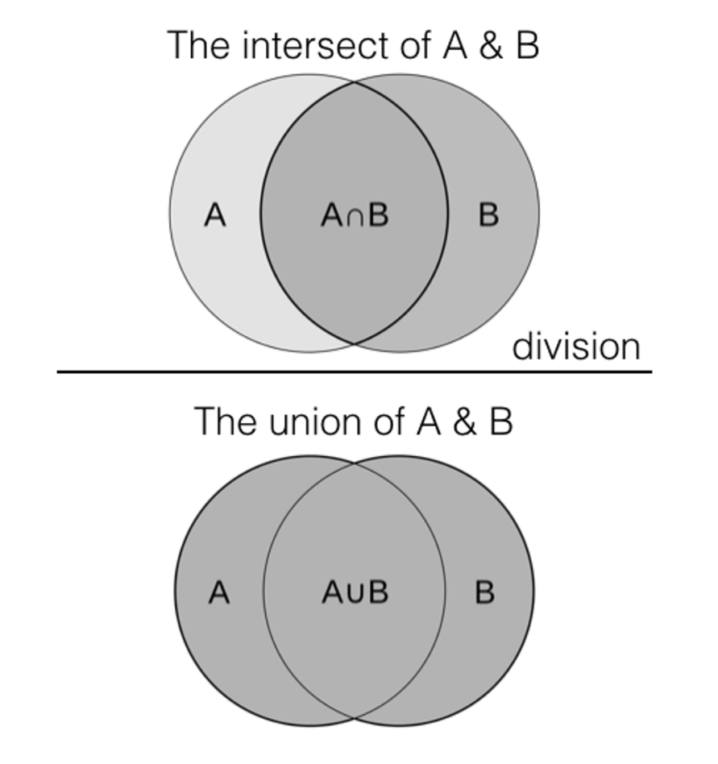

# 高次関数を使用した類似レコードの取得

Data Distillerの高次関数を使用して、さまざまな一般的なユースケースを解決します。 1つ以上のデータセットから類似または関連するレコードを識別して取得するには、このガイドで詳しく説明しているように、フィルター、変換、および関数を使用します。 高次関数を使用して複雑なデータ型を処理する方法については、[配列を管理し、データ型をマッピングする方法](../sql/higher-order-functions.md)に関するドキュメントを参照してください。

このガイドを使用して、特性または属性に大きな類似性を持つ様々なデータセットの製品を特定します。 この手法は、データの重複排除、レコードの関連付け、レコメンデーションシステム、情報検索、テキスト分析などのソリューションを提供します。

このドキュメントでは、類似結合を実装するプロセスについて説明します。このプロセスでは、Data Distillerの高次関数を使用して、データセット間の類似性を計算し、選択した属性に基づいてフィルタリングします。 プロセスの各ステップには、SQL コードスニペットと説明が用意されています。 このワークフローでは、Data Distillerの高次関数を使用したJaccard類似度測定とトークン化を使用して類似度結合を実装します。 これらのメソッドは、類似性指標に基づいて、1つ以上のデータセットから類似または関連するレコードを識別して取得するために使用されます。 プロセスの主なセクションには、高次関数[を使用した](#data-transformation) トークン化、一意の要素[の](#cross-join-unique-elements)相互結合、[Jaccard類似度計算](#compute-the-jaccard-similarity-measure)、[しきい値ベースのフィルタリング &#x200B;](#similarity-threshold-filter)が含まれます。

## 前提条件

このドキュメントを続ける前に、次の概念に精通しておく必要があります。

- **類似結合**&#x200B;は、レコード間の類似度の尺度に基づいて、1つ以上のテーブルからレコードのペアを識別して取得する操作です。 類似結合の主な要件は次のとおりです。
   - **類似度指標**：類似度結合は、定義済みの類似度指標または指標に依存します。 そのような指標には、Jaccard類似度、コサイン類似度、編集距離などが含まれます。 指標は、データの性質とユースケースによって異なります。 この指標は、2つのレコードがどの程度類似しているか、または類似していないかを定量化します。
   - **しきい値**：類似度のしきい値を使用して、2つのレコードが結合結果に含まれるほど類似していると見なされるタイミングを判断します。 類似度スコアがしきい値を超えるレコードは、一致と見なされます。
- **Jaccard類似度**&#x200B;指標、またはJaccard類似度測定は、サンプルセットの類似度と多様性を測定するために使用される統計情報です。 これは、積集合のサイズをサンプルセットの和集合のサイズで割ったサイズとして定義されます。 Jaccardの類似度の測定範囲は0から1です。 Jaccard類似度が0の場合はセット間の類似性がないことを示し、Jaccard類似度が1の場合はセットが同一であることを示します。
  
- Data Distillerの&#x200B;**高次関数**&#x200B;は、SQL ステートメント内でデータを直接処理および変換する動的なインラインツールです。 これらの汎用性の高い関数を使用すると、特に[配列やマップなどの複雑な型を扱う場合](../sql/higher-order-functions.md)に、データ操作で複数の手順を実行する必要がなくなります。 クエリの効率を高め、変換を簡素化することで、高次関数は、様々なビジネスシナリオでより俊敏な分析とより優れた意思決定に貢献します。

## はじめに

Data Distiller SKUは、Adobe Experience Platform データに対して高次関数を実行するために必要です。 Data Distiller SKUをお持ちでない場合は、Adobe カスタマーサービス担当者にお問い合わせください。

## 類似性の確立 {#establish-similarity}

このユースケースでは、後でフィルタリングのしきい値を設定するために使用できるテキスト文字列間の類似度を測定する必要があります。 この例では、Set AとSet Bの商品は、2つの文書の単語を表しています。

Jaccard類似度測定は、テキストデータ、カテゴリデータ、バイナリデータなど、幅広いデータタイプに適用できます。 また、大規模なデータセットに対して計算を行うことで計算効率を向上できるため、リアルタイム処理やバッチ処理にも適しています。

製品セット Aとセット Bには、このワークフローのテスト データが含まれます。

- 製品セット A: `{iPhone, iPad, iWatch, iPad Mini}`
- 製品セット B: `{iPhone, iPad, Macbook Pro}`

製品セット AとB間のJaccardの類似性を計算するには、まず製品セットの&#x200B;**積集合** （共通の要素）を見つけます。 この場合、`{iPhone, iPad}`。 次に、両方の製品セットの&#x200B;**union** （すべての一意の要素）を見つけます。 この例では、`{iPhone, iPad, iWatch, iPad Mini, Macbook Pro}`です。

最後に、Jaccardの類似性式`J(A,B) = A∪B / A∩B`を使用して類似性を計算します。

J = ジャカード距離
A = セット 1
B = セット 2

製品セット AとBのJaccard類似度は0.4です。これは、2つの文書で使用される単語の間に、ある程度の類似性があることを示しています。 この2つのセット間の類似性により、類似性結合の列が定義されます。 これらの列は、データに関連付けられた情報の断片、つまり特性を表し、テーブルに保存され、類似性計算の実行に使用されます。

### Jaccard Computationと文字列の類似性のペア {#pairwise-similarity}

文字列間の類似性をより正確に比較するには、ペアの類似性を計算する必要があります。 ペアの類似性は、高次元オブジェクトを比較と分析のために小さな次元オブジェクトに分割します。 これを行うには、テキストの文字列をより小さな部分または単位（トークン）に分割します。 例えば、個々の文字、文字のグループ（音節など）、単語全体などが考えられます。 Set Aの各要素とSet Bの各要素との間のトークンのペアごとに類似性が計算されます。このトークン化は、データから引き出される分析および計算の比較、関係、インサイトの基盤を提供します。

ペアによる類似度の計算では、次の例では、文字バイグラム（2文字のトークン）を使用して、Set AとSet Bの商品のテキスト文字列の類似度の一致を比較します。bi-gramは、特定のシーケンスまたはテキスト内の2つのアイテムまたは要素の連続したシーケンスです。 これをn グラムに一般化できます。

この例では、大文字と小文字は関係なく、スペースは考慮されないと仮定します。 これらの基準に従って、Set AとSet Bには次のbi グラムがあります。

製品はbi グラムを設定します：

- iPhone （5）: &quot;ip&quot;, &quot;ph&quot;, &quot;ho&quot;, &quot;on&quot;, &quot;ne&quot;
- iPad（3）: &quot;ip&quot;、&quot;pa&quot;、&quot;ad&quot;
- iWatch （5）: &quot;iw&quot;, &quot;wa&quot;, &quot;at&quot;, &quot;tc&quot;, &quot;ch&quot;
- iPad Mini （7）: &quot;ip&quot;, &quot;pa&quot;, &quot;ad&quot;, &quot;dm&quot;, &quot;mi&quot;, &quot;in&quot;, &quot;ni&quot;

製品セット Bのbi グラム：

- iPhone （5）: &quot;ip&quot;, &quot;ph&quot;, &quot;ho&quot;, &quot;on&quot;, &quot;ne&quot;
- iPad（3）: &quot;ip&quot;、&quot;pa&quot;、&quot;ad&quot;
- Macbook Pro （9）: &quot;Ma&quot;, &quot;ac&quot;, &quot;cb&quot;, &quot;bo&quot;, &quot;oo&quot;, &quot;ok&quot;, &quot;kp&quot;, &quot;pr&quot;, &quot;ro&quot;

次に、各ペアのJaccard類似度係数を計算します。

|                   | iPhone （セット B） | iPad （セット B） | Macbook Pro （セット B） |
|-------------------|----------------------------------------------|---------------------------------------------|-------------------------------------------|
| iPhone （セット A） | （積集合：5、和集合：5） = 5 / 5 = 1 | （積集合：1、和集合：7） =1 / 7 ≈ 0.14 | （積集合：0、和集合：14） = 0 / 14 = 0 |
| iPad （セット A） | （積集合：1、和集合：7） = 1 / 7 ≈ 0.14 | （積集合：3、和集合：3） = 3 / 3 = 1 | （積集合：0、和集合：12） = 0 / 12 = 0 |
| iWatch （セット A） | （積集合：0、和集合：8） = 0 / 8 = 0 | （積集合：0、和集合：8） = 0 / 8 = 0 | （積集合：0、和集合：8） = 0 / 8 =0 |
| iPad Mini （セット A） | （積集合：1、和集合：11） = 1 / 11 ≈ 0.09 | （積集合：3、和集合：7） = 3 / 7 ≈ 0.43 | （積集合：0、和集合：16） = 0 / 16 = 0 |

{style="table-layout:auto"}

## SQLを使用したテストデータの作成 {#create-test-data}

製品セットのテスト・テーブルを手動で作成するには、SQL CREATE TABLE文を使用します。

```SQL {line-numbers="true"}
CREATE TABLE featurevector1 AS SELECT *
FROM (
    SELECT 'iPad' AS ProductName
    UNION ALL
    SELECT 'iPhone'
    UNION ALL
    SELECT 'iWatch'
     UNION ALL
    SELECT 'iPad Mini'
);
SELECT * FROM featurevector1;
```

次の説明では、上記のSQL コードブロックの内訳を示します。

- 1行目：`CREATE TEMP TABLE featurevector1 AS`：このステートメントは、`featurevector1`という名前の一時テーブルを作成します。 一時テーブルは通常、現在のセッション内でのみアクセスでき、セッションの最後に自動的にドロップされます。
- 1行目と2行目：`SELECT * FROM (...)`: コードのこの部分は、`featurevector1` テーブルに挿入されるデータを生成するために使用されるサブクエリです。
サブクエリ内では、`SELECT` コマンドを使用して複数の`UNION ALL` ステートメントを組み合わせます。 各`SELECT` ステートメントは、`ProductName`列に指定された値を持つ1行のデータを生成します。
- 行3: `SELECT 'iPad' AS ProductName`：これにより、`iPad`列の値`ProductName`を持つ行が生成されます。
- 5行目：`SELECT 'iPhone'`：これにより、`iPhone`列の値`ProductName`を持つ行が生成されます。

SQL文は、次に示すようにテーブルを作成します。

|   | `ProductName` |
|---|---------------|
| 1 | iPad |
| 2 | iPhone |
| 3 | iWatch |
| 4 | iPad Mini |

{style="table-layout:auto"}

2つ目の機能ベクターを作成するには、次のSQL ステートメントを使用します。

```SQL
CREATE TABLE featurevector2 AS SELECT *
FROM (
    SELECT 'iPad' AS ProductName
    UNION ALL
    SELECT 'iPhone'
    UNION ALL
    SELECT 'Macbook Pro'
);
SELECT * FROM featurevector2;
```

## データ変換 {#data-transformation}

この例では、セットを正確に比較するために、いくつかのアクションを実行する必要があります。 まず、類似度の測定に寄与しないと仮定するため、空白はフィーチャ ベクトルから削除されます。 その後、特徴量ベクトルに存在する重複は、計算処理を無駄にするので削除されます。 次に、特徴量ベクトルから2文字のトークン（bi グラム）を抽出する。 この例では、これらは重なっていると見なされます。

>[!NOTE]
>
>説明のために、処理された列は、各ステップのフィーチャ ベクトルの横に追加されます。

次の節では、トークン化プロセスを開始する前の重複排除、空白の削除、小文字の変換などの前提条件のデータ変換について説明します。

### 重複の除外 {#deduplication}

次に、`DISTINCT`句を使用して重複を削除します。 この例には重複はありませんが、比較の精度を向上させるための重要なステップです。 必要なSQLは次のように表示されます。

```SQL
SELECT DISTINCT(ProductName) AS featurevector1_distinct FROM featurevector1
SELECT DISTINCT(ProductName) AS featurevector2_distinct FROM featurevector2
```

### 空白の削除 {#whitespace-removal}

次のSQL ステートメントでは、空白が機能ベクトルから削除されます。 クエリの`replace(ProductName, ' ', '') AS featurevector1_nospaces`部分は、`ProductName` テーブルから`featurevector1`列を取り出し、`replace()`関数を使用します。 `REPLACE`関数は、スペース （「」）のすべての出現箇所を空の文字列（「」）に置き換えます。 これにより、`ProductName`値からすべてのスペースが効果的に削除されます。 結果は`featurevector1_nospaces`としてエイリアスされます。

```SQL
SELECT DISTINCT(ProductName) AS featurevector1_distinct, replace(ProductName, ' ', '') AS featurevector1_nospaces FROM featurevector1
```

結果を次の表に示します。

|   | featurevector1_distinct | featurevector1_nospaces |
|---|---|---|
| 1 | iPad Mini | iPadMini |
| 2 | iPad | iPad |
| 3 | iWatch | iWatch |
| 4 | iPhone | iPhone |

{style="table-layout:auto"}

2番目の機能ベクトルに対するSQL ステートメントとその結果を以下に示します。

+++選択して展開

```SQL
SELECT DISTINCT(ProductName) AS featurevector2_distinct, replace(ProductName, ' ', '') AS featurevector2_nospaces FROM featurevector2
```

結果は次のように表示されます。

|   | featurevector2_distinct | featurevector2_nospaces |
|---|---|---|
| 1 | iPad | iPad |
| 2 | Macbook Pro | MacbookPro |
| 3 | iPhone | iPhone |

{style="table-layout:auto"}

+++

### 小文字に変換します {#lowercase-conversion}

次に、SQLを改善して、製品名を小文字に変換し、空白を削除します。 下位関数（`lower(...)`）は、`replace()`関数の結果に適用されます。 下関数は、変更された`ProductName`値のすべての文字を小文字に変換します。 これにより、元の大文字と小文字を区別せずに値が小文字になります。

```SQL
SELECT DISTINCT(ProductName) AS featurevector1_distinct, lower(replace(ProductName, ' ', '')) AS featurevector1_transform FROM featurevector1;
```

このステートメントの結果は次のとおりです。

|   | featurevector1_distinct | featurevector1_transform |
|---|---|---|
| 1 | iPad Mini | ipadmini |
| 2 | iPad | iPad |
| 3 | iWatch | iWatch |
| 4 | iPhone | iPhone |

{style="table-layout:auto"}

2番目の機能ベクトルに対するSQL ステートメントとその結果を以下に示します。

+++選択して展開

```SQL
SELECT DISTINCT(ProductName) AS featurevector2_distinct, lower(replace(ProductName, ' ', '')) AS featurevector2_transform FROM featurevector2
```

結果は次のように表示されます。

|   | featurevector2_distinct | featurevector2_transform |
|---|---|---|
| 1 | iPad | ipad |
| 2 | Macbook Pro | macbookpro |
| 3 | iPhone | iphone |

{style="table-layout:auto"}

+++

### SQLを使用したトークンの抽出 {#tokenization}

次のステップはトークン化、つまりテキスト分割です。 トークン化とは、テキストを個別の用語に分解するプロセスです。 通常、文章を単語に分割します。 この例では、文字列は、`regexp_extract_all`のようなSQL関数を使用してトークンを抽出することで、bi グラム（および上位n グラム）に分割されます。 効果的なトークン化のために、重複するbi グラムを生成する必要があります。

SQLをさらに改善して、`regexp_extract_all`を使用するようになりました。 `regexp_extract_all(lower(replace(ProductName, ' ', '')), '.{2}', 0) AS tokens:` クエリのこの部分では、前の手順で作成した変更された`ProductName`値をさらに処理します。 この関数は、`regexp_extract_all()`関数を使用して、変更された値と小文字の`ProductName`から1 ～ 2文字の重複しないすべての部分文字列を抽出します。 `.{2}`正規表現パターンは、長さが2文字の部分文字列と一致します。 次に、関数の`regexp_extract_all(..., '.{2}', 0)`部分は、入力テキストからすべての一致する部分文字列を抽出します。

```SQL
SELECT DISTINCT(ProductName) AS featurevector1_distinct, lower(replace(ProductName, ' ', '')) AS featurevector1_transform, 
regexp_extract_all(lower(replace(ProductName, ' ', '')) , '.{2}', 0) AS tokens
FROM featurevector1;
```

結果を次の表に示します。

+++選択して展開

|   | featurevector1_distinct | featurevector1_transform | トークン |
|---|--------------------------|--------------|------------------------|
| 1 | iPad Mini | ipadmini | {&quot;ip&quot;,&quot;ad&quot;,&quot;mi&quot;,&quot;ni&quot;} |
| 2 | iPad | iPad | {&quot;ip&quot;,&quot;ad&quot;} |
| 3 | iWatch | iWatch | {&quot;iw&quot;,&quot;at&quot;, &quot;ch&quot;} |
| 4 | iPhone | iPhone | {&quot;ip&quot;,&quot;ho&quot;,&quot;ne&quot;} |

{style="table-layout:auto"}

+++

精度をさらに向上させるには、SQLを使用して重複するトークンを作成する必要があります。 例えば、上記の「iPad」文字列には「pa」トークンがありません。 これを修正するには、先行演算子（`substring`を使用）を1 ステップずつシフトし、bi-gramを生成します。

前の手順と同様に、`regexp_extract_all(lower(replace(substring(ProductName, 2), ' ', '')), '.{2}', 0):`は変更された製品名から2文字のシーケンスを抽出しますが、`substring` メソッドを使用して2番目の文字から開始し、重複するトークンを作成します。 次に、行3 ～ 7 （`array_union(...) AS tokens`）で、`array_union()`関数は、2つの正規表現抽出によって得られた2文字シーケンスの配列を結合します。 これにより、結果には、重複しないシーケンスと重複するシーケンスの両方からの一意のトークンが含まれます。

```SQL {line-numbers="true"}
SELECT DISTINCT(ProductName) AS featurevector1_distinct, 
       lower(replace(ProductName, ' ', '')) AS featurevector1_transform, 
       array_union(
           regexp_extract_all(lower(replace(ProductName, ' ', '')), '.{2}', 0),
           regexp_extract_all(lower(replace(substring(ProductName, 2), ' ', '')), '.{2}', 0)
       ) AS tokens
FROM featurevector1;
```

結果を次の表に示します。

+++選択して展開

|   | featurevector1_distinct | featurevector1_transform | トークン |
|---|--------------------------|--------------|------------------------|
| 1 | iPad Mini | ipadmini | {&quot;ip&quot;,&quot;ad&quot;,&quot;mi&quot;,&quot;ni&quot;,&quot;pa&quot;,&quot;dm&quot;,&quot;in&quot;} |
| 2 | iPad | iPad | {&quot;ip&quot;,&quot;ad&quot;,&quot;pa&quot;} |
| 3 | iWatch | iWatch | {&quot;iw&quot;,&quot;at&quot;,&quot;ch&quot;,&quot;wa&quot;,&quot;tc&quot;} |
| 4 | iPhone | iPhone | {&quot;ip&quot;,&quot;ho&quot;,&quot;ne&quot;,&quot;ph&quot;,&quot;on&quot;} |

{style="table-layout:auto"}

+++

ただし、問題の解決策として`substring`を使用するには制限があります。 テキストからトリグラム（3文字）に基づいてトークンを作成する場合、必要なシフトを取得するには、2回先を探すために2つの`substrings`を使用する必要があります。 10 グラムを作成するには、9つの`substring`式が必要です。 これにより、コードが肥大化し、使用できなくなります。 プレーン正規表現の使用は不適切です。 新しいアプローチが必要です。

### 製品名の長さを調整する {#length-adjustment}

シーケンス関数と長さ関数を使用すると、SQlを改善できます。 次の例では、`sequence(1, length(lower(replace(ProductName, ' ', ''))) - 3)`は、1から変更された製品名の長さから3を引いた数字のシーケンスを生成します。 例えば、変更された製品名が8文字の「ipadmini」の場合、1から5までの数字（8 ～ 3）が生成されます。

以下のステートメントでは、一意の製品名を抽出し、各名前をスペースを除く4文字の長さの文字（トークン）のシーケンスに分割し、2つの列として表示します。 1つの列には一意の製品名が表示され、他の列には生成されたトークンが表示されます。

```SQL
SELECT
   DISTINCT(ProductName) AS featurevector1_distinct,
  transform(
    sequence(1, length(lower(replace(ProductName, ' ', ''))) - 3),
    i -> substring(lower(replace(ProductName, ' ', '')), i, 4)
  ) AS tokens
FROM
  featurevector1;
```

結果を次の表に示します。

+++選択して展開

|   | featurevector1_distinct | トークン |
|---|--------------------------|------------------------|
| 1 | iPad Mini | {&quot;ipad&quot;,&quot;padm&quot;,&quot;admi&quot;,&quot;dmin&quot;,&quot;mini&quot;} |
| 2 | iPad | {&quot;ipad&quot;} |
| 3 | iWatch | {&quot;iwat&quot;,&quot;watc&quot;,&quot;atch&quot;} |
| 4 | iPhone | {&quot;ipho&quot;,&quot;phon&quot;,&quot;hone&quot;} |

{style="table-layout:auto"}

+++

### トークンの長さを設定 {#ensure-set-token-length}

ステートメントに追加の条件を追加して、生成されたシーケンスが特定の長さであることを確認できます。 次のSQL ステートメントは、`transform`関数をより複雑にすることで、トークン生成ロジックを拡張します。 このステートメントでは、`filter`内の`transform`関数を使用して、生成されるシーケンスの長さが6文字であることを確認します。 NULL値をそれらの位置に割り当てることで、それが不可能な場合を処理します。

```SQL
SELECT
  DISTINCT(ProductName) AS featurevector1_distinct,
  transform(
    filter(
      sequence(1, length(lower(replace(ProductName, ' ', ''))) - 5),
      i -> i + 5 <= length(lower(replace(ProductName, ' ', '')))
    ),
    i -> CASE WHEN length(substring(lower(replace(ProductName, ' ', '')), i, 6)) = 6
               THEN substring(lower(replace(ProductName, ' ', '')), i, 6)
               ELSE NULL
          END
  ) AS tokens
FROM
  featurevector1;
```

結果を次の表に示します。

+++選択して展開

|   | featurevector1_distinct | トークン |
|---|--------------------------|------------------------|
| 1 | iPad Mini | {&quot;ipadmi&quot;,&quot;padmin&quot;,&quot;admini&quot;} |
| 2 | iPad | {null} |
| 3 | iWatch | {&quot;iwatch&quot;} |
| 4 | iPhone | {&quot;iphone&quot;} |

{style="table-layout:auto"}

+++

## Data Distillerの高次関数を使用したソリューションを見る {#higher-order-function-solutions}

高次関数は、Data Distillerの構文のような「プログラミング」を実装できる強力な構文です。 これらは、配列内の複数の値に対して関数を繰り返すために使用できます。

Data Distillerのコンテキストでは、高次関数はn グラムを作成し、文字シーケンスを反復処理するのに最適です。

`reduce`関数は、特に`transform`によって生成されたシーケンス内で使用される場合、累積値または集計を導き出す方法を提供します。これは、様々な分析および計画プロセスで極めて重要です。

例えば、以下のSQl ステートメントでは、`reduce()`関数は、カスタム集計を使用して配列内の要素を集計します。 for ループをシミュレートして、**すべての整数**&#x200B;の累積和を1から5に作成します。`1, 1+2, 1+2+3, 1+2+3+4, 1+2+3+4`。

```SQL {line-numbers="true"}
SELECT transform(
    sequence(1, 5), 
    x -> reduce(
        sequence(1, x),  
        0,  -- Initial accumulator value
        (acc, y) -> acc + y  -- Higher-order function to add numbers
    )
) AS sum_result;
```

次に、SQL文の分析を示します。

- 行1: `transform`は、シーケンスで生成された各要素に関数`x -> reduce`を適用します。
- 2行目：`sequence(1, 5)`は、1から5までの数字のシーケンスを生成します。
- 行3: `x -> reduce(sequence(1, x), 0, (acc, y) -> acc + y)`は、シーケンス内の各要素xに対して縮小操作を実行します（1 ～ 5）。
   - `reduce`関数は、最初のアキュムレータ値を0、シーケンスを1から現在の値の`x`、より高次の関数`(acc, y) -> acc + y`に指定して、数値を追加します。
   - 高次関数`acc + y`は、現在の値`y`をアキュムレータ `acc`に追加して合計を累積します。
- 8行目：`AS sum_result`は、結果の列の名前をsum_resultに変更します。

要約すると、この高次関数は2つのパラメーター（`acc`と`y`）を受け取り、実行する操作を定義します。この場合、アキュムレータ `y`に`acc`を追加します。 この高次関数は、還元処理中にシーケンス内の各要素に対して実行されます。

このステートメントの出力は、1から5までの数値の累積合計を含む1列（`sum_result`）です。

### 高次関数の値 {#value-of-higher-order-functions}

このセクションでは、トリグラム SQL ステートメントのスリム ダウン バージョンを分析して、より効率的にn グラムを作成するために、Data Distillerの高次関数の値をより深く理解します。

以下のステートメントは、`ProductName` テーブル内の`featurevector1`列で動作します。 生成されたシーケンスから得られた位置を使用して、テーブル内の変更された製品名から派生した3文字の部分文字列のセットを生成します。

```SQL {line-numbers="true"}
SELECT
  transform(
    sequence(1, length(lower(replace(ProductName, ' ', ''))) - 2),
    i -> substring(lower(replace(ProductName, ' ', '')), i, 3)
  ) 
FROM
  featurevector1
```

次に、SQL文の分析を示します。

- 2行目：`transform`は、シーケンス内の各整数に高次関数を適用します。
- 3行目：`sequence(1, length(lower(replace(ProductName, ' ', ''))) - 2)`は、`1`から変更された製品名の長さから2を引いた整数のシーケンスを生成します。
   - `length(lower(replace(ProductName, ' ', '')))`は、小文字にしてスペースを削除した後、`ProductName`の長さを計算します。
   - `- 2`は、長さから2を減算して、シーケンスが3文字の部分文字列に対して有効な開始位置を生成するようにします。 2を減算すると、各開始位置に続く十分な文字が確保され、3文字の部分文字列が抽出されます。 この部分文字列関数は、先行演算子のように動作します。
- 4行目：`i -> substring(lower(replace(ProductName, ' ', '')), i, 3)`は、生成されたシーケンスの各整数`i`で動作する高次関数です。
   - `substring(...)`関数は、`ProductName`列から3文字の部分文字列を抽出します。
   - 部分文字列を抽出する前に、`lower(replace(ProductName, ' ', ''))`は`ProductName`を小文字に変換し、一貫性を確保するためにスペースを削除します。

出力は、シーケンスで指定された位置に基づいて、変更された製品名から抽出された3文字の長さの部分文字列のリストです。

## 結果のフィルタリング {#filter-results}

後続の`filter` データ変換[を使用する](#data-transformation)関数を使用すると、テキストデータから関連情報をより洗練された正確な抽出できます。 これにより、インサイトを導き出し、データ品質を向上させ、より優れた意思決定プロセスを促進することができます。

次のSQL ステートメントの`filter`関数は、後続の変換関数を使用して部分文字列を抽出する文字列内の位置の順序を調整および制限するのに役立ちます。

```SQL
SELECT
  transform(
    filter(
      sequence(1, length(lower(replace(ProductName, ' ', ''))) - 6),
      i -> i + 6 <= length(lower(replace(ProductName, ' ', '')))
    ),
    i -> CASE WHEN length(substring(lower(replace(ProductName, ' ', '')), i, 7)) = 7
               THEN substring(lower(replace(ProductName, ' ', '')), i, 7)
               ELSE NULL
          END
  )
FROM
  featurevector1;
```

`filter`関数は、変更された`ProductName`内の有効な開始位置のシーケンスを生成し、特定の長さの部分文字列を抽出します。 7文字の部分文字列を抽出できる開始位置のみが許可されます。

条件`i -> i + 6 <= length(lower(replace(ProductName, ' ', '')))`は、開始位置`i`と`6` （目的の7文字の部分文字列の長さから1を引いた長さ）が、変更された`ProductName`の長さを超えないようにします。

`CASE` ステートメントは、長さに基づいて部分文字列を条件付きで含めるか除外するために使用されます。 7文字のサブストリングのみが含まれます。その他はNULLに置き換えられます。 これらのサブストリングは、`transform`関数で使用され、`ProductName` テーブルの`featurevector1`列からサブストリングのシーケンスを作成します。

>[!TIP]
>
>[&#x200B; パラメーター化されたテンプレート &#x200B;](../ui/parameterized-queries.md)機能を使用して、クエリ内でロジックを再利用および抽象化できます。 例えば、汎用のユーティリティ関数（文字列のトークン化のために上記のように表示される関数など）を作成する場合、文字数がパラメーターとなるData Distiller パラメーター化テンプレートを使用できます。

## 2つのフィーチャ ベクトルをまたいで一意の要素のクロス結合を計算する {#cross-join-unique-elements}

データの特定の変換に基づいて2つのデータセット間の違いや不一致を特定することは、データの正確性を維持し、データ品質を向上させ、データセット全体の一貫性を確保するための一般的なプロセスです。

以下のこのSQL ステートメントは、変換を適用した後に`featurevector2`に存在するが`featurevector1`には存在しない一意の製品名を抽出します。

```SQL
SELECT lower(replace(ProductName, ' ', '')) FROM featurevector2
EXCEPT
SELECT lower(replace(ProductName, ' ', '')) FROM featurevector1;
```

>[!TIP]
>
>`EXCEPT`に加えて、ユースケースに応じて`UNION`と`INTERSECT`も使用できます。 また、`ALL`または`DISTINCT`句を試して、すべての値を含め、指定された列の一意の値のみを返すかどうかの違いを確認することもできます。

結果を次の表に示します。

+++選択して展開

|   | lower （replace （ProductName, &#39; &#39;, &#39;）） |
|---|---------------------------------------|
| 1 | macbookpro |

{style="table-layout:auto"}

+++

次に、クロス結合を実行して、2つのフィーチャ ベクトルの要素を結合し、比較する要素のペアを作成します。 このプロセスの最初の手順は、トークン化されたベクターを作成することです。

トークン化されたベクトルは、各単語、フレーズ、または意味の単位（トークン）が数値形式に変換されるテキストデータの構造化表現です。 この変換により、自然言語処理アルゴリズムはテキスト情報を理解し、分析することができます。

以下のSQlは、トークン化されたベクターを作成します。

```SQL
CREATE TABLE featurevector1tokenized AS SELECT
  DISTINCT(ProductName) AS featurevector1_distinct,
  transform(
    filter(
      sequence(1, length(lower(replace(ProductName, ' ', ''))) - 1),
      i -> i + 1 <= length(lower(replace(ProductName, ' ', '')))
    ),
    i -> CASE WHEN length(substring(lower(replace(ProductName, ' ', '')), i, 2)) = 2
               THEN substring(lower(replace(ProductName, ' ', '')), i, 2)
               ELSE NULL
          END
  ) AS tokens
FROM
  (SELECT lower(replace(ProductName, ' ', '')) AS ProductName FROM featurevector1);
SELECT * FROM featurevector1tokenized;
```

>[!NOTE]
>
>[!DNL DbVisualizer]を使用している場合、テーブルを作成または削除した後、テーブルのメタデータキャッシュが更新されるようにデータベース接続を更新します。 Data Distillerは、メタデータ更新をプッシュしません。

結果を次の表に示します。

+++選択して展開

|   | featurevector1_distinct | トークン |
|---|--------------------------|------------------------|
| 1 | ipadmini | {&quot;ip&quot;,&quot;pa&quot;,&quot;ad&quot;,&quot;dm&quot;,&quot;mi&quot;,&quot;in&quot;,&quot;ni&quot;} |
| 2 | ipad | {&quot;ip&quot;,&quot;pa&quot;,&quot;ad&quot;} |
| 3 | iwatch | {&quot;iw&quot;,&quot;wa&quot;,&quot;at&quot;,&quot;tc&quot;,&quot;ch&quot;} |
| 4 | iphone | {&quot;ip&quot;,&quot;ph&quot;,&quot;ho&quot;,&quot;on&quot;,&quot;ne&quot;} |

{style="table-layout:auto"}

+++

次に、`featurevector2`のプロセスを繰り返します。

```SQL
CREATE TABLE featurevector2tokenized AS 
SELECT
  DISTINCT(ProductName) AS featurevector2_distinct,
  transform(
    filter(
      sequence(1, length(lower(replace(ProductName, ' ', ''))) - 1),
      i -> i + 1 <= length(lower(replace(ProductName, ' ', '')))
    ),
    i -> CASE WHEN length(substring(lower(replace(ProductName, ' ', '')), i, 2)) = 2
               THEN substring(lower(replace(ProductName, ' ', '')), i, 2)
               ELSE NULL
          END
  ) AS tokens
FROM
(SELECT lower(replace(ProductName, ' ', '')) AS ProductName FROM featurevector2
);
SELECT * FROM featurevector2tokenized;
```

結果を次の表に示します。

+++選択して展開

|   | featurevector2_distinct | トークン |
|---|--------------------------|------------------------|
| 1 | ipadmini | {&quot;ip&quot;,&quot;pa&quot;,&quot;ad&quot;} |
| 2 | macbookpro | {&quot;ma&quot;,&quot;ac&quot;,&quot;cb&quot;,&quot;bo&quot;,&quot;oo&quot;,&quot;ok&quot;,&quot;kp&quot;,&quot;pr&quot;,&quot;ro&quot;} |
| 3 | iphone | {&quot;ip&quot;,&quot;ph&quot;,&quot;ho&quot;,&quot;on&quot;,&quot;ne&quot;} |

{style="table-layout:auto"}

+++

両方のトークン化されたベクターが完了したら、クロス結合を作成できます。 これは以下のSQLに表示されます。

```SQL {line-numbers="true"}
SELECT
    A.featurevector1_distinct AS SetA_ProductNames,
    B.featurevector2_distinct AS SetB_ProductNames,
    A.tokens AS SetA_tokens1,
    B.tokens AS SetB_tokens2
FROM
    featurevector1tokenized A
CROSS JOIN
    featurevector2tokenized B;
```

次に、クロス結合の作成に使用されるSQlの概要を示します。

- 行2: `A.featurevector1_distinct AS SetA_ProductNames`は、テーブル `featurevector1_distinct`から`A`列を選択し、エイリアス `SetA_ProductNames`を割り当てます。 このSQLのセクションでは、最初のデータセットから異なる製品名のリストが得られます。
- 行4: `A.tokens AS SetA_tokens1`は、テーブルまたはサブクエリ `tokens`から`A`列を選択し、エイリアス `SetA_tokens1`を割り当てます。 SQLのこのセクションでは、最初のデータセットの製品名に関連付けられたトークン化された値のリストが表示されます。
- 行8: `CROSS JOIN`操作は、2つのデータセットの行のすべての可能な組み合わせを組み合わせます。 つまり、最初のテーブル （`A`）の各製品名と関連トークンを、各製品名と2番目のテーブル （`B`）の関連トークンと組み合わせます。 この結果、2つのデータセットのデカルト積が生成されます。出力の各行は、製品名と両方のデータセットの関連トークンの組み合わせを表します。

結果を次の表に示します。

+++選択して展開

| * | SetA_ProductNames | SetB_ProductNames | SetA_tokens 1 | SetB_tokens 2 |
|---|---------------------|-------------------|---|---|
| 1 | ipadmini | ipad | {&quot;ip&quot;,&quot;pa&quot;,&quot;ad&quot;,&quot;dm&quot;,&quot;mi&quot;,&quot;in&quot;,&quot;ni&quot;} | {&quot;ip&quot;,&quot;pa&quot;,&quot;ad&quot;} |
| 2 | ipadmini | macbookpro | {&quot;ip&quot;,&quot;pa&quot;,&quot;ad&quot;,&quot;dm&quot;,&quot;mi&quot;,&quot;in&quot;,&quot;ni&quot;} | {&quot;ma&quot;,&quot;ac&quot;,&quot;cb&quot;,&quot;bo&quot;,&quot;oo&quot;,&quot;ok&quot;,&quot;kp&quot;,&quot;pr&quot;,&quot;ro&quot;} |
| 3 | ipadmini | iphone | {&quot;ip&quot;,&quot;pa&quot;,&quot;ad&quot;,&quot;dm&quot;,&quot;mi&quot;,&quot;in&quot;,&quot;ni&quot;} | {&quot;ip&quot;,&quot;ph&quot;,&quot;ho&quot;,&quot;on&quot;,&quot;ne&quot;} |
| 4 | ipad | ipad | {&quot;ip&quot;,&quot;pa&quot;,&quot;ad&quot;} | {&quot;ip&quot;,&quot;pa&quot;,&quot;ad&quot;} |
| 5 | ipad | macbookpro | {&quot;ip&quot;,&quot;pa&quot;,&quot;ad&quot;} | {&quot;ma&quot;,&quot;ac&quot;,&quot;cb&quot;,&quot;bo&quot;,&quot;oo&quot;,&quot;ok&quot;,&quot;kp&quot;,&quot;pr&quot;,&quot;ro&quot;} |
| 6 | ipad | iphone | {&quot;ip&quot;,&quot;pa&quot;,&quot;ad&quot;} | {&quot;ip&quot;,&quot;ph&quot;,&quot;ho&quot;,&quot;on&quot;,&quot;ne&quot;} |
| 7 | iwatch | ipad | {&quot;iw&quot;,&quot;wa&quot;,&quot;at&quot;,&quot;tc&quot;,&quot;ch&quot;} | {&quot;ip&quot;,&quot;pa&quot;,&quot;ad&quot;} |
| 8 | iwatch | macbookpro | {&quot;iw&quot;,&quot;wa&quot;,&quot;at&quot;,&quot;tc&quot;,&quot;ch&quot;} | {&quot;ma&quot;,&quot;ac&quot;,&quot;cb&quot;,&quot;bo&quot;,&quot;oo&quot;,&quot;ok&quot;,&quot;kp&quot;,&quot;pr&quot;,&quot;ro&quot;} |
| 9 | iwatch | iphone | {&quot;iw&quot;,&quot;wa&quot;,&quot;at&quot;,&quot;tc&quot;,&quot;ch&quot;} | {&quot;ip&quot;,&quot;ph&quot;,&quot;ho&quot;,&quot;on&quot;,&quot;ne&quot;} |
| 10 | iphone | ipad | {&quot;ip&quot;,&quot;ph&quot;,&quot;ho&quot;,&quot;on&quot;,&quot;ne&quot;} | {&quot;ip&quot;,&quot;pa&quot;,&quot;ad&quot;} |
| 11 | iphone | macbookpro | {&quot;ip&quot;,&quot;ph&quot;,&quot;ho&quot;,&quot;on&quot;,&quot;ne&quot;} | {&quot;ma&quot;,&quot;ac&quot;,&quot;cb&quot;,&quot;bo&quot;,&quot;oo&quot;,&quot;ok&quot;,&quot;kp&quot;,&quot;pr&quot;,&quot;ro&quot;} |
| 12 | iphone | iphone | {&quot;ip&quot;,&quot;ph&quot;,&quot;ho&quot;,&quot;on&quot;,&quot;ne&quot;} | {&quot;ip&quot;,&quot;ph&quot;,&quot;ho&quot;,&quot;on&quot;,&quot;ne&quot;} |

{style="table-layout:auto"}

+++

## Jaccard類似度測定の計算 {#compute-the-jaccard-similarity-measure}

次に、Jaccard類似度係数を使用して、トークン化された表現を比較することにより、2つの製品名のセット間で類似度分析を実行します。 以下のSQL スクリプトの出力には、両方のセットからの製品名、トークン化された表現、共通トークンと合計トークンの数、データセットの各ペアに対する計算されたJaccard類似度係数が示されます。


```SQL {line-numbers="true"}
SELECT 
    SetA_ProductNames, 
    SetB_ProductNames, 
    SetA_tokens1,
    SetB_tokens2,
    size(array_intersect(SetA_tokens1, SetB_tokens2)) AS token_intersect_count,
    size(array_union(SetA_tokens1, SetB_tokens2)) AS token_union_count,
    ROUND(
        CAST(size(array_intersect(SetA_tokens1, SetB_tokens2)) AS DOUBLE) /    size(array_union(SetA_tokens1, SetB_tokens2)), 2) AS jaccard_similarity
FROM
    (SELECT
        A.featurevector1_distinct AS SetA_ProductNames,
        B.featurevector2_distinct AS SetB_ProductNames,
        A.tokens AS SetA_tokens1,
        B.tokens AS SetB_tokens2
    FROM
        featurevector1tokenized A
    CROSS JOIN
        featurevector2tokenized B
    );
```

Jaccard類似度係数の計算に使用されるSQLの概要を次に示します。

- 行6: `size(array_intersect(SetA_tokens1, SetB_tokens2)) AS token_intersect_count`は、`SetA_tokens1`と`SetB_tokens2`の両方に共通するトークンの数を計算します。 この計算は、トークンの2つの配列の積集合のサイズを計算することによって達成されます。
- 7行目：`size(array_union(SetA_tokens1, SetB_tokens2)) AS token_union_count`は、`SetA_tokens1`と`SetB_tokens2`の両方の一意のトークンの合計数を計算します。 この行は、トークンの2つの配列の和集合のサイズを計算します。
- 8 ～ 10行目：`ROUND(CAST(size(array_intersect(SetA_tokens1, SetB_tokens2)) AS DOUBLE) / size(array_union(SetA_tokens1, SetB_tokens2)), 2) AS jaccard_similarity`は、トークンセット間のJaccard類似性を計算します。 これらの行は、トークンの積集合のサイズをトークン結合のサイズで割り、結果を小数点以下2桁に丸めます。 結果は0から1の間の値で、1は完全な類似性を示します。

結果を次の表に示します。

+++選択して展開

| * | SetA_ProductNames | SetB_ProductNames | SetA_tokens 1 | SetB_tokens 2 | token_intersect_count | token_intersect_count | Jaccard similarity |
|---|---------------------|-------------------|---------------------------------------|-------------------------------------------------|----|----|----|
| 1 | ipadmini | ipad | {&quot;ip&quot;,&quot;pa&quot;,&quot;ad&quot;,&quot;dm&quot;,&quot;mi&quot;,&quot;in&quot;,&quot;ni&quot;} | {&quot;ip&quot;,&quot;pa&quot;,&quot;ad&quot;} | 3 | 7 | 0.43 |
| 2 | ipadmini | macbookpro | {&quot;ip&quot;,&quot;pa&quot;,&quot;ad&quot;,&quot;dm&quot;,&quot;mi&quot;,&quot;in&quot;,&quot;ni&quot;} | {&quot;ma&quot;,&quot;ac&quot;,&quot;cb&quot;,&quot;bo&quot;,&quot;oo&quot;,&quot;ok&quot;,&quot;kp&quot;,&quot;pr&quot;,&quot;ro&quot;} | 0 | 16 | 0.0 |
| 3 | ipadmini | iphone | {&quot;ip&quot;,&quot;pa&quot;,&quot;ad&quot;,&quot;dm&quot;,&quot;mi&quot;,&quot;in&quot;,&quot;ni&quot;} | {&quot;ip&quot;,&quot;ph&quot;,&quot;ho&quot;,&quot;on&quot;,&quot;ne&quot;} | 1 | 11 | 0.09 |
| 4 | ipad | ipad | {&quot;ip&quot;,&quot;pa&quot;,&quot;ad&quot;} | {&quot;ip&quot;,&quot;pa&quot;,&quot;ad&quot;} | 3 | 3 | 1.0 |
| 5 | ipad | macbookpro | {&quot;ip&quot;,&quot;pa&quot;,&quot;ad&quot;} | {&quot;ma&quot;,&quot;ac&quot;,&quot;cb&quot;,&quot;bo&quot;,&quot;oo&quot;,&quot;ok&quot;,&quot;kp&quot;,&quot;pr&quot;,&quot;ro&quot;} | 0 | 12 | 0.0 |
| 6 | ipad | iphone | {&quot;ip&quot;,&quot;pa&quot;,&quot;ad&quot;} | {&quot;ip&quot;,&quot;ph&quot;,&quot;ho&quot;,&quot;on&quot;,&quot;ne&quot;} | 1 | 7 | 0.14 |
| 7 | iwatch | ipad | {&quot;iw&quot;,&quot;wa&quot;,&quot;at&quot;,&quot;tc&quot;,&quot;ch&quot;} | {&quot;ip&quot;,&quot;pa&quot;,&quot;ad&quot;} | 0 | 8 | 0.0 |
| 8 | iwatch | macbookpro | {&quot;iw&quot;,&quot;wa&quot;,&quot;at&quot;,&quot;tc&quot;,&quot;ch&quot;} | {&quot;ma&quot;,&quot;ac&quot;,&quot;cb&quot;,&quot;bo&quot;,&quot;oo&quot;,&quot;ok&quot;,&quot;kp&quot;,&quot;pr&quot;,&quot;ro&quot;} | 0 | 14 | 0.0 |
| 9 | iwatch | iphone | {&quot;iw&quot;,&quot;wa&quot;,&quot;at&quot;,&quot;tc&quot;,&quot;ch&quot;} | {&quot;ip&quot;,&quot;ph&quot;,&quot;ho&quot;,&quot;on&quot;,&quot;ne&quot;} | 0 | 10 | 0.0 |
| 10 | iphone | ipad | {&quot;ip&quot;,&quot;ph&quot;,&quot;ho&quot;,&quot;on&quot;,&quot;ne&quot;} | {&quot;ip&quot;,&quot;pa&quot;,&quot;ad&quot;} | 1 | 7 | 0.14 |
| 11 | iphone | macbookpro | {&quot;ip&quot;,&quot;ph&quot;,&quot;ho&quot;,&quot;on&quot;,&quot;ne&quot;} | {&quot;ma&quot;,&quot;ac&quot;,&quot;cb&quot;,&quot;bo&quot;,&quot;oo&quot;,&quot;ok&quot;,&quot;kp&quot;,&quot;pr&quot;,&quot;ro&quot;} | 0 | 14 | 0.0 |
| 12 | iphone | iphone | {&quot;ip&quot;,&quot;ph&quot;,&quot;ho&quot;,&quot;on&quot;,&quot;ne&quot;} | {&quot;ip&quot;,&quot;ph&quot;,&quot;ho&quot;,&quot;on&quot;,&quot;ne&quot;} | 5 | 5 | 1.0 |

{style="table-layout:auto"}

+++

## Jaccard類似度しきい値に基づくフィルター結果 {#similarity-threshold-filter}

最後に、事前に定義されたしきい値に基づいて結果をフィルタリングして、類似性条件を満たすペアのみを選択します。 以下のSQL ステートメントは、Jaccard類似係数が0.4以上の製品をフィルタリングします。これにより、結果を実質的な類似性を示すペアに絞り込みます。

```SQL
SELECT 
    SetA_ProductNames, 
    SetB_ProductNames
FROM 
(SELECT 
    SetA_ProductNames, 
    SetB_ProductNames, 
    SetA_tokens1,
    SetB_tokens2,
    size(array_intersect(SetA_tokens1, SetB_tokens2)) AS token_intersect_count,
    size(array_union(SetA_tokens1, SetB_tokens2)) AS token_union_count,
    ROUND(
        CAST(size(array_intersect(SetA_tokens1, SetB_tokens2)) AS DOUBLE) / size(array_union(SetA_tokens1, SetB_tokens2)),
        2
    ) AS jaccard_similarity
FROM
    (SELECT
        A.featurevector1_distinct AS SetA_ProductNames,
        B.featurevector2_distinct AS SetB_ProductNames,
        A.tokens AS SetA_tokens1,
        B.tokens AS SetB_tokens2
    FROM
        featurevector1tokenized A
    CROSS JOIN
        featurevector2tokenized B
    )
)
WHERE jaccard_similarity>=0.4
```

このクエリの結果は、次に示すように、類似性結合の列を与えます。

+++ 選択して展開

|   | SetA_ProductNames | SetA_ProductNames |
|---|--------------------------|------------------------|
| 1 | ipadmini | ipad |
| 2 | ipad | ipad |
| 3 | iphone | iphone |

{style="table-layout:auto"}

+++

### 次の手順 {#next-steps}

このドキュメントを読むことで、このロジックを使用して、有意義な関係や異なるデータセット間の重複を強調できるようになりました。 特性や属性に大きな類似性を持つ、さまざまなデータセットからの製品を識別する能力には、多数の実世界のアプリケーションがあります。 このロジックは、次のようなシナリオに使用できます。

- 商品マッチング：顧客に類似する商品をグループ化またはレコメンデーションします。
- データクレンジング：データ品質を向上させます。
- マーケットバスケット分析：顧客の行動、好み、潜在的なクロスセル機会に関するインサイトを提供します。

まだ実行していない場合は、[AI/ML機能パイプラインの概要](../data-distiller/ml-feature-pipelines/overview.md)を読むことをお勧めします。 Adobe Experience Platform Data Distillerの優れたマシンラーニング（機械学習）により、Experience Platformデータを活用してマーケティング施策を強化するためのカスタムデータモデルを構築する方法を解説します。
